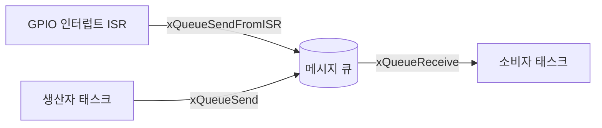

<Callout type="info">
  **이번 문서의 목표:** 이 파일을 다 읽으면 RTOS에서 태스크 간·태스크-ISR 간 자원 공유와 데이터 전달에 세마포어·뮤텍스·메시지 큐 중 무엇을 골라야 하는지 판단하고, 컨텍스트 스위치의 비용을 사이클 단위로 계산할 수 있다.
</Callout>

## 왜 임베디드에서 동기화 도구를 다시 배워야 하는가

세마포어·뮤텍스라는 이름 자체는 독학사 2단계 운영체제 10편(임계 구역과 프로세스 동기화)에서 이미 배운 개념입니다. 그 편에서 배운 임계 구역의 3조건(상호 배제·진행·한정 대기), 세마포어의 P·V 연산, 뮤텍스의 소유권 개념은 임베디드 RTOS에서도 그대로 성립합니다. 다만 임베디드 시스템에는 범용 운영체제(GPOS)에 없는 제약이 하나 추가됩니다 — **인터럽트 서비스 루틴**(Interrupt Service Routine, ISR)이 태스크와 자원을 주고받아야 한다는 점입니다.

08편에서 배운 것처럼 ISR은 매우 짧게, 빠르게 실행되어야 하고 절대 대기(block)하면 안 됩니다. 그런데 세마포어·뮤텍스·큐 같은 동기화 도구를 잘못 쓰면 ISR 안에서 실행이 멈춰버릴 수 있습니다. 이 편은 "일반 OS 동기화 지식 위에, ISR과 안전하게 상호작용하는 규칙"을 추가로 쌓는 데 초점을 맞춥니다.

> **쉽게 말하면:** 일반 OS 동기화가 "여러 태스크가 사이좋게 자원을 나눠 쓰는 규칙"이었다면, RTOS 동기화는 여기에 "번개처럼 끼어드는 인터럽트와도 안전하게 데이터를 주고받는 규칙"이 하나 더 붙습니다.

## 1. 세마포어 — RTOS에서는 ISR과의 신호 전달에도 쓰인다

**세마포어**(semaphore)의 정의와 P·V(또는 take·give) 연산은 운영체제 10편과 동일합니다. RTOS에서 세마포어가 특히 중요한 이유는, **ISR이 태스크에게 "일이 생겼다"는 신호를 보내는 표준적인 방법**이기 때문입니다.

GPIO 인터럽트가 발생했을 때, ISR 안에서 무거운 처리(센서값 파싱, 화면 갱신 등)를 직접 하면 인터럽트 지연(06편)이 늘어나 다른 인터럽트를 놓칠 위험이 커집니다. 대신 ISR은 **이진 세마포어**(binary semaphore)를 "주기만"(give) 하고 즉시 리턴하며, 실제 무거운 처리는 그 세마포어를 기다리던(take) 일반 태스크가 맡습니다. 이 패턴을 **인터럽트 지연 처리**(deferred interrupt handling)라 부릅니다.

```c
/* ISR: 아주 짧게, 세마포어만 주고 즉시 리턴 */
void GPIO_IRQHandler(void) {
    clear_interrupt_flag();          /* 인터럽트 플래그 해제 */
    xSemaphoreGiveFromISR(dataReadySem, &xHigherPriorityTaskWoken);
    portYIELD_FROM_ISR(xHigherPriorityTaskWoken);
}

/* 태스크: 세마포어를 기다렸다가 무거운 처리 수행 */
void SensorTask(void *pv) {
    for (;;) {
        xSemaphoreTake(dataReadySem, portMAX_DELAY);  /* 신호 올 때까지 대기 */
        process_sensor_data();                        /* 무거운 처리는 여기서 */
    }
}
```

여기서 함수 이름이 `xSemaphoreGiveFromISR`처럼 **`FromISR`이 붙은 별도 버전**이라는 점이 시험에서 자주 나오는 포인트입니다. ISR 안에서는 절대 대기할 수 없으므로, 일반 `xSemaphoreGive`가 아니라 **대기하지 않고 즉시 반환하는 ISR 전용 API**를 써야 합니다.

**자주 틀리는 점**: "ISR 안에서도 일반 세마포어 함수(예: `xSemaphoreTake`)를 그대로 호출해도 된다"는 생각은 틀렸습니다. 일반 `take` 함수는 대기 상태로 전환될 수 있는데, ISR은 컨텍스트 자체가 태스크가 아니므로 대기 상태로 전환될 수 없습니다. ISR에서는 반드시 `FromISR` 접미사가 붙은, 논블로킹으로 설계된 전용 API만 써야 합니다.

## 2. 뮤텍스 — 태스크 간 자원 보호에는 세마포어보다 뮤텍스

운영체제 10편에서 배운 것처럼 **뮤텍스**(mutex)는 "잠근 태스크만 풀 수 있다"는 **소유권**(ownership) 개념이 있는 상호 배제 전용 락입니다. RTOS에서 두 태스크가 같은 공유 자원(예: I2C 버스, 전역 변수)에 접근할 때는 이진 세마포어가 아니라 **뮤텍스를 쓰는 것이 원칙**입니다. 이유는 두 가지입니다.

1. **소유권 확인**: 뮤텍스는 락을 건 태스크만 풀 수 있어, 실수로 다른 태스크가 남의 락을 풀어버리는 논리 오류를 막을 수 있습니다. 세마포어는 소유권이 없어 이런 실수를 막지 못합니다.
2. **우선순위 상속**: 대부분의 RTOS(FreeRTOS 포함)는 뮤텍스에 한해 **우선순위 상속**(priority inheritance) 프로토콜을 지원합니다. 이 내용은 16편에서 시나리오와 함께 전 과정을 다룹니다. 이진 세마포어에는 이 기능이 없습니다.

**자주 틀리는 점**: "뮤텍스는 ISR에서 자원 보호에 써도 된다"는 생각은 틀렸습니다. 뮤텍스는 소유권 개념 때문에 **반드시 그것을 잠근 주체(태스크)가 풀어야 하는데, ISR은 태스크가 아니므로 뮤텍스를 잠그거나 풀 수 없습니다.** ISR과 관련된 동기화에는 세마포어(주로 이진 세마포어)를 쓰고, 태스크끼리의 자원 보호에는 뮤텍스를 쓴다는 구분이 시험의 핵심 포인트입니다.

| 항목 | 이진 세마포어 | 뮤텍스 |
|------|------|------|
| 소유권 | 없음(누구든 give 가능) | 있음(잠근 태스크만 unlock 가능) |
| ISR에서 사용 | 가능(`FromISR` 버전으로 give) | 불가능(태스크 개념이 없는 ISR은 소유할 수 없음) |
| 우선순위 상속 | 지원하지 않음 | 지원함(16편) |
| 주된 용도 | ISR → 태스크 신호 전달, 이벤트 알림 | 태스크 간 공유 자원(전역 변수, 버스, 하드웨어 레지스터) 보호 |

## 3. 메시지 큐 — 신호가 아니라 "데이터 자체"를 주고받기

세마포어는 "일이 생겼다/안 생겼다"라는 신호 하나만 전달할 뿐, 데이터 자체를 옮기지 못합니다. 여러 바이트로 이루어진 실제 데이터(센서 측정값, 통신 프레임 등)를 태스크와 태스크 사이, 또는 ISR과 태스크 사이에서 안전하게 주고받으려면 **메시지 큐**(message queue)를 씁니다.

메시지 큐는 정해진 개수의 **슬롯**(항목을 저장하는 칸)을 가진 원형 버퍼로, 한쪽(생산자, producer)이 데이터를 넣고 다른 쪽(소비자, consumer)이 데이터를 꺼내는 **생산자-소비자 패턴**(producer-consumer pattern)의 표준 구현입니다.

```c
QueueHandle_t sensorQueue;  /* 큐 핸들 */

/* 생산자 태스크: 센서값을 큐에 넣는다 */
void ProducerTask(void *pv) {
    int32_t value;
    for (;;) {
        value = read_sensor();
        /* 큐가 가득 차면 최대 100틱까지 대기, 그래도 못 넣으면 실패 */
        if (xQueueSend(sensorQueue, &value, pdMS_TO_TICKS(100)) != pdPASS) {
            log_queue_full_error();
        }
    }
}

/* 소비자 태스크: 큐에서 값을 꺼내 처리한다 */
void ConsumerTask(void *pv) {
    int32_t value;
    for (;;) {
        if (xQueueReceive(sensorQueue, &value, portMAX_DELAY) == pdPASS) {
            handle_value(value);
        }
    }
}
```

메시지 큐의 동작을 슬롯이 3개인 경우로 표에 추적해 보겠습니다.

| 순서 | 동작 | 큐 상태(슬롯 3개) | 결과 |
|------|------|------|------|
| 1 | 생산자가 값 A를 `xQueueSend` | [A] | 즉시 성공(빈 슬롯 있음) |
| 2 | 생산자가 값 B를 `xQueueSend` | [A, B] | 즉시 성공 |
| 3 | 생산자가 값 C를 `xQueueSend` | [A, B, C] | 즉시 성공(슬롯 가득 참) |
| 4 | 생산자가 값 D를 `xQueueSend`(대기 시간 100틱 지정) | [A, B, C] | 큐가 가득 차 대기 상태로 전환 |
| 5 | 소비자가 `xQueueReceive` 호출 | [B, C] | A를 꺼내고, 대기 중이던 생산자가 깨어남 |
| 6 | 대기하던 생산자의 D가 큐에 들어감 | [B, C, D] | 성공 |

**결과 해석**: 큐가 가득 찬 상태에서 생산자가 값을 넣으려 하면 지정한 시간만큼 대기하고, 그사이 소비자가 하나를 꺼내면 즉시 자리가 생겨 대기하던 생산자가 이어서 넣을 수 있습니다. 이 자동 대기·재개 동작 덕분에, 생산자와 소비자의 실행 속도가 서로 다르더라도(센서는 빠르게 값을 만들고 처리 태스크는 느리게 소비하는 경우 등) 프로그래머가 직접 세마포어와 버퍼를 조합해 만들 필요 없이 큐 하나로 안전하게 처리할 수 있습니다.

**자주 틀리는 점**: "메시지 큐는 ISR에서 못 쓴다"는 생각은 틀렸습니다. 세마포어와 마찬가지로 `xQueueSendFromISR`, `xQueueReceiveFromISR`처럼 **논블로킹 ISR 전용 버전**이 제공되어, ISR에서도 큐에 데이터를 넣거나 꺼낼 수 있습니다. 다만 이 경우도 일반 버전이 아니라 반드시 `FromISR` 버전을 써야 한다는 원칙은 동일합니다.



## 4. 컨텍스트 스위치 — 동기화 도구를 쓸 때마다 드는 숨은 비용

**컨텍스트 스위치**(context switch, 문맥 교환)는 06편·08편에서 다룬 개념으로, CPU가 실행하던 태스크를 멈추고 다른 태스크로 넘어갈 때 **현재 태스크의 실행 상태(레지스터 값, 프로그램 카운터(PC), 스택 포인터(SP) 등)를 저장하고, 다음 태스크의 저장된 상태를 복원하는 과정**입니다.

세마포어를 주고받거나(give/take), 큐에 데이터를 넣고 꺼내는 동작은 그 자체로는 짧지만, 그 결과로 **더 높은 우선순위의 태스크가 깨어나면 즉시 컨텍스트 스위치가 일어납니다.** 이 컨텍스트 스위치 자체의 비용이 동기화 설계에서 반드시 고려해야 할 오버헤드입니다.

컨텍스트 스위치 한 번에 드는 시간을 계산해 보겠습니다. Cortex-M 계열 MCU가 클록 주파수 100MHz로 동작하고, 컨텍스트 스위치 한 번에 레지스터 저장·복원과 스케줄러 판단을 합쳐 약 200 CPU 사이클이 걸린다고 가정합니다.

$$
\text{한 사이클의 시간} = \frac{1}{100 \times 10^6 \text{Hz}} = 10 \text{ns}
$$

$$
\text{컨텍스트 스위치 1회 시간} = 200 \times 10\text{ns} = 2000\text{ns} = 2\mu s
$$

이 태스크가 1ms(1000μs)마다 세마포어를 통해 다른 태스크를 깨운다면, 컨텍스트 스위치가 그 주기마다 최소 2회(대기 태스크가 깨어날 때, 원래 태스크로 돌아올 때) 일어난다고 가정할 때 오버헤드 비율은 다음과 같습니다.

$$
\text{오버헤드 비율} = \frac{2 \times 2\mu s}{1000\mu s} \times 100 = 0.4\%
$$

**결과 해석**: 이 예제에서는 오버헤드가 전체 주기의 0.4퍼센트로 크지 않지만, 만약 태스크가 100μs마다 반복하고 그때마다 여러 번 동기화를 일으킨다면 같은 2μs짜리 컨텍스트 스위치도 전체 시간의 상당 부분을 차지하게 됩니다. **동기화 도구(세마포어·뮤텍스·큐)를 지나치게 잦은 주기로 사용하면, 실제 하려던 일보다 컨텍스트 스위치 자체에 CPU 시간을 더 많이 쓰게 될 수 있다**는 것이 이 계산이 보여주는 설계 교훈입니다.

> **자주 틀리는 점**: "동기화 도구를 쓰는 것 자체는 공짜(비용 없음)"라고 생각하면 안 됩니다. P·V 연산이나 큐 송수신 코드 자체의 실행 시간은 매우 짧지만, 그로 인해 유발되는 컨텍스트 스위치의 비용까지 함께 계산해야 정확한 응답 시간·인터럽트 지연 분석(06편, 13편)이 가능합니다.

## 핵심 정리

- 세마포어·뮤텍스의 기본 정의는 운영체제 10편과 같지만, RTOS에서는 ISR과 안전하게 상호작용하는 것이 추가 요구사항이다.
- ISR은 절대 대기할 수 없으므로, 세마포어와 큐 모두 `FromISR`이 붙은 논블로킹 전용 API로만 다뤄야 한다.
- 뮤텍스는 소유권이 있어 잠근 태스크만 풀 수 있고 우선순위 상속을 지원하지만, 이 소유권 개념 때문에 ISR에서는 쓸 수 없다. ISR과의 신호 전달에는 이진 세마포어를 쓴다.
- 메시지 큐는 신호만 전달하는 세마포어와 달리 실제 데이터를 슬롯 단위로 옮기며, 생산자-소비자 패턴을 자동으로 처리한다.
- 동기화 도구를 사용할 때마다 컨텍스트 스위치가 일어날 수 있고, 그 비용은 사이클 수와 클록 주파수로 계산할 수 있으며, 너무 잦은 동기화는 오버헤드가 전체 실행 시간에서 차지하는 비중을 키운다.

## 마무리 복습

<Quiz
  questionNumber={1}
  question="RTOS의 ISR(인터럽트 서비스 루틴)에서 세마포어를 다룰 때 지켜야 할 규칙으로 옳은 것은?"
  options={['일반 xSemaphoreGive 함수를 그대로 호출해도 무방하다', 'ISR에서는 대기(block)할 수 없으므로 FromISR이 붙은 논블로킹 전용 API를 써야 한다', 'ISR에서는 어떤 동기화 도구도 사용할 수 없다', 'ISR에서는 뮤텍스만 사용할 수 있고 세마포어는 사용할 수 없다']}
  correctAnswer={2}
  explanation="ISR은 대기 상태로 전환될 수 없는 컨텍스트이므로, 세마포어를 주고받을 때 반드시 xSemaphoreGiveFromISR처럼 논블로킹으로 설계된 ISR 전용 API를 사용해야 한다."
  optionExplanations={['일반 API는 대기 상태 전환을 전제로 설계되어 ISR 컨텍스트에서 안전하지 않다.', '정답. FromISR 전용 API는 대기하지 않고 즉시 반환하도록 설계되어 ISR에서 안전하게 쓸 수 있다.', 'ISR 전용 API를 통해 세마포어와 큐를 모두 사용할 수 있으므로 이 진술은 틀렸다.', '뮤텍스는 소유권 개념 때문에 ISR에서 쓸 수 없고, 오히려 ISR에서는 세마포어를 쓴다.']}
/>

<Quiz
  questionNumber={2}
  question="뮤텍스(mutex)를 ISR에서 잠그거나 풀 수 없는 근본적인 이유는?"
  options={['뮤텍스는 정수 값을 갖지 않기 때문이다', '뮤텍스는 소유권 개념이 있어 잠근 주체(태스크)가 풀어야 하는데 ISR은 태스크가 아니기 때문이다', '뮤텍스는 데이터를 저장할 슬롯이 없기 때문이다', 'ISR은 우선순위가 없기 때문이다']}
  correctAnswer={2}
  explanation="뮤텍스는 잠근 태스크만 풀 수 있다는 소유권 개념을 갖는다. ISR은 태스크라는 실행 주체 자체가 아니므로 이 소유권 모델에 들어맞지 않아 뮤텍스를 잠그거나 풀 수 없다."
  optionExplanations={['정수 값의 유무는 뮤텍스와 세마포어를 구분하는 특징이지, ISR 사용 불가의 근본 이유는 아니다.', '정답. 소유권 개념이 있는 뮤텍스는 태스크가 아닌 ISR에서 다룰 수 없다.', '슬롯은 메시지 큐의 구성 요소이며 뮤텍스와는 관련이 없다.', 'ISR도 인터럽트 벡터 우선순위를 가지지만, 이것이 뮤텍스 사용 불가의 이유는 아니다.']}
/>

<Quiz
  questionNumber={3}
  question="이진 세마포어와 뮤텍스의 차이에 대한 설명으로 옳지 않은 것은?"
  options={['이진 세마포어는 소유권 개념이 없어 다른 태스크나 ISR이 대신 give할 수 있다', '뮤텍스는 우선순위 상속 프로토콜을 지원하지만 이진 세마포어는 지원하지 않는다', '이진 세마포어와 뮤텍스는 값의 범위가 완전히 다르므로 둘 다 0~N 범위의 값을 가진다', 'ISR과 태스크 간 신호 전달에는 주로 이진 세마포어가 쓰인다']}
  correctAnswer={3}
  explanation="이진 세마포어는 0 또는 1의 두 상태만 가지며, 뮤텍스도 잠김/열림의 두 상태로 동작한다. 둘 다 0~N 범위의 값을 갖는다는 설명은 카운팅 세마포어와 혼동한 것으로 옳지 않다."
  optionExplanations={['이진 세마포어는 소유권이 없어 ISR을 포함한 다른 주체가 give할 수 있다는 설명은 옳다.', '우선순위 상속은 뮤텍스만 지원한다는 설명은 옳다.', '정답. 이진 세마포어와 뮤텍스는 모두 두 상태만 가지며, 0~N 범위는 카운팅 세마포어의 특징이므로 이 설명은 옳지 않다.', 'ISR과 태스크 간 신호 전달에 이진 세마포어가 쓰인다는 설명은 옳다.']}
/>

<Quiz
  questionNumber={4}
  question="슬롯이 2개인 메시지 큐에 이미 값 두 개가 채워진 상태에서 생산자가 xQueueSend를 대기 시간 없이(즉시 실패 허용) 호출하면 어떻게 되는가?"
  options={['가장 오래된 값을 자동으로 덮어쓰고 성공한다', '큐가 가득 찼으므로 대기하지 않고 즉시 실패를 반환한다', '큐 크기가 자동으로 늘어나 값이 추가된다', '소비자 태스크가 자동으로 실행되어 값을 비운다']}
  correctAnswer={2}
  explanation="큐가 가득 찬 상태에서 대기 시간을 0(또는 대기 없음)으로 지정하면, 자리가 날 때까지 기다리지 않고 즉시 실패(pdFAIL 등)를 반환한다. 큐를 덮어쓰거나 크기를 늘리는 동작은 기본 xQueueSend의 동작이 아니다."
  optionExplanations={['덮어쓰기는 별도의 오버라이트 전용 함수를 명시적으로 쓸 때의 동작이며 기본 동작이 아니다.', '정답. 대기 시간이 없으면 큐가 가득 찼을 때 즉시 실패를 반환한다.', '큐의 슬롯 개수는 생성 시 고정되며 자동으로 늘어나지 않는다.', '큐에 값을 넣는 동작이 소비자 태스크를 자동으로 깨우거나 실행시키지 않는다. 소비자는 스케줄러에 의해 별도로 실행된다.']}
/>

<Quiz
  questionNumber={5}
  question="컨텍스트 스위치(context switch)에서 저장·복원되는 대상으로 가장 옳은 것은?"
  options={['소스 코드 파일 자체', '레지스터 값, 프로그램 카운터, 스택 포인터 등 실행 상태', '메시지 큐에 쌓인 데이터 전체', 'MCU의 전원 공급 상태']}
  correctAnswer={2}
  explanation="컨텍스트 스위치는 현재 태스크의 실행 상태(레지스터, 프로그램 카운터, 스택 포인터 등)를 저장하고 다음 태스크의 저장된 상태를 복원하는 과정이다."
  optionExplanations={['소스 코드 파일은 실행 중 상태와 무관하며 컨텍스트 스위치의 대상이 아니다.', '정답. 레지스터·프로그램 카운터·스택 포인터 등 실행 상태를 저장·복원하는 것이 컨텍스트 스위치다.', '큐에 쌓인 데이터는 별도의 자료구조에 저장되며 컨텍스트 스위치의 저장·복원 대상이 아니다.', '전원 공급 상태 관리는 저전력 설계(17편)의 영역이지 컨텍스트 스위치의 정의와 무관하다.']}
/>

<Quiz
  questionNumber={6}
  question="클록 주파수 100MHz인 MCU에서 컨텍스트 스위치 한 번에 200 CPU 사이클이 걸린다면, 그 시간은?"
  options={['200ns', '2μs', '20μs', '200μs']}
  correctAnswer={2}
  explanation="한 사이클의 시간은 1/100MHz = 10ns다. 200사이클 × 10ns = 2000ns = 2μs가 컨텍스트 스위치 1회에 걸리는 시간이다."
  optionExplanations={['200ns는 20사이클에 해당하는 시간으로 계산이 부족하다.', '정답. 200사이클 × 10ns = 2000ns = 2μs다.', '20μs는 자릿수를 한 번 더 잘못 곱한 값이다.', '200μs는 실제 값보다 100배 크다.']}
/>

<Quiz
  questionNumber={7}
  question="동기화 도구 사용과 컨텍스트 스위치 오버헤드의 관계에 대한 설명으로 옳은 것은?"
  options={['세마포어의 P·V 연산 자체는 비용이 0이므로 컨텍스트 스위치 비용도 고려할 필요가 없다', '동기화 도구를 매우 짧은 주기로 자주 사용하면 컨텍스트 스위치 비용이 전체 실행 시간에서 차지하는 비중이 커질 수 있다', '컨텍스트 스위치 비용은 태스크 개수와 무관하게 항상 0이다', '메시지 큐를 쓰면 컨텍스트 스위치가 절대 발생하지 않는다']}
  correctAnswer={2}
  explanation="동기화로 인해 더 높은 우선순위 태스크가 깨어나면 컨텍스트 스위치가 일어나고, 그 비용은 사이클 수만큼 실제로 소요된다. 동기화를 매우 잦은 주기로 반복하면 이 비용이 전체 실행 시간에서 차지하는 비율이 커질 수 있다."
  optionExplanations={['P·V 연산 자체의 실행 시간은 짧지만, 그로 인해 유발되는 컨텍스트 스위치의 비용은 0이 아니며 반드시 고려해야 한다.', '정답. 잦은 동기화는 컨텍스트 스위치 오버헤드의 비중을 키울 수 있다.', '컨텍스트 스위치는 실제로 사이클을 소모하는 동작이며 0이 아니다.', '메시지 큐를 통해 더 높은 우선순위 태스크가 깨어나면 큐 사용 시에도 컨텍스트 스위치가 발생할 수 있다.']}
/>

## 참고 자료

- [FreeRTOS Reference Manual](https://www.freertos.org/media/2018/FreeRTOS_Reference_Manual_V10.0.0.pdf)
- [FreeRTOS documentation](https://www.freertos.org/Documentation/00-Overview)
- [국가평생교육진흥원 독학학위제 - 과목별 평가영역](https://bdes.nile.or.kr/nile/study/nStudy2_1.do)
