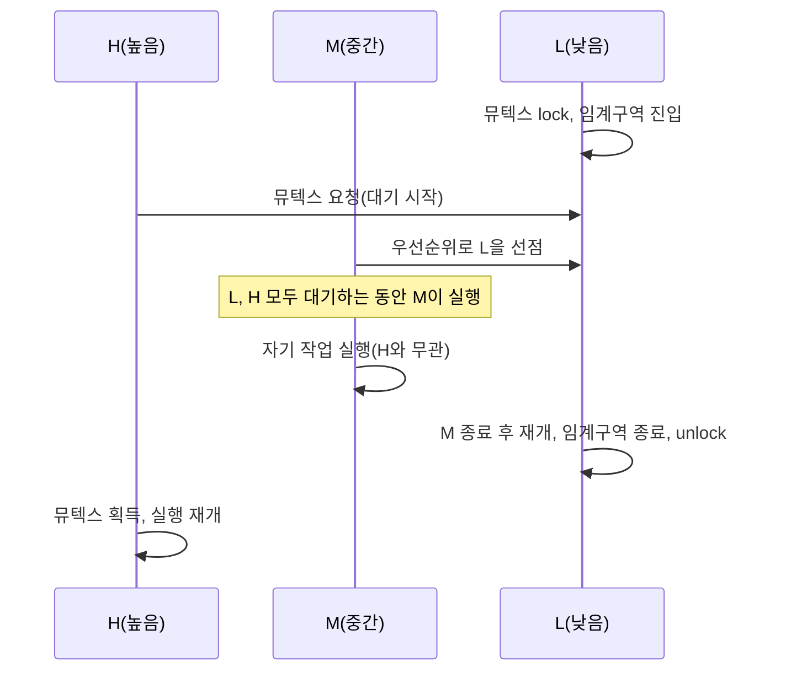

<Callout type="info">
  **이번 문서의 목표:** 이 파일을 다 읽으면 우선순위 역전이 벌어지는 조건을 시나리오 표로 재현하고, 우선순위 상속 프로토콜이 이를 어떻게 막는지 설명하며, RTOS에서 임계구역을 설계할 때 지켜야 할 원칙을 말할 수 있다.
</Callout>

## 왜 "높은 우선순위인데 못 실행되는" 역설이 생기는가

14편에서 RM은 "높은 우선순위 태스크가 항상 낮은 우선순위 태스크를 이긴다"는 전제 위에서 스케줄 가능성을 계산했습니다. 그런데 실제 시스템에서는 이 전제가 깨지는 상황이 벌어질 수 있습니다. 바로 **여러 태스크가 15편에서 배운 뮤텍스 같은 공유 자원을 함께 쓸 때**입니다. 높은 우선순위 태스크가 필요한 자원을 낮은 우선순위 태스크가 이미 잠그고 있다면, 아무리 우선순위가 높아도 그 자원이 풀릴 때까지는 기다릴 수밖에 없습니다. 문제는 이 기다림이 **중간 우선순위 태스크 때문에 한없이 길어질 수 있다**는 데 있습니다. 이 현상을 **우선순위 역전**(priority inversion)이라 부르며, 1997년 화성 탐사선 **패스파인더**(Mars Pathfinder)가 실제로 이 문제로 재부팅을 반복했던 사례가 임베디드 업계에서 유명한 교훈으로 남아 있습니다.

> **쉽게 말하면:** 사장님(고우선순위)이 결재판(공유 자원)을 신입사원(저우선순위)이 들고 있어 못 받고 기다리는 사이, 사장님과 아무 상관 없는 대리(중간 우선순위)가 계속 자기 일을 먼저 처리해서, 결과적으로 사장님이 대리에게 밀려 하염없이 기다리게 되는 상황입니다.

## 1. 우선순위 역전 시나리오 — 시간표로 재현하기

세 태스크 H(높음, high), M(중간, medium), L(낮음, low)이 있고, H와 L이 공유 자원 하나(뮤텍스로 보호됨)를 함께 씁니다. M은 이 자원과 무관한 별개의 작업을 합니다. 우선순위는 $H > M > L$입니다.

| 시각 | 사건 | H 상태 | M 상태 | L 상태 | 뮤텍스 |
|------|------|------|------|------|------|
| t0 | L이 실행을 시작해 뮤텍스를 잠금(lock) | 대기(아직 미도착) | 대기(아직 미도착) | 실행 중(임계구역 진입) | L이 소유 |
| t1 | H가 도착해 같은 뮤텍스를 요청 | 대기(뮤텍스 대기) | 대기(아직 미도착) | 계속 실행 중(임계구역 안) | L이 소유 |
| t2 | M이 도착. M은 뮤텍스와 무관하므로 우선순위 규칙대로 L을 선점 | 대기(뮤텍스 대기) | **실행 중**(L보다 우선순위 높음) | 선점당해 대기 | L이 소유(들고만 있고 실행은 못함) |
| t3 | M이 자기 작업을 계속 실행(H는 여전히 대기, L은 뮤텍스를 쥔 채 대기) | 대기(뮤텍스 대기) | 계속 실행 중 | 대기(뮤텍스는 들고 있으나 CPU를 못 받음) | L이 소유 |
| t4 | M의 작업이 끝나야 비로소 L이 다시 실행되어 임계구역을 마치고 뮤텍스 해제 | 대기(뮤텍스 대기) | 실행 종료 | 실행 재개, 임계구역 종료 후 unlock | 해제 |
| t5 | H가 마침내 뮤텍스를 획득해 실행 재개 | **실행 재개** | 종료됨 | 종료됨 | H가 소유 |

**결과 해석**: 우선순위가 가장 높은 H가 실질적으로 기다린 대상은 자신보다 우선순위가 낮은 L **하나가 아니라, 그 사이에 끼어든 M의 실행 시간까지 통째로** 기다린 것입니다. H와 M은 애초에 아무 자원도 공유하지 않는데도, L이 뮤텍스를 쥔 채로 M에게 선점당하는 바람에 H가 간접적으로 M에게 발목을 잡힌 셈입니다. 더 심각한 문제는, **M과 같은 중간 우선순위 태스크가 여러 개, 계속 새로 도착한다면 H의 대기 시간에는 이론적 상한이 없다**는 점입니다 — 이를 **무한(unbounded) 우선순위 역전**이라 부르며, hard real-time에서는 이것이 곧 데드라인 위반으로 이어질 수 있는 심각한 결함입니다.

**자주 틀리는 점**: "우선순위 역전은 H가 L을 직접 기다리는 것뿐이다"라고 오해하면 안 됩니다. H가 L을 기다리는 것 자체는(L이 임계구역을 짧게 유지한다면) 어쩔 수 없는 정상적인 대기입니다. 문제의 핵심은 **그 대기 도중 자원과 무관한 M이 끼어들어 대기 시간을 예측할 수 없이 늘린다**는 데 있습니다.

## 2. 우선순위 상속 — L에게 잠시 H의 우선순위를 빌려주기

**우선순위 상속**(Priority Inheritance Protocol, PIP)은 이 문제를 다음 규칙으로 해결합니다.

> 어떤 태스크가 임계구역(뮤텍스로 보호되는 자원)을 잠근 상태에서, 더 높은 우선순위의 태스크가 같은 자원을 요청해 대기하게 되면, 그 자원을 잠근 태스크는 대기 중인 태스크 중 **가장 높은 우선순위를 임시로 상속**받는다. 임계구역을 벗어나 자원을 풀면 원래 우선순위로 즉시 돌아간다.

같은 시나리오에 PIP를 적용하면 어떻게 달라지는지 시간표로 다시 추적합니다.

| 시각 | 사건 | H 상태 | M 상태 | L 상태(및 유효 우선순위) | 뮤텍스 |
|------|------|------|------|------|------|
| t0 | L이 실행을 시작해 뮤텍스를 잠금 | 대기(아직 미도착) | 대기(아직 미도착) | 실행 중(원래 우선순위: 낮음) | L이 소유 |
| t1 | H가 도착해 뮤텍스를 요청, 대기 상태가 되며 **L이 H의 우선순위를 상속** | 대기(뮤텍스 대기) | 대기(아직 미도착) | 계속 실행 중(유효 우선순위: **높음으로 상승**) | L이 소유 |
| t2 | M이 도착. M의 우선순위(중간)는 L의 상속된 우선순위(높음)보다 낮으므로 **선점하지 못함** | 대기(뮤텍스 대기) | 대기(L보다 유효 우선순위가 낮아 실행 못함) | 계속 실행 중(유효 우선순위: 높음) | L이 소유 |
| t3 | L이 임계구역을 마치고 뮤텍스 해제, 즉시 원래 우선순위(낮음)로 복귀 | 대기 해제 준비 | 대기 계속 | 원래 우선순위로 복귀 | 해제 |
| t4 | H가 뮤텍스를 획득해 실행 | **실행 재개** | 대기 | 대기(원래 우선순위가 M보다 낮으므로 순서상 M보다 나중) | H가 소유 |
| t5 | H가 임계구역 작업까지 마치고 종료, 이제 M이 실행 | 종료 | **실행 시작** | 대기 | - |

**결과 해석**: PIP를 적용하자 M은 t2에서 **L을 선점하지 못했습니다.** L이 H의 우선순위를 임시로 빌려 쓰는 동안에는 M보다 우선순위가 높아진 것처럼 취급되기 때문입니다. 그 결과 H는 오직 **L이 임계구역을 처리하는 시간만큼만** 기다리면 되고, 그 사이에 M이 끼어들어 대기를 늘리는 일이 없습니다. H의 최대 대기 시간이 "임계구역 하나의 길이"로 **한정(bounded**)된다는 것이 PIP의 핵심 효과입니다.

> **쉽게 말하면:** 우선순위 상속은 "결재판을 든 신입사원에게, 사장님이 기다리는 동안만 잠깐 사장님 직급을 빌려줘서, 대리가 새치기를 못 하게 만드는 것"입니다. 결재판을 반납하는 순간 신입사원은 다시 원래 직급으로 돌아갑니다.

## 3. 우선순위 상한 프로토콜 — 상속보다 한발 먼저 막기

**우선순위 상한 프로토콜**(Priority Ceiling Protocol, PCP)은 PIP를 한 단계 더 발전시킨 방식입니다. 각 뮤텍스(자원)마다 미리 **그 자원을 쓸 수 있는 태스크들 중 가장 높은 우선순위**를 "상한(ceiling)" 값으로 정해 둡니다. 그리고 어떤 태스크가 이 자원을 잠그는 순간, **그 즉시 태스크의 우선순위를 상한 값으로 즉시(요청자가 나타나기도 전에) 올려버립니다.**

| 항목 | 우선순위 상속(PIP) | 우선순위 상한(PCP) |
|------|------|------|
| 우선순위 상승 시점 | 더 높은 우선순위 태스크가 실제로 대기할 때 | 자원을 잠그는 즉시(대기자 유무와 무관) |
| 최대 블로킹 시간 | 자원을 공유하는 태스크 하나의 임계구역만큼 | 여러 자원을 거쳐도 임계구역 하나만큼으로 한정 가능(더 엄격히 증명됨) |
| 연쇄(교착) 방지 | 여러 자원을 중첩해서 잠그면 데드락 위험이 남을 수 있음 | 설계 규칙상 데드락이 발생하지 않도록 증명 가능 |
| 구현 복잡도 | 상대적으로 단순 | 상한 값을 자원별로 미리 계산해야 해 더 복잡 |

**자주 틀리는 점**: "우선순위 상속과 우선순위 상한은 같은 것이다"라고 혼동하면 안 됩니다. PIP는 **실제로 더 높은 우선순위 태스크가 나타나 대기할 때만** 우선순위를 올리는 **사후 대응**형이고, PCP는 자원을 잠그는 즉시 **미리 정해둔 상한**으로 올리는 **사전 예방**형입니다. 시험에서는 "누가 대기하는지 확인한 뒤 올리는가, 아니면 잠그자마자 무조건 올리는가"로 두 프로토콜을 구분하는 문제가 나올 수 있습니다.

## 4. 임계구역 설계 원칙 — 우선순위 역전을 줄이는 실전 규칙

우선순위 상속·상한 프로토콜은 RTOS 커널이 제공하는 안전망이지만, 개발자가 임계구역을 설계하는 습관 자체도 우선순위 역전의 영향을 줄이는 데 중요합니다.

1. **임계구역은 최대한 짧게 유지한다.** PIP를 쓰더라도 H가 기다리는 시간은 결국 "L이 임계구역에 머무는 시간"에 비례합니다. 임계구역 안에서 로깅, 통신, 긴 계산처럼 시간이 걸리는 작업을 하지 않고, 꼭 보호해야 할 최소한의 코드만 남겨야 합니다.
2. **ISR에서는 뮤텍스를 쓰지 않는다.** 15편에서 다룬 것처럼 뮤텍스는 소유권 개념 때문에 ISR에서 잠그거나 풀 수 없습니다. ISR과 태스크가 자원을 공유해야 한다면 인터럽트를 짧게 비활성화하거나(critical section 매크로), 이진 세마포어로 신호만 전달하고 실제 자원 접근은 태스크에서 처리해야 합니다.
3. **여러 자원을 중첩해서 잠그는 순서를 통일한다.** 두 태스크가 자원 A와 B를 서로 다른 순서로 잠그면(태스크1은 A→B, 태스크2는 B→A) 교착 상태(deadlock, 11편에서 배운 개념)로 이어질 수 있습니다. 모든 태스크가 항상 같은 순서로 자원을 잠그도록 설계 규칙을 정해야 합니다.
4. **RTOS가 우선순위 상속을 지원하는 뮤텍스 API를 실제로 쓰는지 확인한다.** 일부 RTOS는 기본 뮤텍스와 별개로 "재귀 뮤텍스", "우선순위 상속 없는 단순 뮤텍스"를 함께 제공하기도 하므로, hard real-time 태스크가 공유하는 자원에는 반드시 우선순위 상속이 적용되는 뮤텍스를 선택해야 합니다.
5. **스케줄 가능성 분석에 블로킹 시간을 포함한다.** 14편의 RM 스케줄 가능성 공식은 원래 태스크 간 자원 공유가 없다는 가정 위에서 유도되었습니다. 실제로 뮤텍스를 공유한다면, 그 태스크의 최악응답시간 계산에 **최대 블로킹 시간**(자원을 다른 태스크에 뺏겨 기다릴 수 있는 최악의 시간)을 더해서 다시 검증해야 합니다.

> **쉽게 말하면:** 프로토콜(PIP·PCP)은 사고가 나도 피해를 줄여주는 안전벨트이고, 임계구역을 짧게 쓰는 습관은 애초에 사고 자체가 덜 일어나게 하는 운전 습관입니다. 둘 다 있어야 안전합니다.

## 핵심 정리

- 우선순위 역전은 낮은 우선순위 태스크가 자원을 쥐고 있는 동안, 그 자원과 무관한 중간 우선순위 태스크가 끼어들어 높은 우선순위 태스크의 대기 시간을 예측 불가능하게 늘리는 현상이다.
- 우선순위 상속(PIP)은 자원을 쥔 태스크가 대기 중인 더 높은 우선순위를 임시로 상속받아, 중간 우선순위 태스크의 선점을 막고 대기 시간을 임계구역 하나만큼으로 한정한다.
- 우선순위 상한(PCP)은 자원을 잠그는 즉시 미리 정해둔 상한 우선순위로 올리는 사전 예방형 프로토콜로, PIP보다 더 엄격하게 데드락 없음을 보장할 수 있다.
- 임계구역은 최대한 짧게, ISR에서는 뮤텍스 대신 세마포어를 쓰고, 자원 잠금 순서를 통일하며, 우선순위 상속을 지원하는 뮤텍스를 선택하고, 블로킹 시간을 스케줄 가능성 분석에 포함해야 한다.
- 화성 탐사선 패스파인더 사례처럼, 우선순위 역전은 실제 임베디드 시스템에서 재현된 바 있는 실질적 위험이다.

## 마무리 복습

<Quiz
  questionNumber={1}
  question="우선순위 역전(priority inversion)에 대한 설명으로 가장 정확한 것은?"
  options={['높은 우선순위 태스크가 낮은 우선순위 태스크를 직접 기다리는 모든 상황', '낮은 우선순위 태스크가 자원을 쥔 사이, 자원과 무관한 중간 우선순위 태스크가 끼어들어 높은 우선순위 태스크의 대기가 예측 불가능하게 길어지는 현상', '높은 우선순위 태스크가 실행되는 동안 낮은 우선순위 태스크가 완전히 실행되지 못하는 현상', 'RTOS 스케줄러가 우선순위 값을 잘못 계산해 발생하는 소프트웨어 버그']}
  correctAnswer={2}
  explanation="우선순위 역전의 핵심은 단순히 H가 L을 기다리는 것이 아니라, 자원과 무관한 중간 우선순위 태스크가 끼어들어 대기 시간이 통제 불가능하게 늘어난다는 데 있다."
  optionExplanations={['H가 L을 잠깐 기다리는 것 자체는 정상적인 자원 대기이며 문제의 본질이 아니다.', '정답. 중간 우선순위 태스크의 개입으로 대기 시간이 예측 불가능해지는 것이 우선순위 역전의 핵심이다.', '이는 오히려 저우선순위 태스크의 기아 현상에 가까운 설명이며 우선순위 역전의 정의와 다르다.', '우선순위 역전은 스케줄러의 계산 오류가 아니라 자원 공유 구조에서 자연스럽게 발생할 수 있는 현상이다.']}
/>

<Quiz
  questionNumber={2}
  question="본문의 시나리오(H, M, L 세 태스크, H와 L이 뮤텍스를 공유하고 M은 무관)에서 우선순위 역전이 발생하는 결정적 사건은?"
  options={['H가 도착해 뮤텍스를 요청하는 시점', 'M이 도착해 우선순위 규칙에 따라 L을 선점하는 시점', 'L이 뮤텍스를 처음 잠그는 시점', 'H가 마침내 뮤텍스를 획득하는 시점']}
  correctAnswer={2}
  explanation="L이 뮤텍스를 쥔 상태에서 M이 도착해 우선순위 규칙대로 L을 선점하는 순간, H는 L뿐 아니라 M의 실행까지 간접적으로 기다리게 되어 우선순위 역전이 실질적으로 발생한다."
  optionExplanations={['H가 뮤텍스를 요청하는 것 자체는 정상적인 대기 요청이며 아직 역전이 발생한 것은 아니다.', '정답. M이 L을 선점하는 순간 H의 대기가 M에게까지 간접적으로 좌우되면서 우선순위 역전이 발생한다.', 'L이 뮤텍스를 잠그는 것 자체는 정상적인 임계구역 진입이다.', 'H가 뮤텍스를 획득하는 시점은 역전 상황이 해소되는 시점이다.']}
/>

<Quiz
  questionNumber={3}
  question="우선순위 상속 프로토콜(PIP)이 본문 시나리오에 적용되었을 때 달라지는 점으로 옳은 것은?"
  options={['H가 도착하는 순간 L의 뮤텍스가 즉시 강제로 해제된다', 'L이 H의 우선순위를 임시로 상속받아, M이 더 이상 L을 선점하지 못하게 된다', 'M의 우선순위가 영구적으로 가장 낮게 고정된다', 'H가 뮤텍스를 기다리지 않고 즉시 실행된다']}
  correctAnswer={2}
  explanation="PIP는 H가 뮤텍스를 요청해 대기하게 되면, 뮤텍스를 쥔 L이 H의 우선순위를 임시로 상속받도록 한다. 이 때문에 L의 유효 우선순위가 M보다 높아져 M이 더 이상 L을 선점할 수 없다."
  optionExplanations={['뮤텍스는 강제로 해제되지 않으며, L이 임계구역을 스스로 마쳐야 해제된다.', '정답. L이 H의 우선순위를 임시로 상속받아 M의 선점을 막는 것이 PIP의 핵심 동작이다.', 'M의 우선순위는 영구적으로 바뀌지 않으며, 단지 그 순간 L의 유효 우선순위가 더 높아질 뿐이다.', 'H는 여전히 L이 임계구역을 마칠 때까지는 기다려야 하며, 다만 그 대기 시간이 한정될 뿐이다.']}
/>

<Quiz
  questionNumber={4}
  question="우선순위 상속(PIP)과 우선순위 상한(PCP) 프로토콜의 차이로 옳은 것은?"
  options={['PIP는 자원을 잠그는 즉시 우선순위를 올리고, PCP는 더 높은 우선순위 태스크가 실제로 대기할 때만 올린다', 'PCP는 자원을 잠그는 즉시 미리 정해둔 상한 우선순위로 올리고, PIP는 더 높은 우선순위 태스크가 실제로 대기할 때 상속받는다', 'PIP와 PCP는 완전히 동일한 프로토콜의 다른 이름일 뿐이다', 'PCP는 뮤텍스에는 적용할 수 없고 세마포어에만 적용된다']}
  correctAnswer={2}
  explanation="PCP는 자원을 잠그는 순간 대기자 유무와 무관하게 미리 정해진 상한 우선순위로 즉시 올리는 사전 예방형이고, PIP는 실제로 더 높은 우선순위 태스크가 나타나 대기할 때 그 우선순위를 상속받는 사후 대응형이다."
  optionExplanations={['설명이 서로 뒤바뀌었다. 즉시 올리는 쪽은 PCP이고, 대기 시 상속받는 쪽은 PIP다.', '정답. PCP는 사전 예방형(즉시 상한 적용), PIP는 사후 대응형(대기 발생 시 상속)이다.', '두 프로토콜은 우선순위를 올리는 시점과 방식이 다른 별개의 프로토콜이다.', 'PCP도 PIP와 마찬가지로 뮤텍스로 보호되는 자원에 적용되는 프로토콜이다.']}
/>

<Quiz
  questionNumber={5}
  question="ISR과 임계구역 설계에 대한 설명으로 옳지 않은 것은?"
  options={['임계구역은 최대한 짧게 유지해 다른 태스크의 대기 시간을 줄여야 한다', 'ISR과 태스크가 자원을 공유해야 한다면 뮤텍스보다 이진 세마포어나 짧은 인터럽트 비활성화를 쓰는 것이 적절하다', '뮤텍스는 소유권 개념이 없어 ISR에서도 자유롭게 잠그고 풀 수 있다', '여러 자원을 중첩해서 잠글 때는 모든 태스크가 같은 순서로 잠그도록 통일해야 데드락을 줄일 수 있다']}
  correctAnswer={3}
  explanation="뮤텍스는 잠근 주체(태스크)만 풀 수 있는 소유권 개념을 가지므로, 태스크가 아닌 ISR에서는 잠그거나 풀 수 없다. 이 설명은 뮤텍스의 정의를 반대로 서술한 것이므로 옳지 않다."
  optionExplanations={['임계구역을 짧게 유지해야 한다는 설명은 옳다.', 'ISR과의 자원 공유에는 세마포어나 짧은 인터럽트 비활성화가 적절하다는 설명은 옳다.', '정답. 뮤텍스는 소유권 개념이 있어 ISR에서 사용할 수 없으므로 이 설명은 옳지 않다.', '자원 잠금 순서를 통일해야 데드락을 줄일 수 있다는 설명은 옳다.']}
/>

<Quiz
  questionNumber={6}
  question="RM 스케줄 가능성 분석에 뮤텍스로 보호되는 공유 자원이 있는 태스크 집합을 반영할 때 추가로 고려해야 하는 것은?"
  options={['각 태스크의 실행 시간을 절반으로 줄여서 계산한다', '최대 블로킹 시간을 태스크의 최악응답시간 계산에 더해서 검증한다', '공유 자원이 있는 태스크는 스케줄 가능성 분석 대상에서 제외한다', '주기를 모두 동일하게 맞춰서 계산한다']}
  correctAnswer={2}
  explanation="태스크 간 자원 공유가 있으면, 그 태스크가 다른 태스크에 자원을 뺏겨 기다릴 수 있는 최대 블로킹 시간을 최악응답시간 계산에 더해서 데드라인 준수 여부를 다시 검증해야 한다."
  optionExplanations={['실행 시간을 임의로 줄이는 것은 실제 동작을 반영하지 못하는 잘못된 방법이다.', '정답. 최대 블로킹 시간을 반영해야 자원 공유가 있는 상황에서도 정확한 스케줄 가능성 분석이 된다.', '자원을 공유하는 태스크도 여전히 스케줄 가능성 분석의 대상이며 제외할 수 없다.', '주기를 임의로 맞추는 것은 실제 태스크 집합의 특성을 반영하지 못하는 잘못된 방법이다.']}
/>

<Quiz
  questionNumber={7}
  question="다음 중 우선순위 역전·상속·상한에 대한 설명으로 옳지 않은 것은?"
  options={['우선순위 역전은 실제 임베디드 시스템(화성 탐사선 패스파인더)에서 재현된 바 있는 문제다', '우선순위 상속을 적용해도 H는 L이 임계구역을 처리하는 시간만큼은 기다려야 한다', '우선순위 상한 프로토콜은 우선순위 상속보다 항상 구현이 단순하다', '우선순위 상속과 상한 모두, 임계구역 자체를 짧게 유지하는 설계 습관을 대신하지는 못한다']}
  correctAnswer={3}
  explanation="우선순위 상한 프로토콜은 자원별 상한 값을 미리 계산해야 하므로 오히려 우선순위 상속보다 구현이 더 복잡하다. '항상 더 단순하다'는 설명은 옳지 않다."
  optionExplanations={['패스파인더 사례는 우선순위 역전이 실제로 재현된 유명한 임베디드 사례로 옳은 설명이다.', 'PIP를 적용해도 H가 L의 임계구역 처리 시간 자체를 기다려야 한다는 것은 옳은 설명이다.', '정답. PCP는 상한 값을 미리 계산해야 해 오히려 PIP보다 구현이 복잡한 경우가 많으므로 이 설명은 옳지 않다.', '두 프로토콜 모두 사고 발생 시 피해를 줄이는 안전망일 뿐, 임계구역을 짧게 유지하는 설계 습관을 대체하지 못한다는 것은 옳은 설명이다.']}
/>

## 참고 자료

- [FreeRTOS Reference Manual](https://www.freertos.org/media/2018/FreeRTOS_Reference_Manual_V10.0.0.pdf)
- [AWS FreeRTOS Documentation](https://docs.aws.amazon.com/freertos/)
- [국가평생교육진흥원 독학학위제 - 과목별 평가영역](https://bdes.nile.or.kr/nile/study/nStudy2_1.do)
