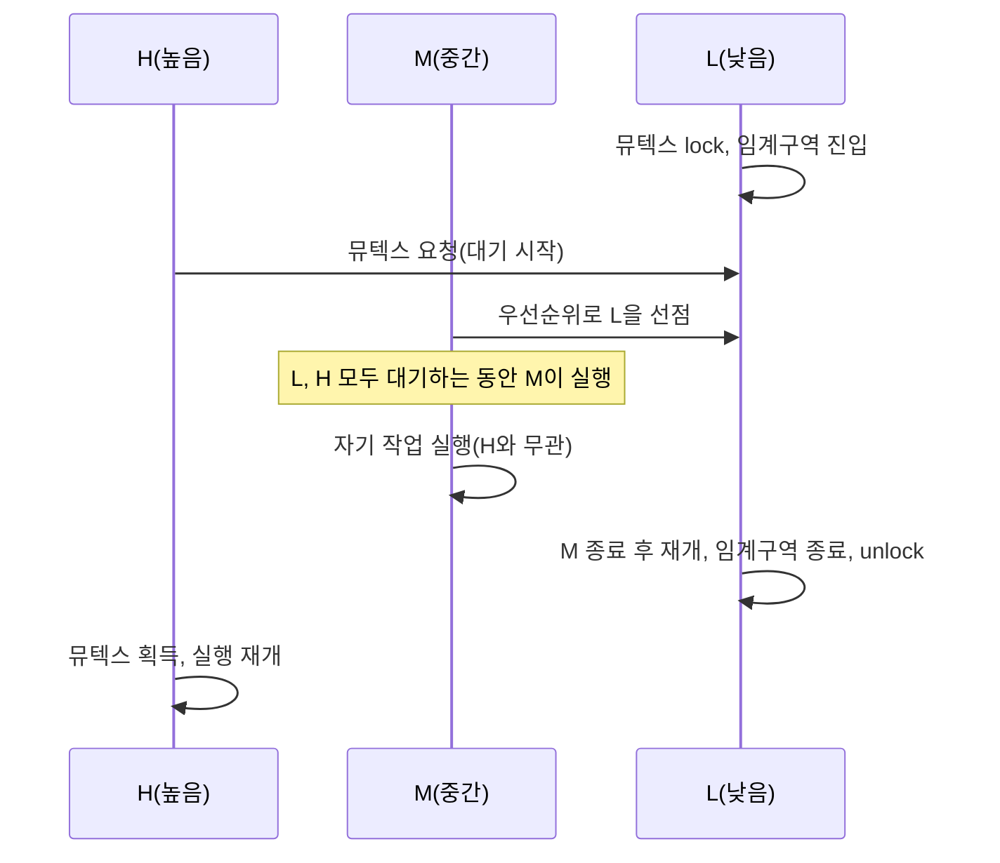

## 왜 "높은 우선순위인데 못 실행되는" 역설이 생기는가

14편에서 RM은 "높은 우선순위 태스크가 항상 낮은 우선순위 태스크를 이긴다"는 전제 위에서 스케줄 가능성을 계산했습니다. 바로 **여러 태스크가 15편에서 배운 뮤텍스 같은 공유 자원을 함께 쓸 때**입니다.

## 1. 우선순위 역전 시나리오 — 시간표로 재현하기

세 태스크 H(높음, high), M(중간, medium), L(낮음, low)이 있고, H와 L이 공유 자원 하나(뮤텍스로 보호됨)를 함께 씁니다. M은 이 자원과 무관한 별개의 작업을 합니다. 우선순위는 $H > M > L$입니다.

| 시각 | 사건 | H 상태 | M 상태 | L 상태 | 뮤텍스 |
|------|------|------|------|------|------|
| t0 | L이 실행을 시작해 뮤텍스를 잠금(lock) | 대기(아직 미도착) | 대기(아직 미도착) | 실행 중(임계구역 진입) | L이 소유 |
| t1 | H가 도착해 같은 뮤텍스를 요청 | 대기(뮤텍스 대기) | 대기(아직 미도착) | 계속 실행 중(임계구역 안) | L이 소유 |
| t2 | M이 도착. M은 뮤텍스와 무관하므로 우선순위 규칙대로 L을 선점 | 대기(뮤텍스 대기) | **실행 중**(L보다 우선순위 높음) | 선점당해 대기 | L이 소유(들고만 있고 실행은 못함) |
| t3 | M이 자기 작업을 계속 실행(H는 여전히 대기, L은 뮤텍스를 쥔 채 대기) | 대기(뮤텍스 대기) | 계속 실행 중 | 대기(뮤텍스는 들고 있으나 CPU를 못 받음) | L이 소유 |
| t4 | M의 작업이 끝나야 비로소 L이 다시 실행되어 임계구역을 마치고 뮤텍스 해제 | 대기(뮤텍스 대기) | 실행 종료 | 실행 재개, 임계구역 종료 후 unlock | 해제 |
| t5 | H가 마침내 뮤텍스를 획득해 실행 재개 | **실행 재개** | 종료됨 | 종료됨 | H가 소유 |

**결과 해석**: 우선순위가 가장 높은 H가 실질적으로 기다린 대상은 자신보다 우선순위가 낮은 L **하나가 아니라, 그 사이에 끼어든 M의 실행 시간까지 통째로** 기다린 것입니다. 더 심각한 문제는, **M과 같은 중간 우선순위 태스크가 여러 개, 계속 새로 도착한다면 H의 대기 시간에는 이론적 상한이 없다**는 점입니다 — 이를 **무한(unbounded) 우선순위 역전**이라 부르며, hard real-time에서는 이것이 곧 데드라인 위반으로 이어질 수 있는 심각한 결함입니다.

```mermaid
sequenceDiagram
  participant H as H(높음)
  participant M as M(중간)
  participant L as L(낮음)
  L->>L: 뮤텍스 lock, 임계구역 진입
  H->>L: 뮤텍스 요청(대기 시작)
  M->>L: 우선순위로 L을 선점
  Note over M: L, H 모두 대기하는 동안 M이 실행
  M->>M: 자기 작업 실행(H와 무관)
  L->>L: M 종료 후 재개, 임계구역 종료, unlock
  H->>H: 뮤텍스 획득, 실행 재개
```

**자주 틀리는 점**: "우선순위 역전은 H가 L을 직접 기다리는 것뿐이다"라고 오해하면 안 됩니다. H가 L을 기다리는 것 자체는(L이 임계구역을 짧게 유지한다면) 어쩔 수 없는 정상적인 대기입니다. 문제의 핵심은 **그 대기 도중 자원과 무관한 M이 끼어들어 대기 시간을 예측할 수 없이 늘린다**는 데 있습니다.

## 2. 우선순위 상속 — L에게 잠시 H의 우선순위를 빌려주기

**우선순위 상속**(Priority Inheritance Protocol, PIP)은 이 문제를 다음 규칙으로 해결합니다.

> 어떤 태스크가 임계구역(뮤텍스로 보호되는 자원)을 잠근 상태에서, 더 높은 우선순위의 태스크가 같은 자원을 요청해 대기하게 되면, 그 자원을 잠근 태스크는 대기 중인 태스크 중 **가장 높은 우선순위를 임시로 상속**받는다. 임계구역을 벗어나 자원을 풀면 원래 우선순위로 즉시 돌아간다.

같은 시나리오에 PIP를 적용하면 어떻게 달라지는지 시간표로 다시 추적합니다.

| 시각 | 사건 | H 상태 | M 상태 | L 상태(및 유효 우선순위) | 뮤텍스 |
|------|------|------|------|------|------|
| t0 | L이 실행을 시작해 뮤텍스를 잠금 | 대기(아직 미도착) | 대기(아직 미도착) | 실행 중(원래 우선순위: 낮음) | L이 소유 |
| t1 | H가 도착해 뮤텍스를 요청, 대기 상태가 되며 **L이 H의 우선순위를 상속** | 대기(뮤텍스 대기) | 대기(아직 미도착) | 계속 실행 중(유효 우선순위: **높음으로 상승**) | L이 소유 |
| t2 | M이 도착. M의 우선순위(중간)는 L의 상속된 우선순위(높음)보다 낮으므로 **선점하지 못함** | 대기(뮤텍스 대기) | 대기(L보다 유효 우선순위가 낮아 실행 못함) | 계속 실행 중(유효 우선순위: 높음) | L이 소유 |
| t3 | L이 임계구역을 마치고 뮤텍스 해제, 즉시 원래 우선순위(낮음)로 복귀 | 대기 해제 준비 | 대기 계속 | 원래 우선순위로 복귀 | 해제 |
| t4 | H가 뮤텍스를 획득해 실행 | **실행 재개** | 대기 | 대기(원래 우선순위가 M보다 낮으므로 순서상 M보다 나중) | H가 소유 |
| t5 | H가 임계구역 작업까지 마치고 종료, 이제 M이 실행 | 종료 | **실행 시작** | 대기 | - |

**결과 해석**: PIP를 적용하자 M은 t2에서 **L을 선점하지 못했습니다.** L이 H의 우선순위를 임시로 빌려 쓰는 동안에는 M보다 우선순위가 높아진 것처럼 취급되기 때문입니다. 그 결과 H는 오직 **L이 임계구역을 처리하는 시간만큼만** 기다리면 되고, 그 사이에 M이 끼어들어 대기를 늘리는 일이 없습니다.

## 3. 우선순위 상한 프로토콜 — 상속보다 한발 먼저 막기

**우선순위 상한 프로토콜**(Priority Ceiling Protocol, PCP)은 PIP를 한 단계 더 발전시킨 방식입니다. 각 뮤텍스(자원)마다 미리 **그 자원을 쓸 수 있는 태스크들 중 가장 높은 우선순위**를 "상한(ceiling)" 값으로 정해 둡니다.

| 항목 | 우선순위 상속(PIP) | 우선순위 상한(PCP) |
|------|------|------|
| 우선순위 상승 시점 | 더 높은 우선순위 태스크가 실제로 대기할 때 | 자원을 잠그는 즉시(대기자 유무와 무관) |
| 최대 블로킹 시간 | 자원을 공유하는 태스크 하나의 임계구역만큼 | 여러 자원을 거쳐도 임계구역 하나만큼으로 한정 가능(더 엄격히 증명됨) |
| 연쇄(교착) 방지 | 여러 자원을 중첩해서 잠그면 데드락 위험이 남을 수 있음 | 설계 규칙상 데드락이 발생하지 않도록 증명 가능 |
| 구현 복잡도 | 상대적으로 단순 | 상한 값을 자원별로 미리 계산해야 해 더 복잡 |

**자주 틀리는 점**: "우선순위 상속과 우선순위 상한은 같은 것이다"라고 혼동하면 안 됩니다. PIP는 **실제로 더 높은 우선순위 태스크가 나타나 대기할 때만** 우선순위를 올리는 **사후 대응**형이고, PCP는 자원을 잠그는 즉시 **미리 정해둔 상한**으로 올리는 **사전 예방**형입니다.

## 4. 임계구역 설계 원칙 — 우선순위 역전을 줄이는 실전 규칙

우선순위 상속·상한 프로토콜은 RTOS 커널이 제공하는 안전망이지만, 개발자가 임계구역을 설계하는 습관 자체도 우선순위 역전의 영향을 줄이는 데 중요합니다.

1. **임계구역은 최대한 짧게 유지한다.** PIP를 쓰더라도 H가 기다리는 시간은 결국 "L이 임계구역에 머무는 시간"에 비례합니다. 임계구역 안에서 로깅, 통신, 긴 계산처럼 시간이 걸리는 작업을 하지 않고, 꼭 보호해야 할 최소한의 코드만 남겨야 합니다.
2. **ISR에서는 뮤텍스를 쓰지 않는다.** 15편에서 다룬 것처럼 뮤텍스는 소유권 개념 때문에 ISR에서 잠그거나 풀 수 없습니다. ISR과 태스크가 자원을 공유해야 한다면 인터럽트를 짧게 비활성화하거나(critical section 매크로), 이진 세마포어로 신호만 전달하고 실제 자원 접근은 태스크에서 처리해야 합니다.
3. **여러 자원을 중첩해서 잠그는 순서를 통일한다.** 두 태스크가 자원 A와 B를 서로 다른 순서로 잠그면(태스크1은 A→B, 태스크2는 B→A) 교착 상태(deadlock, 11편에서 배운 개념)로 이어질 수 있습니다. 모든 태스크가 항상 같은 순서로 자원을 잠그도록 설계 규칙을 정해야 합니다.
4. **RTOS가 우선순위 상속을 지원하는 뮤텍스 API를 실제로 쓰는지 확인한다.** 일부 RTOS는 기본 뮤텍스와 별개로 "재귀 뮤텍스", "우선순위 상속 없는 단순 뮤텍스"를 함께 제공하기도 하므로, hard real-time 태스크가 공유하는 자원에는 반드시 우선순위 상속이 적용되는 뮤텍스를 선택해야 합니다.
5. **스케줄 가능성 분석에 블로킹 시간을 포함한다.** 14편의 RM 스케줄 가능성 공식은 원래 태스크 간 자원 공유가 없다는 가정 위에서 유도되었습니다. 실제로 뮤텍스를 공유한다면, 그 태스크의 최악응답시간 계산에 **최대 블로킹 시간**(자원을 다른 태스크에 뺏겨 기다릴 수 있는 최악의 시간)을 더해서 다시 검증해야 합니다.

## 핵심 정리

- 우선순위 역전은 낮은 우선순위 태스크가 자원을 쥐고 있는 동안, 그 자원과 무관한 중간 우선순위 태스크가 끼어들어 높은 우선순위 태스크의 대기 시간을 예측 불가능하게 늘리는 현상이다.
- 우선순위 상속(PIP)은 자원을 쥔 태스크가 대기 중인 더 높은 우선순위를 임시로 상속받아, 중간 우선순위 태스크의 선점을 막고 대기 시간을 임계구역 하나만큼으로 한정한다.
- 우선순위 상한(PCP)은 자원을 잠그는 즉시 미리 정해둔 상한 우선순위로 올리는 사전 예방형 프로토콜로, PIP보다 더 엄격하게 데드락 없음을 보장할 수 있다.
- 임계구역은 최대한 짧게, ISR에서는 뮤텍스 대신 세마포어를 쓰고, 자원 잠금 순서를 통일하며, 우선순위 상속을 지원하는 뮤텍스를 선택하고, 블로킹 시간을 스케줄 가능성 분석에 포함해야 한다.
- 화성 탐사선 패스파인더 사례처럼, 우선순위 역전은 실제 임베디드 시스템에서 재현된 바 있는 실질적 위험이다.

## 마무리 복습

<Quiz
  questionNumber={1}
  question={"우선순위 역전(priority inversion)에 대한 설명으로 가장 정확한 것은?"}
  options={["높은 우선순위 태스크가 낮은 우선순위 태스크를 직접 기다리는 모든 상황","낮은 우선순위 태스크가 자원을 쥔 사이, 자원과 무관한 중간 우선순위 태스크가 끼어들어 높은 우선순위 태스크의 대기가 예측 불가능하게 길어지는 현상","높은 우선순위 태스크가 실행되는 동안 낮은 우선순위 태스크가 완전히 실행되지 못하는 현상","RTOS 스케줄러가 우선순위 값을 잘못 계산해 발생하는 소프트웨어 버그"]}
  correctAnswer={2}
  explanation={"우선순위 역전의 핵심은 단순히 H가 L을 기다리는 것이 아니라, 자원과 무관한 중간 우선순위 태스크가 끼어들어 대기 시간이 통제 불가능하게 늘어난다는 데 있다."}
/>

<Quiz
  questionNumber={2}
  question={"본문의 시나리오(H, M, L 세 태스크, H와 L이 뮤텍스를 공유하고 M은 무관)에서 우선순위 역전이 발생하는 결정적 사건은?"}
  options={["H가 도착해 뮤텍스를 요청하는 시점","M이 도착해 우선순위 규칙에 따라 L을 선점하는 시점","L이 뮤텍스를 처음 잠그는 시점","H가 마침내 뮤텍스를 획득하는 시점"]}
  correctAnswer={2}
  explanation={"L이 뮤텍스를 쥔 상태에서 M이 도착해 우선순위 규칙대로 L을 선점하는 순간, H는 L뿐 아니라 M의 실행까지 간접적으로 기다리게 되어 우선순위 역전이 실질적으로 발생한다."}
/>

<Quiz
  questionNumber={3}
  question={"우선순위 상속 프로토콜(PIP)이 본문 시나리오에 적용되었을 때 달라지는 점으로 옳은 것은?"}
  options={["H가 도착하는 순간 L의 뮤텍스가 즉시 강제로 해제된다","L이 H의 우선순위를 임시로 상속받아, M이 더 이상 L을 선점하지 못하게 된다","M의 우선순위가 영구적으로 가장 낮게 고정된다","H가 뮤텍스를 기다리지 않고 즉시 실행된다"]}
  correctAnswer={2}
  explanation={"PIP는 H가 뮤텍스를 요청해 대기하게 되면, 뮤텍스를 쥔 L이 H의 우선순위를 임시로 상속받도록 한다. 이 때문에 L의 유효 우선순위가 M보다 높아져 M이 더 이상 L을 선점할 수 없다."}
/>

## 참고 자료

- [FreeRTOS Reference Manual](https://www.freertos.org/media/2018/FreeRTOS_Reference_Manual_V10.0.0.pdf)
- [AWS FreeRTOS Documentation](https://docs.aws.amazon.com/freertos/)
- [국가평생교육진흥원 독학학위제 - 과목별 평가영역](https://bdes.nile.or.kr/nile/study/nStudy2_1.do)
