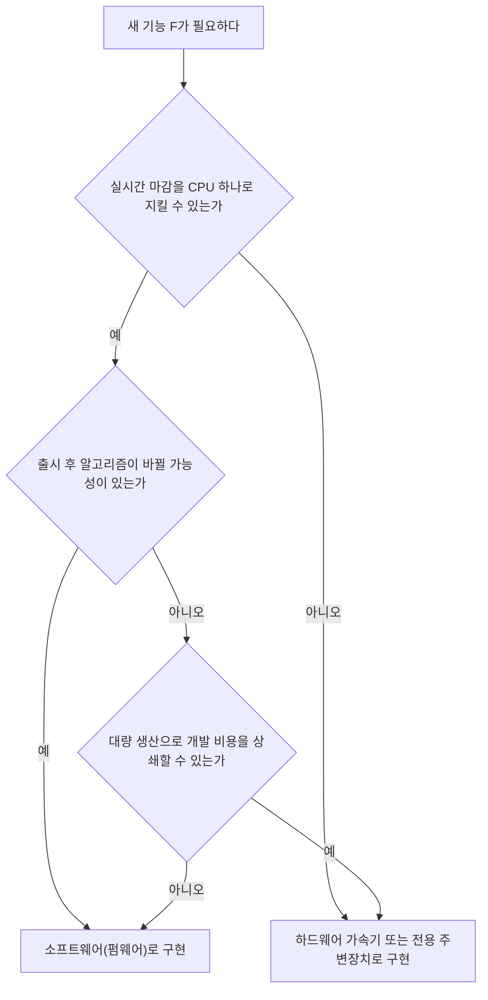

<Callout type="info">
  **이번 문서의 목표:** 어떤 기능을 하드웨어로 만들고 어떤 기능을 소프트웨어로 만들지 판단하는 기준을 설명하고, 클럭 게이팅·전력 게이팅·DVFS 같은 저전력 기법과 Cortex-M의 저전력 모드를 실제 전력 계산과 함께 구분할 수 있게 된다.
</Callout>

## 왜 HW/SW 분할이 필요한가

3편에서 임베디드 시스템은 실시간성, 전력, 메모리, 비용이라는 네 가지 제약 속에서 동작한다고 확인했습니다. 이 제약을 만족시키는 방법 중 하나가 **같은 기능이라도 하드웨어로 구현할지 소프트웨어로 구현할지를 설계 단계에서 결정**하는 것입니다. 예를 들어 영상의 밝기를 보정하는 필터 하나를 만든다고 해봅시다. 이 필터를 Cortex-M의 C 코드로 짜면 개발이 쉽고 나중에 알고리즘을 바꾸기도 쉽지만, 매 프레임마다 수만 번의 곱셈이 필요해 CPU가 감당하지 못할 수 있습니다. 반대로 이 필터를 전용 회로(하드웨어 가속기)로 만들면 속도는 훨씬 빠르지만, 한 번 만들고 나면 알고리즘을 바꿀 수 없고 설계·검증 기간과 비용이 늘어납니다.

**HW/SW 분할**(hardware/software partitioning, 하드웨어·소프트웨어 분할)은 이렇게 시스템이 수행해야 할 기능들을 하드웨어 블록과 소프트웨어(프로세서에서 실행되는 코드) 중 어디에 배치할지 결정하는 설계 작업입니다.

> **쉽게 말하면:** 같은 일을 "전용 기계를 새로 만들어서" 시킬지, "이미 있는 범용 일꾼(CPU)에게 시켜서" 시킬지를 고르는 문제입니다.

## 1. HW/SW 분할을 결정하는 기준

무엇을 하드웨어로, 무엇을 소프트웨어로 둘지는 다음 다섯 가지 기준을 종합해서 판단합니다.

| 기준 | 하드웨어가 유리한 경우 | 소프트웨어가 유리한 경우 |
|---|---|---|
| 성능(performance) | 반복 연산이 많고 실시간 마감이 촉박해 병렬 처리가 필요할 때 | 연산량이 적당해 CPU 한 개로 마감을 지킬 수 있을 때 |
| 유연성(flexibility) | 알고리즘이 완전히 고정되어 바뀔 일이 없을 때 | 출시 후 알고리즘·정책을 업데이트해야 할 때 |
| 개발 비용·기간 | 대량 생산으로 단가를 낮춰 회로 개발 비용을 상쇄할 수 있을 때 | 소량 생산이거나 출시 일정이 촉박해 회로 설계·검증 기간을 낼 수 없을 때 |
| 전력(power) | 전용 회로가 범용 CPU보다 같은 일을 훨씬 적은 에너지로 끝낼 때 | 그 기능의 사용 빈도가 낮아 전용 회로를 늘 켜 두는 것이 오히려 손해일 때 |
| 재사용성(reusability) | 표준화된 기능(암호화, 신호 처리)이라 검증된 IP를 재사용할 수 있을 때 | 여러 제품에 걸쳐 조금씩 다른 로직이라 코드 하나로 분기 처리하는 편이 나을 때 |

이 다섯 기준은 서로 충돌하는 경우가 많습니다. 성능은 하드웨어가 유리하다고 나왔는데 유연성은 소프트웨어가 유리하다고 나오면, 실제 설계에서는 **"자주 바뀌지 않으면서 성능이 정말 병목인 부분만" 하드웨어로 떼어내고 나머지는 소프트웨어로 남기는 절충**을 선택합니다. 이 절충의 결과물이 흔히 마이크로컨트롤러 안에 들어 있는 전용 주변장치(타이머, PWM, ADC, 통신 컨트롤러)입니다. 이들은 모두 원래 소프트웨어로도 흉내 낼 수 있는 기능이지만, 사용 빈도가 매우 높고 알고리즘이 표준으로 고정되어 있어 하드웨어로 만들어 CPU 부담과 전력을 함께 줄인 사례입니다.

> **쉽게 말하면:** 하드웨어는 "빠르고 절전이지만 한 번 정하면 못 바꾸는 선택", 소프트웨어는 "느리고 전력을 더 쓰지만 언제든 고칠 수 있는 선택"입니다.

## 2. 판단 흐름을 도식으로 정리

실제 설계에서는 다음 순서로 질문을 던지며 하드웨어/소프트웨어를 가릅니다.

**자주 틀리는 점:** "속도가 빠른 게 항상 정답이니 최대한 하드웨어로 만든다"고 단정하는 오답이 흔합니다. 하드웨어는 한 번 칩에 새기면 사후 수정이 사실상 불가능하므로, 요구사항이 바뀔 여지가 있는 기능을 성급하게 하드웨어로 확정하면 제품 수명 내내 대응하지 못하는 위험을 떠안게 됩니다. 시험에서 "성능만" 근거로 하드웨어를 고르라고 유도하는 보기는 유연성·비용 기준을 빠뜨린 함정인 경우가 많습니다.

## 3. 저전력 설계가 필요한 이유

3편에서 본 것처럼 임베디드 시스템은 배터리로 동작하거나 발열이 제한된 환경에 놓이는 경우가 많습니다. 소비 전력을 줄이는 기법을 이해하려면 먼저 CMOS(Complementary Metal-Oxide-Semiconductor, 상보형 금속산화막 반도체) 회로가 전력을 쓰는 두 가지 경로를 구분해야 합니다.

- **동적 전력**(dynamic power): 트랜지스터가 0에서 1로, 1에서 0으로 스위칭할 때 커패시터를 충전·방전하며 소비하는 전력입니다. 회로가 활발히 동작할수록 커집니다.
- **정적 전력**(static power): 트랜지스터가 꺼져 있어야 할 때도 완전히 차단되지 못하고 새어 나가는 누설 전류(leakage current)로 인한 전력입니다. 회로에 전원이 들어와 있기만 해도 계속 소비됩니다.

동적 전력은 다음 식으로 근사합니다.

$$
P_{dynamic} = C \cdot V^2 \cdot f
$$

- $P_{dynamic}$: 동적 전력(와트, W)
- $C$: 회로의 등가 커패시턴스(패럿, F) — 트랜지스터와 배선이 가진 전하 저장 능력
- $V$: 공급 전압(볼트, V)
- $f$: 동작 클럭 주파수(헤르츠, Hz)

**예제로 검산하기.** 어떤 MCU 블록의 $C = 2\text{nF}$, 공급 전압 $V = 3.3\text{V}$, 클럭 주파수 $f = 48\text{MHz}$라고 하면 동적 전력은 다음과 같습니다.

$$
P_{dynamic} = 2 \times 10^{-9} \times 3.3^2 \times 48 \times 10^{6}
$$

$3.3^2 = 10.89$이고, $2 \times 10^{-9} \times 10.89 = 2.178 \times 10^{-8}$이므로,

$$
P_{dynamic} = 2.178 \times 10^{-8} \times 48 \times 10^{6} \approx 1.045\text{W}
$$

만약 전압을 3.3V에서 1.8V로 낮추면 어떻게 달라질까요. $1.8^2 = 3.24$이므로 전압 항만 비교하면 $10.89$에서 $3.24$로 약 3.36분의 1로 줄어듭니다. 클럭 주파수를 절반(24MHz)으로 낮추면 전력도 그만큼 절반이 됩니다. 이 식에서 **전압은 제곱으로, 주파수는 1차로** 전력에 영향을 준다는 점이 핵심입니다. 그래서 전압을 낮추는 것이 주파수를 낮추는 것보다 같은 비율로 줄여도 전력 절감 효과가 더 큽니다.

> **쉽게 말하면:** 전압을 낮추면 절전 효과가 "제곱으로" 커지고, 클럭을 낮추면 절전 효과가 "그 배수만큼만" 커집니다.

**자주 틀리는 점:** 전압과 주파수를 같은 비율로 줄였을 때 전력도 같은 비율로 줄어든다고 오해하기 쉽습니다. 위 공식대로면 전압을 절반으로 줄이면 전압 항은 4분의 1이 되고 거기에 주파수 감소분까지 곱해지므로, 전압을 낮추는 쪽의 기여가 훨씬 큽니다.

## 4. 대표적인 저전력 기법

### 클럭 게이팅과 전력 게이팅

- **클럭 게이팅**(clock gating): 특정 순간에 쓰이지 않는 블록으로 가는 클럭 신호를 게이트(AND 게이트 등)로 끊어, 그 블록의 트랜지스터가 스위칭하지 않게 만드는 기법입니다. 동적 전력만 줄어들고, 회로에는 여전히 전원이 들어와 있으므로 정적 전력(누설)은 그대로 남습니다.
- **전력 게이팅**(power gating): 아예 그 블록으로 가는 전원 공급 자체를 스위치로 끊는 기법입니다. 동적 전력과 정적 전력을 모두 없앨 수 있지만, 다시 켤 때 회로 내부 상태(레지스터 값 등)가 사라지므로 복귀 시간과 재초기화 비용이 더 큽니다.

> **쉽게 말하면:** 클럭 게이팅은 "일꾼을 잠깐 멈춰 세워두는 것"이고, 전력 게이팅은 "일꾼을 아예 퇴근시키는 것"입니다. 퇴근시키면 전기는 더 아끼지만 다시 출근시켜 자리 정돈하는 데 시간이 걸립니다.

### 동적 전압·주파수 스케일링(DVFS)

**DVFS**(Dynamic Voltage and Frequency Scaling, 동적 전압·주파수 조정)는 CPU가 처리해야 할 작업량에 맞춰 실시간으로 공급 전압과 클럭 주파수를 낮추거나 높이는 기법입니다. 작업이 없거나 가벼울 때는 전압·주파수를 낮춰 전력을 아끼고, 마감이 촉박한 작업이 들어오면 다시 전압·주파수를 높여 성능을 확보합니다. 앞서 본 $P = CV^2f$ 식에서 보듯 전압을 낮추는 효과가 크므로, DVFS는 대개 주파수를 낮추기 전에 전압부터 낮출 수 있는 만큼 낮추는 순서로 동작합니다.

**자주 틀리는 점:** DVFS를 "클럭만 낮추는 기법"으로 잘못 기억하는 경우가 있습니다. 이름 그대로 전압(Voltage)과 주파수(Frequency)를 함께 조정하는 기법이며, 전압 조정이 빠져 있으면 절전 효과가 크게 줄어듭니다.

### Cortex-M의 저전력 모드

ARM Cortex-M 계열은 소프트웨어에서 `WFI`(Wait For Interrupt, 인터럽트를 기다림)나 `WFE`(Wait For Event, 이벤트를 기다림) 명령으로 진입하는 저전력 모드를 제공합니다. 실제 이름과 세부 동작은 벤더(제조사)마다 조금씩 다르지만, 시험에서 자주 묻는 개념적 구분은 다음과 같이 3단계로 정리할 수 있습니다.

| 모드 | 클럭 상태 | 레지스터·SRAM 상태 | 깨어나는 방법 | 복귀 시간 |
|---|---|---|---|---|
| Sleep | CPU 클럭만 정지, 주변장치 클럭 유지 | 유지 | 인터럽트 | 매우 짧음(수 사이클) |
| Deep Sleep/Stop | 대부분의 클럭 정지(일부 저속 클럭 유지 가능) | 유지 | 특정 인터럽트(RTC, 외부 핀 등) | 짧음(마이크로초 단위) |
| Standby/Shutdown | 코어 전원까지 차단 | 대부분 소실(일부 백업 영역 제외) | 리셋에 준하는 웨이크업 이벤트 | 김(리부팅에 가까움) |

깊은 절전 모드로 갈수록 소비 전력은 줄어들지만, 그만큼 깨어날 때(wake-up) 상태 복원 비용과 지연이 커집니다. 8편에서 다룬 인터럽트는 이 저전력 모드에서 CPU를 깨우는 유일한 통로 역할도 합니다. 즉 저전력 설계와 인터럽트 설계는 분리된 주제가 아니라, "언제 잠들고 무엇이 깨우는가"라는 하나의 흐름으로 이어집니다.

> **쉽게 말하면:** 얕게 잠들수록 빨리 깰 수 있지만 전기를 덜 아끼고, 깊이 잠들수록 전기를 많이 아끼지만 깨는 데 시간이 걸립니다.

### 주변장치 클럭 차단과 자원 최적화

사용하지 않는 주변장치(예: 이번 실행 경로에서 쓰지 않는 SPI 블록)는 그 주변장치로 가는 클럭 게이트를 꺼서 전력을 아낍니다. 이는 CPU 코어의 저전력 모드와 별개로, 개별 주변장치 단위에서 세밀하게 적용할 수 있는 기법입니다.

메모리·연산 자원의 최적화에도 트레이드오프가 있습니다. 예를 들어 사인(sine) 함수 값을 매번 계산하는 대신 미리 계산해 둔 **룩업 테이블**(lookup table)에서 값을 읽어 오면 연산 시간은 줄지만, 그 테이블을 담을 메모리 공간이 필요합니다. 반대로 매번 계산하면 메모리는 절약되지만 CPU 사이클과 그만큼의 동적 전력을 더 씁니다. 이 역시 "시간을 아낄 것인가, 공간(그리고 궁극적으로 전력)을 아낄 것인가"라는 HW/SW 분할과 닮은 트레이드오프입니다.

## 핵심 정리

- HW/SW 분할은 성능·유연성·개발 비용·전력·재사용성 다섯 기준을 종합해 결정하며, 성능만 보고 하드웨어를 고르는 것은 함정이다.
- 동적 전력은 $P = CV^2f$로 근사되며, 전압을 낮추는 절전 효과가 주파수를 낮추는 것보다 제곱 비율로 더 크다.
- 클럭 게이팅은 동적 전력만, 전력 게이팅은 동적·정적 전력을 모두 줄이지만 복귀 비용이 더 크다.
- DVFS는 전압과 주파수를 작업량에 맞춰 함께 조정하는 기법이다.
- Cortex-M의 Sleep–Deep Sleep–Standby는 절전 정도와 웨이크업 지연이 반비례 관계를 이루며, 인터럽트가 웨이크업의 통로가 된다.

## 마무리 복습

<Quiz
  questionNumber={1}
  question="HW/SW 분할을 결정할 때 고려하는 다섯 가지 기준에 해당하지 않는 것은?"
  options={['성능', '유연성', '개발 비용과 기간', '프로그래밍 언어의 문법 난이도']}
  correctAnswer={4}
  explanation="HW/SW 분할의 판단 기준은 성능, 유연성, 개발 비용·기간, 전력, 재사용성이다. 프로그래밍 언어의 문법 난이도는 분할 결정과 직접 관련이 없다."
  optionExplanations={['성능은 실시간 마감을 지킬 수 있는지를 가르는 핵심 기준이다.', '유연성은 출시 후 알고리즘 변경 가능성을 가르는 기준이다.', '개발 비용과 기간은 대량 생산 여부와 함께 판단하는 기준이다.', '정답이다. 문법 난이도는 HW/SW 분할이 아니라 소프트웨어 개발 편의성의 문제이며 분할 기준에 포함되지 않는다.']}
/>

<Quiz
  questionNumber={2}
  question="어떤 기능을 하드웨어로 확정하기에 가장 위험한 경우는?"
  options={['알고리즘이 표준으로 고정되어 향후에도 바뀔 가능성이 거의 없는 경우', '대량 생산으로 개발 비용을 상쇄할 수 있는 경우', '출시 후 정책이나 알고리즘을 자주 업데이트해야 하는 경우', '반복 연산이 많아 실시간 마감을 CPU 하나로 지키기 어려운 경우']}
  correctAnswer={3}
  explanation="하드웨어는 한 번 확정되면 사후 수정이 사실상 불가능하다. 출시 후 알고리즘이나 정책을 자주 바꿔야 하는 기능을 하드웨어로 만들면 제품 수명 내내 대응할 수 없는 위험이 생긴다."
  optionExplanations={['알고리즘이 고정되어 있다면 오히려 하드웨어로 만들기에 안전한 조건이다.', '대량 생산은 하드웨어 개발 비용을 상쇄하는 데 유리한 조건이다.', '정답이다. 유연성이 필요한 기능을 하드웨어로 확정하면 변경에 대응할 수 없다.', '실시간 마감이 촉박한 경우는 오히려 하드웨어 가속이 필요한 전형적인 상황이다.']}
/>

<Quiz
  questionNumber={3}
  question="동적 전력 공식 P = C·V²·f에서 공급 전압을 절반으로 낮췄을 때(주파수는 그대로일 때) 동적 전력의 변화로 옳은 것은?"
  options={['그대로 유지된다', '2분의 1로 줄어든다', '4분의 1로 줄어든다', '2배로 늘어난다']}
  correctAnswer={3}
  explanation="전압 항은 제곱으로 들어가므로 전압을 절반으로 낮추면 V의 제곱은 4분의 1이 된다. 나머지 항(C, f)이 그대로라면 전력도 4분의 1로 줄어든다."
  optionExplanations={['전압은 제곱 항으로 들어가므로 변화가 없다는 것은 공식과 맞지 않다.', '전압이 1차 항이라면 성립하지만, 실제로는 제곱 항이므로 2분의 1이 아니라 4분의 1이 정답이다.', '정답이다. (1/2)의 제곱은 1/4이므로 동적 전력은 4분의 1로 줄어든다.', '전압을 낮췄는데 전력이 늘어난다는 것은 공식의 방향과 반대된 오답이다.']}
/>

<Quiz
  questionNumber={4}
  question="클럭 게이팅과 전력 게이팅의 차이에 대한 설명으로 옳은 것은?"
  options={['클럭 게이팅은 정적 전력까지 없애지만 전력 게이팅은 동적 전력만 없앤다', '클럭 게이팅은 동적 전력만 줄이고 전력 게이팅은 동적·정적 전력을 모두 줄인다', '두 기법 모두 동일하게 전원 공급 자체를 차단한다', '클럭 게이팅은 복귀 시간이 전력 게이팅보다 길다']}
  correctAnswer={2}
  explanation="클럭 게이팅은 클럭 신호만 끊어 스위칭을 멈추므로 동적 전력만 줄어들고 누설로 인한 정적 전력은 남는다. 전력 게이팅은 전원 공급 자체를 끊어 동적·정적 전력을 모두 없애지만 복귀 비용이 더 크다."
  optionExplanations={['클럭 게이팅과 전력 게이팅의 역할이 서로 뒤바뀐 설명이다.', '정답이다. 클럭 게이팅은 스위칭만 멈추고, 전력 게이팅은 전원 자체를 끊어 두 종류의 전력을 모두 줄인다.', '클럭 게이팅은 클럭 신호만 차단할 뿐 전원 공급을 차단하지 않는다.', '전원 자체를 끊는 전력 게이팅이 복귀에 더 오래 걸리므로 이 설명은 반대로 되어 있다.']}
/>

<Quiz
  questionNumber={5}
  question="DVFS(Dynamic Voltage and Frequency Scaling)에 대한 설명으로 가장 옳은 것은?"
  options={['클럭 주파수만 조정하고 전압은 고정한다', '작업량에 따라 전압과 주파수를 함께 조정해 성능과 전력의 균형을 맞춘다', '항상 최고 주파수로 고정해 성능을 우선한다', '전원 공급 자체를 완전히 차단하는 기법이다']}
  correctAnswer={2}
  explanation="DVFS는 이름 그대로 전압(Voltage)과 주파수(Frequency)를 작업 부하에 맞춰 동적으로 함께 조정하는 기법으로, 가벼운 작업에는 낮추고 무거운 작업에는 높여 성능과 전력의 균형을 맞춘다."
  optionExplanations={['DVFS는 주파수뿐 아니라 전압도 함께 조정하는 기법이므로 전압을 고정한다는 설명은 틀렸다.', '정답이다. 전압과 주파수를 작업량에 맞춰 함께 조정하는 것이 DVFS의 핵심이다.', '항상 최고 주파수로 고정하면 절전 효과를 얻을 수 없어 DVFS의 목적과 반대된다.', '전원 공급을 완전히 차단하는 것은 전력 게이팅에 대한 설명이다.']}
/>

<Quiz
  questionNumber={6}
  question="Cortex-M 계열의 저전력 모드 중 가장 깊은 절전 상태에 대한 설명으로 옳은 것은?"
  options={['CPU 클럭만 멈추고 주변장치 클럭은 그대로 유지되어 복귀가 매우 빠르다', '코어 전원까지 차단되어 소비 전력은 가장 낮지만 복귀 시간이 가장 길다', '레지스터와 SRAM 상태가 항상 완전히 보존되어 복귀 비용이 전혀 없다', '인터럽트가 아니라 폴링으로만 깨어날 수 있다']}
  correctAnswer={2}
  explanation="가장 깊은 절전 모드(Standby/Shutdown류)는 코어 전원까지 차단해 소비 전력을 가장 낮추지만, 그만큼 상태 대부분이 소실되어 복귀에 리부팅에 가까운 시간이 걸린다."
  optionExplanations={['이는 가장 얕은 Sleep 모드에 대한 설명이며, 가장 깊은 모드와는 반대되는 특성이다.', '정답이다. 가장 깊은 절전 모드는 전력 소비가 가장 낮은 대신 복귀 시간이 가장 길다.', '깊은 절전 모드일수록 상태 보존이 아니라 소실 쪽에 가까워진다는 점과 반대된 설명이다.', '저전력 모드에서 CPU를 깨우는 통로는 인터럽트(또는 특정 웨이크업 이벤트)이며, 폴링은 CPU가 깨어 있어야 가능하므로 절전 모드의 웨이크업 방식이 아니다.']}
/>

## 참고 자료

- [Arm Cortex-M resources](https://developer.arm.com/community/arm-community-blogs/b/architectures-and-processors-blog/posts/cortex-m-resources)
- [CMSIS-Core (Cortex-M): Overview](https://arm-software.github.io/CMSIS_6/latest/Core/index.html)
- [국가평생교육진흥원 독학학위제 - 과목별 평가영역](https://bdes.nile.or.kr/nile/study/nStudy2_1.do)
