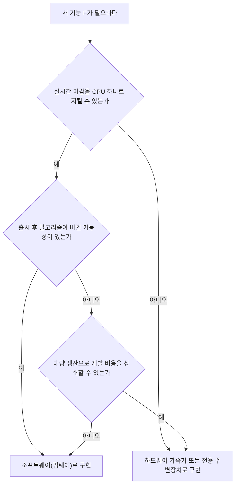

## 왜 HW/SW 분할이 필요한가

3편에서 임베디드 시스템은 실시간성, 전력, 메모리, 비용이라는 네 가지 제약 속에서 동작한다고 확인했습니다. 이 제약을 만족시키는 방법 중 하나가 **같은 기능이라도 하드웨어로 구현할지 소프트웨어로 구현할지를 설계 단계에서 결정**하는 것입니다.

**HW/SW 분할**(hardware/software partitioning, 하드웨어·소프트웨어 분할)은 이렇게 시스템이 수행해야 할 기능들을 하드웨어 블록과 소프트웨어(프로세서에서 실행되는 코드) 중 어디에 배치할지 결정하는 설계 작업입니다.

## 1. HW/SW 분할을 결정하는 기준

무엇을 하드웨어로, 무엇을 소프트웨어로 둘지는 다음 다섯 가지 기준을 종합해서 판단합니다.

| 기준 | 하드웨어가 유리한 경우 | 소프트웨어가 유리한 경우 |
|---|---|---|
| 성능(performance) | 반복 연산이 많고 실시간 마감이 촉박해 병렬 처리가 필요할 때 | 연산량이 적당해 CPU 한 개로 마감을 지킬 수 있을 때 |
| 유연성(flexibility) | 알고리즘이 완전히 고정되어 바뀔 일이 없을 때 | 출시 후 알고리즘·정책을 업데이트해야 할 때 |
| 개발 비용·기간 | 대량 생산으로 단가를 낮춰 회로 개발 비용을 상쇄할 수 있을 때 | 소량 생산이거나 출시 일정이 촉박해 회로 설계·검증 기간을 낼 수 없을 때 |
| 전력(power) | 전용 회로가 범용 CPU보다 같은 일을 훨씬 적은 에너지로 끝낼 때 | 그 기능의 사용 빈도가 낮아 전용 회로를 늘 켜 두는 것이 오히려 손해일 때 |
| 재사용성(reusability) | 표준화된 기능(암호화, 신호 처리)이라 검증된 IP를 재사용할 수 있을 때 | 여러 제품에 걸쳐 조금씩 다른 로직이라 코드 하나로 분기 처리하는 편이 나을 때 |

이 다섯 기준은 서로 충돌하는 경우가 많습니다. 성능은 하드웨어가 유리하다고 나왔는데 유연성은 소프트웨어가 유리하다고 나오면, 실제 설계에서는 **"자주 바뀌지 않으면서 성능이 정말 병목인 부분만" 하드웨어로 떼어내고 나머지는 소프트웨어로 남기는 절충**을 선택합니다.

## 2. 판단 흐름을 도식으로 정리

실제 설계에서는 다음 순서로 질문을 던지며 하드웨어/소프트웨어를 가릅니다.

```mermaid
flowchart TD
  A["새 기능 F가 필요하다"] --> B{"실시간 마감을 CPU 하나로 지킬 수 있는가"}
  B -- 예 --> C{"출시 후 알고리즘이 바뀔 가능성이 있는가"}
  B -- 아니오 --> D["하드웨어 가속기 또는 전용 주변장치로 구현"]
  C -- 예 --> E["소프트웨어(펌웨어)로 구현"]
  C -- 아니오 --> F{"대량 생산으로 개발 비용을 상쇄할 수 있는가"}
  F -- 예 --> D
  F -- 아니오 --> E
```

**자주 틀리는 점:** "속도가 빠른 게 항상 정답이니 최대한 하드웨어로 만든다"고 단정하는 오답이 흔합니다. 하드웨어는 한 번 칩에 새기면 사후 수정이 사실상 불가능하므로, 요구사항이 바뀔 여지가 있는 기능을 성급하게 하드웨어로 확정하면 제품 수명 내내 대응하지 못하는 위험을 떠안게 됩니다.

## 3. 저전력 설계가 필요한 이유

3편에서 본 것처럼 임베디드 시스템은 배터리로 동작하거나 발열이 제한된 환경에 놓이는 경우가 많습니다. 소비 전력을 줄이는 기법을 이해하려면 먼저 CMOS(Complementary Metal-Oxide-Semiconductor, 상보형 금속산화막 반도체) 회로가 전력을 쓰는 두 가지 경로를 구분해야 합니다.

- **동적 전력**(dynamic power): 트랜지스터가 0에서 1로, 1에서 0으로 스위칭할 때 커패시터를 충전·방전하며 소비하는 전력입니다. 회로가 활발히 동작할수록 커집니다.
- **정적 전력**(static power): 트랜지스터가 꺼져 있어야 할 때도 완전히 차단되지 못하고 새어 나가는 누설 전류(leakage current)로 인한 전력입니다. 회로에 전원이 들어와 있기만 해도 계속 소비됩니다.

동적 전력은 다음 식으로 근사합니다.

$$
P_{dynamic} = C \cdot V^2 \cdot f
$$

- $P_{dynamic}$: 동적 전력(와트, W)
- $C$: 회로의 등가 커패시턴스(패럿, F) — 트랜지스터와 배선이 가진 전하 저장 능력
- $V$: 공급 전압(볼트, V)
- $f$: 동작 클럭 주파수(헤르츠, Hz)

**예제로 검산하기.** 어떤 MCU 블록의 $C = 2\text{nF}$, 공급 전압 $V = 3.3\text{V}$, 클럭 주파수 $f = 48\text{MHz}$라고 하면 동적 전력은 다음과 같습니다.

$$
P_{dynamic} = 2 \times 10^{-9} \times 3.3^2 \times 48 \times 10^{6}
$$

$3.3^2 = 10.89$이고, $2 \times 10^{-9} \times 10.89 = 2.178 \times 10^{-8}$이므로,

$$
P_{dynamic} = 2.178 \times 10^{-8} \times 48 \times 10^{6} \approx 1.045\text{W}
$$

만약 전압을 3.3V에서 1.8V로 낮추면 어떻게 달라질까요. $1.8^2 = 3.24$이므로 전압 항만 비교하면 $10.89$에서 $3.24$로 약 3.36분의 1로 줄어듭니다.

**자주 틀리는 점:** 전압과 주파수를 같은 비율로 줄였을 때 전력도 같은 비율로 줄어든다고 오해하기 쉽습니다. 위 공식대로면 전압을 절반으로 줄이면 전압 항은 4분의 1이 되고 거기에 주파수 감소분까지 곱해지므로, 전압을 낮추는 쪽의 기여가 훨씬 큽니다.

## 4. 대표적인 저전력 기법

### 클럭 게이팅과 전력 게이팅

- **클럭 게이팅**(clock gating): 특정 순간에 쓰이지 않는 블록으로 가는 클럭 신호를 게이트(AND 게이트 등)로 끊어, 그 블록의 트랜지스터가 스위칭하지 않게 만드는 기법입니다. 동적 전력만 줄어들고, 회로에는 여전히 전원이 들어와 있으므로 정적 전력(누설)은 그대로 남습니다.
- **전력 게이팅**(power gating): 아예 그 블록으로 가는 전원 공급 자체를 스위치로 끊는 기법입니다. 동적 전력과 정적 전력을 모두 없앨 수 있지만, 다시 켤 때 회로 내부 상태(레지스터 값 등)가 사라지므로 복귀 시간과 재초기화 비용이 더 큽니다.

### 동적 전압·주파수 스케일링(DVFS)

**DVFS**(Dynamic Voltage and Frequency Scaling, 동적 전압·주파수 조정)는 CPU가 처리해야 할 작업량에 맞춰 실시간으로 공급 전압과 클럭 주파수를 낮추거나 높이는 기법입니다. 앞서 본 $P = CV^2f$ 식에서 보듯 전압을 낮추는 효과가 크므로, DVFS는 대개 주파수를 낮추기 전에 전압부터 낮출 수 있는 만큼 낮추는 순서로 동작합니다.

**자주 틀리는 점:** DVFS를 "클럭만 낮추는 기법"으로 잘못 기억하는 경우가 있습니다. 이름 그대로 전압(Voltage)과 주파수(Frequency)를 함께 조정하는 기법이며, 전압 조정이 빠져 있으면 절전 효과가 크게 줄어듭니다.

### Cortex-M의 저전력 모드

ARM Cortex-M 계열은 소프트웨어에서 `WFI`(Wait For Interrupt, 인터럽트를 기다림)나 `WFE`(Wait For Event, 이벤트를 기다림) 명령으로 진입하는 저전력 모드를 제공합니다. 실제 이름과 세부 동작은 벤더(제조사)마다 조금씩 다르지만, 시험에서 자주 묻는 개념적 구분은 다음과 같이 3단계로 정리할 수 있습니다.

| 모드 | 클럭 상태 | 레지스터·SRAM 상태 | 깨어나는 방법 | 복귀 시간 |
|---|---|---|---|---|
| Sleep | CPU 클럭만 정지, 주변장치 클럭 유지 | 유지 | 인터럽트 | 매우 짧음(수 사이클) |
| Deep Sleep/Stop | 대부분의 클럭 정지(일부 저속 클럭 유지 가능) | 유지 | 특정 인터럽트(RTC, 외부 핀 등) | 짧음(마이크로초 단위) |
| Standby/Shutdown | 코어 전원까지 차단 | 대부분 소실(일부 백업 영역 제외) | 리셋에 준하는 웨이크업 이벤트 | 김(리부팅에 가까움) |

깊은 절전 모드로 갈수록 소비 전력은 줄어들지만, 그만큼 깨어날 때(wake-up) 상태 복원 비용과 지연이 커집니다. 8편에서 다룬 인터럽트는 이 저전력 모드에서 CPU를 깨우는 유일한 통로 역할도 합니다.

### 주변장치 클럭 차단과 자원 최적화

사용하지 않는 주변장치(예: 이번 실행 경로에서 쓰지 않는 SPI 블록)는 그 주변장치로 가는 클럭 게이트를 꺼서 전력을 아낍니다. 이는 CPU 코어의 저전력 모드와 별개로, 개별 주변장치 단위에서 세밀하게 적용할 수 있는 기법입니다.

메모리·연산 자원의 최적화에도 트레이드오프가 있습니다. 예를 들어 사인(sine) 함수 값을 매번 계산하는 대신 미리 계산해 둔 **룩업 테이블**(lookup table)에서 값을 읽어 오면 연산 시간은 줄지만, 그 테이블을 담을 메모리 공간이 필요합니다.

## 핵심 정리

- HW/SW 분할은 성능·유연성·개발 비용·전력·재사용성 다섯 기준을 종합해 결정하며, 성능만 보고 하드웨어를 고르는 것은 함정이다.
- 동적 전력은 $P = CV^2f$로 근사되며, 전압을 낮추는 절전 효과가 주파수를 낮추는 것보다 제곱 비율로 더 크다.
- 클럭 게이팅은 동적 전력만, 전력 게이팅은 동적·정적 전력을 모두 줄이지만 복귀 비용이 더 크다.
- DVFS는 전압과 주파수를 작업량에 맞춰 함께 조정하는 기법이다.
- Cortex-M의 Sleep–Deep Sleep–Standby는 절전 정도와 웨이크업 지연이 반비례 관계를 이루며, 인터럽트가 웨이크업의 통로가 된다.

## 마무리 복습

<Quiz
  questionNumber={1}
  question={"HW/SW 분할을 결정할 때 고려하는 다섯 가지 기준에 해당하지 않는 것은?"}
  options={["성능","유연성","개발 비용과 기간","프로그래밍 언어의 문법 난이도"]}
  correctAnswer={4}
  explanation={"HW/SW 분할의 판단 기준은 성능, 유연성, 개발 비용·기간, 전력, 재사용성이다. 프로그래밍 언어의 문법 난이도는 분할 결정과 직접 관련이 없다."}
/>

<Quiz
  questionNumber={2}
  question={"어떤 기능을 하드웨어로 확정하기에 가장 위험한 경우는?"}
  options={["알고리즘이 표준으로 고정되어 향후에도 바뀔 가능성이 거의 없는 경우","대량 생산으로 개발 비용을 상쇄할 수 있는 경우","출시 후 정책이나 알고리즘을 자주 업데이트해야 하는 경우","반복 연산이 많아 실시간 마감을 CPU 하나로 지키기 어려운 경우"]}
  correctAnswer={3}
  explanation={"하드웨어는 한 번 확정되면 사후 수정이 사실상 불가능하다. 출시 후 알고리즘이나 정책을 자주 바꿔야 하는 기능을 하드웨어로 만들면 제품 수명 내내 대응할 수 없는 위험이 생긴다."}
/>

<Quiz
  questionNumber={3}
  question={"동적 전력 공식 P = C·V²·f에서 공급 전압을 절반으로 낮췄을 때(주파수는 그대로일 때) 동적 전력의 변화로 옳은 것은?"}
  options={["그대로 유지된다","2분의 1로 줄어든다","4분의 1로 줄어든다","2배로 늘어난다"]}
  correctAnswer={3}
  explanation={"전압 항은 제곱으로 들어가므로 전압을 절반으로 낮추면 V의 제곱은 4분의 1이 된다. 나머지 항(C, f)이 그대로라면 전력도 4분의 1로 줄어든다."}
/>

## 참고 자료

- [Arm Cortex-M resources](https://developer.arm.com/community/arm-community-blogs/b/architectures-and-processors-blog/posts/cortex-m-resources)
- [CMSIS-Core (Cortex-M): Overview](https://arm-software.github.io/CMSIS_6/latest/Core/index.html)
- [국가평생교육진흥원 독학학위제 - 과목별 평가영역](https://bdes.nile.or.kr/nile/study/nStudy2_1.do)
