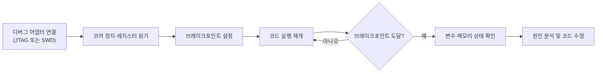

<Callout type="info">
  **이번 문서의 목표:** 신뢰성을 나타내는 MTBF·MTTR·가용성을 실제 숫자로 계산하고, 임베디드 시스템에서 반복적으로 나오는 오류 유형을 원인별로 구분하며, JTAG와 SWD 디버그 인터페이스의 구조와 차이, 디버깅 흐름을 설명할 수 있게 된다.
</Callout>

## 왜 신뢰성을 따로 다루는가

지금까지는 임베디드 시스템이 "정상적으로 동작할 때"의 구조(메모리, 주변장치, RTOS)를 배웠습니다. 그런데 실제 제품은 전원이 흔들리거나, 예상치 못한 입력이 들어오거나, 몇 달간 쉬지 않고 켜져 있다가 예외적인 상황에서 오작동할 수 있습니다. 자동차 제어기나 의료기기처럼 사람의 안전과 직결된 임베디드 시스템에서는 "얼마나 오래 고장 없이 동작하는가", "고장이 나면 얼마나 빨리 고칠 수 있는가"를 숫자로 관리하는 일이 설계의 일부입니다. 이 편에서는 그 숫자를 계산하는 방법과, 임베디드 시스템에서 반복적으로 나타나는 오류의 원인, 그리고 이 오류를 찾아내는 디버깅 도구인 JTAG·SWD를 다룹니다.

## 1. 신뢰성 지표: MTBF, MTTR, 가용성

**신뢰성**(reliability)은 시스템이 정해진 기간 동안 정해진 기능을 고장 없이 수행할 확률적 성질을 뜻합니다. 이를 정성적으로만 말하지 않고 다음 세 지표로 정량화합니다.

- **MTBF**(Mean Time Between Failures, 평균 고장 간격): 수리 가능한 시스템에서 한 번 고장이 나고 수리된 뒤 다음 고장이 날 때까지 걸리는 평균 시간입니다.
- **MTTR**(Mean Time To Repair, 평균 수리 시간): 고장이 발생한 시점부터 수리를 완료해 다시 정상 동작할 때까지 걸리는 평균 시간입니다.
- **가용성**(availability): 전체 운영 시간 중 시스템이 실제로 정상 동작하고 있는 시간의 비율입니다.

> **쉽게 말하면:** MTBF는 "얼마나 오래 안 고장 나는가", MTTR은 "고장 나면 얼마나 빨리 고치는가", 가용성은 "전체 시간 중 실제로 쓸 수 있었던 비율"입니다.

가용성은 다음 식으로 계산합니다.

$$
A = \frac{MTBF}{MTBF + MTTR}
$$

- $A$: 가용성(0과 1 사이의 비율, 백분율로도 표기)
- $MTBF$: 평균 고장 간격(시간 단위)
- $MTTR$: 평균 수리 시간(같은 시간 단위)

**예제로 검산하기.** 어떤 임베디드 제어기의 MTBF가 4,000시간이고 MTTR이 4시간이라고 하면 가용성은 다음과 같습니다.

$$
A = \frac{4000}{4000 + 4} = \frac{4000}{4004} \approx 0.999
$$

이 값을 백분율로 바꾸면 약 99.9퍼센트입니다. 즉 이 시스템은 전체 운영 시간의 99.9퍼센트를 정상 동작 상태로 유지한다는 뜻입니다. 만약 MTTR을 4시간에서 40시간으로 늘리면(수리 체계가 나빠지면) 가용성은 다음과 같이 떨어집니다.

$$
A = \frac{4000}{4000 + 40} = \frac{4000}{4040} \approx 0.990
$$

같은 MTBF라도 MTTR이 10배가 되면 가용성은 99.9퍼센트에서 99.0퍼센트로 떨어집니다. 이 계산에서 알 수 있듯, 가용성을 높이려면 고장 자체를 줄이는 것(MTBF 증가)뿐 아니라 고장이 났을 때 빨리 복구하는 것(MTTR 감소)도 똑같이 중요합니다.

**자주 틀리는 점:** MTBF만 높으면 가용성도 자동으로 높다고 단정하는 오답이 흔합니다. 위 계산처럼 MTBF가 아무리 커도 MTTR이 함께 커지면 가용성은 낮아질 수 있으므로, 가용성은 두 값의 비율로만 판단해야 합니다.

## 2. 임베디드 시스템에서 자주 나오는 오류 유형

임베디드 시스템은 범용 컴퓨터와 달리 자원이 제한적이고 사람이 직접 개입하기 어려운 환경(무인 장비, 원격지 센서 등)에서 동작하는 경우가 많아, 오류의 원인도 특유의 패턴을 보입니다.

| 오류 유형 | 원인 | 전형적인 증상 |
|---|---|---|
| 워치독 타이머(WDT) 미설정 또는 오설정 | 9편에서 다룬 워치독을 켜지 않거나 리프레시 주기를 잘못 설정 | 코드가 무한 루프에 빠져도 시스템이 스스로 복구하지 못하고 멈춤 |
| 스택 오버플로우(stack overflow) | 재귀 호출이 너무 깊거나, RTOS 태스크의 스택 크기를 실제 사용량보다 작게 설정 | 지역 변수 값이 깨지거나 다른 메모리 영역을 덮어써 예측 불가능한 동작 발생 |
| 인터럽트 우선순위 미설정·충돌 | 8편의 벡터·우선순위 설정을 누락하거나 여러 인터럽트에 같은 우선순위를 부여 | 마감이 급한 인터럽트가 늦게 처리되거나 처리 순서가 매번 달라짐 |
| 경쟁 조건(race condition) | 15편의 공유 자원 보호(세마포어·뮤텍스) 없이 여러 태스크나 ISR이 같은 변수에 동시 접근 | 드물게만 재현되는 값 손상, 디버깅 중에는 잘 나타나지 않는 간헐적 오류 |
| 부동소수점 연산으로 인한 시간 초과 | 부동소수점 하드웨어가 없는 저가형 MCU에서 소프트웨어로 부동소수점을 흉내 내(소프트 에뮬레이션) 연산 시간이 예측보다 훨씬 길어짐 | 실시간 마감을 넘겨 데드라인 미스 발생 |
| 동적 메모리 단편화 | `malloc`/`free`를 반복 호출하며 힙(heap)이 조각나 큰 블록을 할당하지 못함 | 장시간 가동 후에만 나타나는 메모리 할당 실패 |

**자주 틀리는 점:** 경쟁 조건으로 인한 오류를 "코드에 논리적 버그가 있다"고만 생각해 코드를 아무리 읽어도 원인을 못 찾는 경우가 많습니다. 경쟁 조건은 특정 타이밍에만 드러나므로, 코드 자체의 논리보다 **공유 자원에 대한 접근 순서와 보호 장치의 유무**를 먼저 점검해야 합니다.

## 3. JTAG: 표준 디버그·테스트 인터페이스

**JTAG**(Joint Test Action Group, 이 표준을 만든 산업 표준화 단체의 이름에서 유래)는 원래 인쇄회로기판(PCB)에 실장된 칩들의 연결 상태를 검사하기 위한 **바운더리 스캔**(boundary scan) 표준으로 만들어졌고, 이후 프로세서 디버깅용 인터페이스로 널리 확장되었습니다.

JTAG는 기본적으로 4개(선택적으로 5개)의 신호선을 사용합니다.

- **TCK**(Test Clock): JTAG 통신의 기준이 되는 클럭 신호입니다.
- **TMS**(Test Mode Select): TAP(Test Access Port, 테스트 접근 포트) 컨트롤러의 상태를 전이시키는 제어 신호입니다.
- **TDI**(Test Data In): 디버거에서 칩으로 데이터를 밀어 넣는 입력 선입니다.
- **TDO**(Test Data Out): 칩에서 디버거로 데이터를 내보내는 출력 선입니다.
- **TRST**(Test Reset, 선택): TAP 컨트롤러를 초기 상태로 강제 리셋하는 선으로, 회로에서 생략되는 경우도 많습니다.

이 신호들은 칩 내부의 **TAP 컨트롤러**라는 상태 기계를 제어합니다. TAP 컨트롤러는 명령 레지스터와 데이터 레지스터를 직렬로 시프트하며, 칩 내부의 모든 핀 값을 마치 긴 시프트 레지스터인 것처럼 읽고 쓸 수 있게 해 줍니다. 이 성질 덕분에 회로 기판을 조립한 뒤 각 핀이 실제로 제대로 연결되었는지(단선·단락 여부)를 프로브 없이 소프트웨어적으로 검사할 수 있는데, 이것이 바운더리 스캔입니다. 프로세서 디버깅에 쓸 때는 이 TAP 컨트롤러를 통해 코어의 디버그 레지스터에 접근해 브레이크포인트를 걸거나 레지스터 값을 읽습니다.

## 4. SWD: ARM 전용 2선 디버그 인터페이스

**SWD**(Serial Wire Debug, 시리얼 와이어 디버그)는 ARM이 Cortex 계열을 위해 정의한 디버그 인터페이스로, JTAG의 다중 신호선을 2개로 압축한 것이 특징입니다.

- **SWDIO**(Serial Wire Debug I/O): 데이터를 양방향으로 주고받는 하나의 선입니다. JTAG의 TDI와 TDO 역할을 하나로 합쳤습니다.
- **SWCLK**(Serial Wire Clock): 통신의 기준 클럭으로, JTAG의 TCK에 대응합니다.

SWD는 JTAG와 물리적으로 다른 프로토콜이지만, 논리적으로는 같은 **디버그 접근 포트(DAP, Debug Access Port)** 뒤편의 자원(코어 레지스터, 메모리)에 접근한다는 점에서 목적이 같습니다. 실제로 많은 Cortex-M 칩은 같은 핀 몇 개를 JTAG 모드와 SWD 모드로 겸용할 수 있게 설계되어 있습니다.

### JTAG와 SWD 비교

| 항목 | JTAG | SWD |
|---|---|---|
| 신호선 수 | 4개(TCK, TMS, TDI, TDO), 선택적으로 TRST 추가 | 2개(SWDIO, SWCLK) |
| 적용 범위 | 범용 표준(바운더리 스캔 포함), 여러 아키텍처에서 사용 | ARM Cortex 계열 전용으로 설계 |
| 핀 사용량 | 상대적으로 많음 | 매우 적어 소형·저가형 보드에 유리 |
| 데이지 체인(daisy chain, 여러 칩을 한 줄로 연결) | 여러 칩을 하나의 체인으로 연결해 순차 접근 가능 | 일반적으로 단일 대상 디버깅에 최적화 |
| 바운더리 스캔(제조 검사용) | 지원 | 지원하지 않음(디버그 목적 전용) |

**자주 틀리는 점:** SWD가 JTAG보다 "기능이 더 많은 상위 호환"이라고 오해하기 쉽습니다. SWD는 핀 수를 줄이는 대신 바운더리 스캔 같은 제조 검사 기능은 포기한 것으로, JTAG의 상위 호환이 아니라 **디버깅이라는 목적에 특화해 신호선을 줄인 대안**입니다.

## 5. 디버깅 흐름

실제 임베디드 디버깅은 JTAG·SWD 같은 물리 인터페이스 위에서 다음과 같은 도구와 절차로 진행됩니다.

- **브레이크포인트**(breakpoint): 지정한 명령 주소에서 실행을 멈추는 지점입니다.
- **워치포인트**(watchpoint): 특정 메모리 주소나 변수의 값이 바뀔 때 실행을 멈추는 지점으로, 코드 위치가 아니라 데이터 변화를 기준으로 삼습니다. 앞서 본 경쟁 조건이나 스택 오버플로우처럼 "언제 값이 깨지는지 정확한 코드 위치를 모를 때" 특히 유용합니다.
- **로직 분석기(logic analyzer)와 오실로스코프(oscilloscope)**: 소프트웨어 디버거만으로는 볼 수 없는 실제 전기 신호의 타이밍(예: UART 신호가 실제로 어떤 파형으로 나가는지)을 눈으로 확인하는 하드웨어 계측 장비입니다. 인터럽트 지연이나 통신 타이밍 오류처럼 정확한 시간 관계가 중요한 문제는 소프트웨어 디버거보다 이런 계측 장비로 검증하는 것이 더 정확합니다.

> **쉽게 말하면:** 브레이크포인트는 "여기 오면 멈춰", 워치포인트는 "이 값이 바뀌면 멈춰"라는 지시입니다.

## 핵심 정리

- 가용성 $A = MTBF / (MTBF + MTTR)$이며, MTBF만으로는 가용성을 판단할 수 없고 MTTR도 함께 고려해야 한다.
- 임베디드 특유의 오류로 워치독 미설정, 스택 오버플로우, 인터럽트 우선순위 충돌, 경쟁 조건, 부동소수점 소프트 에뮬레이션 지연, 힙 단편화가 있다.
- JTAG는 4~5선의 범용 표준으로 바운더리 스캔과 디버깅을 모두 지원하고, SWD는 ARM 전용 2선 인터페이스로 디버깅에 특화되어 있다.
- SWD는 JTAG의 상위 호환이 아니라 목적에 맞춰 핀 수를 줄인 대안이다.
- 브레이크포인트는 코드 위치 기준, 워치포인트는 데이터 변화 기준으로 실행을 멈춘다.

## 마무리 복습

<Quiz
  questionNumber={1}
  question="MTBF가 2,000시간, MTTR이 20시간인 시스템의 가용성으로 가장 가까운 값은?"
  options={['약 90퍼센트', '약 99퍼센트', '약 99.9퍼센트', '약 50퍼센트']}
  correctAnswer={2}
  explanation="가용성은 MTBF 나누기 (MTBF 더하기 MTTR)이다. 2000 나누기 2020은 약 0.9901이므로 약 99퍼센트다."
  optionExplanations={['90퍼센트는 MTTR이 훨씬 큰 경우에 나올 수 있는 값으로 이 조건과 맞지 않는다.', '정답이다. 2000/(2000+20)은 약 0.99이므로 99퍼센트에 가장 가깝다.', '99.9퍼센트는 MTTR이 MTBF에 비해 훨씬 작을 때 나오는 값으로 이 조건보다 더 높은 가용성이다.', '50퍼센트는 MTBF와 MTTR이 비슷한 크기일 때나 나올 수 있는 극단적인 값이다.']}
/>

<Quiz
  questionNumber={2}
  question="MTBF가 동일하게 유지된 채로 MTTR이 커질 때 가용성에 나타나는 변화로 옳은 것은?"
  options={['가용성이 높아진다', '가용성이 낮아진다', '가용성은 변하지 않는다', 'MTBF만으로 가용성이 결정되므로 MTTR은 영향을 주지 않는다']}
  correctAnswer={2}
  explanation="가용성 공식 MTBF/(MTBF+MTTR)에서 분모에 있는 MTTR이 커지면 전체 분수 값은 작아진다. 즉 수리 시간이 길어질수록 가용성은 낮아진다."
  optionExplanations={['MTTR이 커지면 분모가 커져 가용성 값은 오히려 낮아진다.', '정답이다. 분모의 MTTR이 커지면 분수 전체 값이 작아져 가용성이 낮아진다.', '분모가 바뀌면 분수 값도 바뀌므로 변하지 않는다는 것은 공식과 맞지 않는다.', '가용성 공식에는 MTTR도 분모에 포함되어 직접적인 영향을 주므로 이 설명은 틀렸다.']}
/>

<Quiz
  questionNumber={3}
  question="드물게만 재현되고 디버깅 중에는 잘 나타나지 않는 간헐적인 값 손상이 발생했을 때 가장 먼저 의심해야 할 원인은?"
  options={['워치독 타이머 미설정', '경쟁 조건(race condition)', '부동소수점 소프트 에뮬레이션', '메모리 맵 설정 오류']}
  correctAnswer={2}
  explanation="경쟁 조건은 특정 타이밍에만 드러나는 특성이 있어 재현이 어렵고, 디버거로 실행을 멈추면 타이밍이 바뀌어 오히려 증상이 사라지기도 한다. 이런 간헐적 증상은 공유 자원 보호 장치의 유무를 먼저 점검해야 한다."
  optionExplanations={['워치독 미설정은 무한 루프에서 시스템이 복구되지 못하는 증상으로 나타나며, 간헐적 값 손상과는 성격이 다르다.', '정답이다. 타이밍에 따라 재현 여부가 달라지는 간헐적 증상은 경쟁 조건의 전형적인 특징이다.', '부동소수점 소프트 에뮬레이션 문제는 연산 시간이 길어져 데드라인을 놓치는 형태로 나타나며 값 손상과는 다르다.', '메모리 맵 설정 오류는 대개 접근 즉시 재현 가능한 오류로 나타나는 경우가 많아 간헐적 증상과는 다르다.']}
/>

<Quiz
  questionNumber={4}
  question="JTAG 인터페이스의 신호선에 대한 설명으로 옳지 않은 것은?"
  options={['TCK는 JTAG 통신의 기준 클럭이다', 'TMS는 TAP 컨트롤러의 상태를 전이시키는 제어 신호다', 'TDI와 TDO는 각각 데이터 입력과 출력을 담당하는 별도의 선이다', 'SWDIO는 JTAG의 표준 신호선 중 하나다']}
  correctAnswer={4}
  explanation="SWDIO는 JTAG가 아니라 SWD의 신호선이다. JTAG의 표준 신호선은 TCK, TMS, TDI, TDO이며 선택적으로 TRST를 더한다."
  optionExplanations={['TCK는 JTAG 통신의 기준 클럭이 맞다.', 'TMS는 TAP 컨트롤러의 상태 전이를 제어하는 신호가 맞다.', 'TDI는 입력, TDO는 출력으로 서로 다른 선을 사용하는 것이 맞다.', '옳지 않은 설명이라 정답이다. SWDIO는 SWD의 신호선이며, JTAG는 TDI와 TDO로 입출력 선이 분리되어 있다는 점에서 SWD와 다르다.']}
/>

<Quiz
  questionNumber={5}
  question="SWD가 JTAG에 비해 갖는 특징으로 가장 옳은 것은?"
  options={['신호선 수는 늘었지만 바운더리 스캔 기능이 추가되었다', '신호선 수를 2개로 줄이는 대신 바운더리 스캔 기능은 지원하지 않는다', 'JTAG의 완전한 상위 호환으로 모든 기능을 그대로 포함한다', 'ARM뿐 아니라 모든 아키텍처의 범용 표준으로 사용된다']}
  correctAnswer={2}
  explanation="SWD는 SWDIO, SWCLK 2개의 신호선만 사용해 핀 수를 줄인 대신, JTAG가 지원하는 바운더리 스캔(제조 검사) 기능은 지원하지 않는 디버깅 전용 인터페이스다."
  optionExplanations={['SWD는 신호선 수를 4~5개에서 2개로 줄인 것이며 늘어난 것이 아니다.', '정답이다. SWD는 2선으로 줄이는 대신 바운더리 스캔 기능을 포기한 디버깅 전용 대안이다.', 'SWD는 바운더리 스캔을 지원하지 않으므로 JTAG의 완전한 상위 호환이 아니다.', 'SWD는 ARM Cortex 계열 전용으로 설계된 인터페이스이며 범용 표준은 JTAG 쪽이다.']}
/>

<Quiz
  questionNumber={6}
  question="브레이크포인트와 워치포인트의 차이에 대한 설명으로 옳은 것은?"
  options={['브레이크포인트는 데이터 값 변화를, 워치포인트는 코드 위치를 기준으로 멈춘다', '브레이크포인트는 코드 위치를, 워치포인트는 데이터 값 변화를 기준으로 멈춘다', '둘 다 반드시 특정 메모리 주소의 값 변화를 기준으로만 동작한다', '워치포인트는 로직 분석기가 있어야만 설정할 수 있다']}
  correctAnswer={2}
  explanation="브레이크포인트는 지정한 명령 주소(코드 위치)에서 실행을 멈추고, 워치포인트는 특정 변수나 메모리 주소의 값이 바뀌는 시점(데이터 변화)에 실행을 멈춘다."
  optionExplanations={['브레이크포인트와 워치포인트의 기준이 서로 뒤바뀐 설명이다.', '정답이다. 브레이크포인트는 코드 위치, 워치포인트는 데이터 변화가 기준이다.', '브레이크포인트는 데이터 값이 아니라 코드 위치를 기준으로 하므로 이 설명은 틀렸다.', '워치포인트는 디버거의 기능으로 설정하는 것이며 로직 분석기라는 별도의 하드웨어 계측 장비가 반드시 필요한 것은 아니다.']}
/>

## 참고 자료

- [Arm Cortex-M resources](https://developer.arm.com/community/arm-community-blogs/b/architectures-and-processors-blog/posts/cortex-m-resources)
- [Cortex-M4 Technical Reference Manual](https://documentation-service.arm.com/static/5f19da2a20b7cf4bc524d99a)
- [국가평생교육진흥원 독학학위제 - 과목별 평가영역](https://bdes.nile.or.kr/nile/study/nStudy2_1.do)
