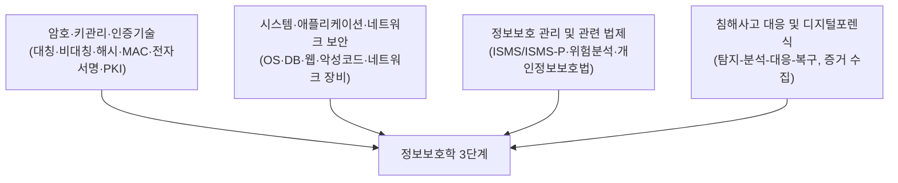

<Callout type="info">
  **이번 문서의 목표:** 독학사 제도에서 3단계가 갖는 성격, 정보보호학 3단계 과목의 출제영역 구조, 문항 유형(객관식·단답·서술)의 차이, 출제기준 문장을 실제 학습 항목으로 쪼개는 방법을 파악해 이후 23편의 학습 순서를 스스로 설계할 수 있게 한다.
</Callout>

## 독학사 3단계란 무엇인가

> **쉽게 말하면:** 3단계는 "전공을 얕게 훑는" 단계가 아니라 "전공을 실제로 깊이 파고드는" 단계다.

독학사(독학에 의한 학위취득시험)의 정식 명칭은 **독학학위제**이며, 국가평생교육진흥원(National Institute for Lifelong Education, 국가가 평생교육을 관리하기 위해 만든 기관)이 주관하는 국가시험이다. 전체 과정은 4단계로 이루어진다.

- **1단계 교양과정 인정시험**: 전공과 무관한 대학 1~2학년 교양 수준.
- **2단계 전공기초과정 인정시험**: 해당 전공에 들어가기 위한 기초 과목들.
- **3단계 전공심화과정 인정시험**: 전공을 실무·이론 양쪽에서 깊이 있게 다루는 과목들. **이 시리즈가 대상으로 하는 단계**다.
- **4단계 학위취득 종합시험**: 여러 전공과목을 종합해 서술형 위주로 평가하는 마지막 관문.

정보보호학 전공에서 3단계는 2단계(정보통신개론, 자료구조, 운영체제, 데이터베이스 같은 전산 기초)를 이수했다는 전제 위에서, 암호학·시스템 보안·네트워크 보안·정보보호 관리체계·법령까지 정보보호학의 실질적인 전공 지식을 시험한다. 그래서 이 시리즈는 컴퓨터 구조나 TCP/IP 계층 자체를 처음부터 가르치지 않는다. 대신 그 지식을 **정보보호 관점**으로 다시 정렬해 접근통제·암호·위험분석에 바로 연결하는 데 집중한다.

<Callout type="warning">
  3단계 응시를 위해서는 원칙적으로 2단계(또는 동등 학력)를 먼저 충족해야 한다. 정확한 응시 자격, 과목 조합 규정, 연간 시행 횟수는 국가평생교육진흥원의 **최신 공고를 확인해야 한다.** 이 문서는 학습 전략에 필요한 구조적 이해만 다룬다.
</Callout>

## 정보보호학 3단계 출제영역 구조

국가평생교육진흥원의 출제기준은 보통 과목을 몇 개의 **대영역**으로 나누고, 각 대영역 아래에 세부 키워드를 나열하는 방식으로 공개된다. 정보보호학 3단계는 통상 다음 네 개의 큰 축으로 구성된다고 보고 이 시리즈의 목차를 짰다.

이 네 축은 서로 독립된 암기 목록이 아니라 **서로를 참조하는 관계**다. 예를 들어 접근통제(축 B)를 온전히 이해하려면 인증 방식(축 A의 일부)을 알아야 하고, ISMS-P 인증기준(축 C)의 보호대책 요구사항 안에는 암호·접근통제·침해사고 대응이 다시 항목으로 들어 있다. 이 시리즈의 05~20편이 "암호 → 시스템·웹 → 관리체계·법령 → 네트워크·대응"의 순서로 배치된 이유도, 뒤 축을 이해하는 데 필요한 개념을 앞 축에서 먼저 준비해두기 위해서다.

<Callout type="warning">
  각 대영역의 정확한 명칭과 세부 비중(%)은 회차·개정판마다 달라질 수 있다. 이 시리즈의 장 구성은 여러 회차에 공통으로 등장하는 핵심 키워드를 기준으로 재구성한 것이며, **실제 응시 전 최신 출제기준 원문 확인 필요**하다.
</Callout>

## 문항 유형: 객관식·단답·서술의 차이

독학사 3단계는 1·2단계보다 문항 형식이 다양해질 수 있다. 이 시리즈는 세 유형 모두에 대비하도록 설계했다.

| 유형 | 무엇을 묻는가 | 준비 방법 |
|------|--------------|-----------|
| 객관식(선택형) | 정의·비교·절차 중 하나를 보기 4개 중에서 고르게 함. "옳지 않은 것"·"바르게 짝지은 것" 유형이 흔하다 | 정답 보기뿐 아니라 오답 보기 3개가 왜 틀렸는지까지 설명할 수 있어야 한다 |
| 단답형 | 용어·수치를 짧게 직접 써서 채우게 함 (예: "대칭키 암호에서 암호화와 복호화에 같은 키를 쓰는 성질을 무엇이라 하는가") | 용어를 정의만 외우지 않고 **정확한 명칭 그대로** 쓸 수 있어야 한다. 유사 용어와 혼동하지 않도록 짝을 지어 암기한다 |
| 서술형 | 개념의 정의·구성 요소·절차를 문장으로 논리 있게 설명하게 함 (예: "ISMS-P 인증기준의 3개 영역을 설명하고 각 영역의 목적을 서술하라") | 핵심 정리 소절처럼 **구조화된 문장**으로 답안을 구성하는 연습이 필요하다. 항목을 나열만 하지 말고 각 항목이 왜 필요한지 한 문장씩 붙인다 |

객관식은 "아는 것 같은데 헷갈리는" 개념 쌍(예: 대칭키 vs 공개키, MAC vs 접근통제 모델의 MAC(Mandatory Access Control))에서 오답률이 높다. 이 시리즈의 본론 편은 이런 혼동 지점을 표로 정리해 "자주 틀리는 점" 소절에 모아둔다. 단답·서술형은 정의를 스스로 문장으로 재구성해 보는 연습이 없으면 시험장에서 막힌다. 그래서 각 편의 핵심 정리를 눈으로 읽고 끝내지 말고, 책을 덮고 자기 말로 다시 써 보는 방식으로 활용하는 것을 권장한다.

## 출제기준 문장을 학습 항목으로 쪼개는 법

출제기준은 흔히 "암호화, 키관리, 전자서명 및 인증기술"처럼 짧은 명사 나열로 되어 있다. 이 문장 하나를 그대로 암기 목표로 삼으면 실제로 무엇을 공부해야 하는지 알기 어렵다. 이 시리즈가 쓰는 분해 방법은 다음과 같다.

<Steps>
1. **명사를 개별 개념으로 분리한다**: "암호화, 키관리, 전자서명 및 인증기술" → 암호화(대칭·비대칭·운용 모드), 키관리(키 생성·분배·폐기), 전자서명(원리·검증), 인증기술(PKI·인증서) 네 갈래로 나눈다.
2. **각 개념에 "정의 → 왜 필요한가 → 비교 대상"을 붙인다**: 예를 들어 키관리라면 정의(키의 생명주기 관리)와 필요성(키가 유출되면 암호 전체가 무력화됨), 비교 대상(대칭키 관리 vs 공개키 관리의 난이도 차이)을 함께 적어 둔다.
3. **선행 개념과 후속 개념을 표시한다**: 전자서명을 이해하려면 해시 함수와 공개키 암호가 먼저 필요하다는 식으로, 이 시리즈의 "선행 의존" 표기를 참고해 순서를 어기지 않는다.
4. **예상 문항 형태를 미리 그려본다**: "다음 중 전자서명에 대한 설명으로 옳지 않은 것은?" 같은 질문을 스스로 만들어 보면, 그 개념에서 시험이 노리는 함정이 무엇인지 감이 잡힌다.
</Steps>

이 네 단계를 거치면 출제기준 한 줄이 학습 계획표의 여러 항목으로 구체화된다. 이 시리즈의 목차(02_목차.md) 자체가 이미 이 분해 작업을 마친 결과물이므로, 학습자는 각 편의 "다루는 개념"란을 출제기준 원문과 대조하면서 읽으면 된다.

## 시험 운영: 시간·점수·합격선

<Callout type="warning">
  시험 시간, 문항 수, 배점, 합격 점수, 과목별 응시 조합 규정은 회차마다 달라질 수 있으므로 **반드시 응시 회차의 공고 확인 필요**하다. 여기서는 전공심화과정 인정시험의 일반적인 운영 구조만 설명한다.
</Callout>

- **문항 형식**: 객관식(선택형) 위주이되, 과목·회차에 따라 단답형·서술형이 포함될 수 있다.
- **과목당 시험 시간**: 한 과목에 정해진 시간이 배정되며, 그 시간 안에 모든 문항을 풀어야 한다.
- **합격 기준**: 과목마다 정해진 점수(주로 백점 만점 기준 60점 이상) 이상이면 해당 과목이 합격 처리되는 절대평가 방식이 일반적이다. 정확한 커트라인과 예외는 공고 확인 필요하다.
- **과목 조합**: 3단계는 여러 과목 중 일정 개수를 선택해 응시하는 구조가 일반적이므로, 「정보보호」 외에 함께 응시할 과목과의 학습 시간 배분도 함께 고려해야 한다.

## 이 시리즈의 학습 전략 프레임

<Steps>
1. **용어·수학 기초를 먼저 통일한다**: 02편(핵심 용어 지도)과 03편(암호학을 위한 수학 기초)에서 자산·위협·취약점·위험 같은 용어와 모듈러 연산·XOR 같은 도구를 먼저 맞춰 둔다. 04편에서 계정·권한 개념을 정보보호 관점으로 재정렬한다.
2. **네 축을 순서대로 읽는다**: 05~08편(암호·PKI) → 09~12편(애플리케이션·DB·악성코드·취약점) → 13~16편(관리체계·접근통제·개인정보보호·포렌식) → 17~20편(네트워크·침해대응·위험분석·안전한 운영) 순으로, 뒤 편이 앞 편의 개념을 전제로 하는 흐름을 어기지 않는다.
3. **자주 틀리는 점을 모아 반복한다**: 각 편 끝의 "자주 틀리는 점"만 따로 모아 시험 직전에 다시 훑는다.
4. **기출·모의 문항(21~24편)으로 실전 감각을 점검한다**: 본론을 다 읽은 뒤 시간을 재고 풀어, 이해와 실전 사이의 간극을 좁힌다.
</Steps>

> **쉽게 말하면:** 04편까지는 도구를 준비하는 단계이고, 05편부터가 실제 시험 범위의 시작이다.

## 자주 틀리는 점

- **3단계를 "2단계의 심화 반복"으로 오해**: 3단계는 2단계 내용을 다시 설명해주지 않는다. OS·네트워크·DB의 기초 구조를 이미 안다는 전제 위에서 정보보호 관점의 응용을 묻는다.
- **출제기준 문장을 통째로 암기**: "암호화, 키관리, 전자서명 및 인증기술"이라는 문장 자체를 외우는 것은 실전에서 쓸모가 없다. 반드시 개별 개념으로 쪼개 정의·비교·절차 단위로 재구성해야 한다.
- **공고 확인 없이 이전 회차 정보로 준비**: 시험 시간, 합격 점수, 과목 조합 규정은 회차마다 바뀔 수 있다. 과거 후기의 숫자를 그대로 믿지 않는다.
- **암기와 이해를 분리하지 않음**: 법령 조문의 숫자(예: 처벌 기준의 구체적 금액·기간)는 암기 대상이지만, 그 조문이 왜 그런 구조로 되어 있는지는 이해 대상이다. 두 가지를 같은 방식으로 공부하면 비효율적이다.

## 핵심 정리

- 독학사 3단계는 전공심화과정으로, 정보보호학의 경우 암호·시스템/네트워크 보안·관리 및 법제·침해대응/포렌식 네 축으로 출제영역이 구성된다.
- 문항은 객관식·단답형·서술형이 섞일 수 있으며, 유형마다 준비 방법이 다르다.
- 출제기준의 짧은 문장은 반드시 개별 개념으로 분해하고 정의–필요성–비교 대상–선행 개념을 붙여야 실전에서 쓸 수 있다.
- 시험 시간·합격 점수 등 구체 수치는 회차마다 다르므로 공고 확인 필요하며, 이 시리즈는 개념 구조 학습에 집중한다.
- 학습은 용어·수학 기초(02~04편) → 네 축 본론(05~20편) → 자주 틀리는 점 반복 → 기출·모의(21~24편) 순으로 진행한다.

## 마무리 복습

<Quiz
  questionNumber={1}
  question="독학사 제도에서 정보보호학 3단계가 속하는 과정은 무엇인가?"
  options={['교양과정 인정시험', '전공기초과정 인정시험', '전공심화과정 인정시험', '학위취득 종합시험']}
  correctAnswer={3}
  explanation="정보보호학 3단계는 전공을 깊이 있게 다루는 전공심화과정 인정시험에 속한다."
  optionExplanations={['교양과정은 1단계로 전공과 무관한 교양 수준이다.', '전공기초과정은 2단계로 전공 진입 전 기초 과목들이다.', '정답. 3단계는 전공심화과정이며 이 시리즈의 대상이다.', '종합시험은 4단계로 여러 전공과목을 종합 평가한다.']}
/>

<Quiz
  questionNumber={2}
  question="이 시리즈가 정보보호학 3단계 출제영역을 구성한 네 개의 축에 해당하지 않는 것은?"
  options={['암호·키관리·인증기술', '시스템·애플리케이션·네트워크 보안', '정보보호 관리 및 관련 법제', '프로그래밍 언어 문법 심화']}
  correctAnswer={4}
  explanation="정보보호학 3단계 출제영역은 암호, 시스템/네트워크 보안, 관리 및 법제, 침해사고 대응 및 포렌식의 네 축으로 구성되며 프로그래밍 언어 문법 자체는 이 과목의 출제 범위가 아니다."
  optionExplanations={['암호·키관리·인증기술은 첫 번째 축이다.', '시스템·애플리케이션·네트워크 보안은 두 번째 축이다.', '정보보호 관리 및 관련 법제는 세 번째 축이다.', '정답. 프로그래밍 문법 심화는 이 과목의 출제 범위(제외 항목)가 아니다.']}
/>

<Quiz
  questionNumber={3}
  question="서술형 문항을 준비하는 방법으로 가장 적절한 것은?"
  options={['정답 보기 하나만 암기해 둔다', '개념을 항목만 나열하고 이유는 생략한다', '핵심 정리를 눈으로 읽고 그대로 덮는다', '항목을 나열하되 각 항목이 왜 필요한지 한 문장씩 붙여 구조화된 문장으로 답안을 구성한다']}
  correctAnswer={4}
  explanation="서술형은 개념의 정의·구성 요소·절차를 논리 있게 문장으로 설명해야 하므로, 항목 나열에 그치지 않고 각 항목의 필요성까지 붙여 답안을 구조화하는 연습이 필요하다."
  optionExplanations={['서술형은 선택형이 아니므로 정답 보기라는 개념 자체가 없다.', '이유 없는 나열은 서술형에서 감점 대상이다.', '눈으로만 읽으면 실제로 문장을 구성하는 능력이 늘지 않는다.', '정답. 항목과 이유를 함께 구조화하는 연습이 서술형 대비의 핵심이다.']}
/>

<Quiz
  questionNumber={4}
  question="출제기준의 '암호화, 키관리, 전자서명 및 인증기술'이라는 문장을 학습 계획으로 바꿀 때 옳은 접근은?"
  options={['문장 전체를 그대로 암기한다', '네 개의 개별 개념으로 나누고 각각 정의-필요성-비교 대상-선행 개념을 붙인다', '가장 쉬워 보이는 개념 하나만 공부한다', '문장에 없는 세부 항목은 아예 학습하지 않는다']}
  correctAnswer={2}
  explanation="출제기준의 짧은 명사 나열은 그대로는 학습 목표가 되지 못하므로, 개별 개념으로 분해하고 정의-필요성-비교 대상-선행 개념까지 구체화해야 실전에서 활용할 수 있다."
  optionExplanations={['문장 통째 암기는 실전 응용에 도움이 되지 않는다.', '정답. 분해와 구체화가 출제기준을 학습 항목으로 바꾸는 올바른 방법이다.', '한 개념만 공부하면 나머지 영역에서 실점한다.', '세부 항목은 출제기준 원문과 실제 기출 경향을 함께 참고해 보충해야 한다.']}
/>

<Quiz
  questionNumber={5}
  question="시험 시간, 합격 점수와 같은 시험 운영 정보에 대한 올바른 태도는?"
  options={['과거 회차 후기를 그대로 신뢰한다', '이런 정보는 학습에 영향이 없으므로 무시한다', '회차마다 달라질 수 있으므로 응시 회차의 공식 공고를 확인한다', '한 번 확인하면 이후 모든 회차에 그대로 적용한다']}
  correctAnswer={3}
  explanation="시험 운영에 관한 구체적 수치는 회차마다 달라질 수 있으므로 반드시 응시하는 회차의 국가평생교육진흥원 공식 공고를 확인해야 한다."
  optionExplanations={['후기는 참고 자료일 뿐 공식 정보가 아니다.', '시험 시간과 합격 점수는 응시 전략에 직접 영향을 준다.', '정답. 회차별 공식 공고 확인이 가장 안전한 방법이다.', '규정이 개정될 수 있으므로 매 회차 다시 확인해야 한다.']}
/>

## 참고 자료

- [국가평생교육진흥원 독학학위제](https://bdes.nile.or.kr)
