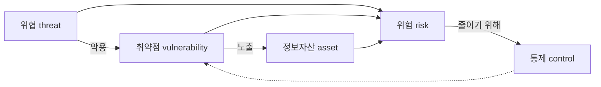
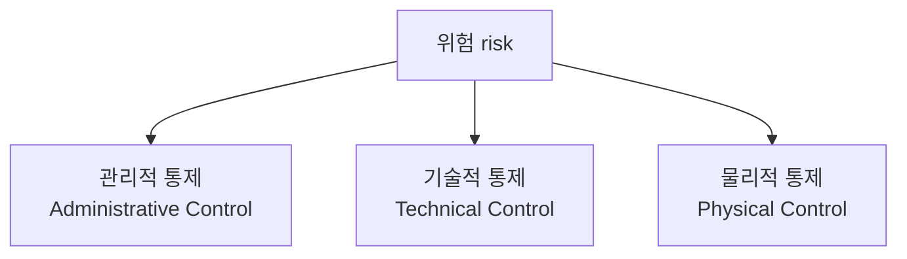

<Callout type="info">
  **이번 문서의 목표:** 정보보호 전 영역에서 반복 등장하는 자산·위협·취약점·위험·통제라는 다섯 용어의 정확한 정의와 서로의 관계, 그리고 CIA를 비롯한 보안 목표와 통제의 세 가지 분류(관리적·기술적·물리적)를 이 편에서 한 번에 정리해, 이후 편에서는 반복 설명 없이 바로 이 용어들을 사용한다.
</Callout>

## 왜 이 용어들을 먼저 정리하는가

> **쉽게 말하면:** "위험하다"는 말을 시험은 자산·위협·취약점 세 조각으로 쪼개서 정확히 구분해 묻는다.

일상에서 "보안이 위험하다"라고 뭉뚱그려 말하는 상황을, 정보보호 이론은 **자산(asset)·위협(threat)·취약점(vulnerability)·위험(risk)** 네 개념으로 분해해서 다룬다. 이 네 개념은 이후 05편(암호)부터 20편(안전한 운영)까지, 그리고 13편(관리체계)·19편(위험분석)에서 계속 재등장한다. 정의를 여기서 정확히 잡아 두지 않으면, 뒤 편에서 "위험분석"이나 "위협모델링" 같은 용어가 나올 때마다 다시 헷갈리게 된다. 그래서 이 편은 정보보호학 3단계 전체의 **공용 사전** 역할을 한다.

## 정보자산·위협·취약점·위험의 관계

### 정보자산(information asset)

> **쉽게 말하면:** 보호할 가치가 있어서 잃으면 손해가 나는 대상 전부다.

**정보자산**이란 조직이 보유한 것 중 정보 그 자체(고객 데이터베이스, 설계 문서)뿐 아니라 정보를 다루는 데 필요한 하드웨어(서버, 네트워크 장비), 소프트웨어(운영체제, 애플리케이션), 인력(그 정보를 다루는 담당자), 무형자산(브랜드 신뢰도, 조직의 평판)까지 포함하는 넓은 개념이다. "자산"이라는 한자어 자체는 재산·재화를 뜻하지만, 정보보호에서는 금전으로 환산되지 않는 신뢰도·평판까지 자산으로 취급한다는 점이 특징이다.

- 예시: 회사의 고객 개인정보 데이터베이스, 인사 시스템 서버, 소스코드 저장소, 임직원의 업무 역량, "이 회사는 개인정보를 안전하게 다룬다"는 대외 신뢰도.

### 위협(threat)

> **쉽게 말하면:** 자산에 손해를 끼칠 수 있는 잠재적 원인이나 사건이다.

**위협**은 정보자산의 기밀성·무결성·가용성(뒤에서 설명)을 해칠 수 있는 잠재적인 원인이나 사건을 말한다. 위협은 사람(악의적 해커, 실수하는 내부 직원), 자연현상(화재, 지진, 정전), 기술적 결함(하드웨어 고장) 모두를 포함한다. 중요한 점은 위협 그 자체는 아직 실현되지 않은 "가능성"이라는 것이다. 예를 들어 "랜섬웨어 공격"은 위협이고, 실제로 회사 서버가 랜섬웨어에 감염되어 파일이 암호화된 사건은 위협이 **실현**된 결과다.

- 예시: 외부 해커의 침입 시도, 내부자의 고의적 정보 유출, 자연재해로 인한 전산실 파손, 악성코드 감염.

### 취약점(vulnerability)

> **쉽게 말하면:** 위협이 파고들 수 있는 자산의 약점이다.

**취약점**은 정보자산이 가진 결함이나 약점으로, 위협이 이 약점을 통해 실제 피해로 이어질 수 있는 통로 역할을 한다. 취약점은 소프트웨어의 코딩 결함(예: 입력값 검증 누락), 관리 절차의 허점(예: 퇴사자 계정 미삭제), 물리적 허점(예: 서버실 출입통제 미비) 등 다양한 형태로 나타난다. 취약점이 있어도 그것을 노리는 위협이 없으면 당장의 피해로 이어지지 않는다는 점에서, 취약점과 위협은 서로 다른 축의 개념이다.

- 예시: 패치되지 않은 운영체제, 추측하기 쉬운 비밀번호 정책, 방화벽 규칙의 허술한 설정, 사원증 없이 출입 가능한 서버실 문.

### 위험(risk)

> **쉽게 말하면:** 위협이 취약점을 뚫고 자산에 피해를 입힐 가능성과 그 피해 크기를 곱한 개념이다.

**위험**은 특정 위협이 특정 취약점을 이용해 자산에 손실을 끼칠 **가능성**(발생 확률)과 그로 인한 **피해 규모**(영향도)를 종합한 개념이다. 위험분석·평가는 19편에서 정성·정량 방법으로 자세히 다루지만, 이 단계에서 기억해야 할 것은 위험이 자산·위협·취약점 세 요소의 조합으로 표현된다는 구조다. 흔히 다음과 같은 개념식으로 표현한다.

$$
\text{위험} = f(\text{자산 가치}, \text{위협 발생 가능성}, \text{취약점의 심각도})
$$

- $f$: 함수(function)라는 뜻으로, 뒤 괄호 안 세 요소를 조합해 위험의 크기를 산출한다는 것을 나타내는 표기다. 실제 계산식은 조직·방법론마다 다르며 19편에서 구체적인 정성·정량 산출 방식을 다룬다.
- 자산 가치: 그 자산을 잃었을 때의 손실 규모.
- 위협 발생 가능성: 그 위협이 실제로 일어날 확률.
- 취약점의 심각도: 그 취약점이 얼마나 쉽게, 얼마나 크게 악용될 수 있는지.

네 개념의 관계를 그림으로 정리하면 다음과 같다.

이 그림에서 **통제**(control)는 취약점을 줄이거나 위협의 영향을 낮추는 모든 대응 수단을 가리킨다. 통제의 세 가지 분류는 바로 아래에서 다룬다.

<Callout type="warning">
  "위협"과 "취약점"을 뒤바꿔 쓰는 것이 가장 흔한 오답 함정이다. "SQL 인젝션에 취약한 게시판 코드"는 취약점이고, "그 취약점을 노려 데이터베이스를 탈취하려는 공격자"는 위협이다. 문항에서 이 둘을 서로 바꿔 서술하는 보기가 자주 오답으로 등장한다.
</Callout>

## 보안 목표: CIA와 그 확장

### CIA 삼각형

> **쉽게 말하면:** 정보보호가 지키려는 것은 결국 "비밀 유지", "내용 정확성", "필요할 때 사용 가능"이다.

정보보호의 가장 기본적인 목표는 **CIA**로 요약된다. 이는 미국 정보기관 이름이 아니라 세 영어 단어의 머리글자다.

| 목표 | 영어 | 뜻 | 위협받는 예시 |
|------|------|-----|---------------|
| 기밀성 | Confidentiality | 허가된 사람만 정보에 접근할 수 있도록 하는 것 | 개인정보 유출, 도청 |
| 무결성 | Integrity | 정보가 허가 없이 변경·훼손되지 않고 정확한 상태를 유지하는 것 | 성적 조작, 전송 중 데이터 변조 |
| 가용성 | Availability | 필요할 때 정당한 사용자가 정보·시스템을 지연 없이 사용할 수 있는 것 | 서비스 거부 공격(DoS)으로 인한 서버 마비 |

이 세 목표는 서로 상충하기도 한다. 예를 들어 기밀성을 극단적으로 강화해 접근 절차를 복잡하게 만들면 정당한 사용자의 접근 속도가 느려져 가용성이 떨어질 수 있다. 실제 정보보호 설계는 이 세 목표 사이에서 조직의 요구에 맞는 균형점을 찾는 작업이다.

> **쉽게 말하면:** 암호화(05편)는 주로 기밀성을, 해시·전자서명(07편)은 주로 무결성을, 이중화·백업은 주로 가용성을 지키기 위한 기술이다.

### CIA를 넘어선 확장 목표

시험 출제기준은 CIA 외에도 다음 목표를 함께 묻는다.

- **인증(authentication)**: 통신·접근의 상대방이 주장하는 신원이 진짜인지 확인하는 성질. 14편(접근통제·인증)에서 자세히 다룬다.
- **부인방지(non-repudiation)**: 어떤 행위(거래, 메시지 전송)를 한 사람이 나중에 "나는 하지 않았다"고 부인하지 못하게 만드는 성질. 전자서명(06편)이 이를 제공하는 대표적 기술이다.
- **책임추적성(accountability)**: 시스템에서 발생한 행위를 누가 했는지 사후에 추적할 수 있는 성질. 로그·감사(13편)와 직결된다.

이들은 CIA와 배타적인 별도 목표라기보다, CIA를 실현하는 과정에서 함께 요구되는 보조 목표로 이해하면 된다. 예를 들어 인증이 실패하면 애초에 "허가된 사람만"이라는 기밀성의 전제 자체가 무너진다.

### 업무연속성(BCP)과의 관계

가용성과 밀접하게 연결되는 개념으로 **업무연속성계획**(Business Continuity Plan, BCP, 재해나 사고가 발생해도 핵심 업무를 중단 없이 지속하거나 최단 시간 내 복구하기 위한 계획)이 있다. BCP는 단순히 시스템을 살리는 것(가용성)을 넘어, 조직의 핵심 업무 기능 자체를 지속시키는 더 넓은 범위의 계획이다. BCP 안에는 재해복구계획(Disaster Recovery Plan, DRP, 전산 시스템을 재해 이전 상태로 복구하기 위한 절차 계획)이 하위 요소로 포함되는 경우가 많다.

<Callout type="warning">
  BCP와 DRP를 동의어로 혼동하지 않는다. DRP는 IT 시스템 복구에 초점을 맞춘 절차이고, BCP는 시스템 복구를 포함해 조직 전체의 업무 지속(대체 사무실, 인력 재배치, 협력업체 소통 등)까지 아우르는 상위 계획이다.
</Callout>

## 통제(control)의 세 가지 분류

> **쉽게 말하면:** 위험을 줄이는 방법은 크게 "규정으로", "기술로", "물리적으로" 세 갈래다.

위험을 줄이기 위해 조직이 적용하는 대응 수단을 **통제**라고 부르며, 정보보호 관리체계(13편)와 ISMS-P 인증기준(15편)은 통제를 다음 세 가지로 분류한다.

| 분류 | 정의 | 예시 |
|------|------|------|
| 관리적 통제 | 정책·지침·절차·교육 등 사람과 조직의 행동을 규율하는 통제 | 정보보호 정책 수립, 보안 교육, 접근권한 신청·승인 절차, 인사규정에 따른 퇴사자 계정 회수 절차 |
| 기술적 통제 | 소프트웨어·하드웨어로 구현되는 통제 | 방화벽, 침입탐지시스템(IDS), 암호화, 접근통제 목록(ACL) |
| 물리적 통제 | 물리적 접근을 제한하거나 환경적 피해를 막는 통제 | 서버실 출입통제 카드, CCTV, 소화 설비, 항온항습 장치 |

세 통제는 서로를 대체하지 않고 **보완**한다. 예를 들어 서버실 출입을 카드로 통제(물리적)해도, 그 카드를 발급·회수하는 절차(관리적)가 없으면 퇴사자가 여전히 출입할 수 있고, 서버 자체에 접근 계정 통제(기술적)가 없으면 물리적으로 들어온 사람이 아무 데이터나 볼 수 있다. 시험은 종종 "다음 통제 중 성격이 다른 하나"를 묻는 방식으로 이 세 분류의 경계를 확인한다.

### 통제의 시점에 따른 또 다른 분류: 예방·탐지·교정

통제는 적용 방식(관리·기술·물리) 외에 **작동 시점**을 기준으로도 분류된다.

| 분류 | 뜻 | 예시 |
|------|-----|------|
| 예방 통제(preventive) | 사고가 발생하기 전에 막는 통제 | 방화벽 규칙, 접근권한 사전 승인, 보안 교육 |
| 탐지 통제(detective) | 사고 발생을 즉시 또는 사후에 발견하는 통제 | 침입탐지시스템(IDS), 로그 모니터링, CCTV 녹화 확인 |
| 교정 통제(corrective) | 사고 발생 후 피해를 복구하거나 재발을 막는 통제 | 백업으로부터 복구, 취약점 패치, 사고 후 절차 개선 |

이 두 축(적용 방식 × 작동 시점)을 곱하면 "기술적·탐지 통제"(예: IDS), "관리적·교정 통제"(예: 사고 후 정책 개정)처럼 하나의 통제를 두 축 모두로 설명할 수 있다. 시험에서 특정 통제 수단을 주고 "이것은 어떤 통제인가"를 물을 때, 두 축 중 어느 것을 기준으로 묻는지 문두를 정확히 읽어야 한다.

## 자주 틀리는 점

- **위협과 취약점을 뒤바꿔 서술**: 위협은 자산 바깥의 잠재적 원인, 취약점은 자산 자체의 약점이다. "해커"는 위협이지 취약점이 아니다.
- **위험을 위협과 동의어로 사용**: 위험은 위협·취약점·자산 가치를 종합한 결과 개념이다. 취약점이 없으면 위협이 있어도 위험은 실현되지 않는다.
- **BCP와 DRP를 동일시**: DRP는 BCP의 IT 복구 부분에 해당하는 하위 계획이다.
- **관리적·기술적·물리적 통제를 예방·탐지·교정과 혼동**: 두 분류는 서로 다른 축(적용 방식 vs 작동 시점)이며, 하나의 통제 수단이 두 축 모두에서 각각 분류될 수 있다.
- **CIA를 셋 중 하나만 지키면 충분하다고 오해**: 실제 설계는 세 목표 사이의 상충을 인정하고 균형점을 찾는 작업이며, 특정 상황에서 어느 목표가 더 중요한지 판단하는 문제가 자주 출제된다.

## 핵심 정리

- 정보자산·위협·취약점·위험은 서로 다른 층위의 개념이며, 위험은 이 셋을 조합한 결과다.
- 보안의 기본 목표는 기밀성·무결성·가용성(CIA)이며, 인증·부인방지·책임추적성이 이를 보조한다.
- BCP는 조직의 업무 지속 전체를 다루는 상위 계획이고, DRP는 그중 IT 시스템 복구에 초점을 맞춘 하위 계획이다.
- 통제는 적용 방식에 따라 관리적·기술적·물리적으로, 작동 시점에 따라 예방·탐지·교정으로 분류되며 두 축은 서로 독립적이다.
- 이 편의 용어는 05편부터 20편까지 반복 사용되므로, 뒤 편에서 "위험"·"통제"라는 단어가 나오면 이 편의 정의로 돌아와 확인한다.

## 마무리 복습

<Quiz
  questionNumber={1}
  question="패치되지 않은 운영체제의 보안 결함처럼, 위협이 파고들 수 있는 자산의 약점을 가리키는 용어는?"
  options={['정보자산', '위협', '취약점', '통제']}
  correctAnswer={3}
  explanation="위협이 실제 피해로 이어지는 통로가 되는 자산의 약점이나 결함을 취약점이라 한다."
  optionExplanations={['정보자산은 보호할 가치가 있는 대상 자체를 가리킨다.', '위협은 자산 바깥에서 피해를 줄 수 있는 잠재적 원인이다.', '정답. 취약점은 위협이 악용하는 자산의 약점이다.', '통제는 위험을 줄이기 위해 적용하는 대응 수단이다.']}
/>

<Quiz
  questionNumber={2}
  question="위험(risk)에 대한 설명으로 가장 적절한 것은?"
  options={['자산 자체의 결함만을 의미한다', '자산·위협·취약점을 종합해 산출되는 손실 가능성과 규모의 개념이다', '위협과 완전히 같은 개념이다', '오직 물리적 재해만을 가리킨다']}
  correctAnswer={2}
  explanation="위험은 자산 가치, 위협 발생 가능성, 취약점의 심각도를 종합해 산출되는 손실 가능성과 규모를 나타내는 개념이다."
  optionExplanations={['자산 자체의 결함은 취약점에 해당한다.', '정답. 위험은 자산·위협·취약점을 조합한 결과 개념이다.', '위협은 위험을 구성하는 요소 중 하나일 뿐 동일한 개념이 아니다.', '위험은 자연재해뿐 아니라 사람에 의한 위협도 포함하는 넓은 개념이다.']}
/>

<Quiz
  questionNumber={3}
  question="다음 중 CIA 삼각형의 구성 요소가 아닌 것은?"
  options={['기밀성(Confidentiality)', '무결성(Integrity)', '가용성(Availability)', '수익성(Profitability)']}
  correctAnswer={4}
  explanation="CIA는 기밀성, 무결성, 가용성의 머리글자이며 수익성은 정보보호의 보안 목표에 해당하지 않는다."
  optionExplanations={['기밀성은 허가된 사람만 정보에 접근하게 하는 목표다.', '무결성은 정보가 허가 없이 변경되지 않게 하는 목표다.', '가용성은 필요할 때 정당한 사용자가 사용할 수 있게 하는 목표다.', '정답. 수익성은 보안 목표가 아니라 경영 지표에 해당한다.']}
/>

<Quiz
  questionNumber={4}
  question="서버실 출입을 사원증으로 제한하는 통제는 어떤 분류에 해당하는가?"
  options={['관리적 통제', '기술적 통제', '물리적 통제', '재무적 통제']}
  correctAnswer={3}
  explanation="서버실 출입을 물리적으로 제한하는 카드 출입통제는 물리적 통제에 해당한다."
  optionExplanations={['관리적 통제는 정책·절차·교육처럼 사람의 행동을 규율하는 통제다.', '기술적 통제는 소프트웨어·하드웨어로 구현되는 통제다.', '정답. 출입카드처럼 물리적 접근을 제한하는 수단은 물리적 통제다.', '재무적 통제는 이 시리즈에서 다루는 세 가지 통제 분류에 포함되지 않는다.']}
/>

<Quiz
  questionNumber={5}
  question="BCP와 DRP의 관계에 대한 설명으로 옳은 것은?"
  options={['DRP가 BCP를 포함하는 상위 개념이다', 'BCP와 DRP는 완전히 같은 개념이다', 'BCP는 조직의 업무 지속 전체를 다루며 DRP는 그중 IT 시스템 복구에 초점을 맞춘 하위 계획이다', 'DRP는 물리적 통제와 무관한 개념이다']}
  correctAnswer={3}
  explanation="BCP는 재해 시 핵심 업무 기능 자체의 지속을 다루는 상위 계획이며, DRP는 그중 IT 시스템 복구 절차에 초점을 맞춘 하위 계획이다."
  optionExplanations={['상위·하위 관계가 반대로 서술되어 있다.', 'DRP는 BCP의 IT 복구 부분에 해당하는 하위 개념이다.', '정답. BCP가 상위 계획이고 DRP는 IT 복구에 초점을 맞춘 하위 계획이다.', 'DRP 복구 과정에는 전산실 등 물리적 통제와 관련된 조치도 포함될 수 있다.']}
/>

## 참고 자료

- [국가평생교육진흥원 독학학위제](https://bdes.nile.or.kr)
- [한국인터넷진흥원(KISA)](https://www.kisa.or.kr)
