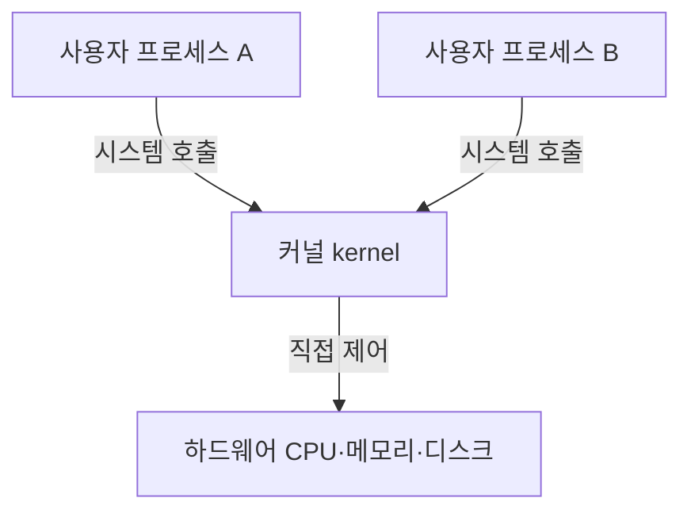

<Callout type="info">
  **이번 문서의 목표:** 운영체제의 사용자·프로세스·커널 구조와 계정·그룹·권한 체계, 파일 권한 문자열(rwx)의 의미를 정보보호 관점(최소 권한 원칙, 계정 분리)으로 재정렬해, 09편(애플리케이션·DB 보안)과 12편(DB 접근통제), 14편(접근통제·인증)에서 공통으로 쓰는 사전지식을 갖춘다.
</Callout>

## 왜 OS·계정 개념을 정보보호 관점으로 다시 보는가

> **쉽게 말하면:** 운영체제 수업에서 "어떻게 동작하는가"를 배웠다면, 이 편은 "그 구조가 왜 보안에 중요한가"를 다시 짚는다.

2단계에서 운영체제(OS, Operating System)의 프로세스 관리, 메모리 관리, 파일 시스템 구조를 이미 배웠다는 전제 위에서, 이 편은 그 지식을 **정보보호 관점**으로 다시 정렬한다. 같은 "권한(permission)"이라는 단어라도, 운영체제론에서는 "프로세스가 자원에 접근할 수 있는 능력"을 설명하는 데 쓰이지만, 정보보호에서는 "이 권한이 필요 이상으로 넓게 부여되어 있지는 않은가"를 검토하는 대상이 된다. 이 관점의 차이를 분명히 해 두어야 09편의 애플리케이션 계층 보안, 12편의 데이터베이스 접근통제, 14편의 접근통제 모델(MAC·DAC·RBAC)을 읽을 때 "왜 굳이 권한을 이렇게 쪼개는가"를 이해할 수 있다.

## 사용자·프로세스·커널의 기본 구조

### 커널과 사용자 모드의 분리

> **쉽게 말하면:** 운영체제는 아무나 손댈 수 없는 "안쪽 방"과 일반 프로그램이 돌아가는 "바깥 방"을 나눠 놓는다.

**커널**(kernel, 운영체제의 핵심부로 하드웨어를 직접 제어하고 자원을 관리하는 부분)은 CPU·메모리·디스크·네트워크 장치 같은 하드웨어 자원을 직접 통제하는 운영체제의 핵심 부분이다. 일반 응용 프로그램은 커널 영역에 직접 접근하지 못하고, 반드시 **시스템 호출**(system call, 응용 프로그램이 커널에게 특정 작업을 대신 처리해 달라고 요청하는 통로)을 통해서만 하드웨어 자원을 이용할 수 있다. 이 구조를 CPU 실행 특권 수준으로 구분해 **커널 모드**(kernel mode, 모든 명령어와 자원에 접근 가능한 특권 상태)와 **사용자 모드**(user mode, 제한된 명령어만 실행 가능한 일반 상태)로 부른다.

정보보호 관점에서 이 분리는 **격리**(isolation)의 가장 기초적인 형태다. 만약 사용자 모드의 프로세스가 커널 모드로 마음대로 전환할 수 있다면, 악성코드(10편) 하나가 시스템 전체를 장악하는 데 아무 장벽이 없어진다. 실제로 많은 시스템 취약점(11편)은 "사용자 모드 프로그램이 의도치 않게 커널 권한을 얻게 되는" 권한 상승(privilege escalation, 공격자가 원래 부여받은 것보다 높은 권한을 부당하게 획득하는 것) 문제로 귀결된다.

### 프로세스와 그 소유자

**프로세스**(process, 실행 중인 프로그램의 인스턴스)는 실행될 때 반드시 **소유자(owner)** 계정을 가진다. 이 소유자 정보는 그 프로세스가 어떤 파일에 접근할 수 있고 어떤 시스템 호출을 실행할 수 있는지를 결정하는 기준이 된다. 예를 들어 일반 사용자 계정으로 실행된 프로세스는 그 사용자가 소유하지 않은 다른 사용자의 파일을 함부로 읽거나 쓸 수 없다. 이 원리가 뒤에서 다룰 계정·권한 체계의 근거가 된다.

## 계정·그룹·권한 체계

### 계정(account)과 UID

> **쉽게 말하면:** 컴퓨터는 사람 이름이 아니라 번호로 "누구인지"를 구분한다.

운영체제는 사용자를 사람이 읽는 이름(예: `admin`)이 아니라 내부적으로 고유한 숫자인 **사용자 식별자**(User ID, UID)로 구분한다. 리눅스 계열 시스템에서 UID 0번은 관례적으로 **루트(root)** 계정에 부여되며, 이 계정은 시스템의 거의 모든 제약을 넘어서는 **최고 관리자 권한**을 갖는다. 일반 사용자 계정은 그보다 큰 UID를 부여받고, 자신이 만든 파일과 실행한 프로세스에 대해서만 기본 권한을 가진다.

### 그룹(group)과 권한 묶음

**그룹**(group)은 여러 계정을 하나로 묶어 동일한 권한 집합을 한 번에 부여·회수할 수 있게 하는 단위다. 예를 들어 개발팀 전원에게 특정 소스코드 저장소에 대한 접근 권한을 개별적으로 하나씩 부여하는 대신, `developers`라는 그룹을 만들어 그 그룹에만 권한을 부여하고 팀원 계정을 그 그룹에 소속시키는 방식이다. 이렇게 하면 신규 입사자는 그룹에 추가하기만 하면 되고, 퇴사자는 그룹에서 빼기만 하면 되어 **권한 관리의 일관성**이 크게 좋아진다.

> **쉽게 말하면:** 계정마다 따로 열쇠를 만들지 않고, "개발팀 열쇠"를 하나 만들어 필요한 사람에게 복사해 주는 것과 같다.

이 그룹 기반 권한 관리는 12편의 데이터베이스 Role(역할) 설계, 14편의 역할기반접근통제(Role-Based Access Control, RBAC)와 개념적으로 같은 뿌리를 갖는다. 개별 계정에 권한을 하나씩 붙이는 대신, 역할(그룹)에 권한을 붙이고 계정을 역할에 배정하는 구조가 여러 계층에서 반복되는 것이다.

## 최소 권한 원칙(principle of least privilege)

> **쉽게 말하면:** 필요한 일을 하는 데 딱 필요한 권한만 주고, 더는 주지 않는다.

**최소 권한 원칙**은 어떤 계정·프로세스·시스템이든 자신의 업무 수행에 **꼭 필요한 최소한의 권한만** 부여받아야 한다는 정보보호의 핵심 원칙이다. 이 원칙은 04편뿐 아니라 12편(DB 접근통제), 13편(관리체계), 14편(접근통제 모델) 전체를 관통하는 설계 사상이다.

최소 권한 원칙이 지켜지지 않았을 때의 위험을 예시로 살펴보자.

- 웹 서버 애플리케이션 계정이 데이터베이스에 접속할 때 관리자(DBA) 권한 계정을 그대로 사용한다면, 그 애플리케이션에 취약점(11편)이 하나만 있어도 공격자는 데이터베이스 전체를 마음대로 조작할 수 있게 된다. 반대로 그 애플리케이션 전용 계정에 필요한 테이블의 조회·입력 권한만 부여했다면, 같은 취약점이 뚫려도 피해 범위가 그 테이블로 제한된다.
- 일반 사무직원의 업무용 PC 계정에 시스템 전체를 재구성할 수 있는 관리자 권한을 상시로 부여해 두면, 그 직원의 계정이 피싱(10편에서 다룰 사회공학적 기법과 연결)으로 탈취되었을 때 공격자가 곧바로 시스템 전체를 장악하게 된다.

이 두 예시의 공통점은 "권한이 실제 필요보다 넓게 부여되어 있었다"는 것이며, 최소 권한 원칙은 이런 **불필요한 권한의 존재 자체를 위험**으로 본다. 02편의 용어로 표현하면, 과도하게 부여된 권한은 그 자체가 하나의 취약점이다.

<Callout type="warning">
  최소 권한 원칙을 "권한을 아예 안 준다"로 오해하지 않는다. 업무 수행에 필요한 권한은 정확히 부여해야 하며, 원칙의 핵심은 "필요 이상으로" 주지 않는 것이다. 권한이 너무 적어 업무가 막히면 담당자가 임시방편으로 더 넓은 권한을 요청하게 되어, 오히려 통제되지 않은 권한 확산으로 이어질 수 있다.
</Callout>

## 계정 분리(separation of accounts, segregation of duties)

> **쉽게 말하면:** 한 사람이 모든 권한을 갖게 하지 말고, 중요한 일일수록 여러 계정·역할로 나눠 서로 견제하게 한다.

**계정 분리**(또는 직무 분리, segregation of duties)는 하나의 계정이나 하나의 사람이 시스템 전체를 좌우할 수 있는 권한을 독점하지 않도록, 역할과 권한을 여러 계정으로 나누는 원칙이다. 대표적인 적용 형태는 다음과 같다.

- **개인용 계정과 관리자 계정의 분리**: 시스템 관리자도 평소 업무(메일 확인, 문서 작성)는 일반 권한 계정으로 하고, 관리 작업을 할 때만 별도의 관리자 계정으로 전환한다. 이렇게 하면 일반 계정이 악성코드에 감염되어도 그 피해가 관리자 권한까지 번지지 않는다.
- **요청자와 승인자의 분리**: 예산 집행이나 권한 부여를 요청하는 사람과 그것을 승인하는 사람을 다르게 두어, 한 사람의 판단만으로 부정이 발생하지 않도록 한다.
- **개발 계정과 운영 계정의 분리**: 개발자가 테스트하는 환경의 계정과 실제 서비스가 운영되는 환경의 계정을 분리해, 개발 중 실수가 곧바로 운영 서비스에 영향을 주지 않게 한다.

계정 분리는 최소 권한 원칙과 짝을 이룬다. 최소 권한이 "한 계정에 얼마나 많은 권한을 줄 것인가"의 문제라면, 계정 분리는 "그 권한들을 몇 개의 계정에 어떻게 나눠 담을 것인가"의 문제다. 두 원칙을 함께 적용하면, 계정 하나가 탈취되더라도 피해가 그 계정이 맡은 좁은 범위로 한정된다. 이 사고방식은 13편의 ISMS 조직·역할 설계와 19편의 위험분석에서 "단일 실패점(single point of failure)을 줄인다"는 목표로 다시 등장한다.

## 파일 시스템 권한: rwx 문자열 읽기

### 권한 문자열의 구조

> **쉽게 말하면:** 파일 하나마다 "누가, 무엇을 할 수 있는가"를 10글자짜리 암호 같은 문자열로 적어 둔 것이 권한 문자열이다.

리눅스 계열 운영체제에서 파일의 권한은 `ls -l` 명령으로 확인할 수 있는 10자리 문자열로 표시된다. 예를 들어 `-rwxr-xr--`라는 문자열을 부분별로 나눠 읽으면 다음과 같다.

- **첫 번째 문자(파일 종류)**: `-`는 일반 파일, `d`는 디렉터리(폴더)를 뜻한다.
- **다음 세 글자(소유자, owner)**: 이 파일을 만든 계정이 가진 권한.
- **그다음 세 글자(그룹, group)**: 그 파일이 속한 그룹에 소속된 계정들이 가진 권한.
- **마지막 세 글자(기타, others)**: 소유자도 아니고 그룹에도 속하지 않은 나머지 모든 계정이 가진 권한.

각 세 글자 묶음은 순서대로 **읽기(read, r)·쓰기(write, w)·실행(execute, x)** 권한의 유무를 나타내며, 권한이 없으면 그 자리에 `-`가 표시된다.

| 문자 | 의미 | 없을 때 표시 |
|------|------|--------------|
| r | 읽기(read): 파일 내용을 볼 수 있음 | `-` |
| w | 쓰기(write): 파일 내용을 수정·삭제할 수 있음 | `-` |
| x | 실행(execute): 파일을 프로그램으로 실행하거나, 디렉터리인 경우 그 안으로 이동할 수 있음 | `-` |

앞의 예시 `-rwxr-xr--`를 다시 해석하면 다음과 같다.

| 대상 | 문자열 | 읽기 | 쓰기 | 실행 |
|------|--------|------|------|------|
| 소유자 | rwx | 가능 | 가능 | 가능 |
| 그룹 | r-x | 가능 | 불가능 | 가능 |
| 기타 | r-- | 가능 | 불가능 | 불가능 |

이 파일은 소유자만 수정(쓰기)할 수 있고, 같은 그룹 사람들은 읽고 실행은 가능하지만 수정은 못 하며, 그 외 모든 사용자는 읽기만 가능하다.

### 권한을 숫자로 표현하기: 8진수 표기

권한 문자열은 8진수(0~7 숫자) 세 자리로도 표현할 수 있다. r·w·x 각각에 $4$, $2$, $1$의 값을 매기고, 있는 권한의 값만 더한다.

$$
r(4) + w(2) + x(1)
$$

- $r$에 $4$, $w$에 $2$, $x$에 $1$을 매기는 것은 이 세 수를 더했을 때 어떤 조합이든 겹치지 않는 고유한 합이 나오도록 이진수 자리값($2^2, 2^1, 2^0$)을 그대로 쓴 것이다.

앞의 예시 `rwx r-x r--`를 숫자로 바꾸면 다음과 같다.

$$
\text{소유자 } rwx = 4+2+1 = 7
$$

$$
\text{그룹 } r\text{-}x = 4+0+1 = 5
$$

$$
\text{기타 } r\text{--} = 4+0+0 = 4
$$

따라서 `-rwxr-xr--`는 8진수로 `754`로 표기하며, 이는 `chmod 754 파일명` 명령으로 그대로 설정할 수 있는 값이다.

## 정보보호 관점에서 rwx 읽기: 최소 권한·계정 분리와의 연결

> **쉽게 말하면:** rwx 문자열은 그 파일 하나에 적용된 최소 권한 원칙의 실제 결과물이다.

앞서 다룬 최소 권한 원칙과 계정 분리는 추상적인 이념이 아니라, 바로 이 rwx 권한 설정을 통해 시스템에 **실제로 구현**된다.

- **소유자·그룹·기타 3단 구조 자체가 계정 분리의 축소판**이다. 파일을 만든 사람(소유자), 관련 업무를 함께 하는 사람들(그룹), 그 외 무관한 사람들(기타)의 권한을 서로 다르게 설정할 수 있게 함으로써, "이 파일과 관련이 없는 계정에는 접근 권한을 주지 않는다"는 최소 권한 원칙을 파일 단위로 실현한다.
- **`--- --- ---`(000)에 가까울수록 더 엄격한 최소 권한**이며, 시스템 설정 파일이나 개인정보가 담긴 파일일수록 기타(others) 권한을 `---`로 두어 관계없는 계정의 접근을 원천 차단하는 것이 원칙이다.
- **쓰기(w) 권한은 실행(x)·읽기(r)보다 더 신중하게 부여해야 한다.** 읽기 권한만 있으면 정보 유출(기밀성 침해) 위험이지만, 쓰기 권한까지 있으면 파일 내용을 조작(무결성 침해)할 수 있어 피해 범위가 커진다. 실행 권한이 불필요한 일반 문서·설정 파일에 실행 권한까지 부여되어 있다면, 그 자체가 취약점으로 지적될 수 있다(예: 웹 서버가 업로드된 파일을 실행 가능한 상태로 두면 악성 스크립트 실행으로 이어질 수 있다 — 11편에서 다시 다룬다).
- **기타(others) 권한이 소유자·그룹보다 넓게 설정되어 있는 경우**는 설정 실수이거나 심각한 취약점일 가능성이 높다. 예를 들어 `-rw-rw-rw-`(666)로 설정된 개인정보 파일은 시스템에 접근 가능한 모든 계정이 그 내용을 읽고 수정할 수 있다는 뜻이므로, 최소 권한 원칙에 정면으로 어긋난다.

이런 이유로 12편의 데이터베이스 접근통제, 15편의 개인정보 DB 보호기법을 다룰 때도 "누구에게 어떤 권한을 얼마나 좁게 부여했는가"를 확인하는 절차가 반복해서 등장하며, 그 판단 기준은 이 편에서 익힌 최소 권한·계정 분리 원칙과 정확히 같다.

<Callout type="warning">
  실행 권한(x)이 디렉터리(폴더)에 붙었을 때는 파일과 의미가 다르다. 디렉터리의 x 권한은 "그 디렉터리 안으로 이동(진입)할 수 있는 권한"이며, 읽기(r) 권한만 있고 실행(x) 권한이 없는 디렉터리는 안에 어떤 파일 목록이 있는지는 볼 수 있어도 그 안으로 들어가거나 안의 파일에 접근할 수는 없다.
</Callout>

## 자주 틀리는 점

- **커널 모드와 사용자 모드의 구분을 "관리자 계정이냐 아니냐"로 오해**: 이 구분은 CPU의 실행 특권 수준을 나타내는 것으로, 관리자(root) 계정으로 실행한 프로세스도 기본적으로는 사용자 모드에서 실행되며 시스템 호출을 통해서만 커널 기능을 이용한다.
- **최소 권한 원칙을 "권한을 최소화해서 아예 안 준다"로 오해**: 업무에 필요한 권한은 정확히 부여하되, 필요 이상으로 넓게 주지 않는 것이 핵심이다.
- **그룹 권한과 최소 권한 원칙을 상충 관계로 오해**: 그룹은 최소 권한을 어기는 것이 아니라, 같은 업무를 하는 계정들에 필요한 권한을 효율적으로 묶어 관리하는 수단이다.
- **rwx 세 자리를 소유자·그룹·기타 순서와 반대로 암기**: 항상 소유자 → 그룹 → 기타 순서이며, 이 순서를 헷갈리면 8진수 변환 문제에서 자릿수를 잘못 배치하게 된다.
- **8진수 권한 표기에서 r·w·x의 값을 잘못 매김**: r은 4, w는 2, x는 1이며, 이 순서와 값을 뒤바꾸면 완전히 다른 권한이 계산된다.
- **디렉터리의 실행 권한(x)을 파일의 실행 권한과 같은 의미로 착각**: 디렉터리에서 x는 "실행"이 아니라 "진입(접근)" 권한을 뜻한다.

## 핵심 정리

- 운영체제는 커널 모드와 사용자 모드를 분리해 하드웨어 자원에 대한 통제된 접근을 보장하며, 이 분리가 무너지면 권한 상승 취약점으로 이어진다.
- 계정은 UID로 식별되고, 그룹은 여러 계정에 권한을 효율적으로 묶어 부여하는 단위다.
- 최소 권한 원칙은 필요한 만큼만 권한을 부여하는 것이고, 계정 분리는 그 권한을 여러 계정·역할로 나눠 단일 실패점을 줄이는 것이다. 두 원칙은 서로 보완 관계다.
- 리눅스 파일 권한 문자열(예: `-rwxr-xr--`)은 소유자·그룹·기타 순서로 읽기·쓰기·실행 권한을 나타내며, 8진수(예: 754)로도 표현된다.
- rwx 권한 설정은 최소 권한·계정 분리 원칙이 파일 시스템 수준에서 구현된 결과이며, 이 판단 기준은 09·12·14·15편의 접근통제 논의에서 그대로 재사용된다.

## 마무리 복습

<Quiz
  questionNumber={1}
  question="일반 응용 프로그램이 하드웨어 자원을 이용하기 위해 반드시 거쳐야 하는 통로는?"
  options={['시스템 호출(system call)', '사용자 모드 직접 접근', '루트 계정 로그인', '그룹 권한 상속']}
  correctAnswer={1}
  explanation="사용자 모드의 응용 프로그램은 커널 영역에 직접 접근할 수 없고, 반드시 시스템 호출을 통해 커널에 작업을 요청해야 한다."
  optionExplanations={['정답. 시스템 호출은 사용자 모드 프로그램이 커널 기능을 이용하는 유일한 통로다.', '사용자 모드는 제한된 명령어만 실행 가능하며 하드웨어에 직접 접근할 수 없다.', '루트 계정 로그인 자체가 시스템 호출을 대체하지는 않는다.', '그룹 권한 상속은 파일 접근 권한과 관련된 개념으로 하드웨어 접근 통로와는 다르다.']}
/>

<Quiz
  questionNumber={2}
  question="최소 권한 원칙(principle of least privilege)에 대한 설명으로 옳은 것은?"
  options={['모든 계정에 동일한 권한을 부여한다', '업무 수행에 필요한 최소한의 권한만 부여한다', '관리자 계정에는 권한 제한을 두지 않는다', '권한 부여 절차를 생략해 업무 속도를 높인다']}
  correctAnswer={2}
  explanation="최소 권한 원칙은 계정이나 프로세스가 자신의 업무 수행에 꼭 필요한 최소한의 권한만 부여받아야 한다는 원칙이다."
  optionExplanations={['모든 계정에 동일한 권한을 주는 것은 오히려 최소 권한 원칙에 위배된다.', '정답. 업무에 필요한 만큼만 권한을 부여하는 것이 핵심이다.', '관리자 계정이라도 불필요한 권한까지 상시 부여하는 것은 위험하다.', '권한 부여 절차 생략은 오히려 통제되지 않은 권한 확산을 부른다.']}
/>

<Quiz
  questionNumber={3}
  question="시스템 관리자가 평소 업무는 일반 계정으로, 관리 작업을 할 때만 별도 관리자 계정으로 전환하는 방식이 실현하는 정보보호 원칙은?"
  options={['최소 권한 원칙만 해당한다', '계정 분리(직무 분리) 원칙', '가용성 확보 원칙', '부인방지 원칙']}
  correctAnswer={2}
  explanation="업무용 계정과 관리자 계정을 분리해 한 계정의 탈취가 곧바로 전체 권한 장악으로 이어지지 않게 하는 것은 계정 분리(직무 분리) 원칙의 대표적인 적용 사례다."
  optionExplanations={['최소 권한과 연관은 있지만 이 사례가 강조하는 핵심은 권한을 여러 계정으로 나누는 것이다.', '정답. 계정을 역할별로 나누어 단일 계정 탈취의 피해 범위를 줄이는 계정 분리 원칙이다.', '가용성은 시스템을 필요할 때 사용할 수 있게 하는 목표로 이 사례와는 관련이 적다.', '부인방지는 행위를 나중에 부인하지 못하게 하는 목표로 이 사례와는 다른 개념이다.']}
/>

<Quiz
  questionNumber={4}
  question="파일 권한 문자열 -rwxr-xr--에서 그룹(group)에 부여된 권한으로 옳은 것은?"
  options={['읽기·쓰기·실행 모두 가능', '읽기와 실행만 가능', '읽기만 가능', '아무 권한도 없음']}
  correctAnswer={2}
  explanation="문자열을 소유자(rwx)-그룹(r-x)-기타(r--)로 나누면 그룹에 해당하는 r-x는 읽기와 실행은 가능하지만 쓰기는 불가능함을 나타낸다."
  optionExplanations={['모두 가능한 것은 소유자(rwx)의 권한이다.', '정답. r-x는 읽기와 실행 권한만 있고 쓰기 권한은 없음을 나타낸다.', '읽기만 가능한 것은 기타(r--) 사용자의 권한이다.', 'r-x 문자열에는 r과 x 권한 표시가 있으므로 아무 권한이 없다는 것은 틀린 설명이다.']}
/>

<Quiz
  questionNumber={5}
  question="rwxr-xr--를 8진수 세 자리로 올바르게 변환한 값은?"
  options={['777', '754', '644', '700']}
  correctAnswer={2}
  explanation="소유자 rwx=4+2+1=7, 그룹 r-x=4+0+1=5, 기타 r--=4+0+0=4이므로 8진수 표기는 754다."
  optionExplanations={['777은 소유자·그룹·기타 모두 rwx일 때의 값이다.', '정답. 소유자 7, 그룹 5, 기타 4를 조합하면 754가 된다.', '644는 소유자 rw-, 그룹 r--, 기타 r--일 때의 값이다.', '700은 소유자만 rwx이고 그룹·기타는 권한이 전혀 없을 때의 값이다.']}
/>

## 참고 자료

- [한국인터넷진흥원(KISA)](https://www.kisa.or.kr)
- [NIST Computer Security Resource Center](https://csrc.nist.gov)
