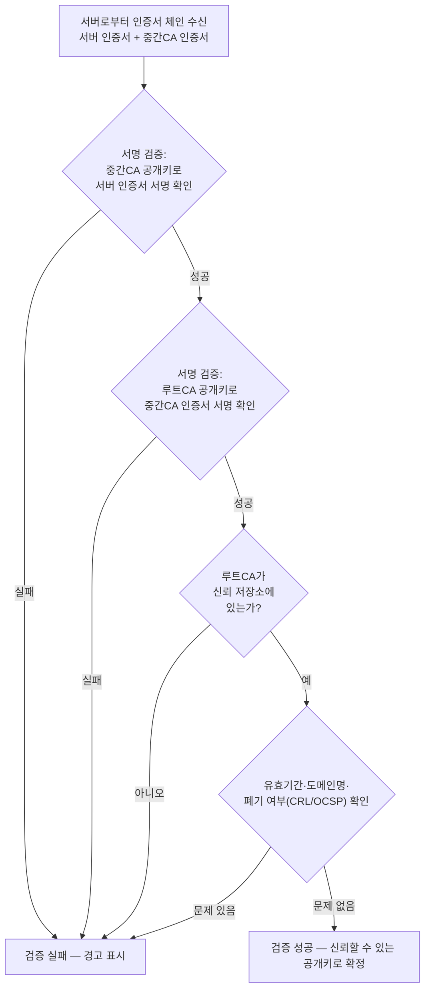
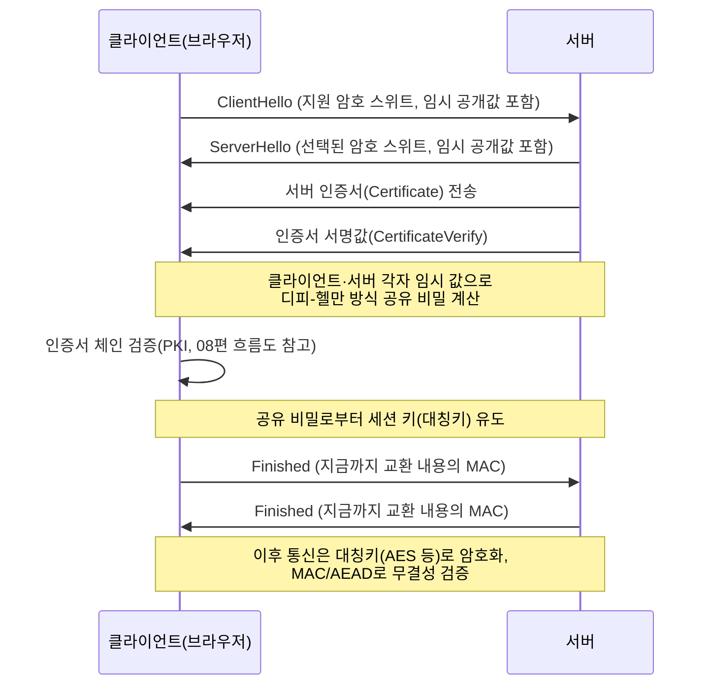

<Callout type="info">
  **이번 문서의 목표:** PKI(공개키 기반 구조)에서 인증서가 어떻게 발급·검증되는지 흐름도로 설명하고, TLS 핸드셰이크의 각 단계와 IPsec의 역할을 순서대로 말할 수 있다.
</Callout>

## 남은 문제: 공개키가 정말 그 사람의 것인가

06편에서 공개키 암호와 디피-헬만을 다루며 한 가지 구멍을 남겨두었다 — "이 공개키가 정말 내가 통신하려는 그 상대방의 것인지" 어떻게 확신할 수 있는가라는 **문제다.** 공개키 자체는 그냥 숫자 값이라, 누군가 "이게 은행 서버의 공개키입니다"라며 가짜 공개키를 내밀어도 그 자체만으로는 진위를 구분할 수 없다. 이 문제를 방치하면 중간자 공격(06편 참고)에 그대로 노출된다. 이를 해결하는 신뢰 체계가 **PKI**(Public Key Infrastructure, 공개키 기반 구조)다.

> **쉽게 말하면:** PKI는 "이 공개키는 진짜 이 사람 것이 맞다"고 제3자가 보증해 주는 신분증 발급 체계다.

## PKI의 핵심 구성 요소

### 인증기관(CA, Certificate Authority)

**인증기관**(CA)은 공개키와 소유자 정보를 묶어 **인증서**(certificate)를 발급하고 서명하는 신뢰받는 제3자 기관이다. CA가 자신의 개인키로 인증서에 전자서명(06편 참고)을 하면, 누구나 CA의 공개키로 그 서명을 검증해 "이 인증서는 CA가 진짜로 발급한 것"임을 확인할 수 있다.

### 인증서(Certificate)와 인증서 체인

인증서는 보통 국제 표준 형식인 **X.509**를 따르며, 소유자 정보(도메인명 등), 공개키, 발급 CA 정보, 유효기간, CA의 전자서명 등을 담는다. 실무에서는 CA가 하나가 아니라 **계층 구조**를 이룬다.

- **루트 CA(Root CA)**: 신뢰 체계의 최상위 기관. 스스로 서명한 인증서(자기서명 인증서, self-signed certificate)를 가지며, 운영체제·브라우저에 미리 내장되어 "무조건 신뢰하는 뿌리"로 취급된다.
- **중간 CA(Intermediate CA)**: 루트 CA로부터 서명받아 자신도 인증서를 발급할 권한을 위임받은 기관. 루트 CA를 직접 운영에 노출시키지 않기 위한 완충 계층 역할을 한다.
- **서버(최종 사용자) 인증서**: 실제 웹사이트나 서버가 사용하는 인증서로, 보통 중간 CA가 서명한다.

이렇게 최종 인증서 → 중간 CA → 루트 CA로 이어지는 서명 관계를 **인증서 체인**(certificate chain)이라 하며, 검증자는 이 체인을 루트 CA까지 거슬러 올라가며 서명을 하나씩 확인한다.

### 인증서 폐기 확인: CRL과 OCSP

인증서는 유효기간이 있지만, 기간 만료 전에도 개인키 유출 등으로 **미리 폐기**해야 하는 경우가 있다. 이를 확인하는 두 가지 방식이 있다.

- **CRL(Certificate Revocation List, 인증서 폐기 목록)**: CA가 폐기된 인증서 목록을 정기적으로 발행하는 파일. 검증자는 이 목록을 내려받아 대조한다. 목록이 커지고 갱신 주기가 있어 실시간성이 떨어진다는 단점이 있다.
- **OCSP(Online Certificate Status Protocol, 온라인 인증서 상태 프로토콜)**: 검증자가 특정 인증서 하나의 상태를 CA(또는 CA가 위임한 응답 서버)에 실시간으로 질의해 즉시 답을 받는 방식. CRL보다 실시간성이 높지만, 매 검증마다 온라인 질의가 필요하다는 부담이 있다.

## 인증서 검증 흐름

브라우저가 웹사이트(예: 은행 사이트)에 접속했을 때, 받은 서버 인증서를 검증하는 전체 흐름은 다음과 같다.

이 흐름에서 핵심은 **신뢰가 루트 CA로부터 아래로 전달된다**는 구조다. 루트 CA는 운영체제·브라우저 제조사가 엄격한 심사를 거쳐 미리 내장해 둔 소수의 기관만 해당하며, 이 신뢰 저장소(trust store)에 없는 CA가 서명한 인증서는 아무리 서명 자체가 수학적으로 유효해도 "신뢰할 수 없음" 경고를 낸다. 자기서명 인증서(스스로 서명한 인증서)에 브라우저가 경고를 띄우는 이유도 여기 있다 — 검증할 상위 CA가 없어 신뢰 체인을 구성할 수 없기 때문이다.

## TLS: 지금까지 배운 암호 기술의 실전 조합

**TLS**(Transport Layer Security)는 웹(HTTPS), 이메일 등에서 널리 쓰이는 보안 프로토콜로, 지금까지 05~08편에서 배운 대칭키·공개키·해시·MAC·PKI를 **하나의 흐름으로 조합한 실전 사례**다. TLS 1.3을 기준으로 핸드셰이크(handshake, 통신 시작 전 상호 협상 절차) 순서를 정리하면 다음과 같다.

핸드셰이크 각 단계를 05~07편 개념과 연결해 보면 다음과 같다.

1. **암호 스위트 협상**: 클라이언트와 서버가 사용할 대칭키 알고리즘(AES 등, 05편), 키교환 방식(디피-헬만 계열, 06편), 해시 알고리즘(07편)의 조합을 정한다.
2. **키교환**: 양측이 임시(ephemeral, 매 세션마다 새로 생성해 통신이 끝나면 버리는) 디피-헬만 값을 교환해 공유 비밀을 계산한다(06편의 디피-헬만 계산과 원리가 같다). 매 세션 임시 키를 쓰는 이 방식을 **완전 순방향 비밀성**(Perfect Forward Secrecy, PFS)이라 하며, 훗날 서버의 장기 개인키가 유출되어도 과거에 주고받은 세션은 복호화되지 않는다는 장점이 있다.
3. **서버 인증**: 서버가 인증서(08편의 PKI 체계로 발급된 것)와 그 인증서에 대응하는 개인키로 서명한 값을 함께 보내, 클라이언트가 "진짜 그 서버가 맞는지" 확인한다(06편의 전자서명 원리). 이 단계가 바로 디피-헬만 단독의 한계(중간자 공격 취약)를 PKI·전자서명으로 보완하는 지점이다.
4. **세션 키 유도**: 공유 비밀로부터 실제 데이터 암호화에 쓸 대칭키(세션 키)를 만들어낸다 — 이후 대용량 데이터는 빠른 대칭키(AES 등)로 암호화하는 **하이브리드 구조**(05편 참고)다.
5. **무결성 검증**: 각 메시지에는 MAC(또는 AEAD, 암호화와 인증을 한 번에 처리하는 방식)이 결합되어, 통신 중 변조를 탐지한다(07편 참고).

이처럼 TLS는 "새로운 암호 기술"이 아니라, **지금까지 배운 대칭키·공개키·해시·MAC·PKI를 실전 순서에 맞춰 엮은 프로토콜**이라는 점이 이 과목 전체를 관통하는 핵심 통찰이다.

## IPsec 개론

**IPsec**(Internet Protocol Security)은 TLS가 응용 계층 가까이(전송 계층 위)에서 동작하는 것과 달리, **네트워크 계층**(IP 계층)에서 동작하는 보안 프로토콜 모음이다. 특정 애플리케이션에 의존하지 않고 IP 패킷 자체를 보호하므로, 주로 **VPN(Virtual Private Network, 가상 사설망)** 구축에 쓰인다.

IPsec은 크게 두 가지 보안 프로토콜과 하나의 키교환 프로토콜로 구성된다.

- **AH(Authentication Header, 인증 헤더)**: 패킷의 무결성과 발신지 인증을 제공하지만 **기밀성(암호화)은 제공하지 않는다.**
- **ESP(Encapsulating Security Payload, 캡슐화 보안 페이로드)**: 기밀성(암호화)과 무결성·인증을 함께 제공한다. 실무에서 훨씬 널리 쓰인다.
- **IKE(Internet Key Exchange, 인터넷 키교환)**: 통신 양측이 사용할 키를 안전하게 협상하는 프로토콜로, 내부적으로 디피-헬만 방식의 키교환(06편 참고)을 사용한다.

IPsec은 또한 두 가지 운용 모드를 지원한다. **전송 모드**(transport mode)는 IP 패킷의 데이터 부분(페이로드)만 보호해 종단 간(end-to-end) 통신에 적합하고, **터널 모드**(tunnel mode)는 IP 패킷 전체를 새로운 IP 패킷으로 감싸 보호해 두 네트워크 구간(예: 지사와 본사 간 VPN 게이트웨이)을 안전하게 잇는 데 적합하다.

### TLS와 IPsec 비교

| 비교 항목 | TLS | IPsec |
|---|---|---|
| 동작 계층 | 전송 계층 위(응용 계층에 가까움) | 네트워크 계층(IP 계층) |
| 보호 대상 | 특정 애플리케이션의 통신(HTTPS 등) | IP 패킷 전체(애플리케이션 구분 없음) |
| 대표 용도 | 웹 브라우징, 이메일 등 | 사이트 간 VPN, 원격 접속 VPN |
| 애플리케이션 인지 필요 여부 | 애플리케이션이 TLS를 사용하도록 구현되어 있어야 함 | 애플리케이션 수정 없이 네트워크 계층에서 투명하게 동작 |

## 자주 틀리는 점

- "루트 CA도 다른 상위 기관에게 서명을 받는다"고 오해하는 경우 — 루트 CA는 자기서명 인증서를 가지며, 신뢰는 상위 서명이 아니라 **운영체제·브라우저에 미리 내장된 신뢰 저장소**에서 시작된다.
- CRL과 OCSP를 "같은 것"으로 혼동하는 경우 — CRL은 목록을 내려받아 대조하는 방식(실시간성 낮음), OCSP는 개별 질의로 즉시 응답받는 방식(실시간성 높음)이라는 차이가 있다.
- "TLS 핸드셰이크에서 서버만 인증하면 충분하다"는 생각 — 일반 웹 접속(HTTPS)은 서버 인증만 하는 경우가 대부분이지만, 상호 인증(mutual TLS, 클라이언트 인증서까지 요구)을 쓰는 경우도 있다는 점을 함께 알아 둔다.
- IPsec AH를 "암호화까지 제공한다"고 착각하는 경우 — AH는 무결성·인증만 제공하고, 기밀성(암호화)은 ESP가 담당한다.

## 핵심 정리

- PKI는 CA가 공개키와 소유자 정보를 묶어 서명한 인증서를 발급해, 공개키의 신원을 보증하는 신뢰 체계다.
- 인증서 검증은 서버 인증서 → 중간 CA → 루트 CA로 이어지는 서명 체인을 확인하고, CRL·OCSP로 폐기 여부를 함께 점검한다.
- TLS 핸드셰이크는 대칭키(05편)·공개키 키교환(06편)·해시·MAC(07편)·PKI(08편)를 하나로 엮어 서버 인증과 세션 키 합의를 수행하는 실전 조합이다.
- IPsec은 네트워크 계층에서 IP 패킷 자체를 보호하며(AH는 인증만, ESP는 암호화+인증), IKE로 키를 협상해 주로 VPN 구축에 쓰인다.

## 마무리 복습

<Quiz
  questionNumber={1}
  question="PKI(공개키 기반 구조)에서 루트 CA(Root CA)에 대한 설명으로 옳은 것은?"
  options={['루트 CA는 반드시 상위 기관으로부터 서명을 받아야 한다', '루트 CA는 자기서명 인증서를 가지며, 운영체제·브라우저의 신뢰 저장소에 미리 내장되어 신뢰의 출발점이 된다', '루트 CA는 인증서를 발급하지 않고 폐기만 담당한다', '루트 CA는 중간 CA로부터 서명을 받아야만 유효하다']}
  correctAnswer={2}
  explanation="루트 CA는 신뢰 체계의 최상위 기관으로 스스로 서명한 자기서명 인증서를 가지며, 이 인증서가 운영체제·브라우저에 미리 내장되어 있어 별도의 상위 검증 없이 신뢰의 뿌리 역할을 한다."
  optionExplanations={['루트 CA는 상위 기관이 없어 자기서명으로 처리된다', '정답', '루트 CA도 최종 사용자·중간 CA에 인증서를 발급하는 역할을 한다', '순서가 반대다 — 중간 CA가 루트 CA로부터 서명을 받는다']}
/>

<Quiz
  questionNumber={2}
  question="CRL(Certificate Revocation List)과 OCSP(Online Certificate Status Protocol)를 비교한 설명으로 옳은 것은?"
  options={['CRL은 개별 인증서 상태를 실시간으로 질의하는 방식이고, OCSP는 목록을 내려받아 대조하는 방식이다', 'CRL은 폐기된 인증서 목록을 정기적으로 배포하는 방식이고, OCSP는 특정 인증서 상태를 실시간으로 질의해 응답받는 방식이다', 'CRL과 OCSP는 완전히 동일한 절차로, 명칭만 다르다', 'CRL과 OCSP 모두 인증서 유효기간을 연장하는 기능이다']}
  correctAnswer={2}
  explanation="CRL은 CA가 폐기된 인증서 목록을 정기적으로 발행하는 방식이며, OCSP는 검증자가 특정 인증서 하나의 상태를 CA(또는 위임된 서버)에 실시간으로 질의하는 방식이다."
  optionExplanations={['설명이 CRL과 OCSP 사이에서 반대로 서술되었다', '정답', '두 방식은 실시간성·동작 원리가 서로 다르다', '둘 다 폐기 여부 확인 방법이며 유효기간 연장과 무관하다']}
/>

<Quiz
  questionNumber={3}
  question="TLS 핸드셰이크 과정에서 클라이언트가 서버의 신원을 확인하는 근거가 되는 것은?"
  options={['서버가 보낸 대칭키를 그대로 신뢰하는 것', '서버 인증서와 이에 대응하는 전자서명을 PKI 체계로 검증하는 것', '서버의 IP 주소가 올바른지만 확인하는 것', '클라이언트가 임의로 생성한 값을 서버에 전송하는 것']}
  correctAnswer={2}
  explanation="TLS 핸드셰이크에서 서버는 인증서와 그에 대한 서명을 클라이언트에 전달하고, 클라이언트는 이를 PKI의 인증서 체인 검증 절차로 확인해 서버의 신원을 신뢰할 수 있는지 판단한다."
  optionExplanations={['TLS는 대칭키를 그대로 전송하지 않고 디피-헬만 방식으로 공유 비밀을 계산한다', '정답', 'IP 주소 확인만으로는 신원을 암호학적으로 보증할 수 없다', '클라이언트가 생성한 임시 값은 키교환에 쓰이며 서버 인증의 근거가 아니다']}
/>

<Quiz
  questionNumber={4}
  question="TLS 핸드셰이크에서 매 세션마다 새로운 임시 디피-헬만 값을 사용해 얻는 완전 순방향 비밀성(Perfect Forward Secrecy)의 의미로 옳은 것은?"
  options={['서버의 장기 개인키가 나중에 유출되어도 과거에 주고받은 세션의 내용은 복호화되지 않는다', '한 번 생성한 세션 키를 모든 세션에서 영구적으로 재사용한다', '서버 인증서의 유효기간을 무한히 연장한다', '클라이언트 인증서를 사용하지 않아도 되게 해 준다']}
  correctAnswer={1}
  explanation="완전 순방향 비밀성은 세션마다 임시로 생성하고 세션 종료 후 폐기하는 디피-헬만 값을 사용함으로써, 이후 서버의 장기 개인키가 유출되더라도 과거 세션의 공유 비밀을 역산할 수 없게 하는 성질이다."
  optionExplanations={['정답', 'PFS는 오히려 세션마다 새 임시 값을 사용해 재사용하지 않는 것이 핵심이다', '인증서 유효기간과는 무관한 개념이다', '클라이언트 인증서 요구 여부와는 무관한 개념이다']}
/>

<Quiz
  questionNumber={5}
  question="IPsec의 AH(Authentication Header)와 ESP(Encapsulating Security Payload)를 비교한 설명으로 옳은 것은?"
  options={['AH는 기밀성과 무결성을 모두 제공하고, ESP는 무결성만 제공한다', 'AH는 무결성·인증만 제공하고, ESP는 기밀성(암호화)과 무결성·인증을 함께 제공한다', 'AH와 ESP 모두 암호화 기능이 없다', 'AH와 ESP는 모두 응용 계층에서 동작한다']}
  correctAnswer={2}
  explanation="AH는 패킷의 무결성과 발신지 인증만 제공하며 암호화 기능이 없고, ESP는 기밀성(암호화)에 더해 무결성·인증까지 함께 제공한다. 실무에서는 ESP가 더 널리 쓰인다."
  optionExplanations={['AH는 암호화를 제공하지 않는다', '정답', 'ESP는 암호화 기능을 제공한다', 'IPsec은 네트워크 계층(IP 계층)에서 동작한다']}
/>

<Quiz
  questionNumber={6}
  question="TLS와 IPsec을 비교한 설명으로 옳은 것은?"
  options={['TLS는 네트워크 계층에서 IP 패킷 전체를 보호하고, IPsec은 특정 애플리케이션 통신만 보호한다', 'TLS는 전송 계층 위에서 특정 애플리케이션 통신을 보호하고, IPsec은 네트워크 계층에서 IP 패킷 자체를 보호한다', 'TLS와 IPsec은 동작 계층이 동일하며 차이가 없다', 'IPsec은 VPN 구축에 사용할 수 없다']}
  correctAnswer={2}
  explanation="TLS는 전송 계층 위에서 동작해 HTTPS 등 특정 애플리케이션의 통신을 보호하고, IPsec은 네트워크 계층에서 동작해 애플리케이션 구분 없이 IP 패킷 자체를 보호하며 주로 VPN 구축에 쓰인다."
  optionExplanations={['설명이 TLS와 IPsec 사이에서 반대로 서술되었다', '정답', '두 프로토콜은 동작 계층이 서로 다르다', 'IPsec은 사이트 간 VPN 등 VPN 구축에 널리 사용된다']}
/>

## 참고 자료

- [NIST — Cryptographic Standards and Guidelines](https://csrc.nist.gov)
- [RFC Editor](https://www.rfc-editor.org)
- [국가평생교육진흥원 독학학위제](https://bdes.nile.or.kr)
