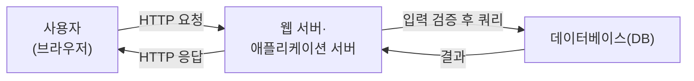
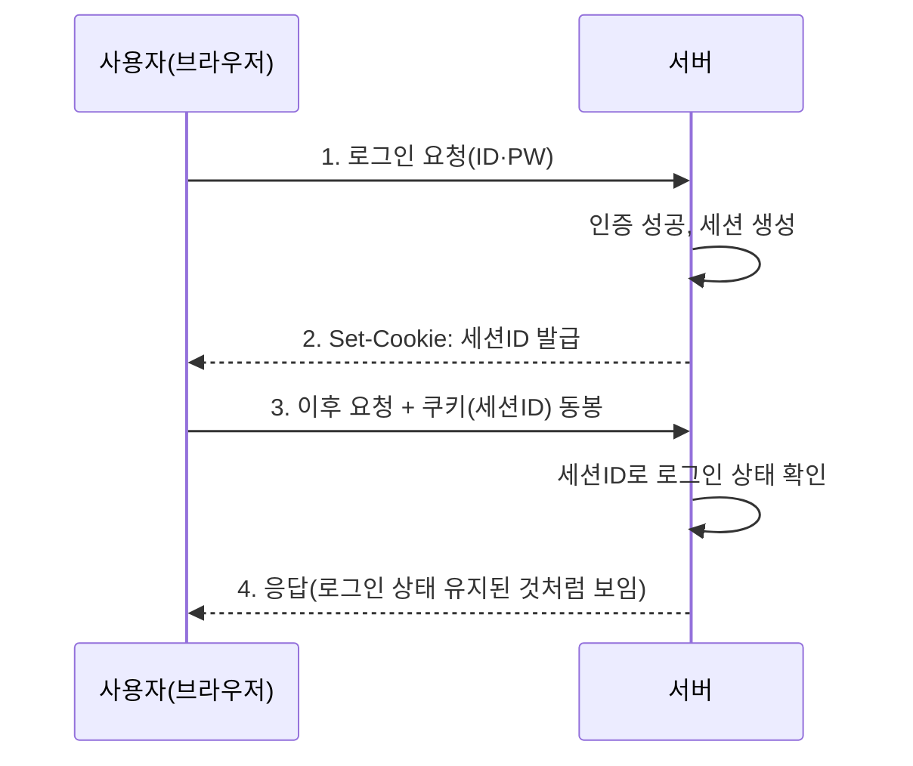

<Callout type="info">
  **이번 문서의 목표:** 이 파일을 다 읽으면 애플리케이션·웹·DB 세 계층이 각각 어디서 신뢰 경계를 두는지 설명하고, 쿠키·세션·DB 권한 구조를 근거로 왜 "입력을 믿지 않는 것"이 정보보호의 출발점인지 논리적으로 서술할 수 있다.
</Callout>

## 왜 이 편이 먼저 필요한가

02편에서 정보자산·위협·취약점·위험이라는 뼈대를 잡았고, 04편에서 계정·권한·파일 접근 방식이라는 운영체제(OS, Operating System) 관점의 사전지식을 정리했습니다. 이 편부터는 그 뼈대를 **애플리케이션이 사용자와 데이터베이스를 연결하는 실제 계층 구조**에 적용합니다.

시험 출제기준의 "시스템 및 애플리케이션 보안" 영역은 매년 상당한 비중을 차지하는데, 정작 응시자들이 자주 놓치는 지점은 개별 공격 기법(SQL 인젝션 문법 등)이 아니라 **왜 그 계층에 그런 구멍이 뚫리는가**라는 구조적 이해입니다. 10~12편에서 악성코드·취약점·DB 접근통제를 각각 깊게 다루기 전에, 이 편에서 애플리케이션·웹·DB가 서로 데이터를 주고받는 기본 구조와 그 경계마다 어떤 신뢰 가정이 깔려 있는지 먼저 정리합니다.

> **쉽게 말하면:** 이 편은 "공격이 시작되는 무대"를 설명합니다. 사용자의 입력이 애플리케이션을 거쳐 데이터베이스까지 도달하는 길을 한 번 그려 보면, 그 길의 각 구간마다 왜 검증이 필요한지가 저절로 보입니다.

## 1. 3계층 구조와 신뢰 경계

웹 기반 정보시스템은 보통 세 계층(3-tier)으로 나눕니다. **프레젠테이션 계층**(사용자 화면, 브라우저), **애플리케이션 계층**(비즈니스 로직을 처리하는 서버 프로그램), **데이터 계층**(데이터베이스, DB)입니다.



정보보호 관점에서 이 그림에서 가장 중요한 개념은 **신뢰 경계**(Trust Boundary)입니다. 신뢰 경계란 "이 선을 넘어오는 데이터는 검증되지 않았다고 가정해야 하는 지점"을 뜻합니다. 사용자가 입력한 값은 그것이 로그인 폼이든 URL 파라미터든, 애플리케이션 서버 입장에서는 **누가 무엇을 보냈는지 확신할 수 없는 값**입니다. 이 값을 그대로 믿고 데이터베이스 쿼리나 화면 출력에 사용하면 취약점이 발생합니다. 11편에서 다룰 SQL 인젝션·XSS(Cross-Site Scripting)는 모두 이 신뢰 경계에서 검증을 생략했을 때 생기는 문제입니다.

<Callout type="warning">
  **자주 틀리는 점:** "방화벽이 있으니 안전하다"는 착각입니다. 방화벽은 네트워크 계층(17편에서 다룸)에서 허용되지 않은 포트·IP의 접근을 막는 장치이지, 정상적으로 허용된 포트(예: 80, 443)를 통해 들어오는 **애플리케이션 계층의 악의적인 입력값**을 걸러내지 못합니다. 즉 네트워크 보안과 애플리케이션 보안은 서로 다른 계층의 문제이며, 하나가 다른 하나를 대체하지 않습니다.
</Callout>

## 2. 입력 검증의 원칙

**입력 검증**(Input Validation)은 애플리케이션이 외부에서 들어온 값을 사용하기 전에 그 값의 형식·길이·범위·문자 종류가 기대한 조건과 일치하는지 확인하는 절차입니다. 정보보호 시험에서 입력 검증을 다룰 때는 다음 세 가지 원칙을 구분해서 기억해야 합니다.

| 원칙 | 뜻 | 왜 중요한가 |
|------|-----|-------------|
| 화이트리스트(Whitelist) 방식 | 허용할 값의 패턴을 정의하고, 그 패턴에 맞는 값만 통과시킨다 | 예상하지 못한 새로운 공격 패턴도 "허용 목록에 없다"는 이유로 자동 차단된다 |
| 블랙리스트(Blacklist) 방식 | 금지할 문자·패턴을 정의하고, 그 패턴만 걸러낸다 | 공격자가 금지 목록에 없는 새로운 우회 표현을 찾아내면 뚫린다 |
| 서버 측 검증 우선 | 검증 로직은 반드시 서버(애플리케이션 서버)에서 최종 수행한다 | 클라이언트(브라우저) 측 검증은 개발자 도구로 우회할 수 있어 참고용일 뿐이다 |

<Callout type="warning">
  **자주 틀리는 점:** "자바스크립트(JavaScript)로 입력값 형식을 검사했으니 안전하다"는 설명은 옳지 않은 보기로 자주 나옵니다. 클라이언트 측 검증은 사용자 편의를 위한 것이지 보안 장치가 아닙니다. 공격자는 브라우저를 거치지 않고 곧바로 서버에 요청을 보낼 수 있으므로(예: 프록시 도구), **서버 측 검증이 없으면 클라이언트 측 검증은 없는 것과 같습니다.**
</Callout>

## 3. HTTP 요청·응답과 상태 비저장 문제

웹은 **HTTP**(HyperText Transfer Protocol, 하이퍼텍스트 전송 프로토콜) 위에서 동작합니다. HTTP는 설계상 **상태를 저장하지 않는**(Stateless) 프로토콜입니다. 즉 사용자가 로그인에 성공한 직후 다음 페이지를 요청해도, 서버 입장에서는 그 요청이 "방금 로그인한 그 사용자"의 요청인지 매번 새로 확인해야 합니다.



이 상태 비저장 문제를 해결하기 위한 장치가 **쿠키**(Cookie)와 **세션**(Session)입니다.

- **쿠키**: 서버가 브라우저에게 저장하라고 내려보내는 작은 데이터 조각입니다. 이후 같은 사이트에 요청을 보낼 때마다 브라우저가 자동으로 그 쿠키를 함께 실어 보냅니다.
- **세션**: 서버 쪽에 저장되는, 사용자별 로그인 상태·임시 데이터의 묶음입니다. 서버는 각 세션을 구분하기 위해 무작위로 생성한 **세션ID**(Session ID)를 발급하고, 이 세션ID 자체를 쿠키에 담아 브라우저에게 전달합니다.

즉 브라우저에는 세션 전체가 아니라 세션ID라는 "열쇠"만 쿠키로 저장되고, 실제 로그인 상태·개인정보 같은 값은 서버 안의 세션 저장소에 남습니다. 이 구조를 정확히 알아야 12편의 세션 관리, 14편의 인증 메커니즘을 이어서 이해할 수 있습니다.

<Callout type="warning">
  **자주 틀리는 점:** "쿠키에 로그인 정보(아이디·비밀번호)가 직접 저장된다"는 설명은 틀린 진술로 자주 출제됩니다. 쿠키에는 세션ID처럼 서버가 사용자를 구분하기 위한 식별값만 담기는 것이 안전한 설계이며, 민감한 값을 쿠키에 평문으로 담는 것 자체가 취약한 구현입니다. 세션ID가 공격자에게 탈취되면(예: 네트워크 도청, XSS로 쿠키 값 유출) 공격자는 로그인 절차 없이 그 세션ID로 사용자 행세를 할 수 있는데, 이를 **세션 하이재킹**(Session Hijacking)이라고 합니다.
</Callout>

## 4. 데이터베이스 계정·권한·역할의 기본 구조

애플리케이션 서버는 데이터베이스에 접속할 때 자신의 **DB 계정**(DB Account)을 사용합니다. 이때 정보보호 관점에서 핵심 원칙은 04편에서 다룬 **최소 권한 원칙**(Principle of Least Privilege)을 DB 계정에도 그대로 적용하는 것입니다.

| 개념 | 뜻 |
|------|-----|
| 계정(User/Account) | DB에 접속할 수 있는 인증 단위. 아이디·비밀번호로 식별된다 |
| 권한(Privilege) | 특정 객체(테이블·뷰 등)에 대해 할 수 있는 동작(SELECT·INSERT·UPDATE·DELETE 등)의 허가 |
| 역할(Role) | 여러 권한을 하나의 이름으로 묶어 놓은 묶음. 계정에 역할을 부여하면 그 안의 권한이 한 번에 적용된다 |

역할(Role)이 필요한 이유는 계정이 수백 개일 때 권한을 하나씩 부여·회수하는 관리 부담을 줄이기 위해서입니다. "영업팀 조회 역할"이라는 역할 하나를 만들어 필요한 SELECT 권한들을 미리 묶어 두면, 신규 입사자에게는 그 역할 하나만 부여하면 됩니다. 이 역할 기반 설계는 12편에서 다룰 **RBAC**(Role-Based Access Control, 역할 기반 접근통제) 모델의 실제 구현 형태이기도 합니다.

애플리케이션 서버가 DB에 접속할 때 흔히 저지르는 실수가 있습니다. **모든 기능을 처리할 수 있는 관리자급(DBA, Database Administrator) 계정 하나로 애플리케이션 전체를 운영**하는 것입니다. 이렇게 하면 SQL 인젝션 같은 취약점이 뚫렸을 때, 공격자가 그 애플리케이션 계정의 권한 전체(테이블 삭제, 다른 사용자 데이터 열람 등)를 그대로 넘겨받게 됩니다. 반대로 애플리케이션 기능별로 필요한 최소한의 권한만 가진 계정을 나누어 쓰면, 같은 취약점이 뚫려도 피해 범위가 그 계정의 권한만큼으로 제한됩니다.

<Callout type="warning">
  **자주 틀리는 점:** "애플리케이션 계정에 DBA 권한을 주면 관리가 편하니 좋은 설계"라는 보기는 틀린 진술입니다. 편의성과 보안성은 흔히 반비례 관계에 있으며, 시험은 이 지점을 "옳지 않은 것은?" 유형으로 자주 묻습니다.
</Callout>

## 5. SQL 기반 취약점의 위치 — 개관만

이 계층 구조에서 SQL 인젝션이 발생하는 지점을 짚어 두면 11편을 이해하기 쉬워집니다. 애플리케이션이 사용자 입력을 검증 없이 SQL 문자열에 그대로 이어붙여 데이터베이스에 전달하면, 사용자가 입력한 값이 데이터가 아니라 **SQL 명령어의 일부**로 해석될 수 있습니다.

```
정상 의도: SELECT * FROM users WHERE id = '입력값'
공격자 입력값: ' OR '1'='1
결과 쿼리: SELECT * FROM users WHERE id = '' OR '1'='1'
```

위 예시처럼 입력값 안에 SQL 구문 조각을 섞어 넣어 원래 쿼리의 의미를 바꾸는 것이 SQL 인젝션의 핵심 원리입니다. 이 취약점의 상세한 분류·방어 기법(Prepared Statement 등)은 11편에서 다룹니다. 이 편에서는 "왜 애플리케이션 계층의 입력 검증 실패가 곧 DB 계층의 문제로 이어지는가"라는 계층 간 연결 관계만 기억하면 됩니다.

## 핵심 정리

- 웹 기반 시스템은 프레젠테이션·애플리케이션·데이터 3계층으로 나뉘며, 각 계층 경계는 **신뢰 경계**로서 별도의 검증이 필요하다.
- 입력 검증은 **화이트리스트 방식**·**서버 측 검증**을 원칙으로 하며, 클라이언트 측 검증만으로는 보안이 성립하지 않는다.
- HTTP는 **상태 비저장** 프로토콜이므로 **쿠키**(브라우저 저장)와 **세션**(서버 저장)을 조합해 로그인 상태를 유지하며, 쿠키에는 세션ID 같은 식별값만 담아야 한다.
- DB 접근에도 **최소 권한 원칙**을 적용해 애플리케이션 계정을 기능별로 분리하고, **역할**(Role)로 권한 묶음을 관리한다.
- 입력 검증 실패는 애플리케이션 계층에서 끝나지 않고 SQL 인젝션 등 DB 계층 취약점으로 이어지므로, 두 계층은 하나의 방어선으로 함께 다뤄야 한다.

## 마무리 복습

<Quiz
  questionNumber={1}
  question="웹 애플리케이션의 신뢰 경계(Trust Boundary)에 대한 설명으로 옳은 것은?"
  options={['방화벽이 통과시킨 트래픽은 신뢰 경계를 넘지 않은 것으로 본다', '사용자 입력이 애플리케이션에 도달하는 지점은 검증되지 않은 데이터로 취급해야 하는 경계다', '신뢰 경계는 데이터베이스 내부에만 존재한다', '신뢰 경계를 설정하면 입력 검증 절차를 생략할 수 있다']}
  correctAnswer={2}
  explanation="신뢰 경계는 그 지점을 넘어오는 데이터를 검증되지 않은 것으로 간주해야 하는 지점을 뜻한다. 사용자 입력이 애플리케이션에 들어오는 지점이 대표적인 신뢰 경계이며, 이 경계에서 검증을 생략하면 SQL 인젝션·XSS 등의 취약점으로 이어진다."
  optionExplanations={['방화벽은 네트워크 계층에서 포트·IP를 걸러낼 뿐 애플리케이션 계층 입력값의 악성 여부는 판단하지 못한다', '정답 — 사용자 입력이 들어오는 지점은 검증 전까지 신뢰할 수 없는 데이터로 취급해야 한다', '신뢰 경계는 사용자-애플리케이션, 애플리케이션-DB 등 여러 지점에 존재한다', '신뢰 경계가 있다는 것은 그 지점에서 검증이 더 필요하다는 뜻이지 생략해도 된다는 뜻이 아니다']}
/>

<Quiz
  questionNumber={2}
  question="입력 검증 방식에 대한 설명으로 옳지 않은 것은?"
  options={['화이트리스트 방식은 허용할 패턴을 정의하고 그 외를 차단한다', '블랙리스트 방식은 금지 패턴 목록에 없는 새로운 공격 표현에 취약할 수 있다', '클라이언트 측(자바스크립트) 검증만으로도 서버 보안이 충분히 보장된다', '서버 측 검증은 클라이언트를 거치지 않는 직접 요청에도 적용되므로 최종 방어선이 된다']}
  correctAnswer={3}
  explanation="클라이언트 측 검증은 사용자 편의를 위한 것으로, 브라우저를 거치지 않고 서버에 직접 요청을 보내면 우회된다. 따라서 서버 측 검증이 반드시 병행되어야 하며, 클라이언트 측 검증만으로는 보안이 성립하지 않는다."
  optionExplanations={['화이트리스트 방식에 대한 옳은 설명이다', '블랙리스트 방식의 한계에 대한 옳은 설명이다', '정답 — 클라이언트 측 검증은 우회 가능하므로 그것만으로는 보안이 충분하지 않다', '서버 측 검증에 대한 옳은 설명이다']}
/>

<Quiz
  questionNumber={3}
  question="HTTP 프로토콜과 세션 관리에 대한 설명으로 옳은 것은?"
  options={['HTTP는 상태를 저장하는(Stateful) 프로토콜이라 별도의 세션 관리가 필요 없다', '쿠키에는 사용자의 아이디·비밀번호가 직접 저장되어야 로그인이 유지된다', 'HTTP는 상태를 저장하지 않으므로, 서버는 세션ID가 담긴 쿠키로 각 요청의 로그인 상태를 확인한다', '세션은 브라우저에만 저장되고 서버에는 아무 정보도 남지 않는다']}
  correctAnswer={3}
  explanation="HTTP는 상태 비저장(Stateless) 프로토콜이므로 서버는 요청마다 사용자를 구분할 수 없다. 이를 보완하기 위해 로그인 성공 시 서버가 세션(로그인 상태 등)을 자신의 저장소에 만들고, 그 세션을 가리키는 세션ID를 쿠키로 브라우저에 내려보내 이후 요청마다 함께 전송하게 한다."
  optionExplanations={['HTTP는 상태 비저장 프로토콜이며, 그 때문에 오히려 세션 관리가 필요하다', '아이디·비밀번호를 쿠키에 직접 저장하는 것은 안전하지 않은 설계다', '정답 — 세션ID를 담은 쿠키로 상태 비저장 문제를 보완하는 구조가 옳다', '세션의 실제 데이터(로그인 상태 등)는 서버 쪽 세션 저장소에 남는다']}
/>

<Quiz
  questionNumber={4}
  question="세션 하이재킹(Session Hijacking)에 대한 설명으로 가장 적절한 것은?"
  options={['서버의 데이터베이스 자체를 직접 파괴하는 공격이다', '공격자가 탈취한 세션ID를 이용해 로그인 절차 없이 다른 사용자로 행세하는 공격이다', '사용자가 비밀번호를 잊어버려 로그인에 실패하는 현상이다', '네트워크 대역폭을 고갈시켜 서비스를 마비시키는 공격이다']}
  correctAnswer={2}
  explanation="세션 하이재킹은 도청이나 XSS 등으로 유출된 세션ID를 공격자가 자신의 요청에 함께 실어 보냄으로써, 정상 로그인 절차 없이 피해자의 세션을 그대로 가로채 사용하는 공격이다."
  optionExplanations={['데이터베이스 파괴는 세션 하이재킹과 무관한 별도의 공격 유형이다', '정답 — 탈취한 세션ID로 로그인 절차 없이 사용자 행세를 하는 공격이다', '로그인 실패는 세션 하이재킹과 관련이 없는 별개의 상황이다', '대역폭 고갈은 서비스 거부(DoS) 공격에 해당하며 세션 하이재킹과는 다른 개념이다']}
/>

<Quiz
  questionNumber={5}
  question="데이터베이스 계정·권한 설계에 대한 설명으로 옳지 않은 것은?"
  options={['역할(Role)은 여러 권한을 묶어 계정에 한 번에 부여할 수 있게 한다', '애플리케이션 서버는 관리 편의를 위해 DBA 권한을 가진 단일 계정으로 운영하는 것이 안전한 설계다', '기능별로 계정을 분리하면 한 계정이 뚫려도 피해 범위가 제한된다', '최소 권한 원칙은 DB 계정 설계에도 동일하게 적용된다']}
  correctAnswer={2}
  explanation="애플리케이션 계정에 DBA 권한과 같은 과도한 권한을 부여하면, SQL 인젝션 등으로 계정이 탈취되었을 때 피해 범위가 전체 데이터베이스로 확대된다. 이는 최소 권한 원칙에 위배되는 취약한 설계다."
  optionExplanations={['역할에 대한 옳은 설명이다', '정답 — DBA 권한을 애플리케이션 계정에 그대로 부여하는 것은 최소 권한 원칙에 위배되는 취약한 설계다', '계정 분리에 대한 옳은 설명이다', '최소 권한 원칙에 대한 옳은 설명이다']}
/>

<Quiz
  questionNumber={6}
  question="SQL 인젝션의 기본 원리에 대한 설명으로 가장 적절한 것은?"
  options={['네트워크 케이블을 물리적으로 절단하는 공격이다', '사용자 입력값이 검증 없이 SQL 문자열에 이어붙여져 명령어의 일부로 해석되는 원리를 이용한다', 'DB 서버의 전원을 강제로 차단하는 공격이다', '방화벽 설정 파일을 직접 수정하는 공격이다']}
  correctAnswer={2}
  explanation="SQL 인젝션은 애플리케이션이 사용자 입력을 검증 없이 SQL 문자열에 그대로 결합할 때, 입력값에 섞인 SQL 구문 조각이 원래 쿼리의 의미를 바꾸는 방식으로 동작한다. 상세한 분류와 방어 기법은 11편에서 다룬다."
  optionExplanations={['물리적 케이블 절단은 SQL 인젝션과 무관한 물리 보안 영역의 문제다', '정답 — 입력값이 SQL 구문의 일부로 해석되도록 만드는 것이 SQL 인젝션의 핵심 원리다', '전원 차단은 가용성을 해치는 별도의 공격 형태로 SQL 인젝션과 무관하다', '방화벽 설정 파일 수정은 SQL 인젝션과 직접 관련이 없다']}
/>

## 참고 자료

- [OWASP - Top 10 웹 애플리케이션 보안 위험](https://owasp.org)
- [한국인터넷진흥원(KISA) - 웹 취약점 및 개인정보 DB 보호조치 가이드](https://kisa.or.kr)
