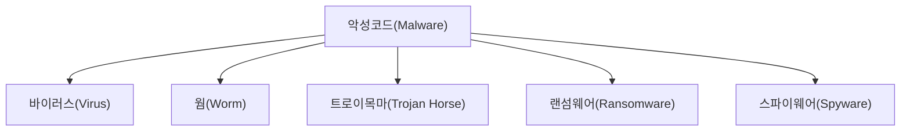

<Callout type="info">
  **이번 문서의 목표:** 이 파일을 다 읽으면 악성코드의 다섯 가지 주요 유형을 "전파 방식·자기복제 여부·숙주 필요 여부"라는 세 축으로 구분해 표에서 즉시 대조할 수 있고, "이 설명은 웜인가 바이러스인가"를 묻는 지문형 문제를 정확히 풀 수 있다.
</Callout>

## 왜 분류 기준부터 잡아야 하는가

악성코드(Malware, Malicious Software의 줄임말) 관련 문제는 독학사 정보보호 시험에서 "다음 설명에 해당하는 악성코드는?"이라는 지문형으로 자주 나옵니다. 이 유형은 용어의 정의를 단순 암기해서는 풀리지 않습니다. 설명 지문이 "스스로 복제해 퍼진다"는 특징만 언급하면 바이러스와 웜이 동시에 후보로 떠오르고, "실행 파일에 위장해 있다"는 특징만 언급하면 트로이목마와 일부 바이러스가 겹쳐 보이기 때문입니다.

이 혼동을 없애는 방법은 유형을 낱개로 외우지 않고, **처음부터 하나의 비교표 안에서** 각 유형이 세 가지 축(전파 방식, 자기복제 여부, 숙주 필요 여부)에서 어떤 값을 가지는지 대조하는 것입니다. 이 편은 그 표를 만드는 것이 목표입니다.

> **쉽게 말하면:** 악성코드 유형을 외울 때는 이름과 정의를 따로따로 외우지 말고, "이게 스스로 복제되나?", "숙주(정상 프로그램)가 있어야 하나?", "어떻게 퍼지나?" 세 가지 질문에 대한 답을 표로 채운다고 생각하면 헷갈리지 않습니다.

## 1. 악성코드란 무엇인가

**악성코드**(Malware)는 사용자나 시스템 소유자의 동의 없이 정보시스템에 설치되어, 정보의 기밀성·무결성·가용성(02편에서 다룬 CIA 삼요소)을 침해하는 모든 소프트웨어를 통칭하는 용어입니다. 바이러스·웜·트로이목마·랜섬웨어·스파이웨어는 모두 악성코드라는 큰 범주 아래의 **하위 분류**이며, 이 분류들은 서로 배타적이지 않습니다. 예를 들어 어떤 악성코드는 트로이목마로 위장해 침투한 뒤, 내부에서는 랜섬웨어처럼 동작할 수도 있습니다.

## 2. 분류 축 세 가지 — 전파 방식·자기복제·숙주 필요 여부

본격적인 비교표에 앞서 세 축의 정의를 먼저 명확히 합니다.

| 축 | 뜻 |
|-----|-----|
| 자기복제(Self-Replication) 여부 | 사람의 개입 없이 스스로를 복제해 개수를 늘릴 수 있는가 |
| 숙주(Host) 필요 여부 | 다른 정상 프로그램·파일에 자신을 붙여야만 실행될 수 있는가, 아니면 독립적으로 실행되는 단독 프로그램인가 |
| 전파 방식(Propagation) | 감염된 대상에서 다른 대상으로 퍼져 나가는 구체적인 경로(사용자 실행, 네트워크 자동 확산, 위장 실행 등) |

> **비유:** 숙주가 필요하다는 것은 기생충이 반드시 몸속에 들어가 있어야 하는 것과 비슷하고, 숙주 없이 독립적으로 실행된다는 것은 스스로 걸어 다니는 로봇과 비슷합니다. 자기복제는 그 기생충(또는 로봇)이 스스로 자기 자신을 복사해 개수를 늘리는지 여부입니다.

## 3. 다섯 가지 주요 유형 비교

| 유형 | 자기복제 | 숙주 필요 | 전파 방식 | 핵심 목적·특징 |
|------|-----------|-----------|-----------|------------------|
| 바이러스(Virus) | 함 | 필요함(정상 파일에 기생) | 감염된 파일을 사용자가 **직접 실행**해야 다음 대상으로 확산 | 정상 프로그램·문서에 자신을 삽입해 실행 시 함께 동작 |
| 웜(Worm) | 함 | 필요 없음(독립 실행형) | 네트워크 취약점을 이용해 **사용자 개입 없이 스스로** 다른 시스템으로 이동 | 네트워크 대역폭 고갈, 빠른 대량 확산이 특징 |
| 트로이목마(Trojan Horse) | 안 함 | 필요 없음(독립 실행형이나 정상 프로그램으로 위장) | 사용자가 **정상 프로그램으로 착각해 자발적으로 설치·실행** | 스스로 퍼지지 않고, 백도어·정보 유출 등 은밀한 기능을 내장 |
| 랜섬웨어(Ransomware) | 유형에 따라 다름(웜형은 자기복제, 대부분은 안 함) | 유형에 따라 다름 | 이메일 첨부·취약점 악용·트로이목마 결합 등 | 파일을 암호화해 인질로 잡고 금전(Ransom, 몸값)을 요구 |
| 스파이웨어(Spyware) | 안 함 | 필요 없음(독립 실행형이나 은밀히 설치됨) | 무료 소프트웨어에 끼워 배포, 사용자 동의를 위장한 설치 | 사용자 몰래 키 입력·화면·개인정보를 수집해 외부로 전송 |

<Callout type="warning">
  **자주 틀리는 점:** "바이러스와 웜은 둘 다 자기복제를 한다"는 공통점 때문에 둘을 같은 것으로 착각하기 쉽습니다. 시험에서 이 둘을 가르는 결정적 기준은 **숙주 필요 여부와 사용자 개입 여부**입니다. 바이러스는 반드시 정상 파일(숙주)에 붙어 있어야 하고, 그 숙주 파일을 **사용자가 실행**해야 다음 감염이 일어납니다. 반면 웜은 숙주 없이 그 자체로 독립 실행되며, 네트워크를 통해 **사용자 개입 없이** 스스로 확산합니다. "감염을 퍼뜨리는 데 사용자의 실행 행위가 필요한가"라는 질문 하나로 구분하면 헷갈리지 않습니다.
</Callout>

<Callout type="warning">
  **자주 틀리는 점:** "트로이목마는 스스로 복제해서 퍼진다"는 설명은 틀린 진술입니다. 트로이목마의 핵심 특징은 **자기복제를 하지 않는다**는 점이며, 대신 정상 프로그램(게임, 유틸리티 등)으로 위장해 사용자가 자발적으로 설치하게 만듭니다. 그리스 신화의 트로이 목마가 스스로 성벽을 넘은 것이 아니라 성 안 사람들이 직접 끌고 들어간 것과 같은 원리입니다.
</Callout>

## 4. 랜섬웨어를 별도로 다루는 이유 — 목적 중심 분류

바이러스·웜·트로이목마가 **전파 방식**을 기준으로 나뉜 분류라면, 랜섬웨어는 **공격 목적**을 기준으로 나뉜 분류입니다. 그래서 랜섬웨어는 트로이목마처럼 위장해 설치될 수도 있고, 웜처럼 네트워크 취약점을 통해 자기복제하며 퍼질 수도 있습니다(예: 2017년 워너크라이(WannaCry)는 웜형 확산 방식을 사용한 랜섬웨어였습니다).

랜섬웨어의 핵심 동작은 감염된 시스템의 파일을 공개키 암호(06편에서 다룬 개념) 등으로 암호화해 사용자가 접근할 수 없게 만든 뒤, 복호화키를 대가로 금전을 요구하는 것입니다. 정보보호 3요소 중 **가용성**(Availability, 정당한 사용자가 필요할 때 정보에 접근할 수 있는 성질)을 정면으로 침해하는 공격입니다.

<Callout type="warning">
  **자주 틀리는 점:** "랜섬웨어는 자기복제를 하지 않는 것이 정의상 특징이다"라고 단정하는 것은 옳지 않습니다. 랜섬웨어는 전파 방식이 아니라 목적(금전 갈취)으로 정의되는 범주이므로, 자기복제 여부는 구체적인 변종에 따라 다릅니다. "랜섬웨어=목적 기준 분류", "바이러스·웜=전파 방식 기준 분류"라는 분류 기준 자체의 차이를 기억해야 합니다.
</Callout>

## 5. 은폐 기법 개관

악성코드는 탐지를 피하기 위해 다양한 은폐(Concealment) 기법을 사용합니다. 시험에서는 다음 용어의 정의를 구분하는 문제가 나옵니다.

| 용어 | 뜻 |
|------|-----|
| 루트킷(Rootkit) | 시스템 관리자 권한(Root)을 탈취한 뒤 자신의 존재 자체를 운영체제 수준에서 숨기는 도구·기법 |
| 폴리모픽(Polymorphic, 다형성) | 실행될 때마다 코드의 형태(패턴)를 스스로 바꿔 백신의 패턴 기반 탐지를 회피 |
| 백도어(Backdoor) | 정상 인증 절차를 우회해 시스템에 재진입할 수 있도록 몰래 만들어 둔 통로 |

<Callout type="warning">
  **자주 틀리는 점:** 루트킷은 그 자체가 하나의 독립된 악성코드 유형(바이러스·웜과 나란한 분류)이 아니라, **은폐를 위한 기법·도구**라는 점을 구분해야 합니다. 트로이목마나 웜이 침투에 성공한 뒤 루트킷을 함께 설치해 자신의 흔적을 숨기는 방식으로 결합해서 쓰이는 경우가 많습니다.
</Callout>

## 6. 기본 대응 원칙

악성코드 대응은 감염 이전(예방)과 감염 이후(대응)로 나눠 정리합니다.

| 단계 | 원칙 |
|------|------|
| 예방 | 백신·안티멀웨어 최신 패턴 유지, 운영체제·소프트웨어 정기 패치, 최소 권한 원칙(04편) 적용, 출처 불명 첨부파일·실행파일 실행 금지 |
| 탐지 | 파일 무결성 점검(해시 비교, 07편 연계), 비정상 네트워크 트래픽·프로세스 모니터링(18편의 보안관제와 연계) |
| 대응·복구 | 감염 시스템 네트워크 격리, 원인 분석 후 재설치 또는 정상 백업본 복원, 사고 보고 절차(18편) 준수 |

<Callout type="warning">
  **자주 틀리는 점:** "랜섬웨어에 감염되면 몸값을 지불하고 복호화키를 받는 것이 공식적으로 권장되는 대응"이라는 설명은 틀린 보기입니다. 정보보호 관련 공신력 있는 기관(KISA 등)은 몸값 지불이 복구를 보장하지 않고 추가 범죄를 조장한다는 이유로 **지불을 권장하지 않으며**, 대신 평소의 정기 백업과 감염 후 격리·복원 절차를 권장 대응으로 제시합니다.
</Callout>

## 핵심 정리

- 악성코드는 자기복제 여부·숙주 필요 여부·전파 방식이라는 세 축으로 유형을 비교하면 혼동 없이 구분할 수 있다.
- **바이러스**는 숙주(정상 파일)에 기생하며 사용자 실행이 있어야 확산되고, **웜**은 숙주 없이 독립 실행되며 네트워크를 통해 사용자 개입 없이 스스로 확산된다.
- **트로이목마**는 자기복제를 하지 않으며 정상 프로그램으로 위장해 사용자가 자발적으로 설치하게 만든다.
- **랜섬웨어**는 전파 방식이 아니라 목적(파일 암호화 후 금전 요구)으로 정의되는 범주로, 자기복제 여부는 변종마다 다르다.
- **스파이웨어**는 사용자 몰래 정보를 수집·유출하는 데 목적이 있으며 자기복제를 하지 않는다.
- 루트킷·폴리모픽·백도어는 악성코드의 하위 유형이 아니라 은폐·침투를 돕는 **기법**이다.

## 마무리 복습

<Quiz
  questionNumber={1}
  question="다음 중 바이러스(Virus)와 웜(Worm)을 구분하는 가장 결정적인 기준은?"
  options={['금전 갈취 목적 여부', '숙주(정상 파일) 필요 여부와 확산에 사용자 개입이 필요한지 여부', '악성코드 파일의 용량', '백신 프로그램의 탐지 가능 여부']}
  correctAnswer={2}
  explanation="바이러스는 정상 파일(숙주)에 기생하며 그 숙주를 사용자가 실행해야 다음 감염이 일어난다. 웜은 숙주 없이 독립적으로 실행되며 네트워크를 통해 사용자 개입 없이 스스로 확산한다. 이 숙주 필요 여부와 사용자 개입 여부가 둘을 가르는 핵심 기준이다."
  optionExplanations={['금전 갈취 목적은 랜섬웨어를 정의하는 기준이지 바이러스·웜을 구분하는 기준이 아니다', '정답 — 숙주 필요 여부와 사용자 개입 여부가 바이러스와 웜을 가르는 결정적 기준이다', '파일 용량은 악성코드 분류 기준으로 사용되지 않는다', '탐지 가능 여부는 백신 성능의 문제이지 악성코드 유형 자체의 정의 기준이 아니다']}
/>

<Quiz
  questionNumber={2}
  question="트로이목마(Trojan Horse)에 대한 설명으로 옳은 것은?"
  options={['네트워크 취약점을 이용해 스스로 자기복제하며 확산된다', '정상 프로그램으로 위장해 사용자가 자발적으로 설치하게 만들며, 자기복제를 하지 않는다', '반드시 다른 정상 파일에 기생해야만 실행될 수 있다', '감염된 파일을 암호화해 금전을 요구하는 것이 정의상 특징이다']}
  correctAnswer={2}
  explanation="트로이목마는 스스로 복제하지 않고, 정상 프로그램으로 위장해 사용자가 자발적으로 설치·실행하도록 유도하는 것이 핵심 특징이다."
  optionExplanations={['자기복제하며 네트워크로 스스로 확산하는 것은 웜의 특징이다', '정답 — 트로이목마는 자기복제를 하지 않으며 위장을 통해 사용자가 직접 설치하게 만든다', '정상 파일에 기생해야 하는 것은 바이러스의 특징으로 트로이목마와는 다르다', '파일 암호화 후 금전을 요구하는 것은 랜섬웨어의 정의상 특징이다']}
/>

<Quiz
  questionNumber={3}
  question="랜섬웨어(Ransomware)에 대한 설명으로 옳지 않은 것은?"
  options={['파일을 암호화해 사용자의 접근을 막고 금전을 요구한다', '정보보호 3요소 중 주로 가용성을 침해하는 공격이다', '전파 방식이 아니라 공격 목적을 기준으로 정의되는 분류이므로 변종마다 자기복제 여부가 다를 수 있다', '감염 시 몸값을 지불하는 것이 공신력 있는 기관이 권장하는 표준 대응 방법이다']}
  correctAnswer={4}
  explanation="KISA 등 공신력 있는 기관은 몸값 지불이 복구를 보장하지 않고 범죄를 조장할 수 있다는 이유로 지불을 권장하지 않는다. 권장되는 대응은 평소의 정기 백업과 감염 후 네트워크 격리·정상 백업본 복원이다."
  optionExplanations={['랜섬웨어의 정의에 해당하는 옳은 설명이다', '파일 접근을 막는 것은 가용성 침해에 해당하므로 옳은 설명이다', '랜섬웨어는 목적 기준 분류이므로 옳은 설명이다', '정답 — 몸값 지불은 권장되는 대응이 아니며, 오히려 지불하지 않을 것을 권장한다']}
/>

<Quiz
  questionNumber={4}
  question="스파이웨어(Spyware)의 특징으로 가장 적절한 것은?"
  options={['시스템 파일을 암호화해 복구를 막는다', '네트워크 취약점을 이용해 자기복제하며 대량으로 확산된다', '사용자 몰래 키 입력이나 개인정보를 수집해 외부로 전송하는 데 목적이 있다', '정상 인증 절차를 우회할 수 있는 통로를 시스템에 몰래 만들어 둔다']}
  correctAnswer={3}
  explanation="스파이웨어는 사용자 동의 없이 사용자의 행동(키 입력, 방문 기록 등)이나 개인정보를 몰래 수집해 외부로 전송하는 것이 핵심 목적이며, 스스로 복제하지 않는다."
  optionExplanations={['파일 암호화는 랜섬웨어의 특징이다', '자기복제하며 대량 확산되는 것은 웜의 특징이다', '정답 — 정보를 몰래 수집해 유출하는 것이 스파이웨어의 핵심 목적이다', '인증 우회 통로를 만드는 것은 백도어에 대한 설명이다']}
/>

<Quiz
  questionNumber={5}
  question="루트킷(Rootkit)에 대한 설명으로 옳은 것은?"
  options={['바이러스·웜과 나란한 독립적인 악성코드 분류 중 하나다', '관리자 권한을 탈취한 뒤 자신의 존재를 운영체제 수준에서 숨기는 기법·도구다', '파일을 암호화해 금전을 요구하는 공격 방식이다', '스스로 복제하며 네트워크를 통해 확산되는 것이 정의상 특징이다']}
  correctAnswer={2}
  explanation="루트킷은 그 자체로 바이러스·웜과 같은 전파 방식 기준 분류가 아니라, 관리자 권한(Root)을 탈취한 뒤 자신의 존재를 숨기는 은폐 기법·도구를 가리킨다. 트로이목마나 웜이 침투 후 함께 설치하는 경우가 많다."
  optionExplanations={['루트킷은 전파 방식 기준의 독립 분류가 아니라 은폐를 위한 기법·도구다', '정답 — 관리자 권한 탈취 후 존재를 숨기는 기법·도구가 루트킷의 정의다', '파일 암호화 후 금전 요구는 랜섬웨어의 특징이다', '자기복제하며 확산되는 것은 웜의 특징으로 루트킷의 정의와 다르다']}
/>

<Quiz
  questionNumber={6}
  question="다음 설명에 해당하는 악성코드 유형은? '이 악성코드는 별도의 숙주 파일 없이 독립적으로 실행되며, 네트워크 취약점을 통해 사용자의 개입 없이 스스로 다른 시스템으로 이동해 확산되어 짧은 시간에 네트워크 대역폭을 고갈시켰다.'"
  options={['바이러스', '웜', '트로이목마', '스파이웨어']}
  correctAnswer={2}
  explanation="숙주 없이 독립 실행되고, 네트워크를 통해 사용자 개입 없이 스스로 확산하며, 대역폭 고갈을 일으키는 것은 웜의 전형적인 특징이다."
  optionExplanations={['바이러스는 숙주가 필요하고 사용자 실행이 있어야 확산되므로 지문과 맞지 않는다', '정답 — 숙주 없는 독립 실행과 자동 확산, 대역폭 고갈은 웜의 전형적인 특징이다', '트로이목마는 자기복제를 하지 않으므로 스스로 확산된다는 지문과 맞지 않는다', '스파이웨어는 정보 수집이 목적이며 자기복제로 확산되는 것이 핵심 특징이 아니다']}
/>

<Quiz
  questionNumber={7}
  question="악성코드 예방·대응 원칙에 대한 설명으로 옳지 않은 것은?"
  options={['정기적인 소프트웨어 패치와 백신 패턴 최신화는 예방 단계에 해당한다', '파일 무결성 점검을 위한 해시 비교는 탐지 단계에서 활용될 수 있다', '감염이 확인된 시스템은 즉시 네트워크에서 격리한 뒤 원인 분석을 진행하는 것이 바람직하다', '최소 권한 원칙은 악성코드 대응과 무관하므로 적용할 필요가 없다']}
  correctAnswer={4}
  explanation="최소 권한 원칙은 악성코드가 침투했을 때 피해 범위를 제한하는 예방적 조치로서, 04편·09편에서 다룬 것처럼 계정·프로세스 권한을 필요한 만큼만 부여하는 것이 악성코드 대응에도 그대로 적용된다."
  optionExplanations={['패치·패턴 최신화는 예방 단계의 대표적인 원칙이다', '해시 비교를 통한 무결성 점검은 탐지 단계의 유효한 방법이다', '네트워크 격리 후 원인 분석은 표준적인 대응 절차다', '정답 — 최소 권한 원칙은 악성코드의 피해 확산을 막는 데 유효하게 적용되는 예방 원칙이다']}
/>

## 참고 자료

- [한국인터넷진흥원(KISA) - 악성코드·보안위협 개요 자료](https://kisa.or.kr)
- [국가평생교육진흥원 - 독학학위제 출제기준 안내](https://bdes.nile.or.kr)
