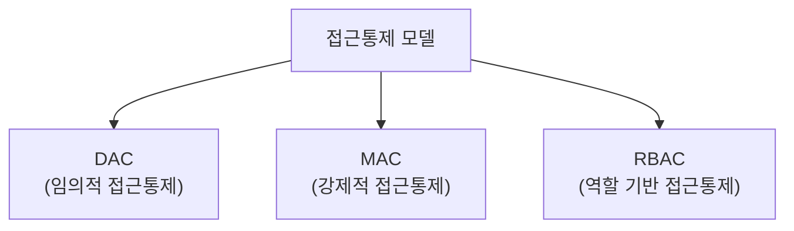

<Callout type="info">
  **이번 문서의 목표:** 이 파일을 다 읽으면 DAC·MAC·RBAC 세 접근통제 모델을 판단 기준(누가 권한을 정하는가)으로 구분할 수 있고, Oracle SQL로 계정 생성부터 권한 부여, 역할·뷰 활용, 감사 로그 설정까지 직접 서술할 수 있다.
</Callout>

## 왜 DB 접근통제를 별도로 다루는가

09편에서 애플리케이션 계정에도 최소 권한 원칙을 적용해야 한다고 정리했습니다. 이 편은 그 원칙을 실제로 **어떤 모델로, 어떤 SQL 문법으로 구현하는가**까지 파고듭니다. 정보보호 시험에서 접근통제 모델(DAC·MAC·RBAC)은 14편(시스템 전반의 인증·접근통제)에서도 다루지만, 이 편에서는 그 모델들을 **데이터베이스라는 구체적인 대상**에 적용했을 때의 SQL 구현과 함께 봅니다. 개인정보가 저장된 테이블일수록 "누가, 어떤 조건으로, 무엇을 볼 수 있는가"를 정밀하게 통제해야 하기 때문에, DB 접근통제는 개인정보보호법(15편)과도 직결되는 실무·시험 양쪽의 핵심 주제입니다.

> **쉽게 말하면:** 접근통제 모델은 "누가 문의 열쇠를 나눠줄 권한을 갖는가"에 대한 규칙이고, 이 편에서 다루는 SQL 문법은 그 규칙을 데이터베이스 안에서 실제로 켜고 끄는 손잡이입니다.

## 1. 접근통제 모델 세 가지 비교 — DAC·MAC·RBAC

**접근통제**(Access Control)는 주체(사용자·프로세스)가 객체(파일·테이블 등)에 접근할 수 있는지를 결정하는 메커니즘입니다. 이 메커니즘을 누가, 어떤 기준으로 설계하느냐에 따라 세 가지 모델로 나뉩니다.



| 모델 | 정식 명칭 | 권한을 정하는 주체 | 핵심 특징 |
|------|-----------|----------------------|-----------|
| DAC | Discretionary Access Control, 임의적 접근통제 | 객체의 **소유자**(데이터를 만든 사용자) | 소유자가 자신의 재량으로 다른 사용자에게 권한을 부여·회수할 수 있다. 유연하지만 소유자의 실수로 권한이 과도하게 퍼질 위험이 있다 |
| MAC | Mandatory Access Control, 강제적 접근통제 | **시스템(중앙 관리자·정책)** | 사용자 개인이 권한을 임의로 바꿀 수 없고, 객체마다 매겨진 보안 등급(예: 기밀·비밀)과 주체의 인가 등급을 비교해 시스템이 강제로 접근을 허용·차단한다. 군사·정부기관처럼 보안 등급이 엄격한 환경에서 쓰인다 |
| RBAC | Role-Based Access Control, 역할 기반 접근통제 | **역할(Role)을 설계하는 관리자** | 사용자에게 직접 권한을 주지 않고, "이 역할에는 이런 권한들이 있다"고 미리 정의한 역할을 사용자에게 부여한다. 09편에서 다룬 DB Role 개념이 바로 이 모델의 구현 형태다 |

<Callout type="warning">
  **자주 틀리는 점:** 세 모델을 구분하는 가장 확실한 질문은 **"누가 권한을 결정하는가"** 입니다. DAC는 "데이터를 만든 사람(소유자) 개인"이 결정하고, MAC는 "소유자도 바꿀 수 없는 시스템·정책"이 결정하며, RBAC는 "역할이라는 중간 단위를 통해" 결정합니다. "MAC는 소유자가 권한을 자유롭게 조정할 수 있는 모델이다"라는 보기는 DAC와 MAC를 뒤바꾼 틀린 설명입니다.
</Callout>

<Callout type="warning">
  **자주 틀리는 점:** RBAC는 DAC·MAC와 완전히 분리된 대안이 아니라, **권한을 부여하는 단위를 사용자 개인에서 역할로 바꾼 것**입니다. 즉 RBAC 안에서도 그 역할을 누가 만들고 배정할 권한을 갖는지에 따라 DAC적 성격(관리자 재량)이나 MAC적 성격(정책 강제)을 함께 가질 수 있습니다. 세 모델을 서로 완전히 배타적인 것으로 암기하면 응용 문제에서 틀리기 쉽습니다.
</Callout>

## 2. Oracle SQL로 보는 계정·권한 관리

이제 위 모델, 특히 실무 DB에서 가장 널리 쓰이는 RBAC를 Oracle SQL 문법으로 직접 구현해 봅니다.

### 계정 생성과 기본 권한 부여

```sql
-- 1. 계정 생성
CREATE USER app_user IDENTIFIED BY "안전한비밀번호123!";

-- 2. 접속 권한 부여 (Oracle은 접속조차도 별도 권한이 필요하다)
GRANT CREATE SESSION TO app_user;

-- 3. 특정 테이블에 대한 최소한의 권한만 부여 (최소 권한 원칙)
GRANT SELECT, INSERT ON orders TO app_user;
```

`GRANT` 문은 특정 계정(또는 역할)에게 특정 객체에 대한 특정 동작 권한을 부여하는 명령어입니다. 이 예시에서 `app_user` 계정은 `orders` 테이블에 대해 조회(SELECT)와 삽입(INSERT)만 할 수 있고, 삭제(DELETE)나 구조 변경(ALTER)은 할 수 없습니다. 이것이 09편에서 다룬 최소 권한 원칙의 실제 SQL 구현입니다.

### 역할(Role) 생성과 부여 — RBAC의 실제 구현

```sql
-- 1. 역할 생성
CREATE ROLE sales_viewer;

-- 2. 역할에 권한 묶어서 부여
GRANT SELECT ON customers TO sales_viewer;
GRANT SELECT ON orders TO sales_viewer;

-- 3. 사용자에게 역할 부여 (권한 하나하나가 아니라 역할 하나로 한 번에)
GRANT sales_viewer TO app_user;
```

신규 계정이 100개 생겨도 `GRANT sales_viewer TO 신규계정;` 한 줄이면 그 계정은 고객·주문 테이블을 조회할 수 있는 권한을 즉시 갖게 됩니다. 권한이 바뀌어야 할 때도 역할 하나만 수정하면 그 역할을 가진 모든 계정에 자동 반영되므로, 계정별로 권한을 일일이 수정하는 DAC적 관리 방식보다 관리 부담이 크게 줄어듭니다.

### 권한 회수

```sql
-- 특정 권한만 회수
REVOKE INSERT ON orders FROM app_user;

-- 역할 자체를 회수
REVOKE sales_viewer FROM app_user;
```

`REVOKE`는 `GRANT`의 반대 동작으로, 이미 부여한 권한이나 역할을 거둬들입니다. 계정의 직무가 바뀌거나 퇴사할 경우 04편에서 다룬 계정 라이프사이클 관리의 일환으로 즉시 실행되어야 하는 명령입니다.

<Callout type="warning">
  **자주 틀리는 점:** Oracle에서는 계정을 생성(`CREATE USER`)했다고 해서 곧바로 DB에 접속할 수 있는 것이 아닙니다. `CREATE SESSION` 권한을 별도로 부여해야만 로그인이 가능합니다. "계정만 만들면 자동으로 로그인 권한도 함께 생긴다"는 설명은 틀린 진술입니다.
</Callout>

## 3. 뷰(View)를 이용한 개인정보 보호

**뷰**(View)는 하나 이상의 테이블에서 특정 컬럼·행만 뽑아 마치 하나의 가상 테이블처럼 보여주는 객체입니다. 뷰는 접근통제의 관점에서 매우 중요한 도구인데, 사용자에게 원본 테이블 전체가 아니라 **뷰를 통해 제한된 컬럼·행만** 노출시킬 수 있기 때문입니다.

```sql
-- 원본 테이블: members (id, name, ssn, phone, address, email)
-- 콜센터 상담원에게는 주민등록번호(ssn)를 제외하고 노출
CREATE VIEW members_for_agent AS
SELECT id, name, phone, email
FROM members;

-- 콜센터 상담원 계정에는 원본 테이블이 아니라 뷰에 대한 권한만 부여
GRANT SELECT ON members_for_agent TO call_center_agent;
```

이렇게 하면 콜센터 상담원 계정은 `members` 원본 테이블에 대한 권한이 아예 없으므로, `SELECT * FROM members`를 직접 시도해도 권한 오류가 발생합니다. 오직 `members_for_agent` 뷰를 통해서만 조회할 수 있고, 그 뷰에는 애초에 민감정보인 주민등록번호(ssn) 컬럼이 존재하지 않습니다.

<Callout type="warning">
  **자주 틀리는 점:** "뷰는 원본 테이블의 데이터를 복사해서 별도로 저장하는 객체다"라는 설명은 틀린 진술입니다(단, 자재화된 뷰인 구체화 뷰(Materialized View)는 예외적으로 결과를 실제 저장합니다). 일반적인 뷰는 데이터를 저장하지 않고, 조회할 때마다 정의된 SQL문(위 예시의 `SELECT` 문)을 실행해 원본 테이블에서 즉시 결과를 가져오는 **가상 테이블**입니다. 원본 데이터가 바뀌면 뷰를 통해 보이는 결과도 즉시 함께 바뀝니다.
</Callout>

### 마스킹과 암호화의 보완 관계

뷰가 "컬럼 자체를 아예 안 보여주는" 방식이라면, **데이터 마스킹**(Data Masking)은 컬럼은 보여주되 값의 일부를 가리는 방식입니다.

```sql
-- 전화번호 뒷자리를 마스킹해서 보여주는 뷰
CREATE VIEW members_masked AS
SELECT id,
       name,
       SUBSTR(phone, 1, 7) || '****' AS phone_masked
FROM members;
```

위 예시는 Oracle의 문자열 함수 `SUBSTR`(문자열 자르기)과 문자열 연결 연산자 `||`를 이용해, 전화번호의 앞 7자리만 보여주고 나머지는 `****`로 가린 결과를 뷰로 제공합니다. 원본 테이블에는 전화번호 전체가 그대로 저장되어 있지만, 이 뷰를 조회하는 사용자에게는 마스킹된 값만 노출됩니다.

민감정보 보호의 마지막 층은 **암호화**(Encryption, 06~07편에서 다룬 암호 기술)로, 저장 자체를 암호화된 형태(예: 컬럼 암호화)로 해 두어 DB 파일에 직접 접근하는 공격(예: 백업 파일 탈취)에도 대비하는 방식입니다. 뷰·마스킹이 "권한 없는 사용자의 조회 화면"을 통제하는 층이라면, 암호화는 "저장 매체 자체가 탈취되었을 때"를 대비하는 마지막 층으로 서로 보완 관계에 있습니다.

| 보호 기법 | 통제 지점 | 막는 위협 |
|-----------|-----------|-----------|
| 뷰(컬럼·행 제한) | 애플리케이션 계정의 조회 권한 | 권한 없는 사용자가 애초에 민감 컬럼에 접근하는 것 |
| 마스킹 | 조회 결과 화면 | 정당한 접근이지만 화면·로그에 값 전체가 그대로 노출되는 것 |
| 암호화 | 저장 매체(디스크·백업) | DB 파일·백업이 통째로 탈취되었을 때 값이 평문으로 읽히는 것 |

## 4. 로깅·감사를 통한 추적성 확보

접근통제가 "누가 접근할 수 있는가"를 사전에 결정하는 일이라면, **감사**(Audit)는 "실제로 누가 언제 무엇을 했는가"를 사후에 확인할 수 있게 기록하는 일입니다. 이 기록이 있어야만 사고 발생 시 원인을 추적(Traceability, 추적성)할 수 있습니다.

```sql
-- 특정 테이블에 대한 SELECT 작업을 감사 로그로 남기도록 설정
AUDIT SELECT ON members BY ACCESS;

-- 감사 로그 조회 (Oracle 표준 감사 뷰)
SELECT username, obj_name, action_name, timestamp
FROM dba_audit_trail
WHERE obj_name = 'MEMBERS';
```

`AUDIT` 문은 지정한 테이블에 대한 특정 동작(위 예시는 SELECT)이 발생할 때마다 그 사실을 감사 로그에 남기도록 설정합니다. 이렇게 쌓인 로그는 `dba_audit_trail` 같은 감사용 뷰를 통해 "누가(username), 어떤 객체에(obj_name), 어떤 동작을(action_name), 언제(timestamp)" 수행했는지 조회할 수 있게 해 줍니다.

<Callout type="warning">
  **자주 틀리는 점:** "접근통제만 철저히 하면 감사(로깅)는 생략해도 된다"는 설명은 틀린 진술입니다. 접근통제는 **사전 예방**, 감사는 **사후 탐지·추적**이라는 서로 다른 역할을 하는 통제이며, 개인정보 보호법·ISMS-P 인증기준(15편에서 다룸)에서도 접근 기록의 보관·점검을 별도의 필수 요구사항으로 명시합니다. 아무리 권한을 촘촘히 설계해도, 내부자가 권한 범위 안에서 오남용하는 경우는 감사 로그 없이는 발견할 수 없습니다.
</Callout>

## 핵심 정리

- **DAC**는 객체 소유자가, **MAC**는 시스템(정책)이, **RBAC**는 역할을 통해 권한을 결정한다는 것이 세 모델을 가르는 핵심 기준이다.
- Oracle SQL에서 `GRANT`/`REVOKE`로 권한을 주고 거두며, `CREATE ROLE`로 역할을 만들어 다수 계정에 한 번에 권한을 적용하는 것이 RBAC의 실제 구현이다.
- 계정 생성만으로는 로그인이 되지 않으며 `CREATE SESSION` 권한이 별도로 필요하다.
- **뷰**(View)는 컬럼·행을 제한해 원본 테이블을 감추는 가상 테이블이며, **마스킹**은 값의 일부를 가리고, **암호화**는 저장 매체 탈취에 대비하는 마지막 층으로 서로 보완 관계에 있다.
- **감사**(Audit)는 접근통제(사전 예방)와 달리 사후 추적성을 확보하는 통제이며, `AUDIT` 문과 `dba_audit_trail` 뷰로 구현한다.

## 마무리 복습

<Quiz
  questionNumber={1}
  question="DAC·MAC·RBAC 접근통제 모델을 구분하는 가장 핵심적인 기준은?"
  options={['암호화 알고리즘의 종류', '누가 접근 권한을 결정하는가(소유자·시스템·역할)', '데이터베이스 제품의 종류(Oracle·MySQL 등)', '네트워크 대역폭의 크기']}
  correctAnswer={2}
  explanation="DAC는 소유자, MAC는 시스템(정책), RBAC는 역할이 권한을 결정한다는 점이 세 모델을 구분하는 핵심 기준이다."
  optionExplanations={['암호화 알고리즘은 접근통제 모델 분류 기준과 무관하다', '정답 — 권한을 누가 결정하는가가 DAC·MAC·RBAC를 가르는 핵심 기준이다', 'DB 제품 종류는 접근통제 모델의 분류 기준이 아니다', '네트워크 대역폭은 접근통제 모델과 무관하다']}
/>

<Quiz
  questionNumber={2}
  question="MAC(강제적 접근통제)에 대한 설명으로 옳은 것은?"
  options={['데이터를 만든 소유자가 자신의 재량으로 권한을 자유롭게 부여·회수한다', '사용자 개인이 아닌 시스템·정책이 보안 등급을 비교해 강제로 접근을 허용·차단한다', '역할을 미리 정의해 두고 사용자에게 역할을 부여하는 방식이다', '모든 사용자에게 동일한 권한을 부여하는 방식이다']}
  correctAnswer={2}
  explanation="MAC는 소유자가 임의로 권한을 조정할 수 없고, 객체의 보안 등급과 주체의 인가 등급을 시스템이 비교해 강제로 접근을 허용하거나 차단하는 모델이다."
  optionExplanations={['소유자 재량으로 권한을 부여·회수하는 것은 DAC에 대한 설명이다', '정답 — 시스템·정책이 강제로 접근을 결정하는 것이 MAC의 핵심이다', '역할 기반으로 권한을 부여하는 것은 RBAC에 대한 설명이다', '모든 사용자에게 동일한 권한을 주는 것은 어떤 접근통제 모델의 정의도 아니다']}
/>

<Quiz
  questionNumber={3}
  question={"다음 Oracle SQL 실행 순서에 대한 설명으로 옳지 않은 것은?\n\n```sql\nCREATE USER app_user ...;\n\n-- app_user로 접속 시도\nSELECT * FROM orders;\n```"}
  options={['①만으로는 app_user가 DB에 로그인할 수 없다', 'app_user가 로그인하려면 CREATE SESSION 권한을 별도로 부여받아야 한다', 'CREATE SESSION과 특정 테이블에 대한 SELECT 권한을 모두 부여받아야 ②가 정상 동작한다', '계정을 생성하면 별도 권한 부여 없이도 모든 테이블을 조회할 수 있다']}
  correctAnswer={4}
  explanation="Oracle에서 계정 생성은 접속·조회 권한을 자동으로 부여하지 않는다. 로그인을 위해서는 CREATE SESSION 권한이, 특정 테이블 조회를 위해서는 해당 테이블에 대한 SELECT 권한이 각각 별도로 필요하다."
  optionExplanations={['옳은 설명이다 — 계정 생성만으로는 로그인이 불가능하다', '옳은 설명이다 — CREATE SESSION 권한이 로그인에 필요하다', '옳은 설명이다 — 두 권한이 모두 있어야 정상 조회가 가능하다', '정답 — 계정 생성만으로는 어떤 권한도 자동으로 부여되지 않으며, 각 동작에 필요한 권한을 별도로 GRANT해야 한다']}
/>

<Quiz
  questionNumber={4}
  question="RBAC(역할 기반 접근통제)를 Oracle SQL로 구현한 것으로 가장 적절한 것은?"
  options={['CREATE ROLE로 역할을 만들고 GRANT로 권한을 묶은 뒤, 그 역할을 여러 계정에 부여한다', '각 계정마다 개별적으로 REVOKE 문만 반복 실행한다', 'AUDIT 문으로 모든 계정의 로그인 기록을 남긴다', 'CREATE VIEW로 원본 테이블의 컬럼을 제한한다']}
  correctAnswer={1}
  explanation="RBAC는 CREATE ROLE로 역할을 정의하고 그 역할에 필요한 권한을 GRANT로 묶은 뒤, 여러 계정에 그 역할 하나를 부여하는 방식으로 구현한다. 권한을 계정별로 일일이 관리하지 않아도 되는 것이 RBAC의 장점이다."
  optionExplanations={['정답 — 역할을 만들어 권한을 묶고 여러 계정에 부여하는 것이 RBAC의 SQL 구현이다', 'REVOKE만 반복하는 것은 권한 회수 작업이지 RBAC 구현 자체가 아니다', 'AUDIT은 감사(사후 추적) 기능으로 RBAC 구현과 직접 관련이 없다', '뷰 생성은 컬럼·행 제한을 위한 것으로 RBAC의 역할 기반 권한 부여와는 다른 기법이다']}
/>

<Quiz
  questionNumber={5}
  question="뷰(View)를 이용한 개인정보 보호에 대한 설명으로 옳지 않은 것은?"
  options={['뷰는 특정 컬럼·행만 제한해서 보여주는 가상 테이블이다', '일반적인 뷰는 원본 테이블의 데이터를 물리적으로 복사해 별도 저장한다', '민감정보 컬럼을 제외한 뷰를 만들어 그 뷰에만 조회 권한을 부여할 수 있다', '원본 테이블의 데이터가 바뀌면 뷰를 통해 보이는 결과도 즉시 함께 바뀐다']}
  correctAnswer={2}
  explanation="일반적인 뷰는 데이터를 저장하지 않고 조회 시점마다 정의된 SQL문을 실행해 원본 테이블에서 결과를 가져오는 가상 테이블이다. 구체화 뷰(Materialized View)는 예외적으로 결과를 저장하지만, 이는 일반 뷰와 구분되는 별도 개념이다."
  optionExplanations={['뷰의 정의에 대한 옳은 설명이다', '정답 — 일반적인 뷰는 데이터를 저장하지 않는 가상 테이블이다', '민감정보 컬럼을 제외한 뷰 활용에 대한 옳은 설명이다', '뷰가 원본을 실시간으로 반영한다는 옳은 설명이다']}
/>

<Quiz
  questionNumber={6}
  question="데이터 마스킹과 컬럼 암호화의 관계에 대한 설명으로 가장 적절한 것은?"
  options={['마스킹과 암호화는 완전히 동일한 기능을 수행하므로 둘 중 하나만 적용하면 충분하다', '마스킹은 조회 결과 화면에서 값의 일부를 가리고, 암호화는 저장 매체 자체가 탈취되었을 때를 대비하므로 서로 보완 관계다', '마스킹은 저장 매체 탈취를 방지하고, 암호화는 조회 화면의 노출을 막는다', '마스킹과 암호화 모두 접근통제 모델(DAC·MAC·RBAC)의 하위 유형이다']}
  correctAnswer={2}
  explanation="마스킹은 정당한 접근이라도 화면에 값 전체가 노출되지 않도록 일부를 가리는 기법이고, 암호화는 DB 파일이나 백업이 통째로 탈취되었을 때도 값이 평문으로 읽히지 않도록 저장 단계에서 보호하는 기법이다. 두 기법은 서로 다른 위협을 막으므로 함께 적용하는 것이 바람직하다."
  optionExplanations={['마스킹과 암호화는 막는 위협이 다르므로 동일하다고 볼 수 없다', '정답 — 마스킹(화면 노출 방지)과 암호화(저장 매체 탈취 대비)는 서로 다른 위협을 막는 보완 관계다', '마스킹과 암호화의 역할이 서로 뒤바뀌어 설명되었다', '마스킹·암호화는 접근통제 모델이 아니라 별도의 데이터 보호 기법이다']}
/>

<Quiz
  questionNumber={7}
  question="데이터베이스 감사(Audit)에 대한 설명으로 옳지 않은 것은?"
  options={['AUDIT 문으로 특정 테이블에 대한 특정 동작을 로그로 남기도록 설정할 수 있다', '감사는 사전 예방이 아니라 사후 추적성 확보를 목적으로 한다', '접근통제를 철저히 설계했다면 감사(로깅)는 생략해도 안전하다', '내부자가 권한 범위 안에서 오남용하는 경우는 감사 로그 없이는 발견하기 어렵다']}
  correctAnswer={3}
  explanation="접근통제(사전 예방)와 감사(사후 추적)는 서로 다른 역할을 하는 통제로, 접근통제를 아무리 철저히 설계해도 권한 범위 안에서 발생하는 오남용은 감사 로그 없이는 탐지할 수 없다. 개인정보 보호법·ISMS-P 인증기준도 접근 기록의 보관·점검을 별도의 필수 요구사항으로 명시한다."
  optionExplanations={['AUDIT 문의 기능에 대한 옳은 설명이다', '감사의 목적에 대한 옳은 설명이다', '정답 — 감사는 접근통제와 별개로 반드시 필요한 통제이며 생략할 수 없다', '내부자 오남용 탐지에 감사 로그가 필요하다는 옳은 설명이다']}
/>

## 참고 자료

- [Oracle 공식 문서 - Database Security Guide](https://docs.oracle.com)
- [행정안전부·한국인터넷진흥원(KISA) - DB 접근통제·개인정보 DB 보호조치 가이드](https://kisa.or.kr)
