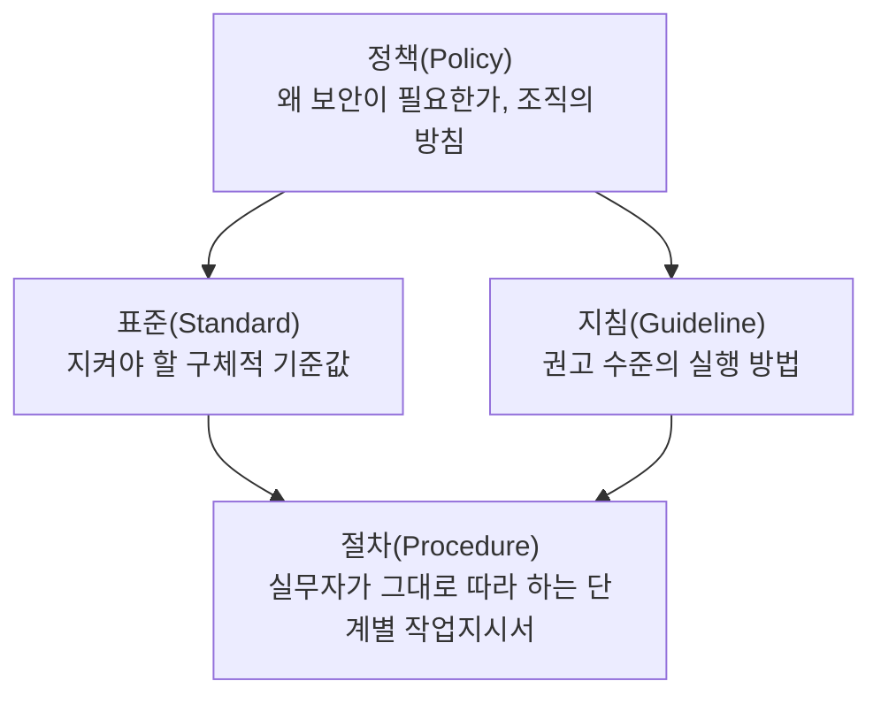
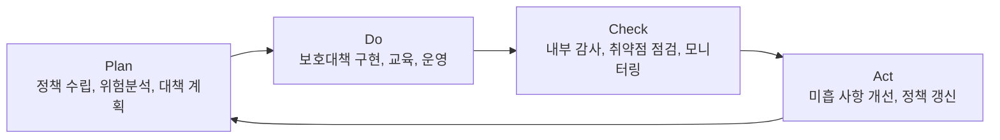

<Callout type="info">
  **이번 문서의 목표:** 이 파일을 다 읽으면 정보보호 정책·지침·표준·절차가 왜 계층으로 나뉘는지, 조직 안에서 누가 어떤 보안 책임을 지는지, ISMS 관리체계가 어떤 영역 구조로 운영되는지를 설명하고 관련 문항을 풀 수 있게 된다.
</Callout>

## 왜 정보보호를 문서와 조직으로 관리하는가

02편에서 정보자산·위협·취약점·위험이라는 개념을 정리했습니다. 그런데 "위험을 줄인다"는 목표를 개인의 선의나 임기응변에만 맡기면 조직 전체의 보안 수준이 들쭉날쭉해집니다. 담당자가 바뀌면 방식이 바뀌고, 문서로 남지 않으면 나중에 "그때 왜 그렇게 했는지" 아무도 설명하지 못합니다.

그래서 정보보호는 세 축으로 관리됩니다. **문서**(정책·지침·표준·절차라는 위계로 규칙을 명문화), **조직**(누가 결정하고 누가 실행하고 누가 점검하는지 역할을 분담), **관리체계**(문서와 조직이 실제로 작동하는지 주기적으로 확인하는 순환 구조)입니다. 독학사 3단계 출제기준에서 이 영역은 "정보보호 관리 및 관련 법제"로 묶이며, 암기형이 아니라 **위계·역할·순환 구조를 정확히 구분**하는 문제로 나옵니다.

> **쉽게 말하면:** 이번 편은 "보안 규칙을 어떤 문서 형태로 적어두고, 누가 그 규칙을 만들고 지키게 하는가"를 정리하는 편입니다.

## 1. 정보보호 문서 위계 — 정책·지침·표준·절차

정보보호 규정은 하나의 문서가 아니라 **추상도가 다른 여러 층의 문서**로 나뉘어 있습니다. 위로 갈수록 "왜"와 "무엇을"을 말하고, 아래로 갈수록 "어떻게"를 구체적으로 말합니다.

| 문서 유형 | 성격 | 예시 |
|-----------|------|------|
| 정책(Policy) | 최상위 방침. 경영진 승인, 강제성 있음, 변경이 드묾 | 모든 임직원은 회사 정보자산을 승인 없이 외부로 반출할 수 없다 |
| 표준(Standard) | 정책을 만족시키기 위한 구체적 수치·기준 | 비밀번호는 10자 이상이며 영문·숫자·특수문자를 포함해야 한다 |
| 지침(Guideline) | 권고 사항. 상황에 따라 예외 허용 | 공용 와이파이 사용 시 VPN 접속을 권장한다 |
| 절차(Procedure) | 실무 담당자가 그대로 수행하는 순서. 가장 구체적 | 신규 입사자 계정 생성은 인사팀 요청서 접수 뒤 3단계로 진행한다 |

<Callout type="warning">
  **자주 틀리는 점:** "표준"과 "지침"을 강제성 여부로 헷갈리기 쉽습니다. **표준은 반드시 지켜야 하는 기준**(예: 최소 자릿수)이고, **지침은 권고 수준**이라 상황에 따라 벗어날 수 있습니다. "정책은 이유, 표준은 반드시 지킬 수치, 지침은 권장 방법, 절차는 실행 순서"로 구분해서 외워야 합니다.
</Callout>

## 2. 조직·역할·책임 — 누가 결정하고 누가 실행하는가

정보보호 활동은 한 사람이 다 할 수 없습니다. 결정하는 사람(경영진), 정책을 설계·관리하는 사람(정보보호 최고책임자), 실제로 시스템을 운영하는 사람(현업 부서), 잘 지켜지는지 점검하는 사람(감사 조직)이 나뉘어야 서로를 견제하고 보완할 수 있습니다.

> **비유:** 회사의 정보보호 조직은 병원과 비슷합니다. 원장(경영진)이 병원 운영 방침을 정하고, 진료과장(정보보호 최고책임자)이 진료 지침을 만들고, 담당 의사·간호사(현업 부서)가 실제 진료(업무)를 하고, 별도의 의료감사팀(내부 감사)이 처방과 기록이 지침대로 됐는지 사후에 점검합니다.

### 핵심 역할

| 역할 | 국내 통상 명칭 | 주요 책임 |
|------|----------------|-----------|
| 최고경영자 | CEO, 대표이사 | 정보보호 정책 최종 승인, 예산·인력 배정 |
| 정보보호 최고책임자 | CISO(Chief Information Security Officer) | 정보보호 정책 수립·관리체계 운영 총괄 |
| 개인정보보호책임자 | CPO(Chief Privacy Officer) | 개인정보 처리 방침 수립, 개인정보 관련 민원·감독 대응(15편에서 자세히) |
| 정보보호 실무 부서 | 보안팀, 정보시스템 운영팀 | 통제 구현, 로그 모니터링, 취약점 조치 |
| 현업 부서 | 각 사업 부서 | 자신의 업무 범위에서 보안 정책 준수 |
| 내부 감사 조직 | 감사팀, 내부통제팀 | 정책 준수 여부를 독립적으로 점검·보고 |

### RACI로 책임을 명확히 나누기

여러 부서가 하나의 보안 업무(예: 접근권한 재검토)에 걸쳐 있을 때 "누가 실제로 하고, 누가 승인하고, 누구에게 물어봐야 하고, 누구에게 결과만 알리면 되는지"가 불분명하면 서로 미루거나 중복 작업이 생깁니다. **RACI**는 이를 네 글자로 정리한 책임 배정 기법입니다.

| 구분 | 영문 | 뜻 |
|------|------|-----|
| R | Responsible | 실제로 그 일을 수행하는 담당자 |
| A | Accountable | 결과에 대해 최종 책임을 지는 승인권자(보통 한 명) |
| C | Consulted | 의사결정 전에 의견을 구해야 하는 사람 |
| I | Informed | 결정·진행 상황을 사후에 통보받으면 되는 사람 |

예를 들어 "휴면 계정 삭제" 업무라면, 시스템 운영팀이 R(직접 삭제 수행), 정보보호팀장이 A(최종 승인), 현업 부서장이 C(계정 소유자 확인을 위해 의견을 구함), 감사팀이 I(결과를 통보받음)로 배정할 수 있습니다.

<Callout type="warning">
  **자주 틀리는 점:** A(Accountable)는 "최종 책임자"이지 "실제 작업자"가 아닙니다. 한 업무에 A는 원칙적으로 **한 명**이어야 하며, 여러 명에게 A를 나눠주면 책임 소재가 다시 불분명해집니다. R은 여러 명일 수 있지만 A는 그렇지 않다는 점이 시험에서 자주 묻는 포인트입니다.
</Callout>

## 3. ISMS 관리체계 수립·운영 — 영역 구조와 PDCA 순환

**ISMS**(Information Security Management System, 정보보호 관리체계)는 앞서 본 정책·조직이 **한 번 만들고 끝나는 것이 아니라 계속 돌아가는 순환 체계**로 운영되도록 만든 국제·국내 표준적 접근입니다. 국내에서는 정보통신망법·개인정보 보호법에 근거해 한국인터넷진흥원(KISA)이 운영하는 **ISMS 인증 제도**로 구체화되어 있으며, 개인정보 보호 영역까지 포함하면 **ISMS-P**(15편에서 자세히 다룹니다)로 확장됩니다.

> **쉽게 말하면:** ISMS는 "정보보호를 계획하고, 실행하고, 점검하고, 개선하는" 순환을 계속 반복하게 만드는 틀입니다.

### PDCA 순환

ISMS 관리체계의 운영 원리는 품질관리에서 널리 쓰이는 **PDCA**(Plan-Do-Check-Act) 순환과 같은 구조입니다.

| 단계 | 의미 | 정보보호 관리체계에서의 활동 |
|------|------|------------------------------|
| Plan(계획) | 목표와 방법을 정한다 | 정보보호 정책·조직 수립, 위험분석(19편) |
| Do(실행) | 계획한 대로 실행한다 | 보호대책 구현, 접근통제(14편) 적용, 임직원 교육 |
| Check(점검) | 계획대로 되고 있는지 확인한다 | 내부 감사, 로그 검토, 취약점 점검 |
| Act(개선) | 점검 결과를 반영해 고친다 | 미흡 사항 시정조치, 정책·절차 개정 |

### 관리체계 수립 및 운영의 핵심 영역

국내 ISMS/ISMS-P 인증기준에서 "1. 관리체계 수립 및 운영" 영역은 대체로 다음 흐름으로 구성됩니다. 세부 통제 항목 명칭·개수는 인증기준 고시 개정에 따라 달라질 수 있으므로, 아래는 **큰 흐름 구조**로 이해해야 합니다.

<Steps>

1. **관리체계 기반 마련** — 경영진 참여, 최고책임자 지정, 자원(예산·인력) 할당
2. **위험관리** — 정보자산 식별, 위험도 평가, 처리 계획 수립(19편에서 상세)
3. **관리체계 운영** — 보호대책 구현, 운영현황 관리
4. **관리체계 점검 및 개선** — 법적 요구사항 준수 여부 점검, 관리체계 점검, 내부 감사, 시정조치

</Steps>

## 4. 문서화와 내부 감사

### 왜 문서화하는가

정보보호는 "우리가 이렇게 하고 있다"는 주장만으로는 증명되지 않습니다. 사고가 발생했을 때, 또는 인증 심사를 받을 때 **문서로 남은 기록**이 있어야 실제로 그 정책이 지켜졌는지 확인할 수 있습니다. 그래서 정책·지침·표준·절차 자체도 문서이고, 그 절차를 수행한 **증적**(실행 결과를 증명하는 로그·양식·승인 이력)도 함께 남겨야 합니다.

> **비유:** 문서화되지 않은 보안 활동은 계약서 없이 한 약속과 같습니다. 서로 기억이 다르면 확인할 방법이 없고, 감사자나 수사기관 앞에서는 "실제로 그렇게 했다"는 근거가 되지 못합니다.

### 내부 감사

**내부 감사**(Internal Audit)는 조직 내부의 독립된 조직(또는 외부에서 위촉된 감사인)이 정보보호 정책·절차가 실제로 지켜지고 있는지 정기적으로 점검하는 활동입니다. 앞서 본 PDCA의 Check 단계에 해당합니다.

내부 감사가 갖춰야 할 핵심 조건은 **독립성**입니다. 감사를 받는 부서와 감사를 수행하는 조직이 분리되어 있어야 "제 식구 감싸기"식 점검을 막을 수 있습니다. 예를 들어 정보시스템 운영팀이 자신의 업무를 스스로 감사하면 문제점을 축소·은폐할 유인이 생기므로, 별도의 감사 조직이나 외부 감사인이 점검을 수행해야 합니다.

<Callout type="warning">
  **자주 틀리는 점:** 내부 감사는 "문제를 찾아 처벌하는 활동"이 아니라 PDCA 순환에서 다음 개선(Act)으로 이어지기 위한 **점검**(Check)입니다. 감사 결과 발견된 미흡 사항은 시정조치 계획을 세워 후속 조치가 완료됐는지까지 확인하는 것이 관리체계의 완결입니다.
</Callout>

## 핵심 정리

- 정보보호 문서는 **정책**(왜) → **표준**(반드시 지킬 기준) → **지침**(권고) → **절차**(실행 순서)로 추상도가 다른 계층을 이룬다.
- 조직의 역할은 경영진·CISO(정보보호 최고책임자)·CPO(개인정보보호책임자)·실무 부서·내부 감사 조직으로 나뉘며, **RACI**로 업무별 책임(R=실행, A=최종 승인, C=자문, I=통보)을 명확히 배정한다. A는 원칙적으로 한 명이다.
- **ISMS**(정보보호 관리체계)는 정책·조직을 **PDCA(Plan-Do-Check-Act) 순환**으로 계속 운영·개선하는 틀이다.
- 관리체계 수립 및 운영은 대체로 기반 마련 → 위험관리 → 관리체계 운영 → 점검 및 개선의 흐름을 따르며, 세부 항목은 인증기준 고시 개정에 따라 달라질 수 있다.
- 문서화와 증적 관리는 정책이 실제로 지켜졌음을 증명하는 근거이며, **독립적인 내부 감사**가 이를 점검해 개선으로 연결한다.

## 마무리 복습

<Quiz
  questionNumber={1}
  question="정보보호 문서 위계 중 반드시 지켜야 하는 구체적 기준값(예: 비밀번호 최소 길이)을 규정하는 문서 유형은?"
  options={['정책(Policy)', '표준(Standard)', '지침(Guideline)', '매뉴얼(Manual)']}
  correctAnswer={2}
  explanation="표준(Standard)은 정책이 요구하는 방침을 만족시키기 위해 반드시 지켜야 하는 구체적 수치·기준을 규정한다. 정책은 방침(왜), 지침은 권고 수준의 실행 방법을 다룬다."
  optionExplanations={['정책은 왜 보안이 필요한지를 규정하는 최상위 방침으로 구체적 수치를 담지 않는다', '정답 — 표준은 반드시 지켜야 하는 구체적 기준값을 규정한다', '지침은 권고 수준이라 상황에 따라 예외가 허용된다', '매뉴얼은 목차에서 별도로 다루는 문서 유형이 아니며 이 위계의 표준 용어가 아니다']}
/>

<Quiz
  questionNumber={2}
  question="RACI 책임 배정 기법에 대한 설명으로 옳지 않은 것은?"
  options={['R(Responsible)은 실제로 업무를 수행하는 담당자다', 'A(Accountable)는 결과에 대한 최종 책임자로 원칙적으로 한 명이다', 'C(Consulted)는 의사결정 전에 의견을 구해야 하는 사람이다', 'A(Accountable)는 여러 명에게 나눠 배정하는 것이 표준적인 방식이다']}
  correctAnswer={4}
  explanation="A(Accountable)는 원칙적으로 한 명이어야 책임 소재가 명확해진다. 여러 명에게 A를 나눠주면 최종 책임자가 불분명해져 RACI를 쓰는 목적 자체가 무너진다."
  optionExplanations={['옳은 설명이다. R은 실제 작업 수행자를 가리킨다', '옳은 설명이다. A는 최종 승인·책임자이며 통상 한 명으로 지정한다', '옳은 설명이다. C는 결정 전에 자문을 구하는 대상이다', '정답 — A를 여러 명에게 나누면 책임 소재가 불분명해지므로 원칙에 어긋난다']}
/>

<Quiz
  questionNumber={3}
  question="ISMS 관리체계의 운영 원리로 제시되는 PDCA 순환에서 'Check' 단계에 해당하는 활동은?"
  options={['정보보호 정책 수립과 위험분석', '보호대책 구현과 임직원 교육', '내부 감사와 취약점 점검', '미흡 사항에 대한 정책·절차 개정']}
  correctAnswer={3}
  explanation="Check(점검) 단계는 계획대로 실행되고 있는지 확인하는 단계로, 내부 감사·로그 검토·취약점 점검이 여기 해당한다. 정책 수립은 Plan, 구현·교육은 Do, 개선은 Act 단계다."
  optionExplanations={['정책 수립과 위험분석은 Plan(계획) 단계에 해당한다', '보호대책 구현과 교육은 Do(실행) 단계에 해당한다', '정답 — 내부 감사와 취약점 점검은 Check(점검) 단계의 활동이다', '정책·절차 개정은 Act(개선) 단계에 해당한다']}
/>

<Quiz
  questionNumber={4}
  question="내부 감사(Internal Audit)가 신뢰성을 갖기 위해 반드시 갖춰야 할 조건으로 가장 적절한 것은?"
  options={['감사 대상 부서가 스스로 감사를 수행해 효율을 높인다', '감사 조직이 감사 대상 부서로부터 독립되어 있어야 한다', '감사는 사고가 발생했을 때만 예외적으로 수행한다', '감사 결과는 경영진에게만 비공개로 보고한다']}
  correctAnswer={2}
  explanation="내부 감사는 감사 대상과 감사 수행 조직이 분리되는 독립성을 갖춰야 문제점을 축소·은폐하지 않고 객관적으로 점검할 수 있다. 이는 PDCA의 Check 단계가 제 역할을 하기 위한 전제 조건이다."
  optionExplanations={['감사 대상이 스스로 감사하면 문제를 축소·은폐할 유인이 생겨 독립성이 훼손된다', '정답 — 독립성은 내부 감사의 신뢰성을 확보하는 핵심 조건이다', '내부 감사는 사고 발생 여부와 무관하게 정기적으로 수행되어야 관리체계가 순환한다', '감사 결과는 개선(Act)으로 이어지도록 관련 조직에 공유되어야 한다']}
/>

<Quiz
  questionNumber={5}
  question="정보보호 조직의 역할에 대한 설명으로 옳지 않은 것은?"
  options={['CISO는 정보보호 정책 수립과 관리체계 운영을 총괄하는 최고책임자다', 'CPO는 개인정보 처리방침 수립과 개인정보 관련 대응을 책임진다', '현업 부서는 정보보호 정책과 무관하게 자율적으로 업무를 수행한다', '내부 감사 조직은 정책 준수 여부를 독립적으로 점검한다']}
  correctAnswer={3}
  explanation="현업 부서도 자신의 업무 범위에서 정보보호 정책을 준수해야 할 의무가 있다. 정보보호는 보안 부서만의 업무가 아니라 조직 전체가 역할을 나눠 수행하는 활동이다."
  optionExplanations={['CISO(정보보호 최고책임자)에 대한 옳은 설명이다', 'CPO(개인정보보호책임자)에 대한 옳은 설명이다', '정답 — 현업 부서도 정보보호 정책을 준수할 의무가 있으며 정책과 무관하게 자율적으로 움직이지 않는다', '내부 감사 조직에 대한 옳은 설명이다']}
/>

<Quiz
  questionNumber={6}
  question="ISMS 관리체계 수립 및 운영의 일반적 흐름으로 가장 적절한 순서는?"
  options={['위험관리 → 관리체계 기반 마련 → 점검 및 개선 → 관리체계 운영', '관리체계 기반 마련 → 위험관리 → 관리체계 운영 → 점검 및 개선', '관리체계 운영 → 점검 및 개선 → 위험관리 → 관리체계 기반 마련', '점검 및 개선 → 관리체계 기반 마련 → 관리체계 운영 → 위험관리']}
  correctAnswer={2}
  explanation="관리체계 수립 및 운영은 경영진 참여와 최고책임자 지정 등 기반을 먼저 마련하고, 위험을 분석해 처리 계획을 세운 뒤, 보호대책을 실제로 운영하고, 마지막으로 점검·개선하는 흐름을 따른다."
  optionExplanations={['위험관리는 기반이 마련된 뒤에 이뤄지는 단계이므로 순서가 맞지 않는다', '정답 — 기반 마련, 위험관리, 운영, 점검 및 개선의 순서가 관리체계 수립의 일반적 흐름이다', '운영이 점검보다 먼저 이뤄져야 하는데 순서가 뒤바뀌었다', '점검은 운영 이후에 이뤄지는 단계이므로 가장 앞에 올 수 없다']}
/>

## 참고 자료

- [정보보호 및 개인정보보호 관리체계(ISMS-P) 인증기준 안내서 - KISA](https://www.kisa.or.kr)
- [정보통신망 이용촉진 및 정보보호 등에 관한 법률 - 국가법령정보센터](https://www.law.go.kr)
