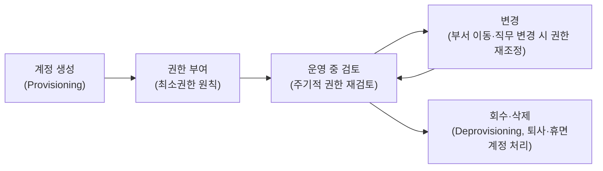

<Callout type="info">
  **이번 문서의 목표:** 이 파일을 다 읽으면 인증 요인 세 가지와 다중 인증의 원리, DAC·MAC·RBAC의 차이, 벨-라파둘라·비바 모델의 읽기·쓰기 규칙 방향, 계정 생명주기와 로그·세션 관리의 핵심을 구분해 설명하고 관련 문항을 풀 수 있게 된다.
</Callout>

## 왜 인증과 접근통제가 정보보호의 핵심 기술 통제인가

13편에서 정책·조직·관리체계라는 **관리적 통제**를 다뤘습니다. 그런데 정책이 아무리 잘 만들어져도, 실제 시스템에 "이 사람이 누구인지 확인하고, 확인된 사람에게만 정해진 만큼의 권한을 주는" **기술적 장치**가 없으면 정책은 종이 위의 약속에 그칩니다. 인증(Authentication)과 접근통제(Access Control)는 바로 이 기술적 장치의 핵심입니다.

04편에서 사용자·프로세스·파일 권한의 기본 구조를 다뤘다면, 이 편은 그 위에서 "누구를 어떻게 확인하고(인증), 확인된 사람에게 무엇을 허용할지(접근통제)를 어떤 모델로 설계하는가"를 정리합니다.

> **쉽게 말하면:** 인증은 "너 누구야?"에 답하는 절차이고, 접근통제는 "그래서 너는 뭘 할 수 있어?"를 결정하는 규칙입니다.

## 1. 식별·인증·인가·계정관리 — AAA 개념의 확장

보안에서 "누군가 시스템을 쓴다"는 행위는 사실 여러 단계로 쪼개집니다.

| 단계 | 영문 | 뜻 | 예시 |
|------|------|-----|------|
| 식별(Identification) | Identification | 자신이 누구라고 **주장**하는 단계 | 아이디를 입력한다 |
| 인증(Authentication) | Authentication | 그 주장이 **사실인지 증명**하는 단계 | 비밀번호를 입력해 본인임을 증명한다 |
| 인가(Authorization) | Authorization | 인증된 사용자에게 **무엇을 할 수 있는지 권한을 부여**하는 단계 | 이 사용자는 읽기만 가능하고 쓰기는 안 된다고 정한다 |
| 계정관리(Accounting/Auditing) | Accounting | 사용자가 실제로 **무엇을 했는지 기록**하는 단계 | 접속·조작 이력을 로그로 남긴다 |

앞의 세 단계에 계정관리(Accounting)를 더해 **AAA**(Authentication, Authorization, Accounting)라고 부르기도 합니다. 시험에서는 "아이디 입력은 식별, 비밀번호 확인은 인증, 이후 접근 권한 부여는 인가"라는 순서를 헷갈리게 하는 문제가 자주 나옵니다.

<Callout type="warning">
  **자주 틀리는 점:** 인증(Authentication)과 인가(Authorization)는 영문 철자가 비슷해 혼동하기 쉽습니다. **인증은 "신원 확인"**(당신이 정말 그 사람이 맞는가), **인가는 "권한 부여"**(확인된 그 사람에게 무엇을 허용할 것인가)로 완전히 다른 단계입니다. 로그인에 성공했다고(인증 통과) 모든 기능을 쓸 수 있는 것은 아닙니다(인가는 별도로 결정).
</Callout>

## 2. 인증 요인 3종 — 지식·소유·생체

사용자가 본인임을 증명하는 방법은 성격에 따라 크게 세 갈래로 분류됩니다. 이를 **인증 요인**(Authentication Factor)이라 합니다.

> **쉽게 말하면:** "내가 아는 것", "내가 가진 것", "나 자신인 것" 세 가지 중 무엇으로 증명하느냐의 차이입니다.

| 인증 요인 | 영문 표현 | 원리 | 대표 예시 | 주요 약점 |
|-----------|-----------|------|-----------|-----------|
| 지식 기반 | Something you know | 본인만 알고 있는 정보를 안다는 것으로 증명 | 비밀번호, PIN 번호, 보안 질문 답변 | 유출·추측·공유가 쉽다(어깨너머 훔쳐보기, 사전 대입 공격) |
| 소유 기반 | Something you have | 본인만 가지고 있는 물건을 소지한다는 것으로 증명 | OTP(One-Time Password, 일회용 비밀번호) 생성기, 스마트카드, 공동인증서가 저장된 USB | 분실·도난 시 타인이 사용 가능 |
| 생체 기반 | Something you are | 본인 신체의 고유한 특징으로 증명 | 지문, 홍채, 정맥, 얼굴 인식 | 위조·복제 가능성, 한 번 유출되면 재발급 불가(비밀번호처럼 바꿀 수 없음) |

세 요인 외에 "본인의 행동 습관"(예: 타이핑 리듬, 걸음걸이)으로 증명하는 **행위 기반**(Something you do)을 네 번째 요인으로 다루기도 하지만, 독학사 출제기준에서는 지식·소유·생체 세 가지가 핵심 축입니다.

<Callout type="warning">
  **자주 틀리는 점:** OTP는 "생체 인증"이 아니라 **소유 기반 인증**입니다. OTP 생성기(또는 스마트폰 앱)라는 **물건을 가지고 있다는 사실**로 인증하기 때문입니다. 지문이나 홍채처럼 신체 자체를 이용해야 생체 기반으로 분류됩니다.
</Callout>

## 3. 다중 인증(MFA) — 서로 다른 요인을 조합한다

**다중 인증**(MFA, Multi-Factor Authentication)은 위 세 요인 중 **서로 다른 두 가지 이상**을 조합해 인증 강도를 높이는 방식입니다. 비밀번호(지식) 하나만 뚫리면 계정 전체가 뚫리는 구조를 막기 위해, 공격자가 여러 요인을 동시에 확보해야만 인증을 통과하도록 설계합니다.

> **비유:** 은행 금고를 여는 데 열쇠(소유)와 비밀번호(지식)를 모두 요구하는 것과 같습니다. 열쇠만 훔치거나 비밀번호만 알아내서는 금고를 열 수 없습니다.

- 비밀번호(지식) + OTP(소유) → 흔히 쓰이는 2단계 인증(2FA, Two-Factor Authentication)
- 비밀번호(지식) + 지문(생체) → 스마트폰 잠금 해제에서 흔히 조합
- 비밀번호(지식) + OTP(소유) + 지문(생체) → 세 요인을 모두 쓰는 강한 다중 인증

<Callout type="warning">
  **자주 틀리는 점:** "비밀번호 + 보안 질문"은 **같은 지식 기반 요인 두 개**를 쓴 것이라 다중 인증이 아닙니다. 다중 인증이 성립하려면 **서로 다른 범주(지식·소유·생체)의 요인**을 조합해야 합니다. 요인의 개수가 아니라 **요인의 종류**가 다른지가 핵심입니다.
</Callout>

## 4. 접근통제 모델 — DAC·MAC·RBAC

인증으로 "누구인지"가 확인되면, 그다음은 "이 사람에게 어떤 자원에 대해 무엇을 허용할지"를 결정하는 **접근통제**(Access Control) 규칙이 필요합니다. 이 규칙을 누가, 어떤 기준으로 정하느냐에 따라 대표적으로 세 가지 모델로 나뉩니다.

| 구분 | DAC | MAC | RBAC |
|------|-----|-----|------|
| 정식 명칭 | 임의적 접근통제(Discretionary Access Control) | 강제적 접근통제(Mandatory Access Control) | 역할기반 접근통제(Role-Based Access Control) |
| 권한 부여 주체 | 자원의 소유자(사용자) 본인이 자율적으로 결정 | 시스템(관리자가 정한 보안 등급 정책)이 강제로 결정 | 관리자가 정의한 역할(Role)에 사용자를 배정 |
| 판단 기준 | 소유자의 재량, 신원(Identity) | 보안 등급·분류(Security Label, Clearance) | 업무상 역할(직무, 직책) |
| 유연성 | 높음(소유자가 언제든 권한 변경 가능) | 낮음(정책 변경이 어렵고 엄격) | 중간(역할 정의만 바꾸면 다수 사용자에 일괄 반영) |
| 대표 사례 | 리눅스·윈도우 파일의 소유자가 다른 사용자에게 읽기·쓰기 권한을 부여 | 군사·정부 등급 체계(비밀·대외비 등급에 따른 접근) | 기업 ERP에서 "인사팀장" 역할에 권한을 묶어 배정 |
| 사용자 임의 변경 | 가능(소유자 권한) | 불가능(관리자·정책만 변경 가능) | 불가능(역할 정의 변경은 관리자 권한) |

> **쉽게 말하면:** DAC는 "내 파일이니 내 마음대로", MAC는 "회사(시스템) 정책이 등급으로 강제로 정함", RBAC는 "네 직무가 무엇이냐에 따라 정해진 권한 꾸러미를 받음"입니다.

<Callout type="warning">
  **자주 틀리는 점:** MAC를 "관리자(admin)가 접근을 통제하는 것"으로 오해하기 쉽지만, 핵심은 **관리자 개인의 재량이 아니라 시스템에 미리 정의된 보안 등급 정책이 강제로 적용**된다는 점입니다. 관리자조차 정책을 우회해 임의로 권한을 바꿀 수 없는 것이 DAC와의 결정적 차이입니다. RBAC는 사용자 개인이 아니라 **역할**에 권한을 묶는다는 점에서 DAC(소유자 재량)와도, MAC(보안 등급)와도 다릅니다.
</Callout>

## 5. 벨-라파둘라 모델과 비바 모델 — 기밀성과 무결성의 규칙 방향

MAC를 실제로 구현할 때 "등급이 다른 주체와 객체 사이에 읽기·쓰기를 어떻게 허용할 것인가"를 수학적으로 정의한 대표 모델이 **벨-라파둘라**(Bell-LaPadula)와 **비바**(Biba)입니다. 둘은 지키려는 목표가 정반대이기 때문에 읽기·쓰기 규칙의 방향도 정반대입니다. 독학사 시험에서 이 방향을 뒤바꿔 놓은 오답 보기가 자주 등장합니다.

> **쉽게 말하면:** 벨-라파둘라는 "비밀이 아래로 새지 않게"(기밀성), 비바는 "오염된 정보가 위로 올라가지 않게"(무결성) 막는 모델입니다.

### 벨-라파둘라 모델(Bell-LaPadula) — 기밀성 보호

군사·정부 등급 체계(1급 비밀, 2급 비밀, 대외비 등)처럼 **높은 등급일수록 더 비밀스러운 정보**라는 전제에서 출발합니다. 목표는 비밀 정보가 낮은 등급의 주체에게 흘러나가지 않도록 막는 것, 즉 **기밀성**(Confidentiality) 보호입니다.

| 규칙 이름 | 내용 | 방향 |
|-----------|------|------|
| 단순 보안 속성(Simple Security Property) | No Read Up — 자신의 등급보다 **높은** 등급의 정보를 읽을 수 없다 | 읽기는 자기 등급 이하로만(하향 읽기 허용) |
| 스타 속성(*-Property) | No Write Down — 자신의 등급보다 **낮은** 등급으로 정보를 쓸 수 없다 | 쓰기는 자기 등급 이상으로만(상향 쓰기 허용) |

### 비바 모델(Biba) — 무결성 보호

비바 모델은 벨-라파둘라와 반대로, 신뢰도가 낮은(오염됐을 수 있는) 정보가 신뢰도가 높은 정보에 섞여 들어가는 것을 막는 데 목적을 둡니다. 즉 **무결성**(Integrity) 보호입니다.

| 규칙 이름 | 내용 | 방향 |
|-----------|------|------|
| 단순 무결성 속성(Simple Integrity Property) | No Read Down — 자신의 등급보다 **낮은** 등급의(신뢰도가 낮은) 정보를 읽을 수 없다 | 읽기는 자기 등급 이상으로만(상향 읽기 허용) |
| 스타 무결성 속성(*-Integrity Property) | No Write Up — 자신의 등급보다 **높은** 등급으로 정보를 쓸 수 없다 | 쓰기는 자기 등급 이하로만(하향 쓰기 허용) |

### 두 모델의 방향 비교

| 모델 | 보호 목표 | 읽기 규칙 | 쓰기 규칙 |
|------|-----------|-----------|-----------|
| 벨-라파둘라(Bell-LaPadula) | 기밀성(Confidentiality) | 위로 못 읽음(No Read Up) → 자기 등급 이하만 읽기 가능 | 아래로 못 씀(No Write Down) → 자기 등급 이상에만 쓰기 가능 |
| 비바(Biba) | 무결성(Integrity) | 아래로 못 읽음(No Read Down) → 자기 등급 이상만 읽기 가능 | 위로 못 씀(No Write Up) → 자기 등급 이하에만 쓰기 가능 |

> **비유:** 벨-라파둘라는 "1급 비밀 취급자는 대외비 문서도 볼 수 있지만(하향 읽기), 자신이 아는 1급 비밀을 대외비 등급 문서에 옮겨 적을 수는 없다(상향 쓰기만 허용)"는 규칙입니다. 반대로 비바는 "품질 검증을 마친 상위 신뢰 등급의 시스템은 검증되지 않은 하위 등급의 데이터를 읽어들여 오염되면 안 되고(상향 읽기만 허용), 자신의 신뢰 정보를 함부로 하위 등급에 써서 오염된 것처럼 보이게 해서도 안 된다(하향 쓰기만 허용)"는 규칙입니다.

<Callout type="warning">
  **자주 틀리는 점:** 두 모델의 읽기·쓰기 방향은 서로 **정반대**이므로 헷갈리면 바로 오답으로 이어집니다. "기밀성(벨-라파둘라)은 위험한 것을 위에 가둔다"고 생각하면, 위는 못 읽고(No Read Up) 아래로는 못 쓴다는(No Write Down) 방향이 자연스럽게 연결됩니다. "무결성(비바)은 오염된 것이 위로 못 올라간다"고 생각하면, 아래는 못 읽고(No Read Down) 위로는 못 쓴다는(No Write Up) 방향이 연결됩니다.
</Callout>

## 6. 계정·권한 생명주기(Lifecycle) 관리

계정과 권한은 한 번 만들면 끝이 아니라 **생성부터 회수까지 생명주기**로 관리해야 합니다.

| 단계 | 핵심 원칙 |
|------|-----------|
| 계정 생성 | 승인 절차를 거쳐 생성하며, 업무에 필요한 권한만 부여한다 |
| 권한 부여 | **최소 권한 원칙**(Least Privilege) — 업무 수행에 꼭 필요한 최소한의 권한만 준다. **알 필요성 원칙**(Need-to-Know) — 알아야 할 정보에만 접근을 허용한다 |
| 운영 중 검토 | 정기적으로 권한 보유 현황을 재검토해 과도한 권한(권한 누적, Privilege Creep)을 찾아 회수한다 |
| 변경 | 부서 이동·직무 변경 시 이전 권한을 회수하고 새 업무에 맞는 권한을 다시 부여한다 |
| 회수·삭제 | 퇴사·계약 종료 시 즉시 계정을 비활성화하고, 장기간 미사용된 **휴면 계정**은 별도로 식별해 잠그거나 삭제한다 |

<Callout type="warning">
  **자주 틀리는 점:** 부서를 이동한 직원의 계정에 **이전 부서 권한이 그대로 남아 있고 새 부서 권한만 추가**되는 경우가 실무에서 흔한 사고 원인입니다. 이를 **권한 누적**(Privilege Creep)이라 하며, 최소 권한 원칙에 어긋납니다. 권한은 새로 필요한 만큼만 주고, 더 이상 필요 없는 권한은 반드시 회수해야 합니다.
</Callout>

## 7. 로그·세션 관리

계정·접근통제가 아무리 잘 설계되어도, **실제로 무슨 일이 있었는지 기록하고 이상 징후를 감지**하지 못하면 사고를 뒤늦게 발견합니다.

- **로그인 시도 제한**: 일정 횟수(예: 5회) 이상 로그인에 실패하면 계정을 일시 잠그거나 추가 인증을 요구해, 무작위 대입 공격(Brute-force Attack)을 어렵게 만든다.
- **세션 타임아웃**: 일정 시간 조작이 없으면 자동으로 로그아웃시켜, 자리를 비운 사이 타인이 세션을 가로채는 것을 막는다.
- **동시 로그인 제한**: 한 계정이 여러 곳에서 동시에 로그인되는 것을 제한하거나 감지해 계정 공유·탈취 정황을 포착한다.
- **감사 로그(Audit Log)**: 로그인·권한 변경·중요 데이터 접근 이력을 남겨, 사고 발생 시 원인 분석과 책임 추적(16편의 포렌식과 연결)의 근거로 삼는다.

<Callout type="warning">
  **자주 틀리는 점:** 로그는 "쌓아두기만 하면 되는 기록"이 아닙니다. 로그가 **위·변조되지 않도록 별도로 보관**(원본 로그 서버 분리, 접근 권한 최소화)하고, **주기적으로 검토**하지 않으면 이상 징후를 놓칩니다. 로그 수집 자체와 로그의 무결성 보장, 그리고 실제 분석은 각각 별개의 통제로 다뤄야 합니다.
</Callout>

## 핵심 정리

- 식별(주장) → 인증(증명) → 인가(권한 부여) → 계정관리(기록)의 순서를 구분해야 하며, 이 네 단계를 합쳐 **AAA**라 부른다.
- 인증 요인은 **지식 기반**(비밀번호), **소유 기반**(OTP·스마트카드), **생체 기반**(지문·홍채) 세 가지이며, **다중 인증**(MFA)은 서로 다른 요인 두 가지 이상을 조합해야 성립한다.
- 접근통제 모델은 **DAC**(소유자 재량), **MAC**(시스템의 보안 등급 강제), **RBAC**(역할에 권한 배정)로 나뉘며 권한 부여 주체와 유연성이 다르다.
- **벨-라파둘라**(기밀성): 위로 못 읽음(No Read Up), 아래로 못 씀(No Write Down). **비바**(무결성): 아래로 못 읽음(No Read Down), 위로 못 씀(No Write Up) — 두 모델의 방향은 정반대다.
- 계정·권한은 생성·부여·검토·변경·회수의 **생명주기**로 관리하며, **최소 권한 원칙**과 **권한 누적 방지**가 핵심이다. 로그·세션 관리는 이상 징후 탐지와 사고 대응의 기반이 된다.

## 마무리 복습

<Quiz
  questionNumber={1}
  question="인증 요인 중 OTP(One-Time Password) 생성기가 속하는 분류로 옳은 것은?"
  options={['지식 기반(Something you know)', '소유 기반(Something you have)', '생체 기반(Something you are)', '행위 기반과 생체 기반의 혼합']}
  correctAnswer={2}
  explanation="OTP 생성기(또는 앱)는 본인이 소지한 물건이라는 사실로 인증하므로 소유 기반 요인이다. 지식 기반은 비밀번호처럼 아는 정보로, 생체 기반은 지문·홍채처럼 신체 특징으로 증명하는 방식이다."
  optionExplanations={['지식 기반은 비밀번호·PIN처럼 아는 정보로 증명하는 방식이라 OTP와 다르다', '정답 — OTP 생성기를 소지하고 있다는 사실로 인증하므로 소유 기반이다', '생체 기반은 지문·홍채 등 신체 고유 특징을 이용하는 방식으로 OTP와 무관하다', 'OTP는 소유 기반 요인 하나로 분류되며 혼합 분류가 아니다']}
/>

<Quiz
  questionNumber={2}
  question="다중 인증(MFA)이 성립하는 조합으로 옳은 것은?"
  options={['비밀번호와 보안 질문 답변을 함께 요구한다', '비밀번호와 지문 인식을 함께 요구한다', '비밀번호를 두 번 연속으로 입력하게 한다', 'PIN 번호와 보안 질문 답변을 함께 요구한다']}
  correctAnswer={2}
  explanation="다중 인증은 서로 다른 범주(지식·소유·생체)의 요인을 조합해야 성립한다. 비밀번호(지식)와 지문(생체)은 서로 다른 요인이므로 다중 인증이 맞지만, 비밀번호와 보안 질문, PIN과 보안 질문은 모두 지식 기반 요인끼리의 조합이라 다중 인증으로 인정되지 않는다."
  optionExplanations={['비밀번호와 보안 질문은 둘 다 지식 기반 요인이라 다중 인증이 아니다', '정답 — 비밀번호(지식)와 지문(생체)은 서로 다른 요인이므로 다중 인증이 성립한다', '같은 지식 기반 요인을 반복 입력하는 것은 요인의 종류가 늘지 않으므로 다중 인증이 아니다', 'PIN과 보안 질문은 둘 다 지식 기반 요인이라 다중 인증이 아니다']}
/>

<Quiz
  questionNumber={3}
  question="DAC(임의적 접근통제)와 MAC(강제적 접근통제)의 차이에 대한 설명으로 옳은 것은?"
  options={['DAC는 시스템의 보안 등급 정책이 강제로 권한을 결정하고, MAC는 소유자가 자율적으로 권한을 결정한다', 'DAC는 자원의 소유자가 자율적으로 권한을 결정하고, MAC는 시스템의 보안 등급 정책이 강제로 권한을 결정한다', 'DAC와 MAC 모두 관리자의 개인적 재량으로 권한을 결정한다', 'DAC와 MAC는 역할(Role)을 기준으로 권한을 배정한다는 점에서 동일하다']}
  correctAnswer={2}
  explanation="DAC(임의적 접근통제)는 자원 소유자가 자신의 재량으로 다른 사용자에게 권한을 부여하는 방식이고, MAC(강제적 접근통제)는 시스템에 미리 정의된 보안 등급 정책이 강제로 적용되어 관리자조차 임의로 바꿀 수 없는 방식이다."
  optionExplanations={['DAC와 MAC의 설명이 서로 뒤바뀌었다', '정답 — DAC는 소유자 재량, MAC는 시스템의 강제 정책이라는 설명이 옳다', 'MAC는 관리자 개인의 재량이 아니라 시스템에 정의된 정책이 강제로 적용되는 방식이다', '역할(Role) 기준 권한 배정은 RBAC의 특징이며 DAC·MAC와는 다른 기준을 쓴다']}
/>

<Quiz
  questionNumber={4}
  question="벨-라파둘라(Bell-LaPadula) 모델의 규칙 방향으로 옳은 것은?"
  options={['자기 등급보다 높은 정보는 읽을 수 없고, 낮은 등급으로는 쓸 수 없다', '자기 등급보다 낮은 정보는 읽을 수 없고, 높은 등급으로는 쓸 수 없다', '자기 등급과 관계없이 모든 등급을 읽고 쓸 수 있다', '자기 등급보다 높은 정보만 읽을 수 있고, 낮은 등급으로만 쓸 수 있다']}
  correctAnswer={1}
  explanation="벨-라파둘라 모델은 기밀성 보호가 목적이므로 No Read Up(자기 등급보다 높은 정보를 읽을 수 없음)과 No Write Down(자기 등급보다 낮은 등급으로 쓸 수 없음)이 적용된다."
  optionExplanations={['정답 — 벨-라파둘라는 위로 못 읽고(No Read Up) 아래로 못 쓴다(No Write Down)', '이는 비바 모델의 규칙 방향(아래로 못 읽고 위로 못 씀)에 해당한다', '벨-라파둘라는 기밀성 보호를 위해 등급 간 읽기·쓰기에 엄격한 제한을 둔다', '읽기·쓰기 방향이 실제 벨-라파둘라 규칙과 반대로 서술되었다']}
/>

<Quiz
  questionNumber={5}
  question="비바(Biba) 모델이 보호하려는 목표와 그 방향으로 옳은 것은?"
  options={['기밀성 보호가 목적이며, 위로 못 읽고 아래로 못 쓴다', '무결성 보호가 목적이며, 아래로 못 읽고 위로 못 쓴다', '가용성 보호가 목적이며, 등급과 무관하게 자유롭게 읽고 쓴다', '무결성 보호가 목적이며, 위로 못 읽고 아래로 못 쓴다']}
  correctAnswer={2}
  explanation="비바 모델은 무결성 보호가 목적이며, 신뢰도가 낮은(오염된) 정보를 읽어 상위 등급이 오염되지 않도록 No Read Down(아래로 못 읽음)과 No Write Up(위로 못 씀)을 적용한다."
  optionExplanations={['이는 벨-라파둘라 모델의 목표와 방향에 해당한다', '정답 — 비바는 무결성 보호가 목적이며 아래로 못 읽고 위로 못 쓴다', '비바 모델은 가용성이 아니라 무결성을 보호하기 위한 모델이다', '무결성 보호는 맞지만 방향이 벨-라파둘라와 뒤바뀌어 서술되었다']}
/>

<Quiz
  questionNumber={6}
  question="계정·권한 관리에서 부서를 이동한 직원의 계정에 이전 권한이 회수되지 않고 새 권한만 계속 추가되는 현상을 가리키는 용어는?"
  options={['최소 권한 원칙(Least Privilege)', '권한 누적(Privilege Creep)', '알 필요성 원칙(Need-to-Know)', '다중 인증(MFA)']}
  correctAnswer={2}
  explanation="권한 누적(Privilege Creep)은 직무 변경·부서 이동 등을 거치며 이전 권한이 회수되지 않고 새 권한만 계속 쌓여 필요 이상의 권한을 보유하게 되는 현상을 가리킨다. 이는 최소 권한 원칙에 어긋나는 대표적인 문제다."
  optionExplanations={['최소 권한 원칙은 업무에 필요한 최소한의 권한만 부여하자는 원칙으로, 이 현상을 막기 위해 지켜야 할 원칙이지 현상 자체의 이름이 아니다', '정답 — 권한이 회수되지 않고 계속 쌓이는 현상을 권한 누적이라 한다', '알 필요성 원칙은 정보 접근을 알아야 할 필요가 있는 범위로 제한하는 원칙이다', '다중 인증은 인증 강도를 높이는 방식으로 이 현상과 관계가 없다']}
/>

<Quiz
  questionNumber={7}
  question="로그(Log)·세션 관리에 대한 설명으로 옳지 않은 것은?"
  options={['로그인 실패 횟수를 제한하면 무작위 대입 공격을 어렵게 만들 수 있다', '세션 타임아웃은 자리를 비운 사이 세션이 가로채이는 것을 막는 데 도움이 된다', '감사 로그는 사고 발생 시 원인 분석과 책임 추적의 근거가 된다', '로그는 한 번 수집되면 그 자체로 위·변조 위험이 없으므로 별도 보호 조치가 필요 없다']}
  correctAnswer={4}
  explanation="로그도 위·변조될 수 있으므로 원본 로그 서버 분리, 접근 권한 최소화 등 별도의 무결성 보호 조치가 필요하다. 로그 수집과 로그의 무결성 보장은 별개의 통제로 다뤄야 한다."
  optionExplanations={['옳은 설명이다. 로그인 실패 제한은 무작위 대입 공격에 대한 대응이다', '옳은 설명이다. 세션 타임아웃은 세션 가로채기를 막는 데 도움이 된다', '옳은 설명이다. 감사 로그는 사고 대응·포렌식의 기초 자료가 된다', '정답 — 로그도 위·변조 위험이 있으므로 별도의 보호 조치가 반드시 필요하다']}
/>

## 참고 자료

- [정보보호 및 개인정보보호 관리체계(ISMS-P) 인증기준 안내서 - KISA](https://www.kisa.or.kr)
- [국내 DB 보안·접근통제 가이드 - 행정안전부](https://www.mois.go.kr)
