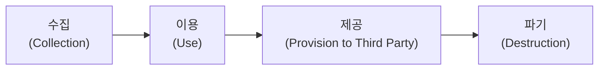
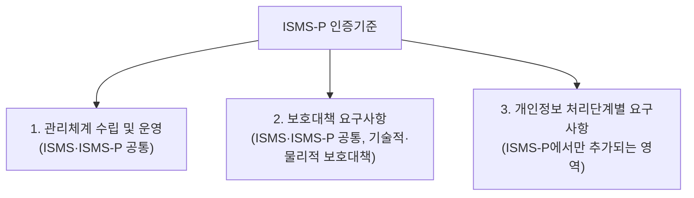

<Callout type="warning">
  **먼저 밝혀둘 점:** 이 편에서 다루는 개인정보 보호법·정보통신망법 관련 내용과 ISMS-P 인증기준의 세부 조문·통제 항목 수·문구는 **법령 개정과 인증기준 고시 개정에 따라 바뀔 수 있습니다.** 이 문서는 시험에서 반복적으로 출제되는 **구조와 개념의 뼈대**를 정리한 것이며, 실제 응시 전에는 국가법령정보센터(law.go.kr)와 KISA·개인정보보호위원회가 공개하는 **최신 고시·인증기준 원문을 반드시 확인**해야 합니다.
</Callout>

## 왜 개인정보보호를 별도로 다루는가

12편에서 조직·정책 전반의 관리체계를, 13편에서 접근통제·인증이라는 기술적 통제를 다뤘습니다. 개인정보보호는 이 둘의 연장선에 있지만, **보호 대상이 조직의 정보자산이 아니라 특정 개인(정보주체)의 권리**라는 점에서 결이 다릅니다.

## 1. 개인정보·민감정보·고유식별정보의 정의

### 개인정보

**개인정보**(Personal Information)는 살아있는 개인에 관한 정보로서, 그 정보만으로 또는 다른 정보와 쉽게 결합해 **특정 개인을 알아볼 수 있는 정보**를 말합니다. 이름·주민등록번호처럼 그 자체로 식별되는 정보뿐 아니라, 이메일 주소·휴대전화번호·사진처럼 다른 정보와 결합해 식별 가능해지는 정보도 포함됩니다.

### 민감정보

**민감정보**(Sensitive Information)는 유출되면 정보주체에게 사회적 차별이나 불이익을 줄 수 있는 정보로, 개인정보 중에서도 더 엄격하게 보호합니다. 민감정보는 원칙적으로 정보주체의 **별도 동의** 없이는 처리할 수 없습니다.

### 고유식별정보

**고유식별정보**(Unique Identification Information)는 법령에 따라 개인을 고유하게 구별하기 위해 부여된 식별번호로, 주민등록번호·여권번호·운전면허번호·외국인등록번호가 대표적입니다. 특히 **주민등록번호**는 국내법상 원칙적으로 처리(수집·저장 등)가 금지되고, 법령에 근거가 있거나 정보주체에게 별도 동의를 구한 경우 등 예외적인 경우에만 제한적으로 허용됩니다.

| 구분 | 정의 | 예시 | 보호 수준 |
|------|------|------|-----------|
| 개인정보 | 특정 개인을 알아볼 수 있는 정보(단독 또는 결합) | 이름, 이메일, 휴대전화번호 | 기본 보호 |
| 민감정보 | 사회적 차별·불이익 우려가 있는 정보 | 건강 상태, 정치적 견해, 노동조합 가입 여부 | 원칙적으로 별도 동의 필요 |
| 고유식별정보 | 법령상 개인을 고유하게 구별하는 식별번호 | 주민등록번호, 여권번호, 운전면허번호 | 원칙적 처리 제한(주민등록번호는 특히 엄격) |

<Callout type="warning">
  **자주 틀리는 점:** 민감정보와 고유식별정보는 서로 **다른 분류 기준**입니다. 민감정보는 "정보의 내용(성격)"이 차별·불이익으로 이어질 수 있는지로 판단하고, 고유식별정보는 "법령이 부여한 식별번호"인지로 판단합니다. 주민등록번호는 고유식별정보에 해당하지만 민감정보는 아니며, 건강 정보는 민감정보에 해당하지만 고유식별정보(식별번호)는 아닙니다.
</Callout>

## 2. 개인정보 처리 4단계와 보호조치

개인정보는 조직이 마음대로 다룰 수 있는 자원이 아니라, **정보주체의 동의와 법령이 허용하는 범위 안에서만** 처리(수집부터 파기까지의 모든 취급 행위)할 수 있습니다. 처리 과정은 크게 네 단계로 나눠 이해하면 각 단계에서 요구되는 보호조치를 정리하기 쉽습니다.

```mermaid
graph LR
  A["수집<br/>(Collection)"] --> B["이용<br/>(Use)"]
  B --> C["제공<br/>(Provision to Third Party)"]
  C --> D["파기<br/>(Destruction)"]
```

| 단계 | 핵심 원칙 | 대표 보호조치 |
|------|-----------|----------------|
| 수집 | 정보주체의 **동의**를 받거나 법령에 근거해야 하며, 수집 목적을 명확히 알려야 한다(고지 사항: 수집 항목, 목적, 보유 기간 등) | 필요 최소한의 정보만 수집(최소 수집 원칙), 동의서·고지 절차 구비 |
| 이용 | 수집 당시 고지한 **목적 범위 안에서만** 이용해야 한다(목적 외 이용 원칙 금지) | 목적별 접근권한 분리, 목적 외 이용 시 별도 동의 또는 법령 근거 필요 |
| 제공 | 제3자에게 제공하려면 원칙적으로 **정보주체의 별도 동의**가 필요하다(제공받는 자, 제공 목적, 제공 항목, 보유 기간을 고지) | 제3자 제공 계약서·안전조치 확인, 국외 이전 시 추가 요건 |
| 파기 | 보유 기간이 지나거나 처리 목적을 달성하면 **지체 없이 파기**해야 한다 | 복구·재생 불가능한 방법으로 파기(전자적 파일은 완전 삭제, 종이 문서는 파쇄·소각) |

<Callout type="warning">
  **자주 틀리는 점:** "동의를 받았다"는 사실 하나로 모든 처리가 정당화된다고 오해하기 쉽습니다. 동의는 **수집 목적 범위 안에서만** 유효하며, 처음 고지한 목적을 벗어난 이용·제공에는 **별도의 동의**가 다시 필요합니다. 또한 법령에 별도 근거가 있는 경우(예: 수사기관의 적법한 요청)에는 동의 없이도 처리가 가능한 예외가 있다는 점도 함께 기억해야 합니다.
</Callout>

## 3. ISMS-P 인증기준의 영역 구조

12편에서 ISMS의 PDCA 순환과 관리체계 수립·운영 영역을 다뤘습니다. **ISMS-P**(정보보호 및 개인정보보호 관리체계 인증)는 이 ISMS 관리체계에 **개인정보 처리 단계별 보호조치**를 더한 인증 제도로, 개인정보를 처리하는 조직이라면 개인정보 영역까지 함께 인증받을 수 있습니다.

ISMS-P 인증기준은 큰 틀에서 **세 영역**으로 구성됩니다. 각 영역의 하위 세부 통제 항목 명칭과 개수는 인증기준 고시가 개정될 때마다 조정될 수 있으므로, 아래는 **영역 구조 자체를 이해하는 용도**로 학습해야 합니다.

```mermaid
graph TD
  ISMSP["ISMS-P 인증기준"] --> A1["1. 관리체계 수립 및 운영<br/>(ISMS·ISMS-P 공통)"]
  ISMSP --> A2["2. 보호대책 요구사항<br/>(ISMS·ISMS-P 공통, 기술적·물리적 보호대책)"]
  ISMSP --> A3["3. 개인정보 처리단계별 요구사항<br/>(ISMS-P에서만 추가되는 영역)"]
```

| 영역 | 성격 | 다루는 내용의 큰 갈래 |
|------|------|------------------------|
| 1. 관리체계 수립 및 운영 | ISMS·ISMS-P 공통 | 12편에서 다룬 PDCA 순환(기반 마련 → 위험관리 → 운영 → 점검 및 개선) |
| 2. 보호대책 요구사항 | ISMS·ISMS-P 공통 | 13편에서 다룬 접근통제·인증, 시스템·네트워크 보안, 물리적 보안 등 기술·관리적 보호대책 |
| 3. 개인정보 처리단계별 요구사항 | ISMS-P 추가 영역 | 이 편에서 다룬 수집·이용·제공·파기 각 단계에서 요구되는 개인정보 보호조치 |

<Callout type="warning">
  **자주 틀리는 점:** "ISMS 인증"과 "ISMS-P 인증"을 완전히 별개의 제도로 오해하기 쉽지만, **ISMS-P는 ISMS의 상위 확장** 관계입니다. 즉 ISMS-P 인증을 받으면 1·2영역(ISMS에 해당하는 관리체계·보호대책)과 3영역(개인정보 처리단계)을 모두 충족한 것이고, 개인정보를 처리하지 않는(또는 처리량이 적은) 조직은 1·2영역만으로 구성된 ISMS 인증만 받을 수도 있습니다. "영역 3개 모두"가 아니라 "1·2영역은 공통, 3영역이 개인정보 처리 조직에 추가된다"는 관계로 이해해야 합니다.
</Callout>

## 핵심 정리

- **개인정보**는 특정 개인을 알아볼 수 있는 정보, **민감정보**는 차별·불이익 우려가 있는 정보(내용 기준), **고유식별정보**는 법령상 개인을 고유 구별하는 식별번호(형식 기준)로 서로 다른 분류축이다.
- 개인정보 처리는 **수집 → 이용 → 제공 → 파기**의 흐름을 따르며, 각 단계마다 동의·목적 범위·제3자 제공 요건·파기 의무라는 별도의 보호조치가 요구된다.
- **ISMS-P**는 ISMS의 "1. 관리체계 수립 및 운영"과 "2. 보호대책 요구사항" 영역에 "3. 개인정보 처리단계별 요구사항" 영역을 더한 확장 인증 제도다.
- 개인정보 관련 법령 조문과 ISMS-P 세부 통제 항목은 **개정될 수 있으므로**, 실제 응시 전 반드시 **최신 고시·법령 원문을 확인**해야 하며 이 문서는 구조 이해용으로 학습한다.

## 마무리 복습

<Quiz
  questionNumber={1}
  question={"개인정보·민감정보·고유식별정보의 분류 기준에 대한 설명으로 옳은 것은?"}
  options={["민감정보와 고유식별정보는 동일한 기준으로 분류되는 같은 개념이다","민감정보는 정보의 내용(차별·불이익 우려)으로, 고유식별정보는 법령상 식별번호인지로 판단한다","고유식별정보는 모두 민감정보에 포함되는 하위 개념이다","개인정보는 민감정보와 고유식별정보를 모두 제외한 나머지 정보만을 가리킨다"]}
  correctAnswer={2}
  explanation={"민감정보는 사상·신념·건강 등 내용상 차별·불이익으로 이어질 수 있는지를 기준으로 판단하고, 고유식별정보는 주민등록번호처럼 법령이 개인을 고유하게 구별하기 위해 부여한 식별번호인지를 기준으로 판단하는, 서로 다른 분류축이다."}
/>

<Quiz
  questionNumber={2}
  question={"개인정보 처리 단계 중 '제공'에서 원칙적으로 요구되는 사항으로 옳은 것은?"}
  options={["정보주체의 동의 없이 제3자에게 자유롭게 제공할 수 있다","제공받는 자, 제공 목적, 제공 항목 등을 고지하고 정보주체의 별도 동의를 받아야 한다","수집 시 받은 동의만으로 모든 목적의 제공이 허용된다","제공 단계에서는 별도의 보호조치가 필요하지 않다"]}
  correctAnswer={2}
  explanation={"개인정보를 제3자에게 제공하려면 원칙적으로 제공받는 자, 제공 목적, 제공 항목, 보유 기간 등을 정보주체에게 고지하고 별도의 동의를 받아야 한다."}
/>

<Quiz
  questionNumber={3}
  question={"ISMS-P 인증기준의 영역 구조에 대한 설명으로 옳지 않은 것은?"}
  options={["1. 관리체계 수립 및 운영 영역은 ISMS와 ISMS-P에 공통으로 적용된다","2. 보호대책 요구사항 영역은 접근통제·시스템 보안 등 기술적·관리적 대책을 다룬다","3. 개인정보 처리단계별 요구사항 영역은 ISMS-P에서 추가되는 영역이다","ISMS와 ISMS-P는 서로 완전히 독립된 별개의 인증 제도로 공통 영역이 전혀 없다"]}
  correctAnswer={4}
  explanation={"ISMS-P는 ISMS의 확장 개념으로, 1·2영역(관리체계 수립·운영, 보호대책 요구사항)은 ISMS와 공통이고 3영역(개인정보 처리단계별 요구사항)만 ISMS-P에서 추가된다. 완전히 독립된 별개의 제도가 아니다."}
/>

## 참고 자료

- [개인정보 보호법 - 국가법령정보센터](https://www.law.go.kr)
- [정보보호 및 개인정보보호 관리체계(ISMS-P) 인증기준 안내서 - KISA](https://www.kisa.or.kr)
