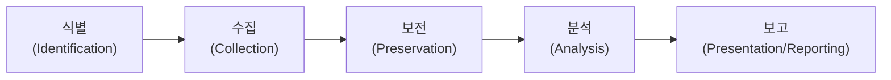

<Callout type="info">
  **이번 문서의 목표:** 이 파일을 다 읽으면 디지털 증거가 왜 다루기 까다로운지, 증거의 무결성을 어떻게 증명하는지, 수집부터 보고까지의 절차와 연계보관성 원칙, 관련 국내 기관의 역할을 설명하고 관련 문항을 풀 수 있게 된다.
</Callout>

## 왜 디지털 포렌식이 필요한가

13~15편에서 정책·접근통제·개인정보보호로 사고를 **예방**하는 관점을 다뤘습니다. 그런데 아무리 예방해도 침해사고나 내부자 부정행위는 발생할 수 있고, 사고가 발생한 뒤에는 "무슨 일이 있었는지"를 재구성하고 필요하면 **법적 증거**로 제출해야 하는 상황이 생깁니다. 이때 필요한 기술이 **디지털 포렌식**(Digital Forensics)입니다.

디지털 증거는 종이 문서 같은 물리적 증거와 성격이 다릅니다. 손에 잡히지 않고(비가시성), 복사해도 원본과 똑같아 보이며(구별 어려움), 클릭 한 번이나 시스템 재부팅만으로도 원본이 손상될 수 있습니다(취약성). 이런 특성 때문에 디지털 증거는 **정해진 절차를 따르지 않으면 법정에서 증거로 인정받지 못할 위험**이 큽니다.

> **쉽게 말하면:** 디지털 포렌식은 "컴퓨터·네트워크에 남은 흔적을, 나중에 법정에서도 인정받을 수 있는 방식으로 찾아내고 보존하고 설명하는 기술"입니다.

## 1. 디지털 증거의 특성

| 특성 | 내용 | 왜 문제가 되는가 |
|------|------|-------------------|
| 비가시성 | 사람이 눈으로 직접 볼 수 없고 도구를 거쳐야 확인 가능 | 도구 자체의 신뢰성도 함께 입증해야 한다 |
| 변조 용이성 | 파일을 열거나 시스템을 재부팅하는 것만으로도 원본 데이터가 바뀔 수 있다 | 조사자의 작업 자체가 증거를 훼손할 위험이 있다 |
| 대량성 | 저장장치 하나에 방대한 데이터가 담겨 있다 | 관련 없는 데이터까지 무분별하게 수집하면 사생활 침해 우려가 있다 |
| 휘발성 | 전원이 꺼지면 사라지는 데이터(메모리 등)와 디스크처럼 남는 데이터가 섞여 있다 | 휘발성이 높은 데이터부터 우선 수집해야 한다(휘발성 순서, Order of Volatility) |
| 원본과 사본의 구별 어려움 | 디지털 데이터는 복사해도 원본과 비트 단위로 동일하다 | "이것이 원본과 같다"는 사실을 별도로 증명(해시값 대조)해야 한다 |

<Callout type="warning">
  **자주 틀리는 점:** 사고 조사에서 흔히 하는 실수가 "일단 시스템을 살펴보자"며 감염 의심 서버를 그대로 재부팅하거나 파일을 열어보는 것입니다. 이는 메모리에만 존재하던 휘발성 데이터(실행 중이던 프로세스, 네트워크 연결 정보)를 영구히 잃게 만들고, 디스크의 파일 접근 시각(타임스탬프)까지 변경시켜 **증거 자체를 훼손**합니다. 휘발성이 높은 데이터부터 순서대로 수집하는 원칙을 지켜야 합니다.
</Callout>

## 2. 무결성 보장 — 원본과 사본이 같다는 것을 증명하기

디지털 증거는 복사가 쉬운 만큼 "이 사본이 최초 압수한 원본과 한 비트도 다르지 않다"는 사실을 객관적으로 증명해야 합니다. 이때 쓰이는 도구가 **해시 함수**(07편에서 다룬 암호학적 해시)입니다.

> **쉽게 말하면:** 원본 저장장치의 해시값과 조사에 사용할 사본의 해시값이 똑같다면, 두 데이터는 완전히 동일하다고 볼 수 있습니다.

- 증거를 확보하는 즉시 원본 저장장치 전체의 해시값(예: SHA-256)을 계산해 기록해 둔다.
- 조사는 원본이 아니라 **비트 단위로 복제한 사본**(이미징, Imaging)에 대해서만 수행한다.
- 조사에 쓰는 사본의 해시값이 최초 기록한 원본의 해시값과 일치하는지 언제든 다시 확인할 수 있어야 한다.
- 원본에 물리적으로 데이터를 쓸 수 없도록 **쓰기 방지 장치**(Write Blocker)를 사용해, 조사 과정에서 원본이 실수로라도 변경되는 것을 막는다.

<Callout type="warning">
  **자주 틀리는 점:** "사본을 만들어 조사했으니 원본은 안전하다"고 안심하기 쉽지만, **사본을 만드는 그 과정 자체**에서 쓰기 방지 장치 없이 원본 장치를 컴퓨터에 연결하면 운영체제가 자동으로 파일 접근 시각을 갱신하는 등 원본이 훼손될 수 있습니다. 이미징(사본 제작) 단계부터 무결성 보호 절차가 필요합니다.
</Callout>

## 3. 증거 수집·보전·분석·보고 절차

디지털 포렌식은 통상 다음 단계를 순서대로 밟습니다. 각 단계에서 남긴 기록이 다음 단계로 이어지는 근거가 되므로, 단계를 건너뛰거나 순서를 바꾸면 이후 단계의 신뢰성 전체가 흔들립니다.

<Steps>

1. **식별(Identification)** — 어떤 장치·데이터가 증거가 될 수 있는지 파악한다. 사고 범위, 관련 시스템·계정을 특정하는 단계다.
2. **수집(Collection)** — 휘발성이 높은 데이터부터 순서대로 수집한다. 메모리 덤프, 네트워크 연결 상태처럼 전원이 꺼지면 사라지는 정보를 먼저 확보하고, 디스크 이미징은 그다음 진행한다. 수집 즉시 해시값을 기록한다.
3. **보전(Preservation)** — 수집한 증거가 이후 훼손·변조되지 않도록 안전하게 보관한다. 쓰기 방지 장치, 봉인, 접근 통제된 보관 장소를 사용한다.
4. **분석(Analysis)** — 보전된 사본을 대상으로 삭제된 파일 복구, 로그 분석, 타임라인 재구성 등을 수행해 사고 경위를 규명한다. 원본이 아니라 사본에 대해서만 분석 작업을 수행한다.
5. **보고(Presentation/Reporting)** — 분석 결과를 재현 가능하고 이해하기 쉬운 형태로 문서화한다. 누가, 언제, 무엇을, 어떻게 조사했는지 기록해 법정에서도 신뢰할 수 있는 보고서를 작성한다.

</Steps>

<Callout type="warning">
  **자주 틀리는 점:** 수집 단계에서 "휘발성이 높은 데이터부터"라는 순서를 "중요한 데이터부터"로 오해하기 쉽습니다. 휘발성 순서는 **데이터가 사라지는 속도**를 기준으로 한 것으로, 일반적으로 메모리·네트워크 연결 상태 같은 정보가 디스크에 저장된 파일보다 먼저 사라지므로 먼저 수집해야 한다는 뜻입니다. 어떤 데이터가 사건 해결에 더 "중요한지"는 별개의 판단입니다.
</Callout>

## 4. 연계보관성(체인오브커스터디)과 법적 요건

### 연계보관성(Chain of Custody)

**연계보관성**(체인오브커스터디, Chain of Custody)은 증거가 최초로 확보된 순간부터 법정에 제출되는 순간까지, **누가, 언제, 어떤 목적으로 그 증거를 소지·이동·보관했는지 끊김 없이 기록**해 두는 원칙입니다. 이 기록에 공백이 생기면 "그 사이에 증거가 조작되지 않았다"고 증명할 방법이 없어져, 증거 능력 자체가 부정될 수 있습니다.

> **비유:** 연계보관성은 택배 운송장과 비슷합니다. 물건이 발송자의 손을 떠난 뒤 수령자에게 도착하기까지 어느 물류센터를 거쳤는지 하나도 빠짐없이 기록되어야, 중간에 물건이 바뀌거나 손상되지 않았다는 것을 추적할 수 있습니다. 연계보관 기록에 빈 구간이 있으면 "그 구간에서 무슨 일이 있었는지 아무도 증명할 수 없다"는 뜻이 됩니다.

연계보관 기록에는 통상 다음 정보가 포함됩니다.

| 기록 항목 | 내용 |
|-----------|------|
| 증거 식별 정보 | 증거물의 종류, 일련번호, 수집 위치 |
| 수집 일시·수집자 | 언제, 누가 최초로 증거를 확보했는지 |
| 이동·인계 기록 | 증거가 누구에게서 누구에게 언제 넘겨졌는지, 매 인계마다 서명 |
| 보관 장소·조건 | 어디에, 어떤 접근통제 아래 보관되었는지 |
| 해시값 | 각 단계에서 무결성을 재확인한 해시값 기록 |

### 법적 요건

디지털 증거를 수사·재판에 활용하려면 다음과 같은 절차적 요건이 함께 요구됩니다.

- **적법한 절차**: 압수수색영장 등 법이 정한 절차에 따라 증거를 확보해야 하며, 절차를 어기면 확보한 증거 자체가 위법하게 수집된 증거로 배제될 수 있다.
- **참여권 보장**: 압수수색 대상자(피의자 등)나 그 변호인에게 참여할 기회를 보장해야 하는 절차가 있다.
- **원본성·동일성 입증**: 법정에 제출하는 사본이 최초 압수한 원본과 동일하다는 것을 해시값 등으로 입증해야 한다.
- **신뢰할 수 있는 절차의 재현 가능성**: 조사자가 사용한 도구·절차를 다른 전문가가 검증했을 때도 같은 결과가 나와야 신뢰성이 인정된다.

<Callout type="warning">
  **자주 틀리는 점:** 연계보관성은 "증거를 잘 보관하자"는 추상적인 다짐이 아니라, **기록의 연속성(공백 없음)** 자체가 핵심입니다. 아무리 증거를 안전한 금고에 보관했더라도 "누가 언제 그 금고를 열었는지"에 대한 기록이 비어 있으면 연계보관성이 깨진 것으로 취급됩니다.
</Callout>

## 5. 국내 관련 기관의 역할 개관

디지털 포렌식은 수사기관과 전문 연구·지원 기관이 역할을 나눠 수행합니다.

| 기관(성격) | 역할 개관 |
|------------|-----------|
| 경찰청 (수사기관) | 각 지방경찰청 산하 디지털포렌식센터를 통해 범죄 수사 관련 디지털 증거 분석을 지원 |
| 대검찰청 (수사기관) | 과학수사부문에서 검찰이 수사하는 사건의 디지털 증거 분석을 담당 |
| 한국인터넷진흥원(KISA) | 침해사고 대응 과정에서 사고 원인 분석·기술 지원을 수행(18편의 침해사고 대응과 연결) |
| 법과학·포렌식 관련 학회·연구기관 | 포렌식 기법 표준화, 도구 검증, 전문 인력 양성에 관여 |

<Callout type="warning">
  **자주 틀리는 점:** 디지털 포렌식은 "특정 도구를 다루는 기술"로만 이해하기 쉽지만, 시험에서 중요한 것은 도구 사용법이 아니라 **왜 이 절차(휘발성 순서 수집, 해시 대조, 연계보관 기록)를 지켜야 법적 증거능력을 인정받는지**에 대한 원리입니다. 절차를 지키지 않으면 기술적으로 옳은 분석이라도 법정에서 증거로 채택되지 않을 수 있습니다.
</Callout>

## 핵심 정리

- 디지털 증거는 **비가시성·변조 용이성·대량성·휘발성**이라는 특성 때문에 절차를 지키지 않으면 훼손되기 쉽고, 원본·사본 구별이 어려워 별도의 무결성 입증이 필요하다.
- **무결성**은 해시값(원본과 사본의 해시값 일치)으로 증명하며, 조사는 원본이 아니라 **쓰기 방지 장치**로 보호된 비트 단위 사본(이미징)에 대해서만 수행한다.
- 절차는 **식별 → 수집(휘발성 순서) → 보전 → 분석 → 보고**의 순서를 따르며, 단계를 건너뛰면 이후 단계의 신뢰성이 흔들린다.
- **연계보관성**(체인오브커스터디)은 증거 확보부터 법정 제출까지 소지·이동·보관 기록에 **공백이 없어야** 한다는 원칙이며, 적법한 절차·참여권 보장·원본성 입증과 함께 법적 증거능력의 요건이 된다.
- 국내에서는 경찰청·대검찰청 등 수사기관과 KISA 같은 지원 기관이 역할을 나눠 디지털 포렌식을 수행한다.

## 마무리 복습

<Quiz
  questionNumber={1}
  question="디지털 증거의 특성에 대한 설명으로 옳지 않은 것은?"
  options={['전원이 꺼지면 사라지는 휘발성 데이터와 디스크에 남는 데이터가 섞여 있다', '복사한 사본이 원본과 비트 단위로 동일해 원본·사본 구별이 어렵다', '종이 문서와 달리 열람·재부팅만으로도 데이터가 변조될 수 있다', '데이터 양이 적어 관련 없는 정보가 섞일 우려는 거의 없다']}
  correctAnswer={4}
  explanation="디지털 저장장치에는 방대한 양의 데이터가 담겨 있어(대량성) 사건과 무관한 데이터까지 수집될 위험이 있으므로 별도의 범위 제한이 필요하다. 데이터 양이 적다는 설명은 옳지 않다."
  optionExplanations={['휘발성에 대한 옳은 설명이다', '원본·사본 구별의 어려움에 대한 옳은 설명이다', '변조 용이성에 대한 옳은 설명이다', '정답 — 디지털 증거는 대량성이 특징이며 데이터 양이 적다는 설명은 틀렸다']}
/>

<Quiz
  questionNumber={2}
  question="디지털 증거의 무결성을 입증하는 방법으로 가장 적절한 것은?"
  options={['조사자가 증거를 육안으로 확인했다는 진술서를 첨부한다', '원본과 사본의 해시값이 일치하는지 대조한다', '증거를 여러 부서에 나눠 보관해 위험을 분산한다', '원본 저장장치를 직접 열람해 내용을 재확인한다']}
  correctAnswer={2}
  explanation="원본과 사본이 완전히 동일하다는 것은 해시 함수로 계산한 해시값의 일치 여부로 객관적으로 입증한다. 이는 07편에서 다룬 암호학적 해시의 특성(입력이 조금만 달라도 출력이 완전히 달라짐)을 이용한 것이다."
  optionExplanations={['육안 확인 진술은 객관적 증명 수단이 아니다', '정답 — 해시값 대조는 원본과 사본의 동일성을 객관적으로 입증하는 방법이다', '보관 위치를 나누는 것은 무결성 입증과 직접 관련이 없다', '원본을 직접 열람하면 접근 시각 등 메타데이터가 변경되어 오히려 원본이 훼손될 위험이 있다']}
/>

<Quiz
  questionNumber={3}
  question="디지털 포렌식 절차의 순서로 옳은 것은?"
  options={['수집 → 식별 → 분석 → 보전 → 보고', '식별 → 수집 → 보전 → 분석 → 보고', '분석 → 식별 → 수집 → 보전 → 보고', '보전 → 식별 → 수집 → 분석 → 보고']}
  correctAnswer={2}
  explanation="디지털 포렌식은 증거가 될 수 있는 대상을 파악하는 식별 단계부터 시작해, 수집, 보전, 분석을 거쳐 마지막으로 결과를 문서화하는 보고 단계로 마무리된다."
  optionExplanations={['식별이 수집보다 먼저 이뤄져야 하므로 순서가 맞지 않는다', '정답 — 식별, 수집, 보전, 분석, 보고 순서가 옳다', '분석은 수집·보전 이후에 이뤄지는 단계이므로 가장 앞에 올 수 없다', '보전은 수집 이후에 이뤄지는 단계이므로 가장 앞에 올 수 없다']}
/>

<Quiz
  questionNumber={4}
  question="침해사고 의심 서버를 발견했을 때의 대응으로 옳지 않은 것은?"
  options={['메모리에 남은 휘발성 정보를 디스크 정보보다 먼저 수집한다', '조사 편의를 위해 서버를 즉시 재부팅한 뒤 파일을 열어 확인한다', '수집 즉시 저장장치의 해시값을 계산해 기록한다', '원본 장치는 쓰기 방지 장치를 사용해 변경되지 않도록 보호한다']}
  correctAnswer={2}
  explanation="서버를 재부팅하면 메모리에만 존재하던 휘발성 데이터가 영구히 사라지고, 파일을 여는 행위 자체가 접근 시각 등 메타데이터를 변경시켜 증거를 훼손한다. 휘발성 순서에 따라 메모리부터 신중하게 수집해야 한다."
  optionExplanations={['휘발성 순서 원칙에 맞는 옳은 대응이다', '정답 — 재부팅과 무분별한 파일 열람은 증거를 훼손하는 잘못된 대응이다', '수집 즉시 해시값을 기록하는 것은 무결성 입증을 위한 옳은 절차다', '쓰기 방지 장치 사용은 원본 훼손을 막는 옳은 절차다']}
/>

<Quiz
  questionNumber={5}
  question="연계보관성(체인오브커스터디)에 대한 설명으로 가장 적절한 것은?"
  options={['증거를 안전한 장소에 보관하기만 하면 별도의 기록은 필요하지 않다', '증거의 확보부터 제출까지 소지·이동·보관 기록에 공백이 없어야 한다는 원칙이다', '증거 분석을 마친 뒤에만 적용되는 사후 관리 절차다', '증거를 이동할 때는 기록 없이 신속하게 처리하는 것이 우선이다']}
  correctAnswer={2}
  explanation="연계보관성은 증거가 최초로 확보된 순간부터 법정 제출까지 누가, 언제, 어떤 목적으로 소지·이동·보관했는지 끊김 없이 기록해야 한다는 원칙이며, 기록에 공백이 생기면 증거능력이 부정될 수 있다."
  optionExplanations={['안전한 보관만으로는 부족하며 소지·이동 기록이 함께 남아야 한다', '정답 — 기록의 연속성(공백 없음)이 연계보관성의 핵심이다', '연계보관성은 증거 확보 시점부터 전 과정에 적용되는 원칙이지 분석 이후에만 적용되지 않는다', '증거 이동 시에도 매 인계마다 기록을 남기는 것이 원칙이며 기록 없는 신속 처리는 연계보관성을 훼손한다']}
/>

<Quiz
  questionNumber={6}
  question="디지털 증거가 법정에서 증거능력을 인정받기 위한 요건으로 옳지 않은 것은?"
  options={['압수수색영장 등 법이 정한 적법한 절차를 따라야 한다', '법정에 제출하는 사본이 원본과 동일하다는 것을 입증해야 한다', '조사자가 사용한 도구·절차가 재현 가능해야 한다', '조사자의 개인적 경험과 직관만으로 결론을 내리면 충분하다']}
  correctAnswer={4}
  explanation="디지털 포렌식 결과는 조사자의 주관적 직관이 아니라, 적법한 절차·원본성 입증·재현 가능한 절차라는 객관적 요건을 갖춰야 법정에서 신뢰할 수 있는 증거로 인정받는다."
  optionExplanations={['적법한 절차 준수는 증거능력 인정의 핵심 요건이다', '원본성·동일성 입증은 증거능력 인정의 핵심 요건이다', '재현 가능성은 다른 전문가의 검증을 가능하게 하는 핵심 요건이다', '정답 — 주관적 직관만으로는 객관적 증거능력을 인정받을 수 없다']}
/>

## 참고 자료

- [국내 디지털 포렌식 관련 수사기관 개요 - 경찰청](https://www.police.go.kr)
- [정보보호 및 개인정보보호 관리체계(ISMS-P) 인증기준 안내서 - KISA](https://www.kisa.or.kr)
