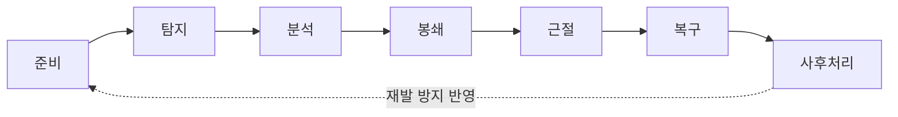

09편에서 악성코드의 개념과 유형을, 16편에서 방화벽·IDS·IPS 같은 예방·탐지 장비를 다뤘다. 아무리 잘 막아도 사고는 발생한다.

## 침해사고란 무엇인가

**침해사고**(security incident, 정보보호 관점에서는 incident와 breach를 구분하기도 하지만 독학사 수준에서는 "보안 목표를 해치는 사건 전반"으로 이해하면 된다)는 정보통신망 또는 정보시스템에 대한 **비인가된 접근**(unauthorized access), 정보의 유출·변조·파괴, 서비스 방해 행위 등을 통칭한다. 01편에서 배운 **CIA**(기밀성 Confidentiality·무결성 Integrity·가용성 Availability) 중 하나라도 실제로 훼손되면 침해사고로 분류된다.

대표적인 유형은 다음과 같다.

- **해킹**(hacking): 시스템 취약점을 악용해 비인가 접근·권한 상승을 시도하는 행위 전반.
- **악성코드 감염**: 웜·트로이목마·랜섬웨어 등에 의한 시스템 오염(09편 참고).
- **서비스 거부 공격**: **DoS**(Denial of Service, 서비스 거부)와 **DDoS**(Distributed DoS, 분산 서비스 거부 — 다수의 좀비 PC로 구성된 봇넷을 이용해 동시에 공격하는 방식)로 시스템 가용성을 마비시키는 공격.
- **정보 유출**: 개인정보·기업 기밀 등이 외부로 반출되는 사고.
- **내부자에 의한 사고**: 권한을 가진 내부자가 고의 또는 과실로 정보를 유출·훼손하는 경우.

## 침해사고 대응 7단계

침해사고 대응은 사고가 발생한 그 순간부터 시작되는 것이 아니다. **준비**(preparation) 단계가 가장 먼저이고, 사고가 끝난 뒤의 **사후처리**(post-incident activity, lessons learned)까지 포함해야 하나의 대응 주기가 완성된다.

목차·자료에 따라 이 절차를 "탐지–분석–조치–복구"의 4단계로 단순화해 표현하기도 하는데, 이때 **조치**는 봉쇄와 근절을 묶은 표현이라고 이해하면 두 체계를 혼동하지 않는다.

| 단순화된 4단계 | 대응 7단계 | 포함 관계 |
|---|---|---|
| 탐지 | 탐지 | 동일 |
| 분석 | 분석 | 동일 |
| 조치 | 봉쇄 + 근절 | 조치 = 확산 차단 + 원인 제거 |
| 복구 | 복구 | 동일 |

(준비와 사후처리는 4단계 표현에서 생략되지만, 실제 사고 대응 체계에서는 반드시 포함되어야 하는 단계라는 점이 시험 함정 포인트다.)

## 보안관제센터와 로그·이벤트 모니터링

**보안관제센터**(SOC, Security Operations Center)는 조직의 정보시스템·네트워크를 실시간으로 모니터링해 이상 징후를 조기에 발견하고 초동 대응하는 조직이다. 여러 장비(방화벽, IDS/IPS, 서버, 애플리케이션)에서 쏟아지는 로그를 사람이 일일이 볼 수 없기 때문에, **SIEM**(Security Information and Event Management, 보안 정보 및 이벤트 관리 — 여러 출처의 로그를 한곳에 모아 상관분석하는 시스템)을 이용해 이벤트를 통합·분석한다.

SIEM의 핵심 기능은 **상관분석**(correlation)이다. 예를 들어 "짧은 시간에 같은 계정으로 여러 번 로그인 실패" 다음에 "성공적인 로그인" 다음에 "평소와 다른 시간대의 대량 데이터 다운로드"가 이어지면, 개별 이벤트는 각각 사소해 보여도 상관분석하면 계정 탈취 후 정보 유출 시나리오로 읽힌다.

## 보고와 커뮤니케이션 체계

침해사고는 내부 **에스컬레이션**(escalation, 사고 심각도에 따라 상위 담당자·경영진에게 단계적으로 보고를 올리는 체계) 절차에 따라 보고되어야 하며, 사고의 성격에 따라 외부 신고 의무가 발생하기도 한다. 국내에서는 정보통신망 이용촉진 및 정보보호 등에 관한 법률에 침해사고 신고와 관련한 규정이 있고, 개인정보가 유출된 경우에는 개인정보 보호법에 따른 별도의 신고·통지 의무가 발생한다(자세한 법령 요건은 21편에서 다룬다).

## 자주 틀리는 점

- **봉쇄와 근절을 혼동한다.** 봉쇄는 "더 퍼지지 않게 막는" 임시 조치이고, 근절은 "원인 자체를 제거하는" 근본 조치다. 감염 시스템을 네트워크에서 분리하는 것은 봉쇄, 악성코드를 삭제하고 취약점을 패치하는 것은 근절이다.
- **준비와 사후처리를 절차에서 빠뜨린다.** 4단계 단순화(탐지–분석–조치–복구)에 익숙해지면 준비·사후처리를 잊기 쉬운데, 실제 대응 체계는 이 두 단계를 포함한 순환 구조라는 점을 기억해야 한다.
- **IDS의 탐지와 SOC의 탐지 단계를 같은 것으로 착각한다.** IDS는 장비, SOC는 그 장비를 포함한 여러 로그를 사람·시스템이 종합 판단하는 조직·체계라는 차이가 있다.
- **복구를 근절보다 먼저 하면 안 된다는 원칙을 놓친다.** 근절이 불완전한 상태에서 서비스를 복구하면 동일한 경로로 재감염될 위험이 크다.

## 핵심 정리

- 침해사고 대응은 **준비 → 탐지 → 분석 → 봉쇄 → 근절 → 복구 → 사후처리**의 7단계로 이루어지며, 사후처리는 다시 준비 단계로 순환한다.
- 실무에서 흔히 쓰는 4단계(탐지–분석–조치–복구)에서 "조치"는 봉쇄와 근절을 합친 표현이다.
- 보안관제센터(SOC)는 SIEM을 통해 여러 로그를 상관분석해 이상 징후를 조기에 발견한다.
- 침해사고 대응은 기술적 조치뿐 아니라 내부 에스컬레이션과 법령에 따른 외부 신고 의무까지 포함한다.

## 마무리 복습

<Quiz
  questionNumber={1}
  question={"침해사고 대응 7단계를 순서대로 바르게 나열한 것은?"}
  options={["탐지 → 준비 → 분석 → 복구 → 봉쇄 → 근절 → 사후처리","준비 → 탐지 → 분석 → 봉쇄 → 근절 → 복구 → 사후처리","준비 → 분석 → 탐지 → 근절 → 봉쇄 → 복구 → 사후처리","탐지 → 분석 → 봉쇄 → 근절 → 복구 → 사후처리 → 준비"]}
  correctAnswer={2}
  explanation={"침해사고 대응은 사고 발생 이전의 준비 단계에서 시작해 탐지, 분석, 확산을 막는 봉쇄, 원인을 제거하는 근절, 정상화하는 복구, 마지막으로 회고와 재발 방지를 다루는 사후처리 순서로 진행된다."}
/>

<Quiz
  questionNumber={2}
  question={"감염된 시스템을 즉시 네트워크에서 분리해 다른 시스템으로 피해가 번지지 않게 하는 조치는 어느 단계에 해당하는가?"}
  options={["탐지","봉쇄","근절","복구"]}
  correctAnswer={2}
  explanation={"네트워크에서 격리하는 조치는 확산을 막는 봉쇄 단계에 해당한다. 악성코드를 삭제하고 취약점을 패치해 원인을 완전히 제거하는 것은 다음 단계인 근절이다."}
/>

<Quiz
  questionNumber={3}
  question={"SIEM의 핵심 기능인 상관분석(correlation)에 대한 설명으로 가장 적절한 것은?"}
  options={["하나의 로그만 단독으로 심층 분석하는 기능이다","여러 출처의 로그를 시간 순서로 엮어 개별로는 드러나지 않는 공격 패턴을 찾아내는 기능이다","백업 데이터를 원본과 비교해 무결성을 검증하는 기능이다","방화벽 규칙을 자동으로 최적화하는 기능이다"]}
  correctAnswer={2}
  explanation={"상관분석은 여러 출처의 로그(로그인 실패, 로그인 성공, 데이터 다운로드 등)를 시간 순서로 엮어, 개별 이벤트로는 보이지 않는 공격 시나리오를 드러내는 SIEM의 핵심 기능이다."}
/>

## 참고 자료

- [국가평생교육진흥원 독학학위제 시험안내](https://bdes.nile.or.kr)
- [KISA 인터넷보호나라&KrCERT](https://www.krcert.or.kr)
