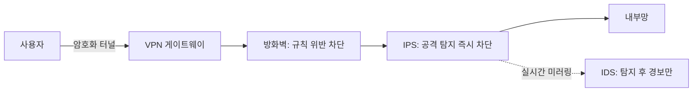

<Callout type="info">
  **이번 문서의 목표:** 이 문서를 다 읽으면 방화벽·IDS·IPS·VPN이 각각 어느 계층에서, 무엇을 막고 무엇을 탐지만 하는지 정확히 구분하고, ARP 스푸핑·VLAN 호핑 같은 라우팅·스위칭 보안 이슈를 설명할 수 있다.
</Callout>

02편에서 정보자산·위협·취약점·통제를 정의했다. 네트워크 보안 장비는 그 통제(control) 중 **기술적 통제**에 속한다. 이 편에서는 시험에 가장 자주 나오는 네 가지 장비 — 방화벽, IDS, IPS, VPN — 를 "어느 계층에서 동작하는가", "패킷을 막는가 탐지만 하는가"라는 두 축으로 정리한다. 독학사 시험은 이 네 장비를 뒤섞어 놓고 "옳지 않은 설명"을 고르라는 문제를 즐겨 낸다. 정의를 낱개로 외우기보다, 아래 표 하나로 통째로 비교해서 기억하는 편이 실전에서 훨씬 강하다.

## 네트워크 계층 구조 다시 보기

> **쉽게 말하면:** 데이터는 응용 계층에서 물리 계층까지 여러 겹으로 포장되어 전송되고, 보안 장비마다 이 포장을 어느 겹까지 뜯어보는지가 다르다.

**OSI**(Open Systems Interconnection, 개방형 시스템 상호연결) 7계층 모델과 실제 인터넷에서 쓰는 **TCP/IP**(Transmission Control Protocol/Internet Protocol) 4계층 모델은 이미 선행 과정에서 배웠을 것이다. 여기서는 보안 장비 설명에 필요한 대응 관계만 짚는다.

| OSI 계층 | 이름 | TCP/IP 대응 | 대표 프로토콜·정보 |
|---|---|---|---|
| 7 | 응용 계층 | 응용 계층 | HTTP, FTP, DNS — 페이로드 내용 |
| 6 | 표현 계층 | 응용 계층 | 인코딩, 암호화(TLS 상위) |
| 5 | 세션 계층 | 응용 계층 | 세션 유지, 인증 |
| 4 | 전송 계층 | 전송 계층 | TCP·UDP 포트 번호, 세그먼트 |
| 3 | 네트워크 계층 | 인터넷 계층 | IP 주소, 라우팅 |
| 2 | 데이터링크 계층 | 네트워크 접속 계층 | MAC 주소, 스위칭, VLAN |
| 1 | 물리 계층 | 네트워크 접속 계층 | 케이블, 신호 |

보안 장비가 "어느 계층까지 들여다보는가"는 곧 "얼마나 정교하게 판단할 수 있는가"와 직결된다. 3~4계층 정보(IP 주소, 포트 번호)만 보는 장비는 빠르지만 단순한 규칙만 세울 수 있고, 7계층(실제 HTTP 요청 내용)까지 들여다보는 장비는 느리지만 정교한 판단이 가능하다.

## 방화벽 — 규칙에 따라 막는다

> **쉽게 말하면:** 방화벽은 정해진 규칙에 맞지 않는 트래픽을 아예 통과시키지 않는 문지기다.

**방화벽**(firewall, 불을 막는 벽에서 따온 이름 — 화재가 번지지 않게 막는 벽처럼 위험한 트래픽이 내부망으로 번지지 않게 막는다)은 미리 정의된 **접근제어 규칙**(access control rule)에 따라 패킷을 통과시키거나 차단하는 장비다. 규칙은 보통 출발지·목적지 IP 주소, 포트 번호, 프로토콜(TCP·UDP)의 조합으로 정의된다.

방화벽은 세대에 따라 들여다보는 깊이가 다르다.

- **패킷 필터링**(packet filtering) 방화벽: 3~4계층 헤더(IP 주소, 포트)만 보고 규칙과 대조한다. 세션의 흐름(같은 연결의 앞뒤 패킷인지)은 신경 쓰지 않는다.
- **상태 기반**(stateful inspection) 방화벽: 4계층까지 보되, 연결의 **상태 테이블**(state table)을 유지해 "이 패킷이 이미 허용된 연결의 응답인가"를 판단한다. 예를 들어 내부에서 외부로 나간 요청의 응답 패킷은 별도 규칙 없이도 자동으로 통과시킨다.
- **차세대 방화벽**(NGFW, Next-Generation Firewall): 7계층까지 들여다봐 애플리케이션 종류(예: 같은 443번 포트라도 유튜브인지 사내 시스템인지)까지 구분하고, 침입 방지 기능(IPS)을 통합하기도 한다.

방화벽의 핵심은 **차단 여부를 스스로 결정한다**는 점이다. 규칙에 걸리면 그 자리에서 패킷을 버리거나(drop) 거부한다(reject).

## IDS — 탐지만 하고 알린다

> **쉽게 말하면:** IDS는 CCTV처럼 수상한 트래픽을 발견하면 경보만 울릴 뿐, 직접 막지는 않는다.

**IDS**(Intrusion Detection System, 침입 탐지 시스템)는 네트워크나 시스템의 트래픽·로그를 분석해 공격 시도로 의심되는 패턴을 발견하면 **경보**(alert)를 발생시키는 장비다. IDS는 트래픽 경로 밖에 두는 경우가 많아(포트 미러링으로 트래픽 사본을 받는 방식) 트래픽을 직접 막을 물리적 위치에 있지 않다. 즉 탐지는 하지만 **차단 권한이 없다**.

탐지 방식은 두 가지로 나뉜다.

- **오용 탐지**(misuse detection, 시그니처 기반): 알려진 공격 패턴(시그니처)과 일치하는 트래픽을 찾는다. 알려진 공격은 정확히 잡아내지만 새로운 공격(제로데이)은 놓친다.
- **이상 탐지**(anomaly detection): 평소 정상 트래픽의 통계적 기준선(baseline)을 만들어 두고, 그 기준을 벗어나는 트래픽을 의심한다. 새로운 공격도 잡을 가능성이 있지만 오탐(false positive, 정상을 공격으로 잘못 판단)이 늘어난다.

설치 위치에 따라 네트워크 전체를 보는 **NIDS**(Network-based IDS)와 특정 호스트의 로그·시스템 콜을 보는 **HIDS**(Host-based IDS)로도 나뉜다.

## IPS — 탐지하고 즉시 막는다

> **쉽게 말하면:** IPS는 IDS의 탐지 능력에 방화벽의 차단 능력을 더한, 네트워크 경로 한가운데 서 있는 장비다.

**IPS**(Intrusion Prevention System, 침입 방지 시스템)는 IDS와 같은 방식으로 공격을 탐지하되, 트래픽 경로 **인라인**(inline, 트래픽이 반드시 거쳐 가는 위치)에 배치되어 공격으로 판단되는 패킷을 그 자리에서 차단할 수 있다. IDS가 "경보만 울리는 CCTV"라면 IPS는 "수상한 사람을 바로 막아서는 경비원"에 가깝다.

인라인 배치의 대가는 있다. IPS가 오탐을 내면 **정상 트래픽까지 차단**되어 서비스 장애로 이어질 수 있다. 그래서 IPS를 도입할 때는 탐지 규칙의 정확도(오탐률)를 특히 신경 써야 한다. 반면 IDS는 오탐이 나도 경보만 발생할 뿐 서비스에는 영향이 없다.

## VPN — 통신 구간을 암호화한다

> **쉽게 말하면:** VPN은 공용망(인터넷) 위에 눈에 보이지 않는 전용 터널을 뚫어, 그 안을 지나가는 데이터를 암호화한다.

**VPN**(Virtual Private Network, 가상 사설망)은 공중망을 거치는 통신 구간을 암호화된 **터널**(tunnel)로 감싸 기밀성과 무결성을 보장하는 기술이다. 방화벽·IDS·IPS가 "무엇을 통과시킬지 판단"하는 장비라면, VPN은 애초에 "통과하는 내용을 아무도 못 읽게 만드는" 장비라는 점에서 목적 자체가 다르다.

VPN은 동작 계층에 따라 크게 두 방식으로 나뉜다.

- **IPsec VPN**(IP security): 네트워크 계층(3계층)에서 IP 패킷 자체를 암호화·인증한다. 사이트 간(지사-본사) 전용선을 대체하는 용도로 많이 쓴다.
- **SSL/TLS VPN**: 전송 계층 위(응용 계층에 가까운 위치)에서 동작하며, 웹 브라우저만으로 접속할 수 있어 재택근무 등 개별 사용자 원격 접속에 많이 쓴다.

VPN은 방화벽처럼 능동적으로 트래픽을 막지는 않는다(암호화된 터널 안의 내용이 정상인지 비정상인지 VPN 자체는 판단하지 않는다). 그래서 실무에서는 방화벽·IPS와 VPN을 함께 배치해, VPN으로 구간을 보호하고 방화벽·IPS로 트래픽 내용을 검사하는 이중 방어를 구성한다.

## 네 장비 한눈에 비교

시험에서 가장 자주 틀리는 지점이 바로 이 표다. "차단 여부", "탐지 여부", "동작 계층" 세 축으로 외우자.

| 장비 | 차단하는가 | 탐지만 하는가 | 주요 동작 계층 | 배치 위치 |
|---|---|---|---|---|
| 방화벽 | 그렇다(규칙 위반 시 차단) | 아니다 | 3–4계층(NGFW는 7계층까지) | 인라인(경로상) |
| IDS | 아니다 | 그렇다(경보만) | 3–7계층(정책에 따라) | 아웃오브패스(경로 밖, 미러링) |
| IPS | 그렇다(탐지 즉시 차단) | 탐지 후 조치하므로 둘 다 수행 | 3–7계층 | 인라인(경로상) |
| VPN | 트래픽 허용 여부 판단은 아니다(구간 암호화) | 아니다(암호화가 목적) | 3계층(IPsec) 또는 응용에 가까운 계층(SSL/TLS) | 통신 구간 양 끝(터널 종단) |

이 그림에서 IDS가 트래픽 경로에서 벗어나(점선) 사본만 받는다는 점, IPS는 경로 위(실선)에 그대로 있어 직접 차단한다는 점을 눈으로 확인해 두자.

## 라우팅·스위칭 관련 보안 이슈

> **쉽게 말하면:** 3계층 라우팅과 2계층 스위칭에도 각각 고유한 취약점이 있고, IP 주소·MAC 주소 체계를 속이는 공격이 대표적이다.

- **ARP 스푸핑**(ARP spoofing): **ARP**(Address Resolution Protocol, 주소 결정 프로토콜 — IP 주소를 물리적인 MAC 주소로 변환해 주는 2계층 프로토콜)는 인증 절차가 없다. 공격자가 위조된 ARP 응답을 보내 "내 MAC 주소가 게이트웨이의 IP 주소다"라고 속이면, 다른 호스트들이 보내는 트래픽이 공격자를 거쳐 가게 되어 도청(스니핑, sniffing)이 가능해진다. 이를 **ARP 캐시 포이즈닝**(ARP cache poisoning)이라고도 한다.
- **MAC 플러딩**(MAC flooding): 스위치는 **MAC 주소 테이블**(어느 포트에 어떤 MAC 주소가 연결되어 있는지 기록한 표)을 보고 프레임을 해당 포트로만 전달한다. 공격자가 위조된 MAC 주소를 대량으로 보내 이 표를 가득 채우면, 스위치는 표를 더 채울 수 없어 모든 포트로 프레임을 뿌리는(플러딩, flooding) 허브처럼 동작하게 되고, 공격자는 이 상태를 이용해 다른 사람의 트래픽을 엿볼 수 있다.
- **VLAN 호핑**(VLAN hopping): **VLAN**(Virtual LAN, 가상 근거리 통신망 — 물리적으로 같은 스위치에 연결되어 있어도 논리적으로 방을 나누듯 통신 범위를 분리하는 기술)으로 분리된 구간을 공격자가 프레임 태그를 조작해 넘어가는 공격이다. 스위치포트를 트렁크 포트처럼 위장시키는 방식이 대표적이다.
- **라우팅 프로토콜 공격**: 라우터끼리 경로 정보를 주고받는 라우팅 프로토콜(예: OSPF, BGP)에 인증이 없거나 약하면, 공격자가 조작된 경로 정보를 흘려 트래픽을 원치 않는 경로로 우회시킬 수 있다(라우팅 테이블 오염, BGP 하이재킹 등).

이런 2·3계층 공격은 방화벽·IPS가 3계층 이상을 검사하는 장비이기 때문에 놓치기 쉽다. 그래서 스위치 자체의 보안 기능(포트 보안, DHCP 스누핑, Dynamic ARP Inspection 등)으로 별도 방어해야 한다는 점이 시험 포인트다.

## 자주 틀리는 점

- IDS와 IPS를 "탐지 방식이 다르다"로 착각하는 경우가 많다. 실제로는 탐지 **방식**(시그니처·이상 탐지)은 같을 수 있고, 차이는 **배치 위치와 차단 권한**에 있다.
- 방화벽이 애플리케이션 내용(예: SQL 인젝션 페이로드)까지 항상 막아 준다고 착각하기 쉽다. 전통적인 패킷 필터링·상태 기반 방화벽은 3–4계층만 보므로 이런 공격은 막지 못하며, 이는 웹 애플리케이션 방화벽(WAF)이나 NGFW·IPS의 역할이다.
- VPN이 "안전한 접속"을 보장한다고 해서 접속 이후 트래픽 내용까지 검사해 준다고 착각한다. VPN은 구간 암호화일 뿐, 내용 검사는 방화벽·IPS의 몫이다.
- ARP 스푸핑을 IP 주소를 속이는 공격으로 착각하기 쉬운데, ARP는 IP를 MAC 주소로 바꾸는 2계층 프로토콜이므로 실제로 속이는 것은 **MAC 주소 매핑**이다.

## 핵심 정리

- 방화벽은 규칙 기반으로 **차단**하고, IDS는 **탐지·경보만** 하며, IPS는 인라인에서 탐지 즉시 **차단**한다. VPN은 차단·탐지가 아니라 통신 구간을 **암호화**하는 것이 목적이다.
- 동작 계층은 방화벽(3–4계층, NGFW는 7계층), IDS·IPS(3–7계층), VPN(IPsec은 3계층, SSL/TLS는 응용에 가까운 계층)로 정리한다.
- IDS는 아웃오브패스(경로 밖)에서 트래픽 사본을 분석하고, IPS는 인라인(경로 위)에서 직접 트래픽을 처리한다.
- 라우팅·스위칭 계층에는 방화벽·IPS가 놓치기 쉬운 ARP 스푸핑, MAC 플러딩, VLAN 호핑, 라우팅 프로토콜 공격 같은 고유 취약점이 있다.

## 마무리 복습

<Quiz
  questionNumber={1}
  question="다음 중 트래픽을 직접 차단할 수 있는 장비로 옳게 짝지어진 것은?"
  options={['IDS와 VPN', '방화벽과 IPS', 'IDS와 IPS', '방화벽과 VPN']}
  correctAnswer={2}
  explanation="방화벽은 규칙 위반 트래픽을 차단하고, IPS는 인라인 배치로 탐지 즉시 차단한다. IDS는 경보만 발생시키고, VPN은 구간 암호화가 목적이라 차단 기능이 없다."
  optionExplanations={['IDS는 차단 권한이 없고 VPN은 암호화가 목적이라 둘 다 차단 기능이 없다.', '정답이다. 방화벽과 IPS 모두 트래픽을 직접 차단할 수 있는 장비다.', 'IDS는 경보만 울릴 뿐 차단하지 못한다.', 'VPN은 차단 기능이 없는 암호화 기술이다.']}
/>

<Quiz
  questionNumber={2}
  question="IDS와 IPS의 가장 근본적인 차이로 옳은 것은?"
  options={['IDS만 시그니처 기반 탐지를 사용한다', 'IPS는 인라인에 배치되어 직접 차단할 수 있지만 IDS는 경로 밖에서 탐지·경보만 한다', 'IDS는 네트워크 계층만, IPS는 응용 계층만 검사한다', 'IPS는 암호화 통신을 생성하고 IDS는 생성하지 않는다']}
  correctAnswer={2}
  explanation="IDS와 IPS의 핵심 차이는 탐지 알고리즘이 아니라 배치 위치와 차단 권한에 있다. IPS는 트래픽 경로 위(인라인)에 놓여 직접 차단하고, IDS는 경로 밖에서 사본을 분석해 경보만 발생시킨다."
  optionExplanations={['시그니처 기반 탐지는 IDS와 IPS 모두 사용할 수 있는 방식이다.', '정답이다. 배치 위치(인라인 대 아웃오브패스)와 차단 권한 여부가 핵심 차이다.', '두 장비 모두 정책에 따라 3계층부터 7계층까지 검사할 수 있다.', '암호화 통신 생성은 VPN의 역할이며 IDS·IPS와는 무관하다.']}
/>

<Quiz
  questionNumber={3}
  question="다음 중 옳지 않은 설명은?"
  options={['상태 기반 방화벽은 연결 상태 테이블을 유지해 응답 패킷을 자동으로 허용할 수 있다', 'NGFW는 애플리케이션 종류까지 구분해 7계층 기준으로 정책을 적용할 수 있다', 'IPsec VPN은 응용 계층에서 동작하며 브라우저만으로 접속할 수 있다', '패킷 필터링 방화벽은 세션의 흐름을 고려하지 않고 개별 패킷의 헤더만 본다']}
  correctAnswer={3}
  explanation="IPsec VPN은 네트워크 계층(3계층)에서 IP 패킷 자체를 암호화하는 방식이며, 브라우저만으로 접속 가능한 것은 SSL/TLS VPN의 특징이다. 나머지 세 설명은 모두 옳다."
  optionExplanations={['옳은 설명이다. 상태 기반 방화벽의 정의 그대로다.', '옳은 설명이다. NGFW는 애플리케이션 인식 기능을 갖춘 차세대 방화벽이다.', '정답이다. 이 설명은 SSL/TLS VPN에 해당하며 IPsec VPN은 네트워크 계층에서 동작한다.', '옳은 설명이다. 패킷 필터링 방화벽은 상태를 추적하지 않는다.']}
/>

<Quiz
  questionNumber={4}
  question="스위치의 MAC 주소 테이블을 위조된 주소로 가득 채워 스위치를 허브처럼 동작하게 만드는 공격은?"
  options={['ARP 스푸핑', 'MAC 플러딩', 'VLAN 호핑', 'BGP 하이재킹']}
  correctAnswer={2}
  explanation="MAC 플러딩은 위조된 MAC 주소를 대량으로 보내 스위치의 MAC 주소 테이블 용량을 초과시켜, 스위치가 모든 포트로 프레임을 뿌리게(플러딩) 만드는 공격이다. 이 상태에서 공격자는 다른 사람의 트래픽을 도청할 수 있다."
  optionExplanations={['ARP 스푸핑은 IP-MAC 매핑을 속이는 공격으로 MAC 주소 테이블 자체를 채우는 것과는 다르다.', '정답이다. MAC 주소 테이블을 가득 채워 스위치를 허브처럼 동작시키는 공격이다.', 'VLAN 호핑은 태그 조작으로 다른 VLAN 구간에 접근하는 공격이다.', 'BGP 하이재킹은 라우팅 프로토콜 정보를 조작해 트래픽 경로를 바꾸는 공격이다.']}
/>

<Quiz
  questionNumber={5}
  question="ARP 스푸핑이 가능한 근본적인 이유로 가장 적절한 것은?"
  options={['ARP 프로토콜에 암호화 기능이 있기 때문이다', 'ARP 응답에 대한 인증 절차가 없기 때문이다', 'ARP가 응용 계층 프로토콜이기 때문이다', 'ARP가 라우팅 테이블을 직접 수정하기 때문이다']}
  correctAnswer={2}
  explanation="ARP는 IP 주소를 MAC 주소로 변환하는 2계층 프로토콜인데, 응답의 진위를 확인하는 인증 절차가 없다. 이 때문에 공격자가 위조된 ARP 응답을 보내도 다른 호스트는 그대로 캐시에 저장해 버려 스푸핑이 성립한다."
  optionExplanations={['ARP는 암호화 기능이 없는 평문 프로토콜이다.', '정답이다. 인증 절차 부재가 ARP 스푸핑이 가능한 근본 원인이다.', 'ARP는 2계층(데이터링크 계층) 프로토콜이다.', 'ARP는 라우팅 테이블이 아니라 IP-MAC 매핑 캐시(ARP 테이블)에 영향을 준다.']}
/>

<Quiz
  questionNumber={6}
  question="VPN에 대한 설명으로 옳지 않은 것은?"
  options={['VPN은 공중망 위에 암호화된 통신 구간을 형성한다', 'VPN은 방화벽처럼 트래픽 내용을 검사해 공격 여부를 판단한다', 'SSL/TLS VPN은 개별 사용자의 원격 접속에 많이 쓰인다', 'IPsec VPN은 사이트 간 전용선을 대체하는 용도로 많이 쓰인다']}
  correctAnswer={2}
  explanation="VPN의 목적은 통신 구간의 기밀성·무결성을 지키는 암호화이지, 트래픽 내용을 검사해 공격 여부를 판단하는 것이 아니다. 그 역할은 방화벽·IPS·WAF가 담당한다."
  optionExplanations={['옳은 설명이다. VPN의 기본 정의다.', '정답이다. VPN은 암호화가 목적이며 내용 검사·공격 판단 기능은 없다.', '옳은 설명이다. SSL/TLS VPN은 브라우저 기반 원격 접속에 적합하다.', '옳은 설명이다. IPsec VPN은 사이트 간 연결에 흔히 쓰인다.']}
/>

## 참고 자료

- [국가평생교육진흥원 독학학위제 시험안내](https://bdes.nile.or.kr)
- [NIST Computer Security Resource Center](https://csrc.nist.gov)
- [RFC Editor](https://www.rfc-editor.org)
