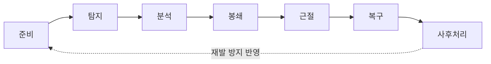

<Callout type="info">
  **이번 문서의 목표:** 이 문서를 다 읽으면 침해사고를 유형별로 구분하고, 준비–탐지–분석–봉쇄–근절–복구–사후처리로 이어지는 대응 절차를 순서대로 설명하며, 보안관제센터가 어떤 역할을 하는지 말할 수 있다.
</Callout>

10편에서 악성코드의 개념과 유형을, 17편에서 방화벽·IDS·IPS 같은 예방·탐지 장비를 다뤘다. 아무리 잘 막아도 사고는 발생한다. 이 편은 "사고가 이미 터진 다음" 조직이 어떻게 움직여야 하는지를 다룬다. 독학사 시험은 이 단계들을 순서를 뒤섞어 제시하고 올바른 순서를 고르게 하거나, 각 단계에서 하는 일을 서로 바꿔치기한 오답을 즐겨 낸다.

## 침해사고란 무엇인가

> **쉽게 말하면:** 침해사고는 정보자산의 기밀성·무결성·가용성 중 하나 이상이 실제로 훼손되었거나 훼손될 뻔한 사건이다.

**침해사고**(security incident, 정보보호 관점에서는 incident와 breach를 구분하기도 하지만 독학사 수준에서는 "보안 목표를 해치는 사건 전반"으로 이해하면 된다)는 정보통신망 또는 정보시스템에 대한 **비인가된 접근**(unauthorized access), 정보의 유출·변조·파괴, 서비스 방해 행위 등을 통칭한다. 02편에서 배운 **CIA**(기밀성 Confidentiality·무결성 Integrity·가용성 Availability) 중 하나라도 실제로 훼손되면 침해사고로 분류된다.

대표적인 유형은 다음과 같다.

- **해킹**(hacking): 시스템 취약점을 악용해 비인가 접근·권한 상승을 시도하는 행위 전반.
- **악성코드 감염**: 웜·트로이목마·랜섬웨어 등에 의한 시스템 오염(10편 참고).
- **서비스 거부 공격**: **DoS**(Denial of Service, 서비스 거부)와 **DDoS**(Distributed DoS, 분산 서비스 거부 — 다수의 좀비 PC로 구성된 봇넷을 이용해 동시에 공격하는 방식)로 시스템 가용성을 마비시키는 공격.
- **정보 유출**: 개인정보·기업 기밀 등이 외부로 반출되는 사고.
- **내부자에 의한 사고**: 권한을 가진 내부자가 고의 또는 과실로 정보를 유출·훼손하는 경우.

## 침해사고 대응 7단계

> **쉽게 말하면:** 사고가 터지고 나서 움직이는 게 아니라, 평소 준비해 둔 절차대로 탐지 → 분석 → 확산 차단 → 원인 제거 → 정상화 → 재발 방지까지 순서대로 밟는다.

침해사고 대응은 사고가 발생한 그 순간부터 시작되는 것이 아니다. **준비**(preparation) 단계가 가장 먼저이고, 사고가 끝난 뒤의 **사후처리**(post-incident activity, lessons learned)까지 포함해야 하나의 대응 주기가 완성된다. 시험에서는 이 순서를 통째로 물어보므로 단계별로 무엇을 하는지 정확히 구분해 두어야 한다.

<Steps>

### 준비

사고가 발생하기 **전에** 대응 체계를 갖추는 단계다. 대응 조직(CERT, Computer Emergency Response Team)을 구성하고, 연락체계·에스컬레이션 절차를 정의하며, 로그 수집 체계와 백업 체계를 미리 구축한다. 이 단계의 완성도가 이후 모든 단계의 속도를 좌우한다.

### 탐지

IDS·IPS·SIEM(보안 이벤트를 통합 관제하는 시스템, 아래에서 설명)의 경보, 사용자 신고, 이상 로그 등을 통해 "사고가 발생했을 가능성"을 인지하는 단계다. 이 단계의 목표는 원인 규명이 아니라 **빠른 인지**다.

### 분석

탐지된 이벤트가 실제 사고인지(오탐이 아닌지), 사고라면 **범위**(어떤 시스템이 얼마나 영향을 받았는지)와 **원인**(어떤 취약점·경로로 발생했는지)을 파악하는 단계다. 로그 분석, 포렌식 이미지 확보(16편 참고)가 이 단계에서 이루어진다.

### 봉쇄

피해가 더 퍼지지 않도록 **확산을 막는** 단계다. 감염된 시스템을 네트워크에서 격리하거나, 공격에 이용된 계정을 잠그거나, 공격 출발지 IP를 방화벽에서 차단하는 조치가 여기 속한다. 이 단계에서는 아직 원인을 완전히 제거하지 않고 "더 커지지 않게" 하는 데 집중한다.

### 근절

봉쇄로 확산을 막은 뒤, 사고의 **근본 원인을 제거**하는 단계다. 악성코드를 완전히 삭제하고, 공격에 악용된 취약점에 패치를 적용하며, 공격자가 남긴 백도어·계정을 제거한다. 근절이 불완전하면 같은 경로로 재감염될 수 있다.

### 복구

시스템을 정상 운영 상태로 되돌리는 단계다. 백업으로부터 데이터를 복원하고, 시스템을 재기동하며, 정상 동작 여부를 검증한 뒤 서비스를 재개한다. 복구를 서두르다 근절이 덜 된 상태로 서비스를 재개하면 재발로 이어지므로, 근절 확인 후 복구하는 순서가 중요하다.

### 사후처리

사고 대응이 끝난 뒤 **보고서를 작성**하고, 무엇이 잘 작동했고 무엇이 부족했는지 회고(lessons learned)하며, 재발 방지 대책을 준비 단계에 반영한다. 이 단계를 거쳐야 다음 사고의 준비 단계가 더 튼튼해지므로, 대응 주기는 사후처리에서 다시 준비로 이어지는 **순환 구조**를 이룬다.

</Steps>

목차·자료에 따라 이 절차를 "탐지–분석–조치–복구"의 4단계로 단순화해 표현하기도 하는데, 이때 **조치**는 봉쇄와 근절을 묶은 표현이라고 이해하면 두 체계를 혼동하지 않는다.

| 단순화된 4단계 | 대응 7단계 | 포함 관계 |
|---|---|---|
| 탐지 | 탐지 | 동일 |
| 분석 | 분석 | 동일 |
| 조치 | 봉쇄 + 근절 | 조치 = 확산 차단 + 원인 제거 |
| 복구 | 복구 | 동일 |

(준비와 사후처리는 4단계 표현에서 생략되지만, 실제 사고 대응 체계에서는 반드시 포함되어야 하는 단계라는 점이 시험 함정 포인트다.)

## 보안관제센터와 로그·이벤트 모니터링

> **쉽게 말하면:** 보안관제센터는 사고가 나기 전부터 24시간 트래픽과 로그를 지켜보는 상시 감시 조직이다.

**보안관제센터**(SOC, Security Operations Center)는 조직의 정보시스템·네트워크를 실시간으로 모니터링해 이상 징후를 조기에 발견하고 초동 대응하는 조직이다. 여러 장비(방화벽, IDS/IPS, 서버, 애플리케이션)에서 쏟아지는 로그를 사람이 일일이 볼 수 없기 때문에, **SIEM**(Security Information and Event Management, 보안 정보 및 이벤트 관리 — 여러 출처의 로그를 한곳에 모아 상관분석하는 시스템)을 이용해 이벤트를 통합·분석한다.

SIEM의 핵심 기능은 **상관분석**(correlation)이다. 개별 로그 하나는 정상처럼 보여도, 여러 로그를 시간 순서로 엮으면 공격 패턴이 드러나는 경우가 많다. 예를 들어 "짧은 시간에 같은 계정으로 여러 번 로그인 실패" 다음에 "성공적인 로그인" 다음에 "평소와 다른 시간대의 대량 데이터 다운로드"가 이어지면, 개별 이벤트는 각각 사소해 보여도 상관분석하면 계정 탈취 후 정보 유출 시나리오로 읽힌다.

## 보고와 커뮤니케이션 체계

> **쉽게 말하면:** 사고는 발견한 사람만 알아서는 안 되고, 정해진 체계를 따라 위로 보고되고 필요하면 외부 기관에도 신고되어야 한다.

침해사고는 내부 **에스컬레이션**(escalation, 사고 심각도에 따라 상위 담당자·경영진에게 단계적으로 보고를 올리는 체계) 절차에 따라 보고되어야 하며, 사고의 성격에 따라 외부 신고 의무가 발생하기도 한다. 국내에서는 정보통신망 이용촉진 및 정보보호 등에 관한 법률에 침해사고 신고와 관련한 규정이 있고, 개인정보가 유출된 경우에는 개인정보 보호법에 따른 별도의 신고·통지 의무가 발생한다(자세한 법령 요건은 22편에서 다룬다). 이 편에서 기억할 것은 "침해사고 대응은 기술적 조치로 끝나지 않고, 법적 신고 의무·이해관계자 커뮤니케이션까지 포함한다"는 점이다.

## 자주 틀리는 점

- **봉쇄와 근절을 혼동한다.** 봉쇄는 "더 퍼지지 않게 막는" 임시 조치이고, 근절은 "원인 자체를 제거하는" 근본 조치다. 감염 시스템을 네트워크에서 분리하는 것은 봉쇄, 악성코드를 삭제하고 취약점을 패치하는 것은 근절이다.
- **준비와 사후처리를 절차에서 빠뜨린다.** 4단계 단순화(탐지–분석–조치–복구)에 익숙해지면 준비·사후처리를 잊기 쉬운데, 실제 대응 체계는 이 두 단계를 포함한 순환 구조라는 점을 기억해야 한다.
- **IDS의 탐지와 SOC의 탐지 단계를 같은 것으로 착각한다.** IDS는 장비, SOC는 그 장비를 포함한 여러 로그를 사람·시스템이 종합 판단하는 조직·체계라는 차이가 있다.
- **복구를 근절보다 먼저 하면 안 된다는 원칙을 놓친다.** 근절이 불완전한 상태에서 서비스를 복구하면 동일한 경로로 재감염될 위험이 크다.

## 핵심 정리

- 침해사고 대응은 **준비 → 탐지 → 분석 → 봉쇄 → 근절 → 복구 → 사후처리**의 7단계로 이루어지며, 사후처리는 다시 준비 단계로 순환한다.
- 실무에서 흔히 쓰는 4단계(탐지–분석–조치–복구)에서 "조치"는 봉쇄와 근절을 합친 표현이다.
- 보안관제센터(SOC)는 SIEM을 통해 여러 로그를 상관분석해 이상 징후를 조기에 발견한다.
- 침해사고 대응은 기술적 조치뿐 아니라 내부 에스컬레이션과 법령에 따른 외부 신고 의무까지 포함한다.

## 마무리 복습

<Quiz
  questionNumber={1}
  question="침해사고 대응 7단계를 순서대로 바르게 나열한 것은?"
  options={['탐지 → 준비 → 분석 → 복구 → 봉쇄 → 근절 → 사후처리', '준비 → 탐지 → 분석 → 봉쇄 → 근절 → 복구 → 사후처리', '준비 → 분석 → 탐지 → 근절 → 봉쇄 → 복구 → 사후처리', '탐지 → 분석 → 봉쇄 → 근절 → 복구 → 사후처리 → 준비']}
  correctAnswer={2}
  explanation="침해사고 대응은 사고 발생 이전의 준비 단계에서 시작해 탐지, 분석, 확산을 막는 봉쇄, 원인을 제거하는 근절, 정상화하는 복구, 마지막으로 회고와 재발 방지를 다루는 사후처리 순서로 진행된다."
  optionExplanations={['준비 단계가 탐지보다 먼저 와야 하므로 순서가 틀렸다.', '정답이다. 준비-탐지-분석-봉쇄-근절-복구-사후처리 순서다.', '탐지가 분석보다 먼저, 봉쇄가 근절보다 먼저 와야 하므로 순서가 틀렸다.', '준비 단계는 사고 대응 이전에 이루어져야 하므로 마지막에 오면 안 된다.']}
/>

<Quiz
  questionNumber={2}
  question="감염된 시스템을 즉시 네트워크에서 분리해 다른 시스템으로 피해가 번지지 않게 하는 조치는 어느 단계에 해당하는가?"
  options={['탐지', '봉쇄', '근절', '복구']}
  correctAnswer={2}
  explanation="네트워크에서 격리하는 조치는 확산을 막는 봉쇄 단계에 해당한다. 악성코드를 삭제하고 취약점을 패치해 원인을 완전히 제거하는 것은 다음 단계인 근절이다."
  optionExplanations={['탐지는 사고 발생 가능성을 인지하는 단계일 뿐 격리 조치를 하지는 않는다.', '정답이다. 확산을 막는 격리 조치는 봉쇄 단계의 대표적인 활동이다.', '근절은 원인 자체(악성코드, 취약점, 백도어)를 제거하는 단계로 격리와는 구분된다.', '복구는 정상 상태로 되돌리는 단계로, 격리보다 뒤에 온다.']}
/>

<Quiz
  questionNumber={3}
  question="SIEM의 핵심 기능인 상관분석(correlation)에 대한 설명으로 가장 적절한 것은?"
  options={['하나의 로그만 단독으로 심층 분석하는 기능이다', '여러 출처의 로그를 시간 순서로 엮어 개별로는 드러나지 않는 공격 패턴을 찾아내는 기능이다', '백업 데이터를 원본과 비교해 무결성을 검증하는 기능이다', '방화벽 규칙을 자동으로 최적화하는 기능이다']}
  correctAnswer={2}
  explanation="상관분석은 여러 출처의 로그(로그인 실패, 로그인 성공, 데이터 다운로드 등)를 시간 순서로 엮어, 개별 이벤트로는 보이지 않는 공격 시나리오를 드러내는 SIEM의 핵심 기능이다."
  optionExplanations={['상관분석은 단일 로그가 아니라 여러 출처의 로그를 종합해서 보는 기능이다.', '정답이다. 여러 로그를 엮어 공격 패턴을 드러내는 것이 상관분석이다.', '이는 무결성 검증에 대한 설명으로 상관분석과는 다르다.', '방화벽 규칙 최적화는 SIEM의 상관분석 기능과 무관하다.']}
/>

<Quiz
  questionNumber={4}
  question="침해사고 대응 절차에서 '준비' 단계에 해당하지 않는 것은?"
  options={['침해사고 대응 조직(CERT) 구성', '로그 수집 체계와 백업 체계 사전 구축', '연락체계·에스컬레이션 절차 정의', '공격에 사용된 계정을 잠그고 IP를 차단']}
  correctAnswer={4}
  explanation="공격에 사용된 계정을 잠그거나 공격 IP를 차단하는 것은 사고가 발생한 이후 확산을 막는 봉쇄 단계의 활동이다. 준비 단계는 사고 발생 이전에 대응 체계를 갖추는 것이 목적이다."
  optionExplanations={['CERT 구성은 사고 발생 전에 이루어지는 준비 단계 활동이다.', '로그·백업 체계 구축도 사전에 이루어지는 준비 단계 활동이다.', '연락체계 정의도 사고 발생 전 준비 단계에 포함된다.', '정답이다. 이는 사고 발생 이후의 봉쇄 단계 활동이다.']}
/>

<Quiz
  questionNumber={5}
  question="사후처리(post-incident activity) 단계의 목적으로 가장 적절한 것은?"
  options={['시스템을 정상 상태로 재기동해 서비스를 재개한다', '사고의 근본 원인이 되는 악성코드와 취약점을 제거한다', '사고 대응 과정을 회고해 재발 방지 대책을 준비 단계에 반영한다', '탐지 장비의 경보 규칙을 처음으로 설정한다']}
  correctAnswer={3}
  explanation="사후처리는 사고 대응이 끝난 뒤 보고서를 작성하고 잘된 점과 부족했던 점을 회고해, 그 결과를 다시 준비 단계에 반영함으로써 대응 체계를 개선하는 단계다."
  optionExplanations={['이는 복구 단계의 목적이다.', '이는 근절 단계의 목적이다.', '정답이다. 회고와 재발 방지 대책 반영이 사후처리의 목적이다.', '경보 규칙을 처음 설정하는 것은 준비 단계의 활동이다.']}
/>

<Quiz
  questionNumber={6}
  question="침해사고 대응에 대한 설명으로 옳지 않은 것은?"
  options={['DDoS는 다수의 좀비 PC로 구성된 봇넷을 이용해 가용성을 마비시키는 공격이다', '보안관제센터는 여러 로그를 SIEM으로 통합·상관분석해 이상 징후를 조기에 발견한다', '근절이 불완전한 상태에서 먼저 복구를 진행해도 재발 위험에는 차이가 없다', '개인정보가 유출된 사고는 개인정보 보호법에 따른 별도의 신고·통지 의무가 발생할 수 있다']}
  correctAnswer={3}
  explanation="근절이 불완전한 상태에서 복구를 서두르면 동일한 경로로 재감염될 위험이 커진다. 따라서 근절을 확인한 뒤 복구하는 순서가 중요하며, '차이가 없다'는 설명은 옳지 않다."
  optionExplanations={['옳은 설명이다. DDoS의 정의 그대로다.', '옳은 설명이다. SOC와 SIEM의 역할에 대한 정확한 설명이다.', '정답이다. 근절이 불완전하면 재발 위험이 커지므로 옳지 않은 설명이다.', '옳은 설명이다. 개인정보 유출 시 법령에 따른 별도 신고 의무가 발생할 수 있다.']}
/>

## 참고 자료

- [국가평생교육진흥원 독학학위제 시험안내](https://bdes.nile.or.kr)
- [KISA 인터넷보호나라&KrCERT](https://www.krcert.or.kr)
