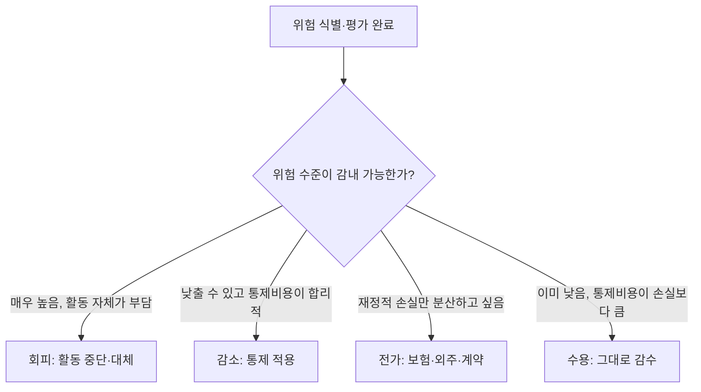

<Callout type="info">
  **이번 문서의 목표:** 이 문서를 다 읽으면 위험을 자산·위협·취약점의 관계로 설명하고, ALE(연간예상손실)를 실제 숫자로 계산하며, 위험 대응 4전략(회피·전가·감소·수용) 중 어느 것이 어떤 상황에 맞는지 판단할 수 있다.
</Callout>

02편에서 정보자산·위협·취약점·위험을 정의했다. 이 편은 그 네 개념을 **수치화하고 의사결정에 연결**하는 방법을 다룬다. "위험이 크다"는 말만으로는 예산을 어디에 쓸지 정할 수 없다. 정보보호 관리 담당자는 위험을 측정 가능한 형태로 바꾸고, 그 크기에 따라 회피·전가·감소·수용 중 하나를 선택해야 한다. 독학사 시험은 이 계산 공식과 전략 선택 논리를 실제 수치·시나리오로 묻는 경우가 많으므로, 정의 암기보다 계산과 사례 적용에 집중한다.

## 위험은 어떻게 만들어지는가

> **쉽게 말하면:** 값진 자산이 있고, 그걸 노리는 위협이 있고, 방어에 구멍(취약점)이 있을 때만 위험이 실제로 커진다.

**위험**(risk)은 세 요소가 함께 있어야 성립한다.

- **자산**(asset): 보호할 가치가 있는 대상. 서버, 데이터베이스, 개인정보, 영업비밀, 심지어 조직의 평판까지 포함한다.
- **위협**(threat): 자산에 손실을 끼칠 수 있는 잠재적 원인. 해커의 공격 시도, 자연재해, 내부자의 실수 등.
- **취약점**(vulnerability): 위협이 실제로 자산에 도달할 수 있게 하는 약점. 패치되지 않은 소프트웨어, 부실한 접근통제, 관리 미흡 등.

세 요소의 관계는 흔히 곱셈 형태로 표현한다.

$$
\text{위험(Risk)} = \text{자산(Asset)} \times \text{위협(Threat)} \times \text{취약점(Vulnerability)}
$$

- 자산(Asset): 손실이 발생했을 때 그 가치의 크기
- 위협(Threat): 그 자산을 노리는 위협이 발생할 가능성·강도
- 취약점(Vulnerability): 위협이 실제 피해로 이어질 수 있는 정도(방어의 허술함)

이 식은 실제로 세 숫자를 곱해서 정확한 위험 값을 산출하는 공식이라기보다, **세 요소 중 하나라도 0에 가까우면 위험도 0에 가까워진다**는 개념적 관계를 보여 주는 것이 핵심이다. 예를 들어 아무리 값진 자산(자산 큼)이라도 아무도 노리지 않고(위협 없음) 완벽하게 방어되어 있으면(취약점 없음) 위험은 사실상 없다고 본다. 반대로 위협이 매우 크더라도 자산 자체가 가치가 없다면(예: 이미 폐기 예정인 테스트 서버) 위험도 낮다.

**시나리오.** 어떤 회사가 개인정보 100만 건을 담은 데이터베이스(자산 큼)를 운영 중이고, 최근 유사 업계에 랜섬웨어 공격이 급증하고 있으며(위협 큼), 그 데이터베이스 서버에 반년째 보안 패치가 밀려 있다(취약점 큼)고 하자. 세 요소가 모두 크므로 이 시스템의 위험은 매우 높다고 평가해야 하고, 패치 적용(취약점 감소)만으로도 위험을 크게 낮출 수 있다.

## 정성적 평가와 정량적 평가

> **쉽게 말하면:** 정성적 평가는 위험을 "높음·중간·낮음"으로 등급을 매기고, 정량적 평가는 위험을 실제 금액으로 환산한다.

| 구분 | 정성적 평가(Qualitative) | 정량적 평가(Quantitative) |
|---|---|---|
| 결과 표현 | 상·중·하 등급, 위험 매트릭스 | 금액(원, 달러 등 화폐 단위) |
| 장점 | 빠르고 이해하기 쉬우며 비용이 적게 든다 | 예산 배정·투자수익 비교에 직접 활용 가능 |
| 단점 | 평가자의 주관이 개입되기 쉽다 | 정확한 통계·과거 데이터가 없으면 신뢰도가 떨어진다 |
| 대표 도구 | 위험 매트릭스(발생가능성 × 영향도), 델파이 기법 | ALE(연간예상손실) 계산 |
| 활용 상황 | 자산·위협 종류가 많아 신속한 우선순위가 필요할 때 | 특정 위험에 대한 통제 투자를 금액으로 정당화할 때 |

**위험 매트릭스**(risk matrix)는 정성적 평가의 대표적인 도구로, 가로축에 발생가능성, 세로축에 영향도를 두고 각 위험을 칸에 배치해 우선순위를 시각화한다. 실무에서는 정성적 평가로 먼저 위험의 큰 그림을 잡고, 우선순위가 높은 위험만 정량적으로 다시 분석하는 방식을 많이 쓴다.

## 정량적 위험분석 — ALE 계산

> **쉽게 말하면:** 한 번 사고가 났을 때의 손실액에, 그 사고가 1년에 몇 번 일어날지를 곱하면 연간 예상 손실액이 나온다.

정량적 위험분석의 핵심 공식은 다음 세 가지다.

**1단계. 노출계수(EF, Exposure Factor)** — 하나의 위협이 실제로 발생했을 때, 자산 가치 중 몇 퍼센트가 손실되는지를 나타낸다.

**2단계. 단일예상손실액(SLE, Single Loss Expectancy)** — 사고가 한 번 발생했을 때 예상되는 손실 금액이다.

$$
\text{SLE} = \text{AV} \times \text{EF}
$$

- AV(Asset Value, 자산가치): 보호 대상 자산의 화폐 가치
- EF(Exposure Factor, 노출계수): 사고 1회 발생 시 손실되는 자산가치의 비율(0~1 사이의 값)

**3단계. 연간발생률(ARO, Annualized Rate of Occurrence)** — 해당 위협이 1년에 평균 몇 번 발생하는지를 나타내는 값이다. 2년에 한 번꼴로 발생하면 0.5, 1년에 두 번 발생하면 2로 표현한다.

**4단계. 연간예상손실액(ALE, Annualized Loss Expectancy)** — 1년 동안 이 위협으로 예상되는 총 손실 금액이다.

$$
\text{ALE} = \text{SLE} \times \text{ARO}
$$

- SLE(Single Loss Expectancy, 단일예상손실액): 사고 1회당 손실액
- ARO(Annualized Rate of Occurrence, 연간발생률): 1년에 몇 번 발생하는지의 빈도

**계산 예시.** 어떤 회사의 고객 데이터베이스 서버의 자산가치(AV)가 2억 원이라고 하자. 랜섬웨어 감염 사고가 발생하면 평균적으로 자산가치의 30퍼센트에 해당하는 피해(복구 비용, 서비스 중단 손실, 평판 손상 등을 화폐로 환산한 값)가 발생한다고 조사되었다(EF = 0.3). 그리고 업계 통계상 이런 사고는 2년에 한 번꼴로 발생한다(ARO = 0.5).

$$
\text{SLE} = 2\text{억 원} \times 0.3 = 6{,}000\text{만 원}
$$

사고 한 번이 발생하면 6,000만 원의 손실이 예상된다는 뜻이다.

$$
\text{ALE} = 6{,}000\text{만 원} \times 0.5 = 3{,}000\text{만 원}
$$

1년을 기준으로 환산하면 이 위협으로 인한 예상 손실액은 연간 3,000만 원이라는 결과가 나온다.

**결과 해석.** 이 3,000만 원이라는 숫자는 "매년 정확히 3,000만 원을 잃는다"는 뜻이 아니라, "2년에 한 번 6,000만 원을 잃는 것을 1년 단위로 평균 낸 값"이다. 이 값은 보안 통제에 얼마까지 투자할 가치가 있는지 판단하는 기준이 된다. 예를 들어 이 위협을 막을 백업·복구 체계 구축에 연간 1,000만 원이 든다면, ALE(3,000만 원)보다 통제 비용(1,000만 원)이 훨씬 작으므로 투자할 가치가 있다고 판단할 수 있다. 반대로 통제 비용이 ALE보다 크다면, 통제에 투자하는 것보다 위험을 감수하는 편이 경제적으로 합리적일 수 있다(이 판단 논리를 **비용편익분석**이라 하며, ALE와 통제 비용의 차이를 **ROSI**, Return on Security Investment라는 개념으로 발전시키기도 한다).

**검산.** 만약 이 위협이 1년에 한 번씩(ARO = 1) 발생한다면 ALE는 SLE와 같아져야 한다. $\text{ALE} = 6{,}000\text{만 원} \times 1 = 6{,}000\text{만 원}$으로 SLE와 정확히 일치한다(검산 완료). ARO가 1일 때 ALE와 SLE가 같아진다는 사실은 공식의 의미를 이해했는지 확인하는 좋은 검산 방법이다.

## 위험 대응 4전략

> **쉽게 말하면:** 위험을 없애거나(회피), 남에게 넘기거나(전가), 줄이거나(감소), 그냥 안고 가거나(수용) 중 하나를 고른다.

위험을 평가한 뒤에는 반드시 처리 방향을 결정해야 한다. 위험 처리 전략은 네 가지로 정리된다.

| 전략 | 정의 | 핵심 판단 기준 | 시나리오 예시 |
|---|---|---|---|
| 회피(Avoidance) | 위험을 발생시키는 활동 자체를 하지 않는다 | 위험이 매우 크고, 그 활동을 포기해도 손해가 적을 때 | 보안 검증이 안 된 해외 오픈소스 결제 모듈 도입 계획을 아예 취소하고 검증된 상용 솔루션으로 대체한다 |
| 전가(Transfer) | 위험의 결과를 제3자와 나누거나 넘긴다 | 위험 자체는 없앨 수 없지만, 재정적 손실만이라도 분산하고 싶을 때 | 사이버 보험에 가입해, 침해사고 발생 시 배상금·복구 비용의 일부를 보험사가 부담하게 한다 |
| 감소(Mitigation) | 통제를 적용해 위험의 발생 가능성이나 영향도를 낮춘다 | 활동을 계속해야 하고, 비용 대비 효과적인 통제 수단이 있을 때 | 위 계산 예시처럼 연간 1,000만 원을 들여 백업·복구 체계를 구축해 ALE 3,000만 원짜리 위험의 영향도(EF)를 낮춘다 |
| 수용(Acceptance) | 통제를 추가하지 않고 위험을 그대로 감수한다 | 위험이 이미 낮거나, 통제 비용이 예상 손실보다 클 때 | ALE가 200만 원인데 이를 막을 통제 비용이 5,000만 원이라면, 통제를 도입하지 않고 위험을 그대로 받아들이기로 경영진이 결정한다 |

네 전략은 서로 배타적이지 않다. 실제로는 하나의 위험에 여러 전략을 함께 적용하는 경우가 많다. 예를 들어 화재 위험에 대해 스프링클러를 설치해 영향도를 낮추고(감소), 동시에 화재보험에 가입해(전가) 남은 손실 일부를 분산시키는 식이다.

## 법·제도·ISMS-P에서의 위험관리 요구사항

> **쉽게 말하면:** 국내 정보보호 관리체계 인증 기준은 위험분석을 형식적 절차가 아니라 반드시 수행해야 하는 필수 통제로 요구한다.

13편에서 다룬 **ISMS-P**(정보보호 및 개인정보보호 관리체계, Personal information & Information Security Management System) 인증기준의 "관리체계 수립 및 운영" 영역에는 위험평가를 명시적으로 요구하는 통제 항목이 포함되어 있다. 조직은 정기적으로(통상 연 1회 이상) 자산을 식별하고, 위협·취약점을 분석해 위험을 평가하며, 그 결과에 따라 위 네 전략 중 하나를 선택해 **위험처리계획**(risk treatment plan)을 수립해야 한다. 이 계획이 문서로 남아 있어야 심사 시 근거 자료로 인정받을 수 있다는 점도 실무·시험에서 함께 기억해 둘 부분이다.

## 자주 틀리는 점

- **위험 = 자산 × 위협 × 취약점 관계를 산술적으로 정확히 곱해야 하는 공식으로 착각한다.** 이 식은 세 요소 중 하나라도 없으면 위험이 성립하지 않는다는 개념적 관계이지, 실제 숫자를 곱해 위험 점수를 산출하는 표준 공식은 아니다.
- **SLE와 ALE를 혼동한다.** SLE는 사고 1회당 손실액, ALE는 그것에 연간 발생 빈도(ARO)를 곱한 1년 기준 예상 손실액이다.
- **EF를 손실 금액으로 착각한다.** EF는 금액이 아니라 자산가치 대비 손실 비율(0~1)이다. 금액은 AV × EF(=SLE) 계산 이후에 나온다.
- **회피와 감소를 혼동한다.** 회피는 위험을 일으키는 활동 자체를 그만두는 것이고, 감소는 활동은 유지하되 통제로 위험을 줄이는 것이다.
- **전가가 위험 자체를 없앤다고 착각한다.** 보험에 가입해도 침해사고 자체(평판 손상, 서비스 중단 등)는 여전히 발생한다. 전가는 재정적 손실 부담을 나누는 것이지 위험 발생을 막는 것이 아니다.

## 핵심 정리

- 위험은 자산 × 위협 × 취약점의 관계로 성립하며, 셋 중 하나가 없으면 위험도 성립하지 않는다.
- 정성적 평가는 등급으로, 정량적 평가는 금액으로 위험을 표현한다.
- SLE = AV × EF, ALE = SLE × ARO다. ARO가 1이면 ALE는 SLE와 같아진다.
- 위험 대응 4전략은 회피·전가·감소·수용이며, 실제로는 여러 전략을 함께 적용하는 경우가 많다.
- ISMS-P는 정기적인 위험평가와 위험처리계획 수립을 관리체계의 필수 요구사항으로 명시한다.

## 마무리 복습

<Quiz
  questionNumber={1}
  question="자산가치(AV)가 5,000만 원이고 노출계수(EF)가 0.4일 때 SLE는 얼마인가?"
  options={['500만 원', '1,000만 원', '2,000만 원', '4,000만 원']}
  correctAnswer={3}
  explanation="SLE = AV × EF = 5,000만 원 × 0.4 = 2,000만 원이다. 노출계수는 자산가치 중 사고 1회로 손실되는 비율을 나타낸다."
  optionExplanations={['5,000만 원의 10퍼센트로 잘못 계산한 값이다.', '5,000만 원의 20퍼센트로 잘못 계산한 값이다.', '정답이다. 5,000만 원의 40퍼센트인 2,000만 원이 SLE다.', '5,000만 원의 80퍼센트로 잘못 계산한 값이다.']}
/>

<Quiz
  questionNumber={2}
  question="SLE가 4,000만 원이고 ARO가 0.25(4년에 한 번)일 때 ALE는 얼마인가?"
  options={['1,000만 원', '4,000만 원', '1억 6,000만 원', '4억 원']}
  correctAnswer={1}
  explanation="ALE = SLE × ARO = 4,000만 원 × 0.25 = 1,000만 원이다. 4년에 한 번 발생하는 사고를 1년 단위로 환산하면 연평균 1,000만 원의 손실이 예상된다는 뜻이다."
  optionExplanations={['정답이다. 4,000만 원의 4분의 1인 1,000만 원이 ALE다.', '이것은 SLE 값이지 ARO를 반영한 ALE가 아니다.', '4,000만 원을 0.25로 나누어 잘못 계산한 값이다.', '4,000만 원에 10을 곱하는 등의 계산 오류로 나온 값이다.']}
/>

<Quiz
  questionNumber={3}
  question="위험 = 자산 × 위협 × 취약점 관계에 대한 설명으로 가장 적절한 것은?"
  options={['세 값을 정확히 곱해 표준화된 위험 점수를 산출하는 공식이다', '세 요소 중 하나라도 사실상 0이면 위험도 사실상 0에 가까워진다는 개념적 관계다', '자산 가치가 클수록 위협과 취약점은 자동으로 줄어든다는 관계다', '취약점이 없어도 위협만 크면 위험은 항상 높다']}
  correctAnswer={2}
  explanation="이 관계식은 실제 숫자를 곱해 정밀한 위험 점수를 산출하는 표준 공식이라기보다, 자산·위협·취약점 중 하나라도 없으면 위험이 성립하지 않는다는 개념을 보여주는 것이 핵심이다."
  optionExplanations={['이 식은 표준화된 산술 공식이 아니라 개념적 관계를 보여주는 것이다.', '정답이다. 세 요소 중 하나가 0에 가까우면 위험도 0에 가까워진다는 개념이 핵심이다.', '자산 가치와 위협·취약점의 크기는 서로 독립적인 요소로, 자동으로 줄어드는 관계가 아니다.', '취약점이 없으면 위협이 실제 피해로 이어질 경로가 없으므로 위험은 낮아진다.']}
/>

<Quiz
  questionNumber={4}
  question="검증되지 않은 해외 오픈소스 결제 모듈 도입 계획 자체를 취소하고 검증된 상용 솔루션으로 대체하기로 한 결정은 어느 위험 대응 전략에 해당하는가?"
  options={['회피', '전가', '감소', '수용']}
  correctAnswer={1}
  explanation="위험을 발생시키는 활동(검증되지 않은 모듈 도입) 자체를 하지 않기로 한 결정이므로 회피 전략에 해당한다. 활동을 유지하면서 위험을 줄이는 감소와는 구분된다."
  optionExplanations={['정답이다. 위험을 일으키는 활동 자체를 그만두는 것이 회피다.', '전가는 보험·계약 등으로 손실 부담을 제3자와 나누는 것으로, 활동 자체를 취소하는 것과는 다르다.', '감소는 활동을 유지하며 통제를 적용해 위험을 줄이는 것으로, 이 사례와는 다르다.', '수용은 통제 없이 위험을 그대로 감수하는 것으로, 활동을 취소한 이 사례와는 다르다.']}
/>

<Quiz
  questionNumber={5}
  question="ALE가 200만 원인 위험을 막기 위한 통제 도입 비용이 연간 5,000만 원이라면 가장 합리적인 선택은?"
  options={['회피', '전가', '감소(통제 도입)', '수용']}
  correctAnswer={4}
  explanation="예상 손실액(ALE 200만 원)보다 통제 비용(5,000만 원)이 훨씬 크므로, 통제를 도입하는 것은 경제적으로 비합리적이다. 이런 경우 위험을 그대로 감수하는 수용 전략이 합리적이다."
  optionExplanations={['활동 자체를 포기할 정도로 위험이 크지 않으므로 회피는 과도한 대응이다.', '손실 규모가 크지 않은 위험을 굳이 보험 등으로 전가할 실익이 적다.', '통제 비용이 예상 손실액보다 훨씬 커서 비용 대비 효과가 없으므로 감소는 비합리적이다.', '정답이다. 통제 비용이 예상 손실액보다 훨씬 크므로 위험을 그대로 감수하는 것이 합리적이다.']}
/>

<Quiz
  questionNumber={6}
  question="정성적 위험평가와 정량적 위험평가에 대한 설명으로 옳지 않은 것은?"
  options={['정성적 평가는 위험을 상·중·하 등급으로 표현하는 경우가 많다', '정량적 평가는 위험을 금액으로 환산해 예산 결정에 직접 활용할 수 있다', '정성적 평가는 정량적 평가보다 항상 더 정확하고 객관적이다', '정량적 평가는 정확한 통계·과거 데이터가 부족하면 신뢰도가 떨어질 수 있다']}
  correctAnswer={3}
  explanation="정성적 평가는 신속하고 이해하기 쉽지만 평가자의 주관이 개입되기 쉬워, 정량적 평가보다 항상 더 정확하다고 말할 수 없다. 오히려 정량적 평가가 데이터만 뒷받침되면 더 객관적인 수치를 제공한다."
  optionExplanations={['옳은 설명이다. 정성적 평가의 대표적인 표현 방식이다.', '옳은 설명이다. ALE 같은 정량적 지표는 예산 결정에 직접 쓰인다.', '정답이다. 정성적 평가가 항상 더 정확하다는 설명은 옳지 않다.', '옳은 설명이다. 정량적 평가는 신뢰할 통계 데이터가 없으면 정확도가 떨어진다.']}
/>

## 참고 자료

- [국가평생교육진흥원 독학학위제 시험안내](https://bdes.nile.or.kr)
- [정보보호 및 개인정보보호 관리체계(ISMS-P) 인증기준 안내서](https://isms-p.or.kr)
- [NIST Computer Security Resource Center](https://csrc.nist.gov)
