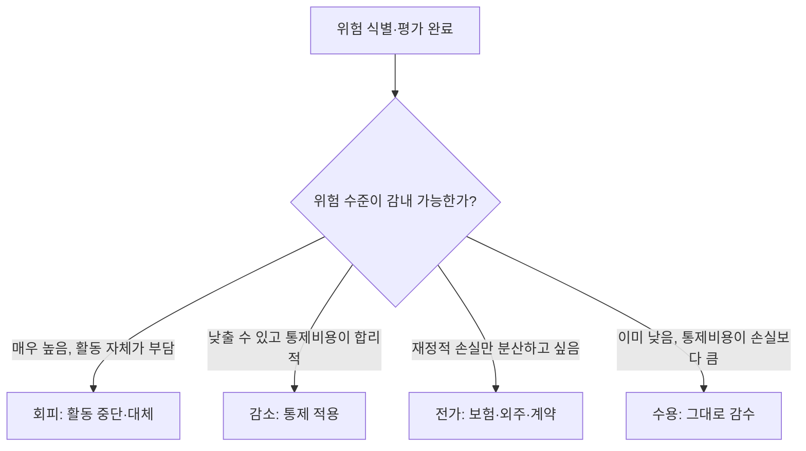

01편에서 정보자산·위협·취약점·위험을 정의했다. 이 편은 그 네 개념을 **수치화하고 의사결정에 연결**하는 방법을 다룬다.

## 위험은 어떻게 만들어지는가

**위험**(risk)은 세 요소가 함께 있어야 성립한다.

- **자산**(asset): 보호할 가치가 있는 대상. 서버, 데이터베이스, 개인정보, 영업비밀, 심지어 조직의 평판까지 포함한다.
- **위협**(threat): 자산에 손실을 끼칠 수 있는 잠재적 원인. 해커의 공격 시도, 자연재해, 내부자의 실수 등.
- **취약점**(vulnerability): 위협이 실제로 자산에 도달할 수 있게 하는 약점. 패치되지 않은 소프트웨어, 부실한 접근통제, 관리 미흡 등.

세 요소의 관계는 흔히 곱셈 형태로 표현한다.

$$
\text{위험(Risk)} = \text{자산(Asset)} \times \text{위협(Threat)} \times \text{취약점(Vulnerability)}
$$

- 자산(Asset): 손실이 발생했을 때 그 가치의 크기
- 위협(Threat): 그 자산을 노리는 위협이 발생할 가능성·강도
- 취약점(Vulnerability): 위협이 실제 피해로 이어질 수 있는 정도(방어의 허술함)

이 식은 실제로 세 숫자를 곱해서 정확한 위험 값을 산출하는 공식이라기보다, **세 요소 중 하나라도 0에 가까우면 위험도 0에 가까워진다**는 개념적 관계를 보여 주는 것이 핵심이다. 예를 들어 아무리 값진 자산(자산 큼)이라도 아무도 노리지 않고(위협 없음) 완벽하게 방어되어 있으면(취약점 없음) 위험은 사실상 없다고 본다.

**시나리오.** 어떤 회사가 개인정보 100만 건을 담은 데이터베이스(자산 큼)를 운영 중이고, 최근 유사 업계에 랜섬웨어 공격이 급증하고 있으며(위협 큼), 그 데이터베이스 서버에 반년째 보안 패치가 밀려 있다(취약점 큼)고 하자. 세 요소가 모두 크므로 이 시스템의 위험은 매우 높다고 평가해야 하고, 패치 적용(취약점 감소)만으로도 위험을 크게 낮출 수 있다.

## 정성적 평가와 정량적 평가

| 구분 | 정성적 평가(Qualitative) | 정량적 평가(Quantitative) |
|---|---|---|
| 결과 표현 | 상·중·하 등급, 위험 매트릭스 | 금액(원, 달러 등 화폐 단위) |
| 장점 | 빠르고 이해하기 쉬우며 비용이 적게 든다 | 예산 배정·투자수익 비교에 직접 활용 가능 |
| 단점 | 평가자의 주관이 개입되기 쉽다 | 정확한 통계·과거 데이터가 없으면 신뢰도가 떨어진다 |
| 대표 도구 | 위험 매트릭스(발생가능성 × 영향도), 델파이 기법 | ALE(연간예상손실) 계산 |
| 활용 상황 | 자산·위협 종류가 많아 신속한 우선순위가 필요할 때 | 특정 위험에 대한 통제 투자를 금액으로 정당화할 때 |

**위험 매트릭스**(risk matrix)는 정성적 평가의 대표적인 도구로, 가로축에 발생가능성, 세로축에 영향도를 두고 각 위험을 칸에 배치해 우선순위를 시각화한다. 실무에서는 정성적 평가로 먼저 위험의 큰 그림을 잡고, 우선순위가 높은 위험만 정량적으로 다시 분석하는 방식을 많이 쓴다.

## 정량적 위험분석 — ALE 계산

정량적 위험분석의 핵심 공식은 다음 세 가지다.

**1단계. 노출계수(EF, Exposure Factor)** — 하나의 위협이 실제로 발생했을 때, 자산 가치 중 몇 퍼센트가 손실되는지를 나타낸다.

**2단계. 단일예상손실액(SLE, Single Loss Expectancy)** — 사고가 한 번 발생했을 때 예상되는 손실 금액이다.

$$
\text{SLE} = \text{AV} \times \text{EF}
$$

- AV(Asset Value, 자산가치): 보호 대상 자산의 화폐 가치
- EF(Exposure Factor, 노출계수): 사고 1회 발생 시 손실되는 자산가치의 비율(0~1 사이의 값)

**3단계. 연간발생률(ARO, Annualized Rate of Occurrence)** — 해당 위협이 1년에 평균 몇 번 발생하는지를 나타내는 값이다. 2년에 한 번꼴로 발생하면 0.5, 1년에 두 번 발생하면 2로 표현한다.

**4단계. 연간예상손실액(ALE, Annualized Loss Expectancy)** — 1년 동안 이 위협으로 예상되는 총 손실 금액이다.

$$
\text{ALE} = \text{SLE} \times \text{ARO}
$$

- SLE(Single Loss Expectancy, 단일예상손실액): 사고 1회당 손실액
- ARO(Annualized Rate of Occurrence, 연간발생률): 1년에 몇 번 발생하는지의 빈도

**계산 예시.** 어떤 회사의 고객 데이터베이스 서버의 자산가치(AV)가 2억 원이라고 하자. 랜섬웨어 감염 사고가 발생하면 평균적으로 자산가치의 30퍼센트에 해당하는 피해(복구 비용, 서비스 중단 손실, 평판 손상 등을 화폐로 환산한 값)가 발생한다고 조사되었다(EF = 0.3).

$$
\text{SLE} = 2\text{억 원} \times 0.3 = 6{,}000\text{만 원}
$$

사고 한 번이 발생하면 6,000만 원의 손실이 예상된다는 뜻이다.

$$
\text{ALE} = 6{,}000\text{만 원} \times 0.5 = 3{,}000\text{만 원}
$$

1년을 기준으로 환산하면 이 위협으로 인한 예상 손실액은 연간 3,000만 원이라는 결과가 나온다.

**결과 해석.** 이 3,000만 원이라는 숫자는 "매년 정확히 3,000만 원을 잃는다"는 뜻이 아니라, "2년에 한 번 6,000만 원을 잃는 것을 1년 단위로 평균 낸 값"이다. 예를 들어 이 위협을 막을 백업·복구 체계 구축에 연간 1,000만 원이 든다면, ALE(3,000만 원)보다 통제 비용(1,000만 원)이 훨씬 작으므로 투자할 가치가 있다고 판단할 수 있다.

**검산.** 만약 이 위협이 1년에 한 번씩(ARO = 1) 발생한다면 ALE는 SLE와 같아져야 한다. $\text{ALE} = 6{,}000\text{만 원} \times 1 = 6{,}000\text{만 원}$으로 SLE와 정확히 일치한다(검산 완료).

## 위험 대응 4전략

위험을 평가한 뒤에는 반드시 처리 방향을 결정해야 한다. 위험 처리 전략은 네 가지로 정리된다.

| 전략 | 정의 | 핵심 판단 기준 | 시나리오 예시 |
|---|---|---|---|
| 회피(Avoidance) | 위험을 발생시키는 활동 자체를 하지 않는다 | 위험이 매우 크고, 그 활동을 포기해도 손해가 적을 때 | 보안 검증이 안 된 해외 오픈소스 결제 모듈 도입 계획을 아예 취소하고 검증된 상용 솔루션으로 대체한다 |
| 전가(Transfer) | 위험의 결과를 제3자와 나누거나 넘긴다 | 위험 자체는 없앨 수 없지만, 재정적 손실만이라도 분산하고 싶을 때 | 사이버 보험에 가입해, 침해사고 발생 시 배상금·복구 비용의 일부를 보험사가 부담하게 한다 |
| 감소(Mitigation) | 통제를 적용해 위험의 발생 가능성이나 영향도를 낮춘다 | 활동을 계속해야 하고, 비용 대비 효과적인 통제 수단이 있을 때 | 위 계산 예시처럼 연간 1,000만 원을 들여 백업·복구 체계를 구축해 ALE 3,000만 원짜리 위험의 영향도(EF)를 낮춘다 |
| 수용(Acceptance) | 통제를 추가하지 않고 위험을 그대로 감수한다 | 위험이 이미 낮거나, 통제 비용이 예상 손실보다 클 때 | ALE가 200만 원인데 이를 막을 통제 비용이 5,000만 원이라면, 통제를 도입하지 않고 위험을 그대로 받아들이기로 경영진이 결정한다 |

```mermaid
flowchart TD
    A[위험 식별·평가 완료] --> B{위험 수준이 감내 가능한가?}
    B -->|매우 높음, 활동 자체가 부담| C[회피: 활동 중단·대체]
    B -->|낮출 수 있고 통제비용이 합리적| D[감소: 통제 적용]
    B -->|재정적 손실만 분산하고 싶음| E[전가: 보험·외주·계약]
    B -->|이미 낮음, 통제비용이 손실보다 큼| F[수용: 그대로 감수]
```

네 전략은 서로 배타적이지 않다. 실제로는 하나의 위험에 여러 전략을 함께 적용하는 경우가 많다. 예를 들어 화재 위험에 대해 스프링클러를 설치해 영향도를 낮추고(감소), 동시에 화재보험에 가입해(전가) 남은 손실 일부를 분산시키는 식이다.

## 법·제도·ISMS-P에서의 위험관리 요구사항

12편에서 다룬 **ISMS-P**(정보보호 및 개인정보보호 관리체계, Personal information & Information Security Management System) 인증기준의 "관리체계 수립 및 운영" 영역에는 위험평가를 명시적으로 요구하는 통제 항목이 포함되어 있다. 조직은 정기적으로(통상 연 1회 이상) 자산을 식별하고, 위협·취약점을 분석해 위험을 평가하며, 그 결과에 따라 위 네 전략 중 하나를 선택해 **위험처리계획**(risk treatment plan)을 수립해야 한다.

## 자주 틀리는 점

- **위험 = 자산 × 위협 × 취약점 관계를 산술적으로 정확히 곱해야 하는 공식으로 착각한다.** 이 식은 세 요소 중 하나라도 없으면 위험이 성립하지 않는다는 개념적 관계이지, 실제 숫자를 곱해 위험 점수를 산출하는 표준 공식은 아니다.
- **SLE와 ALE를 혼동한다.** SLE는 사고 1회당 손실액, ALE는 그것에 연간 발생 빈도(ARO)를 곱한 1년 기준 예상 손실액이다.
- **EF를 손실 금액으로 착각한다.** EF는 금액이 아니라 자산가치 대비 손실 비율(0~1)이다. 금액은 AV × EF(=SLE) 계산 이후에 나온다.
- **회피와 감소를 혼동한다.** 회피는 위험을 일으키는 활동 자체를 그만두는 것이고, 감소는 활동은 유지하되 통제로 위험을 줄이는 것이다.

## 핵심 정리

- 위험은 자산 × 위협 × 취약점의 관계로 성립하며, 셋 중 하나가 없으면 위험도 성립하지 않는다.
- 정성적 평가는 등급으로, 정량적 평가는 금액으로 위험을 표현한다.
- SLE = AV × EF, ALE = SLE × ARO다. ARO가 1이면 ALE는 SLE와 같아진다.
- 위험 대응 4전략은 회피·전가·감소·수용이며, 실제로는 여러 전략을 함께 적용하는 경우가 많다.
- ISMS-P는 정기적인 위험평가와 위험처리계획 수립을 관리체계의 필수 요구사항으로 명시한다.

## 마무리 복습

<Quiz
  questionNumber={1}
  question={"자산가치(AV)가 5,000만 원이고 노출계수(EF)가 0.4일 때 SLE는 얼마인가?"}
  options={["500만 원","1,000만 원","2,000만 원","4,000만 원"]}
  correctAnswer={3}
  explanation={"SLE = AV × EF = 5,000만 원 × 0.4 = 2,000만 원이다. 노출계수는 자산가치 중 사고 1회로 손실되는 비율을 나타낸다."}
/>

<Quiz
  questionNumber={2}
  question={"SLE가 4,000만 원이고 ARO가 0.25(4년에 한 번)일 때 ALE는 얼마인가?"}
  options={["1,000만 원","4,000만 원","1억 6,000만 원","4억 원"]}
  correctAnswer={1}
  explanation={"ALE = SLE × ARO = 4,000만 원 × 0.25 = 1,000만 원이다. 4년에 한 번 발생하는 사고를 1년 단위로 환산하면 연평균 1,000만 원의 손실이 예상된다는 뜻이다."}
/>

<Quiz
  questionNumber={3}
  question={"위험 = 자산 × 위협 × 취약점 관계에 대한 설명으로 가장 적절한 것은?"}
  options={["세 값을 정확히 곱해 표준화된 위험 점수를 산출하는 공식이다","세 요소 중 하나라도 사실상 0이면 위험도 사실상 0에 가까워진다는 개념적 관계다","자산 가치가 클수록 위협과 취약점은 자동으로 줄어든다는 관계다","취약점이 없어도 위협만 크면 위험은 항상 높다"]}
  correctAnswer={2}
  explanation={"이 관계식은 실제 숫자를 곱해 정밀한 위험 점수를 산출하는 표준 공식이라기보다, 자산·위협·취약점 중 하나라도 없으면 위험이 성립하지 않는다는 개념을 보여주는 것이 핵심이다."}
/>

## 참고 자료

- [국가평생교육진흥원 독학학위제 시험안내](https://bdes.nile.or.kr)
- [정보보호 및 개인정보보호 관리체계(ISMS-P) 인증기준 안내서](https://isms-p.or.kr)
- [NIST Computer Security Resource Center](https://csrc.nist.gov)
