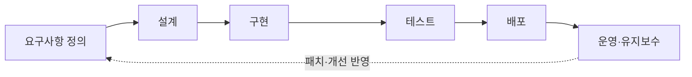
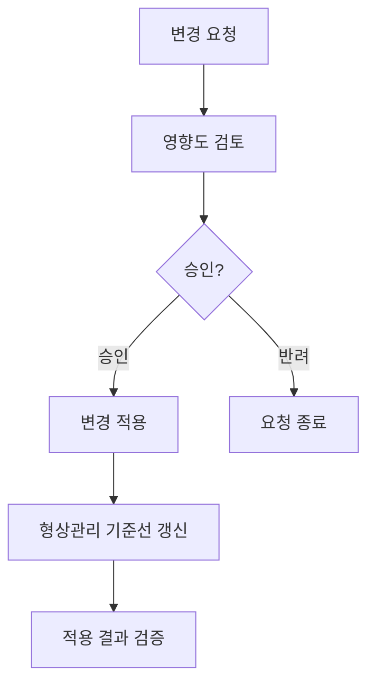

<Callout type="info">
  **이번 문서의 목표:** 이 문서를 다 읽으면 시스템 개발수명주기의 각 단계에서 어떤 보안 활동이 필요한지 설명하고, 변경관리·형상관리·패치관리가 왜 별도의 통제로 요구되는지 사례를 들어 말할 수 있다.
</Callout>

11편에서 버퍼 오버플로우·인젝션·XSS 같은 개별 취약점의 정체를, 17편에서 네트워크 보안 장비를 다뤘다. 이 편은 시야를 넓혀 "취약점이 애초에 왜 시스템에 심어지는가", "이미 운영 중인 시스템의 취약점을 어떻게 관리하는가"를 다룬다. 독학사 출제기준의 "안전한 개발·운영" 영역은 특정 취약점의 원리보다 **개발수명주기 전체에서 보안을 어느 단계에 배치하는가**, **운영 단계의 변경·구성관리 절차**를 묻는 문제가 많다.

## 왜 개발 초기부터 보안을 넣어야 하는가

> **쉽게 말하면:** 설계 단계에서 못 찾은 결함은 운영 단계에서 고치려면 수십 배 더 비싸다.

전통적인 개발 방식은 시스템을 다 만든 뒤 마지막에 보안 점검을 하는 방식이었다. 이 방식의 문제는 **결함을 늦게 발견할수록 수정 비용이 기하급수적으로 커진다**는 점이다. 설계 단계에서 보안 요구사항을 놓치면, 그 결함은 구현·테스트를 거쳐 운영 단계까지 그대로 흘러가고, 운영 중인 시스템의 구조적 결함을 고치려면 재설계에 가까운 작업이 필요해진다.

이런 문제의식에서 나온 것이 **Secure SDLC**(Secure Software Development Life Cycle, 보안이 내재된 소프트웨어 개발수명주기)다. 핵심 아이디어는 보안을 마지막 점검 단계 하나에 몰아넣지 않고, 요구사항 정의부터 운영·유지보수까지 **모든 단계에 보안 활동을 분산 배치**하는 것이다.

## 단계별 보안 활동

> **쉽게 말하면:** 각 개발 단계마다 그 단계에 맞는 보안 질문을 던지고 답을 남겨야 한다.

| 단계 | 핵심 질문 | 대표 보안 활동 |
|---|---|---|
| 요구사항 정의 | 이 시스템이 지켜야 할 보안 목표는 무엇인가 | 보안 요구사항 명세(기밀성·무결성·가용성 목표, 준수해야 할 법령·인증기준 식별) |
| 설계 | 구조적으로 안전하게 설계되었는가 | 위협모델링(threat modeling, 공격자의 관점에서 시스템의 공격 경로를 미리 그려보는 기법), 최소권한 원칙 반영 |
| 구현 | 코드 자체에 결함이 없는가 | 안전한 코딩 가이드 준수, 정적분석(코드를 실행하지 않고 소스코드 자체를 분석해 취약점을 찾는 방법) |
| 테스트 | 실제로 뚫리지 않는가 | 동적분석·모의해킹(실제로 시스템을 실행한 상태에서 취약점을 검증), 보안 테스트 케이스 |
| 배포 | 배포 과정 자체가 안전한가 | 형상관리 기반 배포, 배포 승인 절차, 최소 권한으로 배포 계정 운용 |
| 운영·유지보수 | 운영 중에도 계속 안전한가 | 취약점 스캐닝, 패치관리, 변경관리, 로그 모니터링(18편의 보안관제와 연결) |

각 단계는 독립적이지 않고 **피드백 순환**을 이룬다. 운영 중 발견된 취약점은 다시 요구사항·설계 단계에 반영되어 다음 개발 주기를 개선한다.

## 안전한 코딩 원칙

> **쉽게 말하면:** 입력을 믿지 말고, 필요한 권한만 주고, 실패했을 때는 안전한 쪽으로 실패하게 만든다.

구현 단계에서 지켜야 할 핵심 원칙 몇 가지는 다음과 같다. 개별 취약점(SQL 인젝션, XSS 등)의 원리는 11편에서 이미 다뤘으므로, 여기서는 그 취약점들을 예방하는 **공통 설계 원칙**에 집중한다.

- **입력값 검증**(input validation): 외부에서 들어오는 모든 데이터는 일단 의심하고, 허용된 형식·범위인지 검증한 뒤 사용한다. 인젝션·XSS 계열 취약점 대부분이 이 원칙을 지키지 않아서 발생한다(자세한 내용은 11편 참고).
- **최소권한 원칙**(least privilege): 프로그램이나 계정에는 업무 수행에 꼭 필요한 최소한의 권한만 부여한다. 관리자 권한으로 실행되는 프로세스는 취약점이 발견되었을 때 피해 범위가 그만큼 커진다.
- **안전한 실패**(fail-safe / fail-secure): 오류나 예외가 발생했을 때 시스템이 "허용" 쪽으로 열리지 않고 "차단" 쪽으로 닫히도록 설계한다. 예를 들어 인증 서버 응답이 지연되어 타임아웃이 나면 접근을 자동으로 허용하는 것이 아니라 거부해야 한다.
- **심층 방어**(defense in depth): 하나의 방어선이 뚫려도 다음 방어선이 막을 수 있도록 여러 겹의 통제를 배치한다(17편의 방화벽·IPS·VPN을 겹쳐 배치하는 것도 심층 방어의 한 예다).
- **민감정보 최소 노출**: 오류 메시지·로그에 비밀번호·주민등록번호 같은 민감정보나 시스템 내부 구조가 그대로 노출되지 않도록 한다.

## 변경관리와 형상관리

> **쉽게 말하면:** 운영 중인 시스템을 함부로 바꾸지 못하게 하고, 지금 무엇이 어떤 상태로 돌아가고 있는지 항상 기록해 둔다.

**변경관리**(change management)는 운영 중인 시스템에 변경(패치 적용, 설정 변경, 코드 배포 등)을 가할 때 **승인 절차 없이 임의로 바꾸지 못하게** 통제하는 절차다. 변경을 요청 → 검토 → 승인 → 적용 → 검증의 순서로 진행하고, 각 단계의 기록을 남긴다. 이 절차가 없으면 담당자 한 사람의 실수나 임의 조치로 전체 서비스가 장애를 일으킬 수 있다.

**형상관리**(configuration management)는 시스템을 구성하는 요소(하드웨어, 소프트웨어 버전, 설정값, 네트워크 구성 등)의 **현재 상태를 기준선**(baseline, 정상으로 승인된 표준 상태)으로 정해 놓고 관리하는 것이다. 이 기준선이 있어야 "지금 시스템이 승인된 상태에서 벗어났는지"를 판단할 수 있고, 침해사고 발생 시 "무엇이 바뀌었는가"를 빠르게 확인할 수 있다(18편의 분석 단계와 직결된다). 형상 정보를 모아 두는 저장소를 **CMDB**(Configuration Management Database, 형상관리 데이터베이스)라 부른다.

변경관리와 형상관리는 서로 맞물려 돌아간다. 변경관리는 "바꾸는 절차"를 통제하고, 형상관리는 "바뀐 결과가 기준선과 일치하는지"를 확인한다.

## 운영 중 취약점 관리와 패치관리

> **쉽게 말하면:** 시스템은 배포 후에도 계속 새로운 취약점이 발견되므로, 발견 → 평가 → 적용 → 확인의 반복 절차가 필요하다.

운영 단계에서는 새로운 취약점이 지속적으로 공개된다. **취약점 관리**(vulnerability management)는 이를 체계적으로 다루는 절차이며, 보통 다음 순서를 따른다.

1. **취약점 스캐닝**: 자동화된 도구로 시스템의 알려진 취약점을 주기적으로 점검한다.
2. **위험 평가**: 발견된 취약점이 실제로 얼마나 위험한지(19편의 위험분석 방법을 적용) 심각도를 매긴다. 흔히 CVSS(Common Vulnerability Scoring System, 취약점 심각도를 점수화하는 국제 표준 체계) 점수를 참고한다.
3. **패치 적용**: 심각도가 높은 취약점부터 우선순위를 정해 패치를 적용한다. 이때 변경관리 절차를 반드시 거쳐야 한다 — 패치 자체도 시스템 변경이기 때문이다.
4. **검증**: 패치 적용 후 취약점이 실제로 해소되었는지, 다른 기능에 부작용은 없는지 재점검한다.

패치를 즉시 적용하지 못하는 경우(운영 중단이 어려운 시스템, 호환성 문제 등)에는 **임시 완화조치**(mitigation, 예: 해당 포트를 방화벽에서 임시 차단)를 먼저 적용하고, 정식 패치는 계획된 점검 시간에 반영하는 방식으로 위험을 관리한다.

## 자주 틀리는 점

- **보안 점검을 테스트 단계에만 하면 충분하다고 착각한다.** Secure SDLC의 핵심은 요구사항·설계 단계부터 보안을 반영하는 것이며, 테스트 단계에서만 점검하면 구조적 결함은 이미 늦게 발견된다.
- **변경관리와 형상관리를 같은 것으로 혼동한다.** 변경관리는 "바꾸는 절차의 통제", 형상관리는 "현재 상태를 기준선으로 관리하는 것"이라는 차이가 있다.
- **패치를 발견 즉시 무조건 적용해야 한다고 생각한다.** 패치도 시스템 변경이므로 변경관리 절차(영향도 검토·승인)를 거쳐야 하며, 심각도에 따라 우선순위를 정해 적용하는 것이 원칙이다.
- **최소권한 원칙을 계정에만 적용한다고 생각한다.** 사람의 계정뿐 아니라 프로세스·서비스 계정에도 최소권한 원칙이 적용되어야 한다.

## 핵심 정리

- Secure SDLC는 보안을 테스트 단계에 몰아넣지 않고 요구사항–설계–구현–테스트–배포–운영 전 단계에 분산 배치하는 개발 방법론이다.
- 안전한 코딩 원칙에는 입력값 검증, 최소권한, 안전한 실패, 심층 방어, 민감정보 최소 노출이 있다.
- 변경관리는 시스템 변경의 승인 절차를 통제하고, 형상관리는 시스템의 현재 상태를 기준선으로 관리한다.
- 운영 중 취약점 관리는 스캐닝 → 위험 평가 → 패치 적용 → 검증의 순서로 반복되며, 패치 적용도 변경관리 절차를 거쳐야 한다.

## 마무리 복습

<Quiz
  questionNumber={1}
  question="Secure SDLC의 핵심 개념으로 가장 적절한 것은?"
  options={['보안 점검은 배포 직전 테스트 단계에서 한 번만 수행하면 충분하다', '보안 활동을 요구사항 정의부터 운영·유지보수까지 전 단계에 분산 배치한다', '보안은 개발팀이 아니라 운영팀만의 책임이다', '설계 단계에서는 보안을 고려할 필요가 없고 구현 단계부터 고려하면 된다']}
  correctAnswer={2}
  explanation="Secure SDLC의 핵심은 보안 점검을 마지막 한 단계에 몰아넣지 않고 요구사항 정의, 설계, 구현, 테스트, 배포, 운영까지 모든 단계에 보안 활동을 분산 배치하는 것이다."
  optionExplanations={['테스트 단계에만 보안을 점검하면 구조적 결함을 늦게 발견해 수정 비용이 커진다.', '정답이다. 전 단계에 보안 활동을 분산 배치하는 것이 Secure SDLC의 핵심이다.', '보안은 개발·운영·관리 전 부서가 함께 책임져야 하는 활동이다.', '설계 단계의 위협모델링을 생략하면 구조적 결함이 늦게 발견된다.']}
/>

<Quiz
  questionNumber={2}
  question="인증 서버 응답이 지연되어 타임아웃이 발생했을 때 시스템이 접근을 자동으로 거부하도록 설계하는 원칙은?"
  options={['최소권한 원칙', '심층 방어', '안전한 실패(fail-secure)', '입력값 검증']}
  correctAnswer={3}
  explanation="오류나 예외 상황에서 시스템이 허용 쪽이 아니라 차단 쪽으로 닫히도록 설계하는 것이 안전한 실패(fail-secure) 원칙이다. 인증 지연 시 접근을 거부하는 것이 대표적인 예다."
  optionExplanations={['최소권한 원칙은 계정·프로세스에 필요한 최소 권한만 부여하는 것으로 이 사례와는 다르다.', '심층 방어는 여러 겹의 방어선을 배치하는 원칙으로 이 사례와는 다르다.', '정답이다. 오류 상황에서 차단 쪽으로 닫히게 하는 것이 안전한 실패 원칙이다.', '입력값 검증은 외부 입력 데이터의 형식·범위를 확인하는 원칙으로 이 사례와는 다르다.']}
/>

<Quiz
  questionNumber={3}
  question="변경관리와 형상관리의 관계에 대한 설명으로 가장 적절한 것은?"
  options={['두 개념은 동일하며 실무에서 구분할 필요가 없다', '변경관리는 시스템 변경의 승인 절차를 통제하고, 형상관리는 시스템의 현재 상태를 기준선으로 관리한다', '형상관리는 변경관리보다 상위 개념으로 변경관리를 포함하지 않는다', '변경관리는 운영 단계에만, 형상관리는 개발 단계에만 적용된다']}
  correctAnswer={2}
  explanation="변경관리는 시스템에 변경을 가할 때 요청-검토-승인-적용-검증의 절차를 통제하는 것이고, 형상관리는 하드웨어·소프트웨어·설정 등 시스템 구성요소의 현재 상태를 기준선으로 관리하는 것이다. 두 활동은 서로 맞물려 작동한다."
  optionExplanations={['두 개념은 통제 대상과 목적이 달라 구분해서 이해해야 한다.', '정답이다. 변경 절차 통제와 상태 기준선 관리로 역할이 구분된다.', '두 개념은 상하 포함관계가 아니라 서로 맞물려 작동하는 별개의 통제다.', '변경관리와 형상관리는 모두 개발·운영 단계 전반에 적용될 수 있다.']}
/>

<Quiz
  questionNumber={4}
  question="운영 중 발견된 취약점 관리 절차의 순서로 가장 적절한 것은?"
  options={['패치 적용 → 취약점 스캐닝 → 위험 평가 → 검증', '취약점 스캐닝 → 위험 평가 → 패치 적용 → 검증', '위험 평가 → 검증 → 취약점 스캐닝 → 패치 적용', '검증 → 패치 적용 → 위험 평가 → 취약점 스캐닝']}
  correctAnswer={2}
  explanation="취약점 관리는 먼저 스캐닝으로 취약점을 발견하고, CVSS 등을 참고해 심각도를 평가한 뒤, 우선순위에 따라 패치를 적용하고, 마지막으로 취약점 해소 여부와 부작용을 검증하는 순서로 진행된다."
  optionExplanations={['패치를 먼저 적용하면 무엇을 왜 고치는지 파악하지 못한 채 변경을 가하는 것이 되어 순서가 틀렸다.', '정답이다. 스캐닝-평가-패치-검증 순서가 옳다.', '평가할 대상(취약점)을 먼저 스캐닝으로 찾아야 하므로 순서가 틀렸다.', '검증이 가장 먼저 오면 안 되며 패치 이후에 이루어져야 한다.']}
/>

<Quiz
  questionNumber={5}
  question="패치를 즉시 적용하기 어려운 운영 중인 시스템에 대한 조치로 가장 적절한 것은?"
  options={['패치가 나올 때까지 아무 조치도 하지 않는다', '변경관리 절차를 생략하고 바로 패치를 적용한다', '해당 포트 차단 등 임시 완화조치를 먼저 적용하고 정식 패치는 계획된 점검 시간에 반영한다', '시스템을 영구적으로 종료한다']}
  correctAnswer={3}
  explanation="즉시 패치 적용이 어려운 경우, 방화벽에서 해당 포트를 임시로 차단하는 등 완화조치로 우선 위험을 낮추고, 정식 패치는 변경관리 절차를 거쳐 계획된 점검 시간에 반영하는 것이 일반적인 대응이다."
  optionExplanations={['아무 조치도 하지 않으면 취약점이 노출된 채로 방치되어 위험이 지속된다.', '패치도 시스템 변경이므로 변경관리 절차를 생략하면 예기치 않은 장애를 유발할 수 있다.', '정답이다. 임시 완화조치 후 계획된 시간에 정식 패치를 반영하는 것이 적절하다.', '시스템 영구 종료는 과도한 대응으로 서비스 가용성을 해친다.']}
/>

<Quiz
  questionNumber={6}
  question="안전한 코딩 원칙에 대한 설명으로 옳지 않은 것은?"
  options={['최소권한 원칙은 사람의 계정뿐 아니라 프로세스·서비스 계정에도 적용되어야 한다', '심층 방어는 하나의 방어선이 뚫려도 다음 방어선이 막을 수 있도록 여러 겹의 통제를 배치하는 것이다', '오류 메시지에는 문제 해결을 돕기 위해 시스템 내부 구조와 민감정보를 최대한 자세히 노출해야 한다', '입력값 검증은 외부에서 들어오는 데이터가 허용된 형식·범위인지 확인하는 것이다']}
  correctAnswer={3}
  explanation="오류 메시지나 로그에 시스템 내부 구조, 비밀번호, 주민등록번호 같은 민감정보가 노출되면 공격자에게 유용한 정보를 제공하게 된다. 오류 메시지는 민감정보를 최소한으로 노출해야 하며, 이 설명은 옳지 않다."
  optionExplanations={['옳은 설명이다. 최소권한 원칙은 사람과 프로세스 모두에 적용된다.', '옳은 설명이다. 심층 방어의 정의 그대로다.', '정답이다. 오류 메시지는 민감정보를 최소한으로만 노출해야 하므로 이 설명은 옳지 않다.', '옳은 설명이다. 입력값 검증의 정의 그대로다.']}
/>

## 참고 자료

- [국가평생교육진흥원 독학학위제 시험안내](https://bdes.nile.or.kr)
- [NIST Computer Security Resource Center](https://csrc.nist.gov)
- [OWASP](https://owasp.org)
