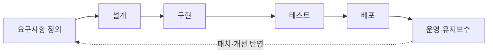
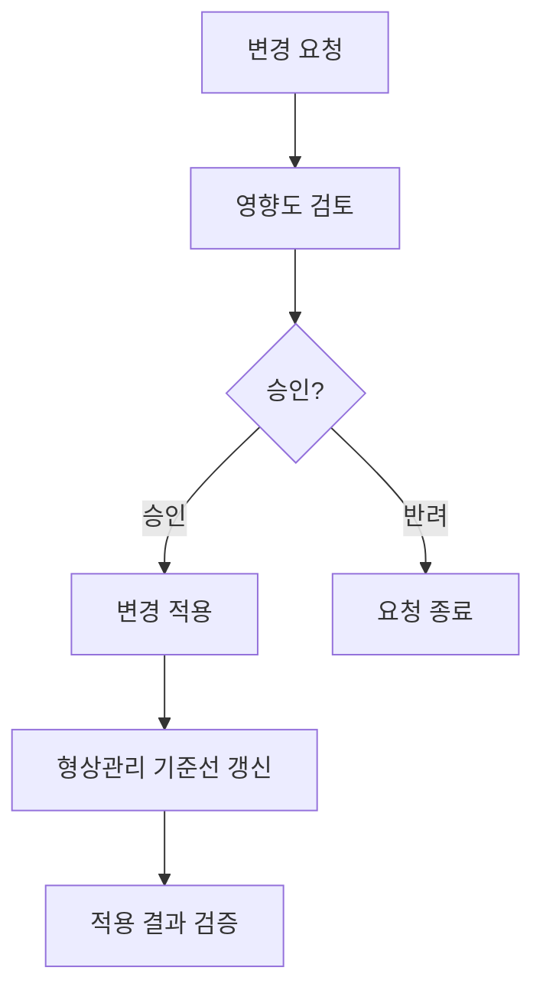

10편에서 버퍼 오버플로우·인젝션·XSS 같은 개별 취약점의 정체를, 16편에서 네트워크 보안 장비를 다뤘다. 독학사 출제기준의 "안전한 개발·운영" 영역은 특정 취약점의 원리보다 **개발수명주기 전체에서 보안을 어느 단계에 배치하는가**, **운영 단계의 변경·구성관리 절차**를 묻는 문제가 많다.

## 왜 개발 초기부터 보안을 넣어야 하는가

전통적인 개발 방식은 시스템을 다 만든 뒤 마지막에 보안 점검을 하는 방식이었다. 이 방식의 문제는 **결함을 늦게 발견할수록 수정 비용이 기하급수적으로 커진다**는 점이다.

이런 문제의식에서 나온 것이 **Secure SDLC**(Secure Software Development Life Cycle, 보안이 내재된 소프트웨어 개발수명주기)다. 핵심 아이디어는 보안을 마지막 점검 단계 하나에 몰아넣지 않고, 요구사항 정의부터 운영·유지보수까지 **모든 단계에 보안 활동을 분산 배치**하는 것이다.

## 단계별 보안 활동

```mermaid
flowchart LR
    A[요구사항 정의] --> B[설계]
    B --> C[구현]
    C --> D[테스트]
    D --> E[배포]
    E --> F[운영·유지보수]
    F -.패치·개선 반영.-> A
```

| 단계 | 핵심 질문 | 대표 보안 활동 |
|---|---|---|
| 요구사항 정의 | 이 시스템이 지켜야 할 보안 목표는 무엇인가 | 보안 요구사항 명세(기밀성·무결성·가용성 목표, 준수해야 할 법령·인증기준 식별) |
| 설계 | 구조적으로 안전하게 설계되었는가 | 위협모델링(threat modeling, 공격자의 관점에서 시스템의 공격 경로를 미리 그려보는 기법), 최소권한 원칙 반영 |
| 구현 | 코드 자체에 결함이 없는가 | 안전한 코딩 가이드 준수, 정적분석(코드를 실행하지 않고 소스코드 자체를 분석해 취약점을 찾는 방법) |
| 테스트 | 실제로 뚫리지 않는가 | 동적분석·모의해킹(실제로 시스템을 실행한 상태에서 취약점을 검증), 보안 테스트 케이스 |
| 배포 | 배포 과정 자체가 안전한가 | 형상관리 기반 배포, 배포 승인 절차, 최소 권한으로 배포 계정 운용 |
| 운영·유지보수 | 운영 중에도 계속 안전한가 | 취약점 스캐닝, 패치관리, 변경관리, 로그 모니터링(17편의 보안관제와 연결) |

각 단계는 독립적이지 않고 **피드백 순환**을 이룬다. 운영 중 발견된 취약점은 다시 요구사항·설계 단계에 반영되어 다음 개발 주기를 개선한다.

## 안전한 코딩 원칙

구현 단계에서 지켜야 할 핵심 원칙 몇 가지는 다음과 같다. 개별 취약점(SQL 인젝션, XSS 등)의 원리는 10편에서 이미 다뤘으므로, 여기서는 그 취약점들을 예방하는 **공통 설계 원칙**에 집중한다.

- **입력값 검증**(input validation): 외부에서 들어오는 모든 데이터는 일단 의심하고, 허용된 형식·범위인지 검증한 뒤 사용한다. 인젝션·XSS 계열 취약점 대부분이 이 원칙을 지키지 않아서 발생한다(자세한 내용은 10편 참고).
- **최소권한 원칙**(least privilege): 프로그램이나 계정에는 업무 수행에 꼭 필요한 최소한의 권한만 부여한다. 관리자 권한으로 실행되는 프로세스는 취약점이 발견되었을 때 피해 범위가 그만큼 커진다.
- **안전한 실패**(fail-safe / fail-secure): 오류나 예외가 발생했을 때 시스템이 "허용" 쪽으로 열리지 않고 "차단" 쪽으로 닫히도록 설계한다. 예를 들어 인증 서버 응답이 지연되어 타임아웃이 나면 접근을 자동으로 허용하는 것이 아니라 거부해야 한다.
- **심층 방어**(defense in depth): 하나의 방어선이 뚫려도 다음 방어선이 막을 수 있도록 여러 겹의 통제를 배치한다(16편의 방화벽·IPS·VPN을 겹쳐 배치하는 것도 심층 방어의 한 예다).
- **민감정보 최소 노출**: 오류 메시지·로그에 비밀번호·주민등록번호 같은 민감정보나 시스템 내부 구조가 그대로 노출되지 않도록 한다.

## 변경관리와 형상관리

**변경관리**(change management)는 운영 중인 시스템에 변경(패치 적용, 설정 변경, 코드 배포 등)을 가할 때 **승인 절차 없이 임의로 바꾸지 못하게** 통제하는 절차다. 변경을 요청 → 검토 → 승인 → 적용 → 검증의 순서로 진행하고, 각 단계의 기록을 남긴다.

**형상관리**(configuration management)는 시스템을 구성하는 요소(하드웨어, 소프트웨어 버전, 설정값, 네트워크 구성 등)의 **현재 상태를 기준선**(baseline, 정상으로 승인된 표준 상태)으로 정해 놓고 관리하는 것이다. 이 기준선이 있어야 "지금 시스템이 승인된 상태에서 벗어났는지"를 판단할 수 있고, 침해사고 발생 시 "무엇이 바뀌었는가"를 빠르게 확인할 수 있다(17편의 분석 단계와 직결된다).

변경관리와 형상관리는 서로 맞물려 돌아간다. 변경관리는 "바꾸는 절차"를 통제하고, 형상관리는 "바뀐 결과가 기준선과 일치하는지"를 확인한다.

```mermaid
flowchart TD
    A[변경 요청] --> B[영향도 검토]
    B --> C{승인?}
    C -->|승인| D[변경 적용]
    C -->|반려| E[요청 종료]
    D --> F[형상관리 기준선 갱신]
    F --> G[적용 결과 검증]
```

## 운영 중 취약점 관리와 패치관리

운영 단계에서는 새로운 취약점이 지속적으로 공개된다. **취약점 관리**(vulnerability management)는 이를 체계적으로 다루는 절차이며, 보통 다음 순서를 따른다.

1. **취약점 스캐닝**: 자동화된 도구로 시스템의 알려진 취약점을 주기적으로 점검한다.
2. **위험 평가**: 발견된 취약점이 실제로 얼마나 위험한지(18편의 위험분석 방법을 적용) 심각도를 매긴다. 흔히 CVSS(Common Vulnerability Scoring System, 취약점 심각도를 점수화하는 국제 표준 체계) 점수를 참고한다.
3. **패치 적용**: 심각도가 높은 취약점부터 우선순위를 정해 패치를 적용한다. 이때 변경관리 절차를 반드시 거쳐야 한다 — 패치 자체도 시스템 변경이기 때문이다.
4. **검증**: 패치 적용 후 취약점이 실제로 해소되었는지, 다른 기능에 부작용은 없는지 재점검한다.

패치를 즉시 적용하지 못하는 경우(운영 중단이 어려운 시스템, 호환성 문제 등)에는 **임시 완화조치**(mitigation, 예: 해당 포트를 방화벽에서 임시 차단)를 먼저 적용하고, 정식 패치는 계획된 점검 시간에 반영하는 방식으로 위험을 관리한다.

## 자주 틀리는 점

- **보안 점검을 테스트 단계에만 하면 충분하다고 착각한다.** Secure SDLC의 핵심은 요구사항·설계 단계부터 보안을 반영하는 것이며, 테스트 단계에서만 점검하면 구조적 결함은 이미 늦게 발견된다.
- **변경관리와 형상관리를 같은 것으로 혼동한다.** 변경관리는 "바꾸는 절차의 통제", 형상관리는 "현재 상태를 기준선으로 관리하는 것"이라는 차이가 있다.
- **패치를 발견 즉시 무조건 적용해야 한다고 생각한다.** 패치도 시스템 변경이므로 변경관리 절차(영향도 검토·승인)를 거쳐야 하며, 심각도에 따라 우선순위를 정해 적용하는 것이 원칙이다.
- **최소권한 원칙을 계정에만 적용한다고 생각한다.** 사람의 계정뿐 아니라 프로세스·서비스 계정에도 최소권한 원칙이 적용되어야 한다.

## 핵심 정리

- Secure SDLC는 보안을 테스트 단계에 몰아넣지 않고 요구사항–설계–구현–테스트–배포–운영 전 단계에 분산 배치하는 개발 방법론이다.
- 안전한 코딩 원칙에는 입력값 검증, 최소권한, 안전한 실패, 심층 방어, 민감정보 최소 노출이 있다.
- 변경관리는 시스템 변경의 승인 절차를 통제하고, 형상관리는 시스템의 현재 상태를 기준선으로 관리한다.
- 운영 중 취약점 관리는 스캐닝 → 위험 평가 → 패치 적용 → 검증의 순서로 반복되며, 패치 적용도 변경관리 절차를 거쳐야 한다.

## 마무리 복습

<Quiz
  questionNumber={1}
  question={"Secure SDLC의 핵심 개념으로 가장 적절한 것은?"}
  options={["보안 점검은 배포 직전 테스트 단계에서 한 번만 수행하면 충분하다","보안 활동을 요구사항 정의부터 운영·유지보수까지 전 단계에 분산 배치한다","보안은 개발팀이 아니라 운영팀만의 책임이다","설계 단계에서는 보안을 고려할 필요가 없고 구현 단계부터 고려하면 된다"]}
  correctAnswer={2}
  explanation={"Secure SDLC의 핵심은 보안 점검을 마지막 한 단계에 몰아넣지 않고 요구사항 정의, 설계, 구현, 테스트, 배포, 운영까지 모든 단계에 보안 활동을 분산 배치하는 것이다."}
/>

<Quiz
  questionNumber={2}
  question={"인증 서버 응답이 지연되어 타임아웃이 발생했을 때 시스템이 접근을 자동으로 거부하도록 설계하는 원칙은?"}
  options={["최소권한 원칙","심층 방어","안전한 실패(fail-secure)","입력값 검증"]}
  correctAnswer={3}
  explanation={"오류나 예외 상황에서 시스템이 허용 쪽이 아니라 차단 쪽으로 닫히도록 설계하는 것이 안전한 실패(fail-secure) 원칙이다. 인증 지연 시 접근을 거부하는 것이 대표적인 예다."}
/>

<Quiz
  questionNumber={3}
  question={"변경관리와 형상관리의 관계에 대한 설명으로 가장 적절한 것은?"}
  options={["두 개념은 동일하며 실무에서 구분할 필요가 없다","변경관리는 시스템 변경의 승인 절차를 통제하고, 형상관리는 시스템의 현재 상태를 기준선으로 관리한다","형상관리는 변경관리보다 상위 개념으로 변경관리를 포함하지 않는다","변경관리는 운영 단계에만, 형상관리는 개발 단계에만 적용된다"]}
  correctAnswer={2}
  explanation={"변경관리는 시스템에 변경을 가할 때 요청-검토-승인-적용-검증의 절차를 통제하는 것이고, 형상관리는 하드웨어·소프트웨어·설정 등 시스템 구성요소의 현재 상태를 기준선으로 관리하는 것이다. 두 활동은 서로 맞물려 작동한다."}
/>

## 참고 자료

- [국가평생교육진흥원 독학학위제 시험안내](https://bdes.nile.or.kr)
- [NIST Computer Security Resource Center](https://csrc.nist.gov)
- [OWASP](https://owasp.org)
