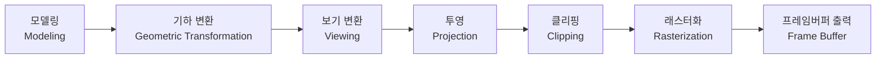
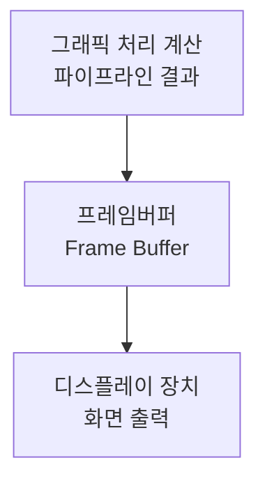

<Callout type="info">
  **이번 문서의 목표:** 컴퓨터그래픽스가 다루는 두 가지 표현 방식(래스터·벡터)의 차이를 설명할 수 있고, 3차원 장면이 화면의 픽셀로 바뀌기까지 거치는 그래픽스 파이프라인의 단계를 순서대로 말할 수 있으며, 프레임버퍼가 화면 출력에서 하는 역할을 이해한다.
</Callout>

## 왜 컴퓨터그래픽스를 배우는가

우리가 모니터로 보는 게임 화면, 영화의 컴퓨터 특수효과(CG), 스마트폰의 지도 앱 3차원 건물 모형은 모두 숫자로 이루어진 좌표와 색상 값을 계산해서 화면 위의 점으로 바꾼 결과입니다. **컴퓨터그래픽스**(Computer Graphics, CG)는 이렇게 컴퓨터를 이용해 도형·그림·영상을 생성하고 조작하고 표시하는 방법을 연구하는 분야입니다. 독학사 3단계 컴퓨터그래픽스 과목은 이 분야의 기초 이론, 즉 좌표 변환·투영·클리핑·은면 제거·조명 계산 같은 **수학적 절차**를 시험 범위로 다룹니다. 이번 편에서는 본격적인 계산에 들어가기 전에, 그래픽스 데이터를 표현하는 두 가지 방식과 화면에 그림이 뜨기까지의 전체 흐름을 먼저 잡습니다.

## 1. 래스터 그래픽스와 벡터 그래픽스

> **쉽게 말하면:** 래스터는 그림을 촘촘한 모눈종이의 칸칸이 색칠해 표현하는 방식이고, 벡터는 그림을 "이 점에서 저 점까지 선을 그어라"처럼 수식으로 표현하는 방식입니다.

컴퓨터가 그림을 저장하고 표현하는 방식은 크게 두 가지로 나뉩니다.

**래스터 그래픽스**(Raster Graphics)는 화면을 아주 작은 사각형 격자로 나누고, 그 격자 하나하나(픽셀)에 색을 채워서 그림을 표현하는 방식입니다. 디지털 사진, 스캔한 이미지, 우리가 흔히 쓰는 JPEG·PNG 파일이 여기 속합니다. 그림을 확대하면 픽셀 하나하나가 사각형으로 드러나면서 경계가 계단처럼 거칠어지는데, 이 현상을 **앨리어싱**(Aliasing, 계단 현상)이라고 부릅니다. 픽셀 수(해상도)가 고정되어 있기 때문에 원본보다 크게 확대하면 화질이 떨어집니다.

**벡터 그래픽스**(Vector Graphics)는 그림을 점의 좌표와 그 점들을 잇는 수학적 관계식(직선의 방정식, 곡선의 제어점 등)으로 저장하는 방식입니다. 도형을 확대·축소해도 매번 그 크기에 맞는 좌표로 다시 계산해서 그리기 때문에 계단 현상 없이 매끄러운 결과를 얻을 수 있습니다. 로고, 폰트, 설계도면(CAD)이 벡터 방식을 많이 씁니다.

| 구분 | 래스터 그래픽스 | 벡터 그래픽스 |
|------|----------------|----------------|
| 저장 단위 | 픽셀(화소) 격자와 각 픽셀의 색상 값 | 점의 좌표와 그 점을 잇는 수식 |
| 확대 시 화질 | 계단 현상(앨리어싱) 발생 | 매번 다시 계산해 매끄럽게 유지 |
| 대표 형식 | BMP, JPEG, PNG | SVG, 폰트 외곽선, CAD 도면 |
| 대표 용도 | 사진, 스캔 이미지, 화면 출력 | 로고, 글꼴, 도면, 확대·축소가 잦은 그림 |
| 파일 크기 경향 | 해상도와 색상 수에 비례해 커짐 | 도형의 복잡도(점·곡선 수)에 비례 |

컴퓨터그래픽스 이론에서 다루는 좌표 변환·투영·클리핑 계산은 원래 벡터 형태(점의 좌표, 선분의 방정식)로 이루어지지만, 최종적으로 화면에 표시되기 위해서는 반드시 래스터 형태(픽셀)로 바뀌어야 합니다. 이 벡터에서 래스터로 바꾸는 과정을 **래스터화**(Rasterization)라고 부르며, 05편의 DDA·Bresenham 알고리즘이 바로 이 과정을 다룹니다.

**자주 틀리는 점:** "벡터 그래픽스는 픽셀 단위로 저장되어 확대해도 화질이 유지된다"처럼 벡터와 래스터의 저장 단위를 뒤섞은 설명이 오답으로 자주 나옵니다. 픽셀 단위 저장은 래스터의 특징이고, 벡터는 좌표와 수식으로 저장하기 때문에 확대해도 매끄럽다는 점을 구분해야 합니다.

## 2. 그래픽스 파이프라인 — 3차원 장면이 화면에 뜨기까지

**그래픽스 파이프라인**(Graphics Pipeline)은 3차원 공간에 정의된 물체(모델)의 좌표 데이터가 여러 단계의 처리를 거쳐 최종적으로 2차원 화면의 픽셀 색상으로 바뀌는 일련의 처리 흐름입니다. 파이프라인(Pipeline)이라는 이름은 공장의 생산 라인처럼, 각 단계가 앞 단계의 결과물을 받아 다음 단계로 넘기는 구조에서 왔습니다.

각 단계가 하는 일을 간단히 짚어 보면 다음과 같습니다. 자세한 계산은 본론에서 각각 별도 편으로 다룹니다.

- **모델링**: 그리고자 하는 물체를 점(정점)·선·다각형의 좌표로 정의합니다. 물체마다 자기만의 기준 좌표계(모델 좌표계)를 갖습니다.
- **기하 변환**(04편, 07편): 물체를 이동·회전·확대·축소해 원하는 위치와 크기로 배치합니다.
- **보기 변환**(08편): 카메라(시점)가 어디서 무엇을 보는지 정의하고, 물체 좌표를 카메라 기준 좌표로 바꿉니다.
- **투영**(08편): 3차원 좌표를 2차원 평면(화면)에 투영합니다. 평행투영과 원근투영이 있습니다.
- **클리핑**(06편): 화면(윈도우) 바깥으로 나가는 부분을 잘라내, 보이지 않는 영역을 계산에서 제외합니다.
- **래스터화**(05편): 클리핑을 통과한 벡터 형태의 도형을 실제 픽셀 격자에 채워 넣습니다. 은면 제거(10편)와 조명·셰이딩(11·12편)도 이 근처에서 함께 계산됩니다.
- **프레임버퍼 출력**: 계산이 끝난 픽셀 색상 값을 프레임버퍼에 저장하고, 디스플레이가 이를 읽어 화면에 표시합니다.

> **쉽게 말하면:** 그래픽스 파이프라인은 "물체를 정의하고 → 배치하고 → 카메라 기준으로 바꾸고 → 평면에 투영하고 → 화면 밖은 잘라내고 → 픽셀로 채우고 → 화면에 뿌린다"는 순서가 정해진 조립 라인입니다.

이 순서가 왜 중요한지는 04편·07편에서 다룰 합성 변환에서 다시 확인하게 됩니다. 예를 들어 이동 후 회전을 하는 것과 회전 후 이동을 하는 것은 결과가 다른데, 파이프라인의 각 단계도 순서를 바꾸면 결과가 달라지는 계산들로 이루어져 있기 때문에 "어떤 순서로 처리되는가"를 정확히 아는 것이 시험에서 자주 묻는 포인트입니다.

**자주 틀리는 점:** 클리핑을 래스터화 다음 단계로 잘못 기억하는 경우가 있습니다. 클리핑은 화면에 보이지 않을 영역을 미리 걸러내 이후 단계의 계산량을 줄이는 것이 목적이므로, 픽셀을 채우는 래스터화보다 **먼저** 수행되어야 효율적입니다.

## 3. 디스플레이와 프레임버퍼

**디스플레이**(Display)는 계산이 끝난 색상 값을 실제 빛으로 바꿔 사람 눈에 보여주는 출력 장치입니다. 오늘날 대부분의 모니터는 아주 작은 발광 소자(LCD·OLED의 픽셀)가 격자로 배열된 구조이며, 각 픽셀은 빨강(R)·초록(G)·파랑(B) 세 가지 색의 조합으로 원하는 색을 만들어냅니다. 이 R, G, B를 섞어 색을 표현하는 방식은 13편의 색상 모델에서 더 자세히 다룹니다.

**프레임버퍼**(Frame Buffer)는 화면에 표시할 한 장(프레임)의 픽셀 색상 값을 담아 두는 메모리 공간입니다. 그래픽스 파이프라인의 모든 계산 결과는 결국 "이 픽셀은 이 색"이라는 값으로 프레임버퍼에 기록되고, 디스플레이는 일정한 주기(초당 프레임 수, 프레임레이트)마다 프레임버퍼의 내용을 읽어 화면에 출력합니다.

프레임버퍼를 이해할 때 자주 등장하는 개념이 **더블 버퍼링**(Double Buffering)입니다. 화면에 지금 보여주고 있는 프레임버퍼(전면 버퍼)와, 다음 화면을 미리 계산해 두는 프레임버퍼(후면 버퍼) 두 개를 번갈아 사용하는 방식입니다. 만약 버퍼가 하나뿐이면 화면에 그리는 도중의 미완성 그림이 그대로 노출되어 화면이 찢어지는 것처럼 보이는 **테어링**(Tearing) 현상이 발생할 수 있는데, 더블 버퍼링은 완성된 후면 버퍼를 통째로 전면과 교체하는 방식으로 이 문제를 줄입니다.

> **비유:** 더블 버퍼링은 요리사가 접시(전면 버퍼)를 손님 앞에 내놓은 채로, 주방 안쪽에서는 다음 요리(후면 버퍼)를 미리 완성해 두었다가, 완성되는 순간 통째로 접시를 바꿔치기하는 것과 비슷합니다. 손님은 절대 조리 중인 미완성 요리를 보지 않습니다.

**자주 틀리는 점:** 프레임버퍼를 "이미지 파일을 저장하는 하드디스크 공간"으로 착각하는 경우가 있습니다. 프레임버퍼는 디스플레이가 바로 다음 순간 화면에 뿌릴 픽셀 값을 담아 두는 **일시적인 메모리 영역**이며, 매 프레임마다 내용이 갱신됩니다.

## 핵심 정리

- 래스터 그래픽스는 픽셀 격자에 색을 채우는 방식(확대 시 계단 현상), 벡터 그래픽스는 좌표와 수식으로 저장하는 방식(확대해도 매끄러움)이다.
- 그래픽스 파이프라인은 모델링 → 기하 변환 → 보기 변환 → 투영 → 클리핑 → 래스터화 → 프레임버퍼 출력의 순서로 진행되며, 이 순서 자체가 시험에서 자주 묻는 포인트다.
- 벡터 형태의 도형을 픽셀로 바꾸는 과정을 래스터화라 하며, 클리핑은 이보다 먼저 수행되어 계산량을 줄인다.
- 프레임버퍼는 화면에 표시할 픽셀 색상을 담는 메모리이고, 더블 버퍼링은 화면 찢어짐(테어링)을 줄이기 위해 전면·후면 버퍼를 교체하는 방식이다.

## 마무리 복습

<Quiz
  questionNumber={1}
  question="래스터 그래픽스와 벡터 그래픽스의 차이에 대한 설명으로 가장 적절한 것은?"
  options={['래스터는 좌표와 수식으로 저장되어 확대해도 매끄럽다', '벡터는 픽셀 격자에 색을 채우는 방식이라 확대하면 계단 현상이 나타난다', '래스터는 픽셀 격자에 색을 채우는 방식이라 확대하면 계단 현상이 나타난다', '두 방식 모두 확대 시 화질 저하가 전혀 없다']}
  correctAnswer={3}
  explanation="래스터 그래픽스는 화면을 픽셀 격자로 나누어 각 칸에 색을 채우는 방식이므로, 원본 해상도보다 크게 확대하면 픽셀 경계가 드러나는 계단 현상(앨리어싱)이 나타난다."
  optionExplanations={['좌표와 수식으로 저장되어 확대해도 매끄러운 것은 벡터 그래픽스의 특징이다.', '픽셀 격자에 색을 채우는 방식은 벡터가 아니라 래스터 그래픽스의 특징이다.', '픽셀 격자 기반이라 확대 시 계단 현상이 나타난다는 설명이 래스터 그래픽스의 정의와 일치한다.', '래스터는 해상도가 고정되어 있어 확대하면 화질이 저하될 수 있다.']}
/>

<Quiz
  questionNumber={2}
  question="다음 중 그래픽스 파이프라인의 처리 순서로 가장 적절한 것은?"
  options={['클리핑 - 래스터화 - 투영 - 기하 변환', '기하 변환 - 보기 변환 - 투영 - 클리핑 - 래스터화', '래스터화 - 투영 - 클리핑 - 기하 변환', '투영 - 기하 변환 - 클리핑 - 래스터화']}
  correctAnswer={2}
  explanation="그래픽스 파이프라인은 모델링 이후 기하 변환으로 물체를 배치하고, 보기 변환으로 카메라 기준 좌표로 바꾼 뒤, 투영으로 2차원 평면에 옮기고, 클리핑으로 화면 밖 영역을 제거한 다음, 래스터화로 픽셀을 채우는 순서로 진행된다."
  optionExplanations={['클리핑이 기하 변환보다 먼저 수행된다는 순서는 잘못되었다.', '기하 변환부터 래스터화까지의 순서가 파이프라인의 실제 처리 순서와 일치한다.', '래스터화가 가장 먼저 수행된다는 순서는 파이프라인의 목적에 맞지 않는다.', '투영이 기하 변환보다 먼저 수행된다는 순서는 잘못되었다.']}
/>

<Quiz
  questionNumber={3}
  question="그래픽스 파이프라인에서 클리핑을 래스터화보다 먼저 수행하는 이유로 가장 적절한 것은?"
  options={['클리핑은 색상 값을 계산하는 단계이기 때문이다', '화면에 보이지 않을 영역을 미리 제거해 이후 계산량을 줄이기 위해서다', '클리핑은 프레임버퍼에 직접 값을 기록하는 단계이기 때문이다', '클리핑 없이는 모델링 자체가 불가능하기 때문이다']}
  correctAnswer={2}
  explanation="클리핑은 화면(윈도우) 바깥으로 나가는 부분을 미리 잘라내 보이지 않는 영역을 이후 단계의 계산에서 제외하는 것이 목적이므로, 픽셀 값을 채우는 래스터화 이전에 수행하는 것이 효율적이다."
  optionExplanations={['클리핑은 색상 계산이 아니라 화면 영역을 잘라내는 단계다.', '보이지 않는 영역을 미리 제거해 계산량을 줄인다는 설명이 클리핑을 먼저 수행하는 이유와 일치한다.', '프레임버퍼 기록은 래스터화 이후에 이루어지는 단계다.', '모델링은 클리핑과 무관하게 파이프라인의 첫 단계에서 이루어진다.']}
/>

<Quiz
  questionNumber={4}
  question="프레임버퍼(Frame Buffer)에 대한 설명으로 가장 적절한 것은?"
  options={['이미지 파일을 영구적으로 저장하는 하드디스크 공간이다', '디스플레이가 화면에 표시할 픽셀의 색상 값을 담아 두는 메모리 공간이다', '벡터 도형의 좌표만 저장하는 공간이다', '3차원 모델의 정점 좌표를 정의하는 단계다']}
  correctAnswer={2}
  explanation="프레임버퍼는 그래픽스 파이프라인의 계산 결과인 픽셀별 색상 값을 담아 두는 메모리이며, 디스플레이는 이 값을 읽어 화면에 출력한다."
  optionExplanations={['프레임버퍼는 영구 저장 공간이 아니라 매 프레임마다 갱신되는 일시적인 메모리다.', '픽셀 색상 값을 담아 디스플레이 출력에 쓰인다는 설명이 프레임버퍼의 정의와 일치한다.', '프레임버퍼는 좌표가 아니라 픽셀의 색상 값을 저장한다.', '정점 좌표 정의는 모델링 단계에서 이루어지며 프레임버퍼와는 다른 단계다.']}
/>

<Quiz
  questionNumber={5}
  question="더블 버퍼링(Double Buffering)을 사용하는 목적으로 가장 적절한 것은?"
  options={['프레임버퍼의 저장 용량을 두 배로 늘리기 위해서다', '전면 버퍼와 후면 버퍼를 교체하는 방식으로 화면 찢어짐(테어링) 현상을 줄이기 위해서다', '벡터 그래픽스를 래스터 그래픽스로 변환하기 위해서다', '클리핑 연산의 속도를 높이기 위해서다']}
  correctAnswer={2}
  explanation="더블 버퍼링은 화면에 표시 중인 전면 버퍼와, 다음 화면을 미리 계산해 두는 후면 버퍼를 번갈아 사용해 미완성 화면이 그대로 노출되는 테어링 현상을 줄이는 기법이다."
  optionExplanations={['더블 버퍼링의 목적은 저장 용량 확대가 아니라 화면 출력 방식의 개선이다.', '전면·후면 버퍼 교체로 테어링을 줄인다는 설명이 더블 버퍼링의 목적과 일치한다.', '벡터에서 래스터로의 변환은 래스터화 단계에서 이루어지며 더블 버퍼링과는 무관하다.', '클리핑 속도는 더블 버퍼링과 직접적인 관련이 없다.']}
/>

<Quiz
  questionNumber={6}
  question="벡터 그래픽스를 픽셀로 채우는 과정을 가리키는 용어는 무엇인가?"
  options={['래스터화(Rasterization)', '클리핑(Clipping)', '투영(Projection)', '보기 변환(Viewing)']}
  correctAnswer={1}
  explanation="래스터화는 클리핑을 통과한 벡터 형태의 도형(좌표·수식)을 실제 화면의 픽셀 격자에 채워 넣는 과정이다."
  optionExplanations={['벡터 도형을 픽셀로 채우는 과정을 가리키는 용어가 래스터화다.', '클리핑은 화면 밖 영역을 잘라내는 단계로 픽셀을 채우는 과정과는 다르다.', '투영은 3차원 좌표를 2차원 평면으로 옮기는 단계다.', '보기 변환은 카메라 기준 좌표로 바꾸는 단계다.']}
/>

## 참고 자료

- [국가평생교육진흥원 독학학위제 - 과목별 평가영역](https://bdes.nile.or.kr/nile/study/nStudy2_1.do)
- [MIT OCW - Graphics Pipeline and Rasterization](https://ocw.mit.edu/courses/6-837-computer-graphics-fall-2012/53d96abf747a3c82fd3497d2fea540f5_MIT6_837F12_Lec21.pdf)
- [KAIST Rendering Book](https://sgvr.kaist.ac.kr/~sungeui/render/rendering_book_1.1ed.pdf)
