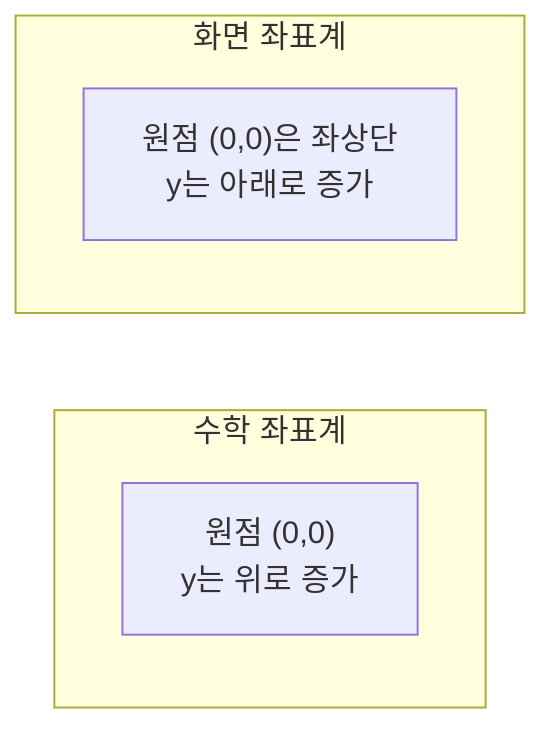

<Callout type="info">
  **이번 문서의 목표:** 화면 좌표계가 수학 좌표계와 왜 다른 방향을 가지는지 설명할 수 있고, 윈도우와 뷰포트의 역할 차이를 구분할 수 있으며, 픽셀·해상도·종횡비 사이의 관계를 계산할 수 있게 된다.
</Callout>

## 왜 좌표계를 따로 배우는가

01편에서 그래픽스 파이프라인이 3차원 좌표를 2차원 화면의 픽셀로 바꾼다는 흐름을 살펴봤습니다. 그런데 "화면"이라는 공간 자체가 어떤 규칙으로 좌표를 매기는지 모르면, 이후 04편의 변환 행렬이나 06편의 클리핑 계산에서 어느 방향으로 얼마나 이동했는지를 헷갈리게 됩니다. 이번 편은 계산에 들어가기 전에 **화면이라는 좌표 공간을 읽는 감각**을 잡는 편입니다.

## 1. 화면 좌표계 — y축이 왜 뒤집혀 있는가

> **쉽게 말하면:** 수학 시간에 배운 좌표평면은 오른쪽 위로 갈수록 x, y가 커지지만, 화면 좌표계는 대부분 오른쪽 아래로 갈수록 x, y가 커집니다.

우리가 중·고등학교에서 배운 **데카르트 좌표계**(Cartesian Coordinate System)는 원점을 중심으로 오른쪽으로 갈수록 x가 커지고, **위**로 갈수록 y가 커집니다. 그런데 컴퓨터 화면에서 널리 쓰이는 **화면 좌표계**(Screen Coordinate System, 스크린 좌표계)는 보통 왼쪽 위 모서리를 원점 `(0, 0)`으로 두고, 오른쪽으로 갈수록 x가 커지는 것은 같지만 **아래**로 갈수록 y가 커집니다.

이렇게 방향이 뒤집힌 이유는 화면을 출력하는 하드웨어의 역사적인 동작 방식에서 비롯됩니다. 옛날 CRT(브라운관) 모니터는 전자빔이 화면의 **왼쪽 위**에서 시작해 한 줄씩 오른쪽으로 훑고, 그 줄이 끝나면 한 칸 아래로 내려가 다시 왼쪽부터 훑는 방식으로 화면을 그렸습니다. 이 순서를 그대로 좌표에 반영하다 보니, 화면의 첫 픽셀(왼쪽 위)이 원점이 되고 아래로 내려갈수록 y 값이 커지는 규칙이 표준으로 굳어졌습니다.

이 차이는 04편에서 회전 변환을 계산할 때 특히 중요합니다. 수학 좌표계 기준으로 "반시계 방향 회전"으로 유도한 공식을, y축이 뒤집힌 화면 좌표계에 그대로 적용하면 실제 화면에서는 시계 방향으로 회전한 것처럼 보입니다. 이 과목에서는 특별한 언급이 없는 한 **수학 좌표계**(y가 위로 증가)를 기준으로 변환 공식을 유도하고 계산하되, 실제 화면에 그리는 결과물을 상상할 때는 이 y축 방향 차이를 함께 염두에 두어야 합니다.

**자주 틀리는 점:** "화면 좌표계에서는 원점이 화면 중앙에 있고 y는 위로 증가한다"는 설명이 오답으로 나올 수 있습니다. 일반적인 화면 좌표계의 원점은 **왼쪽 위**이고 y는 **아래로** 증가한다는 점이 표준적인 정의입니다.

## 2. 윈도우와 뷰포트 — 무엇을, 어디에 보여줄 것인가

컴퓨터그래픽스에서 **윈도우**(Window)와 **뷰포트**(Viewport)는 이름이 비슷해 보이지만 서로 다른 역할을 하는 개념으로, 06편의 클리핑·좌표 변환에서 계속 등장합니다.

- **윈도우**: 세계 좌표계(World Coordinate System, 물체들이 실제로 배치되어 있는 가상의 좌표 공간) 안에서, **어디까지를 화면에 보여줄 것인지** 정하는 직사각형 영역입니다. 카메라가 바라보는 장면의 범위라고 생각할 수 있습니다.
- **뷰포트**: 실제 화면(장치 좌표계, Device Coordinate System) 안에서, 윈도우로 잘라낸 장면을 **어느 위치에 어느 크기로 표시할지** 정하는 직사각형 영역입니다.

> **쉽게 말하면:** 윈도우는 "세상의 어느 부분을 찍을 것인가"를 정하는 카메라의 촬영 범위이고, 뷰포트는 "그 사진을 화면의 어디에, 얼마나 크게 붙여 놓을 것인가"를 정하는 액자입니다.

예를 들어 세계 좌표계에서 가로 200, 세로 100 크기의 영역(윈도우)을 지정했는데, 이를 화면의 가로 800, 세로 400 픽셀 크기의 영역(뷰포트)에 표시하고 싶다면, 가로·세로 모두 4배로 확대해서 대응시켜야 합니다. 이 대응 관계를 계산하는 것이 **윈도우-뷰포트 변환**(Window-to-Viewport Transformation)이며, 06편에서 실제 좌표 변환 공식을 이용해 자세히 계산합니다. 여기서는 "윈도우는 세계 좌표계의 범위, 뷰포트는 화면 좌표계의 범위"라는 역할 구분만 확실히 잡아 두면 충분합니다.

**자주 틀리는 점:** 윈도우와 뷰포트를 서로 바꿔서, "뷰포트는 세계 좌표계에서 보여줄 범위를 정하는 영역이다"처럼 설명하는 함정이 나올 수 있습니다. 세계 좌표계 쪽은 윈도우, 화면(장치) 좌표계 쪽은 뷰포트라는 대응을 정확히 기억해야 합니다.

## 3. 픽셀, 해상도, 종횡비

**픽셀**(Pixel, Picture Element의 줄임말)은 화면을 구성하는 가장 작은 단위의 점입니다. 화면에 보이는 모든 이미지는 이 픽셀 하나하나에 색상 값을 지정한 결과입니다.

**해상도**(Resolution)는 화면(또는 이미지)의 가로·세로 방향으로 몇 개의 픽셀이 배열되어 있는지를 나타내는 값입니다. 예를 들어 `1920 x 1080` 해상도는 가로로 1920개, 세로로 1080개의 픽셀이 배열되어 있다는 뜻이며, 전체 픽셀 수는 다음과 같이 계산합니다.

$$
1920 \times 1080 = 2{,}073{,}600
$$

- $1920$: 가로 방향 픽셀 수
- $1080$: 세로 방향 픽셀 수
- 계산 결과 약 207만 개의 픽셀이 화면 전체를 구성한다는 의미이며, 이를 "약 200만 화소" 또는 "2메가픽셀급 해상도"라고 부르기도 합니다.

**종횡비**(Aspect Ratio, 화면비)는 가로와 세로의 비율을 가장 간단한 정수비로 나타낸 값입니다. `1920 x 1080` 해상도의 종횡비를 구해 보겠습니다.

$$
\gcd(1920, 1080) = 120
$$

- $\gcd$(Greatest Common Divisor, 최대공약수): 두 수를 나누어떨어지게 하는 가장 큰 수

$$
\frac{1920}{120} : \frac{1080}{120} = 16 : 9
$$

두 값을 최대공약수 120으로 각각 나누면 `16 : 9`라는 익숙한 비율이 나옵니다. 이 비율이 바로 흔히 말하는 "16 대 9 화면"입니다. 만약 이 화면 그대로 표시해야 할 그림을 종횡비가 다른 뷰포트(예: `4 : 3`)에 억지로 채워 넣으면, 원과 정사각형이 타원과 직사각형처럼 찌그러져 보이는 왜곡이 발생합니다. 이 때문에 06편의 윈도우-뷰포트 변환에서는 종횡비를 유지할지 여부가 계산 방식에 영향을 줍니다.

> **비유:** 종횡비가 다른 화면에 억지로 맞추는 것은, 가로로 긴 사진을 정사각형 액자에 늘려서 끼워 맞추는 것과 같습니다. 사진 속 사람의 얼굴이 옆으로 넓적하게 찌그러져 보입니다.

**자주 틀리는 점:** 해상도가 높다고 해서 항상 화면의 물리적 크기(인치)가 크다는 뜻은 아닙니다. 해상도는 픽셀의 **개수**를 나타내는 값이고, 같은 해상도라도 화면의 물리적 크기가 다르면 픽셀 하나의 크기(따라서 화질의 선명함, 픽셀 밀도)가 달라집니다.

## 핵심 정리

- 화면 좌표계는 보통 왼쪽 위를 원점으로 하고 아래로 갈수록 y가 커지는 방향을 가지며, 수학 좌표계(y가 위로 증가)와 방향이 반대다.
- 윈도우는 세계 좌표계에서 보여줄 범위, 뷰포트는 화면(장치) 좌표계에서 그 범위를 표시할 위치와 크기이며, 이 대응 관계를 계산하는 것이 윈도우-뷰포트 변환이다.
- 픽셀은 화면을 구성하는 최소 단위이고, 해상도는 가로·세로 픽셀 개수, 종횡비는 가로·세로 비율을 최대공약수로 약분한 값이다.
- 종횡비가 다른 화면에 억지로 맞추면 도형이 찌그러지는 왜곡이 발생한다.

## 마무리 복습

<Quiz
  questionNumber={1}
  question="일반적인 화면 좌표계에 대한 설명으로 가장 적절한 것은?"
  options={['원점은 화면 중앙에 있고 y는 위로 갈수록 커진다', '원점은 왼쪽 위에 있고 y는 아래로 갈수록 커진다', '원점은 오른쪽 아래에 있고 x는 왼쪽으로 갈수록 커진다', '원점은 왼쪽 아래에 있고 y는 위로 갈수록 커진다']}
  correctAnswer={2}
  explanation="화면 좌표계는 CRT 모니터가 전자빔으로 화면을 그리던 방식에서 비롯되어, 보통 왼쪽 위를 원점으로 삼고 아래로 갈수록 y 값이 커지는 규칙을 따른다."
  optionExplanations={['화면 중앙을 원점으로 하고 y가 위로 증가하는 것은 수학 좌표계에 가까운 설명이다.', '왼쪽 위가 원점이고 y가 아래로 증가한다는 설명이 화면 좌표계의 표준 정의와 일치한다.', 'x가 왼쪽으로 갈수록 커진다는 설명은 화면 좌표계의 일반적인 정의와 다르다.', '왼쪽 아래를 원점으로 하고 y가 위로 증가하는 것은 화면 좌표계보다는 수학 좌표계에 가깝다.']}
/>

<Quiz
  questionNumber={2}
  question="윈도우(Window)와 뷰포트(Viewport)의 관계에 대한 설명으로 가장 적절한 것은?"
  options={['윈도우는 화면 좌표계에서 표시 위치를 정하고, 뷰포트는 세계 좌표계에서 보여줄 범위를 정한다', '윈도우는 세계 좌표계에서 보여줄 범위를 정하고, 뷰포트는 화면 좌표계에서 표시 위치와 크기를 정한다', '윈도우와 뷰포트는 항상 동일한 크기를 가져야 한다', '윈도우는 픽셀의 색상 값을 저장하는 메모리이다']}
  correctAnswer={2}
  explanation="윈도우는 세계 좌표계 안에서 화면에 보여줄 범위를 정하는 영역이고, 뷰포트는 그 범위를 실제 화면(장치 좌표계)의 어느 위치에 어느 크기로 표시할지 정하는 영역이다."
  optionExplanations={['윈도우와 뷰포트의 좌표계 대응이 서로 뒤바뀐 설명이다.', '세계 좌표계의 범위는 윈도우, 화면 좌표계의 표시 위치·크기는 뷰포트라는 설명이 정의와 일치한다.', '윈도우와 뷰포트는 크기가 달라도 되며, 그 차이를 대응시키는 것이 윈도우-뷰포트 변환이다.', '픽셀 색상 값을 저장하는 메모리는 프레임버퍼이며 윈도우와는 다른 개념이다.']}
/>

<Quiz
  questionNumber={3}
  question="해상도가 1920 x 1080인 화면의 종횡비로 가장 적절한 것은?"
  options={['4 : 3', '16 : 9', '3 : 2', '21 : 9']}
  correctAnswer={2}
  explanation="1920과 1080의 최대공약수는 120이며, 두 값을 120으로 나누면 각각 16과 9가 되어 종횡비는 16 : 9이다."
  optionExplanations={['4 : 3은 1920 x 1080과는 다른 종횡비이다.', '1920과 1080을 최대공약수 120으로 약분하면 16 : 9가 나온다.', '3 : 2는 1920 x 1080의 종횡비와 다르다.', '21 : 9는 초광각 화면 등에 쓰이는 종횡비로 1920 x 1080과는 다르다.']}
/>

<Quiz
  questionNumber={4}
  question="종횡비가 다른 뷰포트에 그림을 억지로 맞춰 표시했을 때 나타나는 현상으로 가장 적절한 것은?"
  options={['화면의 해상도가 자동으로 높아진다', '원이나 정사각형 같은 도형이 타원이나 직사각형처럼 찌그러져 보인다', '프레임버퍼의 저장 용량이 줄어든다', '클리핑 연산이 완전히 생략된다']}
  correctAnswer={2}
  explanation="원본과 다른 종횡비의 영역에 그림을 강제로 채우면 가로와 세로의 비율이 원본과 달라지므로, 원이 타원으로, 정사각형이 직사각형으로 찌그러져 보이는 왜곡이 발생한다."
  optionExplanations={['종횡비 변경이 해상도 자체를 높이지는 않는다.', '가로·세로 비율이 달라지면서 도형이 찌그러져 보인다는 설명이 종횡비 왜곡의 결과와 일치한다.', '프레임버퍼 용량은 해상도에 따라 달라지며 종횡비 왜곡과는 직접 관련이 없다.', '클리핑은 종횡비와 무관하게 화면 밖 영역을 제거하는 별도의 단계다.']}
/>

<Quiz
  questionNumber={5}
  question="픽셀(Pixel)에 대한 설명으로 가장 적절한 것은?"
  options={['화면을 구성하는 가장 작은 단위의 점이다', '세계 좌표계에서 보여줄 범위를 정하는 영역이다', '3차원 물체의 정점 좌표를 정의하는 단위다', '벡터 그래픽스에서만 사용되는 단위다']}
  correctAnswer={1}
  explanation="픽셀은 Picture Element의 줄임말로, 화면에 표시되는 이미지를 구성하는 가장 작은 단위의 점이다."
  optionExplanations={['화면을 구성하는 최소 단위의 점이라는 설명이 픽셀의 정의와 일치한다.', '보여줄 범위를 정하는 영역은 윈도우에 대한 설명이다.', '정점 좌표를 정의하는 것은 모델링 단계에서 이루어지는 작업이다.', '픽셀은 래스터 그래픽스의 기본 단위이며 벡터 그래픽스와는 직접 관련이 없다.']}
/>

<Quiz
  questionNumber={6}
  question="가로 400, 세로 200 크기의 세계 좌표계 윈도우를 가로 1200, 세로 600 픽셀의 뷰포트에 표시하려고 한다. 가로·세로 각각 몇 배로 확대해야 하는가?"
  options={['가로 2배, 세로 2배', '가로 3배, 세로 3배', '가로 3배, 세로 2배', '가로 2배, 세로 3배']}
  correctAnswer={2}
  explanation="가로는 1200을 400으로 나눈 3배, 세로는 600을 200으로 나눈 3배이므로 가로·세로 모두 3배로 확대해야 원본 비율을 유지하면서 뷰포트에 채울 수 있다."
  optionExplanations={['가로·세로 배율을 2배로 계산하면 실제 비율과 맞지 않는다.', '가로 1200 나누기 400은 3, 세로 600 나누기 200도 3이므로 이 계산이 올바르다.', '세로 배율을 2배로 계산한 것은 600 나누기 200의 결과와 맞지 않는다.', '가로 배율을 2배로 계산한 것은 1200 나누기 400의 결과와 맞지 않는다.']}
/>

## 참고 자료

- [MDN - CanvasRenderingContext2D: clip() method](https://developer.mozilla.org/en-US/docs/Web/API/CanvasRenderingContext2D/clip)
- [국가평생교육진흥원 독학학위제 - 과목별 평가영역](https://bdes.nile.or.kr/nile/study/nStudy2_1.do)
