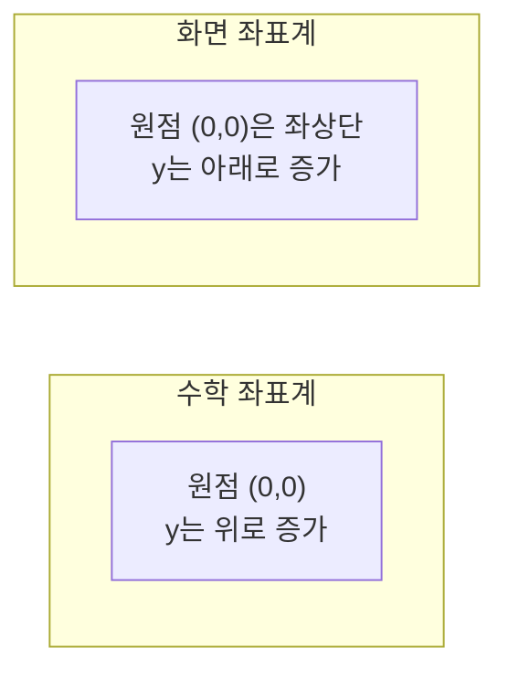

## 왜 좌표계를 따로 배우는가

01편에서 그래픽스 파이프라인이 3차원 좌표를 2차원 화면의 픽셀로 바꾼다는 흐름을 살펴봤습니다. 그런데 "화면"이라는 공간 자체가 어떤 규칙으로 좌표를 매기는지 모르면, 이후 04편의 변환 행렬이나 06편의 클리핑 계산에서 어느 방향으로 얼마나 이동했는지를 헷갈리게 됩니다.

## 1. 화면 좌표계 — y축이 왜 뒤집혀 있는가

우리가 중·고등학교에서 배운 **데카르트 좌표계**(Cartesian Coordinate System)는 원점을 중심으로 오른쪽으로 갈수록 x가 커지고, **위**로 갈수록 y가 커집니다. 그런데 컴퓨터 화면에서 널리 쓰이는 **화면 좌표계**(Screen Coordinate System, 스크린 좌표계)는 보통 왼쪽 위 모서리를 원점 `(0, 0)`으로 두고, 오른쪽으로 갈수록 x가 커지는 것은 같지만 **아래**로 갈수록 y가 커집니다.

```mermaid
graph LR
  subgraph 수학 좌표계
  M["원점 (0,0)<br/>y는 위로 증가"]
  end
  subgraph 화면 좌표계
  S["원점 (0,0)은 좌상단<br/>y는 아래로 증가"]
  end
```

이렇게 방향이 뒤집힌 이유는 화면을 출력하는 하드웨어의 역사적인 동작 방식에서 비롯됩니다. 옛날 CRT(브라운관) 모니터는 전자빔이 화면의 **왼쪽 위**에서 시작해 한 줄씩 오른쪽으로 훑고, 그 줄이 끝나면 한 칸 아래로 내려가 다시 왼쪽부터 훑는 방식으로 화면을 그렸습니다.

이 차이는 04편에서 회전 변환을 계산할 때 특히 중요합니다. 이 과목에서는 특별한 언급이 없는 한 **수학 좌표계**(y가 위로 증가)를 기준으로 변환 공식을 유도하고 계산하되, 실제 화면에 그리는 결과물을 상상할 때는 이 y축 방향 차이를 함께 염두에 두어야 합니다.

**자주 틀리는 점:** "화면 좌표계에서는 원점이 화면 중앙에 있고 y는 위로 증가한다"는 설명이 오답으로 나올 수 있습니다. 일반적인 화면 좌표계의 원점은 **왼쪽 위**이고 y는 **아래로** 증가한다는 점이 표준적인 정의입니다.

## 2. 윈도우와 뷰포트 — 무엇을, 어디에 보여줄 것인가

컴퓨터그래픽스에서 **윈도우**(Window)와 **뷰포트**(Viewport)는 이름이 비슷해 보이지만 서로 다른 역할을 하는 개념으로, 06편의 클리핑·좌표 변환에서 계속 등장합니다.

- **윈도우**: 세계 좌표계(World Coordinate System, 물체들이 실제로 배치되어 있는 가상의 좌표 공간) 안에서, **어디까지를 화면에 보여줄 것인지** 정하는 직사각형 영역입니다. 카메라가 바라보는 장면의 범위라고 생각할 수 있습니다.
- **뷰포트**: 실제 화면(장치 좌표계, Device Coordinate System) 안에서, 윈도우로 잘라낸 장면을 **어느 위치에 어느 크기로 표시할지** 정하는 직사각형 영역입니다.

```mermaid
graph LR
  W["세계 좌표계의 윈도우<br/>(보여줄 범위)"] -->|윈도우-뷰포트 변환| V["장치 좌표계의 뷰포트<br/>(화면에 표시할 위치·크기)"]
```

예를 들어 세계 좌표계에서 가로 200, 세로 100 크기의 영역(윈도우)을 지정했는데, 이를 화면의 가로 800, 세로 400 픽셀 크기의 영역(뷰포트)에 표시하고 싶다면, 가로·세로 모두 4배로 확대해서 대응시켜야 합니다. 이 대응 관계를 계산하는 것이 **윈도우-뷰포트 변환**(Window-to-Viewport Transformation)이며, 06편에서 실제 좌표 변환 공식을 이용해 자세히 계산합니다.

**자주 틀리는 점:** 윈도우와 뷰포트를 서로 바꿔서, "뷰포트는 세계 좌표계에서 보여줄 범위를 정하는 영역이다"처럼 설명하는 함정이 나올 수 있습니다. 세계 좌표계 쪽은 윈도우, 화면(장치) 좌표계 쪽은 뷰포트라는 대응을 정확히 기억해야 합니다.

## 3. 픽셀, 해상도, 종횡비

**픽셀**(Pixel, Picture Element의 줄임말)은 화면을 구성하는 가장 작은 단위의 점입니다. 화면에 보이는 모든 이미지는 이 픽셀 하나하나에 색상 값을 지정한 결과입니다.

**해상도**(Resolution)는 화면(또는 이미지)의 가로·세로 방향으로 몇 개의 픽셀이 배열되어 있는지를 나타내는 값입니다. 예를 들어 `1920 x 1080` 해상도는 가로로 1920개, 세로로 1080개의 픽셀이 배열되어 있다는 뜻이며, 전체 픽셀 수는 다음과 같이 계산합니다.

$$
1920 \times 1080 = 2{,}073{,}600
$$

- $1920$: 가로 방향 픽셀 수
- $1080$: 세로 방향 픽셀 수
- 계산 결과 약 207만 개의 픽셀이 화면 전체를 구성한다는 의미이며, 이를 "약 200만 화소" 또는 "2메가픽셀급 해상도"라고 부르기도 합니다.

**종횡비**(Aspect Ratio, 화면비)는 가로와 세로의 비율을 가장 간단한 정수비로 나타낸 값입니다. `1920 x 1080` 해상도의 종횡비를 구해 보겠습니다.

$$
\gcd(1920, 1080) = 120
$$

- $\gcd$(Greatest Common Divisor, 최대공약수): 두 수를 나누어떨어지게 하는 가장 큰 수

$$
\frac{1920}{120} : \frac{1080}{120} = 16 : 9
$$

두 값을 최대공약수 120으로 각각 나누면 `16 : 9`라는 익숙한 비율이 나옵니다. 이 비율이 바로 흔히 말하는 "16 대 9 화면"입니다.

**자주 틀리는 점:** 해상도가 높다고 해서 항상 화면의 물리적 크기(인치)가 크다는 뜻은 아닙니다. 해상도는 픽셀의 **개수**를 나타내는 값이고, 같은 해상도라도 화면의 물리적 크기가 다르면 픽셀 하나의 크기(따라서 화질의 선명함, 픽셀 밀도)가 달라집니다.

## 핵심 정리

- 화면 좌표계는 보통 왼쪽 위를 원점으로 하고 아래로 갈수록 y가 커지는 방향을 가지며, 수학 좌표계(y가 위로 증가)와 방향이 반대다.
- 윈도우는 세계 좌표계에서 보여줄 범위, 뷰포트는 화면(장치) 좌표계에서 그 범위를 표시할 위치와 크기이며, 이 대응 관계를 계산하는 것이 윈도우-뷰포트 변환이다.
- 픽셀은 화면을 구성하는 최소 단위이고, 해상도는 가로·세로 픽셀 개수, 종횡비는 가로·세로 비율을 최대공약수로 약분한 값이다.
- 종횡비가 다른 화면에 억지로 맞추면 도형이 찌그러지는 왜곡이 발생한다.

## 마무리 복습

<Quiz
  questionNumber={1}
  question={"일반적인 화면 좌표계에 대한 설명으로 가장 적절한 것은?"}
  options={["원점은 화면 중앙에 있고 y는 위로 갈수록 커진다","원점은 왼쪽 위에 있고 y는 아래로 갈수록 커진다","원점은 오른쪽 아래에 있고 x는 왼쪽으로 갈수록 커진다","원점은 왼쪽 아래에 있고 y는 위로 갈수록 커진다"]}
  correctAnswer={2}
  explanation={"화면 좌표계는 CRT 모니터가 전자빔으로 화면을 그리던 방식에서 비롯되어, 보통 왼쪽 위를 원점으로 삼고 아래로 갈수록 y 값이 커지는 규칙을 따른다."}
/>

<Quiz
  questionNumber={2}
  question={"윈도우(Window)와 뷰포트(Viewport)의 관계에 대한 설명으로 가장 적절한 것은?"}
  options={["윈도우는 화면 좌표계에서 표시 위치를 정하고, 뷰포트는 세계 좌표계에서 보여줄 범위를 정한다","윈도우는 세계 좌표계에서 보여줄 범위를 정하고, 뷰포트는 화면 좌표계에서 표시 위치와 크기를 정한다","윈도우와 뷰포트는 항상 동일한 크기를 가져야 한다","윈도우는 픽셀의 색상 값을 저장하는 메모리이다"]}
  correctAnswer={2}
  explanation={"윈도우는 세계 좌표계 안에서 화면에 보여줄 범위를 정하는 영역이고, 뷰포트는 그 범위를 실제 화면(장치 좌표계)의 어느 위치에 어느 크기로 표시할지 정하는 영역이다."}
/>

<Quiz
  questionNumber={3}
  question={"해상도가 1920 x 1080인 화면의 종횡비로 가장 적절한 것은?"}
  options={["4 : 3","16 : 9","3 : 2","21 : 9"]}
  correctAnswer={2}
  explanation={"1920과 1080의 최대공약수는 120이며, 두 값을 120으로 나누면 각각 16과 9가 되어 종횡비는 16 : 9이다."}
/>

## 참고 자료

- [MDN - CanvasRenderingContext2D: clip() method](https://developer.mozilla.org/en-US/docs/Web/API/CanvasRenderingContext2D/clip)
- [국가평생교육진흥원 독학학위제 - 과목별 평가영역](https://bdes.nile.or.kr/nile/study/nStudy2_1.do)
