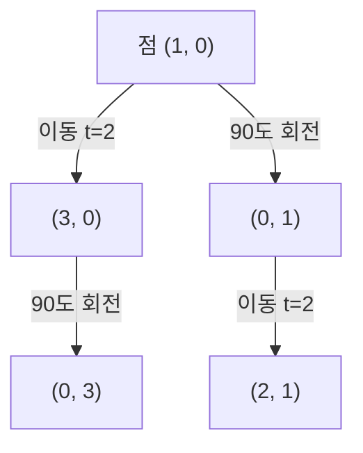

<Callout type="info">
  **이번 문서의 목표:** 평행이동·회전·스케일 각각의 3x3 동차좌표 변환 행렬을 실제 점에 곱해 결과 좌표를 구할 수 있고, 여러 변환을 합성할 때 곱하는 순서에 따라 결과가 달라지는 이유를 설명할 수 있게 된다.
</Callout>

## 왜 동차좌표로 다시 시작하는가

03편에서 2차원 점의 평행이동을 표현하려면 $(x, y)$가 아니라 동차좌표 $(x, y, 1)$과 $3 \times 3$ 행렬이 필요하다는 것을 확인했습니다. 이번 편은 그 도구를 이용해 컴퓨터그래픽스의 세 가지 기본 변환인 **평행이동**(Translation), **회전**(Rotation), **스케일**(Scale, 확대·축소)의 행렬을 하나씩 정의하고, 실제 점에 곱해 결과 좌표까지 손으로 계산합니다. 마지막으로 이 세 변환을 순서대로 합쳐서 적용하는 **합성 변환**(Composite Transformation)에서, 곱하는 순서를 바꾸면 결과가 완전히 달라진다는 것을 숫자로 직접 확인합니다.

## 1. 평행이동(Translation)

> **쉽게 말하면:** 평행이동은 도형을 회전하거나 크기를 바꾸지 않고, 그대로 밀어서 다른 위치로 옮기는 것입니다.

점을 $x$ 방향으로 $t_x$만큼, $y$ 방향으로 $t_y$만큼 옮기는 평행이동 행렬은 다음과 같습니다.

$$
T(t_x, t_y) = \begin{bmatrix} 1 & 0 & t_x \\ 0 & 1 & t_y \\ 0 & 0 & 1 \end{bmatrix}
$$

- $t_x$: x축 방향 이동 거리(양수면 오른쪽, 음수면 왼쪽)
- $t_y$: y축 방향 이동 거리(양수면 위쪽, 음수면 아래쪽 — 수학 좌표계 기준)

점 $(3, 2)$를 $t_x = 4,\ t_y = -1$만큼 평행이동해 보겠습니다. 즉 점 $(3, 2)$를 오른쪽으로 4, 아래로 1만큼 옮깁니다.

$$
\begin{bmatrix} 1 & 0 & 4 \\ 0 & 1 & -1 \\ 0 & 0 & 1 \end{bmatrix} \begin{bmatrix} 3 \\ 2 \\ 1 \end{bmatrix} = \begin{bmatrix} 1 \times 3 + 0 \times 2 + 4 \times 1 \\ 0 \times 3 + 1 \times 2 + (-1) \times 1 \\ 0 \times 3 + 0 \times 2 + 1 \times 1 \end{bmatrix} = \begin{bmatrix} 7 \\ 1 \\ 1 \end{bmatrix}
$$

- 첫 번째 행: $1 \times 3 + 0 \times 2 + 4 \times 1 = 7$ → 새 x좌표
- 두 번째 행: $0 \times 3 + 1 \times 2 + (-1) \times 1 = 1$ → 새 y좌표
- 결과: 점 $(3, 2)$가 평행이동을 거쳐 점 $(7, 1)$이 되었다. $x$좌표는 $3 + 4 = 7$, $y$좌표는 $2 + (-1) = 1$로, 단순히 이동 거리만큼 더해진 값과 일치한다.

**자주 틀리는 점:** 평행이동 행렬의 세 번째 열에 $t_x, t_y$를 넣지 않고 대각선 자리에 넣는 실수가 잦습니다. 대각선 자리(1행 1열, 2행 2열)는 항상 1을 유지해야 확대·축소가 함께 일어나지 않으며, 이동량은 반드시 **세 번째 열**에 들어가야 합니다.

## 2. 회전(Rotation)

> **쉽게 말하면:** 회전은 원점을 중심으로 도형을 시계 반대 방향(또는 방향을 지정해 시계 방향)으로 일정한 각도만큼 돌리는 것입니다.

원점을 기준으로 각도 $\theta$(세타)만큼 반시계 방향으로 회전시키는 행렬은 다음과 같습니다.

$$
R(\theta) = \begin{bmatrix} \cos\theta & -\sin\theta & 0 \\ \sin\theta & \cos\theta & 0 \\ 0 & 0 & 1 \end{bmatrix}
$$

- $\theta$(세타): 회전할 각도(반시계 방향을 양수로 둔다)
- $\cos\theta$(코사인 세타), $\sin\theta$(사인 세타): 직각삼각형에서 각도에 대응하는 인접변·대변의 비율을 나타내는 삼각함수 값으로, 회전 후 좌표를 원래 좌표의 조합으로 계산할 때 쓰인다.

점 $(1, 0)$을 원점을 기준으로 $90$도 반시계 방향으로 회전시켜 보겠습니다. $90$도에서 $\cos 90° = 0$, $\sin 90° = 1$입니다.

$$
\begin{bmatrix} 0 & -1 & 0 \\ 1 & 0 & 0 \\ 0 & 0 & 1 \end{bmatrix} \begin{bmatrix} 1 \\ 0 \\ 1 \end{bmatrix} = \begin{bmatrix} 0 \times 1 + (-1) \times 0 + 0 \times 1 \\ 1 \times 1 + 0 \times 0 + 0 \times 1 \\ 0 \times 1 + 0 \times 0 + 1 \times 1 \end{bmatrix} = \begin{bmatrix} 0 \\ 1 \\ 1 \end{bmatrix}
$$

- 첫 번째 행: $0 \times 1 + (-1) \times 0 + 0 \times 1 = 0$ → 새 x좌표
- 두 번째 행: $1 \times 1 + 0 \times 0 + 0 \times 1 = 1$ → 새 y좌표
- 결과: 점 $(1, 0)$이 원점 기준 $90$도 반시계 회전을 거쳐 점 $(0, 1)$이 되었다. x축 위에 있던 점이 정확히 y축 위로 이동한 것으로, 실제로 사분면을 손으로 그려 봐도 직관과 일치한다.

> **자주 틀리는 점:** 02편에서 다뤘듯, 이 회전 공식은 y가 위로 증가하는 **수학 좌표계**를 기준으로 유도되었습니다. y축이 아래로 증가하는 화면 좌표계에 그대로 적용해 그림을 그리면, 계산상으로는 반시계 방향이라도 화면에는 시계 방향으로 도는 것처럼 보일 수 있습니다. 이 과목의 계산 문제는 특별한 언급이 없는 한 수학 좌표계를 기준으로 풉니다.

## 3. 스케일(Scale, 확대·축소)

> **쉽게 말하면:** 스케일은 원점을 기준으로 도형을 x축·y축 방향으로 각각 정해진 배율만큼 늘리거나 줄이는 것입니다.

x축 방향으로 $s_x$배, y축 방향으로 $s_y$배 확대·축소하는 행렬은 다음과 같습니다.

$$
S(s_x, s_y) = \begin{bmatrix} s_x & 0 & 0 \\ 0 & s_y & 0 \\ 0 & 0 & 1 \end{bmatrix}
$$

- $s_x$: x축 방향 배율(1보다 크면 확대, 1보다 작으면 축소)
- $s_y$: y축 방향 배율

점 $(2, 3)$을 $s_x = 3,\ s_y = 2$로 확대해 보겠습니다.

$$
\begin{bmatrix} 3 & 0 & 0 \\ 0 & 2 & 0 \\ 0 & 0 & 1 \end{bmatrix} \begin{bmatrix} 2 \\ 3 \\ 1 \end{bmatrix} = \begin{bmatrix} 3 \times 2 + 0 \times 3 + 0 \times 1 \\ 0 \times 2 + 2 \times 3 + 0 \times 1 \\ 0 \times 2 + 0 \times 3 + 1 \times 1 \end{bmatrix} = \begin{bmatrix} 6 \\ 6 \\ 1 \end{bmatrix}
$$

- 첫 번째 행: $3 \times 2 = 6$ → 새 x좌표
- 두 번째 행: $2 \times 3 = 6$ → 새 y좌표
- 결과: 점 $(2, 3)$이 스케일 변환을 거쳐 점 $(6, 6)$이 되었다. 원점에서 멀리 떨어진 점일수록 스케일 변환의 영향을 크게 받는다는 점도 함께 기억해 둔다(원점 자체는 항상 원점에 그대로 남는다).

**자주 틀리는 점:** 스케일의 기준점을 원점이 아닌 다른 점(예: 도형의 중심)으로 착각하는 경우가 많습니다. 위 행렬 $S(s_x, s_y)$는 **원점을 기준**으로 확대·축소합니다. 도형의 중심을 기준으로 확대하고 싶다면, "중심을 원점으로 평행이동 → 스케일 → 다시 원래 위치로 평행이동"이라는 세 단계를 합성해야 하며, 이것이 다음 절의 합성 변환입니다.

## 4. 합성 변환 — 순서가 결과를 바꾼다

**합성 변환**(Composite Transformation)은 이동·회전·스케일 같은 기본 변환을 두 개 이상 순서대로 적용하는 것입니다. 동차좌표를 쓰면 여러 변환 행렬을 먼저 하나로 곱해 놓은 뒤, 그 결과 행렬을 점에 한 번만 곱하면 됩니다.

$$
P' = M_2 (M_1 P) = (M_2 M_1) P
$$

- $P$: 원래 점의 동차좌표
- $M_1$: 먼저 적용할 변환 행렬
- $M_2$: 나중에 적용할 변환 행렬
- $P'$: 두 변환을 모두 적용한 뒤의 점
- 행렬 곱셈은 결합법칙이 성립하므로 $M_2(M_1 P)$와 $(M_2 M_1)P$는 같은 결과를 낸다. 즉 점에 한 번씩 두 번 곱하는 대신, 행렬끼리 먼저 곱해 하나의 합성 행렬을 만들어 둘 수 있다.

여기서 반드시 유의해야 할 점은 **행렬 곱셈이 교환법칙을 만족하지 않는다**는 것입니다(03편에서 확인한 성질). 따라서 "이동 후 회전"과 "회전 후 이동"은 일반적으로 서로 다른 결과를 낳습니다. 점 $(1, 0)$을 예로 들어 두 순서를 직접 비교해 보겠습니다. 사용할 변환은 "x축으로 2만큼 평행이동"과 "원점 기준 90도 반시계 회전"입니다.

**순서 1: 먼저 평행이동한 뒤 회전한다.** 점 $(1, 0)$을 $t_x = 2$만큼 이동하면 $(3, 0)$이 됩니다.

$$
\begin{bmatrix} 1 & 0 & 2 \\ 0 & 1 & 0 \\ 0 & 0 & 1 \end{bmatrix} \begin{bmatrix} 1 \\ 0 \\ 1 \end{bmatrix} = \begin{bmatrix} 1 \times 1 + 0 \times 0 + 2 \times 1 \\ 0 \times 1 + 1 \times 0 + 0 \times 1 \\ 0 \times 1 + 0 \times 0 + 1 \times 1 \end{bmatrix} = \begin{bmatrix} 3 \\ 0 \\ 1 \end{bmatrix}
$$

이제 이 결과 $(3, 0)$을 원점 기준 $90$도 반시계 회전시킵니다.

$$
\begin{bmatrix} 0 & -1 & 0 \\ 1 & 0 & 0 \\ 0 & 0 & 1 \end{bmatrix} \begin{bmatrix} 3 \\ 0 \\ 1 \end{bmatrix} = \begin{bmatrix} 0 \times 3 + (-1) \times 0 + 0 \times 1 \\ 1 \times 3 + 0 \times 0 + 0 \times 1 \\ 0 \times 3 + 0 \times 0 + 1 \times 1 \end{bmatrix} = \begin{bmatrix} 0 \\ 3 \\ 1 \end{bmatrix}
$$

- "이동 후 회전" 순서의 최종 결과: 점 $(1, 0)$ → 점 $(0, 3)$

**순서 2: 먼저 회전한 뒤 평행이동한다.** 점 $(1, 0)$을 원점 기준 $90$도 반시계 회전시키면, 앞서 계산한 것처럼 $(0, 1)$이 됩니다. 이제 이 결과 $(0, 1)$을 $t_x = 2$만큼 평행이동합니다.

$$
\begin{bmatrix} 1 & 0 & 2 \\ 0 & 1 & 0 \\ 0 & 0 & 1 \end{bmatrix} \begin{bmatrix} 0 \\ 1 \\ 1 \end{bmatrix} = \begin{bmatrix} 1 \times 0 + 0 \times 1 + 2 \times 1 \\ 0 \times 0 + 1 \times 1 + 0 \times 1 \\ 0 \times 0 + 0 \times 1 + 1 \times 1 \end{bmatrix} = \begin{bmatrix} 2 \\ 1 \\ 1 \end{bmatrix}
$$

- "회전 후 이동" 순서의 최종 결과: 점 $(1, 0)$ → 점 $(2, 1)$

같은 두 변환, 같은 원래 점에서 출발했는데도 순서를 바꾸었더니 최종 결과가 $(0, 3)$과 $(2, 1)$로 완전히 다르게 나왔습니다. 이 차이가 생기는 이유는 회전이 항상 **원점을 중심**으로 일어나기 때문입니다. 먼저 이동을 하면 점이 원점에서 멀리 떨어진 채로 회전을 하게 되어 큰 원을 그리듯 이동하고, 먼저 회전을 하면 원점 가까이에서 방향만 바뀐 뒤에 이동하게 됩니다.

> **비유:** 놀이터에서 그네를 타고 있는 사람을 옆으로 2미터 옮긴 다음 그네를 90도 돌리는 것과, 먼저 그네를 90도 돌린 다음 그 자리에서 옆으로 2미터 옮기는 것은 도착 지점이 다릅니다. 회전축(그네의 지지대)이 고정되어 있기 때문에, 회전 전에 얼마나 멀리 있었는지가 회전 후 도착 지점을 바꿉니다.

이 성질 때문에 도형의 중심을 기준으로 회전시키고 싶을 때는 "중심을 원점으로 옮기는 평행이동 → 회전 → 원래 위치로 되돌리는 평행이동"의 순서를 반드시 지켜야 하며, 이 순서를 반대로 쓰면 전혀 다른 위치에 도형이 그려집니다.

**자주 틀리는 점:** "행렬의 합성은 곱셈이므로 순서를 바꿔도 결과가 같다"는 설명은 오답입니다. 행렬 곱셈은 일반적으로 교환법칙이 성립하지 않으므로, 그래픽스의 합성 변환에서는 **적용 순서**가 최종 결과를 결정하는 핵심 요소입니다.

## 핵심 정리

- 평행이동 행렬은 대각선을 1로 유지하고 세 번째 열에 이동 거리 $t_x, t_y$를 넣으며, 동차좌표에 곱하면 단순히 좌표에 이동 거리를 더한 결과가 나온다.
- 회전 행렬은 $\cos\theta, \sin\theta$로 구성되며 원점을 중심으로 반시계 방향 회전을 표현한다. 화면 좌표계(y가 아래로 증가)에서는 시각적으로 반대 방향처럼 보일 수 있다.
- 스케일 행렬은 대각선에 배율 $s_x, s_y$를 넣으며 원점을 기준으로 확대·축소한다.
- 여러 변환을 합성할 때는 행렬을 먼저 곱해 하나의 합성 행렬을 만들 수 있지만, 행렬 곱셈은 교환법칙이 성립하지 않으므로 "이동 후 회전"과 "회전 후 이동"은 결과가 다르다.

## 마무리 복습

<Quiz
  questionNumber={1}
  question="점 (3, 2)를 x축으로 4, y축으로 -1만큼 평행이동한 결과로 가장 적절한 것은?"
  options={['(7, 1)', '(-1, 3)', '(12, -2)', '(3, 2)']}
  correctAnswer={1}
  explanation="평행이동 행렬을 동차좌표 (3, 2, 1)에 곱하면 x좌표는 3+4=7, y좌표는 2+(-1)=1이 되어 결과는 (7, 1)이다."
  optionExplanations={['이동 거리를 그대로 더한 결과 7과 1이 계산과 일치한다.', '(-1, 3)은 이동 방향과 값을 뒤바꾼 결과로 계산과 맞지 않는다.', '(12, -2)는 곱셈으로 계산한 값으로 평행이동에는 덧셈이 적용되어야 한다.', '(3, 2)는 이동이 전혀 적용되지 않은 원래 좌표다.']}
/>

<Quiz
  questionNumber={2}
  question="점 (1, 0)을 원점을 기준으로 90도 반시계 방향으로 회전시킨 결과로 가장 적절한 것은?"
  options={['(0, 1)', '(1, 0)', '(-1, 0)', '(0, -1)']}
  correctAnswer={1}
  explanation="90도 회전 행렬의 cos90=0, sin90=1을 이용해 계산하면 새 x좌표는 0x1+(-1)x0=0, 새 y좌표는 1x1+0x0=1이 되어 결과는 (0, 1)이다."
  optionExplanations={['cos90=0, sin90=1을 대입한 계산 결과와 일치한다.', '(1, 0)은 회전이 적용되지 않은 원래 좌표다.', '(-1, 0)은 180도 회전에 해당하는 결과다.', '(0, -1)은 시계 방향 90도 회전(또는 -90도 반시계 회전)에 해당하는 결과다.']}
/>

<Quiz
  questionNumber={3}
  question="점 (2, 3)을 x축 방향 3배, y축 방향 2배로 확대(원점 기준 스케일)한 결과로 가장 적절한 것은?"
  options={['(6, 6)', '(5, 5)', '(2, 3)', '(9, 4)']}
  correctAnswer={1}
  explanation="스케일 행렬의 대각 성분 3과 2를 각각 x, y좌표에 곱하면 3x2=6, 2x3=6이 되어 결과는 (6, 6)이다."
  optionExplanations={['3x2=6, 2x3=6의 계산 결과와 일치한다.', '(5, 5)는 곱셈이 아니라 임의의 값을 더한 결과로 스케일 변환 규칙과 맞지 않는다.', '(2, 3)은 스케일이 적용되지 않은 원래 좌표다.', '(9, 4)는 배율을 서로 뒤바꾸거나 잘못 계산한 값이다.']}
/>

<Quiz
  questionNumber={4}
  question="점 (1, 0)에 x축으로 2만큼 평행이동한 뒤 원점 기준 90도 반시계 회전을 적용한 결과로 가장 적절한 것은?"
  options={['(0, 3)', '(2, 1)', '(3, 0)', '(0, 1)']}
  correctAnswer={1}
  explanation="먼저 (1,0)을 2만큼 이동하면 (3,0)이 되고, 이를 90도 회전시키면 새 x좌표는 0x3+(-1)x0=0, 새 y좌표는 1x3+0x0=3이 되어 최종 결과는 (0, 3)이다."
  optionExplanations={['이동 후 회전의 계산 순서를 그대로 따른 결과와 일치한다.', '(2, 1)은 회전을 먼저 하고 이동을 나중에 적용한 순서의 결과다.', '(3, 0)은 이동만 적용하고 회전을 적용하지 않은 중간 결과다.', '(0, 1)은 이동 없이 회전만 적용한 경우의 결과다.']}
/>

<Quiz
  questionNumber={5}
  question="점 (1, 0)에 원점 기준 90도 반시계 회전을 먼저 적용한 뒤 x축으로 2만큼 평행이동한 결과로 가장 적절한 것은?"
  options={['(2, 1)', '(0, 3)', '(1, 2)', '(3, 1)']}
  correctAnswer={1}
  explanation="먼저 (1,0)을 90도 회전시키면 (0,1)이 되고, 이를 x축으로 2만큼 이동하면 x좌표는 0+2=2, y좌표는 1+0=1이 되어 최종 결과는 (2, 1)이다."
  optionExplanations={['회전 후 이동의 계산 순서를 그대로 따른 결과와 일치한다.', '(0, 3)은 이동을 먼저 하고 회전을 나중에 적용한 순서의 결과다.', '(1, 2)는 x, y좌표를 뒤바꾼 값으로 계산 규칙과 맞지 않는다.', '(3, 1)은 이동 거리를 잘못 더한 값이다.']}
/>

<Quiz
  questionNumber={6}
  question="합성 변환에서 이동과 회전의 적용 순서를 바꾸면 결과가 달라지는 이유로 가장 적절한 것은?"
  options={['행렬 곱셈에서 교환법칙이 일반적으로 성립하지 않고, 회전은 항상 원점을 중심으로 일어나기 때문이다', '평행이동 행렬과 회전 행렬의 크기가 서로 다르기 때문이다', '컴퓨터가 부동소수점 연산에서 오차를 일으키기 때문이다', '동차좌표를 사용하면 항상 순서와 무관하게 같은 결과가 나오기 때문이다']}
  correctAnswer={1}
  explanation="행렬 곱셈은 일반적으로 교환법칙이 성립하지 않으며, 회전은 항상 원점을 중심으로 이루어지므로 이동을 먼저 해서 점이 원점에서 멀어진 상태로 회전하는 것과, 원점 가까이에서 회전한 뒤 이동하는 것은 결과가 다르다."
  optionExplanations={['교환법칙 미성립과 원점 중심 회전이라는 두 가지 이유가 순서에 따른 결과 차이의 근본 원인이다.', '평행이동과 회전 모두 동차좌표에서는 동일하게 3x3 행렬로 표현되므로 크기 차이는 이유가 아니다.', '부동소수점 오차는 결과가 완전히 달라지는 이유로 보기 어렵다.', '동차좌표를 사용해도 행렬 곱셈의 교환법칙이 성립하지 않으므로 순서에 따라 결과가 달라진다.']}
/>

## 참고 자료

- [MDN - Transformations - Canvas API](https://developer.mozilla.org/en-US/docs/Web/API/Canvas_API/Tutorial/Transformations)
- [국가평생교육진흥원 독학학위제 - 과목별 평가영역](https://bdes.nile.or.kr/nile/study/nStudy2_1.do)
