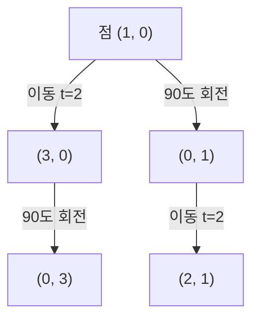

## 왜 동차좌표로 다시 시작하는가

03편에서 2차원 점의 평행이동을 표현하려면 $(x, y)$가 아니라 동차좌표 $(x, y, 1)$과 $3 \times 3$ 행렬이 필요하다는 것을 확인했습니다. 마지막으로 이 세 변환을 순서대로 합쳐서 적용하는 **합성 변환**(Composite Transformation)에서, 곱하는 순서를 바꾸면 결과가 완전히 달라진다는 것을 숫자로 직접 확인합니다.

## 1. 평행이동(Translation)

점을 $x$ 방향으로 $t_x$만큼, $y$ 방향으로 $t_y$만큼 옮기는 평행이동 행렬은 다음과 같습니다.

$$
T(t_x, t_y) = \begin{bmatrix} 1 & 0 & t_x \\ 0 & 1 & t_y \\ 0 & 0 & 1 \end{bmatrix}
$$

- $t_x$: x축 방향 이동 거리(양수면 오른쪽, 음수면 왼쪽)
- $t_y$: y축 방향 이동 거리(양수면 위쪽, 음수면 아래쪽 — 수학 좌표계 기준)

점 $(3, 2)$를 $t_x = 4,\ t_y = -1$만큼 평행이동해 보겠습니다. 즉 점 $(3, 2)$를 오른쪽으로 4, 아래로 1만큼 옮깁니다.

$$
\begin{bmatrix} 1 & 0 & 4 \\ 0 & 1 & -1 \\ 0 & 0 & 1 \end{bmatrix} \begin{bmatrix} 3 \\ 2 \\ 1 \end{bmatrix} = \begin{bmatrix} 1 \times 3 + 0 \times 2 + 4 \times 1 \\ 0 \times 3 + 1 \times 2 + (-1) \times 1 \\ 0 \times 3 + 0 \times 2 + 1 \times 1 \end{bmatrix} = \begin{bmatrix} 7 \\ 1 \\ 1 \end{bmatrix}
$$

- 첫 번째 행: $1 \times 3 + 0 \times 2 + 4 \times 1 = 7$ → 새 x좌표
- 두 번째 행: $0 \times 3 + 1 \times 2 + (-1) \times 1 = 1$ → 새 y좌표
- 결과: 점 $(3, 2)$가 평행이동을 거쳐 점 $(7, 1)$이 되었다. $x$좌표는 $3 + 4 = 7$, $y$좌표는 $2 + (-1) = 1$로, 단순히 이동 거리만큼 더해진 값과 일치한다.

**자주 틀리는 점:** 평행이동 행렬의 세 번째 열에 $t_x, t_y$를 넣지 않고 대각선 자리에 넣는 실수가 잦습니다. 대각선 자리(1행 1열, 2행 2열)는 항상 1을 유지해야 확대·축소가 함께 일어나지 않으며, 이동량은 반드시 **세 번째 열**에 들어가야 합니다.

## 2. 회전(Rotation)

원점을 기준으로 각도 $\theta$(세타)만큼 반시계 방향으로 회전시키는 행렬은 다음과 같습니다.

$$
R(\theta) = \begin{bmatrix} \cos\theta & -\sin\theta & 0 \\ \sin\theta & \cos\theta & 0 \\ 0 & 0 & 1 \end{bmatrix}
$$

- $\theta$(세타): 회전할 각도(반시계 방향을 양수로 둔다)
- $\cos\theta$(코사인 세타), $\sin\theta$(사인 세타): 직각삼각형에서 각도에 대응하는 인접변·대변의 비율을 나타내는 삼각함수 값으로, 회전 후 좌표를 원래 좌표의 조합으로 계산할 때 쓰인다.

점 $(1, 0)$을 원점을 기준으로 $90$도 반시계 방향으로 회전시켜 보겠습니다. $90$도에서 $\cos 90° = 0$, $\sin 90° = 1$입니다.

$$
\begin{bmatrix} 0 & -1 & 0 \\ 1 & 0 & 0 \\ 0 & 0 & 1 \end{bmatrix} \begin{bmatrix} 1 \\ 0 \\ 1 \end{bmatrix} = \begin{bmatrix} 0 \times 1 + (-1) \times 0 + 0 \times 1 \\ 1 \times 1 + 0 \times 0 + 0 \times 1 \\ 0 \times 1 + 0 \times 0 + 1 \times 1 \end{bmatrix} = \begin{bmatrix} 0 \\ 1 \\ 1 \end{bmatrix}
$$

- 첫 번째 행: $0 \times 1 + (-1) \times 0 + 0 \times 1 = 0$ → 새 x좌표
- 두 번째 행: $1 \times 1 + 0 \times 0 + 0 \times 1 = 1$ → 새 y좌표
- 결과: 점 $(1, 0)$이 원점 기준 $90$도 반시계 회전을 거쳐 점 $(0, 1)$이 되었다. x축 위에 있던 점이 정확히 y축 위로 이동한 것으로, 실제로 사분면을 손으로 그려 봐도 직관과 일치한다.

> **자주 틀리는 점:** 02편에서 다뤘듯, 이 회전 공식은 y가 위로 증가하는 **수학 좌표계**를 기준으로 유도되었습니다. y축이 아래로 증가하는 화면 좌표계에 그대로 적용해 그림을 그리면, 계산상으로는 반시계 방향이라도 화면에는 시계 방향으로 도는 것처럼 보일 수 있습니다. 이 과목의 계산 문제는 특별한 언급이 없는 한 수학 좌표계를 기준으로 풉니다.

## 3. 스케일(Scale, 확대·축소)

x축 방향으로 $s_x$배, y축 방향으로 $s_y$배 확대·축소하는 행렬은 다음과 같습니다.

$$
S(s_x, s_y) = \begin{bmatrix} s_x & 0 & 0 \\ 0 & s_y & 0 \\ 0 & 0 & 1 \end{bmatrix}
$$

- $s_x$: x축 방향 배율(1보다 크면 확대, 1보다 작으면 축소)
- $s_y$: y축 방향 배율

점 $(2, 3)$을 $s_x = 3,\ s_y = 2$로 확대해 보겠습니다.

$$
\begin{bmatrix} 3 & 0 & 0 \\ 0 & 2 & 0 \\ 0 & 0 & 1 \end{bmatrix} \begin{bmatrix} 2 \\ 3 \\ 1 \end{bmatrix} = \begin{bmatrix} 3 \times 2 + 0 \times 3 + 0 \times 1 \\ 0 \times 2 + 2 \times 3 + 0 \times 1 \\ 0 \times 2 + 0 \times 3 + 1 \times 1 \end{bmatrix} = \begin{bmatrix} 6 \\ 6 \\ 1 \end{bmatrix}
$$

- 첫 번째 행: $3 \times 2 = 6$ → 새 x좌표
- 두 번째 행: $2 \times 3 = 6$ → 새 y좌표
- 결과: 점 $(2, 3)$이 스케일 변환을 거쳐 점 $(6, 6)$이 되었다. 원점에서 멀리 떨어진 점일수록 스케일 변환의 영향을 크게 받는다는 점도 함께 기억해 둔다(원점 자체는 항상 원점에 그대로 남는다).

**자주 틀리는 점:** 스케일의 기준점을 원점이 아닌 다른 점(예: 도형의 중심)으로 착각하는 경우가 많습니다. 위 행렬 $S(s_x, s_y)$는 **원점을 기준**으로 확대·축소합니다.

## 4. 합성 변환 — 순서가 결과를 바꾼다

**합성 변환**(Composite Transformation)은 이동·회전·스케일 같은 기본 변환을 두 개 이상 순서대로 적용하는 것입니다. 동차좌표를 쓰면 여러 변환 행렬을 먼저 하나로 곱해 놓은 뒤, 그 결과 행렬을 점에 한 번만 곱하면 됩니다.

$$
P' = M_2 (M_1 P) = (M_2 M_1) P
$$

- $P$: 원래 점의 동차좌표
- $M_1$: 먼저 적용할 변환 행렬
- $M_2$: 나중에 적용할 변환 행렬
- $P'$: 두 변환을 모두 적용한 뒤의 점
- 행렬 곱셈은 결합법칙이 성립하므로 $M_2(M_1 P)$와 $(M_2 M_1)P$는 같은 결과를 낸다. 즉 점에 한 번씩 두 번 곱하는 대신, 행렬끼리 먼저 곱해 하나의 합성 행렬을 만들어 둘 수 있다.

여기서 반드시 유의해야 할 점은 **행렬 곱셈이 교환법칙을 만족하지 않는다**는 것입니다(03편에서 확인한 성질). 따라서 "이동 후 회전"과 "회전 후 이동"은 일반적으로 서로 다른 결과를 낳습니다.

**순서 1: 먼저 평행이동한 뒤 회전한다.** 점 $(1, 0)$을 $t_x = 2$만큼 이동하면 $(3, 0)$이 됩니다.

$$
\begin{bmatrix} 1 & 0 & 2 \\ 0 & 1 & 0 \\ 0 & 0 & 1 \end{bmatrix} \begin{bmatrix} 1 \\ 0 \\ 1 \end{bmatrix} = \begin{bmatrix} 1 \times 1 + 0 \times 0 + 2 \times 1 \\ 0 \times 1 + 1 \times 0 + 0 \times 1 \\ 0 \times 1 + 0 \times 0 + 1 \times 1 \end{bmatrix} = \begin{bmatrix} 3 \\ 0 \\ 1 \end{bmatrix}
$$

이제 이 결과 $(3, 0)$을 원점 기준 $90$도 반시계 회전시킵니다.

$$
\begin{bmatrix} 0 & -1 & 0 \\ 1 & 0 & 0 \\ 0 & 0 & 1 \end{bmatrix} \begin{bmatrix} 3 \\ 0 \\ 1 \end{bmatrix} = \begin{bmatrix} 0 \times 3 + (-1) \times 0 + 0 \times 1 \\ 1 \times 3 + 0 \times 0 + 0 \times 1 \\ 0 \times 3 + 0 \times 0 + 1 \times 1 \end{bmatrix} = \begin{bmatrix} 0 \\ 3 \\ 1 \end{bmatrix}
$$

- "이동 후 회전" 순서의 최종 결과: 점 $(1, 0)$ → 점 $(0, 3)$

**순서 2: 먼저 회전한 뒤 평행이동한다.** 점 $(1, 0)$을 원점 기준 $90$도 반시계 회전시키면, 앞서 계산한 것처럼 $(0, 1)$이 됩니다. 이제 이 결과 $(0, 1)$을 $t_x = 2$만큼 평행이동합니다.

$$
\begin{bmatrix} 1 & 0 & 2 \\ 0 & 1 & 0 \\ 0 & 0 & 1 \end{bmatrix} \begin{bmatrix} 0 \\ 1 \\ 1 \end{bmatrix} = \begin{bmatrix} 1 \times 0 + 0 \times 1 + 2 \times 1 \\ 0 \times 0 + 1 \times 1 + 0 \times 1 \\ 0 \times 0 + 0 \times 1 + 1 \times 1 \end{bmatrix} = \begin{bmatrix} 2 \\ 1 \\ 1 \end{bmatrix}
$$

- "회전 후 이동" 순서의 최종 결과: 점 $(1, 0)$ → 점 $(2, 1)$

같은 두 변환, 같은 원래 점에서 출발했는데도 순서를 바꾸었더니 최종 결과가 $(0, 3)$과 $(2, 1)$로 완전히 다르게 나왔습니다. 이 차이가 생기는 이유는 회전이 항상 **원점을 중심**으로 일어나기 때문입니다.

```mermaid
graph TD
  P0["점 (1, 0)"] -->|이동 t=2| A["(3, 0)"]
  A -->|90도 회전| B["(0, 3)"]
  P0 -->|90도 회전| C["(0, 1)"]
  C -->|이동 t=2| D["(2, 1)"]
```

이 성질 때문에 도형의 중심을 기준으로 회전시키고 싶을 때는 "중심을 원점으로 옮기는 평행이동 → 회전 → 원래 위치로 되돌리는 평행이동"의 순서를 반드시 지켜야 하며, 이 순서를 반대로 쓰면 전혀 다른 위치에 도형이 그려집니다.

**자주 틀리는 점:** "행렬의 합성은 곱셈이므로 순서를 바꿔도 결과가 같다"는 설명은 오답입니다. 행렬 곱셈은 일반적으로 교환법칙이 성립하지 않으므로, 그래픽스의 합성 변환에서는 **적용 순서**가 최종 결과를 결정하는 핵심 요소입니다.

## 핵심 정리

- 평행이동 행렬은 대각선을 1로 유지하고 세 번째 열에 이동 거리 $t_x, t_y$를 넣으며, 동차좌표에 곱하면 단순히 좌표에 이동 거리를 더한 결과가 나온다.
- 회전 행렬은 $\cos\theta, \sin\theta$로 구성되며 원점을 중심으로 반시계 방향 회전을 표현한다. 화면 좌표계(y가 아래로 증가)에서는 시각적으로 반대 방향처럼 보일 수 있다.
- 스케일 행렬은 대각선에 배율 $s_x, s_y$를 넣으며 원점을 기준으로 확대·축소한다.
- 여러 변환을 합성할 때는 행렬을 먼저 곱해 하나의 합성 행렬을 만들 수 있지만, 행렬 곱셈은 교환법칙이 성립하지 않으므로 "이동 후 회전"과 "회전 후 이동"은 결과가 다르다.

## 마무리 복습

<Quiz
  questionNumber={1}
  question={"점 (3, 2)를 x축으로 4, y축으로 -1만큼 평행이동한 결과로 가장 적절한 것은?"}
  options={["(7, 1)","(-1, 3)","(12, -2)","(3, 2)"]}
  correctAnswer={1}
  explanation={"평행이동 행렬을 동차좌표 (3, 2, 1)에 곱하면 x좌표는 3+4=7, y좌표는 2+(-1)=1이 되어 결과는 (7, 1)이다."}
/>

<Quiz
  questionNumber={2}
  question={"점 (1, 0)을 원점을 기준으로 90도 반시계 방향으로 회전시킨 결과로 가장 적절한 것은?"}
  options={["(0, 1)","(1, 0)","(-1, 0)","(0, -1)"]}
  correctAnswer={1}
  explanation={"90도 회전 행렬의 cos90=0, sin90=1을 이용해 계산하면 새 x좌표는 0x1+(-1)x0=0, 새 y좌표는 1x1+0x0=1이 되어 결과는 (0, 1)이다."}
/>

<Quiz
  questionNumber={3}
  question={"점 (2, 3)을 x축 방향 3배, y축 방향 2배로 확대(원점 기준 스케일)한 결과로 가장 적절한 것은?"}
  options={["(6, 6)","(5, 5)","(2, 3)","(9, 4)"]}
  correctAnswer={1}
  explanation={"스케일 행렬의 대각 성분 3과 2를 각각 x, y좌표에 곱하면 3x2=6, 2x3=6이 되어 결과는 (6, 6)이다."}
/>

## 참고 자료

- [MDN - Transformations - Canvas API](https://developer.mozilla.org/en-US/docs/Web/API/Canvas_API/Tutorial/Transformations)
- [국가평생교육진흥원 독학학위제 - 과목별 평가영역](https://bdes.nile.or.kr/nile/study/nStudy2_1.do)
