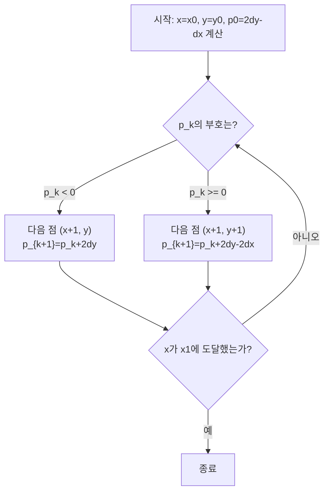

<Callout type="info">
  **이번 문서의 목표:** DDA와 Bresenham 선분 알고리즘을 실제 두 점 사이에서 한 단계씩 손으로 추적해 픽셀 좌표를 구할 수 있고, 두 알고리즘의 차이를 설명할 수 있으며, 미드포인트 원 알고리즘과 seed fill·boundary fill 영역 채우기의 동작 절차를 이해하게 된다.
</Callout>

## 왜 선분 하나를 그리는 데 알고리즘이 필요한가

화면은 정수 좌표를 가진 픽셀(pixel, 화면을 구성하는 최소 단위 사각형)의 격자입니다. 그런데 수학적인 직선은 $y = mx + b$처럼 실수 좌표 위에서 매끄럽게 이어집니다. 예를 들어 점 $(2, 3)$과 점 $(9, 6)$을 잇는 직선을 생각해 보면, 이 직선은 $x = 2.5$일 때 $y = 3.21\ldots$처럼 정수가 아닌 좌표를 지나갑니다. 하지만 모니터에는 그런 위치에 켤 수 있는 픽셀이 없습니다. 그래서 "실수 좌표의 직선을 어떤 정수 픽셀들로 근사할 것인가"를 정하는 절차가 필요하고, 이것이 바로 **래스터화**(Rasterization, 도형을 픽셀 격자로 바꾸는 과정)입니다. 이번 편에서 다루는 DDA와 Bresenham은 선분을 래스터화하는 대표적인 두 알고리즘이고, 미드포인트 원 알고리즘은 원을 같은 방식으로 다룹니다.

> **쉽게 말하면:** 선분·원 그리기 알고리즘은 "이상적인 수학 곡선에 가장 가까운 픽셀들을 어떤 순서와 규칙으로 켤 것인가"를 정하는 절차입니다.

## 1. DDA 알고리즘 — 실수 증분으로 따라가기

> **쉽게 말하면:** DDA는 시작점에서 끝점까지 가는 동안 $x$와 $y$를 매번 일정한 실수만큼 늘려가며 가장 가까운 정수 픽셀에 점을 찍는 방법입니다.

**DDA**(Digital Differential Analyzer, 디지털 미분 해석기)는 원래 미분방정식을 아날로그 회로로 풀던 장치의 이름에서 유래했습니다. 컴퓨터그래픽스에서는 선분의 기울기를 이용해 $x$ 또는 $y$ 중 변화가 더 큰 축을 기준으로 한 픽셀씩 증가시키고, 다른 축은 기울기만큼 실수 단위로 증가시킨 뒤 반올림해서 픽셀을 찍는 방식으로 동작합니다.

두 점 $(x_0, y_0)$에서 $(x_1, y_1)$까지 선분을 그린다고 하면, 다음 순서로 계산합니다.

$$
dx = x_1 - x_0, \quad dy = y_1 - y_0
$$

- $dx$: x좌표의 전체 변화량
- $dy$: y좌표의 전체 변화량

$$
\text{steps} = \max(|dx|, |dy|)
$$

- $\text{steps}$: 몇 번 반복해서 점을 찍을지 정하는 값으로, 더 많이 변하는 축의 변화량을 그대로 사용한다.

$$
x_{\text{inc}} = \frac{dx}{\text{steps}}, \quad y_{\text{inc}} = \frac{dy}{\text{steps}}
$$

- $x_{\text{inc}}$, $y_{\text{inc}}$: 한 단계마다 $x$, $y$에 더할 증분(increment). steps를 $\max(|dx|,|dy|)$로 잡았기 때문에 둘 중 하나는 반드시 1(또는 -1)이 되고, 다른 하나는 절댓값이 1보다 작은 소수가 된다.

이제 점 $(2, 3)$에서 점 $(9, 6)$까지 DDA로 선분을 그려 보겠습니다. $dx = 9 - 2 = 7$, $dy = 6 - 3 = 3$이므로 $\text{steps} = \max(7, 3) = 7$입니다.

$$
x_{\text{inc}} = \frac{7}{7} = 1, \quad y_{\text{inc}} = \frac{3}{7} \approx 0.4286
$$

매 단계마다 $x$에는 정확히 1을 더하고, $y$에는 $0.4286$을 누적해서 더한 뒤 반올림해 픽셀 좌표를 정합니다.

| 단계 $k$ | 실수 $x$ | 실수 $y$ | 반올림 픽셀 $(x, y)$ |
|---|---|---|---|
| 0 | 2.000 | 3.000 | (2, 3) |
| 1 | 3.000 | 3.429 | (3, 3) |
| 2 | 4.000 | 3.857 | (4, 4) |
| 3 | 5.000 | 4.286 | (5, 4) |
| 4 | 6.000 | 4.714 | (6, 5) |
| 5 | 7.000 | 5.143 | (7, 5) |
| 6 | 8.000 | 5.571 | (8, 6) |
| 7 | 9.000 | 6.000 | (9, 6) |

- 각 행의 실수 $y$는 이전 행의 실수 $y$에 $0.4286$을 더한 값이다. 예를 들어 3행($k=2$)의 $3.857$은 2행의 $3.429$에 $0.4286$을 더한 값이다.
- 반올림 픽셀 열은 실수 $y$를 소수점 첫째 자리에서 반올림한 정수다. $3.429$는 $3$으로, $3.857$은 $4$로 반올림된다.

DDA는 매 단계마다 실수 덧셈과 반올림 연산을 해야 하므로 계산량이 많고, 반올림 과정에서 누적 오차가 쌓일 수 있습니다. 이 두 가지 단점을 정수 연산만으로 해결한 것이 다음에 볼 Bresenham 알고리즘입니다.

**자주 틀리는 점:** steps를 항상 $dx$로만 계산하는 실수가 흔합니다. 만약 선분이 y축에 더 가깝게 기울어 있다면($|dy| > |dx|$), steps는 반드시 $|dy|$를 기준으로 잡아야 픽셀 사이에 빈틈이 생기지 않습니다.

## 2. Bresenham 선분 알고리즘 — 정수 연산으로 방향 결정

> **쉽게 말하면:** Bresenham 알고리즘은 실수 계산이나 반올림 없이, 정수로만 계산되는 "결정 변수"의 부호만 보고 다음 픽셀을 한 칸 위로 찍을지 그대로 찍을지 정하는 방법입니다.

**Bresenham 알고리즘**(Bresenham's Line Algorithm, 1965년 잭 브레젠험이 고안)은 기울기가 $0$과 $1$ 사이인 경우(즉 $x$가 1씩 증가할 때마다 $y$가 그대로 있거나 1만 증가하는 경우)를 기준으로 설명합니다. 매 단계마다 $x$는 항상 1씩 증가시키고, $y$를 그대로 둘지 1 증가시킬지를 **결정 변수**(decision parameter) $p_k$의 부호로 판단합니다.

$$
p_0 = 2\,dy - dx
$$

- $p_0$: 첫 번째 결정 변수의 초깃값
- $dx = x_1 - x_0$, $dy = y_1 - y_0$: 앞서 DDA에서와 같은 의미

이후 각 단계에서는 다음 규칙을 따릅니다.

- $p_k < 0$이면: 다음 점은 $(x_k + 1,\ y_k)$이고, $p_{k+1} = p_k + 2\,dy$
- $p_k \geq 0$이면: 다음 점은 $(x_k + 1,\ y_k + 1)$이고, $p_{k+1} = p_k + 2\,dy - 2\,dx$

이 규칙이 왜 성립하는지는, $p_k$가 "실제 직선이 다음 칸의 중간보다 위에 있는지 아래에 있는지"를 정수 곱셈만으로 나타낸 값이기 때문입니다. 원래는 오차 항에 분수가 섞이지만, 양변에 $2\,dx$를 곱해 분수를 없애 정수 연산만 남긴 것이 이 공식입니다.

앞서 DDA에서 사용한 것과 같은 점 $(2, 3)$에서 $(9, 6)$까지를 Bresenham 알고리즘으로 그려 보겠습니다. $dx = 7$, $dy = 3$이므로 $p_0 = 2(3) - 7 = -1$이고, 두 증분 값은 각각 $2\,dy = 6$, $2\,dy - 2\,dx = 6 - 14 = -8$입니다.

| 단계 $k$ | $p_k$ | 부호 판정 | 다음 픽셀 $(x, y)$ | $p_{k+1}$ 계산 |
|---|---|---|---|---|
| 0 | -1 | $p_0 < 0$ | (3, 3) | $-1 + 6 = 5$ |
| 1 | 5 | $p_1 \geq 0$ | (4, 4) | $5 - 8 = -3$ |
| 2 | -3 | $p_2 < 0$ | (5, 4) | $-3 + 6 = 3$ |
| 3 | 3 | $p_3 \geq 0$ | (6, 5) | $3 - 8 = -5$ |
| 4 | -5 | $p_4 < 0$ | (7, 5) | $-5 + 6 = 1$ |
| 5 | 1 | $p_5 \geq 0$ | (8, 6) | $1 - 8 = -7$ |
| 6 | -7 | $p_6 < 0$ | (9, 6) | (선분 끝, 계산 종료) |

- 시작점 $(2, 3)$부터 출발해, 표의 "다음 픽셀" 열이 매 단계 새로 찍는 점이다.
- 최종적으로 찍히는 픽셀 순서는 $(2,3), (3,3), (4,4), (5,4), (6,5), (7,5), (8,6), (9,6)$으로, 앞서 DDA로 구한 순서와 **정확히 일치**한다. 이 예제처럼 두 알고리즘은 결과가 같은 경우가 많지만, Bresenham은 덧셈·뺄셈만으로 정수 연산을 마친다는 점에서 계산 비용이 더 낮다.

**자주 틀리는 점:** $p_k \geq 0$일 때 $y$가 증가한다는 규칙과 $p_k < 0$일 때 $y$가 그대로라는 규칙을 반대로 외우는 경우가 많습니다. 결정 변수가 커진다는 것은 실제 직선이 위쪽 픽셀에 더 가깝다는 뜻이므로, $p_k \geq 0$일 때 $y$를 올린다고 기억하면 헷갈리지 않습니다.



## 3. DDA와 Bresenham 비교

| 구분 | DDA | Bresenham |
|---|---|---|
| 연산 종류 | 실수(부동소수점) 덧셈, 반올림 | 정수 덧셈·뺄셈, 부호 비교 |
| 계산 비용 | 상대적으로 높음(반올림 연산 포함) | 상대적으로 낮음(정수 연산만) |
| 누적 오차 | 반올림이 반복되며 오차가 쌓일 수 있음 | 결정 변수가 정수로 정확히 갱신되어 오차 누적 없음 |
| 하드웨어 구현 | 부동소수점 연산 장치가 필요 | 정수 연산 장치만으로 구현 가능 |
| 결과 픽셀 | 대부분 Bresenham과 동일하거나 매우 유사 | 이론적으로 가장 가까운 정수 픽셀을 정확히 선택 |

실제 그래픽스 하드웨어와 표준 라이브러리 대부분은 Bresenham 계열 알고리즘(또는 그 변형)을 채택합니다. 정수 연산만으로 동작해 속도가 빠르고, 임베디드 환경처럼 부동소수점 연산 장치가 없는 곳에서도 동작하기 때문입니다.

## 4. 미드포인트 원 알고리즘 — 원을 8등분해서 그리기

> **쉽게 말하면:** 원은 8방향 대칭이므로, 45도 구간 하나만 계산하고 나머지 7구간은 좌표를 뒤집기만 하면 됩니다.

원은 중심을 지나는 수직선·수평선·두 대각선을 기준으로 **8방향 대칭**을 가집니다. 즉 원 위의 한 점 $(x, y)$(중심이 원점이라고 가정)를 알면, $(\pm x, \pm y)$와 $(\pm y, \pm x)$ 조합으로 나머지 7개의 대칭점을 바로 얻을 수 있습니다. 그래서 **미드포인트 원 알고리즘**(Midpoint Circle Algorithm, Bresenham 방식을 원에 적용한 것)은 $x$가 $0$부터 시작해 $y$와 같아지는 지점까지, 즉 45도까지의 한 구간만 계산합니다.

이 구간에서는 $x$가 1씩 증가할 때 $y$는 그대로이거나 1씩 감소합니다. 이를 결정할 결정 변수는 다음과 같습니다.

$$
p_0 = 1 - r
$$

- $p_0$: 초기 결정 변수
- $r$: 원의 반지름

각 단계의 규칙은 다음과 같습니다.

- $p_k < 0$이면: 다음 점은 $(x_k + 1,\ y_k)$이고, $p_{k+1} = p_k + 2x_{k+1} + 1$
- $p_k \geq 0$이면: 다음 점은 $(x_k + 1,\ y_k - 1)$이고, $p_{k+1} = p_k + 2x_{k+1} + 1 - 2y_{k+1}$

반지름 $r = 5$인 원을 중심이 원점이라고 두고 계산해 보겠습니다. 시작점은 $(x, y) = (0, 5)$이고 $p_0 = 1 - 5 = -4$입니다.

| 단계 | 이전 $(x, y)$ | $p$ (판정 전) | 부호 판정 | 새 $(x, y)$ | 다음 $p$ |
|---|---|---|---|---|---|
| 1 | (0, 5) | -4 | $p < 0$ | (1, 5) | $-4 + 2(1) + 1 = -1$ |
| 2 | (1, 5) | -1 | $p < 0$ | (2, 5) | $-1 + 2(2) + 1 = 4$ |
| 3 | (2, 5) | 4 | $p \geq 0$ | (3, 4) | $4 + 2(3) + 1 - 2(4) = 3$ |
| 4 | (3, 4) | 3 | $p \geq 0$ | (4, 3) | (계산 종료: $x \geq y$) |

- $x$가 $y$와 같아지거나 커지는 순간(4단계에서 $x=4 > y=3$이 되기 직전) 45도 구간의 계산을 멈춘다.
- 이 구간에서 얻은 점은 $(0,5), (1,5), (2,5), (3,4), (4,3)$의 다섯 개다.

이 다섯 개의 점 각각에 8방향 대칭을 적용하면(예를 들어 $(3, 4)$는 $(3,4), (-3,4), (3,-4), (-3,-4), (4,3), (-4,3), (4,-3), (-4,-3)$의 8개 점으로 확장됩니다), 반지름 5인 원 전체의 픽셀을 계산 없이 바로 얻을 수 있습니다. 계산량을 8분의 1로 줄이는 것이 이 알고리즘의 핵심 이점입니다.

**자주 틀리는 점:** 8방향 대칭을 적용할 때 $(x, y)$와 $(y, x)$를 혼동해 대칭점을 잘못 찍는 경우가 많습니다. 45도 구간에서 계산한 점 $(x, y)$를 다른 구간으로 옮길 때는 $x$와 $y$의 좌표값 자체를 서로 바꿔치기(swap)한 $(y, x)$ 형태도 함께 사용해야 8개 점이 모두 정확히 나옵니다.

## 5. 영역 채우기 — seed fill과 boundary fill

> **쉽게 말하면:** 영역 채우기는 도형 내부의 한 점(씨앗점)에서 출발해, 이웃 픽셀로 번져 나가듯 색을 칠하는 방법입니다.

닫힌 도형의 윤곽선을 그린 뒤 내부를 색으로 채우려면, 내부의 한 점에서 시작해 경계에 닿을 때까지 이웃 픽셀들을 채워 나가는 절차가 필요합니다. 이 시작점을 **씨앗점**(seed point)이라고 부르고, 이 방식을 통칭 **seed fill**(씨앗 채우기)이라고 합니다. seed fill은 채우기를 멈추는 조건에 따라 두 가지로 나뉩니다.

- **boundary fill**(경계 채우기): 특정 **경계색**(boundary color)을 만날 때까지 채운다. "이 색이 아니면 계속 칠하되, 정해진 경계색을 만나면 멈춘다"는 조건이다.
- **flood fill**(범람 채우기): 내부가 이미 칠해진 색(배경색 등 특정 **내부색**)으로 통일되어 있다고 가정하고, "이 내부색과 같은 픽셀만 새 색으로 바꾼다"는 조건으로 채운다.

두 방식 모두 기본 절차는 같습니다. 현재 픽셀을 채우고, 4방향(위·아래·왼쪽·오른쪽, **4-연결**) 또는 8방향(대각선 포함, **8-연결**) 이웃 중 아직 채워지지 않고 경계도 아닌 픽셀을 찾아 같은 절차를 반복합니다. 재귀 호출이나 스택(stack, 나중에 넣은 것을 먼저 꺼내는 자료구조)을 이용해 "아직 방문하지 않은 이웃"을 계속 기록해 두었다가 순서대로 처리합니다.

작은 예를 들어 4-연결 boundary fill의 동작을 추적해 보겠습니다. 아래는 5×5 격자의 일부이며, `#`는 경계, `.`는 아직 채워지지 않은 내부, 숫자는 씨앗점입니다.

```text
. . # . .
. 0 # . .
# . . # .
. . # . .
```

씨앗점은 좌표 `(1,1)`(0행 0열을 기준으로 행, 열 순서)입니다. 스택을 이용한 4-연결 boundary fill의 처리 순서는 다음과 같습니다.

| 처리 순서 | 채우는 좌표 | 스택에 새로 쌓이는 이웃 |
|---|---|---|
| 1 | (1,1) 씨앗점 | (0,1), (1,0), (2,1) — (1,2)는 경계라 제외 |
| 2 | (2,1) | (3,1) — (2,0)은 이미 경계, (2,2)는 다음 순서에서 처리 |
| 3 | (3,1) | 새 이웃 없음(주변이 모두 경계이거나 격자 밖) |
| 4 | (1,0) | 새 이웃 없음((0,0)은 이미 스택에 없고 (2,0)은 경계) |
| 5 | (0,1) | (0,0) |
| 6 | (0,0) | 새 이웃 없음 |

- 스택에서 꺼내는 순서에 따라 채우는 순서는 달라질 수 있지만, 경계 `#`로 둘러싸인 내부 픽셀은 결국 모두 채워진다.
- 만약 경계선에 한 칸이라도 틈이 있다면, 채우기가 그 틈으로 새어나가 도형 바깥까지 칠해지는 "누출(leak)" 오류가 발생한다. 이는 boundary fill·flood fill 모두에서 가장 흔한 실무 오류다.

**자주 틀리는 점:** 4-연결과 8-연결을 구분하지 않고 사용하면, 대각선으로만 맞닿은 두 영역이 서로 다른 색으로 채워져야 하는데도 하나로 이어져 버리는 경우가 있습니다. 경계선이 대각선 방향으로 얇게 이어진 도형은 4-연결로 채워야 색이 새지 않는 경우가 많습니다.

## 핵심 정리

- DDA는 $\max(|dx|,|dy|)$를 기준으로 실수 증분을 누적하고 반올림해 픽셀을 찍으며, 계산은 직관적이지만 부동소수점 연산과 반올림 오차가 발생한다.
- Bresenham은 결정 변수 $p_k$의 부호만으로 다음 픽셀을 정수 연산만으로 결정하며, DDA와 같은 결과를 더 적은 비용으로 얻는다.
- 미드포인트 원 알고리즘은 원의 8방향 대칭을 이용해 45도 구간만 계산하고 나머지는 좌표를 바꿔 채운다.
- 영역 채우기는 씨앗점에서 이웃 픽셀로 번져나가며, 경계색을 기준으로 멈추면 boundary fill, 내부색을 기준으로 바꾸면 flood fill이라고 부른다.

## 마무리 복습

<Quiz
  questionNumber={1}
  question="점 (2, 3)에서 점 (9, 6)까지 DDA로 선분을 그릴 때 steps 값으로 가장 적절한 것은?"
  options={['7', '3', '9', '6']}
  correctAnswer={1}
  explanation="dx=9-2=7, dy=6-3=3이므로 steps=max(|dx|,|dy|)=max(7,3)=7이다."
  optionExplanations={['dx와 dy 중 더 큰 값인 7을 steps로 사용하는 것이 DDA의 규칙과 일치한다.', '3은 dy 값으로, steps를 dy로만 잡으면 x축 방향으로 픽셀 사이에 빈틈이 생긴다.', '9는 끝점의 x좌표일 뿐 steps 계산과는 관련이 없다.', '6은 끝점의 y좌표일 뿐 steps 계산과는 관련이 없다.']}
/>

<Quiz
  questionNumber={2}
  question="점 (2, 3)에서 점 (9, 6)까지 Bresenham 알고리즘을 적용할 때 초기 결정 변수 p0의 값으로 가장 적절한 것은?"
  options={['-1', '7', '3', '-8']}
  correctAnswer={1}
  explanation="dx=7, dy=3이므로 p0=2dy-dx=2(3)-7=6-7=-1이다."
  optionExplanations={['2dy-dx 공식에 dx=7, dy=3을 대입한 계산 결과와 일치한다.', '7은 dx 값 자체이며 p0 공식에 대입하기 전 원재료일 뿐이다.', '3은 dy 값 자체이며 p0 공식에 대입하기 전 원재료일 뿐이다.', '-8은 p0가 0 이상일 때 사용하는 증분 2dy-2dx의 값으로 초기값과는 다르다.']}
/>

<Quiz
  questionNumber={3}
  question="Bresenham 알고리즘에서 결정 변수 p_k가 0보다 크거나 같을 때 다음 픽셀로 가장 적절한 것은?"
  options={['(x_k+1, y_k+1)', '(x_k+1, y_k)', '(x_k, y_k+1)', '(x_k-1, y_k)']}
  correctAnswer={1}
  explanation="p_k가 0 이상이면 실제 직선이 위쪽 픽셀에 더 가깝다는 뜻이므로 x와 y를 모두 1씩 증가시킨 (x_k+1, y_k+1)을 다음 픽셀로 선택한다."
  optionExplanations={['결정 변수가 0 이상일 때 x, y를 모두 증가시키는 규칙과 일치한다.', 'x만 증가시키고 y를 그대로 두는 것은 p_k가 0보다 작을 때의 규칙이다.', 'x는 매 단계 반드시 1씩 증가해야 하므로 x를 그대로 두는 이 보기는 규칙과 맞지 않는다.', 'Bresenham 알고리즘은 시작점에서 끝점 방향으로만 진행하므로 x가 감소하는 경우는 없다.']}
/>

<Quiz
  questionNumber={4}
  question="DDA와 Bresenham 알고리즘을 비교한 설명으로 옳지 않은 것은?"
  options={['DDA는 정수 연산만 사용하고 Bresenham은 부동소수점 연산을 사용한다', 'Bresenham은 결정 변수의 부호만으로 다음 픽셀을 정한다', 'DDA는 반올림 과정에서 오차가 누적될 수 있다', '같은 두 점을 잇는 경우 두 알고리즘의 결과 픽셀은 대부분 일치한다']}
  correctAnswer={1}
  explanation="실제로는 반대다. DDA가 실수 증분과 반올림을 사용하는 부동소수점 연산 기반이고, Bresenham이 정수 덧셈·뺄셈만 사용하는 정수 연산 기반이다."
  optionExplanations={['DDA와 Bresenham의 연산 종류를 서로 바꿔 설명한 옳지 않은 진술이므로 이 보기가 정답이다.', 'Bresenham이 결정 변수의 부호만으로 다음 픽셀을 정한다는 설명은 본문 내용과 일치하는 옳은 진술이다.', 'DDA는 실수 반올림을 반복하므로 오차가 누적될 수 있다는 설명은 옳은 진술이다.', '본문 예제에서 확인했듯 같은 두 점에 대해 두 알고리즘의 결과가 대부분 일치한다는 설명은 옳은 진술이다.']}
/>

<Quiz
  questionNumber={5}
  question="반지름 5인 원에 미드포인트 원 알고리즘을 적용할 때 초기 결정 변수 p0의 값으로 가장 적절한 것은?"
  options={['-4', '5', '1', '-5']}
  correctAnswer={1}
  explanation="p0=1-r 공식에 r=5를 대입하면 p0=1-5=-4이다."
  optionExplanations={['1-r 공식에 반지름 5를 대입한 계산 결과와 일치한다.', '5는 반지름 값 자체이며 공식에 대입하기 전 원재료일 뿐이다.', '1은 공식의 상수항일 뿐 반지름을 대입하지 않은 값이다.', '-5는 반지름에 부호만 바꾼 값으로 공식 1-r과는 다르다.']}
/>

<Quiz
  questionNumber={6}
  question="미드포인트 원 알고리즘이 원의 8분의 1 구간만 계산해도 되는 이유로 가장 적절한 것은?"
  options={['원이 중심을 기준으로 8방향 대칭을 이루기 때문이다', '결정 변수 계산에 필요한 곱셈 횟수가 8번으로 고정되어 있기 때문이다', '반지름이 항상 8의 배수로 주어지기 때문이다', '8-연결 방식으로만 픽셀을 채우기 때문이다']}
  correctAnswer={1}
  explanation="원은 중심을 지나는 수평선, 수직선, 두 대각선을 축으로 8방향 대칭을 이루므로 45도 구간 하나만 계산하고 나머지 7개 구간은 좌표를 바꾸거나 부호를 바꿔 얻을 수 있다."
  optionExplanations={['8방향 대칭이라는 원의 기하학적 성질이 계산량을 8분의 1로 줄일 수 있는 실제 이유다.', '곱셈 횟수는 반지름 크기에 따라 달라지며 8로 고정되어 있지 않다.', '반지름은 임의의 양의 실수나 정수로 주어질 수 있으며 8의 배수일 필요가 없다.', '8-연결은 영역 채우기에서 이웃을 정의하는 방식이며 원 그리기 알고리즘과는 별개의 개념이다.']}
/>

## 참고 자료

- [MIT OCW - Graphics Pipeline and Rasterization](https://ocw.mit.edu/courses/6-837-computer-graphics-fall-2012/53d96abf747a3c82fd3497d2fea540f5_MIT6_837F12_Lec21.pdf)
- [KAIST Rendering Book](https://sgvr.kaist.ac.kr/~sungeui/render/rendering_book_1.1ed.pdf)
