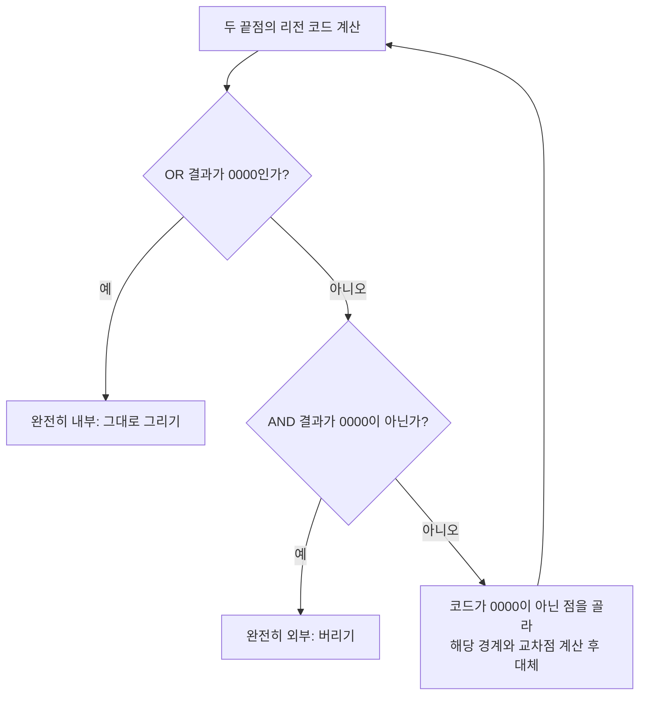

<Callout type="info">
  **이번 문서의 목표:** 윈도우 좌표를 뷰포트 좌표로 매핑하는 공식을 실제 점에 적용할 수 있고, Cohen-Sutherland 리전 코드와 Liang-Barsky 매개변수 방식으로 같은 선분을 각각 클리핑해 두 결과가 일치함을 확인할 수 있게 된다.
</Callout>

## 왜 화면 밖의 도형까지 계산하면 안 되는가

그래픽스 응용 프로그램은 보통 실제 세계 좌표(예: 지도 데이터, 3D 장면)로 도형을 정의한 뒤, 화면의 일부 사각형 영역에만 그 일부를 보여줍니다. 이때 두 가지 사각형을 구분해야 합니다. **윈도우**(window)는 사용자가 보고 싶은 세계 좌표 안의 관심 영역이고, **뷰포트**(viewport)는 그 내용을 실제로 표시할 화면(또는 화면 안의 한 영역) 좌표입니다. 예를 들어 지도 프로그램에서 위도·경도로 정의된 특정 구역(윈도우)을 골라, 그 구역을 1920×1080 픽셀 창(뷰포트)에 맞춰 그리는 것과 같습니다.

또한 윈도우 경계를 완전히 벗어난 도형까지 좌표 변환하고 픽셀을 계산하는 것은 낭비입니다. 화면에 보이지도 않을 도형을 끝까지 계산하면 성능이 크게 떨어지므로, 윈도우 경계를 기준으로 도형을 미리 잘라내는 절차가 필요합니다. 이것이 이번 편의 두 번째 주제인 **클리핑**(Clipping, 잘라내기)입니다.

> **쉽게 말하면:** 윈도우-뷰포트 변환은 "보고 싶은 영역을 화면 크기에 맞게 늘이거나 줄이는 것"이고, 클리핑은 "그 영역 밖으로 나간 부분을 미리 잘라내는 것"입니다.

## 1. 윈도우-뷰포트 변환

세계 좌표계의 윈도우 범위를 $x_{w,\min}, x_{w,\max}, y_{w,\min}, y_{w,\max}$라 하고, 화면(또는 화면 안 특정 영역)의 뷰포트 범위를 $x_{v,\min}, x_{v,\max}, y_{v,\min}, y_{v,\max}$라고 하면, 윈도우 안의 점 $(x_w, y_w)$를 뷰포트 좌표 $(x_v, y_v)$로 옮기는 식은 다음과 같습니다.

$$
x_v = x_{v,\min} + (x_w - x_{w,\min}) \cdot \frac{x_{v,\max} - x_{v,\min}}{x_{w,\max} - x_{w,\min}}
$$

- $x_w - x_{w,\min}$: 윈도우의 왼쪽 경계로부터 점이 얼마나 떨어져 있는지(윈도우 안에서의 상대 위치)
- $\dfrac{x_{v,\max} - x_{v,\min}}{x_{w,\max} - x_{w,\min}}$: 윈도우 너비와 뷰포트 너비의 비율(배율). 이 비율을 상대 위치에 곱하면 뷰포트 안에서의 상대 위치가 된다.
- $x_{v,\min}$: 뷰포트의 왼쪽 경계 좌표를 더해 절대 좌표로 바꾼다.

$y$좌표도 같은 구조로 계산합니다.

$$
y_v = y_{v,\min} + (y_w - y_{w,\min}) \cdot \frac{y_{v,\max} - y_{v,\min}}{y_{w,\max} - y_{w,\min}}
$$

세계 좌표 윈도우가 $x_{w,\min}=0, x_{w,\max}=100, y_{w,\min}=0, y_{w,\max}=100$이고, 이것을 $640 \times 480$ 화면 전체(뷰포트 $x_{v,\min}=0, x_{v,\max}=640, y_{v,\min}=0, y_{v,\max}=480$)에 매핑한다고 하겠습니다. 윈도우 안의 점 $(25, 50)$이 뷰포트의 어느 좌표로 매핑되는지 계산해 보겠습니다.

$$
x_v = 0 + (25 - 0) \cdot \frac{640 - 0}{100 - 0} = 25 \times 6.4 = 160
$$

$$
y_v = 0 + (50 - 0) \cdot \frac{480 - 0}{100 - 0} = 50 \times 4.8 = 240
$$

- 윈도우 너비 $100$이 뷰포트 너비 $640$으로 매핑되므로 배율은 $6.4$이고, 윈도우 높이 $100$이 뷰포트 높이 $480$으로 매핑되므로 배율은 $4.8$이다.
- 결과: 윈도우 좌표 $(25, 50)$은 뷰포트 좌표 $(160, 240)$에 그려진다.

**자주 틀리는 점:** 윈도우와 뷰포트의 가로세로 배율이 다르면($x$ 배율 $6.4$, $y$ 배율 $4.8$처럼) 도형이 원래 비율과 다르게 찌그러져 보입니다. 원래 형태를 유지하려면 두 배율을 같게 만들거나(가로세로 비율, **종횡비**를 유지), 종횡비를 맞추기 위해 여백을 두는 처리가 추가로 필요합니다.

## 2. Cohen-Sutherland 알고리즘 — 리전 코드로 빠르게 걸러내기

> **쉽게 말하면:** Cohen-Sutherland는 각 점이 클리핑 윈도우의 위·아래·왼쪽·오른쪽 중 어느 쪽 바깥에 있는지를 4비트 코드로 표시해, 계산 없이 바로 판정할 수 있는 경우를 먼저 걸러내는 방법입니다.

클리핑 윈도우를 $x_{\min}, x_{\max}, y_{\min}, y_{\max}$라고 할 때, 평면 전체를 이 윈도우를 기준으로 9개의 영역(윈도우 내부 1개 + 주변 8개)으로 나눕니다. 각 영역에 4비트 **리전 코드**(region code)를 부여하는데, 각 비트는 다음을 의미합니다(왼쪽부터 위·아래·오른쪽·왼쪽 순서).

| 비트 위치 | 의미 | 조건 |
|---|---|---|
| 1번째(맨 위) | 위쪽(top) | $y > y_{\max}$ |
| 2번째 | 아래쪽(bottom) | $y < y_{\min}$ |
| 3번째 | 오른쪽(right) | $x > x_{\max}$ |
| 4번째(맨 끝) | 왼쪽(left) | $x < x_{\min}$ |

예를 들어 윈도우보다 왼쪽에 있으면서 위쪽에도 있는 점은 `1001`(위=1, 아래=0, 오른쪽=0, 왼쪽=1)이 되고, 윈도우 내부에 있는 점은 네 조건이 모두 거짓이므로 `0000`이 됩니다.

두 점의 리전 코드를 구했으면 다음 두 가지 빠른 판정을 먼저 시도합니다.

- **완전히 안쪽(trivial accept)**: 두 코드를 **OR**(비트별 논리합) 했을 때 `0000`이 나오면, 두 점 모두 내부에 있다는 뜻이므로 선분 전체가 보이는 상태다. 클리핑 계산 없이 그대로 그린다.
- **완전히 바깥쪽(trivial reject)**: 두 코드를 **AND**(비트별 논리곱) 했을 때 `0000`이 아니면, 두 점이 같은 쪽 바깥에 함께 있다는 뜻이므로 선분 전체가 보이지 않는다. 계산 없이 버린다.

두 판정 모두 해당하지 않으면(OR가 `0000`이 아니고 AND도 `0000`인 경우), 선분이 윈도우 경계와 실제로 교차할 가능성이 있으므로 교차점을 계산해 선분을 잘라내야 합니다.

클리핑 윈도우를 $x_{\min}=10, x_{\max}=50, y_{\min}=10, y_{\max}=40$이라 하고, 선분의 두 끝점을 $P_1 = (5, 20)$, $P_2 = (30, 60)$이라고 하겠습니다.

**리전 코드 계산.** $P_1=(5,20)$: $x=5 < x_{\min}=10$이므로 왼쪽 비트만 1, 나머지는 0 → 코드 `0001`. $P_2=(30,60)$: $y=60 > y_{\max}=40$이므로 위쪽 비트만 1, 나머지는 0 → 코드 `1000`.

$$
\text{OR} = 0001 \mathbin{|} 1000 = 1001 \; (\neq 0000)
$$

$$
\text{AND} = 0001 \mathbin{\&} 1000 = 0000
$$

- OR가 `0000`이 아니므로 완전히 안쪽은 아니다.
- AND가 `0000`이므로 완전히 바깥쪽도 아니다.
- 따라서 실제 교차점을 계산해야 한다.

**교차점 계산.** 코드가 `0000`이 아닌 점부터 처리합니다. 먼저 $P_1$의 왼쪽 비트가 켜져 있으므로 왼쪽 경계 $x = x_{\min} = 10$과의 교차점을 구합니다. 직선의 기울기는 다음과 같습니다.

$$
m = \frac{y_2 - y_1}{x_2 - x_1} = \frac{60 - 20}{30 - 5} = \frac{40}{25} = 1.6
$$

$$
y = y_1 + (x_{\min} - x_1) \cdot m = 20 + (10 - 5) \times 1.6 = 20 + 8 = 28
$$

- $x=10$일 때 $y=28$이므로 새 점 $P_1' = (10, 28)$을 얻는다. $P_1'$의 리전 코드를 다시 계산하면 $x=10$은 $x_{\min}$과 같아 왼쪽 조건을 만족하지 않고(`x < xmin` 조건이므로 등호는 포함되지 않음), $y=28$도 윈도우 안에 있으므로 코드는 `0000`이 되어 내부로 판정된다.

이제 $P_2 = (30, 60)$의 위쪽 비트가 켜져 있으므로 위쪽 경계 $y = y_{\max} = 40$과의 교차점을 구합니다. 이번에는 갱신된 점 $P_1' = (10, 28)$과 $P_2 = (30, 60)$을 잇는 선분을 기준으로 계산합니다.

$$
x = x_1' + (y_{\max} - y_1') \cdot \frac{x_2 - x_1'}{y_2 - y_1'} = 10 + (40 - 28) \times \frac{30-10}{60-28} = 10 + 12 \times \frac{20}{32}
$$

$$
10 + 12 \times 0.625 = 10 + 7.5 = 17.5
$$

- 새 점 $P_2' = (17.5, 40)$을 얻는다. 리전 코드를 다시 계산하면 $y=40$은 $y_{\max}$와 같아 위쪽 조건(등호 제외)을 만족하지 않고 $x=17.5$도 윈도우 안에 있으므로 코드는 `0000`이 되어 내부로 판정된다.

두 점 모두 `0000`이 되었으므로(OR = `0000`), 클리핑이 끝났습니다. 최종적으로 화면에 그려지는 선분은 원래의 $(5,20)$–$(30,60)$이 아니라, 잘려진 $(10, 28)$–$(17.5, 40)$입니다.

| 단계 | 대상 점 | 코드 | 판정 | 처리 |
|---|---|---|---|---|
| 1 | $P_1=(5,20)$, $P_2=(30,60)$ | `0001`, `1000` | trivial accept·reject 모두 아님 | 교차점 계산 필요 |
| 2 | $P_1$ (왼쪽 비트) | – | $x=x_{\min}=10$ 경계와 교차 | $P_1' = (10, 28)$, 코드 `0000` |
| 3 | $P_2$ (위쪽 비트) | – | $y=y_{\max}=40$ 경계와 교차 | $P_2' = (17.5, 40)$, 코드 `0000` |
| 4 | $P_1'$, $P_2'$ | `0000`, `0000` | OR = `0000` → trivial accept | 클리핑 종료, $(10,28)$–$(17.5,40)$ 출력 |

**자주 틀리는 점:** 교차점을 계산한 뒤 리전 코드를 다시 계산하지 않고 바로 다음 경계로 넘어가는 실수가 흔합니다. 한 번 잘라낸 뒤에는 반드시 새 점의 리전 코드를 다시 구해, 아직 밖에 있는지 이제 안에 들어왔는지 확인한 다음 절차를 반복해야 합니다.

## 3. Liang-Barsky 알고리즘 — 매개변수 방정식으로 한 번에 계산

> **쉽게 말하면:** Liang-Barsky는 선분을 매개변수 $t$로 표현한 뒤, 네 변과 만나는 $t$ 값의 범위를 구해 교집합만 남기는 방법입니다.

선분 위의 점을 매개변수 $t$($0 \le t \le 1$)로 표현하면 다음과 같습니다.

$$
x(t) = x_1 + t \cdot dx, \qquad y(t) = y_1 + t \cdot dy
$$

- $dx = x_2 - x_1$, $dy = y_2 - y_1$
- $t=0$이면 시작점 $P_1$, $t=1$이면 끝점 $P_2$를 가리킨다.

이 선분이 윈도우의 네 변(왼쪽·오른쪽·아래쪽·위쪽)과 어디서 만나는지를 각각 $t$ 값으로 구하고, 그 중 "선분이 윈도우 안으로 들어가는 지점들" 중 가장 늦게 들어가는 $t$를 $t_{\min}$, "윈도우 밖으로 나가는 지점들" 중 가장 먼저 나가는 $t$를 $t_{\max}$로 잡습니다. 네 변에 대해 다음 값을 계산합니다.

$$
p_1=-dx,\ q_1=x_1-x_{\min} \qquad p_2=dx,\ q_2=x_{\max}-x_1
$$

$$
p_3=-dy,\ q_3=y_1-y_{\min} \qquad p_4=dy,\ q_4=y_{\max}-y_1
$$

- $p_i < 0$인 항목은 "선분이 윈도우 안으로 들어가는 방향"이므로 $t=q_i/p_i$가 $t_{\min}$ 후보가 된다.
- $p_i > 0$인 항목은 "선분이 윈도우 밖으로 나가는 방향"이므로 $t=q_i/p_i$가 $t_{\max}$ 후보가 된다.

앞서 Cohen-Sutherland에서 사용한 같은 값(윈도우 $x_{\min}=10, x_{\max}=50, y_{\min}=10, y_{\max}=40$, 선분 $P_1=(5,20)$–$P_2=(30,60)$, $dx=25, dy=40$)으로 계산해 보겠습니다.

| 변 | $p_i$ | $q_i$ | $t = q_i / p_i$ | 후보 종류 |
|---|---|---|---|---|
| 왼쪽 | $-25$ | $5-10=-5$ | $-5/-25=0.2$ | $t_{\min}$ 후보($p<0$) |
| 오른쪽 | $25$ | $50-5=45$ | $45/25=1.8$ | $t_{\max}$ 후보($p>0$) |
| 아래쪽 | $-40$ | $20-10=10$ | $10/-40=-0.25$ | $t_{\min}$ 후보($p<0$) |
| 위쪽 | $40$ | $40-20=20$ | $20/40=0.5$ | $t_{\max}$ 후보($p>0$) |

$$
t_{\min} = \max(0,\ 0.2,\ -0.25) = 0.2
$$

$$
t_{\max} = \min(1,\ 1.8,\ 0.5) = 0.5
$$

- $t_{\min}=0.2 \le t_{\max}=0.5$이므로 선분의 $t \in [0.2, 0.5]$ 구간이 윈도우 안에 보인다. 만약 $t_{\min} > t_{\max}$였다면 선분 전체가 윈도우 밖에 있다는 뜻이므로 버린다.

이제 $t=0.2$와 $t=0.5$를 원래 매개변수 방정식에 대입해 실제 좌표를 구합니다.

$$
x(0.2) = 5 + 0.2 \times 25 = 5 + 5 = 10, \qquad y(0.2) = 20 + 0.2 \times 40 = 20 + 8 = 28
$$

$$
x(0.5) = 5 + 0.5 \times 25 = 5 + 12.5 = 17.5, \qquad y(0.5) = 20 + 0.5 \times 40 = 20 + 20 = 40
$$

- 결과: 클리핑된 선분은 $(10, 28)$에서 $(17.5, 40)$까지다. 이는 앞서 Cohen-Sutherland 알고리즘으로 구한 결과와 **정확히 일치**한다. 두 알고리즘 모두 같은 기하학적 문제를 풀기 때문에 계산 과정은 다르지만 최종 결과는 같아야 하며, 서로 다른 방법으로 검산하는 습관은 실전 계산 문제에서 실수를 줄여준다.

**자주 틀리는 점:** $p_i = 0$인 경우(선분이 해당 변과 평행한 경우)를 빠뜨리는 실수가 있습니다. $p_i=0$이면서 $q_i < 0$이면 선분이 그 변의 바깥쪽과 평행하다는 뜻이므로 선분 전체를 버려야 하고, $q_i \ge 0$이면 그 변에 대한 제약이 없다는 뜻이므로 해당 항목은 $t$ 범위 계산에서 제외합니다.

## 4. Cohen-Sutherland와 Liang-Barsky 비교

| 구분 | Cohen-Sutherland | Liang-Barsky |
|---|---|---|
| 기본 아이디어 | 4비트 리전 코드로 완전 내부·완전 외부를 빠르게 판정 | 매개변수 $t$의 유효 구간을 부등식으로 계산 |
| 반복 횟수 | 완전히 판정될 때까지 교차점 계산을 반복(선분마다 다름) | $t_{\min}, t_{\max}$를 한 번의 비교 과정으로 계산 |
| 계산 효율 | 완전 내부·외부 선분에서 매우 빠름(비트 연산) | 여러 변과의 교차를 한 번에 처리해 반복이 적음 |
| 확장성 | 3D로 확장하려면 6비트 코드(앞·뒤 조건 추가)로 확장 | 3D로 확장하기 비교적 자연스러움(매개변수 개념 유지) |

두 알고리즘 모두 "완전 내부", "완전 외부", "부분적으로 겹침"이라는 세 가지 상황을 구분해서 처리한다는 공통점이 있습니다. 실전에서는 리전 코드 방식이 이해하기 쉬워 먼저 배우고, 매개변수 방식은 사각형 클리핑 외에 다른 볼록 다각형 클리핑으로 확장할 때 더 유리한 구조를 가집니다.

## 핵심 정리

- 윈도우-뷰포트 변환은 세계 좌표의 윈도우 범위를 화면의 뷰포트 범위로 비율에 맞춰 매핑하며, 가로세로 배율이 다르면 도형이 찌그러진다.
- Cohen-Sutherland는 위·아래·오른쪽·왼쪽 4비트 리전 코드를 이용해 완전 내부(OR=0000)와 완전 외부(AND≠0000)를 빠르게 판정하고, 나머지는 경계와의 교차점을 반복 계산한다.
- Liang-Barsky는 선분을 매개변수 $t$로 표현하고, 네 변에 대한 $t_{\min}, t_{\max}$를 구해 교집합 구간만 남긴다.
- 같은 선분에 두 알고리즘을 적용하면 결과가 일치해야 하며, 이는 계산을 검산하는 좋은 방법이다.

## 마무리 복습

<Quiz
  questionNumber={1}
  question="윈도우 범위 0부터 100(가로·세로 동일)을 640x480 뷰포트 전체에 매핑할 때, 윈도우 좌표 (25, 50)이 매핑되는 뷰포트 좌표로 가장 적절한 것은?"
  options={['(160, 240)', '(25, 50)', '(640, 480)', '(100, 100)']}
  correctAnswer={1}
  explanation="x 배율은 640/100=6.4, y 배율은 480/100=4.8이므로 xv=25x6.4=160, yv=50x4.8=240이 되어 결과는 (160, 240)이다."
  optionExplanations={['x, y 각각의 배율을 곱한 계산 결과와 일치한다.', '(25, 50)은 배율을 전혀 적용하지 않은 윈도우 좌표 그대로다.', '(640, 480)은 뷰포트의 최대 경계 좌표일 뿐 매핑 결과가 아니다.', '(100, 100)은 윈도우의 최대 경계 좌표일 뿐 매핑 결과가 아니다.']}
/>

<Quiz
  questionNumber={2}
  question="클리핑 윈도우가 xmin=10, xmax=50, ymin=10, ymax=40일 때 점 (5, 20)의 Cohen-Sutherland 리전 코드로 가장 적절한 것은?"
  options={['0001', '1000', '0000', '0010']}
  correctAnswer={1}
  explanation="x=5는 xmin=10보다 작으므로 왼쪽 비트만 1이 되고 나머지 조건(위, 아래, 오른쪽)은 모두 거짓이므로 코드는 0001이다."
  optionExplanations={['왼쪽 조건만 참이 되는 상황과 정확히 일치한다.', '1000은 위쪽 조건이 참인 경우의 코드로 y=20은 ymax=40보다 크지 않으므로 해당하지 않는다.', '0000은 점이 윈도우 내부에 있을 때의 코드인데 x=5는 xmin보다 작으므로 내부가 아니다.', '0010은 오른쪽 조건이 참인 경우의 코드로 x=5는 xmax=50보다 작으므로 해당하지 않는다.']}
/>

<Quiz
  questionNumber={3}
  question="두 점의 리전 코드를 AND 연산했을 때 0000이 아닌 경우에 대한 설명으로 가장 적절한 것은?"
  options={['두 점이 같은 쪽 바깥에 있으므로 선분 전체를 버린다', '두 점이 모두 내부에 있으므로 선분을 그대로 그린다', '경계와의 교차점을 반드시 계산해야 한다', '두 점 중 하나만 내부에 있다는 뜻이다']}
  correctAnswer={1}
  explanation="AND 연산 결과가 0000이 아니라는 것은 두 점이 같은 비트(예: 둘 다 왼쪽 바깥 또는 둘 다 위쪽 바깥)를 공유한다는 뜻이므로, 선분 전체가 그 경계 바깥에 있어 화면에 전혀 보이지 않는다."
  optionExplanations={['AND가 0이 아니면 완전 외부로 trivial reject 처리한다는 본문 설명과 일치한다.', '두 점이 모두 내부에 있는 경우는 OR 연산이 0000이 되는 경우이며 AND와는 다른 조건이다.', '완전 외부로 판정되면 교차점 계산 없이 바로 버리므로 계산이 필요하지 않다.', 'AND가 0이 아니라는 것은 두 점이 같은 바깥 영역을 공유한다는 뜻이지, 하나만 내부에 있다는 의미가 아니다.']}
/>

<Quiz
  questionNumber={4}
  question="Cohen-Sutherland 알고리즘으로 선분 (5,20)-(30,60)을 윈도우 xmin=10, xmax=50, ymin=10, ymax=40에 대해 클리핑한 최종 결과로 가장 적절한 것은?"
  options={['(10, 28)부터 (17.5, 40)까지', '(5, 20)부터 (30, 60)까지 변화 없음', '(10, 10)부터 (50, 40)까지', '(0, 0)부터 (17.5, 40)까지']}
  correctAnswer={1}
  explanation="왼쪽 경계와의 교차로 (10, 28)을 얻고, 다시 위쪽 경계와의 교차로 (17.5, 40)을 얻어 최종 클리핑 결과는 (10, 28)부터 (17.5, 40)까지다."
  optionExplanations={['본문에서 단계별로 계산한 최종 결과와 일치한다.', '원래 선분은 리전 코드 판정에서 trivial accept가 아니므로 클리핑 없이 그대로 둘 수 없다.', '이 좌표는 윈도우 경계 좌표를 임의로 조합한 값으로 실제 교차점 계산 결과가 아니다.', '(0, 0)은 클리핑 윈도우나 선분 어디에도 등장하지 않는 임의의 좌표다.']}
/>

<Quiz
  questionNumber={5}
  question="Liang-Barsky 알고리즘에서 계산한 tmin과 tmax의 관계에 대한 설명으로 가장 적절한 것은?"
  options={['tmin이 tmax보다 크면 선분 전체가 윈도우 밖에 있다는 뜻이다', 'tmin은 항상 0이고 tmax는 항상 1이다', 'tmin과 tmax는 항상 같은 값이 되어야 한다', 'tmax가 tmin보다 작아도 선분 일부는 항상 보인다']}
  correctAnswer={1}
  explanation="tmin이 tmax보다 크다는 것은 선분이 윈도우 안으로 들어가는 지점이 윈도우를 나가는 지점보다 뒤에 있다는 모순이므로, 이 경우 선분과 윈도우가 겹치는 유효 구간이 없어 선분 전체가 보이지 않는다."
  optionExplanations={['tmin > tmax일 때 교집합 구간이 존재하지 않아 선분 전체를 버린다는 알고리즘의 핵심 판정 규칙과 일치한다.', '본문 예제에서 tmin=0.2, tmax=0.5로 계산되었듯 두 값은 선분과 윈도우의 관계에 따라 달라지며 항상 0과 1은 아니다.', 'tmin과 tmax가 항상 같다면 보이는 구간의 길이가 0이 되어야 하는데 이는 일반적인 경우와 맞지 않는다.', 'tmax가 tmin보다 작으면 유효 구간이 없으므로 선분이 전혀 보이지 않는 경우다.']}
/>

<Quiz
  questionNumber={6}
  question="Cohen-Sutherland와 Liang-Barsky 알고리즘을 비교한 설명으로 옳지 않은 것은?"
  options={['두 알고리즘은 같은 선분에 대해 서로 다른 클리핑 결과를 낸다', 'Cohen-Sutherland는 4비트 리전 코드로 완전 내부·외부를 빠르게 판정한다', 'Liang-Barsky는 선분을 매개변수 t로 표현해 계산한다', '두 알고리즘 모두 사각형 클리핑 윈도우를 기준으로 동작한다']}
  correctAnswer={1}
  explanation="두 알고리즘은 계산 과정은 다르지만 같은 기하학적 문제를 풀기 때문에, 같은 선분과 같은 윈도우에 대해서는 항상 같은 클리핑 결과를 내야 한다."
  optionExplanations={['본문 예제에서 두 알고리즘의 결과가 (10,28)-(17.5,40)으로 정확히 일치했으므로 이 진술은 옳지 않아 정답이다.', 'Cohen-Sutherland가 4비트 리전 코드를 사용한다는 설명은 본문 내용과 일치하는 옳은 진술이다.', 'Liang-Barsky가 매개변수 t를 사용한다는 설명은 본문 내용과 일치하는 옳은 진술이다.', '두 알고리즘 모두 이번 편에서는 사각형 윈도우를 기준으로 설명했으므로 옳은 진술이다.']}
/>

## 참고 자료

- [MDN - CanvasRenderingContext2D: clip() method](https://developer.mozilla.org/en-US/docs/Web/API/CanvasRenderingContext2D/clip)
- [MIT OCW - Graphics Pipeline and Rasterization](https://ocw.mit.edu/courses/6-837-computer-graphics-fall-2012/53d96abf747a3c82fd3497d2fea540f5_MIT6_837F12_Lec21.pdf)
- [KAIST Rendering Book](https://sgvr.kaist.ac.kr/~sungeui/render/rendering_book_1.1ed.pdf)
