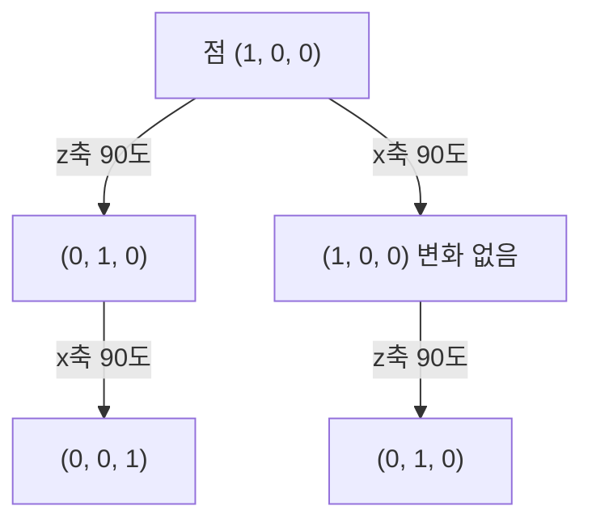

<Callout type="info">
  **이번 문서의 목표:** 3차원 공간의 이동·회전·스케일을 4x4 동차좌표 행렬로 표현해 실제 점에 곱한 결과를 구할 수 있고, x·y·z축 각각을 기준으로 한 회전의 차이와 3D 합성 변환에서 순서가 결과를 바꾸는 이유를 설명할 수 있게 된다.
</Callout>

## 왜 3D에서는 행렬이 4x4가 되는가

04편에서 2차원 점 $(x, y)$를 동차좌표 $(x, y, 1)$로 확장해 $3 \times 3$ 행렬로 평행이동까지 표현할 수 있었습니다. 3차원 공간에서는 점이 $(x, y, z)$ 세 개의 좌표를 가지므로, 같은 방식으로 동차좌표 $(x, y, z, 1)$을 만들고 $4 \times 4$ 행렬을 곱합니다. 차원이 하나 늘었을 뿐 원리는 완전히 같습니다. 다만 회전만큼은 2D와 다르게 다뤄야 합니다. 2D에서는 회전축이 항상 화면에 수직인 한 방향(원점을 지나는 z축)뿐이었지만, 3D에서는 $x$축, $y$축, $z$축 세 가지 중 어느 축을 기준으로 회전하느냐에 따라 서로 다른 행렬이 필요합니다.

> **쉽게 말하면:** 3D 변환은 2D와 원리가 같지만 좌표가 하나 늘고, 회전은 어느 축을 중심으로 도는지부터 먼저 정해야 합니다.

## 1. 3D 평행이동(Translation)

> **쉽게 말하면:** 3D 평행이동은 점을 x, y, z 세 방향으로 각각 정해진 만큼 밀어서 옮기는 것입니다.

점을 $x$ 방향으로 $t_x$, $y$ 방향으로 $t_y$, $z$ 방향으로 $t_z$만큼 옮기는 $4 \times 4$ 동차좌표 행렬은 다음과 같습니다.

$$
T(t_x, t_y, t_z) = \begin{bmatrix} 1 & 0 & 0 & t_x \\ 0 & 1 & 0 & t_y \\ 0 & 0 & 1 & t_z \\ 0 & 0 & 0 & 1 \end{bmatrix}
$$

- 대각선(1행 1열, 2행 2열, 3행 3열, 4행 4열)은 항상 1을 유지한다.
- 이동량 $t_x, t_y, t_z$는 네 번째 열의 위쪽 세 자리에 들어간다.

점 $(2, 1, 3)$을 $t_x=3, t_y=-2, t_z=1$만큼 평행이동해 보겠습니다.

$$
\begin{bmatrix} 1 & 0 & 0 & 3 \\ 0 & 1 & 0 & -2 \\ 0 & 0 & 1 & 1 \\ 0 & 0 & 0 & 1 \end{bmatrix} \begin{bmatrix} 2 \\ 1 \\ 3 \\ 1 \end{bmatrix} = \begin{bmatrix} 2 + 3 \\ 1 + (-2) \\ 3 + 1 \\ 1 \end{bmatrix} = \begin{bmatrix} 5 \\ -1 \\ 4 \\ 1 \end{bmatrix}
$$

- 첫 번째 행: $1 \times 2 + 0 \times 1 + 0 \times 3 + 3 \times 1 = 5$ → 새 x좌표
- 두 번째 행: $0 \times 2 + 1 \times 1 + 0 \times 3 + (-2) \times 1 = -1$ → 새 y좌표
- 세 번째 행: $0 \times 2 + 0 \times 1 + 1 \times 3 + 1 \times 1 = 4$ → 새 z좌표
- 결과: 점 $(2, 1, 3)$이 평행이동을 거쳐 점 $(5, -1, 4)$가 되었다. 각 좌표에 이동량을 그대로 더한 값과 일치한다.

## 2. 3D 회전 — 세 개의 축, 세 개의 행렬

> **쉽게 말하면:** 3D 회전은 회전시킬 축을 하나 고정해 두고, 나머지 두 좌표만 2D 회전처럼 돌리는 것입니다.

$x$축을 기준으로 회전할 때는 $x$좌표는 그대로 두고 $y, z$좌표만 2D 회전 공식처럼 섞입니다. $y$축, $z$축 회전도 각각 자신의 축 좌표는 고정하고 나머지 두 좌표를 섞는 방식으로 정의됩니다.

$$
R_x(\theta) = \begin{bmatrix} 1 & 0 & 0 & 0 \\ 0 & \cos\theta & -\sin\theta & 0 \\ 0 & \sin\theta & \cos\theta & 0 \\ 0 & 0 & 0 & 1 \end{bmatrix}
$$

$$
R_y(\theta) = \begin{bmatrix} \cos\theta & 0 & \sin\theta & 0 \\ 0 & 1 & 0 & 0 \\ -\sin\theta & 0 & \cos\theta & 0 \\ 0 & 0 & 0 & 1 \end{bmatrix}
$$

$$
R_z(\theta) = \begin{bmatrix} \cos\theta & -\sin\theta & 0 & 0 \\ \sin\theta & \cos\theta & 0 & 0 \\ 0 & 0 & 1 & 0 \\ 0 & 0 & 0 & 1 \end{bmatrix}
$$

- $R_x$는 $x$좌표를 고정하고 $(y, z)$ 평면 안에서 회전시킨다(1행 1열이 1로 고정되고 나머지 3x3 부분이 04편의 2D 회전 행렬과 같은 구조).
- $R_y$는 $y$좌표를 고정하고 $(z, x)$ 평면에서 회전시킨다. 부호 배치가 $R_x, R_z$와 다른 이유는 $x, y, z$축의 순환 순서($x \to y \to z \to x$)를 따르기 때문이다.
- $R_z$는 $z$좌표를 고정하고 $(x, y)$ 평면에서 회전시키며, 04편에서 다룬 2D 회전과 사실상 같은 변환이다.

점 $(0, 1, 0)$을 $z$축 기준으로 $90$도 반시계 방향 회전시켜 보겠습니다. $\cos 90° = 0$, $\sin 90° = 1$입니다.

$$
\begin{bmatrix} 0 & -1 & 0 & 0 \\ 1 & 0 & 0 & 0 \\ 0 & 0 & 1 & 0 \\ 0 & 0 & 0 & 1 \end{bmatrix} \begin{bmatrix} 0 \\ 1 \\ 0 \\ 1 \end{bmatrix} = \begin{bmatrix} 0 \times 0 + (-1) \times 1 \\ 1 \times 0 + 0 \times 1 \\ 0 \\ 1 \end{bmatrix} = \begin{bmatrix} -1 \\ 0 \\ 0 \\ 1 \end{bmatrix}
$$

- 결과: 점 $(0, 1, 0)$이 $z$축 기준 90도 회전을 거쳐 점 $(-1, 0, 0)$이 되었다. $z$좌표는 회전축이므로 $0$에서 변하지 않는다.

이번에는 같은 점 $(0, 1, 0)$을 $x$축 기준으로 $90$도 회전시켜 비교해 보겠습니다.

$$
\begin{bmatrix} 1 & 0 & 0 & 0 \\ 0 & 0 & -1 & 0 \\ 0 & 1 & 0 & 0 \\ 0 & 0 & 0 & 1 \end{bmatrix} \begin{bmatrix} 0 \\ 1 \\ 0 \\ 1 \end{bmatrix} = \begin{bmatrix} 0 \\ 0 \times 1 + (-1) \times 0 \\ 1 \times 1 + 0 \times 0 \\ 1 \end{bmatrix} = \begin{bmatrix} 0 \\ 0 \\ 1 \\ 1 \end{bmatrix}
$$

- 결과: 같은 점 $(0, 1, 0)$인데도 $x$축 기준 90도 회전에서는 $(0, 0, 1)$이 되었다. 회전축이 다르면 같은 점이라도 완전히 다른 위치로 이동한다.

| 회전축 | 고정되는 좌표 | 회전하는 평면 | 예시 점 (0,1,0)을 90도 회전한 결과 |
|---|---|---|---|
| $x$축 | $x$ | $(y, z)$ | $(0, 0, 1)$ |
| $y$축 | $y$ | $(z, x)$ | $(0, 1, 0)$ (변화 없음, 이미 y축 위의 점) |
| $z$축 | $z$ | $(x, y)$ | $(-1, 0, 0)$ |

**자주 틀리는 점:** 세 회전 행렬의 부호 위치를 서로 헷갈리는 경우가 많습니다. $R_x$와 $R_z$는 $-\sin\theta$가 각각 (2행 3열), (1행 2열)에 있지만, $R_y$만 예외적으로 $-\sin\theta$가 (3행 1열)에 있습니다. 이는 $x \to y \to z \to x$ 순환 순서를 따르기 때문이며, 시험에서는 이 부호 위치를 정확히 외워야 계산 실수를 막을 수 있습니다.

## 3. 3D 스케일(Scale)

> **쉽게 말하면:** 3D 스케일도 2D와 같은 원리로, x, y, z축 방향으로 각각 정해진 배율만큼 크기를 바꿉니다.

$$
S(s_x, s_y, s_z) = \begin{bmatrix} s_x & 0 & 0 & 0 \\ 0 & s_y & 0 & 0 \\ 0 & 0 & s_z & 0 \\ 0 & 0 & 0 & 1 \end{bmatrix}
$$

점 $(2, 3, 1)$을 $s_x=2, s_y=1, s_z=3$으로 확대해 보겠습니다.

$$
\begin{bmatrix} 2 & 0 & 0 & 0 \\ 0 & 1 & 0 & 0 \\ 0 & 0 & 3 & 0 \\ 0 & 0 & 0 & 1 \end{bmatrix} \begin{bmatrix} 2 \\ 3 \\ 1 \\ 1 \end{bmatrix} = \begin{bmatrix} 4 \\ 3 \\ 3 \\ 1 \end{bmatrix}
$$

- 결과: 점 $(2, 3, 1)$이 스케일 변환을 거쳐 점 $(4, 3, 3)$이 되었다. $y$좌표는 배율이 1이라 변화가 없다.

## 4. 3D 합성 변환 — 순서 문제가 3D에서는 더 커진다

04편에서 확인했듯 행렬 곱셈은 교환법칙이 성립하지 않습니다. 3D에서는 회전축이 세 개나 되기 때문에 이 문제가 훨씬 두드러집니다. 특히 **서로 다른 두 축을 기준으로 한 회전은 순서를 바꾸면 결과가 다릅니다.** 점 $(1, 0, 0)$에 $z$축 90도 회전을 먼저 적용한 뒤 $x$축 90도 회전을 적용하는 경우와, 순서를 반대로 하는 경우를 비교해 보겠습니다.

**순서 1: $z$축 회전 후 $x$축 회전.** 먼저 점 $(1,0,0)$을 $z$축 기준 90도 회전시킵니다.

$$
\begin{bmatrix} 0 & -1 & 0 & 0 \\ 1 & 0 & 0 & 0 \\ 0 & 0 & 1 & 0 \\ 0 & 0 & 0 & 1 \end{bmatrix} \begin{bmatrix} 1 \\ 0 \\ 0 \\ 1 \end{bmatrix} = \begin{bmatrix} 0 \\ 1 \\ 0 \\ 1 \end{bmatrix}
$$

이제 이 결과 $(0, 1, 0)$을 $x$축 기준 90도 회전시킵니다. 이는 앞서 2절에서 이미 계산한 것과 같은 식으로, 결과는 $(0, 0, 1)$입니다.

- "z축 회전 후 x축 회전" 순서의 최종 결과: 점 $(1, 0, 0)$ → 점 $(0, 0, 1)$

**순서 2: $x$축 회전 후 $z$축 회전.** 먼저 점 $(1,0,0)$을 $x$축 기준 90도 회전시킵니다. $x$좌표가 고정되는 회전이므로, $x$좌표가 $1$이고 $y, z$좌표가 모두 $0$인 이 점은 $x$축 위에 있어 회전해도 그대로입니다.

$$
\begin{bmatrix} 1 & 0 & 0 & 0 \\ 0 & 0 & -1 & 0 \\ 0 & 1 & 0 & 0 \\ 0 & 0 & 0 & 1 \end{bmatrix} \begin{bmatrix} 1 \\ 0 \\ 0 \\ 1 \end{bmatrix} = \begin{bmatrix} 1 \\ 0 \\ 0 \\ 1 \end{bmatrix}
$$

이제 이 결과 $(1, 0, 0)$을 $z$축 기준 90도 회전시킵니다. $z$좌표가 고정되는 회전이고 이 점은 $(x, y)$ 평면 위의 04편 예제와 같은 점이므로, 결과는 $(0, 1, 0)$입니다.

- "x축 회전 후 z축 회전" 순서의 최종 결과: 점 $(1, 0, 0)$ → 점 $(0, 1, 0)$

같은 두 회전, 같은 시작점인데도 순서를 바꾸자 결과가 $(0, 0, 1)$과 $(0, 1, 0)$으로 달라졌습니다.

> **비유:** 정육면체 상자를 손에 들고 먼저 세로축(z축)으로 한 바퀴의 4분의 1만큼 돌린 다음 가로축(x축)으로 다시 4분의 1을 돌리는 것과, 먼저 가로축으로 돌린 다음 세로축으로 돌리는 것은 상자가 최종적으로 놓이는 방향이 다릅니다. 비행기의 롤(roll)·피치(pitch)·요(yaw) 회전을 어떤 순서로 적용하느냐에 따라 최종 자세가 달라지는 것도 같은 원리입니다.

**자주 틀리는 점:** "같은 축을 두 번 회전하면 순서가 상관없다"는 것과 "서로 다른 축을 회전하면 순서가 상관없다"는 것을 혼동하면 안 됩니다. 같은 축을 기준으로 한 두 회전(예: $z$축으로 30도 회전 후 다시 $z$축으로 60도 회전)은 각도를 더한 것과 같아 순서가 상관없지만, **서로 다른 축**을 기준으로 한 회전은 일반적으로 순서를 바꾸면 결과가 달라집니다.

## 핵심 정리

- 3D 변환은 $(x, y, z, 1)$ 동차좌표와 $4 \times 4$ 행렬을 사용하며, 평행이동은 네 번째 열에, 스케일은 대각선에 값을 넣는 구조가 2D와 같다.
- 3D 회전은 $x, y, z$ 세 축 중 어느 축을 기준으로 하는지에 따라 $R_x, R_y, R_z$ 세 가지 행렬이 다르게 정의되며, 회전축의 좌표는 고정된다.
- $R_y$는 $x \to y \to z \to x$ 순환 순서 때문에 $-\sin\theta$의 위치가 $R_x, R_z$와 다르다.
- 서로 다른 축을 기준으로 한 3D 회전은 순서를 바꾸면 결과가 달라지며, 같은 축을 두 번 회전하는 경우에만 순서가 상관없다.

## 마무리 복습

<Quiz
  questionNumber={1}
  question="점 (2, 1, 3)을 tx=3, ty=-2, tz=1만큼 3D 평행이동한 결과로 가장 적절한 것은?"
  options={['(5, -1, 4)', '(5, 3, 2)', '(-1, 3, 2)', '(2, 1, 3)']}
  correctAnswer={1}
  explanation="각 좌표에 이동량을 더하면 x=2+3=5, y=1+(-2)=-1, z=3+1=4가 되어 결과는 (5, -1, 4)이다."
  optionExplanations={['각 좌표에 이동량을 더한 계산과 정확히 일치한다.', '(5, 3, 2)는 이동량을 서로 뒤바꿔 더한 값으로 규칙과 맞지 않는다.', '(-1, 3, 2)는 좌표와 이동량을 잘못 짝지은 값이다.', '(2, 1, 3)은 이동이 전혀 적용되지 않은 원래 좌표다.']}
/>

<Quiz
  questionNumber={2}
  question="점 (0, 1, 0)을 z축 기준으로 90도 반시계 회전시킨 결과로 가장 적절한 것은?"
  options={['(-1, 0, 0)', '(0, 0, 1)', '(0, 1, 0)', '(1, 0, 0)']}
  correctAnswer={1}
  explanation="Rz(90) 행렬을 곱하면 새 x좌표는 0x0+(-1)x1=-1, 새 y좌표는 1x0+0x1=0이 되고 z좌표는 고정되어 0이므로 결과는 (-1, 0, 0)이다."
  optionExplanations={['Rz(90) 행렬을 대입한 계산 결과와 일치한다.', '(0, 0, 1)은 x축 기준으로 같은 점을 회전시켰을 때 나오는 결과다.', '(0, 1, 0)은 회전이 적용되지 않은 원래 좌표다.', '(1, 0, 0)은 회전 방향을 반대로(시계 방향) 계산했을 때 나오는 결과다.']}
/>

<Quiz
  questionNumber={3}
  question="3D 회전 행렬 Rx, Ry, Rz에 대한 설명으로 옳지 않은 것은?"
  options={['Ry는 x, y, z 세 좌표를 모두 변화시킨다', 'Rx는 x좌표를 고정하고 y, z좌표를 회전시킨다', 'Rz는 z좌표를 고정하고 x, y좌표를 회전시킨다', 'Ry에서 -sin세타의 위치는 Rx, Rz와 다른 자리에 있다']}
  correctAnswer={1}
  explanation="Ry는 y좌표를 고정하고 z, x좌표만 회전시킨다. y좌표까지 함께 변화한다는 설명은 회전축의 좌표가 고정된다는 기본 원리와 어긋난다."
  optionExplanations={['Ry는 실제로는 y좌표를 고정하고 z, x좌표만 변화시키므로 이 진술은 옳지 않아 정답이다.', 'Rx가 x좌표를 고정한다는 설명은 본문 내용과 일치하는 옳은 진술이다.', 'Rz가 z좌표를 고정한다는 설명은 본문 내용과 일치하는 옳은 진술이다.', 'Ry의 -sin세타 위치가 순환 순서 때문에 다르다는 설명은 본문 내용과 일치하는 옳은 진술이다.']}
/>

<Quiz
  questionNumber={4}
  question="점 (2, 3, 1)을 sx=2, sy=1, sz=3으로 3D 스케일한 결과로 가장 적절한 것은?"
  options={['(4, 3, 3)', '(4, 3, 1)', '(2, 3, 3)', '(6, 3, 4)']}
  correctAnswer={1}
  explanation="각 좌표에 배율을 곱하면 x=2x2=4, y=3x1=3, z=1x3=3이 되어 결과는 (4, 3, 3)이다."
  optionExplanations={['각 좌표에 배율을 곱한 계산과 정확히 일치한다.', '(4, 3, 1)은 z좌표에 배율을 곱하지 않은 값으로 계산이 누락되었다.', '(2, 3, 3)은 x좌표에 배율을 곱하지 않은 값으로 계산이 누락되었다.', '(6, 3, 4)는 곱셈이 아니라 임의의 값을 더한 결과로 스케일 규칙과 맞지 않는다.']}
/>

<Quiz
  questionNumber={5}
  question="점 (1, 0, 0)에 z축 90도 회전을 먼저 적용한 뒤 x축 90도 회전을 적용한 결과로 가장 적절한 것은?"
  options={['(0, 0, 1)', '(0, 1, 0)', '(1, 0, 0)', '(0, -1, 0)']}
  correctAnswer={1}
  explanation="먼저 z축 90도 회전으로 (1,0,0)이 (0,1,0)이 되고, 이를 x축 90도 회전시키면 x좌표는 고정된 0, y와 z가 섞여 (0, 0, 1)이 된다."
  optionExplanations={['z축 회전 후 x축 회전의 계산 순서를 그대로 따른 결과와 일치한다.', '(0, 1, 0)은 x축 회전을 먼저 하고 z축 회전을 나중에 적용한 순서의 결과다.', '(1, 0, 0)은 회전이 전혀 적용되지 않은 원래 좌표다.', '(0, -1, 0)은 회전 방향을 반대로 계산했을 때 나오는 값이다.']}
/>

<Quiz
  questionNumber={6}
  question="3D 합성 변환에서 회전 순서에 관한 설명으로 가장 적절한 것은?"
  options={['서로 다른 축을 기준으로 한 회전은 일반적으로 순서를 바꾸면 결과가 달라진다', '3D에서는 항상 회전 순서와 무관하게 같은 결과가 나온다', '같은 축을 기준으로 한 두 번의 회전도 순서를 바꾸면 결과가 달라진다', '평행이동과 스케일만 순서에 영향을 받고 회전은 순서와 무관하다']}
  correctAnswer={1}
  explanation="본문에서 z축 회전 후 x축 회전과 x축 회전 후 z축 회전의 결과가 각각 (0,0,1)과 (0,1,0)으로 달랐던 것처럼, 서로 다른 축을 기준으로 한 3D 회전은 일반적으로 순서에 따라 결과가 달라진다."
  optionExplanations={['본문 예제에서 직접 확인한 결과 차이와 일치하는 옳은 설명이다.', '본문 예제에서 이미 순서에 따라 결과가 달랐으므로 항상 같다는 설명은 옳지 않다.', '같은 축을 두 번 회전하는 경우는 각도를 더한 것과 같아 순서가 상관없다는 본문 설명과 반대된다.', '회전 역시 행렬 곱셈이므로 순서에 따라 결과가 달라질 수 있어 이 진술은 옳지 않다.']}
/>

## 참고 자료

- [MDN - Transformations - Canvas API](https://developer.mozilla.org/en-US/docs/Web/API/Canvas_API/Tutorial/Transformations)
- [MIT OCW - Graphics Pipeline and Rasterization](https://ocw.mit.edu/courses/6-837-computer-graphics-fall-2012/53d96abf747a3c82fd3497d2fea540f5_MIT6_837F12_Lec21.pdf)
