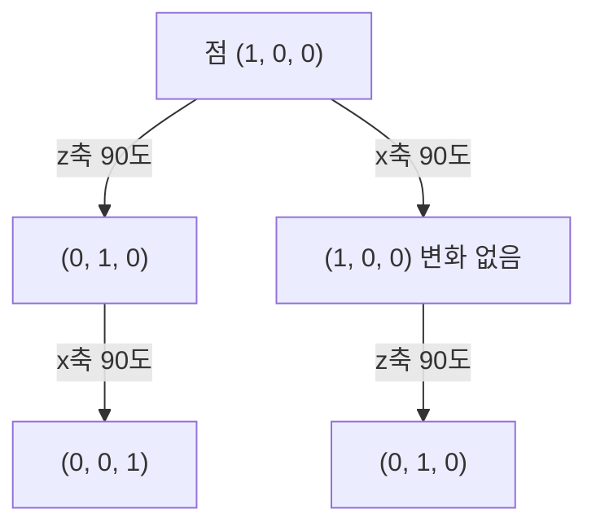

## 왜 3D에서는 행렬이 4x4가 되는가

04편에서 2차원 점 $(x, y)$를 동차좌표 $(x, y, 1)$로 확장해 $3 \times 3$ 행렬로 평행이동까지 표현할 수 있었습니다. 3차원 공간에서는 점이 $(x, y, z)$ 세 개의 좌표를 가지므로, 같은 방식으로 동차좌표 $(x, y, z, 1)$을 만들고 $4 \times 4$ 행렬을 곱합니다.

## 1. 3D 평행이동(Translation)

점을 $x$ 방향으로 $t_x$, $y$ 방향으로 $t_y$, $z$ 방향으로 $t_z$만큼 옮기는 $4 \times 4$ 동차좌표 행렬은 다음과 같습니다.

$$
T(t_x, t_y, t_z) = \begin{bmatrix} 1 & 0 & 0 & t_x \\ 0 & 1 & 0 & t_y \\ 0 & 0 & 1 & t_z \\ 0 & 0 & 0 & 1 \end{bmatrix}
$$

- 대각선(1행 1열, 2행 2열, 3행 3열, 4행 4열)은 항상 1을 유지한다.
- 이동량 $t_x, t_y, t_z$는 네 번째 열의 위쪽 세 자리에 들어간다.

점 $(2, 1, 3)$을 $t_x=3, t_y=-2, t_z=1$만큼 평행이동해 보겠습니다.

$$
\begin{bmatrix} 1 & 0 & 0 & 3 \\ 0 & 1 & 0 & -2 \\ 0 & 0 & 1 & 1 \\ 0 & 0 & 0 & 1 \end{bmatrix} \begin{bmatrix} 2 \\ 1 \\ 3 \\ 1 \end{bmatrix} = \begin{bmatrix} 2 + 3 \\ 1 + (-2) \\ 3 + 1 \\ 1 \end{bmatrix} = \begin{bmatrix} 5 \\ -1 \\ 4 \\ 1 \end{bmatrix}
$$

- 첫 번째 행: $1 \times 2 + 0 \times 1 + 0 \times 3 + 3 \times 1 = 5$ → 새 x좌표
- 두 번째 행: $0 \times 2 + 1 \times 1 + 0 \times 3 + (-2) \times 1 = -1$ → 새 y좌표
- 세 번째 행: $0 \times 2 + 0 \times 1 + 1 \times 3 + 1 \times 1 = 4$ → 새 z좌표
- 결과: 점 $(2, 1, 3)$이 평행이동을 거쳐 점 $(5, -1, 4)$가 되었다. 각 좌표에 이동량을 그대로 더한 값과 일치한다.

## 2. 3D 회전 — 세 개의 축, 세 개의 행렬

$x$축을 기준으로 회전할 때는 $x$좌표는 그대로 두고 $y, z$좌표만 2D 회전 공식처럼 섞입니다. $y$축, $z$축 회전도 각각 자신의 축 좌표는 고정하고 나머지 두 좌표를 섞는 방식으로 정의됩니다.

$$
R_x(\theta) = \begin{bmatrix} 1 & 0 & 0 & 0 \\ 0 & \cos\theta & -\sin\theta & 0 \\ 0 & \sin\theta & \cos\theta & 0 \\ 0 & 0 & 0 & 1 \end{bmatrix}
$$

$$
R_y(\theta) = \begin{bmatrix} \cos\theta & 0 & \sin\theta & 0 \\ 0 & 1 & 0 & 0 \\ -\sin\theta & 0 & \cos\theta & 0 \\ 0 & 0 & 0 & 1 \end{bmatrix}
$$

$$
R_z(\theta) = \begin{bmatrix} \cos\theta & -\sin\theta & 0 & 0 \\ \sin\theta & \cos\theta & 0 & 0 \\ 0 & 0 & 1 & 0 \\ 0 & 0 & 0 & 1 \end{bmatrix}
$$

- $R_x$는 $x$좌표를 고정하고 $(y, z)$ 평면 안에서 회전시킨다(1행 1열이 1로 고정되고 나머지 3x3 부분이 04편의 2D 회전 행렬과 같은 구조).
- $R_y$는 $y$좌표를 고정하고 $(z, x)$ 평면에서 회전시킨다. 부호 배치가 $R_x, R_z$와 다른 이유는 $x, y, z$축의 순환 순서($x \to y \to z \to x$)를 따르기 때문이다.
- $R_z$는 $z$좌표를 고정하고 $(x, y)$ 평면에서 회전시키며, 04편에서 다룬 2D 회전과 사실상 같은 변환이다.

점 $(0, 1, 0)$을 $z$축 기준으로 $90$도 반시계 방향 회전시켜 보겠습니다. $\cos 90° = 0$, $\sin 90° = 1$입니다.

$$
\begin{bmatrix} 0 & -1 & 0 & 0 \\ 1 & 0 & 0 & 0 \\ 0 & 0 & 1 & 0 \\ 0 & 0 & 0 & 1 \end{bmatrix} \begin{bmatrix} 0 \\ 1 \\ 0 \\ 1 \end{bmatrix} = \begin{bmatrix} 0 \times 0 + (-1) \times 1 \\ 1 \times 0 + 0 \times 1 \\ 0 \\ 1 \end{bmatrix} = \begin{bmatrix} -1 \\ 0 \\ 0 \\ 1 \end{bmatrix}
$$

- 결과: 점 $(0, 1, 0)$이 $z$축 기준 90도 회전을 거쳐 점 $(-1, 0, 0)$이 되었다. $z$좌표는 회전축이므로 $0$에서 변하지 않는다.

이번에는 같은 점 $(0, 1, 0)$을 $x$축 기준으로 $90$도 회전시켜 비교해 보겠습니다.

$$
\begin{bmatrix} 1 & 0 & 0 & 0 \\ 0 & 0 & -1 & 0 \\ 0 & 1 & 0 & 0 \\ 0 & 0 & 0 & 1 \end{bmatrix} \begin{bmatrix} 0 \\ 1 \\ 0 \\ 1 \end{bmatrix} = \begin{bmatrix} 0 \\ 0 \times 1 + (-1) \times 0 \\ 1 \times 1 + 0 \times 0 \\ 1 \end{bmatrix} = \begin{bmatrix} 0 \\ 0 \\ 1 \\ 1 \end{bmatrix}
$$

- 결과: 같은 점 $(0, 1, 0)$인데도 $x$축 기준 90도 회전에서는 $(0, 0, 1)$이 되었다. 회전축이 다르면 같은 점이라도 완전히 다른 위치로 이동한다.

| 회전축 | 고정되는 좌표 | 회전하는 평면 | 예시 점 (0,1,0)을 90도 회전한 결과 |
|---|---|---|---|
| $x$축 | $x$ | $(y, z)$ | $(0, 0, 1)$ |
| $y$축 | $y$ | $(z, x)$ | $(0, 1, 0)$ (변화 없음, 이미 y축 위의 점) |
| $z$축 | $z$ | $(x, y)$ | $(-1, 0, 0)$ |

**자주 틀리는 점:** 세 회전 행렬의 부호 위치를 서로 헷갈리는 경우가 많습니다. $R_x$와 $R_z$는 $-\sin\theta$가 각각 (2행 3열), (1행 2열)에 있지만, $R_y$만 예외적으로 $-\sin\theta$가 (3행 1열)에 있습니다.

## 3. 3D 스케일(Scale)

$$
S(s_x, s_y, s_z) = \begin{bmatrix} s_x & 0 & 0 & 0 \\ 0 & s_y & 0 & 0 \\ 0 & 0 & s_z & 0 \\ 0 & 0 & 0 & 1 \end{bmatrix}
$$

점 $(2, 3, 1)$을 $s_x=2, s_y=1, s_z=3$으로 확대해 보겠습니다.

$$
\begin{bmatrix} 2 & 0 & 0 & 0 \\ 0 & 1 & 0 & 0 \\ 0 & 0 & 3 & 0 \\ 0 & 0 & 0 & 1 \end{bmatrix} \begin{bmatrix} 2 \\ 3 \\ 1 \\ 1 \end{bmatrix} = \begin{bmatrix} 4 \\ 3 \\ 3 \\ 1 \end{bmatrix}
$$

- 결과: 점 $(2, 3, 1)$이 스케일 변환을 거쳐 점 $(4, 3, 3)$이 되었다. $y$좌표는 배율이 1이라 변화가 없다.

## 4. 3D 합성 변환 — 순서 문제가 3D에서는 더 커진다

04편에서 확인했듯 행렬 곱셈은 교환법칙이 성립하지 않습니다. 3D에서는 회전축이 세 개나 되기 때문에 이 문제가 훨씬 두드러집니다.

**순서 1: $z$축 회전 후 $x$축 회전.** 먼저 점 $(1,0,0)$을 $z$축 기준 90도 회전시킵니다.

$$
\begin{bmatrix} 0 & -1 & 0 & 0 \\ 1 & 0 & 0 & 0 \\ 0 & 0 & 1 & 0 \\ 0 & 0 & 0 & 1 \end{bmatrix} \begin{bmatrix} 1 \\ 0 \\ 0 \\ 1 \end{bmatrix} = \begin{bmatrix} 0 \\ 1 \\ 0 \\ 1 \end{bmatrix}
$$

이제 이 결과 $(0, 1, 0)$을 $x$축 기준 90도 회전시킵니다. 이는 앞서 2절에서 이미 계산한 것과 같은 식으로, 결과는 $(0, 0, 1)$입니다.

- "z축 회전 후 x축 회전" 순서의 최종 결과: 점 $(1, 0, 0)$ → 점 $(0, 0, 1)$

**순서 2: $x$축 회전 후 $z$축 회전.** 먼저 점 $(1,0,0)$을 $x$축 기준 90도 회전시킵니다. $x$좌표가 고정되는 회전이므로, $x$좌표가 $1$이고 $y, z$좌표가 모두 $0$인 이 점은 $x$축 위에 있어 회전해도 그대로입니다.

$$
\begin{bmatrix} 1 & 0 & 0 & 0 \\ 0 & 0 & -1 & 0 \\ 0 & 1 & 0 & 0 \\ 0 & 0 & 0 & 1 \end{bmatrix} \begin{bmatrix} 1 \\ 0 \\ 0 \\ 1 \end{bmatrix} = \begin{bmatrix} 1 \\ 0 \\ 0 \\ 1 \end{bmatrix}
$$

이제 이 결과 $(1, 0, 0)$을 $z$축 기준 90도 회전시킵니다. $z$좌표가 고정되는 회전이고 이 점은 $(x, y)$ 평면 위의 04편 예제와 같은 점이므로, 결과는 $(0, 1, 0)$입니다.

- "x축 회전 후 z축 회전" 순서의 최종 결과: 점 $(1, 0, 0)$ → 점 $(0, 1, 0)$

같은 두 회전, 같은 시작점인데도 순서를 바꾸자 결과가 $(0, 0, 1)$과 $(0, 1, 0)$으로 달라졌습니다.

```mermaid
graph TD
  P0["점 (1, 0, 0)"] -->|z축 90도| A["(0, 1, 0)"]
  A -->|x축 90도| B["(0, 0, 1)"]
  P0 -->|x축 90도| C["(1, 0, 0) 변화 없음"]
  C -->|z축 90도| D["(0, 1, 0)"]
```

**자주 틀리는 점:** "같은 축을 두 번 회전하면 순서가 상관없다"는 것과 "서로 다른 축을 회전하면 순서가 상관없다"는 것을 혼동하면 안 됩니다. 같은 축을 기준으로 한 두 회전(예: $z$축으로 30도 회전 후 다시 $z$축으로 60도 회전)은 각도를 더한 것과 같아 순서가 상관없지만, **서로 다른 축**을 기준으로 한 회전은 일반적으로 순서를 바꾸면 결과가 달라집니다.

## 핵심 정리

- 3D 변환은 $(x, y, z, 1)$ 동차좌표와 $4 \times 4$ 행렬을 사용하며, 평행이동은 네 번째 열에, 스케일은 대각선에 값을 넣는 구조가 2D와 같다.
- 3D 회전은 $x, y, z$ 세 축 중 어느 축을 기준으로 하는지에 따라 $R_x, R_y, R_z$ 세 가지 행렬이 다르게 정의되며, 회전축의 좌표는 고정된다.
- $R_y$는 $x \to y \to z \to x$ 순환 순서 때문에 $-\sin\theta$의 위치가 $R_x, R_z$와 다르다.
- 서로 다른 축을 기준으로 한 3D 회전은 순서를 바꾸면 결과가 달라지며, 같은 축을 두 번 회전하는 경우에만 순서가 상관없다.

## 마무리 복습

<Quiz
  questionNumber={1}
  question={"점 (2, 1, 3)을 tx=3, ty=-2, tz=1만큼 3D 평행이동한 결과로 가장 적절한 것은?"}
  options={["(5, -1, 4)","(5, 3, 2)","(-1, 3, 2)","(2, 1, 3)"]}
  correctAnswer={1}
  explanation={"각 좌표에 이동량을 더하면 x=2+3=5, y=1+(-2)=-1, z=3+1=4가 되어 결과는 (5, -1, 4)이다."}
/>

<Quiz
  questionNumber={2}
  question={"점 (0, 1, 0)을 z축 기준으로 90도 반시계 회전시킨 결과로 가장 적절한 것은?"}
  options={["(-1, 0, 0)","(0, 0, 1)","(0, 1, 0)","(1, 0, 0)"]}
  correctAnswer={1}
  explanation={"Rz(90) 행렬을 곱하면 새 x좌표는 0x0+(-1)x1=-1, 새 y좌표는 1x0+0x1=0이 되고 z좌표는 고정되어 0이므로 결과는 (-1, 0, 0)이다."}
/>

<Quiz
  questionNumber={3}
  question={"3D 회전 행렬 Rx, Ry, Rz에 대한 설명으로 옳지 않은 것은?"}
  options={["Ry는 x, y, z 세 좌표를 모두 변화시킨다","Rx는 x좌표를 고정하고 y, z좌표를 회전시킨다","Rz는 z좌표를 고정하고 x, y좌표를 회전시킨다","Ry에서 -sin세타의 위치는 Rx, Rz와 다른 자리에 있다"]}
  correctAnswer={1}
  explanation={"Ry는 y좌표를 고정하고 z, x좌표만 회전시킨다. y좌표까지 함께 변화한다는 설명은 회전축의 좌표가 고정된다는 기본 원리와 어긋난다."}
/>

## 참고 자료

- [MDN - Transformations - Canvas API](https://developer.mozilla.org/en-US/docs/Web/API/Canvas_API/Tutorial/Transformations)
- [MIT OCW - Graphics Pipeline and Rasterization](https://ocw.mit.edu/courses/6-837-computer-graphics-fall-2012/53d96abf747a3c82fd3497d2fea540f5_MIT6_837F12_Lec21.pdf)
