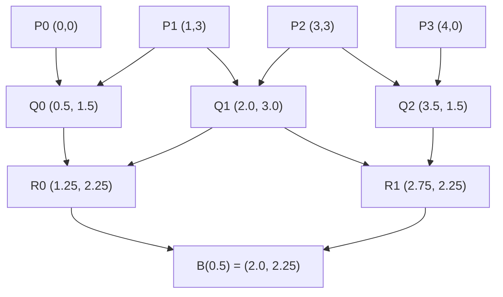

<Callout type="info">
  **이번 문서의 목표:** 3차 Bezier 곡선의 점을 번스타인 기저식과 드카스텔조(De Casteljau) 알고리즘 두 가지 방법으로 직접 계산할 수 있고, Bezier·B-spline·NURBS가 제어점을 다루는 방식의 차이(특히 국소성)를 설명할 수 있게 된다.
</Callout>

## 왜 곡선을 다항식으로 표현하는가

지금까지는 04·07편에서 점과 직선을 행렬로 이동·회전·확대했습니다. 하지만 자동차 차체, 글자의 곡선 획, 캐릭터의 얼굴 윤곽처럼 매끄럽게 휘어지는 형태는 직선의 조합만으로는 자연스럽게 표현하기 어렵습니다. 그렇다고 원이나 타원 같은 특정 방정식만 쓸 수도 없습니다 — 디자이너가 원하는 모양은 임의의 곡선이기 때문입니다.

컴퓨터그래픽스는 이 문제를 **매개변수 곡선**(Parametric Curve)으로 풉니다. 매개변수 $t$(보통 $0$부터 $1$ 사이의 값)를 하나 두고, $t$가 변할 때 점 $(x(t), y(t))$가 그려내는 궤적을 곡선으로 삼는 방식입니다. 이때 곡선의 모양을 결정하는 것은 몇 개의 **제어점**(Control Point)입니다 — 디자이너는 곡선 위의 점을 하나하나 지정하는 대신, 곡선 근처에 놓인 몇 개의 제어점을 움직여서 곡선의 모양을 직관적으로 조작합니다.

> **쉽게 말하면:** 곡선을 그리는 대신, 곡선을 "끌어당기는" 자석 같은 점 몇 개(제어점)를 놓고 그 점들이 곡선의 모양을 결정하게 만드는 것입니다.

## 1. Bezier 곡선 — 번스타인 기저로 정의하기

> **쉽게 말하면:** Bezier 곡선은 제어점 몇 개에 매개변수 $t$에 따라 달라지는 가중치를 곱해 더한 점들의 궤적입니다.

제어점이 $n+1$개($P_0, P_1, \ldots, P_n$)면 **$n$차 Bezier 곡선**이라 부릅니다. 컴퓨터그래픽스에서 가장 흔히 쓰이는 것은 제어점 4개로 이루어진 **3차(cubic) Bezier 곡선**입니다.

$$
B(t) = (1-t)^3 P_0 + 3(1-t)^2 t\, P_1 + 3(1-t)t^2 P_2 + t^3 P_3, \quad t \in [0, 1]
$$

- $P_0, P_1, P_2, P_3$: 4개의 제어점(2차원이면 각각 $(x, y)$ 좌표를 가진 점)
- $t$: 곡선 위의 위치를 나타내는 매개변수(parameter). $t = 0$이면 곡선의 시작점, $t = 1$이면 곡선의 끝점
- $(1-t)^3,\ 3(1-t)^2t,\ 3(1-t)t^2,\ t^3$: **번스타인 기저 다항식**(Bernstein Basis Polynomial)이라 부르는 4개의 가중치 함수로, $t$가 정해지면 각 제어점에 얼마만큼의 비중을 줄지를 결정한다.

번스타인 기저의 중요한 성질은 **네 가중치의 합이 항상 1**이라는 것입니다. $(1-t)^3 + 3(1-t)^2t + 3(1-t)t^2 + t^3 = ((1-t)+t)^3 = 1^3 = 1$이기 때문입니다. 가중치의 합이 1이므로 $B(t)$는 항상 네 제어점의 **가중 평균**이 되고, 그 결과 곡선은 항상 네 제어점이 만드는 볼록 껍질(convex hull) 안에 놓이게 됩니다 — 이것이 Bezier 곡선이 화면 밖으로 튀어나가지 않고 예측 가능하게 움직이는 이유입니다.

### 실제 계산 — 번스타인 기저에 t를 대입하기

제어점을 $P_0 = (0, 0)$, $P_1 = (1, 3)$, $P_2 = (3, 3)$, $P_3 = (4, 0)$으로 두고, $t = 0.5$일 때 곡선 위의 점을 계산해 보겠습니다. 먼저 $t = 0.5$를 번스타인 기저 각각에 대입합니다.

$$
(1-0.5)^3 = 0.125, \quad 3(1-0.5)^2(0.5) = 0.375, \quad 3(1-0.5)(0.5)^2 = 0.375, \quad (0.5)^3 = 0.125
$$

- 네 값을 더하면 $0.125 + 0.375 + 0.375 + 0.125 = 1$로, 가중 평균의 성질과 일치한다.

이 가중치를 각 제어점의 $x$좌표에 곱해 더합니다.

$$
x(0.5) = 0.125 \times 0 + 0.375 \times 1 + 0.375 \times 3 + 0.125 \times 4 = 0 + 0.375 + 1.125 + 0.5 = 2.0
$$

같은 방식으로 $y$좌표를 계산합니다.

$$
y(0.5) = 0.125 \times 0 + 0.375 \times 3 + 0.375 \times 3 + 0.125 \times 0 = 1.125 + 1.125 = 2.25
$$

- 결과: $t = 0.5$에서 곡선 위의 점은 $B(0.5) = (2.0,\ 2.25)$이다. 이 점은 네 제어점을 잇는 사각형 안쪽에 놓여 있으며, 곡선의 정확한 절반 지점(호의 길이 기준은 아니고 매개변수 기준 절반)에 해당한다.

### 실제 계산 — 드카스텔조(De Casteljau) 알고리즘으로 같은 점 구하기

번스타인 기저를 직접 대입하는 방법 말고도, **드카스텔조 알고리즘**이라는 반복적인 선형 보간(linear interpolation)만으로 같은 결과를 구하는 방법이 있습니다. 두 점 $A$, $B$ 사이를 $t$ 비율로 보간하는 식은 $\text{lerp}(A, B, t) = (1-t)A + tB$입니다. 이 보간을 제어점들 사이에서 반복해서 적용합니다.

**1단계**: 인접한 제어점 쌍을 $t = 0.5$로 보간해 3개의 새 점을 만든다.

| 계산 | 결과 |
|------|------|
| $\text{lerp}(P_0, P_1, 0.5) = (1-0.5)(0,0) + 0.5(1,3)$ | $(0.5,\ 1.5)$ |
| $\text{lerp}(P_1, P_2, 0.5) = (1-0.5)(1,3) + 0.5(3,3)$ | $(2.0,\ 3.0)$ |
| $\text{lerp}(P_2, P_3, 0.5) = (1-0.5)(3,3) + 0.5(4,0)$ | $(3.5,\ 1.5)$ |

**2단계**: 1단계에서 만든 3개의 점을 다시 인접한 쌍끼리 $t = 0.5$로 보간해 2개의 점을 만든다.

| 계산 | 결과 |
|------|------|
| $\text{lerp}((0.5,1.5), (2.0,3.0), 0.5)$ | $(1.25,\ 2.25)$ |
| $\text{lerp}((2.0,3.0), (3.5,1.5), 0.5)$ | $(2.75,\ 2.25)$ |

**3단계**: 2단계에서 만든 2개의 점을 마지막으로 $t = 0.5$로 보간하면 곡선 위의 점이 나온다.

$$
\text{lerp}((1.25, 2.25), (2.75, 2.25), 0.5) = (2.0,\ 2.25)
$$

- 결과: 드카스텔조 알고리즘으로 구한 점도 $(2.0,\ 2.25)$로, 번스타인 기저를 직접 대입한 결과와 정확히 일치한다. 두 방법은 수학적으로 동치이지만, 드카스텔조 알고리즘은 거듭제곱과 조합 계수를 계산할 필요 없이 **곱셈과 덧셈(선형 보간)만 반복**하면 되므로 컴퓨터가 오차 없이 안정적으로 계산하기에 유리하다.

**자주 틀리는 점:** 번스타인 기저의 계수 $3$을 빠뜨리는 실수가 흔합니다. $3(1-t)^2t$와 $3(1-t)t^2$의 계수 $3$은 이항계수 $\binom{3}{1} = \binom{3}{2} = 3$에서 나온 것으로, 생략하면 가중치의 합이 1이 되지 않아 계산 전체가 틀어집니다.

### Bezier 곡선의 한계 — 전역성

Bezier 곡선에서 제어점 하나를 옮기면, 그 변화가 곡선 전체 모양에 영향을 줍니다. 예를 들어 위 예제에서 $P_1$을 살짝만 옮겨도, $t = 0.9$처럼 $P_1$에서 멀리 떨어진 지점의 곡선 형태까지 함께 바뀝니다. 이런 성질을 **전역 제어**(Global Control)라고 합니다. 제어점이 많아질수록(차수가 높아질수록) 국소적으로 미세하게 곡선을 다듬고 싶어도 곡선 전체가 흔들리기 쉬워, 실무에서는 이 문제를 해결하기 위한 다음 도구가 필요해집니다.

## 2. B-spline — 국소성을 얻기 위한 구조

> **쉽게 말하면:** B-spline은 곡선을 여러 개의 짧은 구간으로 나누고, 제어점 하나가 자기 근처의 몇 구간에만 영향을 주도록 만든 곡선입니다.

**B-spline**(Basis spline)은 하나의 다항식으로 전체 곡선을 표현하는 Bezier와 달리, 여러 개의 제어점과 매듭(Knot)이라는 값들의 나열인 **매듭 벡터**(Knot Vector)를 이용해 곡선을 구간별로 이어 붙입니다. 각 구간은 국소적인 기저 함수(basis function)의 영향만 받기 때문에, 제어점 하나를 옮기면 그 제어점 근처의 몇 구간(차수가 $k$면 최대 $k+1$개 구간)만 바뀌고 멀리 떨어진 구간은 전혀 변하지 않습니다. 이 성질을 **국소성**(Locality)이라 부르며, Bezier의 전역 제어 문제를 해결하는 핵심 아이디어입니다.

- **제어점**(Control Point): Bezier와 마찬가지로 곡선의 모양을 조작하는 기준점들. B-spline은 제어점 개수와 곡선의 차수를 독립적으로 정할 수 있어(제어점이 아무리 많아도 차수를 낮게 유지 가능), Bezier보다 유연하다.
- **매듭**(Knot): 매개변수 $t$의 구간을 나누는 경계값들의 나열. 예를 들어 매듭 벡터 $[0, 0, 0, 1, 2, 3, 3, 3]$처럼, 각 매듭 사이가 하나의 곡선 조각(segment)에 대응한다.
- **국소성**(Locality): 제어점 하나의 변화가 곡선 전체가 아니라 그 제어점 주변의 한정된 구간에만 영향을 주는 성질.

## 3. Bezier와 B-spline 비교

| 항목 | Bezier 곡선 | B-spline 곡선 |
|------|-------------|----------------|
| 제어점 개수와 차수 | 제어점이 $n+1$개면 차수는 항상 $n$(둘이 묶여 있음) | 제어점 개수와 차수를 독립적으로 지정 가능 |
| 제어점 변경의 영향 범위 | 전역(곡선 전체가 바뀜) | 국소(매듭 구간 몇 개만 바뀜) |
| 곡선이 지나는 점 | 시작점 $P_0$, 끝점 $P_n$만 반드시 지남 | 일반적으로 시작·끝 제어점도 반드시 지나지는 않음(단, 매듭을 중복시키면 지나가게 만들 수 있음) |
| 계산 도구 | 번스타인 기저, 드카스텔조 알고리즘 | 매듭 벡터 기반 기저 함수(De Boor 알고리즘) |
| 원·타원의 정확한 표현 | 불가능(다항식으로는 원을 정확히 표현할 수 없음) | 불가능(가중치가 없는 일반 B-spline 기준) |

## 4. NURBS — 가중치로 원을 정확히 그리기

> **쉽게 말하면:** NURBS는 B-spline의 각 제어점에 "얼마나 세게 끌어당길지"를 나타내는 가중치를 추가로 붙인 곡선입니다.

Bezier와 일반 B-spline은 모두 다항식이므로, 원이나 타원처럼 분수식(유리식)으로만 정확히 표현되는 곡선은 근사할 수는 있어도 완벽히 표현할 수는 없습니다. **NURBS**(Non-Uniform Rational B-Spline, 비균일 유리 B-스플라인)는 이 문제를 해결하기 위해 각 제어점 $P_i$에 가중치(weight) $w_i$를 곱한 뒤, 가중치들의 합으로 다시 나누는 **유리식**(Rational, 분수 형태의 식)을 사용합니다.

$$
C(t) = \frac{\sum_{i} w_i N_i(t) P_i}{\sum_{i} w_i N_i(t)}
$$

- $N_i(t)$: B-spline의 국소 기저 함수(제어점 $P_i$가 매개변수 $t$에서 갖는 기본 영향력)
- $w_i$: 제어점 $P_i$의 가중치. 값이 클수록 곡선이 그 제어점 쪽으로 더 강하게 끌려간다.
- 분모의 $\sum w_i N_i(t)$는 가중치를 반영한 뒤 전체를 다시 1로 정규화(normalize)하는 역할을 한다.

가중치를 조절하면 원의 4분의 1 구간처럼 다항식으로는 정확히 표현할 수 없는 곡선도 NURBS로는 오차 없이 표현할 수 있습니다. 이 때문에 CAD(Computer-Aided Design, 컴퓨터 이용 설계) 소프트웨어나 정밀한 산업 디자인 도구는 대부분 NURBS를 표준 곡선 표현으로 채택하고 있습니다. 반대로 모든 가중치 $w_i$를 1로 두면 NURBS는 정확히 일반 B-spline과 같아지므로, **NURBS는 B-spline을 포함하는 더 넓은 개념**이라고 이해하면 됩니다.

## 5. 곡면으로의 확장 — 텐서곱

지금까지 다룬 것은 1차원 매개변수 $t$ 하나로 그려지는 곡선입니다. **곡면**(Surface)은 매개변수를 두 개($u$, $v$)로 늘려서 만듭니다. 가장 흔한 방식은 **텐서곱**(Tensor Product) 방식으로, 제어점을 격자(control net) 형태로 배치하고 $u$ 방향과 $v$ 방향으로 각각 Bezier(또는 B-spline) 곡선 계산을 적용합니다.

$$
S(u, v) = \sum_{i} \sum_{j} B_i(u)\, B_j(v)\, P_{i,j}
$$

- $P_{i,j}$: 격자로 배치된 제어점(control net)의 $(i, j)$번째 점
- $B_i(u), B_j(v)$: 각각 $u$, $v$ 방향의 번스타인 기저(또는 B-spline 기저) 함수

직관적으로는, 먼저 $u$ 방향의 여러 곡선을 각각 계산한 뒤 그 결과들을 다시 $v$ 방향으로 곡선 보간하는 것과 같습니다. Bezier 곡면·B-spline 곡면·NURBS 곡면 모두 이 텐서곱 구조를 그대로 확장한 것이며, 자동차 외형이나 캐릭터 모델링에서 넓은 곡면을 표현할 때 널리 쓰입니다.

## 핵심 정리

- 3차 Bezier 곡선은 번스타인 기저 $(1-t)^3, 3(1-t)^2t, 3(1-t)t^2, t^3$을 제어점에 곱해 더한 가중 평균이며, 네 가중치의 합은 항상 1이다.
- 드카스텔조 알고리즘은 제어점들을 선형 보간으로 반복해서 좁혀 나가는 방법으로, 번스타인 기저 계산과 동일한 결과를 안정적으로 준다.
- Bezier 곡선은 제어점 하나의 변화가 곡선 전체에 영향을 주는 전역 제어 성질을 가진다.
- B-spline은 매듭 벡터를 이용해 제어점의 영향 범위를 국소 구간으로 제한하는 국소성을 갖는다.
- NURBS는 B-spline에 가중치를 더한 유리식으로, 원·타원 같은 곡선을 정확히 표현할 수 있고 가중치를 모두 1로 두면 일반 B-spline과 같아진다.
- 곡면은 텐서곱 방식으로 두 매개변수 $u, v$에 대해 곡선 계산을 두 번 겹쳐 적용해 만든다.

## 마무리 복습

<Quiz
  questionNumber={1}
  question="3차 Bezier 곡선의 번스타인 기저 4개를 t=0.5에 대입했을 때 그 합으로 가장 적절한 것은?"
  options={['1', '0.5', '2', '0']}
  correctAnswer={1}
  explanation="번스타인 기저는 (1-t)+t=1의 세제곱으로 전개되므로 t값에 관계없이 항상 합이 1이 되며, t=0.5를 대입해도 0.125+0.375+0.375+0.125=1이다."
  optionExplanations={['이항정리로 전개하면 항상 1이 되는 성질과 일치한다.', '0.5는 t값 자체이며 기저 합과는 무관하다.', '2는 기저를 두 번 더하는 것과 같은 오산이다.', '0은 계수를 잘못 대입했을 때 나올 수 있는 값으로 실제 합과 다르다.']}
/>

<Quiz
  questionNumber={2}
  question="제어점 P0=(0,0), P1=(1,3), P2=(3,3), P3=(4,0)인 3차 Bezier 곡선에서 t=0.5일 때 곡선 위의 점으로 가장 적절한 것은?"
  options={['(2.0, 2.25)', '(2.0, 3.0)', '(1.25, 2.25)', '(2.75, 2.25)']}
  correctAnswer={1}
  explanation="번스타인 기저 0.125, 0.375, 0.375, 0.125를 각 제어점에 곱해 더하면 x=2.0, y=2.25가 되며, 드카스텔조 알고리즘으로 계산해도 같은 결과가 나온다."
  optionExplanations={['본문의 번스타인 기저 계산 및 드카스텔조 알고리즘 계산과 정확히 일치한다.', '(2.0, 3.0)은 드카스텔조 1단계의 중간 점 Q1이며 최종 결과가 아니다.', '(1.25, 2.25)는 드카스텔조 2단계의 중간 점 R0이며 최종 결과가 아니다.', '(2.75, 2.25)는 드카스텔조 2단계의 중간 점 R1이며 최종 결과가 아니다.']}
/>

<Quiz
  questionNumber={3}
  question="드카스텔조(De Casteljau) 알고리즘의 계산 방식으로 가장 적절한 것은?"
  options={['인접한 점들을 t 비율로 선형 보간하는 과정을 반복해 최종적으로 한 점만 남긴다', '모든 제어점의 좌표를 단순히 평균 내어 한 점을 구한다', '제어점을 행렬식으로 변환한 뒤 역행렬을 곱해 구한다', '가장 먼 두 제어점의 중점을 곡선 위의 점으로 삼는다']}
  correctAnswer={1}
  explanation="드카스텔조 알고리즘은 인접한 점 쌍을 lerp(A,B,t)=(1-t)A+tB로 반복 보간하며 점의 개수를 하나씩 줄여 나가 최종적으로 한 점을 얻는다."
  optionExplanations={['본문의 1~3단계 계산 과정과 정확히 일치하는 정의다.', '단순 평균은 t=0.5일 때 우연히 비슷해 보일 수 있으나 일반적인 t에서는 성립하지 않는다.', '역행렬 계산은 드카스텔조 알고리즘의 절차가 아니다.', '가장 먼 두 점의 중점은 알고리즘의 정의와 무관하다.']}
/>

<Quiz
  questionNumber={4}
  question="Bezier 곡선과 비교했을 때 B-spline 곡선의 가장 중요한 장점으로 가장 적절한 것은?"
  options={['제어점 하나를 옮겨도 그 주변 구간에만 영향을 주는 국소성을 가진다', '항상 원과 타원을 오차 없이 정확하게 표현할 수 있다', '제어점 개수가 항상 곡선의 차수와 같아야 한다', '계산에 곱셈과 덧셈이 전혀 필요하지 않다']}
  correctAnswer={1}
  explanation="B-spline은 매듭 벡터로 국소 기저 함수를 정의해, 제어점 변경의 영향이 그 주변의 한정된 구간에만 미치는 국소성을 갖는다는 점이 Bezier와의 핵심 차이다."
  optionExplanations={['국소성은 B-spline이 Bezier의 전역 제어 문제를 해결하기 위해 도입한 핵심 성질이다.', '원과 타원을 정확히 표현하려면 가중치를 더한 NURBS가 필요하며 일반 B-spline만으로는 불가능하다.', '제어점 개수와 차수를 독립적으로 정할 수 있는 것이 오히려 B-spline의 장점이며, 이 설명은 Bezier의 제약에 해당한다.', 'B-spline도 기저 함수 계산에 곱셈과 덧셈이 필요하다.']}
/>

<Quiz
  questionNumber={5}
  question="NURBS가 일반 B-spline과 다른 점으로 가장 적절한 것은?"
  options={['각 제어점에 가중치를 곱하고 가중치의 합으로 나누는 유리식을 사용한다', '제어점을 전혀 사용하지 않고 수식만으로 곡선을 정의한다', '매개변수 t의 범위가 항상 0에서 10 사이로 고정된다', '곡선이 아니라 오직 곡면만을 표현할 수 있다']}
  correctAnswer={1}
  explanation="NURBS는 B-spline의 기저 함수에 가중치를 곱한 뒤 가중치의 합으로 나누는 유리식 구조를 사용하며, 이 가중치 덕분에 원과 타원 같은 곡선도 정확히 표현할 수 있다."
  optionExplanations={['본문의 NURBS 정의식과 정확히 일치한다.', 'NURBS도 B-spline과 마찬가지로 제어점을 기반으로 곡선을 정의한다.', '매개변수 범위는 매듭 벡터의 설정에 따라 달라지며 0에서 10으로 고정되지 않는다.', 'NURBS는 곡선과 곡면 모두에 적용할 수 있는 개념이다.']}
/>

<Quiz
  questionNumber={6}
  question="Bezier 곡면을 텐서곱 방식으로 만들 때 필요한 요소로 가장 적절한 것은?"
  options={['제어점을 격자(control net) 형태로 배치하고 u, v 두 방향으로 각각 기저 함수를 곱한다', '제어점을 하나의 직선 위에만 배치해야 한다', '매개변수를 반드시 세 개 이상 사용해야 한다', '곡면은 항상 평면 다각형만으로 근사해야 하며 곡선 계산과는 무관하다']}
  correctAnswer={1}
  explanation="텐서곱 방식은 제어점을 2차원 격자로 배치한 뒤, u 방향과 v 방향 각각에 대해 번스타인(또는 B-spline) 기저 함수를 곱해 더하는 방식으로 곡면 위의 점을 계산한다."
  optionExplanations={['본문의 텐서곱 정의식 S(u,v)와 정확히 일치한다.', '직선 위에만 배치하면 곡면이 아니라 곡선이 된다.', '텐서곱 곡면은 매개변수 u, v 두 개만으로 정의된다.', '곡면 계산도 결국 곡선 계산(기저 함수 곱)을 두 방향으로 겹친 것이다.']}
/>

## 참고 자료

- [Chalmers University - Curves and Surfaces](https://www.cse.chalmers.se/edu/course.2018/TDA361/Curves%20and%20Surfaces.pdf)
- [Cambridge University - Beziers, B-Splines and NURBS](https://www.cl.cam.ac.uk/teaching/1920/FGraphics/4.%20Beziers,%20B-Splines%20and%20NURBS.pdf)
