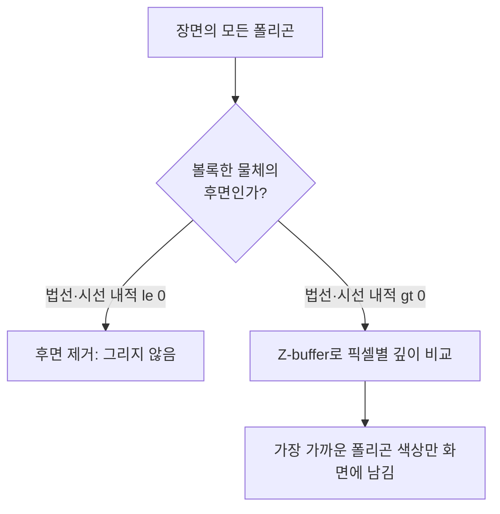

<Callout type="info">
  **이번 문서의 목표:** Z-buffer 알고리즘이 픽셀마다 깊이값을 어떻게 비교·갱신하는지 표로 직접 채울 수 있고, 법선 벡터와 시선 벡터의 내적 부호로 후면(back-face)을 판정할 수 있으며, painter's algorithm·BSP 트리·스캔라인 은면 제거의 차이를 설명할 수 있게 된다.
</Callout>

## 왜 "보이는 면만 그리기"가 어려운 문제인가

08편에서 3차원 물체를 카메라가 보는 2차원 화면으로 투영(projection)하는 방법을 배웠습니다. 하지만 투영만으로는 문제가 끝나지 않습니다. 상자 안쪽 면처럼 카메라에서 보이지 않아야 할 면도 투영 계산 자체는 문제없이 화면 좌표를 얻기 때문에, 그대로 그리면 뒤에 가려져야 할 면이 앞면을 뚫고 나와 보이는 이상한 그림이 됩니다.

**은면 제거**(Hidden Surface Removal, 가시표면 판별이라고도 함)는 여러 개의 면(폴리곤) 중에서 카메라에서 실제로 보이는 면만 화면에 그리고, 다른 면에 가려진 부분은 그리지 않도록 걸러내는 과정입니다. 이 편에서는 그중 가장 널리 쓰이는 **Z-buffer**(깊이 버퍼) 알고리즘과, 계산량을 줄이기 위한 사전 필터링 기법인 **후면 제거**(Back-Face Culling)를 실제 숫자로 계산해 보고, 그 밖의 대표 기법인 painter's algorithm·BSP 트리·스캔라인 방식과 비교합니다.

> **쉽게 말하면:** 은면 제거는 카메라 쪽에서 봤을 때 다른 물체에 가려서 안 보여야 하는 면을 실제로 화면에 그리지 않도록 걸러내는 작업입니다.

## 1. Z-buffer(깊이 버퍼) 알고리즘

> **쉽게 말하면:** 화면의 각 픽셀마다 "지금까지 그려진 것 중 카메라에 가장 가까운 거리"를 따로 기억해 두고, 새로 그리려는 점이 그보다 더 가까울 때만 화면을 갱신하는 방법입니다.

**Z-buffer**는 색상을 저장하는 프레임버퍼(01편에서 다룬 화면 픽셀 배열)와 똑같은 크기의 보조 배열을 하나 더 두고, 여기에 색상 대신 각 픽셀에서 **카메라로부터의 깊이값**(z값, 카메라 좌표계 기준 거리)을 저장합니다. 이 보조 배열이 바로 깊이 버퍼(Depth Buffer)입니다.

알고리즘은 다음 순서로 동작합니다.

<Steps>
1. 깊이 버퍼의 모든 칸을 "가장 먼 값"(보통 무한대, $\infty$)으로 초기화하고, 색상 버퍼는 배경색으로 초기화한다.
2. 장면에 있는 폴리곤을 순서에 상관없이 하나씩 꺼낸다.
3. 그 폴리곤이 덮는 각 픽셀에 대해, 그 폴리곤의 해당 픽셀에서의 깊이값 $z_{new}$를 계산한다.
4. 깊이 버퍼에 저장된 현재 값 $z_{buffer}$와 비교해, $z_{new} < z_{buffer}$이면(카메라에 더 가까우면) 색상 버퍼와 깊이 버퍼를 모두 새 값으로 갱신한다. 그렇지 않으면 아무것도 하지 않는다.
5. 모든 폴리곤의 모든 픽셀을 처리할 때까지 2~4를 반복한다.
</Steps>

- $z_{new}$: 지금 그리려는 폴리곤이 특정 픽셀에서 갖는 깊이값(카메라에서 가까울수록 작은 값이라고 정한다)
- $z_{buffer}$: 그 픽셀에 지금까지 기록된, 가장 가까웠던 깊이값

### 실제 계산 — 픽셀별 깊이 비교표 채우기

화면의 한 가로줄에서 픽셀 5개(P1~P5)를 겹치는 폴리곤 A(삼각형, 카메라에서 먼 배경)와 폴리곤 B(사각형, 카메라에서 가까운 물체)가 아래 표의 깊이값으로 덮는다고 하겠습니다. 폴리곤이 그 픽셀을 덮지 않으면 `-`로 표시합니다. 처리 순서는 **A를 먼저, B를 나중에** 그린다고 가정합니다.

| 픽셀 | 배경(초기 깊이 버퍼) | 폴리곤 A의 깊이 | A 처리 후 깊이 버퍼 | 폴리곤 B의 깊이 | B 처리 후 깊이 버퍼 | 최종 화면에 남는 폴리곤 |
|------|----------------------|-----------------|----------------------|-----------------|----------------------|--------------------------|
| P1 | $\infty$ | 8 | 8 (A) | – | 8 (A) | A |
| P2 | $\infty$ | 8 | 8 (A) | 4 | 4 (B) | B |
| P3 | $\infty$ | 8 | 8 (A) | 4 | 4 (B) | B |
| P4 | $\infty$ | – | $\infty$ (배경) | 4 | 4 (B) | B |
| P5 | $\infty$ | – | $\infty$ (배경) | – | $\infty$ (배경) | 배경 |

P2를 예로 계산 과정을 풀어 보면 다음과 같습니다.

$$
z_{new}(\text{A}) = 8 < z_{buffer}(\infty) \Rightarrow \text{갱신: } z_{buffer} = 8,\ \text{색상} = \text{A}
$$

$$
z_{new}(\text{B}) = 4 < z_{buffer}(8) \Rightarrow \text{갱신: } z_{buffer} = 4,\ \text{색상} = \text{B}
$$

- 결과: P2는 A(깊이 8)보다 B(깊이 4)가 카메라에 더 가까우므로, 나중에 B를 그리면서 깊이 버퍼가 8에서 4로 갱신되고 화면에는 B의 색이 남는다.

여기서 중요한 성질은, **폴리곤을 A, B 순서로 그리든 B, A 순서로 그리든 최종 결과가 같다**는 것입니다. B를 먼저 그리면 P2의 깊이 버퍼는 4가 되고, 이어서 A를 그릴 때 $z_{new}(\text{A}) = 8$은 $z_{buffer}(4)$보다 크므로 갱신되지 않아 결국 B가 그대로 남습니다. 이렇게 **그리는 순서와 무관하게 항상 올바른 결과**를 내는 것이 Z-buffer의 가장 큰 장점이며, 뒤에서 다룰 painter's algorithm과의 결정적인 차이입니다.

**자주 틀리는 점:** 깊이값이 클수록 가까운 것으로 착각하는 경우가 많습니다. 이 문서(그리고 대부분의 교재)는 **카메라 좌표계에서 값이 작을수록 카메라에 가깝다**는 관례를 사용합니다. 문제에서 관례를 다르게 정의하면(예: 값이 클수록 가까움) 부등호 방향이 반대로 바뀌므로, 항상 문제에 주어진 정의를 먼저 확인해야 합니다.

## 2. 후면 제거(Back-Face Culling) — 계산량을 줄이는 사전 필터

> **쉽게 말하면:** 상자나 구처럼 속이 막힌 물체는 카메라 반대쪽을 향한 면이 화면에 아예 안 보이므로, Z-buffer 계산을 하기도 전에 그런 면을 미리 걸러내는 것입니다.

Z-buffer는 정확하지만 모든 폴리곤의 모든 픽셀에 대해 깊이 비교를 해야 하므로 계산량이 많습니다. 속이 막힌(convex, 볼록한) 물체라면, 카메라 반대 방향을 향한 면은 어차피 다른 면에 완전히 가려져 절대 보이지 않는다는 사실을 미리 알 수 있습니다. 이런 면을 Z-buffer 계산에 넣기 전에 걸러내는 것이 **후면 제거**입니다.

판정 방법은 폴리곤의 **법선 벡터**(Normal Vector, 면에 수직으로 뻗은 벡터)와 **시선 벡터**(View Vector, 면에서 카메라를 향하는 벡터)의 **내적**(Dot Product)을 이용합니다.

$$
\vec{N} \cdot \vec{V} > 0 \Rightarrow \text{전면(front-face), 그린다}
$$

$$
\vec{N} \cdot \vec{V} \le 0 \Rightarrow \text{후면(back-face), 제거한다}
$$

- $\vec{N}$: 폴리곤 표면에 수직인 법선 벡터(관례상 물체 바깥쪽을 향하도록 정의)
- $\vec{V}$: 폴리곤 위의 한 점에서 카메라(시점)를 향하는 시선 벡터
- 내적 $\vec{N} \cdot \vec{V}$는 두 벡터 사이 각도 $\theta$에 대해 $|\vec{N}||\vec{V}|\cos\theta$와 같으므로, 두 벡터가 $90$도보다 좁은 각을 이루면(같은 방향에 가까우면) 양수, $90$도보다 넓은 각을 이루면(반대 방향에 가까우면) 음수가 된다.

### 실제 계산 — 법선·시선 벡터의 내적으로 판정하기

삼각형의 세 꼭짓점이 $A = (0, 0, 0)$, $B = (2, 0, 0)$, $C = (0, 2, 0)$이고, 카메라(시점)가 $E = (0, 0, 5)$에 있다고 하겠습니다. 먼저 법선 벡터를 구하기 위해 두 변 벡터를 만듭니다.

$$
\vec{AB} = B - A = (2, 0, 0), \qquad \vec{AC} = C - A = (0, 2, 0)
$$

두 변 벡터의 **외적**(Cross Product)이 법선 벡터입니다.

$$
\vec{N} = \vec{AB} \times \vec{AC} = (0 \times 0 - 0 \times 2,\ 0 \times 0 - 2 \times 0,\ 2 \times 2 - 0 \times 0) = (0, 0, 4)
$$

- 외적 공식 $(a_1,a_2,a_3) \times (b_1,b_2,b_3) = (a_2b_3-a_3b_2,\ a_3b_1-a_1b_3,\ a_1b_2-a_2b_1)$을 그대로 대입한 결과다.

이제 삼각형 위의 점 $A$에서 카메라 $E$를 향하는 시선 벡터를 구합니다.

$$
\vec{V} = E - A = (0, 0, 5) - (0, 0, 0) = (0, 0, 5)
$$

두 벡터의 내적을 계산합니다.

$$
\vec{N} \cdot \vec{V} = (0 \times 0) + (0 \times 0) + (4 \times 5) = 20
$$

- 결과: 내적이 $20 > 0$이므로 이 삼각형은 **전면**이다. 법선이 카메라와 같은 쪽(양의 $z$ 방향)을 향하고 있으므로, 실제로 카메라에서 이 면의 앞쪽이 보인다는 뜻과 일치한다.

같은 삼각형이지만 꼭짓점 순서를 반대로($A, C, B$ 순서) 정의하면 법선이 반대 방향이 됩니다.

$$
\vec{N'} = \vec{AC} \times \vec{AB} = (0, 0, -4)
$$

$$
\vec{N'} \cdot \vec{V} = (0 \times 0) + (0 \times 0) + (-4 \times 5) = -20
$$

- 결과: 내적이 $-20 \le 0$이므로 이번에는 **후면**으로 판정되어 제거된다. 이 예는 같은 위치의 같은 삼각형이라도 **꼭짓점을 나열하는 순서**(winding order, 정점 감김 순서)에 따라 법선의 방향이 뒤집히고, 그 결과 전면·후면 판정도 뒤집힌다는 것을 보여준다.

**자주 틀리는 점:** 후면 제거는 Z-buffer를 대체하는 것이 아니라 **Z-buffer 계산 전에 부담을 줄이는 사전 단계**입니다. 볼록하지 않은(오목한, concave) 물체나 여러 물체가 서로를 가리는 장면에서는 후면 제거만으로 은면 문제를 다 해결할 수 없고, 결국 Z-buffer 같은 정밀한 가시성 판별이 함께 필요합니다.

## 3. 그 밖의 은면 제거 기법 비교

| 기법 | 핵심 아이디어 | 장점 | 단점 |
|------|----------------|------|------|
| Z-buffer | 픽셀마다 깊이값을 저장해 더 가까운 값으로만 갱신 | 폴리곤 처리 순서와 무관하게 항상 정확, 구현이 단순해 하드웨어(GPU) 가속에 적합 | 폴리곤 수·해상도에 비례해 깊이 버퍼용 메모리와 비교 연산이 늘어난다 |
| Painter's algorithm(화가 알고리즘) | 폴리곤을 카메라에서 먼 것부터 가까운 순서로 정렬해 뒤에서부터 덧칠하듯 그린다 | 깊이 버퍼 없이 정렬만으로 동작해 개념이 단순하다 | 폴리곤끼리 서로 겹쳐 자르거나(intersect) 순환 가림(A가 B를 가리고 B가 C를 가리고 C가 다시 A를 가리는 경우)이 있으면 올바른 정렬 자체가 불가능하다 |
| BSP 트리(Binary Space Partitioning Tree, 이진 공간 분할 트리) | 장면을 평면으로 계속 반으로 나누어 트리를 만들어 두고, 카메라 위치에 따라 트리를 순회하는 순서만 바꿔 항상 올바른 뒤에서 앞 순서를 얻는다 | 트리를 한 번만 만들어 두면(전처리) 카메라가 움직여도 매번 정렬할 필요 없이 순회 순서만 결정하면 된다 | 트리를 만드는 전처리 비용이 크고, 물체가 움직이는(동적인) 장면에서는 트리를 다시 만들어야 한다 |
| 스캔라인 은면 제거(Scanline Hidden Surface) | 화면을 가로줄(scanline) 단위로 처리하면서, 그 줄과 교차하는 폴리곤들 중 각 구간에서 가장 가까운 폴리곤만 채운다 | 한 줄 단위로만 깊이 정보를 유지하면 되어 전체 화면 크기의 깊이 버퍼가 필요 없다 | 폴리곤과 스캔라인의 교차 구간을 매번 계산·정렬해야 해 구현이 복잡하다 |

## 핵심 정리

- Z-buffer는 픽셀마다 깊이값을 저장해 두고, 새 폴리곤의 깊이가 더 작을(가까울) 때만 색상과 깊이를 갱신하며, 이 방식은 폴리곤 처리 순서와 무관하게 항상 정확한 결과를 준다.
- 후면 제거는 법선 벡터와 시선 벡터의 내적 부호로 판정한다 — 내적이 양수면 전면, 0 이하면 후면으로 제거한다.
- 법선 벡터의 방향은 꼭짓점을 나열하는 순서(winding order)에 따라 정해지며, 순서가 바뀌면 전면·후면 판정도 뒤바뀐다.
- 후면 제거는 Z-buffer를 대체하지 못하며, 계산 부담을 줄이는 사전 필터 역할만 한다.
- Painter's algorithm은 정렬만으로 동작하지만 순환 가림·교차 폴리곤에서 실패할 수 있고, BSP 트리는 전처리로 이 문제를 해결하며, 스캔라인 방식은 한 줄 단위로 깊이 정보를 유지한다.

## 마무리 복습

<Quiz
  questionNumber={1}
  question="Z-buffer 알고리즘에서 새로운 폴리곤을 화면에 반영하는 조건으로 가장 적절한 것은?"
  options={['새 픽셀의 깊이값이 현재 깊이 버퍼에 저장된 값보다 작을 때(더 가까울 때)', '새 폴리곤이 장면에서 가장 마지막에 정의되었을 때', '새 폴리곤의 색상이 배경색과 다를 때', '새 픽셀의 깊이값이 항상 0보다 클 때']}
  correctAnswer={1}
  explanation="Z-buffer는 값이 작을수록 카메라에 가깝다는 관례를 기준으로, 새 깊이값이 현재 저장된 값보다 작을 때만 색상과 깊이 버퍼를 갱신한다."
  optionExplanations={['본문의 갱신 조건 z_new < z_buffer와 정확히 일치한다.', '정의 순서는 Z-buffer의 갱신 조건과 무관하다 — 순서와 무관하게 항상 같은 결과가 나오는 것이 Z-buffer의 장점이다.', '색상이 다르다는 것만으로는 어느 것이 더 가까운지 알 수 없다.', '깊이값이 0보다 크다는 조건은 임의의 문턱값일 뿐 갱신 기준이 아니다.']}
/>

<Quiz
  questionNumber={2}
  question="본문의 픽셀 P2 예시에서 폴리곤 A의 깊이가 8, 폴리곤 B의 깊이가 4일 때, A를 먼저 그리고 B를 나중에 그리면 P2에 최종적으로 남는 색은?"
  options={['B의 색', 'A의 색', '배경색', 'A와 B가 섞인 색']}
  correctAnswer={1}
  explanation="A를 그려 깊이 버퍼가 8이 된 뒤 B의 깊이 4가 8보다 작으므로 갱신되어, 최종적으로 B의 색이 남는다."
  optionExplanations={['4 < 8이므로 나중에 그린 B가 깊이 버퍼를 갱신해 화면에 남는다는 계산과 일치한다.', 'A는 나중에 온 B보다 깊이가 커서(멀어서) 덮어써진다.', '두 폴리곤 모두 P2를 덮으므로 배경색이 남을 수 없다.', 'Z-buffer는 색을 섞지 않고 더 가까운 폴리곤의 색으로 완전히 교체한다.']}
/>

<Quiz
  questionNumber={3}
  question="Z-buffer 알고리즘이 painter's algorithm보다 우수한 점으로 가장 적절한 것은?"
  options={['폴리곤을 그리는 순서와 무관하게 항상 정확한 결과를 낸다', '깊이 버퍼용 메모리를 전혀 사용하지 않는다', '항상 painter’s algorithm보다 계산량이 적다', '오목한 물체에서는 사용할 수 없다']}
  correctAnswer={1}
  explanation="Z-buffer는 각 픽셀마다 항상 더 가까운 깊이값으로 갱신하므로, 폴리곤을 어떤 순서로 처리해도 최종 결과가 동일하다는 것이 painter's algorithm 대비 핵심 장점이다."
  optionExplanations={['본문에서 A, B 순서를 바꿔도 결과가 같음을 확인한 성질과 일치한다.', 'Z-buffer는 화면 크기만큼의 깊이 버퍼 메모리를 반드시 사용한다.', '계산량은 장면 구성에 따라 달라지며 항상 더 적다고 단정할 수 없다.', 'Z-buffer는 오목한 물체를 포함한 모든 폴리곤 조합에서 정확하게 동작한다.']}
/>

<Quiz
  questionNumber={4}
  question="법선 벡터가 N=(0, 0, 4)이고 시선 벡터가 V=(0, 0, 5)일 때, 이 폴리곤에 대한 후면 제거 판정으로 가장 적절한 것은?"
  options={['내적이 20으로 양수이므로 전면이다', '내적이 -20으로 음수이므로 후면이다', '내적이 0이므로 판정할 수 없다', '벡터의 크기가 달라 내적을 계산할 수 없다']}
  correctAnswer={1}
  explanation="N·V = 0x0+0x0+4x5=20으로 양수이므로 법선과 시선이 비슷한 방향을 향하는 전면으로 판정된다."
  optionExplanations={['본문의 내적 계산 20 > 0과 정확히 일치한다.', '부호를 반대로 계산한 오답이다.', '내적 값이 정확히 20으로 계산되므로 0이 아니다.', '두 벡터의 차원이 같으면 크기가 달라도 내적을 계산할 수 있다.']}
/>

<Quiz
  questionNumber={5}
  question="같은 위치의 삼각형이라도 꼭짓점을 나열하는 순서(winding order)를 반대로 바꾸면 후면 제거 판정에 어떤 영향을 주는가?"
  options={['법선 벡터의 방향이 반대로 뒤집혀 전면·후면 판정이 뒤바뀐다', '법선 벡터의 크기만 두 배로 커진다', '판정에는 전혀 영향을 주지 않는다', '시선 벡터의 방향이 자동으로 반대로 바뀐다']}
  correctAnswer={1}
  explanation="외적의 순서를 바꾸면 결과 벡터의 방향이 반대가 되므로(AB×AC와 AC×AB는 부호가 반대), 법선이 뒤집혀 내적의 부호도 뒤바뀌고 전면·후면 판정이 반대로 나온다."
  optionExplanations={['본문에서 N=(0,0,4)가 순서를 바꾸자 N2=(0,0,-4)로 뒤집힌 예와 일치한다.', '외적 순서를 바꾸면 방향만 반대가 되고 크기는 그대로다.', '판정이 뒤바뀌는 것이 이 성질의 핵심이다.', '시선 벡터는 카메라와 점의 위치로 정해지며 꼭짓점 나열 순서와 무관하다.']}
/>

<Quiz
  questionNumber={6}
  question="BSP 트리(이진 공간 분할 트리) 방식이 painter's algorithm의 문제를 해결하는 방법으로 가장 적절한 것은?"
  options={['장면을 평면으로 미리 분할해 트리로 만들어 두고, 카메라 위치에 따라 순회 순서만 정해 항상 올바른 뒤에서 앞 순서를 얻는다', '모든 폴리곤을 매 프레임마다 새로 정렬해 순환 가림을 피한다', '깊이 버퍼를 화면 크기만큼 만들어 픽셀 단위로 비교한다', '폴리곤을 절대 겹치지 않도록 사전에 잘라내 순환 가림 자체가 발생하지 않게 만든다']}
  correctAnswer={1}
  explanation="BSP 트리는 전처리 단계에서 평면 분할 트리를 한 번 만들어 두고, 이후에는 카메라 위치에 따라 트리를 순회하는 순서만 바꾸면 순환 가림이 있어도 항상 올바른 그리기 순서를 얻을 수 있다."
  optionExplanations={['본문의 BSP 트리 설명과 정확히 일치한다.', '매 프레임 새로 정렬하는 것은 painter 알고리즘 방식이며 BSP 트리는 트리 구조를 재사용한다.', '픽셀 단위 깊이 버퍼 비교는 Z-buffer의 방식이다.', 'BSP 트리는 폴리곤을 필요할 때 분할하기도 하지만, 핵심은 겹침 자체를 없애는 것이 아니라 트리로 순서를 관리하는 것이다.']}
/>

## 참고 자료

- [Edinburgh University - Computer Graphics / Visible Surface](https://www.inf.ed.ac.uk/teaching/courses/cg/lectures/cg9_2012.pdf)
- [Illinois CS418 - Visible Surface / Z-Buffer](https://courses.grainger.illinois.edu/cs418/sp2009/notes/10-VisibleSurface.pdf)
- [Rice University - Hidden Surface Algorithms](https://www.clear.rice.edu/comp360/lectures/old/HiddenSurfTextNew.pdf)
