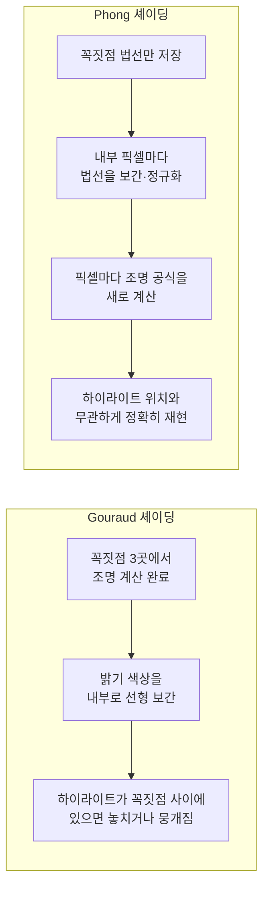

<Callout type="info">
  **이번 문서의 목표:** Gouraud 셰이딩과 Phong 셰이딩이 삼각형 내부의 한 점에서 각각 무엇을 보간(interpolation)하는지 실제 숫자로 계산해 구분할 수 있고, 두 방식의 계산량 차이와 하이라이트(specular highlight) 표현 품질 차이를 설명할 수 있게 된다.
</Callout>

## 왜 삼각형 하나에도 "칠하는 방법"이 여러 가지인가

11편에서 배운 Phong 조명 모델은 **점 하나**의 밝기를 구하는 공식입니다. 그런데 실제 3D 모델은 매끄러운 곡면이 아니라 수많은 삼각형(폴리곤)을 이어 붙인 근사 형태(mesh, 메시)입니다. 삼각형 하나의 내부는 무수히 많은 픽셀로 이루어져 있는데, 이 모든 픽셀 각각에 대해 조명 계산을 처음부터 다시 하려면 계산량이 매우 커집니다. **셰이딩**(Shading)은 삼각형의 꼭짓점 몇 개에서 얻은 정보를 삼각형 내부 픽셀들에 **어떻게 나누어 퍼뜨릴 것인가**를 정하는 방법입니다.

가장 단순한 방법은 삼각형 하나에 법선 벡터를 하나만 두고 밝기도 하나만 계산해 삼각형 전체를 그 색 하나로 칠하는 **플랫 셰이딩**(Flat Shading)입니다. 계산은 가장 빠르지만, 삼각형과 삼각형의 경계에서 밝기가 뚝뚝 끊겨 보여(마치 다각형으로 깎아 만든 보석처럼) 매끄러운 곡면을 표현하기에는 부족합니다. 이 문제를 해결하기 위해 등장한 것이 **Gouraud 셰이딩**과 **Phong 셰이딩**입니다.

> **쉽게 말하면:** 플랫 셰이딩이 삼각형 하나를 단색으로 칠하는 것이라면, Gouraud와 Phong 셰이딩은 꼭짓점에서 얻은 정보를 삼각형 안쪽으로 부드럽게 번지듯 퍼뜨려 매끄러운 곡면처럼 보이게 만드는 방법입니다.

## 1. 두 방식이 보간하는 대상이 다르다

두 방식 모두 삼각형의 세 꼭짓점에서 **정점 법선**(Vertex Normal, 그 꼭짓점을 공유하는 인접한 면들의 법선을 평균 내어 만든 법선)을 미리 구해 둔다는 점은 같습니다. 차이는 삼각형 내부의 한 점을 칠할 때 **무엇을 보간하는가**에서 갈립니다.

- **Gouraud 셰이딩**: 세 꼭짓점 각각에서 11편의 Phong 조명 공식을 이용해 **밝기(색상)를 미리 계산**해 둔 뒤, 삼각형 내부의 각 픽셀에서는 이 세 밝기 값을 **선형 보간**(색상을 보간)해서 사용한다. 내부 픽셀에서는 조명 공식을 다시 계산하지 않는다.
- **Phong 셰이딩**(주의: 11편의 Phong *조명 모델*과 이름은 같지만 다른 개념이다): 세 꼭짓점의 법선 벡터를 삼각형 내부로 **먼저 보간**해서 각 픽셀마다 고유한 법선을 만든 다음, 그 보간된 법선으로 **각 픽셀에서 Phong 조명 공식을 새로 계산**한다.

| 항목 | Gouraud 셰이딩 | Phong 셰이딩 |
|------|-----------------|---------------|
| 보간 대상 | 꼭짓점에서 계산한 밝기(색상) | 꼭짓점의 법선 벡터 |
| 조명 공식 계산 위치 | 꼭짓점 3곳에서만 계산 | 삼각형 내부의 픽셀마다 계산 |
| 계산량 | 적음(꼭짓점 수만큼만 조명 계산) | 많음(픽셀 수만큼 조명 계산) |
| 하이라이트 표현 | 하이라이트가 꼭짓점 사이에 있으면 놓치거나 뭉개질 수 있음 | 픽셀 단위로 다시 계산하므로 하이라이트를 정확히 재현 |
| 적합한 경우 | 무광 표면, 실시간성이 중요해 계산량을 아껴야 하는 경우 | 반짝이는 표면, 하이라이트 품질이 중요한 경우 |

> **쉽게 말하면:** Gouraud 셰이딩은 "꼭짓점에서 계산한 색을 섞어 칠하기"이고, Phong 셰이딩은 "꼭짓점에서 계산한 방향(법선)을 섞은 뒤 그 방향으로 다시 밝기를 계산하기"입니다.

## 2. 무게중심 좌표로 보간하기

삼각형 내부의 한 점 $P$를 세 꼭짓점 $A, B, C$의 가중 평균으로 표현하는 좌표를 **무게중심 좌표**(Barycentric Coordinate)라고 합니다.

$$
P = \alpha A + \beta B + \gamma C, \qquad \alpha + \beta + \gamma = 1
$$

- $\alpha, \beta, \gamma$: 각각 $A, B, C$가 점 $P$에 기여하는 비중(가중치). $P$가 $A$에 가까울수록 $\alpha$가 커진다.
- 이 가중치는 09편에서 다룬 Bezier 곡선의 번스타인 기저처럼, 세 값의 합이 항상 1인 가중 평균 구조를 갖는다.

Gouraud 셰이딩은 이 가중치를 **밝기(색상) 값**에 곱해 더하고, Phong 셰이딩은 같은 가중치를 **법선 벡터**에 곱해 더한다는 점만 다를 뿐, 보간 계산 자체의 구조는 동일합니다.

## 3. 실제 계산 — 같은 삼각형, 두 가지 보간 결과 비교

삼각형의 세 꼭짓점 $A, B, C$에서 이미 정점 법선을 다음과 같이 구해 두었다고 하겠습니다(모두 단위 벡터).

$$
\vec{N}_A = (0, 0, 1), \qquad \vec{N}_B = (0.6, 0, 0.8), \qquad \vec{N}_C = (-0.6, 0, 0.8)
$$

광원은 정면 위쪽 $\vec{L} = (0, 0, 1)$ 방향에 있고, 단순화를 위해 확산 반사 계수 $k_d = 1$, 주변광과 반사광은 계산에서 제외하고 **확산광만** 비교한다고 하겠습니다. 삼각형 내부의 점 $P$는 무게중심 좌표 $\alpha = 0.5$(A쪽에 가까움), $\beta = 0.3$, $\gamma = 0.2$로 표현된다고 하겠습니다.

### 방법 1: Gouraud 셰이딩 — 꼭짓점 밝기를 먼저 계산한 뒤 보간

각 꼭짓점에서 확산광 공식 $I = k_d (\vec{N} \cdot \vec{L})$을 계산합니다.

$$
I_A = 1 \times (\vec{N}_A \cdot \vec{L}) = 1 \times (0 \times 0 + 0 \times 0 + 1 \times 1) = 1.0
$$

$$
I_B = 1 \times (\vec{N}_B \cdot \vec{L}) = 1 \times (0.6 \times 0 + 0 \times 0 + 0.8 \times 1) = 0.8
$$

$$
I_C = 1 \times (\vec{N}_C \cdot \vec{L}) = 1 \times (-0.6 \times 0 + 0 \times 0 + 0.8 \times 1) = 0.8
$$

이제 무게중심 좌표로 세 밝기 값을 선형 보간합니다.

$$
I_P^{Gouraud} = \alpha I_A + \beta I_B + \gamma I_C = 0.5 \times 1.0 + 0.3 \times 0.8 + 0.2 \times 0.8 = 0.5 + 0.24 + 0.16 = 0.90
$$

- 결과: Gouraud 셰이딩으로 구한 점 $P$의 밝기는 $0.90$이다. 이 값은 꼭짓점에서 이미 계산해 둔 세 밝기 값을 단순히 섞은 것일 뿐, $P$ 지점의 실제 법선 방향은 전혀 사용하지 않았다.

### 방법 2: Phong 셰이딩 — 법선을 먼저 보간한 뒤 그 자리에서 다시 계산

같은 무게중심 좌표로 이번에는 밝기가 아니라 **법선 벡터**를 보간합니다.

$$
\vec{N}_P' = \alpha \vec{N}_A + \beta \vec{N}_B + \gamma \vec{N}_C = 0.5(0,0,1) + 0.3(0.6,0,0.8) + 0.2(-0.6,0,0.8)
$$

성분별로 더하면 다음과 같습니다.

$$
\vec{N}_P' = (0 + 0.18 - 0.12,\ 0 + 0 + 0,\ 0.5 + 0.24 + 0.16) = (0.06,\ 0,\ 0.90)
$$

보간된 벡터는 단위 벡터가 아니므로(세 단위 벡터의 가중 평균은 일반적으로 길이가 1이 아니다), 다시 정규화해야 합니다.

$$
|\vec{N}_P'| = \sqrt{0.06^2 + 0^2 + 0.90^2} = \sqrt{0.0036 + 0.81} = \sqrt{0.8136} \approx 0.902
$$

$$
\vec{N}_P = \left(\frac{0.06}{0.902},\ 0,\ \frac{0.90}{0.902}\right) \approx (0.0665,\ 0,\ 0.998)
$$

이제 이 픽셀에서 **새로** 확산광 공식을 계산합니다.

$$
I_P^{Phong} = k_d (\vec{N}_P \cdot \vec{L}) = 1 \times (0.0665 \times 0 + 0 \times 0 + 0.998 \times 1) = 0.998
$$

- 결과: Phong 셰이딩으로 구한 점 $P$의 밝기는 $0.998$로, Gouraud 셰이딩의 $0.90$보다 더 밝게 나왔다. 두 방식이 사용한 재료(꼭짓점 법선, 무게중심 좌표)는 완전히 같았지만, **법선을 먼저 섞고 나중에 조명 공식을 적용**한 Phong 셰이딩이 $P$ 지점의 실제 표면 방향을 더 정확하게 반영한 것이다.

## 4. 하이라이트 표현에서 벌어지는 차이

위 예시는 확산광만 비교했지만, 차이는 **반사광(specular, 하이라이트) 항**에서 훨씬 두드러집니다. 반사광 항은 $(\vec{R} \cdot \vec{V})^n$처럼 지수 $n$으로 거듭제곱되어 있어, 정반사 방향에서 조금만 벗어나도 값이 급격히 0에 가까워지는 매우 뾰족한 함수입니다.

만약 삼각형의 세 꼭짓점 $A, B, C$ 중 어디도 정확한 하이라이트 위치(반사 벡터와 시선 벡터가 일치하는 지점)에 있지 않고, 하이라이트가 삼각형 **내부**에 놓인다고 하겠습니다.

- **Gouraud 셰이딩**은 세 꼭짓점에서만 밝기를 계산하므로, 세 꼭짓점 모두 하이라이트 값이 낮게 계산됩니다. 그러면 아무리 내부 픽셀에서 선형 보간을 해도, 낮은 값들 사이의 보간 결과 역시 낮게만 나와 **하이라이트를 통째로 놓치거나 실제보다 흐릿하고 넓게 뭉개져 보입니다.**
- **Phong 셰이딩**은 내부의 모든 픽셀에서 법선을 새로 보간하고 조명 공식을 다시 계산하므로, 삼각형 내부 어디에 하이라이트가 있든 그 위치의 법선을 이용해 **정확한 하이라이트를 재현**할 수 있습니다.

**자주 틀리는 점:** "Phong 셰이딩"과 "Phong 조명 모델"을 같은 것으로 혼동하는 경우가 매우 흔합니다. Phong **조명 모델**(11편)은 "밝기를 어떤 공식으로 계산할 것인가"에 대한 답이고, Phong **셰이딩**(이 편)은 "그 공식을 삼각형의 어느 지점에서, 어떤 값을 보간한 뒤에 적용할 것인가"에 대한 답입니다. Gouraud 셰이딩도 내부적으로는 Phong 조명 모델(또는 더 단순한 모델)을 사용할 수 있으며, 두 개념은 서로 다른 층위의 문제라는 점을 구분해야 합니다.

## 핵심 정리

- 셰이딩은 삼각형 꼭짓점에서 얻은 정보를 내부 픽셀에 어떻게 퍼뜨릴지 정하는 방법으로, 플랫·Gouraud·Phong 셰이딩이 대표적이다.
- Gouraud 셰이딩은 꼭짓점에서 계산한 밝기(색상)를 무게중심 좌표로 선형 보간하며, 내부 픽셀에서는 조명 공식을 다시 계산하지 않는다.
- Phong 셰이딩은 꼭짓점의 법선 벡터를 먼저 보간·정규화한 뒤, 내부 픽셀마다 조명 공식을 새로 계산한다.
- 같은 삼각형·같은 무게중심 좌표를 사용해도 두 방식의 계산 결과는 다르며(본문 예시에서 0.90 대 0.998), 이는 "무엇을 보간한 뒤에 무엇을 계산하는가"의 순서 차이에서 비롯된다.
- 반사광(하이라이트) 항처럼 값이 급격히 변하는 항에서는 Gouraud 셰이딩이 하이라이트를 놓치거나 뭉갤 수 있는 반면, Phong 셰이딩은 픽셀 단위 재계산으로 하이라이트를 정확히 표현하지만 계산량이 더 많다.

## 마무리 복습

<Quiz
  questionNumber={1}
  question="Gouraud 셰이딩에서 삼각형 내부의 픽셀에 대해 보간하는 대상으로 가장 적절한 것은?"
  options={['꼭짓점에서 미리 계산한 밝기(색상) 값', '꼭짓점의 법선 벡터', '꼭짓점의 텍스처 좌표만', '광원의 위치 좌표']}
  correctAnswer={1}
  explanation="Gouraud 셰이딩은 세 꼭짓점에서 조명 공식으로 밝기를 미리 계산한 뒤, 그 밝기 값을 무게중심 좌표로 선형 보간해 내부 픽셀에 적용한다."
  optionExplanations={['본문의 Gouraud 셰이딩 정의와 정확히 일치한다.', '법선 벡터를 보간하는 것은 Phong 셰이딩의 특징이다.', '텍스처 좌표 보간은 셰이딩과는 별개의 텍스처 매핑 과정에 해당한다.', '광원 위치는 고정된 값으로 보간의 대상이 아니다.']}
/>

<Quiz
  questionNumber={2}
  question="Phong 셰이딩에서 삼각형 내부의 픽셀에 대해 보간하는 대상으로 가장 적절한 것은?"
  options={['꼭짓점의 법선 벡터', '꼭짓점에서 미리 계산한 최종 밝기 값', '꼭짓점의 색상만', '꼭짓점의 카메라 거리']}
  correctAnswer={1}
  explanation="Phong 셰이딩은 꼭짓점의 법선 벡터를 삼각형 내부로 보간하고 정규화한 뒤, 그 보간된 법선으로 각 픽셀에서 조명 공식을 새로 계산한다."
  optionExplanations={['본문의 Phong 셰이딩 정의와 정확히 일치한다.', '최종 밝기 값을 미리 계산해 보간하는 것은 Gouraud 셰이딩의 특징이다.', '색상만 보간하는 것은 Gouraud 셰이딩에 해당한다.', '카메라 거리는 법선 보간과 직접적인 관련이 없다.']}
/>

<Quiz
  questionNumber={3}
  question="본문의 예시에서 무게중심 좌표 α=0.5, β=0.3, γ=0.2와 꼭짓점 밝기 IA=1.0, IB=0.8, IC=0.8을 이용한 Gouraud 셰이딩 결과 IP로 가장 적절한 것은?"
  options={['0.90', '0.998', '0.80', '1.00']}
  correctAnswer={1}
  explanation="선형 보간 공식 IP = 0.5x1.0 + 0.3x0.8 + 0.2x0.8 = 0.5+0.24+0.16 = 0.90이다."
  optionExplanations={['무게중심 좌표를 이용한 선형 보간 계산과 정확히 일치한다.', '0.998은 같은 예시에서 Phong 셰이딩으로 계산한 결과다.', '0.80은 B, C 꼭짓점의 밝기 값일 뿐 보간 결과가 아니다.', '1.00은 A 꼭짓점의 밝기 값일 뿐 보간 결과가 아니다.']}
/>

<Quiz
  questionNumber={4}
  question="같은 삼각형과 같은 무게중심 좌표를 사용했음에도 본문 예시에서 Gouraud 결과(0.90)와 Phong 결과(0.998)가 다르게 나온 이유로 가장 적절한 것은?"
  options={['Gouraud는 밝기를 먼저 계산해 보간하고, Phong은 법선을 먼저 보간한 뒤 그 지점에서 조명 공식을 다시 계산하기 때문이다', 'Phong 셰이딩은 다른 광원을 사용했기 때문이다', 'Gouraud 셰이딩의 무게중심 좌표 계산이 잘못되었기 때문이다', '두 방식이 서로 다른 삼각형을 사용했기 때문이다']}
  correctAnswer={1}
  explanation="두 방식은 같은 꼭짓점 데이터와 같은 무게중심 좌표를 사용했지만, 보간의 대상과 순서(밝기를 보간 vs 법선을 보간한 뒤 재계산)가 다르기 때문에 결과값이 달라진다."
  optionExplanations={['본문에서 강조한 두 방식의 근본적인 차이(보간 순서)와 일치한다.', '두 방식 모두 같은 광원 L=(0,0,1)을 사용했다.', '두 계산 모두 같은 공식을 정확히 따랐으며 계산 오류가 아니다.', '두 방식 모두 같은 삼각형 A, B, C와 같은 점 P를 사용했다.']}
/>

<Quiz
  questionNumber={5}
  question="삼각형 내부에 하이라이트가 있고 세 꼭짓점 모두 하이라이트에서 벗어나 있을 때, Gouraud 셰이딩에서 나타나는 현상으로 가장 적절한 것은?"
  options={['하이라이트를 놓치거나 실제보다 흐릿하고 넓게 뭉개져 보인다', '하이라이트가 오히려 더 선명하고 날카롭게 보인다', '삼각형 전체가 검게 변한다', '텍스처 매핑이 자동으로 취소된다']}
  correctAnswer={1}
  explanation="Gouraud 셰이딩은 꼭짓점에서만 조명을 계산하므로 세 꼭짓점 모두 낮은 값이면 내부의 뾰족한 하이라이트 값을 반영하지 못해, 보간 결과가 낮고 뭉개진 형태로 나타난다."
  optionExplanations={['본문에서 설명한 Gouraud 셰이딩의 대표적인 한계와 일치한다.', '하이라이트가 선명해지는 것은 Phong 셰이딩의 장점이다.', '주변광과 확산광이 남아 있으므로 삼각형 전체가 검게 변하지는 않는다.', '텍스처 매핑은 셰이딩 방식과 독립적으로 동작하는 별개의 기능이다.']}
/>

<Quiz
  questionNumber={6}
  question="Phong 조명 모델과 Phong 셰이딩의 관계를 가장 정확하게 설명한 것은?"
  options={['Phong 조명 모델은 밝기를 계산하는 공식이고, Phong 셰이딩은 그 공식을 삼각형의 어느 지점에서 어떤 값을 보간한 뒤 적용할지를 정하는 방법이다', '두 용어는 완전히 같은 개념을 가리키는 동의어다', 'Phong 셰이딩은 조명 계산을 전혀 사용하지 않는 색상 혼합 기법이다', 'Phong 조명 모델은 Gouraud 셰이딩에서만 사용할 수 있고 Phong 셰이딩에서는 사용할 수 없다']}
  correctAnswer={1}
  explanation="Phong 조명 모델은 밝기 계산 공식(무엇을 계산할지)이고, Phong 셰이딩은 그 공식을 픽셀마다 보간된 법선으로 다시 계산하는 절차(어디서, 무엇을 보간한 뒤 계산할지)로, 서로 다른 층위의 개념이다."
  optionExplanations={['본문에서 강조한 두 개념의 관계와 정확히 일치한다.', '이름이 같아 혼동되지만 조명 모델(공식)과 셰이딩(적용 방법)은 서로 다른 개념이다.', 'Phong 셰이딩도 결국 조명 공식을 픽셀마다 계산하는 절차를 포함한다.', 'Phong 조명 모델은 Gouraud 셰이딩과 Phong 셰이딩 어디에서나 사용할 수 있는 공식이다.']}
/>

## 참고 자료

- [Edinburgh University - Computer Graphics / Visible Surface](https://www.inf.ed.ac.uk/teaching/courses/cg/lectures/cg9_2012.pdf)
- [MIT OCW - Graphics Pipeline and Rasterization](https://ocw.mit.edu/courses/6-837-computer-graphics-fall-2012/53d96abf747a3c82fd3497d2fea540f5_MIT6_837F12_Lec21.pdf)
