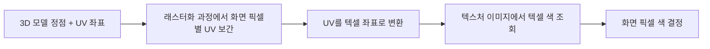
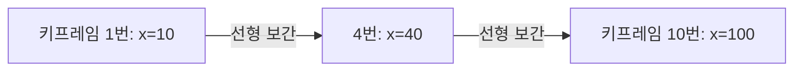

<Callout type="info">
  **이번 문서의 목표:** RGB·CMY·HSV 세 색상 모델의 정의와 상호 변환 계산을 할 수 있고, 텍스처 매핑에서 UV 좌표가 텍스셀 좌표로 바뀌는 과정과 키프레임 애니메이션에서 중간 프레임 값을 선형 보간으로 구하는 방법을 설명할 수 있게 된다.
</Callout>

## 왜 색상을 숫자로 다뤄야 하는가

지금까지는 점의 위치(좌표)를 다뤘다면, 이번 편은 그 점이 화면에 **어떤 색으로 보이는가**를 숫자로 표현하는 방법을 다룹니다. 화면의 색은 결국 픽셀(pixel, 화면을 이루는 가장 작은 사각형 단위) 하나에 저장된 몇 개의 숫자입니다. 이 숫자를 어떤 방식으로 조합하느냐에 따라 **색상 모델**(Color Model)이 달라지고, 목적에 따라 더 편한 모델이 다릅니다. 화면에 표시할 때는 RGB, 인쇄할 때는 CMY(K), 사람이 색을 고를 때는 HSV가 편합니다. 이어서 3D 모델 표면에 사진 같은 무늬를 입히는 **텍스처 매핑**(Texture Mapping)의 좌표 계산, 그리고 정지된 그림을 움직이는 것처럼 보이게 하는 **애니메이션**(Animation)의 기초인 키프레임과 보간을 다룹니다.

## 1. RGB 모델 — 빛을 더하는 모델

> **쉽게 말하면:** RGB는 빨강·초록·파랑 빛을 얼마나 세게 쏘느냐로 색을 만드는 방식이고, 모니터가 실제로 이 방식을 씁니다.

**RGB**(Red, Green, Blue)는 빨강·초록·파랑 세 가지 색광을 각각 얼마나 섞을지로 색을 표현하는 **가산 혼합**(Additive Mixing, 빛을 더할수록 밝아지는 혼합) 모델입니다. 각 채널은 보통 0(전혀 없음)부터 255(최대 밝기)까지 256단계의 정수로 저장하며, 세 채널을 모두 255로 하면 흰색, 모두 0으로 하면 검은색이 됩니다. 모니터·TV·스마트폰 화면은 실제로 빨강·초록·파랑 발광 소자를 촘촘히 박아 두고 이 값대로 빛을 쏘기 때문에 RGB가 표시 장치의 기본 모델입니다.

예를 들어 순수한 빨강은 $(255, 0, 0)$, 빨강과 초록을 최대로 더한 노랑은 $(255, 255, 0)$입니다. 이 문서 전체에서 예시로 쓸 색은 갈색 계열의 $(200, 100, 50)$입니다.

**자주 틀리는 점:** RGB를 물감처럼 "섞을수록 어두워진다"고 착각하는 경우가 많습니다. RGB는 빛이므로 값을 더할수록(255에 가까워질수록) 더 밝아지고, 세 값이 모두 최대이면 흰색입니다. 물감처럼 섞을수록 어두워지는 쪽은 다음에 볼 CMY입니다.

## 2. CMY(K) 모델 — 빛을 빼는 모델

> **쉽게 말하면:** CMY는 흰 종이에서 특정 빛을 얼마나 흡수해 없애느냐로 색을 만드는 방식이고, 프린터가 이 방식을 씁니다.

**CMY**(Cyan 청록, Magenta 자홍, Yellow 노랑)는 흰 바탕에서 특정 파장의 빛을 흡수해 지워 나가는 **감산 혼합**(Subtractive Mixing, 잉크를 더할수록 어두워지는 혼합) 모델입니다. 인쇄용 프린터가 이 방식을 쓰며, 실제 인쇄에서는 세 색을 섞어도 완전한 검정이 잘 나오지 않아 검정 잉크(Key, K)를 따로 추가한 **CMYK**를 씁니다. RGB에서 CMY로 바꾸는 계산은 각 채널을 0에서 1 사이 비율로 바꾼 뒤 1에서 빼는 것으로 이루어집니다.

$$
C = 1 - R'
$$

- $R'$: R값을 255로 나눈 0~1 사이 비율(예: $R = 200$이면 $R' = 200 \div 255 \approx 0.784$)
- $C$: 청록 성분(값이 클수록 빨간빛을 많이 흡수한다는 뜻)

같은 방식으로 $M = 1 - G'$, $Y = 1 - B'$입니다. 예시 색 $(200, 100, 50)$을 CMY로 바꿔 보겠습니다. 먼저 세 값을 255로 나눕니다.

$$
R' = 200 \div 255 \approx 0.784,\ G' = 100 \div 255 \approx 0.392,\ B' = 50 \div 255 \approx 0.196
$$

$$
C = 1 - 0.784 = 0.216
$$

$$
M = 1 - 0.392 = 0.608
$$

$$
Y = 1 - 0.196 = 0.804
$$

- 결과: $(200, 100, 50)$은 CMY로 $(0.216,\ 0.608,\ 0.804)$이다. 노랑 성분($Y$)이 가장 커서 파란빛을 가장 많이 흡수한다는 뜻이며, 이는 원래 색이 파란빛이 적은 갈색 계열이라는 것과 일치한다.

## 3. HSV 모델 — 사람이 고르기 편한 모델

> **쉽게 말하면:** HSV는 "무슨 색인지(색상) → 얼마나 선명한지(채도) → 얼마나 밝은지(명도)" 순서로 색을 고르는 방식이고, 색상 선택 도구가 이 방식을 씁니다.

**HSV**(Hue 색상, Saturation 채도, Value 명도)는 색을 원기둥 모양으로 배치해, 색상환에서 어느 각도인지(Hue, 0~360도), 그 색이 얼마나 순수한지(Saturation, 0~100퍼센트), 얼마나 밝은지(Value, 0~100퍼센트)로 표현합니다. RGB는 세 값이 서로 얽혀 있어 "더 선명하게" 같은 조정이 세 채널을 동시에 바꿔야 하지만, HSV는 채도 값 하나만 바꾸면 되므로 사람이 색을 고르거나 조정할 때 훨씬 직관적입니다. 그래픽 편집 프로그램의 색상환 선택 도구가 HSV 방식입니다.

RGB에서 HSV로 바꾸는 계산은 먼저 세 값 중 최댓값과 최솟값, 그 차이를 구하는 것으로 시작합니다.

$$
C_{max} = \max(R', G', B'),\quad C_{min} = \min(R', G', B'),\quad \Delta = C_{max} - C_{min}
$$

- $R', G', B'$: 위에서 구한 0~1 사이 비율값
- $C_{max}$: 세 값 중 가장 큰 값(명도의 기준이 된다)
- $\Delta$(델타): 최댓값과 최솟값의 차이(색이 얼마나 순수한지를 결정한다)

예시 색의 $R' = 0.784,\ G' = 0.392,\ B' = 0.196$을 대입하면 $C_{max} = 0.784$(R 채널), $C_{min} = 0.196$(B 채널), $\Delta = 0.784 - 0.196 = 0.588$입니다.

$$
V = C_{max} = 0.784
$$

- $V$(명도)는 세 값 중 최댓값을 그대로 쓴다. 가장 강하게 켜진 채널이 밝기를 결정한다는 뜻이다.

$$
S = \Delta \div C_{max} = 0.588 \div 0.784 \approx 0.75
$$

- $S$(채도)는 최댓값 대비 색 간 차이의 비율이다. 세 채널이 모두 같으면($\Delta = 0$) 채도는 0이 되어 무채색(회색·흰색·검정)이 된다.

최댓값이 R 채널이므로 색상(Hue)은 다음 식으로 구합니다.

$$
H = 60° \times \left( \frac{G' - B'}{\Delta} \right) = 60° \times \left( \frac{0.392 - 0.196}{0.588} \right) \approx 60° \times 0.333 \approx 20°
$$

- 결과: $(200, 100, 50)$은 HSV로 약 $(20°, 75\%, 78\%)$이다. 색상환에서 20도는 빨강(0도)에서 노랑(60도) 쪽으로 살짝 이동한 주황~갈색 계열에 해당해, 원래 색이 갈색이라는 것과 일치한다.

> **자주 틀리는 점:** 최댓값이 어느 채널이냐에 따라 Hue를 구하는 식이 달라진다는 것을 놓치기 쉽습니다. 최댓값이 R이면 위 식을, G이면 $60° \times ((B'-R')/\Delta + 2)$를, B이면 $60° \times ((R'-G')/\Delta + 4)$를 씁니다. 시험에서는 어느 채널이 최댓값인지부터 먼저 확인해야 합니다.

## 4. 세 모델 비교

| 모델 | 방식 | 대표 사용처 | 채널 구성 | 직관성 |
|---|---|---|---|---|
| RGB | 가산 혼합(빛을 더함) | 모니터·TV·스마트폰 화면 출력 | R, G, B(0–255) | 색 조정 시 세 채널이 서로 얽혀 낮음 |
| CMY(K) | 감산 혼합(빛을 흡수) | 잉크젯·레이저 프린터 인쇄 | C, M, Y(, K)(0–1 또는 퍼센트) | 인쇄 공정 기준이라 화면 색 감각과 다름 |
| HSV | 색상환 기반 | 색상 선택 UI, 이미지 보정 도구 | H(0–360도), S, V(0–100퍼센트) | 색상·채도·명도를 독립적으로 조절해 높음 |

## 5. 텍스처 매핑 개요 — 표면에 이미지를 입힌다

> **쉽게 말하면:** 텍스처 매핑은 3D 모델 표면을 평평하게 펼친 지도 위에 사진을 붙이고, 그 사진에서 어느 점을 가져다 쓸지 계산하는 작업입니다.

**텍스처 매핑**(Texture Mapping)은 3D 모델의 표면에 색상 대신(또는 색상과 함께) 2D 이미지(텍스처, Texture)를 입혀 사실감을 높이는 기법입니다. 이를 위해 3D 모델의 각 정점(vertex, 다각형의 꼭짓점)에 **UV 좌표**(0에서 1 사이 두 값)를 미리 부여해 두는데, 이는 3D 표면을 가위로 펼쳐 평평한 2D 텍스처 이미지 위의 어느 위치에 대응하는지를 나타내는 지도 좌표입니다. 렌더링 과정에서 화면에 그려질 픽셀마다 대응하는 UV 좌표를 보간해 구하고, 그 UV 좌표를 텍스처 이미지의 실제 픽셀인 **텍셀**(Texel, Texture + Pixel의 합성어)좌표로 변환해 그 텍셀의 색을 가져다 씁니다.

UV 좌표를 텍셀 좌표로 바꾸는 계산은 UV 값에 텍스처 이미지의 가로·세로 픽셀 수를 곱하는 것입니다. 가로·세로 256픽셀인 텍스처 이미지에서 UV 좌표 $(0.25, 0.6)$에 대응하는 텍셀 좌표를 구해 보겠습니다.

$$
u_{texel} = \lfloor U \times width \rfloor = \lfloor 0.25 \times 256 \rfloor = 64
$$

- $U$: 가로 방향 UV 값(0~1)
- $width$: 텍스처 이미지의 가로 픽셀 수
- $\lfloor\ \rfloor$: 소수점 이하를 버리는 바닥 함수(정수 픽셀 위치가 필요하므로 사용한다)

$$
v_{texel} = \lfloor V \times height \rfloor = \lfloor 0.6 \times 256 \rfloor = 153
$$

- 결과: UV $(0.25, 0.6)$은 텍스처 이미지의 $(64, 153)$번째 텍셀에 해당한다. 즉 화면에 그려질 그 픽셀은 텍스처 이미지의 이 텍셀 색을 그대로 가져다 쓴다.

**자주 틀리는 점:** UV 좌표가 텍스처 이미지의 해상도와 무관한 **상대 좌표**(0~1)라는 것을 놓치고, 이미지 해상도가 바뀌면 UV 값도 다시 정해야 한다고 착각하는 경우가 있습니다. UV는 항상 0~1로 고정되어 있고, 텍셀 좌표만 이미지의 실제 해상도에 따라 달라집니다. 그래서 같은 모델에 더 고해상도 텍스처를 입혀도 UV 좌표 자체는 수정할 필요가 없습니다.

## 6. 애니메이션 기초 — 키프레임과 보간

> **쉽게 말하면:** 애니메이션은 중요한 순간의 그림(키프레임)만 정해 두고, 그 사이 구간은 컴퓨터가 계산으로 자동으로 채워 넣는 방식입니다.

**키프레임**(Keyframe)은 애니메이션에서 물체의 위치·크기·색 등이 정해지는 중요한 시점의 값입니다. 애니메이터가 모든 프레임을 일일이 그리는 대신 몇 개의 키프레임만 지정하면, 그 사이는 **보간**(Interpolation, 두 값 사이를 수학적으로 채워 넣는 것)으로 자동 계산됩니다. 가장 단순한 보간은 **선형 보간**(Linear Interpolation, 줄여서 lerp)으로, 시간에 정비례해 값이 변한다고 가정합니다.

$$
lerp(t) = x_1 + t \times (x_2 - x_1)
$$

- $x_1, x_2$: 시작 키프레임과 끝 키프레임에서의 값
- $t$: 0(시작)부터 1(끝) 사이의 진행 비율

1번 프레임에서 $x = 10$, 10번 프레임에서 $x = 100$인 물체가 있을 때, 4번 프레임에서의 $x$ 값을 구해 보겠습니다. 먼저 전체 9프레임 구간(1번에서 10번까지) 중 4번 프레임까지 진행된 비율 $t$를 구합니다.

$$
t = \frac{4 - 1}{10 - 1} = \frac{3}{9} \approx 0.333
$$

$$
x = 10 + 0.333 \times (100 - 10) = 10 + 30 = 40
$$

- 결과: 4번 프레임에서 물체의 $x$ 좌표는 40이다. 1번에서 10번까지 균일한 속도로 90만큼 이동한다고 가정했을 때, 3칸을 지나온 지점의 값과 일치한다.

**자주 틀리는 점:** 선형 보간은 "일정한 속도"를 가정하므로, 실제로는 시작과 끝에서 속도가 느려지는 자연스러운 움직임(가속·감속)을 표현하려면 선형이 아닌 곡선 형태의 보간(이징 함수, easing function)이 필요합니다. 독학사 시험 수준에서는 선형 보간의 계산 방법과 그 한계(속도가 일정해 부자연스러움)를 아는 정도면 충분합니다.

## 핵심 정리

- RGB는 빛을 더하는 가산 혼합으로 화면 출력에, CMY(K)는 빛을 빼는 감산 혼합으로 인쇄에 쓰인다.
- HSV는 색상·채도·명도를 독립적으로 표현해 사람이 색을 고르기 편하며, RGB에서 HSV로 바꿀 때는 최댓값·최솟값·차이를 먼저 구한 뒤 $V$, $S$, $H$ 순서로 계산한다.
- 텍스처 매핑은 3D 모델의 UV 좌표를 텍스처 이미지의 텍셀 좌표로 변환해 표면에 이미지를 입히는 기법이며, 텍셀 좌표는 UV 값에 이미지 해상도를 곱해 구한다.
- 키프레임 애니메이션은 중요한 시점의 값만 지정하고 그 사이를 보간으로 채우며, 선형 보간은 진행 비율 $t$에 비례해 값을 계산한다.

## 마무리 복습

<Quiz
  questionNumber={1}
  question="RGB 색상 모델에 대한 설명으로 가장 적절한 것은?"
  options={['빛을 더할수록 밝아지는 가산 혼합 모델이다', '잉크를 더할수록 어두워지는 감산 혼합 모델이다', '색상·채도·명도로 색을 표현하는 모델이다', '인쇄 장치의 기본 색상 모델이다']}
  correctAnswer={1}
  explanation="RGB는 빨강·초록·파랑 빛을 더할수록 밝아지는 가산 혼합 모델이며, 모니터 같은 발광 장치의 기본 색상 모델이다."
  optionExplanations={['가산 혼합이라는 정의와 정확히 일치한다.', '감산 혼합은 CMY(K)에 해당하는 설명이다.', '색상·채도·명도로 표현하는 것은 HSV의 정의다.', '인쇄 장치의 기본 모델은 CMY(K)이며 RGB는 화면 출력 장치의 기본 모델이다.']}
/>

<Quiz
  questionNumber={2}
  question="RGB (255, 0, 0)을 CMY로 변환한 결과로 가장 적절한 것은?"
  options={['(0, 1, 1)', '(1, 0, 0)', '(0.5, 0.5, 0.5)', '(1, 1, 1)']}
  correctAnswer={1}
  explanation="R'=255÷255=1, G'=0, B'=0이므로 C=1-1=0, M=1-0=1, Y=1-0=1이 되어 결과는 (0, 1, 1)이다."
  optionExplanations={['각 채널을 1에서 빼는 계산과 정확히 일치한다.', '(1, 0, 0)은 R과 G, B를 뒤바꾸거나 뺄셈을 하지 않은 값이다.', '(0.5, 0.5, 0.5)는 임의의 값으로 계산 규칙과 무관하다.', '(1, 1, 1)은 검정에 해당하는 CMY 값으로 빨강의 변환 결과가 아니다.']}
/>

<Quiz
  questionNumber={3}
  question="RGB (200, 100, 50)을 HSV로 변환할 때 명도(V) 값으로 가장 적절한 것은?"
  options={['약 0.784(78퍼센트)', '약 0.196(20퍼센트)', '약 0.588(59퍼센트)', '약 0.392(39퍼센트)']}
  correctAnswer={1}
  explanation="V는 R', G', B' 중 최댓값을 그대로 쓴다. 200÷255≈0.784가 세 값 중 가장 크므로 V≈0.784이다."
  optionExplanations={['세 채널 중 최댓값을 그대로 쓰는 정의와 일치한다.', '0.196은 최솟값(B 채널)으로 명도가 아니라 최솟값 계산에 쓰인다.', '0.588은 최댓값과 최솟값의 차이(Δ)이지 명도가 아니다.', '0.392는 G 채널 값으로 최댓값이 아니므로 명도가 될 수 없다.']}
/>

<Quiz
  questionNumber={4}
  question="HSV 모델에서 채도(Saturation)가 0이 되는 경우로 가장 적절한 것은?"
  options={['R, G, B 세 값이 모두 같을 때', '세 값이 모두 255일 때만', '세 값이 모두 0일 때만', 'Hue 값이 0도일 때']}
  correctAnswer={1}
  explanation="채도는 최댓값과 최솟값의 차이(Δ)를 최댓값으로 나눈 값이다. R, G, B가 모두 같으면 Δ=0이 되어 채도가 0이 되고, 이는 무채색(회색 계열)을 의미한다."
  optionExplanations={['세 값이 같으면 Δ=0이 되어 채도가 정확히 0이 된다.', '세 값이 모두 255여도 서로 같기만 하면 채도가 0이 되므로 반드시 255일 필요는 없다.', '세 값이 모두 0인 경우도 서로 같은 특수한 경우 중 하나일 뿐, 채도가 0이 되는 유일한 조건은 아니다.', 'Hue는 색상환의 각도일 뿐 채도의 조건과는 무관하다.']}
/>

<Quiz
  questionNumber={5}
  question="텍스처 매핑에서 UV 좌표에 대한 설명으로 가장 적절한 것은?"
  options={['텍스처 이미지 해상도와 무관하게 0에서 1 사이 값으로 표현되는 상대 좌표다', '텍스처 이미지의 실제 픽셀 번호를 그대로 나타낸다', '3D 모델의 월드 좌표계 좌표와 같은 값이다', '항상 정수로만 표현된다']}
  correctAnswer={1}
  explanation="UV 좌표는 텍스처 이미지의 해상도와 무관하게 0에서 1 사이의 상대적인 위치를 나타내며, 실제 텍셀 좌표는 UV 값에 이미지의 가로·세로 픽셀 수를 곱해 별도로 구한다."
  optionExplanations={['상대 좌표라는 정의와 정확히 일치한다.', '실제 픽셀 번호(텍셀 좌표)는 UV에 이미지 해상도를 곱해야 얻어지는 별도의 값이다.', 'UV 좌표는 텍스처 이미지 위의 위치이지 3D 월드 좌표계의 좌표가 아니다.', 'UV 좌표는 0에서 1 사이의 실수(소수)로 표현된다.']}
/>

<Quiz
  questionNumber={6}
  question="가로·세로 256픽셀인 텍스처 이미지에서 UV 좌표 (0.5, 0.5)에 대응하는 텍셀 좌표로 가장 적절한 것은?"
  options={['(128, 128)', '(0.5, 0.5)', '(256, 256)', '(64, 64)']}
  correctAnswer={1}
  explanation="텍셀 좌표는 UV 값에 이미지의 가로·세로 픽셀 수를 곱해 구한다. 0.5×256=128이므로 텍셀 좌표는 (128, 128)이다."
  optionExplanations={['0.5×256=128의 계산 결과와 정확히 일치한다.', '(0.5, 0.5)는 UV 좌표 자체이지 텍셀 좌표로 변환하지 않은 값이다.', '(256, 256)은 이미지의 전체 해상도이지 UV 0.5에 대응하는 텍셀이 아니다.', '(64, 64)는 UV 0.25에 대응하는 텍셀 좌표다.']}
/>

<Quiz
  questionNumber={7}
  question="키프레임 애니메이션에서 1번 프레임 x=0, 10번 프레임 x=90일 때, 선형 보간으로 구한 5번 프레임의 x 값으로 가장 적절한 것은?"
  options={['40', '45', '50', '90']}
  correctAnswer={1}
  explanation="t=(5-1)/(10-1)=4/9≈0.444이므로 x=0+0.444×(90-0)≈40이 된다."
  optionExplanations={['진행 비율 t와 시작·끝 값을 대입한 선형 보간 계산 결과와 일치한다.', '45는 구간을 단순히 절반으로 나눈 값으로, 5번 프레임이 정확히 중간이 아니라는 점(1~10번은 9칸 구간)을 반영하지 않은 오답이다.', '50은 임의로 반올림한 값으로 정확한 계산 결과가 아니다.', '90은 끝 키프레임의 값으로 중간 프레임의 값이 아니다.']}
/>

## 참고 자료

- [국가평생교육진흥원 독학학위제 - 과목별 평가영역](https://bdes.nile.or.kr/nile/study/nStudy2_1.do)
- [국가평생교육진흥원 독학학위제 - 전공분야/과목 시험안내](https://bdes.nile.or.kr/nile/exam/nExam2_1.do)
