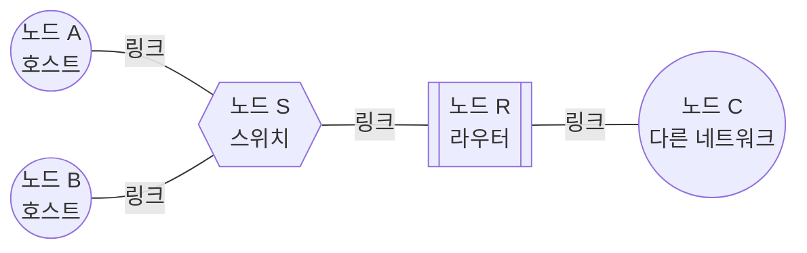
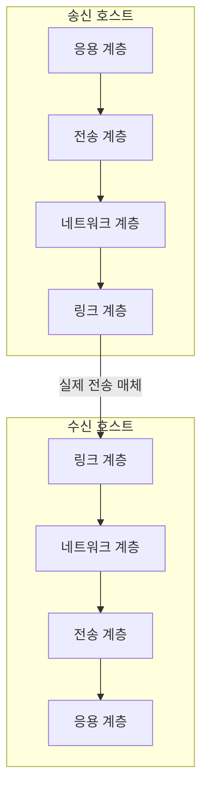

<Callout type="info">
  **이번 문서의 목표:** 이 파일을 다 읽으면 컴퓨터네트워크 교재의 어떤 그림을 봐도 "이 동그라미는 뭘 가리키는 장치인가, 이 화살표는 데이터가 어느 방향으로 어떤 단위로 움직이는 것인가"를 스스로 읽어낼 수 있다.
</Callout>

## 왜 용어부터 정리하는가

독학사 3단계 컴퓨터네트워크 교재를 펼치면 첫 페이지부터 "노드(node)", "링크(link)", "호스트(host)", "패킷(packet)"이 아무 설명 없이 섞여 나옵니다. 이 과목은 2단계 수준의 컴퓨터 구조·운영체제 기초는 있다고 가정하지만, 네트워크 고유 용어는 처음 체계적으로 배우는 사람이 많습니다. 뒤에 나올 27개 편은 전부 이 용어들을 "이미 아는 것"으로 취급하고 진도를 나가므로, 여기서 한 번에 정리하지 않으면 이후 모든 편에서 "이 단어가 정확히 뭐였지"를 매번 되짚어야 합니다.

> **쉽게 말하면:** 이 편은 사전(dictionary)이 아니라, 뒤에 나올 그림들을 읽기 위한 **독해 훈련**입니다. 단어 뜻만 외우지 말고, 그림에서 실제로 어디를 가리키는지 손으로 짚어 가며 읽으세요.

## 1. 네트워크(network)란 무엇인가

**네트워크**(network, 그물망)는 데이터를 주고받기 위해 서로 연결된 장치들의 모임입니다. 컴퓨터 두 대를 전선 하나로 직접 잇는 것도 가장 작은 네트워크지만, 장치 수가 늘어나면 모든 장치를 서로 직접 잇는 방식은 배선 수가 기하급수로 늘어나 불가능해집니다. 그래서 중간에 배달을 대신해 주는 장치(스위치, 라우터)를 두고, 각 장치는 그 장치에만 연결됩니다.

> **쉽게 말하면:** 네트워크는 우편 시스템입니다. 모든 집이 서로에게 직접 길을 낼 수 없으니, 우체국(중간 장치)을 두고 주소를 적어 보냅니다.

## 2. 노드와 링크 — 그림의 점과 선

네트워크 그림은 결국 **점**과 **선**으로 이루어집니다.

- **노드**(node): 그림에서 동그라미(또는 네모)로 그려지는 모든 장치. 컴퓨터, 스마트폰, 스위치, 라우터, 서버가 전부 노드입니다. "네트워크에 연결된 하나의 단위"라고 생각하면 됩니다.
- **링크**(link): 그림에서 두 노드를 잇는 선. 실제로는 UTP 케이블, 광케이블, 또는 눈에 보이지 않는 무선 전파 통로일 수 있습니다. 선이 굵게 그려져 있으면 대역폭(bandwidth, 04편에서 다룸)이 크다는 뜻으로 쓰는 교재도 있습니다.

이 그림에서 동그라미(A, B, C)는 사람이 쓰는 컴퓨터, 육각형(S)은 스위치, 사각형(R)은 라우터입니다. 시험 문제에서 도형 모양만으로 장비 종류를 구분하게 하는 경우가 많으므로, 교재마다 도형 관례가 조금씩 달라도 **동그라미는 대체로 최종 사용자 장치, 특수한 도형은 중간 전달 장치**라는 감각을 잡아 두면 됩니다.

**자주 틀리는 점**: 노드를 "컴퓨터만"이라고 착각하는 경우가 많습니다. 스위치와 라우터도, 심지어 프린터도 네트워크에 연결되어 있으면 노드입니다.

## 3. 호스트, 클라이언트, 서버 — 역할로 구분하기

- **호스트**(host): 네트워크에서 실제로 데이터를 만들어 내거나 받아서 쓰는 최종 장치. IP 주소(02편에서 다룸)를 하나 이상 가지고 있으며, 사람이 직접 쓰는 컴퓨터뿐 아니라 서버도 호스트에 포함됩니다. 스위치나 라우터처럼 데이터를 그저 전달만 하는 장치는 보통 호스트라고 부르지 않습니다.
- **클라이언트**(client): 서비스를 요청하는 쪽 호스트. 웹 브라우저를 실행하는 내 컴퓨터가 클라이언트입니다.
- **서버**(server): 요청을 받아 서비스를 제공하는 쪽 호스트. 웹 페이지를 담고 있는 컴퓨터가 서버입니다.

> **쉽게 말하면:** 호스트는 "네트워크에 참여하는 컴퓨터"라는 큰 범주이고, 클라이언트와 서버는 그 안에서 "누가 부탁하고 누가 들어주는가"라는 역할 이름입니다.

같은 컴퓨터가 어떤 상황에서는 클라이언트, 다른 상황에서는 서버가 될 수 있습니다. 예를 들어 내 컴퓨터가 웹 브라우저로 뉴스 사이트에 접속할 때는 클라이언트지만, 그 컴퓨터에 파일 공유 프로그램을 켜서 다른 사람이 내 파일을 받아가게 하면 그 순간 내 컴퓨터는 서버 역할을 합니다.

## 4. 패킷, 프레임, 세그먼트 — 같은 데이터, 다른 이름

이 세 단어는 독학사 시험에서 계층을 구분하는 문제의 단골 소재입니다. 핵심은 **같은 데이터라도 어느 계층에서 다루느냐에 따라 부르는 이름이 다르다**는 것입니다.

| 용어 | 다루는 계층 | 무엇을 담는가 |
|------|------------|---------------|
| 세그먼트(segment) | 전송 계층 | 포트 번호, 순서 번호 등 TCP·UDP 헤더 + 실제 데이터 |
| 패킷(packet) | 네트워크 계층 | 출발지·목적지 IP 주소 등 IP 헤더 + 세그먼트 전체 |
| 프레임(frame) | 데이터링크 계층 | 출발지·목적지 MAC 주소 등 헤더 + 패킷 전체 |

세그먼트가 패킷 안에, 패킷이 프레임 안에 차곡차곡 들어가는 구조를 **캡슐화**(encapsulation)라고 부르며, 이 과정은 03편에서 그림으로 자세히 다룹니다. 여기서는 "위쪽 계층의 결과물이 아래쪽 계층에서는 껍데기를 하나 더 두른 새 이름으로 불린다"는 감각만 잡아 두면 됩니다.

> **쉽게 말하면:** 편지지(데이터)에 겉봉투(헤더)를 씌우는 단계마다 소포 이름이 바뀝니다. 편지지 + TCP 봉투 = 세그먼트, 거기에 IP 봉투를 더하면 패킷, 거기에 다시 MAC 봉투를 더하면 프레임입니다.

이보다 더 위쪽, 즉 계층 구분 없이 "네트워크로 오가는 데이터 덩어리 전체"를 뭉뚱그려 부를 때는 **데이터그램**(datagram)이라는 표현도 씁니다. 특히 UDP나 IP처럼 "믿을 수 없는(비신뢰성) 전달"을 하는 프로토콜의 데이터 단위를 데이터그램이라고 부르는 관행이 있는데, 정확한 명칭은 나중 편(IP는 12편, UDP는 17편)에서 다시 짚습니다. 지금은 "패킷과 거의 같은 뜻으로도 쓰이는 말"이라는 정도만 알아 두면 됩니다.

**자주 틀리는 점**: "옳지 않은 것을 고르시오" 유형에서 "TCP는 프레임 단위로 전송한다" 같은 문장이 오답 보기로 나옵니다. TCP는 세그먼트, 프레임은 데이터링크 계층의 용어입니다. 계층과 용어를 짝지어 외워야 이런 함정을 피할 수 있습니다.

## 5. 계층도와 데이터 흐름 화살표 읽는 법

컴퓨터네트워크 교재의 그림은 대부분 계층을 세로로 쌓아 놓고, 위아래로 화살표를 그립니다. 이런 그림을 읽을 때 확인할 세 가지가 있습니다.

1. **세로 위치가 계층을 뜻한다.** 위로 갈수록 사람이 이해하는 응용에 가깝고, 아래로 갈수록 실제 전선·전파에 가깝습니다.
2. **아래로 내려가는 화살표는 캡슐화**(데이터를 보낼 때), **위로 올라가는 화살표는 역캡슐화**(decapsulation, 데이터를 받을 때 헤더를 하나씩 벗기는 과정)를 뜻합니다.
3. **가로로 나란히 놓인 같은 계층끼리는 "논리적으로 통신한다"고 표현**합니다. 실제로는 데이터가 세로로 내려갔다가 링크를 타고 다시 세로로 올라가지만, 같은 계층끼리는 마치 직접 대화하듯 그려지는 경우가 많습니다.

이 그림에서 왼쪽 위에서 아래로 내려가는 화살표가 캡슐화, 오른쪽 아래에서 위로 올라가는 화살표가 역캡슐화입니다. 실제로 데이터가 물리적으로 이동하는 구간은 맨 아래 링크 계층 사이의 가로 화살표 하나뿐이라는 점이 시험에서 종종 함정으로 나옵니다. "응용 계층끼리 직접 데이터를 주고받는다"는 문장은 논리적으로는 맞는 표현이지만, 물리적으로는 항상 아래 계층을 거쳐야 한다는 점을 함께 기억해야 합니다.

## 핵심 정리

- 노드는 그림의 점(모든 장치), 링크는 그림의 선(연결 매체)이다.
- 호스트는 데이터를 만들거나 소비하는 최종 장치이며, 클라이언트와 서버는 호스트의 역할 이름이다.
- 세그먼트(전송 계층) → 패킷(네트워크 계층) → 프레임(데이터링크 계층) 순으로 헤더가 덧씌워지며 이름이 바뀐다.
- 계층도에서 아래로 내려가는 화살표는 캡슐화, 위로 올라가는 화살표는 역캡슐화를 뜻한다.
- 실제 물리적 전송은 맨 아래 계층 사이에서만 일어나고, 나머지 계층 간 통신은 "논리적" 통신이다.

## 마무리 복습

<Quiz
  questionNumber={1}
  question="네트워크 그림에서 스위치와 라우터를 부르는 공통 용어로 가장 적절한 것은?"
  options={['호스트', '노드', '세그먼트', '클라이언트']}
  correctAnswer={2}
  explanation="노드는 네트워크에 연결된 모든 장치(컴퓨터, 스위치, 라우터 등)를 가리키는 포괄적인 용어이므로 정답은 노드다."
  optionExplanations={['호스트는 데이터를 만들거나 소비하는 최종 장치만 가리키므로 스위치·라우터는 보통 포함하지 않는다.', '정답. 노드는 장치의 종류와 관계없이 네트워크에 연결된 모든 지점을 가리킨다.', '세그먼트는 전송 계층의 데이터 단위 이름이지 장치 이름이 아니다.', '클라이언트는 서비스를 요청하는 역할을 가진 호스트만 가리킨다.']}
/>

<Quiz
  questionNumber={2}
  question="데이터가 전송 계층에서 데이터링크 계층으로 내려가며 헤더가 추가되는 과정에서, 각 계층에서 부르는 이름의 순서로 옳은 것은?"
  options={['프레임 → 패킷 → 세그먼트', '세그먼트 → 패킷 → 프레임', '패킷 → 세그먼트 → 프레임', '세그먼트 → 프레임 → 패킷']}
  correctAnswer={2}
  explanation="전송 계층에서 세그먼트가 만들어지고, 네트워크 계층에서 IP 헤더가 붙어 패킷이 되며, 데이터링크 계층에서 MAC 헤더가 붙어 프레임이 된다."
  optionExplanations={['순서가 거꾸로 되어 있다. 위쪽 계층에서 아래쪽 계층으로 내려가며 세그먼트 → 패킷 → 프레임 순이다.', '정답. 전송 계층(세그먼트) → 네트워크 계층(패킷) → 데이터링크 계층(프레임) 순으로 캡슐화된다.', '세그먼트와 패킷의 순서가 바뀌었다.', '패킷과 프레임의 위치가 뒤바뀌었고 세그먼트가 중간에 있다.']}
/>

<Quiz
  questionNumber={3}
  question="계층도에서 '같은 계층끼리 논리적으로 통신한다'는 표현에 대한 설명으로 옳지 않은 것은?"
  options={['실제 데이터는 항상 아래 계층을 거쳐 전달된다.', '가로로 나란히 그려진 같은 계층은 직접 대화하듯 표현된다.', '응용 계층은 물리적으로 상대 호스트의 응용 계층과 직접 신호를 주고받는다.', '물리적 전송은 맨 아래 링크 계층 사이에서만 일어난다.']}
  correctAnswer={3}
  explanation="응용 계층은 논리적으로만 상대 응용 계층과 통신하는 것처럼 표현될 뿐, 실제 물리적 신호 교환은 항상 맨 아래 링크 계층에서만 일어난다."
  optionExplanations={['옳은 설명이다. 캡슐화·역캡슐화를 거쳐 데이터가 아래 계층으로 내려갔다가 다시 올라온다.', '옳은 설명이다. 계층도의 관례적인 표현 방식이다.', '옳지 않은 설명이므로 정답이다. 응용 계층끼리는 논리적으로만 통신하며 물리적 신호는 링크 계층에서만 오간다.', '옳은 설명이다. 실제 전선이나 전파를 타는 구간은 맨 아래 계층뿐이다.']}
/>

<Quiz
  questionNumber={4}
  question="다음 중 노드(node)의 예로 가장 적절하지 않은 것은?"
  options={['라우터', '스위치', '대역폭', '서버']}
  correctAnswer={3}
  explanation="대역폭은 링크가 단위 시간당 전달할 수 있는 데이터의 양을 나타내는 성능 지표이지 장치가 아니므로 노드가 될 수 없다."
  optionExplanations={['라우터는 네트워크 계층에서 경로를 정하는 장치로 노드에 해당한다.', '스위치는 데이터링크 계층에서 프레임을 전달하는 장치로 노드에 해당한다.', '정답. 대역폭은 링크의 성능을 나타내는 수치이지 장치가 아니다.', '서버는 서비스를 제공하는 호스트로 노드에 해당한다.']}
/>

<Quiz
  questionNumber={5}
  question="한 컴퓨터가 특정 상황에서 클라이언트도 될 수 있고 서버도 될 수 있는 이유로 가장 적절한 것은?"
  options={['클라이언트와 서버는 하드웨어 사양으로 구분되기 때문이다.', '클라이언트와 서버는 IP 주소의 클래스가 다르기 때문이다.', '클라이언트와 서버는 데이터를 요청하는지 제공하는지에 따른 역할 구분이기 때문이다.', '클라이언트와 서버는 반드시 서로 다른 운영체제를 써야 하기 때문이다.']}
  correctAnswer={3}
  explanation="클라이언트와 서버는 장치의 종류가 아니라 특정 통신에서 서비스를 요청하는지 제공하는지에 따라 정해지는 역할 이름이므로, 같은 컴퓨터가 상황에 따라 둘 다 될 수 있다."
  optionExplanations={['하드웨어 사양과 무관하게 역할로 구분된다.', 'IP 주소 클래스는 클라이언트·서버 구분과 관련이 없다.', '정답. 요청하는 쪽이 클라이언트, 응답하는 쪽이 서버라는 역할 구분이므로 같은 장치가 상황에 따라 바뀔 수 있다.', '운영체제 종류는 클라이언트·서버 역할과 무관하다.']}
/>

## 참고 자료

- [국가평생교육진흥원 독학학위제 - 과목별 평가영역](https://bdes.nile.or.kr/nile/study/nStudy2_1.do)
