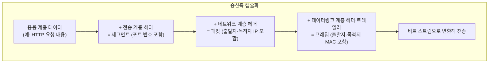

<Callout type="info">
  **이번 문서의 목표:** 이 파일을 다 읽으면 낯선 장비나 프로토콜 이름이 나와도 "이건 몇 계층 일인가"를 역할 기준으로 스스로 판단하고, OSI와 TCP/IP 계층을 서로 짝지어 설명할 수 있다.
</Callout>

## 왜 계층 대응을 별도 편으로 다루는가

독학사 3단계 컴퓨터네트워크 출제기준에서 계층 구조는 전 범위에 걸쳐 전제되는 지식입니다. 물리 계층(06–08편), 데이터링크 계층(09–11편), 네트워크 계층(12–16편), 전송 계층(17–19편), 응용 계층(20–21편)이 각각 별도 편으로 이어지는데, 그 모든 편이 "이건 OSI 몇 계층, TCP/IP 몇 계층 이야기"라는 전제를 깔고 시작합니다. 계층 이름을 순서대로 암기하는 것만으로는 "다음 중 데이터링크 계층에서 처리하는 것은?" 같은 응용 문제를 풀 수 없습니다. **계층마다 무슨 문제를 해결하는가**를 이해해야 낯선 보기가 나와도 계층을 판단할 수 있습니다.

> **쉽게 말하면:** 계층 이름을 외우지 말고, "이 계층은 어떤 고민을 해결하려고 있는가"를 이해하면 이름은 저절로 따라옵니다.

## 1. 왜 계층으로 나누는가

네트워크가 하는 일은 사실 하나의 거대한 작업입니다. "내 컴퓨터의 데이터를 상대 컴퓨터까지 정확하게 전달한다." 그런데 이 작업을 한 덩어리로 설계하면, 케이블 종류가 바뀔 때마다 전체 시스템을 다시 만들어야 하고, 새 응용 프로그램이 하나 생길 때마다 전송 방식을 처음부터 다시 고민해야 합니다.

그래서 이 거대한 작업을 **작은 책임 단위로 쪼개고, 각 단위가 자신의 바로 아래·위 계층하고만 약속(인터페이스)을 지키게** 만든 것이 계층 구조(layered architecture)입니다. 이렇게 하면 물리 계층의 케이블이 구리선에서 광섬유로 바뀌어도 그 위의 응용 계층 프로그램은 전혀 몰라도 됩니다.

> **쉽게 말하면:** 계층 구조는 택배 시스템입니다. 물건을 포장하는 사람, 송장을 붙이는 사람, 트럭에 싣는 사람, 운전하는 사람이 각자 자기 일만 하면 되고, 트럭이 오토바이로 바뀌어도 포장 담당자는 하던 일을 그대로 합니다.

## 2. OSI 7계층 — 국제표준의 이론 모델

**OSI**(Open Systems Interconnection, 개방형 시스템 상호연결)는 국제표준화기구(ISO, International Organization for Standardization)가 1984년에 정한 7층짜리 통신 표준 모델입니다. 실제 인터넷이 그대로 이 구조로 동작하지는 않지만, 계층별 역할을 가장 세밀하게 나눠 놓았기 때문에 **시험에서 계층을 구분하는 기준**으로 계속 등장합니다.

각 계층의 역할을 위에서부터가 아니라, **아래부터 위로 문제를 하나씩 해결해 나가는 순서**로 이해하면 암기가 아니라 이해가 됩니다.

1. **물리 계층**(Physical Layer): 0과 1을 실제 전기 신호·광 신호·전파로 어떻게 표현해서 전선(또는 공중)에 실어 보낼 것인가. 단위는 **비트**(bit). 06–08편에서 다룹니다.
2. **데이터링크 계층**(Data Link Layer): 같은 매체를 공유하는 바로 옆 장치까지, 오류 없이 한 묶음(프레임)을 전달하는 문제. 단위는 **프레임**(frame). MAC 주소가 여기서 쓰입니다. 09–11편에서 다룹니다.
3. **네트워크 계층**(Network Layer): 옆 장치를 넘어 전혀 다른 네트워크에 있는 상대까지 **경로를 찾아** 전달하는 문제. 단위는 **패킷**(packet). IP 주소가 여기서 쓰입니다. 12–16편에서 다룹니다.
4. **전송 계층**(Transport Layer): 상대 컴퓨터에 도착한 데이터를 **어느 프로그램**에게 줄 것인지, 그리고 데이터를 믿을 수 있게 전달할지 말지를 정하는 문제. 단위는 **세그먼트**(segment). 포트 번호, TCP·UDP가 여기서 쓰입니다. 17–19편에서 다룹니다.
5. **세션 계층**(Session Layer): 두 프로그램 사이의 대화 한 판을 언제 시작하고 언제 끝낼지 관리하는 문제.
6. **표현 계층**(Presentation Layer): 문자 인코딩, 압축, 암호화 형식처럼 "데이터를 어떤 형태로 표현할지" 맞추는 문제.
7. **응용 계층**(Application Layer): 사람이 실제로 쓰는 프로그램(웹 브라우저, 메일 클라이언트)이 필요로 하는 서비스 자체를 정의하는 문제. HTTP, DNS, SMTP가 여기서 쓰입니다. 20–21편에서 다룹니다.

> **쉽게 말하면:** 1–2계층은 "바로 옆까지 확실히 전달", 3계층은 "먼 곳까지 길 찾기", 4계층은 "도착한 뒤 누구에게 줄지와 믿을 수 있는 전달", 5–7계층은 "대화 자체를 어떻게 진행하고 무슨 내용을 담을지"에 대한 계층입니다.

## 3. TCP/IP 4계층 — 실제로 돌아가는 모델

**TCP/IP 모델**은 인터넷이 실제로 사용하는 모델로, OSI보다 먼저 만들어졌습니다(1970년대 미국 국방부 프로젝트에서 출발). OSI 7계층을 4개(자료에 따라 5개)로 뭉쳐서 부릅니다.

| TCP/IP 계층 | 대응하는 OSI 계층 | 대표 프로토콜·기술 |
|-------------|--------------------|----------------------|
| 응용 계층(Application) | 응용·표현·세션(5–7) | HTTP, HTTPS, DNS, SMTP, FTP, DHCP |
| 전송 계층(Transport) | 전송(4) | TCP, UDP |
| 인터넷 계층(Internet) | 네트워크(3) | IP, ICMP, ARP |
| 네트워크 접근 계층(Network Access, 링크 계층) | 데이터링크·물리(1–2) | Ethernet, Wi-Fi, MAC 주소 |

일부 교재는 네트워크 접근 계층을 **데이터링크 계층과 물리 계층으로 다시 나누어 5계층**으로 설명하기도 합니다. 이 경우 이름만 다섯 개가 되었을 뿐, OSI와의 대응 관계는 동일합니다. 시험에서 "TCP/IP는 몇 계층 모델인가"를 물으면 출제자의 기준(4계층 또는 5계층)에 따라 정답이 달라질 수 있으므로, 문제에 함께 제시된 그림이나 보기의 계층 이름 목록을 먼저 확인하는 것이 안전합니다.

### 두 모델을 나란히 놓고 비교하기

| OSI 7계층 | TCP/IP 4계층 |
|-----------|--------------|
| 7. 응용 | 응용 |
| 6. 표현 | 응용 |
| 5. 세션 | 응용 |
| 4. 전송 | 전송 |
| 3. 네트워크 | 인터넷 |
| 2. 데이터링크 | 네트워크 접근 |
| 1. 물리 | 네트워크 접근 |

> **쉽게 말하면:** TCP/IP는 OSI의 위쪽 세 계층(응용·표현·세션)을 "응용 계층" 하나로 뭉치고, 아래쪽 두 계층(데이터링크·물리)을 "네트워크 접근 계층" 하나로 뭉친 실전형 모델입니다.

**자주 틀리는 점**: "OSI와 TCP/IP는 계층 개수만 다를 뿐 완전히 같은 순서로 대응한다"고 단순화해서 외우면, "TCP/IP의 응용 계층은 OSI의 몇 계층에 대응하는가"라는 질문에 "7계층"이라고만 답하는 실수를 합니다. 정확히는 **5·6·7계층 세 개 모두**에 대응합니다.

## 4. 암기법이 아니라 역할로 계층 찾는 요령

시험에는 낯선 장비나 프로토콜을 주고 "이것은 몇 계층에서 동작하는가"를 묻는 문제가 자주 나옵니다. 이때 계층 이름을 순서대로 외운 사람은 처음 보는 장비 앞에서 멈추지만, **각 계층이 해결하는 문제**를 이해한 사람은 다음 질문을 스스로 던져 답을 찾을 수 있습니다.

1. **주소를 쓴다면 어떤 주소인가?** MAC 주소를 쓰면 데이터링크 계층, IP 주소를 쓰면 네트워크 계층, 포트 번호를 쓰면 전송 계층입니다.
2. **다루는 단위가 무엇인가?** 비트라면 물리, 프레임이라면 데이터링크, 패킷이라면 네트워크, 세그먼트라면 전송입니다.
3. **경로를 정하는가, 아니면 전기 신호 자체를 다루는가?** 경로(라우팅)를 정한다면 네트워크 계층, 신호 자체(전압·주파수·광 세기)를 다룬다면 물리 계층입니다.
4. **사람이 이해하는 이름(도메인, URL)이 나오는가?** 그렇다면 응용 계층입니다.

예를 들어 "라우터"라는 장비가 낯설다고 해도, "라우터는 IP 주소를 보고 경로를 정하는 장치"라는 동작만 알면 위 질문 1, 3을 통해 네트워크 계층 장비라고 판단할 수 있습니다. 반대로 "허브"는 "들어온 전기 신호를 그대로 모든 포트에 복사한다"는 동작만 알아도 질문 2, 3을 통해 물리 계층 장비임을 알 수 있습니다.

## 5. 캡슐화 흐름 — 계층을 오가는 데이터의 실제 모습

**캡슐화**(encapsulation)는 데이터가 응용 계층에서 시작해 아래로 내려가며, 각 계층을 지날 때마다 그 계층에 필요한 **헤더**(header, 제어 정보가 담긴 앞부분)가 하나씩 덧붙는 과정입니다. 반대로 받는 쪽에서는 아래에서 위로 올라가며 헤더를 하나씩 벗겨내는데, 이를 **역캡슐화**(decapsulation)라고 합니다.



이 그림에서 각 화살표는 "위 계층의 결과물 전체가 아래 계층에서는 그 계층 나름의 새 헤더로 감싸인다"는 것을 뜻합니다. 예를 들어 웹 브라우저가 만든 HTTP 요청(응용 계층 데이터)은 전송 계층으로 내려가면서 TCP 헤더(출발지·목적지 포트 번호 포함)가 붙어 **세그먼트**가 되고, 다시 네트워크 계층으로 내려가면서 IP 헤더(출발지·목적지 IP 주소 포함)가 붙어 **패킷**이 되고, 마지막으로 데이터링크 계층에서 이더넷 헤더(출발지·목적지 MAC 주소 포함)와 트레일러(오류 검출 정보)가 붙어 **프레임**이 됩니다. 이 프레임이 마침내 비트로 바뀌어 물리적으로 전송됩니다.

받는 쪽에서는 이 순서가 정확히 반대입니다. 프레임을 받아 데이터링크 계층 헤더를 벗기고 → 네트워크 계층 헤더를 확인해 자신에게 온 패킷인지 판단하고 → 전송 계층 헤더를 확인해 어느 프로그램(포트)에 전달할지 정하고 → 최종적으로 응용 계층 데이터만 남겨 프로그램에 넘깁니다.

```mermaid
sequenceDiagram
  participant App as 응용 계층(송신)
  participant Trans as 전송 계층(송신)
  participant Net as 네트워크 계층(송신)
  participant Link as 데이터링크 계층(송신)
  participant LinkR as 데이터링크 계층(수신)
  participant NetR as 네트워크 계층(수신)
  participant TransR as 전송 계층(수신)
  participant AppR as 응용 계층(수신)

  App->>Trans: 데이터
  Trans->>Net: 세그먼트 (TCP 헤더 + 데이터)
  Net->>Link: 패킷 (IP 헤더 + 세그먼트)
  Link->>LinkR: 프레임 (MAC 헤더 + 패킷, 비트로 전송)
  LinkR->>NetR: MAC 헤더 제거 후 패킷 전달
  NetR->>TransR: IP 헤더 제거 후 세그먼트 전달
  TransR->>AppR: TCP 헤더 제거 후 데이터 전달
```

**자주 틀리는 점**: 캡슐화 과정에서 헤더가 "교체"된다고 오해하는 경우가 있습니다. 실제로는 기존 헤더를 포함한 상위 계층 결과물 **전체를 그대로 감싸고, 그 앞에 새 헤더를 덧붙이는** 것입니다. 즉 프레임 안에는 IP 헤더와 TCP 헤더가 모두 그대로 들어 있고, 그 앞에 MAC 헤더가 하나 더 붙어 있는 구조입니다.

## 6. 시험 문제에서 계층을 찾아내는 실전 요령

독학사 기출·모의 유형에서는 다음과 같은 형태로 계층 지식을 묻습니다.

- **직접 대응 문제**: "OSI 네트워크 계층에 대응하는 TCP/IP 계층은?" → 위 대응표를 그대로 적용합니다.
- **장비·프로토콜 분류 문제**: "다음 중 데이터링크 계층에서 동작하는 것은?" → 역할 판단 질문(2절)을 적용합니다.
- **캡슐화 순서 문제**: "데이터가 응용 계층에서 물리 계층까지 내려가며 붙는 헤더의 순서는?" → 전송(TCP/UDP) → 네트워크(IP) → 데이터링크(MAC) 순서를 기억합니다.
- **"옳지 않은 것" 유형**: 보기 네 개 중 하나만 계층 대응이 틀린 경우가 많습니다. 예를 들어 "포트 번호는 네트워크 계층에서 사용된다"는 문장은 포트 번호가 전송 계층의 개념이므로 틀린 보기입니다.

## 핵심 정리

- 계층 구조는 통신이라는 큰 문제를 계층별 책임으로 쪼개, 한 계층의 변화가 다른 계층에 영향을 주지 않게 하기 위한 설계다.
- OSI는 7계층(물리·데이터링크·네트워크·전송·세션·표현·응용) 이론 모델, TCP/IP는 4계층(네트워크 접근·인터넷·전송·응용) 실전 모델이다.
- TCP/IP의 응용 계층은 OSI의 응용·표현·세션 3개 계층에 대응하고, 네트워크 접근 계층은 OSI의 데이터링크·물리 2개 계층에 대응한다.
- 계층 판단은 암기가 아니라 "주소 종류·데이터 단위·경로 결정 여부·사람이 읽는 이름 여부"라는 질문으로 한다.
- 캡슐화는 위 계층 결과물 전체를 그대로 감싸고 헤더를 덧붙이는 과정이며, 순서는 전송 → 네트워크 → 데이터링크다.

## 마무리 복습

<Quiz
  questionNumber={1}
  question="TCP/IP 4계층 모델의 응용 계층에 대응하는 OSI 계층으로 옳은 것은?"
  options={['응용 계층 하나뿐', '응용·표현 두 계층', '응용·표현·세션 세 계층', '응용·표현·세션·전송 네 계층']}
  correctAnswer={3}
  explanation="TCP/IP의 응용 계층은 OSI의 응용, 표현, 세션 세 계층의 역할을 모두 합쳐서 담당한다."
  optionExplanations={['응용 계층 하나로만 한정하면 표현·세션 계층의 역할이 빠지므로 틀렸다.', '세션 계층이 빠져 있으므로 틀렸다.', '정답. TCP/IP 응용 계층은 OSI의 5·6·7계층(세션·표현·응용)을 모두 포괄한다.', '전송 계층은 TCP/IP에서도 별도의 계층으로 존재하므로 응용 계층에 포함시키면 틀렸다.']}
/>

<Quiz
  questionNumber={2}
  question="어떤 장비가 IP 주소를 확인해 목적지까지의 경로를 결정한다고 할 때, 이 장비가 주로 동작하는 OSI 계층은?"
  options={['물리 계층', '데이터링크 계층', '네트워크 계층', '전송 계층']}
  correctAnswer={3}
  explanation="IP 주소를 이용해 경로를 결정하는 것은 네트워크 계층의 핵심 역할이며, 라우터가 대표적인 예다."
  optionExplanations={['물리 계층은 전기·광 신호 자체를 다루며 주소 개념이 없다.', '데이터링크 계층은 MAC 주소를 사용하며 같은 네트워크 안에서의 전달을 담당한다.', '정답. IP 주소 기반 경로 결정은 네트워크 계층의 역할이다.', '전송 계층은 포트 번호를 사용해 프로그램을 구분하는 역할을 한다.']}
/>

<Quiz
  questionNumber={3}
  question="데이터가 응용 계층에서 물리 계층까지 캡슐화되는 과정에서 헤더가 추가되는 순서로 옳은 것은?"
  options={['네트워크 계층 헤더 → 전송 계층 헤더 → 데이터링크 계층 헤더', '전송 계층 헤더 → 네트워크 계층 헤더 → 데이터링크 계층 헤더', '데이터링크 계층 헤더 → 네트워크 계층 헤더 → 전송 계층 헤더', '전송 계층 헤더 → 데이터링크 계층 헤더 → 네트워크 계층 헤더']}
  correctAnswer={2}
  explanation="응용 계층 데이터는 전송 계층에서 TCP·UDP 헤더가 먼저 붙고, 네트워크 계층에서 IP 헤더가 붙고, 마지막으로 데이터링크 계층에서 MAC 헤더가 붙는다."
  optionExplanations={['전송 계층과 네트워크 계층의 순서가 바뀌어 있다.', '정답. 전송 → 네트워크 → 데이터링크 순서로 헤더가 덧붙는다.', '순서가 완전히 거꾸로 되어 있다.', '네트워크 계층과 데이터링크 계층의 순서가 바뀌어 있다.']}
/>

<Quiz
  questionNumber={4}
  question="다음 중 OSI와 TCP/IP 계층 대응에 대한 설명으로 옳지 않은 것은?"
  options={['OSI의 데이터링크 계층과 물리 계층은 TCP/IP의 네트워크 접근 계층에 대응한다.', 'TCP/IP의 전송 계층은 OSI의 전송 계층에 정확히 대응한다.', '포트 번호는 OSI 네트워크 계층에서 사용되는 주소 체계다.', 'OSI의 네트워크 계층은 TCP/IP의 인터넷 계층에 대응한다.']}
  correctAnswer={3}
  explanation="포트 번호는 전송 계층에서 프로그램을 구분하기 위해 사용하는 값이며 네트워크 계층의 개념이 아니므로 이 설명은 옳지 않다."
  optionExplanations={['옳은 설명이다. 데이터링크·물리 두 계층이 네트워크 접근 계층 하나로 합쳐진다.', '옳은 설명이다. 전송 계층은 두 모델에서 1대1로 대응한다.', '정답(옳지 않은 설명). 포트 번호는 전송 계층의 개념이지 네트워크 계층의 개념이 아니다.', '옳은 설명이다. 네트워크 계층과 인터넷 계층은 서로 대응한다.']}
/>

<Quiz
  questionNumber={5}
  question="캡슐화와 역캡슐화에 대한 설명으로 가장 적절한 것은?"
  options={['역캡슐화는 송신 측에서 헤더를 추가하는 과정이다.', '캡슐화가 진행되어도 상위 계층에서 붙인 헤더는 그대로 유지된 채 새 헤더가 덧붙는다.', '캡슐화 과정에서 이전 계층의 헤더는 삭제되고 새 헤더로 교체된다.', '역캡슐화는 수신 측에서 헤더를 순서 없이 한 번에 모두 제거하는 과정이다.']}
  correctAnswer={2}
  explanation="캡슐화는 상위 계층에서 만들어진 결과물 전체를 그대로 감싸고 그 앞에 해당 계층의 새 헤더를 덧붙이는 과정이므로, 이전 헤더는 삭제되지 않고 그대로 남는다."
  optionExplanations={['역캡슐화는 수신 측에서 헤더를 제거하는 과정이므로 설명이 반대로 되어 있다.', '정답. 헤더는 교체되지 않고 계속 덧붙여지며, 프레임 안에는 IP 헤더와 TCP 헤더가 모두 남아 있다.', '헤더는 교체되는 것이 아니라 그대로 유지된 채 새 헤더가 추가된다.', '역캡슐화는 아래 계층부터 위 계층 순으로 한 계층씩 순서대로 헤더를 제거한다.']}
/>

## 참고 자료

- [국가평생교육진흥원 독학학위제 - 과목별 평가영역](https://bdes.nile.or.kr/nile/study/nStudy2_1.do)
- [IETF RFC 791 - Internet Protocol](https://www.rfc-editor.org/rfc/rfc791)
