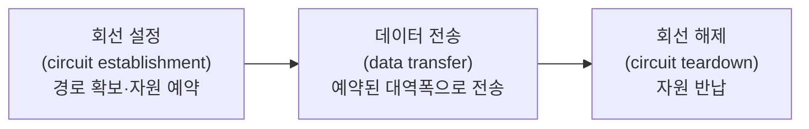
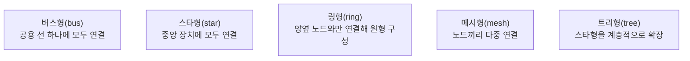

<Callout type="info">
  **이번 문서의 목표:** 이 문서를 다 읽으면 회선 교환(circuit switching)과 패킷 교환(packet switching)의 차이를 자원 예약·지연·효율 관점에서 설명하고, 다섯 가지 토폴로지(topology, 망 구조)의 장단점을 비교하며, 대역폭·지연·처리량·손실률을 실제 숫자로 계산할 수 있다.
</Callout>

## 왜 "교환 방식"부터 배워야 하는가

> **쉽게 말하면:** 네트워크는 여러 사용자가 하나의 통신로를 나눠 쓰는 시스템이며, "어떻게 나눠 쓸 것인가"를 정하는 방식이 교환(switching) 방식이다.

전화망처럼 오래된 통신 시스템과 인터넷처럼 최신 통신 시스템은 데이터를 실어 나르는 근본적인 방식이 다르다. 이 차이를 이해하지 못하면 이후 배울 TCP/IP의 동작 원리, 즉 "왜 인터넷은 경로를 미리 예약하지 않고도 동작하는가"를 이해할 수 없다. 이 편은 04편에서 익힌 속도·지연·대역폭 감각을 바탕으로, 네트워크(network, 여러 장치를 연결한 통신 체계)를 구성하는 가장 기초적인 설계 축인 **교환 방식**과 **토폴로지**, 그리고 그 네트워크의 성능을 측정하는 **네 가지 지표**를 다룬다. 01편에서 배운 링크(link, 두 노드를 잇는 물리적 통신로)·노드(node, 네트워크에 연결된 장치)·호스트(host, 데이터를 주고받는 최종 장치) 용어를 그대로 사용한다.

## 회선 교환과 패킷 교환

### 회선 교환: 통화 전에 길을 예약한다

**회선 교환**(circuit switching)은 통신을 시작하기 전에 발신자와 수신자 사이의 전용 경로를 미리 설정하고, 통신이 끝날 때까지 그 경로의 대역폭(bandwidth, 단위 시간당 전송 가능한 데이터 양)을 독점적으로 예약해 두는 방식이다. 옛날 전화망이 대표적인 예다. 전화를 걸면 교환기가 발신자부터 수신자까지 이어지는 물리적 또는 논리적 경로를 하나 확보하고, 통화가 끝날 때까지 그 경로는 오직 그 통화만을 위해 쓰인다.

> **쉽게 말하면:** 회선 교환은 통화 전용 도로를 미리 깔아 놓고, 통화가 끝날 때까지 그 도로를 나 혼자 쓰는 방식이다.

회선 교환은 세 단계로 이루어진다.

이 구조에서 중요한 점은, 경로가 한 번 확보되면 그 경로 위의 모든 중간 노드(교환기)가 **그 통신을 위한 자원을 계속 붙들고 있다**는 것이다. 통화 중간에 아무 말도 하지 않고 침묵하는 시간에도 그 대역폭은 다른 사람이 쓸 수 없다. 이 때문에 회선 교환은 회선이 실제로 사용되지 않는 시간에도 자원을 낭비하게 되는 비효율이 있다.

### 패킷 교환: 데이터를 조각내어 각자 알아서 보낸다

**패킷 교환**(packet switching)은 전송할 데이터를 **패킷**(packet, 헤더와 데이터로 구성된 전송 단위 조각)이라는 작은 단위로 쪼갠 뒤, 각 패킷에 목적지 주소를 담은 헤더(header, 제어 정보가 담긴 앞부분)를 붙여 네트워크에 독립적으로 실어 보내는 방식이다. 인터넷이 이 방식을 쓴다. 각 패킷은 정해진 전용 경로 없이, 중간의 라우터(router, 패킷의 경로를 결정해 전달하는 장치)가 그때그때 상황에 맞춰 다음 목적지를 정해 전달한다. 이렇게 매 패킷마다 독립적으로 경로가 결정될 수 있는 방식을 비연결형(connectionless) 전달이라고 하며, 09편에서 다시 다룬다.

> **쉽게 말하면:** 패킷 교환은 편지를 여러 조각으로 나눠 각자 다른 우편 경로로 보내고, 도착지에서 다시 순서대로 맞추는 방식이다.

패킷 교환의 핵심 동작 방식은 **저장 후 전달**(store-and-forward)이다. 중간 노드는 패킷 전체를 완전히 수신해 오류 여부를 확인한 뒤에야 다음 노드로 전달한다. 이 개념은 07편에서 지연 계산과 함께 더 깊이 다룬다.

### 회선 교환 vs 패킷 교환 비교표

이 비교는 독학사 시험에서 "옳지 않은 것 고르기" 유형으로 자주 나오는 핵심 지점이므로, 네 가지 기준(연결 설정, 자원 예약, 지연, 효율)을 정확히 구분해야 한다.

| 기준 | 회선 교환 | 패킷 교환 |
|------|-----------|-----------|
| 연결 설정 | 통신 전 반드시 전용 경로를 설정(연결 지향) | 경로를 미리 설정하지 않음(기본적으로 비연결형) |
| 자원 예약 | 통신 내내 대역폭을 독점 예약 | 필요한 순간에만 자원을 나눠 씀(통계적 다중화) |
| 지연 특성 | 회선 설정 지연은 있으나, 설정 후 지연이 일정(고정 지연) | 트래픽 양에 따라 지연이 변동(가변 지연, 지터 발생 가능) |
| 효율 | 회선이 놀고 있어도 자원을 반납하지 않아 비효율적 | 여러 통신이 자원을 나눠 쓰므로 평균 효율이 높음 |
| 오류·정체 시 영향 | 중간 노드 장애 시 경로 전체 재설정 필요 | 일부 경로 장애 시 다른 경로로 우회 가능 |
| 대표 사례 | 전통적 전화망(PSTN) | 인터넷, IP 네트워크 |

> **자주 틀리는 점:** "패킷 교환은 지연이 항상 짧다"고 착각하기 쉽다. 실제로는 반대에 가깝다. 회선 교환은 회선이 설정된 후에는 지연이 일정하게 유지되지만, 패킷 교환은 네트워크가 혼잡할 때 패킷마다 지연이 들쭉날쭉해지는 **지터**(jitter, 지연 시간의 변동폭)가 발생할 수 있다. 패킷 교환의 장점은 "지연이 짧다"가 아니라 "자원을 효율적으로 나눠 쓴다"는 점이다.

### 왜 인터넷은 패킷 교환을 선택했는가

전화 통화처럼 데이터가 끊임없이 흐르는 트래픽(traffic, 통신량)에는 회선 교환이 유리할 수 있지만, 웹 브라우징이나 이메일처럼 **간헐적으로 데이터를 주고받는 트래픽**에는 패킷 교환이 압도적으로 효율적이다. 회선 교환 방식으로 인터넷을 구성한다면, 웹 페이지를 읽는 동안(실제 전송이 없는 시간) 회선을 계속 붙들고 있어야 하므로 극심한 자원 낭비가 생긴다. 패킷 교환은 이런 "버스트(burst, 짧은 시간에 몰리는 데이터)" 트래픽 특성에 맞게 설계된 방식이다.

## 네트워크 토폴로지

**토폴로지**(topology, 망의 물리적·논리적 연결 구조)란 네트워크를 구성하는 노드들이 서로 어떻게 연결되어 있는지를 나타내는 구조다. 토폴로지는 네트워크의 신뢰성, 확장성, 비용, 관리 난이도를 결정하는 설계 요소이며, 크게 다섯 가지로 분류한다.

### 버스형(bus)

모든 노드가 하나의 공용 선(버스)에 연결되는 구조다. 각 노드가 보낸 신호는 버스 전체에 퍼지고, 목적지 주소가 일치하는 노드만 그 신호를 받아들인다.

> **비유:** 버스형은 하나의 복도에 여러 사무실 문이 붙어 있고, 복도에서 크게 외치면 자기 이름이 불린 사람만 반응하는 구조와 같다.

### 스타형(star)

모든 노드가 중앙의 허브(hub) 또는 스위치(switch, 11편에서 다룸) 하나에 직접 연결되는 구조다. 오늘날 가정과 사무실의 유선 LAN(Local Area Network, 근거리 통신망)이 대부분 이 구조다.

### 링형(ring)

각 노드가 정확히 양옆의 두 노드와만 연결되어 전체가 원형을 이루는 구조다. 데이터는 한 방향(또는 양방향)으로 노드를 거쳐 순환하며 전달된다.

### 메시형(mesh)

노드들이 서로 여러 개의 경로로 다중 연결되는 구조다. 모든 노드 쌍이 직접 연결되면 **완전 메시**(full mesh), 일부만 다중 경로로 연결되면 **부분 메시**(partial mesh)라 부른다.

### 트리형(tree)

스타형 구조를 계층적으로 확장한 구조로, 여러 개의 스타형 네트워크가 상위의 중앙 장치에 다시 연결되는 방식이다. 대규모 기업망이나 케이블 TV 배선망에서 흔히 쓰인다.

### 토폴로지 5종 비교표

| 토폴로지 | 장점 | 단점 |
|----------|------|------|
| 버스형 | 배선이 단순하고 설치 비용이 낮음 | 버스(공용 선)에 장애가 생기면 전체 네트워크가 마비됨, 노드가 많아지면 충돌·성능 저하 심함 |
| 스타형 | 한 노드의 장애가 다른 노드에 영향을 주지 않음, 장애 지점을 찾기 쉬움 | 중앙 장치가 고장 나면 전체 네트워크가 마비됨(단일 장애점) |
| 링형 | 배선이 비교적 단순하고 신호 증폭이 규칙적임 | 링 위의 한 노드나 연결이 끊기면 전체 통신에 영향(이중 링으로 보완 가능) |
| 메시형 | 경로가 여러 개라 특정 링크 장애에도 우회 가능해 신뢰성이 매우 높음 | 연결 수가 노드 수의 제곱에 가깝게 늘어나 배선·비용 부담이 큼 |
| 트리형 | 스타형의 관리 용이성을 유지하면서 대규모로 확장 가능 | 상위 계층(루트에 가까운 노드)에 장애가 생기면 하위 전체가 영향을 받음 |

> **자주 틀리는 점:** "메시형이 무조건 최선"이라고 단정하기 쉽지만, 완전 메시는 노드 수를 $n$이라 할 때 필요한 연결 수가 $\dfrac{n(n-1)}{2}$개로 급격히 늘어난다. 예를 들어 노드 10개를 완전 메시로 연결하려면 $\dfrac{10 \times 9}{2} = 45$개의 링크가 필요하다. 신뢰성은 최고지만 비용 때문에 소규모 백본(backbone, 네트워크의 핵심 연결 구간)이나 특수 목적 망에만 주로 쓰인다.

## 네트워크 성능 지표: 대역폭·지연·처리량·손실률

네트워크의 "빠르다·느리다"를 막연히 말하지 않고 정량적으로 표현하는 네 가지 핵심 지표가 있다. 이 지표들은 독학사 시험에서 계산 문제로 자주 출제되므로, 정의와 계산 과정을 정확히 익혀야 한다.

### 대역폭(bandwidth)

**대역폭**은 단위 시간당 전송할 수 있는 최대 데이터 양이며, 보통 초당 비트 수(bps, bits per second)로 표현한다. 04편에서 배운 단위 변환(1 Kbps = 1,000 bps, 1 Mbps = 1,000,000 bps)을 그대로 사용한다. 대역폭은 "도로의 차선 수"에 비유할 수 있다. 차선이 많을수록 한 번에 더 많은 차가 지나갈 수 있듯, 대역폭이 클수록 단위 시간에 더 많은 데이터를 실어 보낼 수 있다.

### 지연(delay, latency)

**지연**은 데이터가 송신지에서 수신지까지 도달하는 데 걸리는 시간이며, 네 가지 요소로 나뉜다.

$$
\text{총 지연} = \text{전파 지연} + \text{전송 지연} + \text{처리 지연} + \text{대기 지연}
$$

- 전파 지연(propagation delay): 신호가 물리적 매체(케이블, 공기 등)를 통해 실제로 이동하는 데 걸리는 시간. 거리와 매체 내 신호 속도로 결정된다.
- 전송 지연(transmission delay): 데이터를 링크에 실제로 밀어 넣는 데 걸리는 시간. 데이터 크기와 대역폭으로 결정된다.
- 처리 지연(processing delay): 중간 노드(라우터 등)가 패킷의 헤더를 읽고 다음 경로를 결정하는 데 걸리는 시간.
- 대기 지연(queuing delay): 중간 노드에서 다른 패킷 처리가 끝나기를 큐(queue, 대기열)에서 기다리는 시간. 네트워크가 혼잡할수록 커진다.

#### 전송 지연 계산 예시

전송 지연은 다음 공식으로 구한다.

$$
\text{전송 지연} = \dfrac{\text{데이터 크기}}{\text{대역폭}}
$$

- 데이터 크기: 전송할 데이터의 총 비트(bit) 수
- 대역폭: 링크가 초당 실어 나를 수 있는 비트 수

예를 들어 10 Mbps(초당 10,000,000비트) 회선으로 1,000,000비트(약 125KB) 크기의 파일을 전송한다고 하자.

$$
\text{전송 지연} = \dfrac{1{,}000{,}000 \text{ bit}}{10{,}000{,}000 \text{ bit/s}} = 0.1 \text{ 초}
$$

전송 지연은 데이터를 링크에 "밀어 넣는" 시간일 뿐, 그 신호가 반대편에 실제로 도착하는 전파 지연은 별도로 더해야 한다는 점에 주의해야 한다.

#### 전파 지연 계산 예시

$$
\text{전파 지연} = \dfrac{\text{거리}}{\text{신호 전파 속도}}
$$

- 거리: 송신지와 수신지 사이의 물리적 거리
- 신호 전파 속도: 매체 안에서 신호가 이동하는 속도(구리선은 초속 약 2 × 10⁸ m, 빛의 속도의 약 3분의 2 수준)

거리 2,000km(2,000,000m) 구간을 구리선(전파 속도 초속 $2 \times 10^8$m)으로 전송한다면 다음과 같이 계산한다.

$$
\text{전파 지연} = \dfrac{2{,}000{,}000 \text{ m}}{2 \times 10^{8} \text{ m/s}} = 0.01 \text{ 초}
$$

앞의 전송 지연(0.1초)과 이 전파 지연(0.01초)을 더하면 처리·대기 지연을 무시했을 때 총 지연은 0.11초가 된다.

> **자주 틀리는 점:** 전송 지연과 전파 지연을 헷갈리는 경우가 매우 많다. 전송 지연은 "데이터 크기와 대역폭"에만 좌우되고, 전파 지연은 "거리와 매체의 신호 속도"에만 좌우된다. 대역폭을 아무리 늘려도 전파 지연은 줄어들지 않고, 거리를 아무리 줄여도 전송 지연은 줄어들지 않는다. 이 둘은 서로 독립적인 물리량이다.

### 처리량(throughput)

**처리량**은 실제로 네트워크를 통해 단위 시간당 성공적으로 전달된 데이터의 양이다. 대역폭이 "이론적으로 가능한 최대치"라면, 처리량은 "혼잡·오류·프로토콜 오버헤드까지 반영한 실제 결과치"다. 처리량은 항상 대역폭보다 작거나 같다.

$$
\text{처리량} = \dfrac{\text{성공적으로 전달된 데이터 양}}{\text{걸린 시간}}
$$

예를 들어 대역폭이 100 Mbps인 회선에서 실제로 10초 동안 90MB(720,000,000비트)의 데이터가 성공적으로 전달됐다면, 처리량은 다음과 같다.

$$
\text{처리량} = \dfrac{720{,}000{,}000 \text{ bit}}{10 \text{ s}} = 72{,}000{,}000 \text{ bit/s} = 72 \text{ Mbps}
$$

이 회선의 대역폭은 100Mbps이지만 실제 처리량은 72Mbps에 그쳤으므로, 이 링크는 대역폭의 72퍼센트만 실제로 활용되고 있다고 해석할 수 있다.

> **비유:** 대역폭이 "8차선 고속도로의 이론적 최대 통행량"이라면, 처리량은 "실제 정체·사고를 반영해 오늘 그 도로를 지나간 차량 수"에 해당한다.

### 손실률(loss rate)

**손실률**은 전송된 데이터 중 목적지에 도달하지 못하고 유실된 패킷의 비율이다.

$$
\text{손실률} = \dfrac{\text{손실된 패킷 수}}{\text{전송한 전체 패킷 수}} \times 100\%
$$

예를 들어 패킷 10,000개를 전송했는데 그중 50개가 유실되었다면 손실률은 다음과 같다.

$$
\text{손실률} = \dfrac{50}{10{,}000} \times 100\% = 0.5\%
$$

손실률은 네트워크 혼잡 정도를 나타내는 중요한 신호이며, 19편에서 다루는 TCP 혼잡 제어는 이 손실률(또는 지연 증가)을 근거로 전송 속도를 조절한다.

## 네트워크 설계 관점 비교

지금까지 다룬 개념을 종합하면, 네트워크를 설계할 때 고려해야 할 관점은 크게 세 가지로 요약된다.

| 설계 관점 | 핵심 질문 | 관련 개념 |
|-----------|-----------|-----------|
| 신뢰성 | 일부 장애가 전체에 얼마나 영향을 주는가 | 토폴로지(메시형은 높고 스타·트리형은 단일 장애점 존재) |
| 효율성 | 자원(대역폭)을 얼마나 낭비 없이 쓰는가 | 교환 방식(패킷 교환이 회선 교환보다 평균 효율 높음) |
| 성능 | 실제 체감 속도와 안정성이 어느 정도인가 | 지연·처리량·손실률의 조합 |

시험에서는 이 세 관점을 뒤섞어 "어떤 토폴로지가 신뢰성이 높은가"와 "어떤 교환 방식이 효율적인가"를 함께 묻는 문항이 자주 나오므로, 두 개념(토폴로지와 교환 방식)이 서로 다른 축이라는 점을 분명히 구분해 두어야 한다.

## 핵심 정리

- 회선 교환은 통신 전 전용 경로를 예약해 지연이 일정하지만 자원을 독점해 비효율적이고, 패킷 교환은 경로를 미리 정하지 않고 자원을 나눠 써 평균 효율이 높지만 지연이 변동한다(지터 발생 가능).
- 토폴로지 5종(버스·스타·링·메시·트리)은 각각 배선 비용과 장애 내성(신뢰성)에서 뚜렷한 장단점 차이가 있으며, 완전 메시는 노드 수의 제곱에 비례해 링크 수가 급증한다.
- 총 지연은 전파 지연 + 전송 지연 + 처리 지연 + 대기 지연으로 구성되며, 전송 지연은 데이터 크기 ÷ 대역폭, 전파 지연은 거리 ÷ 신호 속도로 각각 독립적으로 계산한다.
- 처리량은 실제로 성공 전달된 데이터量 ÷ 시간이며 항상 대역폭 이하이고, 손실률은 손실 패킷 수 ÷ 전체 전송 패킷 수 × 100퍼센트로 구한다.

## 마무리 복습

<Quiz
  questionNumber={1}
  question="회선 교환과 패킷 교환에 대한 설명으로 옳은 것은?"
  options={['회선 교환은 통신 중 대역폭을 예약하지 않는다', '패킷 교환은 통신 전 전용 경로를 설정한다', '회선 교환은 통신 내내 자원을 독점 예약하고 패킷 교환은 필요할 때만 자원을 나눠 쓴다', '패킷 교환은 항상 회선 교환보다 지연이 짧다']}
  correctAnswer={3}
  explanation="회선 교환은 통신 시작 전 전용 경로를 예약해 통신 내내 독점하고, 패킷 교환은 경로를 미리 정하지 않고 필요한 순간에만 자원을 나눠 쓴다."
  optionExplanations={['회선 교환은 반대로 통신 내내 대역폭을 예약해 독점한다.', '전용 경로 설정은 패킷 교환이 아니라 회선 교환의 특징이다.', '정답. 자원 예약 방식의 차이가 두 방식을 가르는 핵심 기준이다.', '패킷 교환은 혼잡 시 지연이 변동(지터)할 수 있어 항상 짧다고 단정할 수 없다.']}
/>

<Quiz
  questionNumber={2}
  question="다섯 가지 토폴로지 중 특정 링크 장애 시에도 다른 경로로 우회할 수 있어 신뢰성이 가장 높지만, 노드 수가 늘어날수록 배선 비용이 급격히 증가하는 구조는?"
  options={['버스형', '스타형', '링형', '메시형']}
  correctAnswer={4}
  explanation="메시형은 노드 간 다중 경로를 두어 신뢰성이 가장 높지만, 완전 메시는 필요한 연결 수가 노드 수의 제곱에 비례해 늘어나 비용 부담이 크다."
  optionExplanations={['버스형은 공용 선 장애 시 전체가 마비되는 구조다.', '스타형은 중앙 장치가 단일 장애점이 되는 구조다.', '링형은 한 구간이 끊기면 전체 통신에 영향을 주는 구조다.', '정답. 메시형이 우회 경로가 있어 신뢰성이 가장 높다.']}
/>

<Quiz
  questionNumber={3}
  question="완전 메시형 토폴로지에서 노드 수가 6개일 때 필요한 링크 수는?"
  options={['6개', '12개', '15개', '30개']}
  correctAnswer={3}
  explanation="완전 메시의 링크 수는 n(n-1)/2로 계산한다. n=6이면 6×5/2 = 15개다."
  optionExplanations={['6개는 링형 구조에 필요한 링크 수다.', '12개는 공식을 잘못 적용한 값이다.', '정답. 6×5/2 = 15개가 완전 메시에 필요한 링크 수다.', '30개는 6×5를 2로 나누지 않은 값이다.']}
/>

<Quiz
  questionNumber={4}
  question="대역폭 20Mbps인 회선으로 5,000,000비트 크기의 파일을 전송할 때 전송 지연은?"
  options={['0.1초', '0.25초', '0.5초', '1초']}
  correctAnswer={2}
  explanation="전송 지연은 데이터 크기 ÷ 대역폭이다. 5,000,000 ÷ 20,000,000 = 0.25초다."
  optionExplanations={['0.1초는 다른 대역폭 값을 적용했을 때 나오는 값이다.', '정답. 5,000,000비트를 20,000,000bps로 나누면 0.25초다.', '0.5초는 대역폭을 절반으로 잘못 계산한 값이다.', '1초는 대역폭을 5Mbps로 잘못 대입한 값이다.']}
/>

<Quiz
  questionNumber={5}
  question="패킷 100,000개를 전송했는데 그중 250개가 유실되었다면 손실률은?"
  options={['0.025%', '0.25%', '2.5%', '25%']}
  correctAnswer={2}
  explanation="손실률은 (손실 패킷 수 ÷ 전체 전송 패킷 수) × 100%다. (250 ÷ 100,000) × 100% = 0.25%다."
  optionExplanations={['자릿수를 한 자리 더 줄여 계산한 오류값이다.', '정답. 250/100,000 = 0.0025이고 여기에 100%를 곱하면 0.25%다.', '자릿수를 한 자리 올려 계산한 오류값이다.', '자릿수를 두 자리 올려 계산한 오류값이다.']}
/>

<Quiz
  questionNumber={6}
  question="처리량(throughput)에 대한 설명으로 옳지 않은 것은?"
  options={['처리량은 항상 대역폭보다 작거나 같다', '처리량은 실제로 성공적으로 전달된 데이터 양을 기준으로 계산한다', '처리량은 네트워크 혼잡과 무관하게 항상 대역폭과 같은 값을 가진다', '처리량은 프로토콜 오버헤드나 오류로 인해 대역폭보다 낮게 측정될 수 있다']}
  correctAnswer={3}
  explanation="처리량은 혼잡·오류·오버헤드의 영향을 받아 대역폭보다 낮아지는 것이 일반적이며, 대역폭과 항상 같지 않다."
  optionExplanations={['처리량은 이론적 최대치인 대역폭을 넘을 수 없으므로 옳은 설명이다.', '처리량의 정의 자체가 실제 성공 전달량 기준이므로 옳은 설명이다.', '정답(옳지 않음). 혼잡·오류가 있으면 처리량은 대역폭보다 낮아지는 것이 일반적이다.', '오버헤드나 오류로 처리량이 낮아지는 것은 실제로 흔한 현상이므로 옳은 설명이다.']}
/>

## 참고 자료

- [국가평생교육진흥원 독학학위제 - 과목별 평가영역](https://bdes.nile.or.kr/nile/study/nStudy2_1.do)
- [IEEE 802.3 표준 개요 자료](https://standards.ieee.org/)
