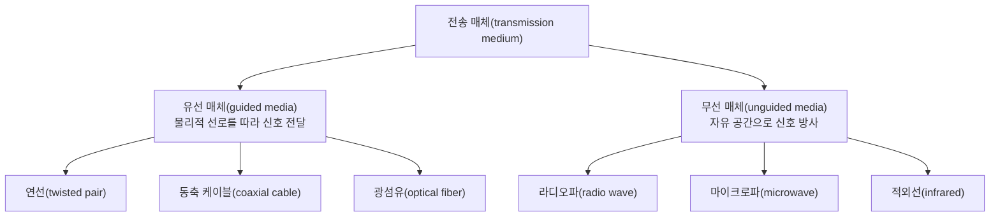
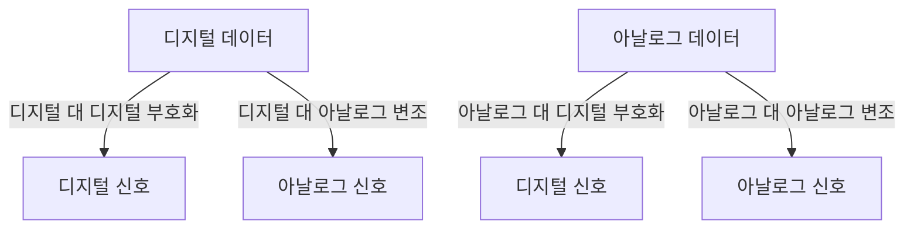

<Callout type="info">
  **이번 문서의 목표:** 이 문서를 다 읽으면 유선·무선 전송 매체의 종류와 특성을 비교하고, 대역폭과 감쇠의 관계를 설명하며, 아날로그와 디지털 신호를 구분하고, 부호화(coding)와 변조(modulation)가 서로 다른 개념임을 명확히 구분할 수 있다.
</Callout>

## 왜 물리 계층의 "매체와 신호"를 알아야 하는가

> **쉽게 말하면:** 물리 계층은 비트(0과 1)를 실제 전기·빛·전파 신호로 바꿔 실어 나르는 가장 밑바닥 계층이며, 그 신호가 지나가는 통로가 전송 매체다.

03편에서 배운 OSI 7계층 중 가장 아래에 있는 **물리 계층**(physical layer)은 상위 계층이 만든 비트열(0과 1의 나열)을 실제로 전기 신호, 광신호, 전파로 바꾸어 전송 매체(transmission medium)를 통해 실어 나르는 역할을 한다. 아무리 상위 계층의 프로토콜이 정교해도, 결국 데이터는 구리선의 전압 변화, 광섬유의 빛 점멸, 공기 중의 전파로 물리적으로 전달되어야 한다. 이 편에서는 그 물리적 통로인 전송 매체의 종류와, 그 통로 위에서 데이터를 표현하는 신호(signal)의 기본 개념을 다룬다.

## 전송 매체: 유선과 무선

**전송 매체**(transmission medium)는 신호가 발신지에서 수신지까지 이동하는 물리적 경로다. 크게 신호를 가두어 전달하는 **유선 매체**(guided media, 유도 매체)와 자유 공간으로 신호를 방사하는 **무선 매체**(unguided media, 비유도 매체)로 나뉜다.

### 유선 매체 3종

**연선**(twisted pair, 꼬임선)은 두 가닥의 구리선을 서로 꼬아 만든 케이블이다. 두 선을 꼬는 이유는 외부에서 들어오는 전자기 간섭(interference, 신호를 방해하는 잡음)이 두 선에 거의 동일하게 영향을 미치게 만들어, 수신 측에서 두 선의 신호 차이를 계산하면 그 간섭이 서로 상쇄되도록 하기 위해서다. 가정과 사무실의 이더넷(Ethernet, 10편에서 다룸) 배선에 널리 쓰인다.

**동축 케이블**(coaxial cable)은 중심 도체를 절연체가 감싸고, 그 바깥을 그물 모양의 금속 차폐층이 다시 감싸는 구조다. 차폐층이 외부 간섭을 막아 주므로 연선보다 잡음에 강하고 더 높은 대역폭을 지원하지만, 두껍고 다루기 불편해 케이블 TV망 등 제한된 용도로 주로 쓰인다.

**광섬유**(optical fiber)는 유리나 플라스틱 재질의 가느다란 관 속으로 빛을 통과시켜 데이터를 전달한다. 전기 신호가 아닌 빛을 쓰므로 전자기 간섭의 영향을 거의 받지 않고, 감쇠(뒤에서 설명)가 매우 적어 장거리·대용량 전송에 적합하다. 다만 설치와 접속 장비의 비용이 높다.

| 매체 | 신호 형태 | 간섭에 대한 강도 | 대역폭 수준 | 대표 용도 |
|------|-----------|-------------------|-------------|-----------|
| 연선 | 전기 신호 | 약함(꼬임으로 일부 상쇄) | 낮음–중간 | 근거리 LAN 배선 |
| 동축 케이블 | 전기 신호 | 중간(차폐층 보호) | 중간 | 케이블 TV, 일부 백본 |
| 광섬유 | 광신호(빛) | 매우 강함(전자기 간섭 거의 없음) | 매우 높음 | 장거리 백본, 초고속 회선 |

### 무선 매체 3종

**라디오파**(radio wave)는 사방으로 퍼지며 벽 같은 장애물을 어느 정도 통과할 수 있어, 무선 랜(Wi-Fi)이나 방송에 쓰인다. **마이크로파**(microwave)는 직진성이 강해 안테나를 정확히 마주 보게 설치해야 하며, 위성통신이나 장거리 중계에 쓰인다. **적외선**(infrared)은 직진성이 매우 강하고 벽을 통과하지 못해, 리모컨처럼 가까운 거리·직접 시야 내 통신에 주로 쓰인다.

> **비유:** 라디오파는 방 안에서 크게 말해 옆방까지 들리는 목소리, 마이크로파는 손전등처럼 정확히 겨눠야 닿는 빛, 적외선은 레이저 포인터처럼 아주 좁은 범위로만 곧게 나아가는 빛에 비유할 수 있다.

## 대역폭과 감쇠

### 대역폭: 매체가 담을 수 있는 신호의 폭

물리 계층에서 **대역폭**(bandwidth)은 05편에서 다룬 "초당 전송 가능한 비트 수"라는 의미 외에, 원래는 매체가 담을 수 있는 **주파수의 범위**(frequency range, 헤르츠 단위)를 뜻하는 개념에서 출발한다. 매체가 지원하는 주파수 대역폭이 넓을수록, 그 매체 위에 더 많은 정보를 담아 더 빠른 속도로 실어 보낼 수 있다. 이 두 가지 의미(주파수 대역폭과 초당 비트 수)는 서로 비례 관계에 있으며, 시험에서는 문맥에 따라 어느 의미로 쓰였는지 구분해야 한다.

### 감쇠: 신호는 이동하며 약해진다

**감쇠**(attenuation)는 신호가 매체를 따라 이동하면서 에너지를 잃어 세기가 점점 약해지는 현상이다. 모든 매체는 정도의 차이만 있을 뿐 감쇠를 겪으며, 거리가 멀어질수록 감쇠는 누적된다. 감쇠가 심해지면 수신 측이 원래 신호와 잡음(noise)을 구분하기 어려워져 오류가 발생한다.

> **쉽게 말하면:** 감쇠는 멀리서 외치는 목소리가 거리가 멀어질수록 점점 작게 들리는 현상과 같다.

감쇠를 보완하기 위해 중간에 **증폭기**(amplifier, 아날로그 신호의 세기를 키우는 장치)나 **리피터**(repeater, 디지털 신호를 원래 형태로 재생성하는 장치)를 둔다. 증폭기는 신호와 함께 잡음까지 그대로 키우는 반면, 리피터는 신호를 원래의 0과 1로 판별해 새로 깨끗하게 재생성하므로 디지털 전송에서 더 유리하다. 이 차이는 다음 절의 아날로그·디지털 구분과 직결된다.

| 매체 | 감쇠 정도 | 비고 |
|------|-----------|------|
| 연선 | 큼 | 거리가 멀어지면 신호 손실이 빠르게 누적 |
| 동축 케이블 | 중간 | 차폐 구조 덕에 연선보다 감쇠가 덜함 |
| 광섬유 | 매우 작음 | 빛을 이용해 장거리에서도 감쇠가 적음 |

## 아날로그 신호와 디지털 신호

**신호**(signal)는 데이터를 물리적으로 표현한 것이며, 시간에 따른 값의 변화 형태에 따라 두 가지로 나뉜다.

- **아날로그 신호**(analog signal): 시간에 따라 값이 **연속적으로** 변하는 신호. 예: 사람 목소리의 실제 음파, 온도계 수은주의 높이.
- **디지털 신호**(digital signal): 시간에 따라 값이 **불연속적인(이산적인) 유한한 단계**만 가지는 신호. 예: 컴퓨터 내부의 0과 1로 표현된 전압 신호.

> **쉽게 말하면:** 아날로그는 경사로처럼 값이 부드럽게 이어지고, 디지털은 계단처럼 값이 뚝뚝 끊어져 있다.

디지털 신호는 잡음의 영향을 받아도 "0인지 1인지"만 판별하면 원래 값을 정확히 복원할 수 있어 오류에 강하고, 리피터로 깨끗하게 재생성하기도 쉽다. 반면 아날로그 신호는 잡음이 섞이면 원래 값과 잡음이 섞인 값을 구분할 방법이 없어 오류가 누적된다. 이 때문에 현대 통신망은 대부분 디지털 방식으로 전환되었지만, 전화선처럼 원래 아날로그로 설계된 매체 위에서 디지털 데이터를 실어 보내야 하는 경우가 여전히 존재하며, 이때 등장하는 개념이 다음 절의 부호화와 변조다.

## 부호화와 변조: 데이터를 신호로 바꾸는 두 가지 다른 방법

여기서 반드시 구분해야 할 두 개념이 있다. **부호화**(encoding, 인코딩)와 **변조**(modulation)는 둘 다 "데이터를 신호로 바꾼다"는 공통점이 있지만, **무엇을 입력받아 무엇을 출력하는가**가 다르다.

- **부호화**(encoding)는 원본 데이터의 형태를 유지한 채(또는 디지털로 바꿔) **디지털 신호**로 표현하는 과정이다. 예를 들어 컴퓨터 내부의 0과 1을 그대로 전압의 높고 낮음으로 표현하는 것이 디지털 대 디지털 부호화다. 마이크로 들어온 아날로그 음성을 일정 간격으로 측정해 숫자로 바꾸는 PCM(Pulse Code Modulation, 펄스 부호 변조 방식) 역시 이름에 "변조"가 들어가지만 실질적으로는 아날로그 데이터를 디지털 신호로 바꾸는 부호화 과정에 해당한다.
- **변조**(modulation)는 데이터를 **아날로그 신호**에 실어 보내기 위해, 반송파(carrier wave, 정보를 실어 나르는 기본 주파수의 파동)의 진폭·주파수·위상 중 하나를 데이터에 맞춰 변화시키는 과정이다. 예를 들어 디지털 데이터를 전화선(원래 아날로그 매체)으로 보내기 위해 모뎀(modem, MOdulator-DEModulator)이 0과 1을 반송파의 특정 신호 변화로 바꾸는 것이 디지털 대 아날로그 변조다.

> **쉽게 말하면:** 부호화는 "데이터를 디지털 신호의 규칙으로 표현하는 것", 변조는 "데이터를 아날로그 반송파에 실어 보내는 것"이다. 결과물이 디지털 신호인지 아날로그 신호인지가 두 용어를 가르는 기준이다.

### 왜 이 구분이 헷갈리는가

많은 학습자가 "부호화는 유선, 변조는 무선"처럼 잘못 암기한다. 그러나 실제 기준은 매체가 아니라 **결과 신호의 종류**다. 예를 들어 유선 전화선 위에서도 모뎀은 변조(아날로그 결과)를 수행하고, 무선 통신에서도 디지털 변조 방식(디지털 데이터를 아날로그 반송파에 싣는 디지털 대 아날로그 변조)이 쓰인다. 즉 "유선이냐 무선이냐"가 아니라 "입력 데이터의 종류"와 "출력 신호의 종류" 두 축으로 구분해야 한다.

| 구분 | 입력 데이터 | 출력 신호 | 대표 예시 |
|------|-------------|-----------|-----------|
| 디지털 대 디지털 부호화 | 디지털 | 디지털 | 컴퓨터 내부·이더넷의 0/1 전압 표현 |
| 아날로그 대 디지털 부호화 | 아날로그 | 디지털 | 음성을 PCM으로 디지털화 |
| 디지털 대 아날로그 변조 | 디지털 | 아날로그 | 모뎀을 통한 전화선 데이터 전송 |
| 아날로그 대 아날로그 변조 | 아날로그 | 아날로그 | 라디오·TV 방송(AM, FM) |

> **자주 틀리는 점:** "변조 = 무선 통신, 부호화 = 유선 통신"이라는 도식적 암기는 틀리다. 구분 기준은 매체(유선/무선)가 아니라, 표에서 보듯 **입력 데이터의 종류**(아날로그/디지털)와 **출력 신호의 종류**(아날로그/디지털)의 조합이다.

## 핵심 정리

- 전송 매체는 유선(연선·동축 케이블·광섬유)과 무선(라디오파·마이크로파·적외선)으로 나뉘며, 광섬유는 간섭에 강하고 대역폭이 높지만 비용이 높다.
- 대역폭은 매체가 지원하는 주파수 범위(또는 초당 비트 수)를 뜻하고, 감쇠는 신호가 이동하며 세기를 잃는 현상이다. 디지털 신호는 리피터로 재생성이 쉬워 감쇠·잡음에 더 강하다.
- 아날로그 신호는 연속적인 값을, 디지털 신호는 이산적인 유한한 단계의 값을 가진다.
- 부호화는 데이터를 디지털 신호로, 변조는 데이터를 아날로그 신호(반송파)로 표현하는 과정이며, 구분 기준은 매체가 아니라 입력 데이터와 출력 신호의 종류다.

## 마무리 복습

<Quiz
  questionNumber={1}
  question="다음 중 전자기 간섭의 영향을 가장 적게 받고 대역폭이 가장 높은 유선 매체는?"
  options={['연선(twisted pair)', '동축 케이블', '광섬유', '적외선']}
  correctAnswer={3}
  explanation="광섬유는 전기 신호가 아닌 빛을 이용하므로 전자기 간섭의 영향을 거의 받지 않고, 세 유선 매체 중 대역폭이 가장 높다."
  optionExplanations={['연선은 간섭에 가장 취약한 유선 매체다.', '동축 케이블은 연선보다는 강하지만 광섬유보다 간섭에 약하다.', '정답. 광섬유는 빛을 이용해 간섭에 가장 강하고 대역폭도 가장 높다.', '적외선은 유선 매체가 아니라 무선 매체다.']}
/>

<Quiz
  questionNumber={2}
  question="감쇠(attenuation)에 대한 설명으로 옳은 것은?"
  options={['신호가 매체를 이동하며 세기를 잃는 현상이다', '신호에 잡음이 섞여 왜곡되는 현상이다', '두 신호가 충돌해 정보가 소실되는 현상이다', '신호의 주파수가 시간에 따라 변하는 현상이다']}
  correctAnswer={1}
  explanation="감쇠는 신호가 매체를 따라 이동하면서 에너지를 잃어 세기가 약해지는 현상이다."
  optionExplanations={['정답. 감쇠는 이동 거리에 따라 신호 세기가 약해지는 현상이다.', '이는 잡음(noise) 또는 간섭에 대한 설명이다.', '이는 충돌(collision)에 대한 설명으로 10편에서 다룬다.', '이는 감쇠가 아니라 주파수 변화, 즉 변조와 관련된 개념이다.']}
/>

<Quiz
  questionNumber={3}
  question="아날로그 신호와 디지털 신호를 구분하는 핵심 기준은?"
  options={['전송 속도가 빠른지 느린지', '유선으로 전송되는지 무선으로 전송되는지', '시간에 따른 값이 연속적인지 이산적인지', '전송 거리가 긴지 짧은지']}
  correctAnswer={3}
  explanation="아날로그 신호는 시간에 따라 값이 연속적으로 변하고, 디지털 신호는 유한한 이산적 단계의 값만 가진다는 점이 두 신호를 구분하는 핵심 기준이다."
  optionExplanations={['전송 속도는 신호 종류를 구분하는 기준이 아니다.', '유무선 여부는 매체의 구분이지 신호 자체의 구분 기준이 아니다.', '정답. 값의 연속성 여부가 아날로그와 디지털을 가르는 기준이다.', '전송 거리는 신호 종류와 직접 관련이 없다.']}
/>

<Quiz
  questionNumber={4}
  question="부호화(encoding)와 변조(modulation)를 구분하는 기준으로 옳은 것은?"
  options={['매체가 유선인지 무선인지가 기준이다', '입력 데이터와 출력 신호가 각각 디지털인지 아날로그인지가 기준이다', '전송 거리가 긴지 짧은지가 기준이다', '두 개념은 사실상 같은 것을 부르는 다른 이름이다']}
  correctAnswer={2}
  explanation="부호화는 결과가 디지털 신호일 때, 변조는 결과가 아날로그 신호(반송파)일 때를 가리키며, 구분 기준은 입력 데이터와 출력 신호의 종류 조합이다."
  optionExplanations={['매체의 유무선 여부는 부호화·변조를 구분하는 기준이 아니다.', '정답. 입력 데이터 종류와 출력 신호 종류의 조합이 부호화와 변조를 가른다.', '전송 거리는 이 구분과 무관하다.', '두 개념은 결과 신호의 종류가 다른, 서로 구별되는 과정이다.']}
/>

<Quiz
  questionNumber={5}
  question="모뎀(modem)이 컴퓨터의 디지털 데이터를 전화선(아날로그 매체)으로 전송하기 위해 반송파의 특성을 바꾸는 과정은?"
  options={['디지털 대 디지털 부호화', '아날로그 대 디지털 부호화', '디지털 대 아날로그 변조', '아날로그 대 아날로그 변조']}
  correctAnswer={3}
  explanation="모뎀은 디지털 데이터를 아날로그 반송파에 실어 보내는 디지털 대 아날로그 변조를 수행한다."
  optionExplanations={['디지털 대 디지털 부호화는 결과가 디지털 신호일 때의 과정이다.', '아날로그 대 디지털 부호화는 입력이 아날로그 데이터일 때의 과정이다.', '정답. 모뎀은 디지털 데이터를 아날로그 신호로 바꾸는 디지털 대 아날로그 변조 장치다.', '아날로그 대 아날로그 변조는 라디오·TV 방송처럼 입력 자체가 아날로그일 때의 과정이다.']}
/>

## 참고 자료

- [IEEE 802.3 표준 개요 자료](https://standards.ieee.org/)
- [국가평생교육진흥원 독학학위제 - 과목별 평가영역](https://bdes.nile.or.kr/nile/study/nStudy2_1.do)
