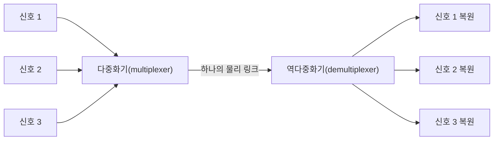

<Callout type="info">
  **이번 문서의 목표:** 이 문서를 다 읽으면 FDM·TDM·WDM 세 다중화(multiplexing) 방식의 원리와 차이를 설명하고, 05편에서 배운 회선·패킷 교환을 저장 후 전달(store-and-forward) 개념까지 포함해 심화 비교하며, 각 방식의 지연·자원 활용 특성을 계산할 수 있다.
</Callout>

## 왜 "다중화"가 필요한가

> **쉽게 말하면:** 다중화는 하나의 물리적 회선을 여러 사용자(또는 여러 통신)가 동시에 나눠 쓸 수 있게 만드는 기술이다.

06편에서 다룬 전송 매체(광섬유, 구리선 등)를 설치하는 데는 큰 비용이 든다. 사용자마다 전용 회선을 하나씩 새로 깔아 주는 것은 비효율적이므로, 하나의 물리적 회선(link, 링크) 위에 여러 개의 논리적 통신 채널(channel)을 동시에 실어 보내는 기술이 필요하다. 이 기술을 **다중화**(multiplexing)라고 하며, 반대로 수신 측에서 여러 채널을 다시 원래대로 분리하는 과정을 **역다중화**(demultiplexing)라고 한다.

다중화 방식은 "무엇을 기준으로 채널을 나누는가"에 따라 크게 세 가지로 나뉜다.

## FDM: 주파수로 나눈다

**FDM**(Frequency Division Multiplexing, 주파수 분할 다중화)은 하나의 물리적 매체가 지원하는 전체 주파수 대역(bandwidth)을 여러 개의 좁은 주파수 대역으로 쪼개고, 각 사용자에게 서로 다른 주파수 대역을 고정으로 할당하는 방식이다. 각 신호는 자신에게 할당된 주파수 범위 안에서 **동시에** 전송되지만, 주파수가 겹치지 않으므로 서로 간섭하지 않는다.

> **비유:** FDM은 라디오 방송국들이 각자 다른 주파수(예: 89.1MHz, 93.9MHz)를 배정받아 동시에 방송하는 것과 같다. 청취자는 원하는 주파수에 라디오를 맞추기만 하면 그 방송만 골라 들을 수 있다.

FDM은 아날로그 신호에 주로 쓰이며, 라디오·TV 방송, 초기 아날로그 전화망의 장거리 회선 등이 대표적인 사례다. 채널 사이에 신호가 서로 침범하지 않도록 완충 역할을 하는 빈 주파수 대역인 **가드 밴드**(guard band)를 두어야 하는데, 이 가드 밴드는 실제 데이터를 싣지 못하는 낭비 구간이므로 FDM의 효율을 떨어뜨리는 요인이 된다.

## TDM: 시간으로 나눈다

**TDM**(Time Division Multiplexing, 시간 분할 다중화)은 전체 주파수 대역을 하나만 쓰되, 그 대신 **시간**을 아주 짧은 구간(타임 슬롯, time slot)으로 잘게 나누어 각 사용자에게 순서대로 돌아가며 할당하는 방식이다. 각 사용자는 자신에게 할당된 짧은 시간 동안만 전체 대역폭을 독점적으로 사용하고, 그 시간이 지나면 다음 사용자에게 순서가 넘어간다.

> **비유:** TDM은 하나의 회의실(전체 대역폭)을 여러 팀이 시간표를 정해 돌아가며 쓰는 것과 같다. 9시부터 10분은 A팀, 그다음 10분은 B팀 하는 식으로, 회의실 자체는 하나지만 시간을 쪼개 나눠 쓴다.

TDM은 디지털 신호 전송에 적합하며, 디지털 전화망의 T1/E1 회선 등에 널리 쓰인다. TDM에는 각 사용자에게 정해진 시간 슬롯을 고정으로 배정하는 **동기식 TDM**(synchronous TDM)과, 실제로 보낼 데이터가 있는 사용자에게만 그때그때 슬롯을 배정하는 **비동기식 TDM**(asynchronous TDM, 통계적 TDM)이 있다. 동기식은 구현이 단순하지만 보낼 데이터가 없는 사용자의 슬롯도 비워둔 채 낭비되는 반면, 비동기식은 슬롯 활용도가 높지만 각 슬롯에 "누구의 데이터인지" 식별 정보를 추가해야 하는 부담이 있다.

## WDM: 빛의 파장으로 나눈다

**WDM**(Wavelength Division Multiplexing, 파장 분할 다중화)은 광섬유(optical fiber) 통신에 특화된 다중화 방식으로, 원리상 FDM과 사실상 동일하다. 다만 주파수 대신 **빛의 파장**(wavelength, 빛의 색에 해당하는 물리량)을 기준으로 채널을 나눈다는 점이 다르다. 서로 다른 파장(색)의 빛을 하나의 광섬유에 동시에 흘려보내면, 각 파장이 마치 독립된 채널처럼 동작해 여러 신호를 동시에 전송할 수 있다.

> **비유:** WDM은 하나의 유리관 속으로 빨간빛·초록빛·파란빛을 동시에 통과시키고, 반대편에서 프리즘으로 색깔별로 다시 분리해 받는 것과 같다. 각 색(파장)이 하나의 독립된 통신 채널 역할을 한다.

WDM 중에서도 매우 좁은 간격으로 훨씬 더 많은 파장을 밀집시켜 전송하는 방식을 **DWDM**(Dense WDM, 고밀도 파장 분할 다중화)이라 하며, 대륙 간 해저 광케이블 등 초고용량 백본(backbone) 회선에 쓰인다.

## FDM·TDM·WDM 대조표

| 구분 | FDM | TDM | WDM |
|------|-----|-----|-----|
| 나누는 기준 | 주파수(frequency) | 시간(time slot) | 빛의 파장(wavelength) |
| 적합한 신호 | 아날로그 | 디지털 | 광신호(디지털·아날로그 무관) |
| 매체 | 전기 신호를 쓰는 유·무선 매체 | 전기 신호를 쓰는 유·무선 매체 | 광섬유 전용 |
| 낭비 요소 | 가드 밴드(guard band)로 인한 대역 손실 | 사용하지 않는 슬롯의 낭비(동기식 TDM의 경우) | 채널(파장) 간 최소 간격 확보 필요 |
| 대표 사례 | 라디오·TV 방송, 아날로그 전화 반송 회선 | 디지털 전화망(T1/E1 등) | 해저 광케이블, 광통신 백본망 |
| FDM과의 관계 | 기준 | 시간 축에서 FDM과 유사한 발상 | 원리상 FDM과 동일(파장 대신 주파수 개념) |

> **자주 틀리는 점:** WDM을 TDM의 일종으로 착각하기 쉽지만, WDM은 원리상 시간이 아니라 **주파수**(파장)를 기준으로 나누므로 FDM과 같은 계열에 속한다. "광섬유에 쓰이니까 다르다"고 넘어가지 말고, 반드시 "무엇을 기준으로 채널을 나누는가"로 분류해야 한다.

## 회선 교환과 패킷 교환 심화: 저장 후 전달

05편에서 회선 교환과 패킷 교환의 기본 차이(연결 설정, 자원 예약, 지연, 효율)를 다뤘다. 이 절에서는 패킷 교환이 실제로 데이터를 전달하는 방식인 **저장 후 전달**(store-and-forward)을 자세히 살펴보고, 이것이 지연 계산에 어떤 영향을 주는지 확인한다.

### 저장 후 전달의 동작 원리

패킷 교환 네트워크의 중간 노드(라우터, 스위치)는 패킷을 받는 즉시 다음 노드로 흘려보내지 않는다. 대신 다음 순서를 따른다.

<Steps>
1. 패킷 전체를 완전히 수신해 버퍼(buffer, 임시 저장 공간)에 저장한다.
2. 헤더를 검사해 오류가 없는지 확인하고, 목적지 주소를 근거로 다음 경로를 결정한다.
3. 결정된 다음 링크로 패킷 전체를 다시 전송한다.
</Steps>

핵심은 **패킷의 일부만 받은 상태에서는 절대로 다음 노드에 전달을 시작하지 않는다**는 점이다. 이 방식 때문에 패킷 교환에서는 홉(hop, 경유하는 중간 노드 하나하나) 수가 늘어날수록 저장 후 전달로 인한 지연이 누적된다.

### 저장 후 전달 지연 계산 예시

패킷 크기가 8,000비트(1,000바이트)이고, 각 링크의 대역폭이 2Mbps(2,000,000bps)이며, 발신지에서 목적지까지 라우터 2개를 거쳐(즉 링크 3개, 홉 3회) 전달된다고 하자. 처리·대기 지연과 전파 지연은 무시하고 저장 후 전달로 인한 전송 지연만 계산하면 다음과 같다.

$$
\text{링크 1개당 전송 지연} = \dfrac{8{,}000 \text{ bit}}{2{,}000{,}000 \text{ bit/s}} = 0.004 \text{ 초}
$$

- 8,000비트: 패킷 전체의 크기
- 2,000,000비트/초: 각 링크의 대역폭

저장 후 전달 방식에서는 패킷이 각 링크를 지날 때마다 이 전송 지연이 그대로 다시 발생한다. 링크가 3개이므로 총 지연은 다음과 같다.

$$
\text{총 전송 지연} = 3 \times 0.004 \text{ 초} = 0.012 \text{ 초}
$$

만약 회선 교환처럼 경로 전체가 미리 예약되어 하나의 연속된 통로처럼 동작했다면(가상의 비교를 위한 가정), 이런 홉별 누적 지연 없이 한 번의 전송 지연만으로 끝났을 것이다. 이 차이가 바로 패킷 교환의 지연이 홉 수에 비례해 늘어나는 이유이며, 05편에서 언급한 "패킷 교환의 지연은 변동적"이라는 특성의 근거 중 하나가 된다.

> **자주 틀리는 점:** "저장 후 전달 지연"과 "전파 지연"을 하나로 섞어 계산하는 오류가 흔하다. 저장 후 전달로 인한 지연은 **패킷 크기 ÷ 링크 대역폭**을 홉 수만큼 더한 것이고, 전파 지연은 05편에서 배운 대로 **거리 ÷ 신호 속도**를 각 링크마다 따로 더해야 한다. 실제 시험 계산 문제는 이 두 지연을 모두 요구하는 경우가 많으므로, 문제에서 요구하는 지연의 종류를 정확히 구분해야 한다.

### 회선 교환 vs 패킷 교환(저장 후 전달 포함) 확장 비교

| 기준 | 회선 교환 | 패킷 교환(저장 후 전달) |
|------|-----------|--------------------------|
| 중간 노드의 동작 | 데이터를 그대로 통과시킴(전용 회선이므로 저장할 필요 없음) | 패킷 전체를 저장한 뒤 검사·전달(store-and-forward) |
| 지연 발생 지점 | 최초 회선 설정 시에만 지연 발생 | 매 홉(중간 노드)마다 전송 지연이 누적 |
| 대용량 연속 전송 | 유리(설정 후 안정적인 고정 지연) | 홉 수가 많을수록 누적 지연 커짐 |
| 간헐적·버스트 트래픽 | 불리(회선을 계속 독점해 낭비) | 유리(자원을 나눠 쓰며 필요한 만큼만 전송) |

## 다중화와 교환 방식의 관계

다중화와 교환 방식은 서로 다른 층위의 개념이지만 함께 쓰인다. 예를 들어 하나의 물리 회선을 TDM으로 나눠 여러 통신 채널을 만든 뒤, 그 채널들 각각에서 회선 교환 방식으로 통신할 수도 있고(디지털 전화망의 전형적인 구조), 패킷 교환 네트워크의 백본 회선을 WDM으로 다중화해 여러 파장 채널에 각각 독립적인 패킷 트래픽을 실어 보낼 수도 있다. 즉 **다중화는 "하나의 물리 매체를 몇 개의 논리 채널로 나눌 것인가"의 문제**이고, **교환 방식은 "그 채널(또는 전체 회선) 위에서 어떻게 데이터를 전달할 것인가"의 문제**로, 서로 독립적인 설계 축이라는 점을 구분해야 한다.

## 핵심 정리

- FDM은 주파수, TDM은 시간, WDM은 빛의 파장을 기준으로 하나의 물리 매체를 여러 논리 채널로 나누는 다중화 방식이며, WDM은 원리상 FDM 계열에 속한다.
- FDM은 가드 밴드로 인한 대역 손실이, 동기식 TDM은 빈 슬롯으로 인한 낭비가 각각의 비효율 요인이다.
- 패킷 교환은 저장 후 전달(store-and-forward) 방식으로 동작해, 패킷 전체를 완전히 수신한 뒤에야 다음 노드로 전달하므로 홉 수가 늘어날수록 전송 지연이 누적된다.
- 다중화(채널을 나누는 방법)와 교환 방식(채널 위에서 데이터를 전달하는 방법)은 서로 다른 설계 축이며, 실제 네트워크에서는 함께 조합되어 쓰인다.

## 마무리 복습

<Quiz
  questionNumber={1}
  question="FDM, TDM, WDM을 구분하는 기준으로 옳게 짝지어진 것은?"
  options={['FDM-시간, TDM-주파수, WDM-파장', 'FDM-주파수, TDM-시간, WDM-파장', 'FDM-파장, TDM-주파수, WDM-시간', 'FDM-시간, TDM-파장, WDM-주파수']}
  correctAnswer={2}
  explanation="FDM은 주파수, TDM은 시간, WDM은 빛의 파장을 기준으로 채널을 나눈다."
  optionExplanations={['FDM과 TDM의 기준이 서로 바뀌어 있다.', '정답. FDM-주파수, TDM-시간, WDM-파장이 올바른 대응이다.', '세 방식의 기준이 모두 잘못 짝지어져 있다.', '세 방식의 기준이 모두 잘못 짝지어져 있다.']}
/>

<Quiz
  questionNumber={2}
  question="WDM에 대한 설명으로 옳은 것은?"
  options={['시간 슬롯을 기준으로 채널을 나누므로 TDM의 일종이다', '주파수 대신 빛의 파장을 기준으로 나누며 원리상 FDM 계열이다', '아날로그 전화망에서만 사용되는 다중화 방식이다', '가드 밴드 없이 동작해 FDM보다 항상 효율적이다']}
  correctAnswer={2}
  explanation="WDM은 빛의 파장을 기준으로 채널을 나누며, 이는 주파수를 기준으로 나누는 FDM과 원리상 동일한 계열에 속한다."
  optionExplanations={['WDM은 시간이 아니라 파장을 기준으로 나누므로 TDM 계열이 아니다.', '정답. WDM은 파장 기준으로 FDM과 같은 계열에 속한다.', 'WDM은 광섬유 통신에 쓰이는 방식이며 아날로그 전화망과는 관련이 적다.', 'WDM도 채널(파장) 간 최소 간격을 확보해야 하므로 항상 효율적이라고 단정할 수 없다.']}
/>

<Quiz
  questionNumber={3}
  question="동기식 TDM(synchronous TDM)의 단점으로 옳은 것은?"
  options={['가드 밴드로 인한 대역 손실이 발생한다', '보낼 데이터가 없는 사용자의 슬롯도 비워둔 채 낭비된다', '광섬유에서만 동작해 범용성이 떨어진다', '채널마다 서로 다른 파장을 배정해야 한다']}
  correctAnswer={2}
  explanation="동기식 TDM은 각 사용자에게 시간 슬롯을 고정 배정하므로, 데이터가 없는 사용자의 슬롯도 그대로 비워진 채 낭비되는 단점이 있다."
  optionExplanations={['가드 밴드는 TDM이 아니라 FDM의 낭비 요소다.', '정답. 고정 슬롯 배정 방식이라 데이터 없는 사용자의 슬롯도 낭비된다.', 'TDM은 광섬유 전용이 아니라 일반 유·무선 매체에도 쓰인다.', '파장 배정은 TDM이 아니라 WDM의 특징이다.']}
/>

<Quiz
  questionNumber={4}
  question="패킷 크기 4,000비트, 링크 대역폭 1Mbps(1,000,000bps)인 링크 2개를 저장 후 전달 방식으로 거쳐 전달될 때, 전파 지연을 무시하면 총 전송 지연은?"
  options={['0.002초', '0.004초', '0.008초', '0.016초']}
  correctAnswer={3}
  explanation="링크 1개당 전송 지연은 4,000 ÷ 1,000,000 = 0.004초이며, 저장 후 전달 방식에서는 링크마다 이 지연이 누적되므로 링크 2개면 0.004 × 2 = 0.008초다."
  optionExplanations={['링크 1개당 절반 값에 해당해 계산이 부족하다.', '이는 링크 1개만 지났을 때의 지연이다.', '정답. 0.004초 × 2링크 = 0.008초다.', '링크 4개를 지났다고 잘못 계산한 값이다.']}
/>

<Quiz
  questionNumber={5}
  question="다중화(multiplexing)와 교환 방식(switching)의 관계에 대한 설명으로 옳은 것은?"
  options={['다중화와 교환 방식은 같은 개념을 부르는 다른 이름이다', '다중화는 채널을 나누는 방법이고 교환 방식은 그 채널 위에서 데이터를 전달하는 방법으로, 서로 독립적인 설계 축이다', 'TDM을 쓰면 반드시 패킷 교환을 써야 한다', 'WDM은 회선 교환에서만 사용할 수 있다']}
  correctAnswer={2}
  explanation="다중화는 하나의 물리 매체를 여러 논리 채널로 나누는 방법을, 교환 방식은 그 채널(또는 회선) 위에서 데이터를 전달하는 방법을 다루는 서로 다른 설계 축이다."
  optionExplanations={['두 개념은 다루는 대상(채널 분할 vs 데이터 전달 방식)이 서로 다르다.', '정답. 다중화와 교환 방식은 서로 독립적인 설계 축으로 함께 조합해 쓰인다.', 'TDM은 회선 교환·패킷 교환 어느 쪽과도 결합될 수 있다.', 'WDM은 패킷 교환 백본 회선에도 널리 쓰인다.']}
/>

## 참고 자료

- [IEEE 802.3 표준 개요 자료](https://standards.ieee.org/)
- [국가평생교육진흥원 독학학위제 - 과목별 평가영역](https://bdes.nile.or.kr/nile/study/nStudy2_1.do)
