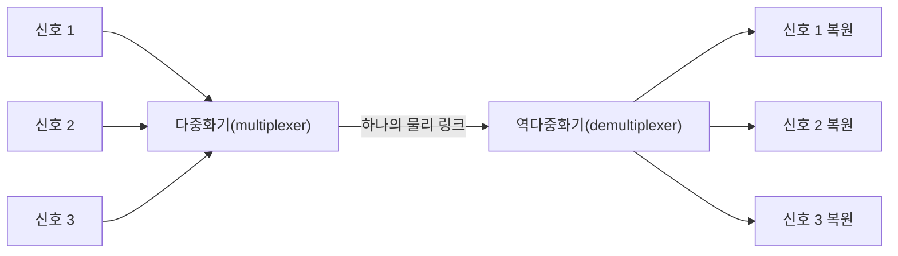

## 왜 "다중화"가 필요한가

06편에서 다룬 전송 매체(광섬유, 구리선 등)를 설치하는 데는 큰 비용이 든다. 이 기술을 **다중화**(multiplexing)라고 하며, 반대로 수신 측에서 여러 채널을 다시 원래대로 분리하는 과정을 **역다중화**(demultiplexing)라고 한다.

```mermaid
graph LR
  S1["신호 1"] --> MUX["다중화기(multiplexer)"]
  S2["신호 2"] --> MUX
  S3["신호 3"] --> MUX
  MUX -->|하나의 물리 링크| DEMUX["역다중화기(demultiplexer)"]
  DEMUX --> R1["신호 1 복원"]
  DEMUX --> R2["신호 2 복원"]
  DEMUX --> R3["신호 3 복원"]
```

다중화 방식은 "무엇을 기준으로 채널을 나누는가"에 따라 크게 세 가지로 나뉜다.

## FDM: 주파수로 나눈다

**FDM**(Frequency Division Multiplexing, 주파수 분할 다중화)은 하나의 물리적 매체가 지원하는 전체 주파수 대역(bandwidth)을 여러 개의 좁은 주파수 대역으로 쪼개고, 각 사용자에게 서로 다른 주파수 대역을 고정으로 할당하는 방식이다. 각 신호는 자신에게 할당된 주파수 범위 안에서 **동시에** 전송되지만, 주파수가 겹치지 않으므로 서로 간섭하지 않는다.

FDM은 아날로그 신호에 주로 쓰이며, 라디오·TV 방송, 초기 아날로그 전화망의 장거리 회선 등이 대표적인 사례다. 채널 사이에 신호가 서로 침범하지 않도록 완충 역할을 하는 빈 주파수 대역인 **가드 밴드**(guard band)를 두어야 하는데, 이 가드 밴드는 실제 데이터를 싣지 못하는 낭비 구간이므로 FDM의 효율을 떨어뜨리는 요인이 된다.

## TDM: 시간으로 나눈다

**TDM**(Time Division Multiplexing, 시간 분할 다중화)은 전체 주파수 대역을 하나만 쓰되, 그 대신 **시간**을 아주 짧은 구간(타임 슬롯, time slot)으로 잘게 나누어 각 사용자에게 순서대로 돌아가며 할당하는 방식이다. 각 사용자는 자신에게 할당된 짧은 시간 동안만 전체 대역폭을 독점적으로 사용하고, 그 시간이 지나면 다음 사용자에게 순서가 넘어간다.

TDM은 디지털 신호 전송에 적합하며, 디지털 전화망의 T1/E1 회선 등에 널리 쓰인다. TDM에는 각 사용자에게 정해진 시간 슬롯을 고정으로 배정하는 **동기식 TDM**(synchronous TDM)과, 실제로 보낼 데이터가 있는 사용자에게만 그때그때 슬롯을 배정하는 **비동기식 TDM**(asynchronous TDM, 통계적 TDM)이 있다.

## WDM: 빛의 파장으로 나눈다

**WDM**(Wavelength Division Multiplexing, 파장 분할 다중화)은 광섬유(optical fiber) 통신에 특화된 다중화 방식으로, 원리상 FDM과 사실상 동일하다. 다만 주파수 대신 **빛의 파장**(wavelength, 빛의 색에 해당하는 물리량)을 기준으로 채널을 나눈다는 점이 다르다.

WDM 중에서도 매우 좁은 간격으로 훨씬 더 많은 파장을 밀집시켜 전송하는 방식을 **DWDM**(Dense WDM, 고밀도 파장 분할 다중화)이라 하며, 대륙 간 해저 광케이블 등 초고용량 백본(backbone) 회선에 쓰인다.

## FDM·TDM·WDM 대조표

| 구분 | FDM | TDM | WDM |
|------|-----|-----|-----|
| 나누는 기준 | 주파수(frequency) | 시간(time slot) | 빛의 파장(wavelength) |
| 적합한 신호 | 아날로그 | 디지털 | 광신호(디지털·아날로그 무관) |
| 매체 | 전기 신호를 쓰는 유·무선 매체 | 전기 신호를 쓰는 유·무선 매체 | 광섬유 전용 |
| 낭비 요소 | 가드 밴드(guard band)로 인한 대역 손실 | 사용하지 않는 슬롯의 낭비(동기식 TDM의 경우) | 채널(파장) 간 최소 간격 확보 필요 |
| 대표 사례 | 라디오·TV 방송, 아날로그 전화 반송 회선 | 디지털 전화망(T1/E1 등) | 해저 광케이블, 광통신 백본망 |
| FDM과의 관계 | 기준 | 시간 축에서 FDM과 유사한 발상 | 원리상 FDM과 동일(파장 대신 주파수 개념) |

> **자주 틀리는 점:** WDM을 TDM의 일종으로 착각하기 쉽지만, WDM은 원리상 시간이 아니라 **주파수**(파장)를 기준으로 나누므로 FDM과 같은 계열에 속한다. "광섬유에 쓰이니까 다르다"고 넘어가지 말고, 반드시 "무엇을 기준으로 채널을 나누는가"로 분류해야 한다.

## 회선 교환과 패킷 교환 심화: 저장 후 전달

05편에서 회선 교환과 패킷 교환의 기본 차이(연결 설정, 자원 예약, 지연, 효율)를 다뤘다. 이 절에서는 패킷 교환이 실제로 데이터를 전달하는 방식인 **저장 후 전달**(store-and-forward)을 자세히 살펴보고, 이것이 지연 계산에 어떤 영향을 주는지 확인한다.

### 저장 후 전달의 동작 원리

패킷 교환 네트워크의 중간 노드(라우터, 스위치)는 패킷을 받는 즉시 다음 노드로 흘려보내지 않는다. 대신 다음 순서를 따른다.

핵심은 **패킷의 일부만 받은 상태에서는 절대로 다음 노드에 전달을 시작하지 않는다**는 점이다. 이 방식 때문에 패킷 교환에서는 홉(hop, 경유하는 중간 노드 하나하나) 수가 늘어날수록 저장 후 전달로 인한 지연이 누적된다.

### 저장 후 전달 지연 계산 예시

패킷 크기가 8,000비트(1,000바이트)이고, 각 링크의 대역폭이 2Mbps(2,000,000bps)이며, 발신지에서 목적지까지 라우터 2개를 거쳐(즉 링크 3개, 홉 3회) 전달된다고 하자. 처리·대기 지연과 전파 지연은 무시하고 저장 후 전달로 인한 전송 지연만 계산하면 다음과 같다.

$$
\text{링크 1개당 전송 지연} = \dfrac{8{,}000 \text{ bit}}{2{,}000{,}000 \text{ bit/s}} = 0.004 \text{ 초}
$$

- 8,000비트: 패킷 전체의 크기
- 2,000,000비트/초: 각 링크의 대역폭

저장 후 전달 방식에서는 패킷이 각 링크를 지날 때마다 이 전송 지연이 그대로 다시 발생한다. 링크가 3개이므로 총 지연은 다음과 같다.

$$
\text{총 전송 지연} = 3 \times 0.004 \text{ 초} = 0.012 \text{ 초}
$$

만약 회선 교환처럼 경로 전체가 미리 예약되어 하나의 연속된 통로처럼 동작했다면(가상의 비교를 위한 가정), 이런 홉별 누적 지연 없이 한 번의 전송 지연만으로 끝났을 것이다. 이 차이가 바로 패킷 교환의 지연이 홉 수에 비례해 늘어나는 이유이며, 05편에서 언급한 "패킷 교환의 지연은 변동적"이라는 특성의 근거 중 하나가 된다.

> **자주 틀리는 점:** "저장 후 전달 지연"과 "전파 지연"을 하나로 섞어 계산하는 오류가 흔하다. 저장 후 전달로 인한 지연은 **패킷 크기 ÷ 링크 대역폭**을 홉 수만큼 더한 것이고, 전파 지연은 05편에서 배운 대로 **거리 ÷ 신호 속도**를 각 링크마다 따로 더해야 한다. 실제 시험 계산 문제는 이 두 지연을 모두 요구하는 경우가 많으므로, 문제에서 요구하는 지연의 종류를 정확히 구분해야 한다.

### 회선 교환 vs 패킷 교환(저장 후 전달 포함) 확장 비교

| 기준 | 회선 교환 | 패킷 교환(저장 후 전달) |
|------|-----------|--------------------------|
| 중간 노드의 동작 | 데이터를 그대로 통과시킴(전용 회선이므로 저장할 필요 없음) | 패킷 전체를 저장한 뒤 검사·전달(store-and-forward) |
| 지연 발생 지점 | 최초 회선 설정 시에만 지연 발생 | 매 홉(중간 노드)마다 전송 지연이 누적 |
| 대용량 연속 전송 | 유리(설정 후 안정적인 고정 지연) | 홉 수가 많을수록 누적 지연 커짐 |
| 간헐적·버스트 트래픽 | 불리(회선을 계속 독점해 낭비) | 유리(자원을 나눠 쓰며 필요한 만큼만 전송) |

## 다중화와 교환 방식의 관계

다중화와 교환 방식은 서로 다른 층위의 개념이지만 함께 쓰인다. 즉 **다중화는 "하나의 물리 매체를 몇 개의 논리 채널로 나눌 것인가"의 문제**이고, **교환 방식은 "그 채널(또는 전체 회선) 위에서 어떻게 데이터를 전달할 것인가"의 문제**로, 서로 독립적인 설계 축이라는 점을 구분해야 한다.

## 핵심 정리

- FDM은 주파수, TDM은 시간, WDM은 빛의 파장을 기준으로 하나의 물리 매체를 여러 논리 채널로 나누는 다중화 방식이며, WDM은 원리상 FDM 계열에 속한다.
- FDM은 가드 밴드로 인한 대역 손실이, 동기식 TDM은 빈 슬롯으로 인한 낭비가 각각의 비효율 요인이다.
- 패킷 교환은 저장 후 전달(store-and-forward) 방식으로 동작해, 패킷 전체를 완전히 수신한 뒤에야 다음 노드로 전달하므로 홉 수가 늘어날수록 전송 지연이 누적된다.
- 다중화(채널을 나누는 방법)와 교환 방식(채널 위에서 데이터를 전달하는 방법)은 서로 다른 설계 축이며, 실제 네트워크에서는 함께 조합되어 쓰인다.

## 마무리 복습

<Quiz
  questionNumber={1}
  question={"FDM, TDM, WDM을 구분하는 기준으로 옳게 짝지어진 것은?"}
  options={["FDM-시간, TDM-주파수, WDM-파장","FDM-주파수, TDM-시간, WDM-파장","FDM-파장, TDM-주파수, WDM-시간","FDM-시간, TDM-파장, WDM-주파수"]}
  correctAnswer={2}
  explanation={"FDM은 주파수, TDM은 시간, WDM은 빛의 파장을 기준으로 채널을 나눈다."}
/>

<Quiz
  questionNumber={2}
  question={"WDM에 대한 설명으로 옳은 것은?"}
  options={["시간 슬롯을 기준으로 채널을 나누므로 TDM의 일종이다","주파수 대신 빛의 파장을 기준으로 나누며 원리상 FDM 계열이다","아날로그 전화망에서만 사용되는 다중화 방식이다","가드 밴드 없이 동작해 FDM보다 항상 효율적이다"]}
  correctAnswer={2}
  explanation={"WDM은 빛의 파장을 기준으로 채널을 나누며, 이는 주파수를 기준으로 나누는 FDM과 원리상 동일한 계열에 속한다."}
/>

<Quiz
  questionNumber={3}
  question={"동기식 TDM(synchronous TDM)의 단점으로 옳은 것은?"}
  options={["가드 밴드로 인한 대역 손실이 발생한다","보낼 데이터가 없는 사용자의 슬롯도 비워둔 채 낭비된다","광섬유에서만 동작해 범용성이 떨어진다","채널마다 서로 다른 파장을 배정해야 한다"]}
  correctAnswer={2}
  explanation={"동기식 TDM은 각 사용자에게 시간 슬롯을 고정 배정하므로, 데이터가 없는 사용자의 슬롯도 그대로 비워진 채 낭비되는 단점이 있다."}
/>

## 참고 자료

- [IEEE 802.3 표준 개요 자료](https://standards.ieee.org/)
- [국가평생교육진흥원 독학학위제 - 과목별 평가영역](https://bdes.nile.or.kr/nile/study/nStudy2_1.do)
