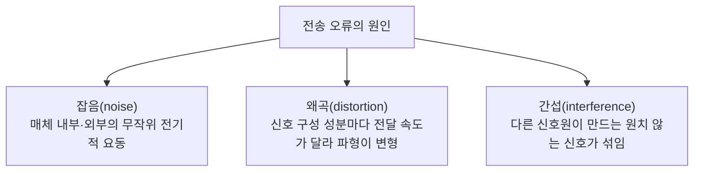
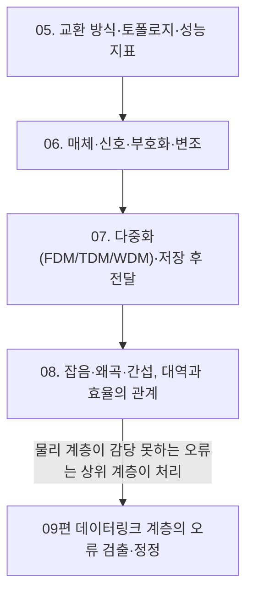

## 왜 "실제 문제"를 따로 다루는가

05~07편에서는 신호를 "어떻게 실어 보내는가"(교환·다중화)와 "무엇으로 실어 보내는가"(매체, 아날로그·디지털, 부호화·변조)를 다뤘다. 그러나 실제 전송 환경에서는 신호가 매체를 통과하면서 여러 방해 요소를 만나 원래 형태가 훼손된다.

## 전송 오류의 세 가지 원인: 잡음, 왜곡, 간섭

전송 오류(transmission error)를 일으키는 원인은 크게 세 가지이며, 이 세 가지는 서로 발생 원리가 다르므로 명확히 구분해야 한다.

```mermaid
graph TD
  Error["전송 오류의 원인"] --> Noise["잡음(noise)<br/>매체 내부·외부의 무작위 전기적 요동"]
  Error --> Distortion["왜곡(distortion)<br/>신호 구성 성분마다 전달 속도가 달라 파형이 변형"]
  Error --> Interference["간섭(interference)<br/>다른 신호원이 만드는 원치 않는 신호가 섞임"]
```

### 잡음(noise)

**잡음**은 매체 내부의 전자(electron)들이 열에너지로 인해 무작위로 움직이며 만들어내는 원치 않는 신호다. 대표적으로 **열 잡음**(thermal noise)이 있으며, 온도가 0도(절대영도)보다 높은 모든 매체에서 필연적으로 발생한다.

### 왜곡(distortion)

**왜곡**은 신호가 여러 주파수 성분으로 이루어져 있을 때, 각 성분이 매체를 통과하는 속도나 감쇠 정도가 서로 달라 수신 측에 도착하는 시점과 형태가 어긋나면서 원래 파형이 변형되는 현상이다. 신호 자체는 외부의 방해 없이도, 매체의 물리적 특성 때문에 스스로 일그러진다는 점이 잡음·간섭과 다르다.

### 간섭(interference)

**간섭**은 다른 통신이나 외부 전자기 신호원이 만들어내는 신호가 원래 신호에 섞여 들어오는 현상이다. 형광등, 모터, 인접한 다른 통신 채널의 신호가 대표적인 간섭원이다. 잡음이 "매체 내부에서 저절로 생기는 무작위 요동"이라면, 간섭은 "외부의 다른 신호원"이 원인이라는 점에서 근본적으로 다르다.

### 잡음·왜곡·간섭 비교표

| 구분 | 발생 원인 | 특징 | 대응 방법 |
|------|-----------|------|-----------|
| 잡음 | 매체 내부 전자의 무작위 열 운동 | 항상 존재하며 완전히 제거 불가능 | 신호 세기를 잡음보다 충분히 높게 유지(신호 대 잡음비 확보) |
| 왜곡 | 신호 성분별 전달 속도·감쇠 차이 | 외부 방해 없이도 매체 특성만으로 발생 | 균등화(equalization) 기술로 성분별 지연 차이 보정 |
| 간섭 | 외부의 다른 신호원 | 발생원을 특정할 수 있는 경우가 많음 | 차폐(06편 동축 케이블), 주파수 분리(07편 FDM), 물리적 격리 |

> **자주 틀리는 점:** 잡음과 간섭을 같은 개념으로 혼동하기 쉽다. 잡음은 "원인을 특정할 수 없는, 매체 자체의 무작위 요동"이고 간섭은 "원인이 되는 외부 신호원이 존재하는 방해"라는 점이 핵심 구분 기준이다. 왜곡은 아예 외부 요인 없이 신호 스스로 변형된다는 점에서 둘과 또 다르다.

## 신호 대 잡음비: 오류 가능성을 정량화하기

잡음의 영향을 얼마나 견딜 수 있는지를 나타내는 대표 지표가 **신호 대 잡음비**(SNR, Signal-to-Noise Ratio)다.

$$
\text{SNR} = \dfrac{\text{신호 전력}}{\text{잡음 전력}}
$$

- 신호 전력: 실어 보내려는 원래 신호의 세기
- 잡음 전력: 그 신호에 섞여 있는 잡음의 세기

SNR 값이 클수록 신호가 잡음보다 상대적으로 강하다는 뜻이므로 수신 측이 신호를 잡음과 구분하기 쉬워지고, 오류 발생 가능성이 낮아진다. 예를 들어 신호 전력이 1,000(단위 생략), 잡음 전력이 10이라면 다음과 같다.

$$
\text{SNR} = \dfrac{1{,}000}{10} = 100
$$

SNR은 값이 매우 크게 벌어지는 경우가 많아 실무에서는 로그 스케일인 데시벨(dB, decibel)로 표현하는 경우가 많다는 점만 개념적으로 알아두면 충분하며, 독학사 시험에서는 SNR의 정의(신호 전력 ÷ 잡음 전력)와 "값이 클수록 유리하다"는 방향성을 묻는 문항이 중심이다.

## 신호 대역과 전송 효율

06편에서 대역폭(주파수 대역)이 넓을수록 더 많은 정보를 실어 보낼 수 있다고 배웠다. 이 관계를 이론적으로 정리한 것이 **나이퀴스트 정리**(Nyquist theorem)와 **섀넌의 정리**(Shannon's theorem)다.

- **나이퀴스트 정리**는 잡음이 없는 이상적인 채널을 가정하고, 채널의 대역폭만으로 최대 전송 속도의 한계를 구한다.
- **섀넌의 정리**는 실제 채널에 존재하는 잡음까지 고려해, 대역폭과 SNR을 함께 반영한 최대 전송 속도(채널 용량, channel capacity)의 한계를 구한다.

두 정리 모두 결론적으로 말하는 바는 같다. **신호 대역(주파수 대역)이 넓을수록, 그리고 잡음이 적을수록(SNR이 높을수록) 전송 효율과 최대 전송 속도가 높아진다**는 것이다. 반대로 대역이 좁거나 잡음이 심한 채널은 아무리 정교한 부호화·변조 기술을 쓰더라도 전송 속도에 물리적인 한계가 생긴다.

## 05~08편 물리 계층 개념의 시험 포인트 정리

05편부터 08편까지 다룬 물리 계층 개념은 서로 연결되어 하나의 큰 그림을 이룬다. 이 그림을 다시 정리하면 다음과 같다.

```mermaid
graph TD
  A["05. 교환 방식·토폴로지·성능 지표"] --> B["06. 매체·신호·부호화·변조"]
  B --> C["07. 다중화(FDM/TDM/WDM)·저장 후 전달"]
  C --> D["08. 잡음·왜곡·간섭, 대역과 효율의 관계"]
  D -->|물리 계층이 감당 못하는 오류는 상위 계층이 처리| E["09편 데이터링크 계층의 오류 검출·정정"]
```

독학사 시험에서 물리 계층 문제는 다음 네 가지 유형으로 압축된다.

1. **비교형 문항**: 회선 교환 vs 패킷 교환, FDM vs TDM vs WDM, 아날로그 vs 디지털, 부호화 vs 변조처럼 "두 개념의 차이를 정확히 아는가"를 묻는다. 각 개념의 정의만 알아서는 풀 수 없고, **비교 기준을 명시적으로 짚어야** 한다.
2. **계산형 문항**: 전송 지연, 전파 지연, 처리량, 손실률, 저장 후 전달 지연, SNR처럼 공식에 숫자를 대입해 답을 구하는 문항이다. 단위(bps, bit, m, s)를 헷갈리지 않는 것이 핵심이다.
3. **원인·현상 구분형 문항**: 잡음·왜곡·간섭처럼 "겉보기에는 비슷하지만 원인이 다른 현상"을 구분하는 문항이다.
4. **개념 적용형 문항**: "이런 상황에는 어떤 방식이 적합한가"(예: 버스트 트래픽에는 패킷 교환이 유리, 광섬유 장거리 백본에는 WDM이 유리)를 실제 상황에 적용해 판단하는 문항이다.

> **자주 틀리는 점:** 물리 계층 전체를 "암기 과목"으로 착각해 정의만 외우는 경우가 많다. 그러나 05~08편에서 반복해서 강조했듯, 시험은 "정의를 아는가"보다 "두 개념을 구분할 수 있는가"와 "숫자를 계산해 방향성을 판단할 수 있는가"를 더 자주 묻는다. 비교표와 계산 과정을 눈으로만 읽지 말고 직접 손으로 대입해 계산해 보는 연습이 필요하다.

## 핵심 정리

- 전송 오류의 세 가지 원인은 잡음(매체 내부의 무작위 열 운동, 완전히 제거 불가능), 왜곡(성분별 전달 속도 차이로 인한 자체 변형), 간섭(외부 신호원의 유입)으로 서로 발생 원리가 다르다.
- 신호 대 잡음비(SNR)는 신호 전력 ÷ 잡음 전력으로 구하며, 값이 클수록 오류 가능성이 낮아진다.
- 나이퀴스트 정리는 잡음이 없는 이상적 채널의 최대 전송 속도를, 섀넌의 정리는 잡음까지 고려한 채널 용량의 한계를 다루며, 두 정리 모두 대역폭이 넓고 잡음이 적을수록 전송 효율이 높아진다는 방향성을 공유한다.
- 05~08편 물리 계층 문항은 비교형, 계산형, 원인·현상 구분형, 개념 적용형 네 가지 유형으로 압축되며, 정의 암기보다 개념 간 차이와 계산 과정 이해가 핵심이다.

## 마무리 복습

<Quiz
  questionNumber={1}
  question={"전송 오류를 일으키는 세 가지 원인 중, 외부의 다른 신호원이 원인이 되어 원래 신호에 원치 않는 신호가 섞이는 현상은?"}
  options={["잡음(noise)","왜곡(distortion)","간섭(interference)","감쇠(attenuation)"]}
  correctAnswer={3}
  explanation={"간섭은 형광등, 모터, 인접 채널 신호처럼 외부의 다른 신호원이 만들어내는 신호가 섞여 드는 현상이다."}
/>

<Quiz
  questionNumber={2}
  question={"잡음(noise)에 대한 설명으로 옳은 것은?"}
  options={["옆 채널의 신호가 섞여 드는 현상이다","매체 내부 전자의 무작위 열 운동으로 생기며 완전히 제거할 수 없다","신호 성분마다 전달 속도가 달라 파형이 변형되는 현상이다","신호가 매체를 이동하며 세기를 잃는 현상이다"]}
  correctAnswer={2}
  explanation={"잡음은 매체 내부 전자들의 무작위 열 운동(열 잡음)으로 인해 항상 존재하는, 완전히 제거할 수 없는 배경 잡음이다."}
/>

<Quiz
  questionNumber={3}
  question={"신호 전력이 2,000, 잡음 전력이 20일 때 SNR(신호 대 잡음비)은?"}
  options={["10","40","100","400"]}
  correctAnswer={3}
  explanation={"SNR은 신호 전력 ÷ 잡음 전력이다. 2,000 ÷ 20 = 100이다."}
/>

## 참고 자료

- [IEEE 802.3 표준 개요 자료](https://standards.ieee.org/)
- [국가평생교육진흥원 독학학위제 - 과목별 평가영역](https://bdes.nile.or.kr/nile/study/nStudy2_1.do)
