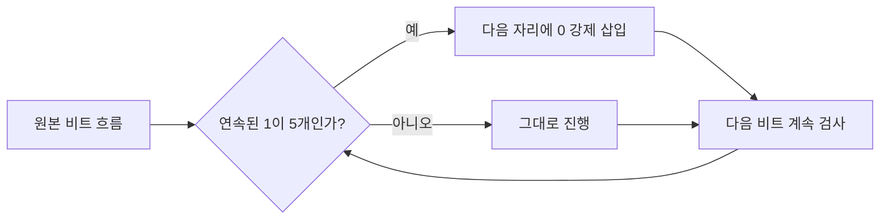
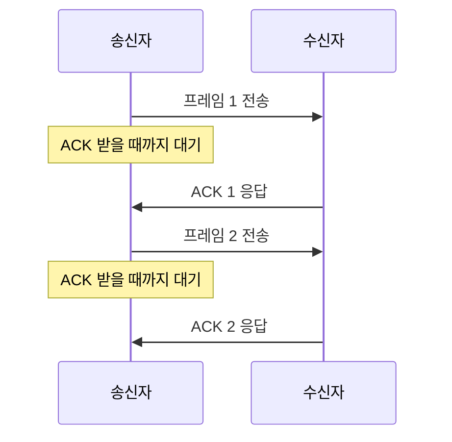
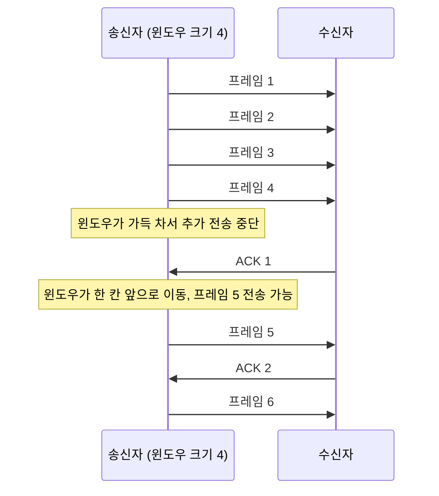

<Callout type="info">
  **이번 문서의 목표:** 이 파일을 다 읽으면 데이터링크 계층이 물리 계층 위에서 어떤 문제를 해결하는지 설명할 수 있고, 패리티·체크섬·CRC를 실제 비트열로 계산하며, Stop-and-Wait와 슬라이딩 윈도우 흐름 제어의 동작을 그림으로 설명할 수 있다.
</Callout>

## 왜 데이터링크 계층이 필요한가

06편에서 배운 물리 계층은 전선이나 전파를 통해 **비트 하나하나를 전기 신호나 광 신호로 바꿔 실어 나르는 일**만 한다. 물리 계층은 "지금 흐르는 비트가 어디서 시작해서 어디서 끝나는지", "중간에 잡음 때문에 비트가 뒤집히지 않았는지", "받는 쪽이 보내는 쪽보다 느려서 데이터를 놓치지는 않는지"에는 전혀 관심이 없다. 그냥 신호를 흘려보낼 뿐이다.

이 문제를 그대로 두면 통신은 성립하지 않는다. 예를 들어 한 호스트가 다른 호스트에게 1과 0으로 이루어진 긴 비트열을 계속 흘려보낸다고 하자. 받는 쪽은 이 비트열을 어디서부터 어디까지 끊어서 "하나의 메시지"로 봐야 할지 알 수 없다. 또 전송 도중 잡음이 끼어 비트 하나가 뒤집혀도 받는 쪽은 이를 알아챌 방법이 없다.

**데이터링크 계층**(data link layer)은 바로 이 틈을 메우기 위해 물리 계층 바로 위에 놓인다. 물리 계층이 뚫어 놓은 하나의 링크(두 인접 노드 사이의 직접 연결) 위에서, 비트 흐름을 의미 있는 단위로 자르고, 오류가 있는지 확인하고, 보내는 속도를 조절하는 일을 담당한다.

> **쉽게 말하면:** 물리 계층이 "선을 깔아 전기를 흘려보내는 사람"이라면, 데이터링크 계층은 그 전기 신호를 "봉투 단위로 자르고, 봉투가 훼손되지 않았는지 확인하고, 상대가 받을 수 있는 속도로 보내는 사람"이다.

## 데이터링크 계층의 책임 범위

데이터링크 계층이 담당하는 일을 하나씩 나열하면 아래와 같다. 이 편에서는 이 중 프레이밍·오류 제어·흐름 제어를 다루고, MAC 주소와 Ethernet(이더넷)은 10편에서, 스위칭은 11편에서 이어서 다룬다.

| 책임 | 무엇을 하는가 | 이 편에서 다루는 범위 |
|------|--------------|----------------------|
| 프레이밍 (framing) | 비트 흐름을 프레임(frame) 단위로 자르는 경계를 정한다 | 이 편에서 상세히 다룸 |
| 오류 제어 (error control) | 전송 중 비트가 손상되었는지 검출하고, 필요하면 정정하거나 재전송을 요청한다 | 이 편에서 상세히 다룸 |
| 흐름 제어 (flow control) | 송신자가 수신자의 처리 속도를 넘어서지 않도록 전송량을 조절한다 | 이 편에서 상세히 다룸 |
| 매체 접근 제어 (MAC, medium access control) | 여러 장치가 하나의 매체를 공유할 때 누가 언제 보낼지 정한다 | 10편에서 CSMA/CD로 다룸 |
| 물리 주소 지정 (physical addressing) | 같은 링크 위 장치를 구분하는 주소(MAC 주소)를 붙인다 | 10편에서 다룸 |

**프레임**(frame)이라는 용어는 01편에서 이미 "링크 하나를 건너가는 데이터 단위"로 정의했다. 이 편에서는 그 프레임의 경계를 실제로 어떻게 정하는지부터 시작한다.

## 프레이밍: 비트 흐름을 어디서 자를 것인가

> **쉽게 말하면:** 프레이밍은 끊임없이 흘러오는 비트 더미에 "여기부터 여기까지가 프레임 하나"라는 표시를 하는 작업이다.

### 왜 필요한가

물리 계층에서 넘어오는 것은 단순한 비트의 연속이다. 010110101101001011… 이런 식으로 끊임없이 이어진다. 수신 측 데이터링크 계층은 이 비트 더미를 받아서 "여기서부터 여기까지가 프레임 1개"라고 잘라내야 상위 계층(네트워크 계층)에 의미 있는 데이터를 넘길 수 있다. 이 경계를 정하는 작업이 **프레이밍**(framing)이다.

### 방법 1 — 문자 개수 세기 (character count)

프레임 맨 앞에 "이 프레임의 길이는 몇 바이트다"라는 필드를 넣는 방식이다. 수신 측은 이 숫자를 읽고 그만큼만 잘라내면 된다.

가장 단순하지만 치명적인 약점이 있다. 만약 길이 필드 자체가 전송 중 손상되면, 수신 측은 엉뚱한 위치까지를 하나의 프레임으로 잘못 인식한다. 그리고 그 뒤에 오는 모든 프레임의 경계까지 연쇄적으로 어긋난다. 이런 문제 때문에 이 방식은 오늘날 거의 쓰이지 않는다.

### 방법 2 — 바이트 스터핑 (byte stuffing)

프레임의 시작과 끝에 특별한 **플래그 바이트**(flag byte, 예: `01111110`)를 붙이는 방식이다. 수신 측은 이 플래그를 만나면 "여기가 프레임의 경계다"라고 판단한다.

문제는 데이터 안에 우연히 플래그와 똑같은 바이트 패턴이 들어있으면 수신 측이 그것을 진짜 경계로 착각한다는 점이다. 이를 막기 위해 송신 측은 데이터 안에서 플래그와 같은 바이트가 나올 때마다 그 앞에 **이스케이프 바이트**(escape byte, 예: `ESC`)를 하나 끼워 넣는다. 수신 측은 `ESC` 바이트를 만나면 "다음 바이트는 진짜 데이터이니 플래그로 해석하지 말라"고 판단하고 `ESC` 자체는 버린다. 만약 데이터 안에 `ESC` 바이트 자체가 나오면 그 앞에도 `ESC`를 하나 더 끼운다. 이 과정을 **바이트 스터핑**이라 부른다.

### 방법 3 — 비트 스터핑 (bit stuffing)

바이트 단위가 아니라 **비트 단위**로 같은 아이디어를 적용한 방식이다. HDLC(High-level Data Link Control) 같은 프로토콜에서 쓴다.

플래그 패턴을 `01111110`(0 하나, 1 여섯 개, 0 하나)으로 정한다. 송신 측은 데이터를 비트 단위로 감시하다가, **연속된 1이 5개** 나올 때마다 그 뒤에 **0을 하나 강제로 삽입**한다. 이렇게 하면 데이터 안에서 실수로 `01111110`과 똑같은 패턴이 만들어질 수 없다. 데이터 안에 아무리 1이 많이 연속되어도, 5개마다 0이 강제로 끼어들어 6개 연속 1이 나오지 않기 때문이다.

실제 비트열로 확인해 보자. 전송하려는 데이터가 다음과 같다고 하자.

```text
원본 데이터:      110111111111110
```

송신 측이 왼쪽부터 훑으면서 연속된 1이 5개가 될 때마다 0을 끼워 넣는다.

```text
원본:             1  1  0  1  1  1  1  1  1  1  1  1  1  1  0
연속 1 카운트:    1  2  0  1  2  3  4  5→0삽입  1  2  3  4  5→0삽입  1  0
```

한 자리씩 계산하면 다음과 같다.

1. `1` → 연속 1개
2. `1` → 연속 2개
3. `0` → 카운트 초기화
4. `1` → 연속 1개
5. `1` → 연속 2개
6. `1` → 연속 3개
7. `1` → 연속 4개
8. `1` → 연속 5개 **→ 다음 자리에 0을 강제로 삽입**
9. (삽입된 `0`)
10. `1` → 연속 1개(삽입된 0 다음이므로 다시 센다)
11. `1` → 연속 2개
12. `1` → 연속 3개
13. `1` → 연속 4개
14. `1` → 연속 5개 **→ 다음 자리에 0을 강제로 삽입**
15. (삽입된 `0`)
16. `1` → 연속 1개
17. `0` → 카운트 초기화

결과로 전송되는 비트열(스터핑 후, 앞뒤 플래그 `01111110`을 더한 것)은 다음과 같다.

```text
스터핑 후 데이터:  1 1 0 1 1 1 1 1 0 1 1 1 1 1 0 1 0
전송 프레임:       01111110  1101111101111101 0  01111110
                   (시작플래그)      (스터핑된 데이터)    (종료플래그)
```

수신 측은 반대로 동작한다. 플래그가 아닌 구간에서 **연속된 0 하나 앞에 1이 5개** 나오면, 그 0을 "진짜 데이터가 아니라 스터핑된 비트"로 판단하고 제거한다. 이렇게 원본 데이터를 복원한다.

**자주 틀리는 점:** 비트 스터핑은 "1이 5개 연속되면 0을 넣는다"이지 "1이 6개 연속되면 넣는다"가 아니다. 플래그 패턴 자체가 1을 6개 갖고 있으므로, 데이터에서 1이 6개가 되기 **전인 5개 시점**에 미리 0을 끼워 넣어야 플래그와 절대 혼동되지 않는다.



## 오류 검출: 비트가 뒤집혔는지 어떻게 아는가

> **쉽게 말하면:** 오류 검출은 데이터에 "검산용 숫자"를 덧붙여 보내고, 받는 쪽이 같은 방식으로 계산해서 값이 맞는지 확인하는 방법이다.

물리 계층을 지나는 신호는 잡음(noise), 감쇠(attenuation), 간섭(interference) 때문에 원래 보낸 비트와 다르게 도착할 수 있다. 08편에서 다룬 이 물리적 문제들의 결과가 바로 **비트 오류**(bit error)다. 데이터링크 계층은 이 오류를 검출하기 위해 데이터 뒤에 **여분의 비트**를 덧붙여 보낸다. 이 여분의 비트를 **중복 비트**(redundancy bit)라 부르고, 오류 검출의 원리는 결국 "여분의 정보로 원본을 검산하는 것"이다.

가장 널리 쓰이는 세 가지 방법인 패리티, 체크섬, CRC를 실제 비트열로 하나씩 계산해 본다.

### 패리티 검사 (parity check)

**패리티 비트**(parity bit)는 데이터에 포함된 1의 개수를 짝수(또는 홀수)로 맞추기 위해 추가하는 비트 1개다. 짝수로 맞추면 **짝수 패리티**(even parity), 홀수로 맞추면 **홀수 패리티**(odd parity)라 부른다. 여기서는 짝수 패리티를 기준으로 계산한다.

전송할 데이터가 `1010001`(7비트)이라 하자.

1. 데이터에 포함된 1의 개수를 센다: `1010001` → 1이 3개(1의 위치: 1번째, 3번째, 7번째 자리).
2. 짝수 패리티이므로 전체 1의 개수가 짝수가 되어야 한다. 현재 3개(홀수)이므로 패리티 비트를 `1`로 정해 개수를 4개(짝수)로 만든다.
3. 전송 프레임은 데이터 뒤에 패리티 비트를 붙인 `1010001 1`(8비트)이 된다.

수신 측은 받은 8비트 전체에서 1의 개수를 센다. 짝수면 "오류 없음"으로 판단하고, 홀수면 "오류 있음"으로 판단한다.

- **정상 수신 예시:** `10100011`을 그대로 받았다면 1의 개수는 4개(짝수) → 오류 없음으로 판단.
- **1비트 오류 예시:** 전송 중 3번째 비트가 뒤집혀 `10000011`로 도착했다면 1의 개수는 3개(홀수) → 오류 있음으로 판단. 정확히 검출했다.

**한계 — 짝수 개의 비트가 동시에 뒤집히면 검출하지 못한다.** 만약 1번째와 3번째 비트가 동시에 뒤집혀 `00000011`로 도착했다면, 1의 개수는 여전히 2개(짝수)이므로 수신 측은 "오류 없음"으로 잘못 판단한다. 이것이 단순 패리티의 근본적인 약점이다.

### 2차원 패리티 (two-dimensional parity)

단순 패리티의 약점을 보완하기 위해, 데이터를 표(행과 열) 형태로 배치하고 **각 행과 각 열마다** 패리티 비트를 하나씩 두는 방식이다. 3×3 데이터로 예를 들어 본다.

| 행 | 비트1 | 비트2 | 비트3 | 행 패리티 |
|----|------|------|------|-----------|
| 행1 | 1 | 0 | 1 | 0 (1이 2개 → 짝수 맞추려면 0) |
| 행2 | 0 | 1 | 1 | 0 (1이 2개 → 0) |
| 행3 | 1 | 1 | 0 | 0 (1이 2개 → 0) |
| **열 패리티** | 0 (1이 2개→0) | 0 (1이 2개→0) | 0 (1이 2개→0) | — |

만약 전송 중 (행2, 비트2) 자리 하나만 뒤집히면, 그 비트가 속한 **행2의 패리티와 비트2의 열 패리티가 동시에** 어긋난다. 수신 측은 "행2와 비트2 열이 교차하는 지점"을 정확히 짚어 **오류가 발생한 정확한 위치**를 알아낼 수 있다. 즉 2차원 패리티는 단순 패리티보다 더 많은 오류 패턴을 검출할 수 있고, 1비트 오류라면 위치까지 특정해 **정정**도 가능하다는 장점이 있다.

### 체크섬 (checksum)

**체크섬**은 데이터를 일정한 크기의 블록으로 나눈 뒤, 그 블록들을 모두 더하고 **1의 보수**(one's complement, 모든 비트를 반전한 값)를 취해 만드는 검사값이다. TCP·UDP·IP 헤더에서 실제로 쓰는 방식이며(17편에서 다시 등장), 여기서는 계산 원리를 8비트 블록 두 개로 직접 확인한다.

전송할 두 블록이 다음과 같다고 하자.

```text
블록 A: 10101001  (2진수, 10진수로 169)
블록 B: 01110010  (2진수, 10진수로 114)
```

**1단계 — 두 블록을 더한다.**

$$
169 + 114 = 283
$$

283은 8비트로 표현할 수 있는 최댓값(255)을 넘으므로 **오버플로**(overflow)가 발생한다. 8비트를 넘어간 자리올림(carry)은 그냥 버리지 않고, **맨 끝자리에 다시 더해준다.** 이를 **end-around carry**(끝단 자리올림)라 부르는 것이 1의 보수 덧셈의 핵심 규칙이다.

$$
283 = 256 + 27
$$

- 256을 넘긴 몫 1은 "8비트를 벗어난 자리올림 1개"를 의미한다.
- 27은 8비트 안에 남은 값이다.

$$
27 + 1(\text{자리올림}) = 28
$$

$$
28 = 00011100 \text{(2진수)}
$$

**2단계 — 합의 1의 보수를 취해 체크섬을 만든다.**

`00011100`의 모든 비트를 반전(0↔1)하면 다음과 같다.

```text
합:      00011100
체크섬:  11100011  (모든 비트 반전)
```

이 `11100011`이 **체크섬 필드**이며, 송신 측은 블록 A, 블록 B와 함께 이 체크섬을 전송한다.

**3단계 — 수신 측의 검증.** 수신 측은 받은 블록 A, 블록 B, 체크섬 세 개를 **모두 더한다.**

$$
169 + 114 + 227 = 510
$$

(체크섬 `11100011`을 10진수로 바꾸면 227이다.)

$$
510 = 256 + 254
$$

$$
254 + 1(\text{자리올림}) = 255 = 11111111 \text{(2진수, 8비트 전부 1)}
$$

**결과 해석:** 수신 측이 세 값을 모두 더했을 때 결과가 **모든 비트가 1**이면 오류 없음으로 판단한다. 이는 체크섬 계산 방식(1의 보수)의 수학적 성질 때문이다 — 원본 데이터와 그 데이터의 1의 보수를 더하면 항상 모든 비트가 1이 된다. 만약 전송 중 어느 한 비트라도 손상되었다면 이 합이 전부 1이 되지 않으므로 오류를 검출한다.

**자주 틀리는 점:** 오버플로로 발생한 자리올림 비트를 그냥 버리는 실수를 한다. 1의 보수 덧셈에서는 이 자리올림을 **반드시 최하위 비트에 다시 더해야** 정확한 체크섬이 나온다.

### CRC (Cyclic Redundancy Check, 순환 중복 검사)

**CRC**는 패리티나 체크섬보다 훨씬 강력한 오류 검출 능력을 갖는 방식으로, Ethernet 프레임(10편)을 포함해 실무에서 가장 널리 쓰인다. 원리는 "데이터를 하나의 큰 이진수로 보고, 미리 정한 **생성 다항식**(generator polynomial)으로 나눈 나머지를 검사값으로 쓴다"는 것이다.

**용어 정리:**

- **생성 다항식**(generator polynomial): 송신자와 수신자가 미리 합의해 둔 나눗셈의 제수(divisor)에 해당하는 비트열. 예를 들어 `1011`은 $x^3 + x + 1$이라는 다항식을 비트로 표현한 것이다.
- 나눗셈은 일반적인 뺄셈이 아니라 **모듈로-2 연산**(mod-2 operation), 즉 자리올림·빌림 없이 **XOR(배타적 논리합)** 만으로 계산한다.

**실제 계산 예시.** 전송할 데이터가 `1101011011`(10비트)이고, 양쪽이 합의한 생성 다항식이 `1011`(4비트, 최고차항이 3차이므로 나머지는 3비트가 된다)이라 하자.

**1단계 — 데이터 뒤에 (생성 다항식 비트 수 − 1)만큼 0을 붙인다.** 생성 다항식이 4비트이므로 0을 3개 붙인다.

```text
원본 데이터:        1101011011
0을 3개 붙인 값:    1101011011000   (13비트)
```

**2단계 — 이 13비트를 생성 다항식 `1011`로 XOR 나눗셈한다.** 나눗셈은 왼쪽부터 4비트씩 훑으면서, 맨 왼쪽 비트가 1이면 생성 다항식과 XOR하고, 0이면 그대로 두고 다음 비트를 끌어내리는 방식으로 진행한다.

```text
   1101011011000   (나눌 대상, 13비트)
 ^ 1011             (생성 다항식과 XOR — 맨 앞 4비트가 1101이므로 XOR 수행)
 -----
   0110011011000    → 앞자리 0은 버리고 다음 비트를 끌어내려 계속 진행

   [단계별 4비트 창을 옮기며 XOR 반복]
   1101 ^ 1011 = 0110  → 다음 비트(0) 끌어내림 → 1100
   1100 ^ 1011 = 0111  → 다음 비트(1) 끌어내림 → 1111
   1111 ^ 1011 = 0100  → 다음 비트(1) 끌어내림 → 1001
   1001 ^ 1011 = 0010  → 다음 비트(0) 끌어내림 → 0100  (맨 앞이 0이므로 XOR 안 함)
   0100 → 다음 비트(1) 끌어내림 → 1001
   1001 ^ 1011 = 0010  → 다음 비트(1) 끌어내림 → 0101  (맨 앞이 0이므로 XOR 안 함)
   0101 → 다음 비트(0) 끌어내림 → 1010
   1010 ^ 1011 = 0001  → 다음 비트(0) 끌어내림 → 0010  (맨 앞이 0이므로 XOR 안 함)
   0010 → 다음 비트(0, 마지막 비트) 끌어내림 → 0100
```

더 이상 끌어내릴 비트가 없으면 나눗셈이 끝난다. **마지막에 남은 4비트 `0100`의 뒤 3자리인 `100`이 나머지(remainder)이며, 이것이 바로 CRC 값이다.**

**3단계 — 데이터 뒤에 CRC 값을 붙여 전송한다.**

```text
전송 프레임 = 원본 데이터(1101011011) + CRC(100) = 1101011011100
```

**수신 측 검증.** 수신 측은 받은 전체 비트열(`1101011011100`)을 **똑같은 생성 다항식 `1011`로 다시 XOR 나눗셈**한다. 전송 중 오류가 없었다면 나머지가 정확히 `000`이 나온다. 나머지가 0이 아니면 오류가 발생했다고 판단하고 재전송을 요청한다.

> **쉽게 말하면:** CRC는 "데이터 + 나머지"를 생성 다항식으로 다시 나누면 반드시 나머지가 0이 되도록 CRC 값을 역산해 두는 방법이다. 수신 측은 나눠 보기만 하면 오류 여부를 알 수 있다.

**CRC가 패리티·체크섬보다 강력한 이유:** CRC는 생성 다항식을 잘 고르면 **연속된 비트 오류(burst error)**, 즉 여러 비트가 한꺼번에 뒤집히는 상황까지 매우 높은 확률로 검출한다. 이 때문에 Ethernet, Wi-Fi, USB, 지그비 등 대부분의 실무 데이터링크 프로토콜이 CRC를 표준 오류 검출 방식으로 채택하고 있다.

### 오류 정정 — 검출과는 다른 문제

지금까지 다룬 패리티·체크섬·CRC는 모두 **오류가 있는지 없는지만 알려줄 뿐, 어디가 틀렸는지까지는 대부분 알려주지 않는다**(2차원 패리티처럼 위치를 특정할 수 있는 예외도 있다). 오류를 발견한 뒤 실제로 바로잡는 방법은 크게 두 갈래로 나뉜다.

| 방식 | 원리 | 장점 | 단점 |
|------|------|------|------|
| 전진 오류 정정 (FEC, Forward Error Correction) | 데이터에 충분한 중복 정보를 미리 포함시켜, 수신 측이 재전송 없이 스스로 오류를 정정한다(예: 해밍 코드) | 재전송 왕복 시간이 필요 없어 실시간성이 중요한 통신(위성, 방송)에 유리 | 중복 정보가 많이 필요해 전송 효율이 떨어짐 |
| 자동 반복 요청 (ARQ, Automatic Repeat reQuest) | 오류를 검출만 하고, 오류가 있으면 송신 측에 재전송을 요청한다 | 중복 정보가 적어도 되어 전송 효율이 좋음 | 재전송을 기다리는 시간(왕복 지연)이 필요함 |

지상 유선망처럼 재전송 비용이 크지 않은 환경에서는 ARQ 방식이 더 널리 쓰인다. 그리고 이 ARQ는 사실 오류 제어이면서 동시에 다음 절에서 다룰 **흐름 제어와 한 세트로 동작**한다. 언제 재전송을 요청하고, 언제 다음 프레임을 보내도 되는지를 정하는 규칙이 바로 흐름 제어 프로토콜이기 때문이다.

## 흐름 제어: 보내는 속도를 어떻게 맞추는가

> **쉽게 말하면:** 흐름 제어는 송신자가 수신자의 처리 능력을 넘어서는 속도로 퍼붓지 않도록 브레이크를 거는 규칙이다.

송신 측 컴퓨터가 수신 측보다 훨씬 빠르게 프레임을 만들어 보낼 수 있는 경우, 수신 측의 버퍼(임시 저장 공간)가 넘쳐서 미처 처리하지 못한 프레임이 그냥 버려질 수 있다. **흐름 제어**(flow control)는 이런 상황을 막기 위해 송신자와 수신자 사이에서 "지금 보내도 되는 양"을 조율하는 절차다. 대표적인 두 방식이 Stop-and-Wait와 슬라이딩 윈도우다.

### Stop-and-Wait (정지-대기)

가장 단순한 흐름 제어 방식이다. 송신자는 **프레임을 하나 보낸 뒤, 수신자로부터 확인 응답(ACK, Acknowledgement)을 받을 때까지 다음 프레임을 보내지 않고 기다린다.**



이 방식은 구현이 매우 단순하고, 수신자가 감당할 수 있는 만큼만 보내므로 버퍼가 넘칠 일이 없다. 하지만 결정적인 약점이 있다. **매 프레임마다 왕복 시간(round-trip time)만큼 송신자가 아무것도 못 하고 기다려야 한다.** 링크의 전송 속도가 빠르고 두 지점 사이의 물리적 거리가 멀수록(전파 지연이 클수록) 이 대기 시간의 낭비가 커진다. 예를 들어 위성 통신처럼 왕복 지연이 매우 큰 링크에서 Stop-and-Wait를 쓰면 실제 데이터 전송 시간보다 대기 시간이 훨씬 길어져 회선의 효율이 크게 떨어진다.

만약 ACK가 손실되거나 정해진 시간(타임아웃) 안에 도착하지 않으면, 송신자는 같은 프레임을 다시 보낸다. 이때 수신자가 "이전에 이미 받은 프레임을 중복으로 또 받았는지" 구분할 수 있어야 하므로, 프레임과 ACK에는 **순서 번호**(sequence number, 보통 0과 1을 번갈아 쓰는 1비트)가 붙는다.

### 슬라이딩 윈도우 (sliding window)

Stop-and-Wait의 비효율을 해결하기 위해 나온 방식이다. 송신자가 ACK를 기다리지 않고 **여러 개의 프레임을 연속으로 먼저 보낼 수 있도록** 허용한다. 다만 무한정 보내는 것은 아니고, **윈도우(window)** 라 부르는 정해진 개수만큼만 ACK 없이 앞서 보낼 수 있다.

> **쉽게 말하면:** 슬라이딩 윈도우는 "한 번에 한 통씩 편지를 보내고 답장을 기다리는" 대신, "답장이 오지 않아도 미리 정해 둔 개수만큼은 계속 편지를 보낼 수 있는" 방식이다. 답장이 하나 오면 보낼 수 있는 편지 개수(창)가 한 칸 앞으로 밀려 늘어난다.



윈도우 크기가 $N$이면, 송신자는 ACK를 받지 않은 채로 최대 $N$개의 프레임까지 미리 내보낼 수 있다. ACK가 하나 도착할 때마다 윈도우가 한 칸씩 오른쪽으로 밀리며(sliding), 그만큼 새 프레임을 더 보낼 수 있는 여유가 생긴다. 윈도우 크기가 1이면 슬라이딩 윈도우는 곧 Stop-and-Wait와 같아진다 — 즉 Stop-and-Wait는 슬라이딩 윈도우의 특수한 경우(윈도우 크기 = 1)로 볼 수 있다.

슬라이딩 윈도우에서 오류가 발생했을 때 재전송하는 방식은 크게 두 가지로 나뉜다.

| 방식 | 오류 발생 시 동작 | 특징 |
|------|-------------------|------|
| Go-Back-N | 오류가 난 프레임부터 **그 이후에 보낸 모든 프레임**을 다시 보낸다 | 구현이 단순하지만 이미 잘 도착한 프레임까지 재전송하는 낭비가 있다 |
| Selective Repeat (선택적 재전송) | **오류가 난 프레임만** 골라서 다시 보낸다 | 낭비는 적지만 수신자가 순서가 뒤바뀐 프레임을 임시로 저장할 버퍼가 더 많이 필요하다 |

**자주 틀리는 점:** 슬라이딩 윈도우를 "한꺼번에 다 보내고 끝"이라고 오해하는 경우가 많다. 실제로는 윈도우라는 **제한된 크기의 창**이 계속 이동하면서 "이미 보냈지만 ACK를 못 받은 프레임의 최대 개수"를 통제하는 것이지, 무제한으로 보내는 것이 아니다. 이 윈도우 크기 조절은 18편에서 TCP의 흐름 제어로 다시 등장하며, 19편의 혼잡 제어와도 연결된다.

## 핵심 정리

- 데이터링크 계층은 물리 계층의 비트 흐름 위에서 프레이밍·오류 제어·흐름 제어·매체 접근 제어·물리 주소 지정을 담당한다.
- 프레이밍은 비트 스트림을 프레임 단위로 자르는 작업이며, 문자 개수 세기·바이트 스터핑·비트 스터핑 방식이 있다. 비트 스터핑은 연속된 1이 5개면 그 뒤에 0을 강제로 삽입해 플래그 패턴(`01111110`)과의 혼동을 막는다.
- 패리티 검사는 1의 개수 짝수/홀수 여부만 확인하므로 짝수 개의 비트 오류는 검출하지 못한다. 2차원 패리티는 행·열 패리티로 오류 위치까지 특정할 수 있다.
- 체크섬은 데이터를 더한 값의 1의 보수를 검사값으로 쓰며, 오버플로로 생긴 자리올림을 최하위 비트에 다시 더하는 end-around carry 규칙을 따른다.
- CRC는 데이터를 생성 다항식으로 XOR 나눗셈한 나머지를 검사값으로 쓰며, 패리티·체크섬보다 연속 오류 검출 능력이 뛰어나 Ethernet 등 실무 표준에서 널리 쓰인다.
- 오류 정정은 FEC(재전송 없이 스스로 정정)와 ARQ(재전송 요청) 두 갈래로 나뉘며, ARQ는 흐름 제어와 함께 동작한다.
- 흐름 제어는 Stop-and-Wait(한 번에 하나씩, 왕복 지연 낭비 큼)와 슬라이딩 윈도우(윈도우 크기만큼 연속 전송 가능, Go-Back-N과 Selective Repeat로 재전송 방식이 갈림)로 나뉜다.

## 마무리 복습

<Quiz
  questionNumber={1}
  question="HDLC 방식의 비트 스터핑에서 플래그 패턴 01111110과의 혼동을 막기 위해 삽입 규칙으로 옳은 것은?"
  options={['연속된 1이 4개면 그 뒤에 0을 삽입한다', '연속된 1이 5개면 그 뒤에 0을 삽입한다', '연속된 0이 5개면 그 뒤에 1을 삽입한다', '연속된 1이 6개면 그 뒤에 0을 삽입한다']}
  correctAnswer={2}
  explanation="플래그 패턴은 1이 6개 연속된 01111110이다. 데이터에서 1이 6개가 되는 것을 막으려면, 5개가 된 시점에 미리 0을 강제로 삽입해야 플래그와 절대 같은 패턴이 만들어지지 않는다."
  optionExplanations={['4개 시점에 삽입하면 정상 데이터의 1도 불필요하게 잘려 효율이 떨어진다', '정답 — 5개 연속 시점에 0을 삽입해 플래그와의 혼동을 막는다', '비트 스터핑은 1의 연속을 기준으로 하며 0의 연속을 기준으로 하지 않는다', '6개가 된 뒤에는 이미 플래그와 같은 패턴이 만들어진 뒤라 늦다']}
/>

<Quiz
  questionNumber={2}
  question="짝수 패리티를 사용하는 데이터 1010001에 패리티 비트를 추가한 전송 프레임으로 옳은 것은?"
  options={['10100010', '10100011', '10100001', '10100000']}
  correctAnswer={2}
  explanation="1010001에는 1이 3개(홀수) 있다. 짝수 패리티를 맞추려면 전체 1의 개수를 짝수로 만들어야 하므로 패리티 비트를 1로 붙여 4개(짝수)로 만든다. 따라서 10100011이 된다."
  optionExplanations={['패리티 비트를 0으로 붙이면 1의 개수가 3개(홀수)로 남아 짝수 패리티 조건을 만족하지 못한다', '정답 — 1을 붙여 1의 개수를 4개(짝수)로 맞춘 값이다', '원본 데이터 자체를 잘못 옮긴 값이다', '원본 데이터 자체를 잘못 옮긴 값이다']}
/>

<Quiz
  questionNumber={3}
  question="단순 패리티 검사의 근본적인 한계로 옳은 것은?"
  options={['홀수 개의 비트 오류는 절대 검출하지 못한다', '짝수 개의 비트가 동시에 뒤집히면 검출하지 못한다', '오류의 정확한 위치까지 항상 알려준다', '데이터 전송량이 2배로 늘어난다']}
  correctAnswer={2}
  explanation="짝수 개의 비트가 동시에 뒤집히면 1의 전체 개수의 홀짝 여부가 변하지 않으므로 수신 측이 오류를 발견하지 못한다. 홀수 개의 오류는 홀짝이 바뀌므로 정확히 검출된다."
  optionExplanations={['홀수 개의 오류는 홀짝이 바뀌므로 정상적으로 검출된다', '정답 — 짝수 개 오류는 홀짝을 바꾸지 않아 검출을 피해 간다', '단순 패리티는 오류 유무만 알려줄 뿐 위치는 알려주지 않는다(2차원 패리티만 위치 특정 가능)', '패리티 비트는 보통 1비트만 추가되므로 전송량이 2배로 늘지 않는다']}
/>

<Quiz
  questionNumber={4}
  question="체크섬 계산에서 두 블록을 더한 값이 8비트를 초과해 자리올림이 발생했을 때 올바른 처리는?"
  options={['자리올림은 버리고 8비트 결과만 사용한다', '자리올림을 최하위 비트에 다시 더한다(end-around carry)', '자리올림이 발생하면 계산을 처음부터 다시 한다', '자리올림 비트를 별도의 필드에 담아 함께 전송한다']}
  correctAnswer={2}
  explanation="1의 보수 덧셈에서는 오버플로로 발생한 자리올림을 버리지 않고 최하위 비트에 다시 더하는 end-around carry 규칙을 따라야 정확한 체크섬이 계산된다."
  optionExplanations={['자리올림을 버리면 수신 측 검증에서 결과가 모두 1이 되지 않아 정상 데이터도 오류로 판정될 수 있다', '정답 — end-around carry 규칙이다', '오버플로 자체는 정상적인 계산 과정의 일부이며 다시 계산할 필요가 없다', '자리올림은 별도 필드가 아니라 같은 값에 다시 더해 처리한다']}
/>

<Quiz
  questionNumber={5}
  question="데이터 1101011011을 생성 다항식 1011로 CRC 계산할 때, 데이터 뒤에 몇 개의 0을 붙이고 나눗셈을 시작하는가?"
  options={['1개', '2개', '3개', '4개']}
  correctAnswer={3}
  explanation="생성 다항식이 4비트(1011, 최고차항 3차)이므로, 나머지가 들어갈 자리로 생성 다항식 비트 수보다 1개 적은 3개의 0을 데이터 뒤에 붙인 뒤 XOR 나눗셈을 수행한다."
  optionExplanations={['1개만 붙이면 3비트 나머지를 담을 자리가 부족하다', '2개도 3비트 나머지를 담기에 부족하다', '정답 — 생성 다항식 비트 수(4) 빼기 1만큼인 3개를 붙인다', '4개를 붙이면 나머지 계산 결과의 자릿수가 어긋난다']}
/>

<Quiz
  questionNumber={6}
  question="CRC 방식이 패리티나 체크섬보다 실무에서 더 널리 쓰이는 이유로 가장 알맞은 것은?"
  options={['계산 속도가 항상 더 빠르기 때문이다', '연속된 비트 오류(burst error)를 검출하는 능력이 뛰어나기 때문이다', '추가 비트가 전혀 필요하지 않기 때문이다', '수신 측이 나눗셈 없이 오류를 확인할 수 있기 때문이다']}
  correctAnswer={2}
  explanation="CRC는 생성 다항식을 적절히 선택하면 여러 비트가 연속으로 뒤집히는 버스트 오류까지 매우 높은 확률로 검출할 수 있어, Ethernet을 포함한 대부분의 데이터링크 표준에서 채택되었다."
  optionExplanations={['CRC 계산도 나눗셈 과정을 거치므로 항상 가장 빠르다고 할 수 없다', '정답 — 버스트 오류 검출 능력이 CRC 채택의 핵심 이유다', 'CRC도 나머지만큼의 추가 비트(중복 비트)가 필요하다', '수신 측도 동일한 생성 다항식으로 나눗셈을 다시 수행해야 확인할 수 있다']}
/>

<Quiz
  questionNumber={7}
  question="전진 오류 정정(FEC)과 자동 반복 요청(ARQ)을 비교한 설명으로 옳은 것은?"
  options={['FEC는 오류 발생 시 반드시 재전송을 요청한다', 'ARQ는 재전송 없이 수신 측이 스스로 오류를 정정한다', 'FEC는 재전송 없이 정정 가능하지만 더 많은 중복 정보가 필요하다', 'ARQ는 위성 통신처럼 왕복 지연이 큰 환경에 가장 적합하다']}
  correctAnswer={3}
  explanation="FEC는 데이터에 충분한 중복 정보를 미리 실어 보내 수신 측이 재전송 없이 스스로 정정하는 방식이라 중복 정보가 더 많이 필요하다. ARQ는 재전송을 전제하므로 왕복 지연이 큰 환경에서는 오히려 불리하다."
  optionExplanations={['재전송을 요청하는 쪽은 FEC가 아니라 ARQ다', '수신 측이 스스로 정정하는 쪽은 ARQ가 아니라 FEC다', '정답 — FEC는 재전송이 필요 없는 대신 더 많은 중복 정보를 요구한다', '왕복 지연이 큰 환경에서는 재전송 비용이 커지므로 ARQ보다 FEC가 유리하다']}
/>

<Quiz
  questionNumber={8}
  question="슬라이딩 윈도우 흐름 제어에서 윈도우 크기를 1로 설정하면 어떤 방식과 동일해지는가?"
  options={['Selective Repeat', 'Go-Back-N', 'Stop-and-Wait', 'CSMA/CD']}
  correctAnswer={3}
  explanation="윈도우 크기가 1이면 송신자는 ACK를 받지 않은 채로 프레임을 단 1개만 앞서 보낼 수 있다. 이는 프레임 하나를 보내고 ACK를 받은 뒤에야 다음 프레임을 보내는 Stop-and-Wait와 동일한 동작이다."
  optionExplanations={['Selective Repeat는 오류 프레임만 재전송하는 방식으로 윈도우 크기 자체와는 별개의 재전송 전략이다', 'Go-Back-N도 재전송 전략의 이름이며 윈도우 크기 1과 동일시되지 않는다', '정답 — Stop-and-Wait는 슬라이딩 윈도우의 윈도우 크기가 1인 특수한 경우다', 'CSMA/CD는 매체 접근 제어 방식으로 흐름 제어와는 다른 층위의 개념이다']}
/>

## 참고 자료

- [IEEE 표준 문서 안내](https://standards.ieee.org/)
- [국가평생교육진흥원 독학학위제 - 과목별 평가영역](https://bdes.nile.or.kr/nile/study/nStudy2_1.do)
