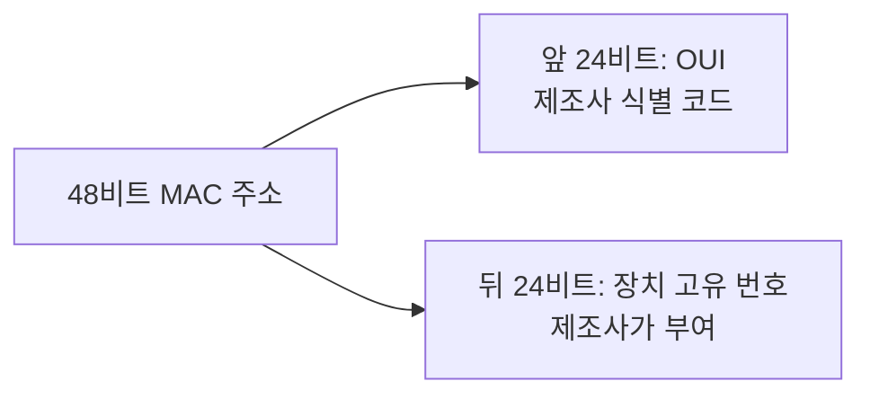
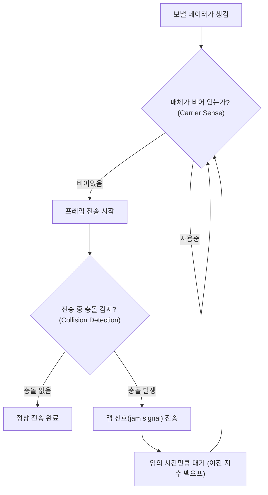

<Callout type="info">
  **이번 문서의 목표:** 이 파일을 다 읽으면 MAC 주소의 구조를 설명하고, Ethernet 프레임의 각 필드가 왜 필요한지 말할 수 있으며, CSMA/CD가 충돌을 감지하고 회복하는 절차를 순서대로 설명할 수 있다.
</Callout>

## 왜 물리 주소가 따로 필요한가

12편에서 배울 IP 주소는 **논리 주소**(logical address)다. 네트워크 구성이 바뀌면(다른 네트워크로 이사하면) IP 주소도 바뀔 수 있다. 하지만 데이터링크 계층은 "같은 링크(예: 같은 LAN 스위치에 물린 장치들)에 있는 장치를 구분하는" 더 근본적인 문제를 풀어야 한다. 이 역할을 맡는 것이 **MAC 주소**(Media Access Control address, 매체 접근 제어 주소)다.

> **쉽게 말하면:** IP 주소가 "우편번호와 도로명 주소"처럼 상황에 따라 바뀔 수 있는 주소라면, MAC 주소는 랜카드에 공장에서 새겨진 "제품 고유 번호"에 가깝다.

09편에서 데이터링크 계층의 책임으로 나열했던 **물리 주소 지정**과 **매체 접근 제어**가 이 편의 주제다. 이 두 가지를 실제로 구현한 대표 기술이 **Ethernet**(이더넷)이며, 오늘날 유선 LAN의 사실상 표준이다.

## MAC 주소의 구조

**MAC 주소**는 **48비트**(6바이트) 길이의 고정된 물리 주소다. 랜카드(NIC, Network Interface Card)를 만들 때 제조사가 하드웨어에 새겨 넣으며, 이론상 전 세계에서 유일한 값을 갖도록 설계되어 있다.

표기할 때는 8비트(1바이트)씩 16진수 두 자리로 나누고 콜론이나 하이픈으로 구분한다. 예를 들어 `00:1A:2B:3C:4D:5E` 또는 `00-1A-2B-3C-4D-5E`처럼 쓴다.

### OUI — 제조사를 가리키는 앞 24비트

MAC 주소의 앞쪽 24비트(3바이트)를 **OUI**(Organizationally Unique Identifier, 조직 고유 식별자)라 부른다. IEEE(전기전자기술자협회)가 전 세계 랜카드 제조사에 이 24비트 값을 하나씩 발급한다. 예를 들어 `00:1A:2B`라는 OUI를 특정 제조사가 등록해 두면, 그 제조사가 만드는 모든 랜카드는 MAC 주소 앞자리가 항상 `00:1A:2B`로 시작한다.

뒤쪽 24비트는 제조사가 자체적으로 관리하며, 자기가 만든 제품마다 겹치지 않게 순서대로 번호를 매긴다. 앞 24비트(제조사 식별)와 뒤 24비트(제품 고유 번호)를 조합하면 이론상 전 세계에 단 하나뿐인 48비트 값이 만들어진다.

### 첫 바이트의 특수 비트 두 개

MAC 주소의 맨 처음 바이트(8비트) 중 낮은 자리 2비트는 특별한 의미를 갖는다.

| 비트 이름 | 위치 | 값 0일 때 | 값 1일 때 |
|-----------|------|-----------|-----------|
| I/G 비트 (Individual/Group) | 첫 바이트의 최하위 비트 | 유니캐스트(unicast) 주소 — 특정 장치 1대를 가리킴 | 멀티캐스트(multicast) 주소 — 특정 그룹의 장치들을 가리킴 |
| U/L 비트 (Universal/Local) | 첫 바이트의 두 번째 최하위 비트 | 전역 관리 주소 — IEEE가 부여한 원래 주소 | 지역 관리 주소 — 관리자가 소프트웨어로 직접 바꾼 주소 |

### 브로드캐스트 주소

MAC 주소 48비트가 **전부 1**인 `FF:FF:FF:FF:FF:FF`는 특별히 예약된 **브로드캐스트 주소**(broadcast address)다. 이 주소로 보낸 프레임은 같은 링크에 연결된 **모든 장치**가 받는다. 11편에서 다룰 "브로드캐스트 도메인"이라는 개념이 바로 이 주소를 기준으로 정의된다.

## Ethernet 프레임의 구조

**Ethernet 프레임**(Ethernet frame)은 IEEE 802.3 표준이 정의하는 프레임 형식이다. 09편에서 배운 프레이밍의 실제 구현 사례로 볼 수 있다. 필드를 순서대로 정리하면 다음과 같다.

| 필드 | 크기 | 역할 |
|------|------|------|
| 프리앰블 (Preamble) | 7바이트 | `10101010`이 7번 반복되는 패턴. 수신 측 회로가 송신 측과 타이밍을 맞추도록(동기화) 돕는 준비 신호 |
| SFD (Start Frame Delimiter) | 1바이트 | `10101011`. "진짜 프레임이 지금부터 시작된다"는 신호로, 프리앰블과 실제 데이터를 구분 |
| 목적지 MAC 주소 | 6바이트 | 이 프레임을 받아야 할 장치의 MAC 주소 |
| 출발지 MAC 주소 | 6바이트 | 이 프레임을 보낸 장치의 MAC 주소 |
| 타입/길이 (Type/Length) | 2바이트 | 값이 1536(0x0600) 이상이면 상위 계층 프로토콜 종류(예: IPv4는 0x0800)를 나타내는 타입 필드, 그보다 작으면 데이터 길이를 나타내는 길이 필드로 해석 |
| 데이터 (Payload) | 46–1500바이트 | 상위 계층(주로 네트워크 계층)에서 내려온 실제 데이터. 46바이트보다 작으면 빈 값(padding)으로 채워 최소 크기를 맞춤 |
| FCS (Frame Check Sequence) | 4바이트 | 09편에서 계산한 CRC 검사값. 수신 측이 프레임 손상 여부를 확인하는 데 사용 |

**프리앰블과 SFD는 프레임 크기 계산에 포함하지 않는다.** 실제로 "Ethernet 프레임의 크기"라고 할 때는 목적지 MAC 주소부터 FCS까지를 기준으로 삼는다.

### 왜 최소 프레임 크기가 64바이트인가

목적지 MAC(6) + 출발지 MAC(6) + 타입(2) + 데이터(최소 46) + FCS(4) = **최소 64바이트**, 데이터가 최대일 때 목적지 MAC(6) + 출발지 MAC(6) + 타입(2) + 데이터(최대 1500) + FCS(4) = **최대 1518바이트**다. 이 최소·최대 크기 제한에는 명확한 이유가 있으며, 최소 크기의 이유는 바로 다음 절의 CSMA/CD 동작과 직결된다.

## CSMA/CD — 하나의 매체를 여럿이 나눠 쓰는 법

> **쉽게 말하면:** CSMA/CD는 "말하기 전에 남이 말하고 있는지 듣고, 동시에 말이 겹치면(충돌) 즉시 멈추고 잠시 후 다시 시도하는" 회의실 대화 규칙과 같다.

### 왜 필요한가

과거의 Ethernet은 여러 대의 장치가 **하나의 공유 케이블**(동축 케이블)이나 **하나의 허브**(hub)에 함께 연결되는 구조였다. 이런 환경에서는 두 대 이상의 장치가 동시에 신호를 보내면 신호가 서로 뒤섞여 **충돌**(collision)이 발생하고, 그 프레임들은 모두 깨져 버린다. 이 문제를 해결하기 위해 만든 매체 접근 제어(MAC) 규칙이 **CSMA/CD**(Carrier Sense Multiple Access with Collision Detection)다.

이름을 풀어 보면 다음과 같다.

- **CS**(Carrier Sense, 반송파 감지): 보내기 전에 매체(케이블)가 지금 비어 있는지 먼저 듣는다.
- **MA**(Multiple Access, 다중 접근): 여러 장치가 같은 매체를 공유해서 접근한다.
- **CD**(Collision Detection, 충돌 검출): 보내는 도중에도 계속 매체를 감시해서, 충돌이 발생하면 즉시 알아챈다.

### 동작 절차

1. **반송파 감지(Carrier Sense):** 보내기 전에 케이블에 신호가 흐르고 있는지 확인한다. 신호가 있으면(누군가 이미 사용 중이면) 비워질 때까지 기다린다.
2. **전송 시작:** 매체가 비어 있으면 프레임 전송을 시작한다.
3. **충돌 검출(Collision Detection):** 전송하는 동안에도 계속 케이블의 신호를 감시한다. 만약 자신이 보낸 신호와 실제 케이블에 흐르는 신호가 다르면, 다른 장치와 동시에 보내서 충돌이 났다고 판단한다.
4. **잼 신호(jam signal):** 충돌을 감지한 장치는 즉시 전송을 멈추고, 짧은 잼 신호를 내보내 "지금 충돌이 났다"는 사실을 같은 매체의 모든 장치에게 알린다.
5. **백오프(backoff):** 충돌한 장치들은 곧바로 재전송을 시도하지 않는다. 다시 시도하면 또 충돌할 가능성이 높기 때문이다. 대신 **이진 지수 백오프**(binary exponential backoff) 알고리즘에 따라 무작위 시간만큼 기다린 뒤 처음부터 다시 시도한다. 충돌이 반복될 때마다 기다리는 시간의 범위가 지수적으로 늘어나, 여러 장치가 계속 같은 타이밍에 부딪히는 상황을 피한다.

### 최소 프레임 크기와 충돌 검출의 관계

CSMA/CD가 충돌을 제대로 검출하려면 한 가지 조건이 필요하다. **송신자가 프레임 전송을 끝내기 전에, 그 프레임으로 인한 충돌 신호가 되돌아올 수 있어야 한다.** 만약 프레임이 너무 짧아서 전송이 이미 끝난 뒤에 충돌 신호가 돌아온다면, 송신자는 이미 "전송 성공"이라 착각하고 다음 일을 시작한 뒤이므로 충돌 사실을 영영 알 수 없다.

이 조건을 만족시키려면 **프레임 전송 시간이 최소한 신호의 왕복 전파 지연 시간(round-trip propagation delay)보다 길어야 한다.** 이 최소 전송 시간을 **슬롯 타임**(slot time)이라 부르며, 표준 Ethernet(10Mbps)에서는 이 값이 51.2마이크로초로 정해져 있고, 여기에 맞춰 **최소 프레임 크기가 64바이트**로 정해졌다. 만약 보낼 데이터가 이보다 작으면, 앞서 표에서 본 것처럼 46바이트를 채우기 위해 의미 없는 값(패딩)을 덧붙여서라도 최소 크기를 맞춘다.

> **쉽게 말하면:** 최소 프레임 크기는 "내가 말을 끝내기 전에 상대와 부딪혔다는 사실을 반드시 알 수 있을 만큼은 길게 말하라"는 규칙에서 나온 숫자다.

**자주 틀리는 점:** CSMA/CD는 오늘날의 스위치 기반 Ethernet(11편에서 다룰 전이중 방식)에서는 사실상 동작하지 않는다. CSMA/CD는 여러 장치가 매체를 **공유**하는 반이중(half-duplex) 환경, 즉 허브나 옛 동축 케이블 구조에서만 의미가 있다. 스위치의 각 포트가 장치와 1:1로 연결되고 전이중(full-duplex)으로 동작하면 애초에 충돌이 발생할 수 없으므로 CSMA/CD 절차 자체가 필요 없어진다. 이 차이는 11편에서 다시 다룬다.

## Ethernet이 LAN에서 담당하는 역할

Ethernet은 물리 계층의 매체·신호 규격(케이블 종류, 커넥터, 전송 속도)과 데이터링크 계층의 프레임 형식·MAC 주소·매체 접근 제어를 함께 정의하는 **IEEE 802.3 표준 계열**이다. 시대에 따라 전송 속도가 계속 향상되어 왔다.

| 표준 이름 | 속도 | 매체 | 비고 |
|-----------|------|------|------|
| 10BASE-T | 10Mbps | UTP 케이블 | 초창기 트위스트 페어 Ethernet |
| 100BASE-TX | 100Mbps | UTP 케이블 | 흔히 "패스트 이더넷"이라 부름 |
| 1000BASE-T | 1000Mbps(1Gbps) | UTP 케이블 | "기가비트 이더넷" |
| 10GBASE-T | 10Gbps | UTP/광케이블 | 데이터센터 등 고속 환경 |

속도가 올라가는 동안에도 **MAC 주소 체계와 기본 프레임 형식은 그대로 유지**되었다는 점이 중요하다. 이는 시험에서 "Ethernet 표준이 바뀌어도 변하지 않는 것"을 묻는 문제로 자주 나온다. 물리 계층의 매체와 신호 방식은 세대마다 달라졌지만, 데이터링크 계층의 프레임 구조와 MAC 주소 방식은 하위 호환을 유지하며 이어져 왔다.

결국 Ethernet은 LAN(근거리 통신망) 안에서 **"장치를 어떻게 구분하고(MAC 주소), 프레임을 어떻게 묶어서 보내고(프레임 구조), 공유 매체를 어떻게 나눠 쓰는지(CSMA/CD)"** 라는 데이터링크 계층의 세 가지 핵심 질문에 대한 실무 표준 답안이다. 11편에서는 이 Ethernet 프레임이 스위치를 거치며 어떻게 전달되는지, 그리고 스위칭이 CSMA/CD의 필요성 자체를 어떻게 줄여 왔는지를 이어서 다룬다.

## 핵심 정리

- MAC 주소는 48비트 물리 주소로, 앞 24비트는 제조사를 식별하는 OUI, 뒤 24비트는 제조사가 매기는 장치 고유 번호다.
- 첫 바이트의 I/G 비트는 유니캐스트/멀티캐스트를, U/L 비트는 전역/지역 관리 주소를 구분한다. 48비트 전부가 1인 값(`FF:FF:FF:FF:FF:FF`)은 브로드캐스트 주소다.
- Ethernet 프레임은 목적지 MAC, 출발지 MAC, 타입/길이, 데이터, FCS(CRC)로 구성되며 최소 64바이트, 최대 1518바이트다.
- 최소 프레임 크기 64바이트는 CSMA/CD가 충돌을 확실히 검출하기 위해 필요한 슬롯 타임(왕복 전파 지연)에서 유도된 값이다.
- CSMA/CD는 반송파 감지 → 전송 → 충돌 검출 → 잼 신호 → 이진 지수 백오프의 순서로 동작하며, 공유 매체를 쓰는 반이중 환경에서만 의미가 있고 전이중 스위치 환경에서는 사실상 필요 없다.
- Ethernet은 세대마다 전송 속도가 크게 향상되어 왔지만 MAC 주소 체계와 기본 프레임 형식은 그대로 유지되어 왔다.

## 마무리 복습

<Quiz
  questionNumber={1}
  question="48비트 MAC 주소에서 앞쪽 24비트가 나타내는 것으로 옳은 것은?"
  options={['해당 장치가 속한 네트워크의 IP 대역', '제조사를 식별하는 OUI', '프레임의 전송 속도', '수신 측 버퍼 크기']}
  correctAnswer={2}
  explanation="MAC 주소의 앞 24비트는 IEEE가 제조사에 발급하는 OUI(Organizationally Unique Identifier)이며, 뒤 24비트는 제조사가 자체적으로 부여하는 장치 고유 번호다."
  optionExplanations={['IP 대역은 네트워크 계층의 논리 주소 개념으로 MAC 주소와는 별개다', '정답 — OUI는 제조사를 가리키는 앞쪽 24비트다', '전송 속도는 물리 계층 표준(예: 10BASE-T)이 정하는 값으로 MAC 주소 구조와 무관하다', '버퍼 크기는 장치의 하드웨어 사양이며 MAC 주소 구조와 무관하다']}
/>

<Quiz
  questionNumber={2}
  question="MAC 주소 FF:FF:FF:FF:FF:FF가 갖는 의미로 옳은 것은?"
  options={['가장 먼저 등록된 제조사의 주소이다', '해당 링크의 모든 장치에게 전달되는 브로드캐스트 주소이다', '오류가 발생했음을 나타내는 예약 값이다', '라우터 전용으로 예약된 주소이다']}
  correctAnswer={2}
  explanation="48비트가 모두 1인 MAC 주소는 브로드캐스트 주소로 예약되어 있으며, 이 주소로 보낸 프레임은 같은 링크의 모든 장치가 수신한다."
  optionExplanations={['제조사 등록 순서와 이 값은 관련이 없다', '정답 — 모든 비트가 1인 값은 브로드캐스트 전용으로 예약되어 있다', '오류 표시가 아니라 정상적인 예약 주소다', '라우터 전용이 아니라 링크상의 모든 장치가 수신하도록 정의된 값이다']}
/>

<Quiz
  questionNumber={3}
  question="Ethernet 프레임에서 데이터 필드가 46바이트보다 작을 때 처리 방법으로 옳은 것은?"
  options={['프레임 전송을 취소한다', '부족한 만큼 패딩(padding)을 채워 최소 크기를 맞춘다', 'FCS 필드를 생략한다', '목적지 MAC 주소를 반복해서 채운다']}
  correctAnswer={2}
  explanation="Ethernet은 최소 프레임 크기(64바이트)를 지켜야 하므로, 실제 데이터가 46바이트보다 작으면 의미 없는 값으로 채워 넣는 패딩을 추가해 크기를 맞춘다."
  optionExplanations={['최소 크기를 채우면 정상 전송이 가능하므로 취소할 이유가 없다', '정답 — 패딩으로 최소 크기 64바이트를 맞춘다', 'FCS는 오류 검출을 위해 모든 프레임에 반드시 포함되어야 한다', '목적지 MAC 주소는 고정된 6바이트 필드이며 반복해서 채우는 대상이 아니다']}
/>

<Quiz
  questionNumber={4}
  question="Ethernet의 최소 프레임 크기가 64바이트로 정해진 이유와 가장 직접적으로 관련된 개념은?"
  options={['OUI 비트 수', 'CSMA/CD의 충돌 검출을 위한 슬롯 타임', 'FCS 필드의 CRC 다항식 차수', 'IP 헤더의 최소 길이']}
  correctAnswer={2}
  explanation="송신자가 전송을 끝내기 전에 충돌 신호를 되받을 수 있으려면 전송 시간이 왕복 전파 지연(슬롯 타임)보다 길어야 하며, 이 조건에서 최소 프레임 크기 64바이트가 유도되었다."
  optionExplanations={['OUI 비트 수는 제조사 식별과 관련된 값으로 프레임 최소 크기와 무관하다', '정답 — 슬롯 타임 조건에서 최소 프레임 크기가 유도된다', 'CRC 다항식 차수는 FCS 필드의 크기(4바이트)와 관련되지만 최소 프레임 전체 크기의 근거는 아니다', 'IP 헤더는 네트워크 계층의 개념으로 Ethernet 프레임 최소 크기와 직접 관련이 없다']}
/>

<Quiz
  questionNumber={5}
  question="CSMA/CD의 동작 순서를 올바르게 나열한 것은?"
  options={['충돌 검출 → 반송파 감지 → 전송 → 백오프', '반송파 감지 → 전송 → 충돌 검출 → 잼 신호 → 백오프', '전송 → 반송파 감지 → 백오프 → 잼 신호', '백오프 → 반송파 감지 → 전송 → 충돌 검출']}
  correctAnswer={2}
  explanation="CSMA/CD는 먼저 매체가 비어 있는지 반송파 감지로 확인하고, 비어 있으면 전송을 시작하며, 전송 중 계속 충돌을 감시하다가 충돌이 발생하면 잼 신호를 보낸 뒤 백오프 시간만큼 대기한 후 다시 처음부터 시도한다."
  optionExplanations={['반송파 감지 없이 충돌부터 검출할 수는 없으며 순서가 뒤바뀌었다', '정답 — 감지, 전송, 검출, 잼 신호, 백오프의 순서다', '반송파 감지를 전송 이후에 하는 것은 절차의 목적에 어긋난다', '백오프는 충돌 이후에 하는 절차이므로 맨 앞에 올 수 없다']}
/>

<Quiz
  questionNumber={6}
  question="CSMA/CD에서 충돌이 반복될수록 이진 지수 백오프가 하는 일로 옳은 것은?"
  options={['대기 시간을 항상 동일하게 유지한다', '대기 시간 범위를 지수적으로 늘려 충돌 재발 가능성을 낮춘다', '충돌한 장치의 전송을 영구적으로 차단한다', '매체 감지를 생략하고 즉시 재전송한다']}
  correctAnswer={2}
  explanation="이진 지수 백오프는 충돌이 반복될 때마다 무작위 대기 시간의 범위를 지수적으로 넓혀서, 같은 타이밍에 여러 장치가 계속 부딪히는 상황을 줄인다."
  optionExplanations={['동일하게 유지하면 같은 장치들이 계속 같은 타이밍에 부딪힐 위험이 크다', '정답 — 지수적으로 범위를 넓혀 충돌 재발 확률을 낮춘다', '영구 차단이 아니라 일시적인 대기일 뿐이다', '백오프 이후에도 다시 반송파 감지부터 절차를 거쳐야 한다']}
/>

<Quiz
  questionNumber={7}
  question="오늘날 스위치 기반의 전이중(full-duplex) Ethernet 환경에서 CSMA/CD에 대한 설명으로 옳은 것은?"
  options={['여전히 충돌 검출이 활발하게 일어난다', '각 포트가 장치와 1:1로 연결되어 충돌 자체가 발생하지 않아 사실상 필요 없어진다', 'CSMA/CD 없이는 스위치가 동작할 수 없다', '전이중 환경일수록 백오프 시간이 더 길어진다']}
  correctAnswer={2}
  explanation="스위치의 각 포트가 장치 하나와 전이중으로 직접 연결되면 매체를 공유할 필요가 없어 애초에 충돌이 발생하지 않는다. 따라서 CSMA/CD 절차 자체가 사실상 의미를 잃는다."
  optionExplanations={['전이중 환경에서는 충돌이 발생하지 않으므로 충돌 검출이 활발할 수 없다', '정답 — 공유 매체가 아니므로 충돌 자체가 없어 CSMA/CD가 필요 없어진다', '스위치는 CSMA/CD 없이도 정상적으로 동작한다', '충돌이 없으므로 백오프 자체가 발생하지 않는다']}
/>

<Quiz
  questionNumber={8}
  question="10BASE-T에서 10GBASE-T까지 Ethernet 표준이 발전하는 동안 유지되어 온 것으로 옳은 것은?"
  options={['전송 매체의 종류', '전송 속도', 'MAC 주소 체계와 기본 프레임 형식', '슬롯 타임의 절대값']}
  correctAnswer={3}
  explanation="Ethernet 세대가 바뀌면서 전송 속도와 매체는 크게 달라졌지만, MAC 주소 체계와 기본 프레임 형식은 하위 호환을 유지하며 그대로 이어져 왔다."
  optionExplanations={['전송 매체는 세대마다 달라졌다(동축 케이블에서 UTP, 광케이블 등으로 변화)', '전송 속도는 세대마다 크게 향상되어 왔다', '정답 — MAC 주소 체계와 프레임 형식은 세대를 넘어 유지되어 왔다', '슬롯 타임은 전송 속도가 달라지면 함께 조정되는 값이다']}
/>

## 참고 자료

- [IEEE 802.3 표준 개요 자료](https://standards.ieee.org/)
- [국가평생교육진흥원 독학학위제 - 과목별 평가영역](https://bdes.nile.or.kr/nile/study/nStudy2_1.do)
