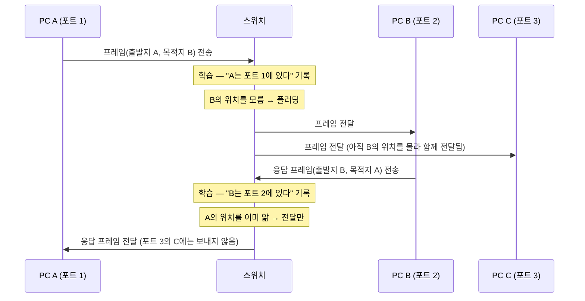
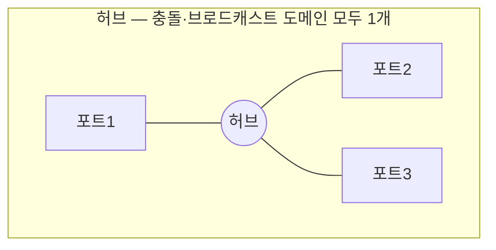
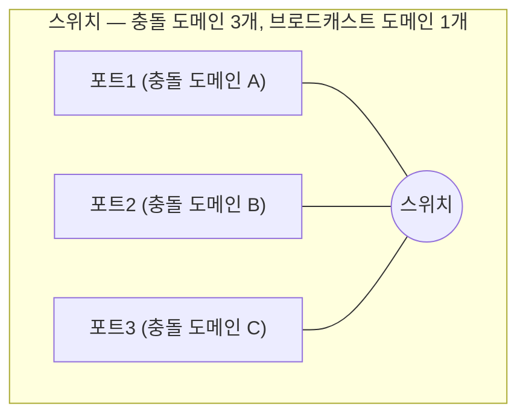
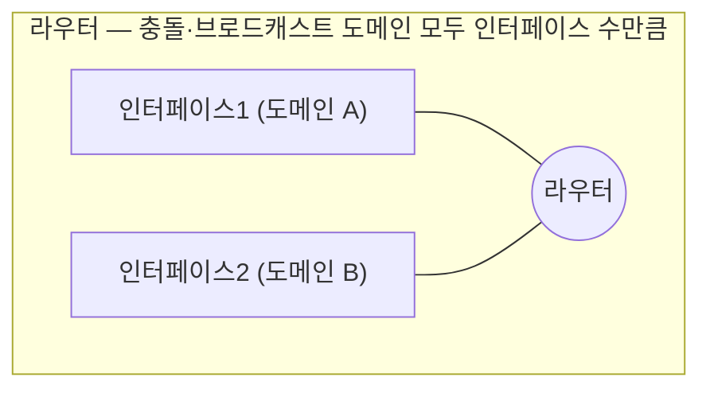

<Callout type="info">
  **이번 문서의 목표:** 이 파일을 다 읽으면 스위치가 MAC 주소 테이블을 학습하는 과정을 순서대로 설명할 수 있고, 허브·스위치·라우터가 충돌 도메인과 브로드캐스트 도메인을 어떻게 다르게 나누는지 비교할 수 있으며, VLAN이 왜 필요한지 시험에 나오는 수준으로 설명할 수 있다.
</Callout>

## 허브에서 스위치로 — 무엇이 달라졌는가

10편에서 본 것처럼, 과거의 공유 매체 Ethernet에서는 여러 장치가 하나의 케이블이나 **허브**(hub)를 통해 연결되었다. 허브는 데이터링크 계층조차 인식하지 못하는 순수한 물리 계층 장치다. 한 포트로 들어온 전기 신호를 **다른 모든 포트로 그대로 복사해서 흘려보낼 뿐**, 그 신호가 프레임인지 목적지가 어디인지는 전혀 판단하지 않는다.

이 방식에는 두 가지 문제가 있다.

1. 모든 장치가 하나의 매체를 공유하므로, 두 장치가 동시에 보내면 항상 충돌 가능성이 있다(10편의 CSMA/CD가 필요했던 이유).
2. 목적지가 아닌 장치에게도 신호가 전달되므로 대역폭이 낭비된다.

**스위치**(switch)는 이 문제를 해결하기 위해 등장한 **데이터링크 계층 장치**다. 스위치는 프레임의 목적지 MAC 주소를 실제로 읽고, **그 목적지가 연결된 포트로만** 프레임을 내보낸다. 이 능력의 핵심이 다음 절에서 다룰 **MAC 주소 학습 기능**이다.

> **쉽게 말하면:** 허브는 모든 우편물을 건물 전체에 방송하는 관리인이고, 스위치는 각 방의 호실 번호(MAC 주소)를 외워 두었다가 그 방에만 배달하는 집배원이다.

## 스위치의 학습 기능

> **쉽게 말하면:** 스위치는 프레임이 지나갈 때마다 "이 MAC 주소는 이 포트에서 왔더라"를 몰래 적어 두고, 나중에 그 주소로 가는 프레임이 오면 적어 둔 포트로만 보낸다.

스위치는 내부에 **MAC 주소 테이블**(MAC address table, 또는 CAM 테이블)이라는 표를 유지한다. 이 표는 "어떤 MAC 주소가 어느 포트 뒤에 있는지"를 기록한다. 스위치가 이 표를 만들고 사용하는 과정은 네 단계로 나뉜다.

### 1단계 — 학습 (learning)

프레임이 어느 포트로 들어오면, 스위치는 그 프레임의 **출발지 MAC 주소**를 확인하고 "이 MAC 주소는 이 포트 뒤에 있다"고 테이블에 기록한다. 프레임이 어디로 가는지가 아니라 **어디서 왔는지**를 보고 배우는 것이 핵심이다.

### 2단계 — 플러딩 (flooding)

프레임의 **목적지 MAC 주소**가 아직 테이블에 없으면(그 장치가 보낸 프레임을 한 번도 받아 본 적이 없으면), 스위치는 그 프레임을 **들어온 포트를 제외한 모든 포트**로 내보낸다. 이는 허브의 동작과 비슷해 보이지만, 목적지를 모를 때만 임시로 일어나는 동작이라는 점이 다르다.

### 3단계 — 전달 (forwarding)

목적지 MAC 주소가 테이블에 이미 있으면, 스위치는 그 주소가 연결된 **포트 하나로만** 프레임을 내보낸다. 이것이 스위치가 대역폭을 절약하는 핵심 동작이다.

### 4단계 — 필터링 (filtering)

목적지 MAC 주소가 **프레임이 들어온 포트와 같은 포트**에 있는 것으로 확인되면, 스위치는 그 프레임을 아예 다른 포트로 내보내지 않고 버린다. 어차피 목적지가 이미 같은 케이블 구간에 있어 프레임을 받았을 것이기 때문이다.

이렇게 대화가 오갈수록 스위치는 점점 더 많은 MAC 주소의 위치를 학습하고, 플러딩은 줄어들고 전달만 일어나는 비율이 늘어난다. 다만 테이블의 각 항목에는 **에이징 타임**(aging time, 보통 수 분)이라는 유효 시간이 있어서, 일정 시간 동안 해당 MAC 주소로부터 프레임이 오지 않으면 테이블에서 삭제된다. 장치가 다른 포트로 옮겨가도 스위치가 낡은 정보를 계속 쓰지 않게 하기 위한 장치다.

## 브리지와 스위치 비교

**브리지**(bridge)는 스위치보다 먼저 등장한 장치로, 스위치와 똑같이 MAC 주소를 학습하고 프레임을 전달하는 데이터링크 계층 장치다. 사실 스위치는 "브리지의 기능을 하드웨어로 아주 많은 포트에 대해 빠르게 구현한 장치"라고 볼 수 있다. 시험에서는 이 둘의 차이를 정확히 구분하는 문제가 자주 나온다.

| 구분 | 브리지 | 스위치 |
|------|--------|--------|
| 포트 수 | 보통 2개(가끔 소수) | 수십 개 이상이 일반적 |
| 프레임 처리 방식 | 소프트웨어 기반 처리 | 전용 하드웨어(ASIC, 주문형 반도체) 기반 처리 |
| 처리 속도 | 상대적으로 느림 | 매우 빠름 |
| 포트별 동시 처리 | 한 번에 하나의 프레임 경로만 처리하는 경우가 많음 | 여러 포트 쌍이 동시에 각자 통신 가능 |
| 현재 사용 현황 | 사실상 스위치로 대체되어 단독 장비로는 거의 쓰이지 않음 | LAN의 사실상 표준 장비 |

**핵심 결론:** 브리지와 스위치는 **개념적으로 동일한 일**(MAC 주소 학습, 플러딩, 전달, 필터링)을 한다. 차이는 "몇 개의 포트를, 얼마나 빠르게, 소프트웨어로 처리하느냐 하드웨어로 처리하느냐"에 있다.

## 충돌 도메인과 브로드캐스트 도메인

이 두 개념은 컴퓨터네트워크 시험에서 매우 자주 나오는 비교 지점이다. 정의부터 정확히 짚는다.

- **충돌 도메인**(collision domain): 그 안에서 두 장치가 동시에 신호를 보내면 충돌이 발생할 수 있는 범위. 10편에서 다룬 CSMA/CD가 감시해야 하는 범위와 같다.
- **브로드캐스트 도메인**(broadcast domain): 브로드캐스트 프레임(목적지 MAC 주소가 `FF:FF:FF:FF:FF:FF`)이 도달하는 범위.

> **쉽게 말하면:** 충돌 도메인은 "동시에 말하면 부딪히는 방"이고, 브로드캐스트 도메인은 "누군가 확성기로 외치면(브로드캐스트) 들리는 범위"다.

허브, 스위치, 라우터가 이 두 도메인을 어떻게 다르게 나누는지 표로 정리한다.

| 장치 | 계층 | 충돌 도메인 | 브로드캐스트 도메인 |
|------|------|-------------|----------------------|
| 허브 | 물리 계층 | 허브에 연결된 모든 포트가 **하나의** 충돌 도메인 | 허브에 연결된 모든 포트가 **하나의** 브로드캐스트 도메인 |
| 스위치 | 데이터링크 계층 | **포트마다** 별도의 충돌 도메인(포트 수만큼 분리) | 스위치에 연결된 모든 포트가 **하나의** 브로드캐스트 도메인(VLAN을 나누지 않는 한) |
| 라우터 | 네트워크 계층 | **포트마다** 별도의 충돌 도메인 | **포트마다** 별도의 브로드캐스트 도메인(인터페이스 수만큼 분리) |

**허브**는 모든 포트가 하나의 전기적 매체를 공유하는 것과 같으므로, 충돌 도메인도 브로드캐스트 도메인도 전혀 나누지 못한다. 포트가 몇 개든 허브 전체가 충돌 도메인 1개, 브로드캐스트 도메인 1개다.

**스위치**는 각 포트를 독립된 케이블 구간으로 다루므로 포트마다 충돌이 격리된다(포트 수 = 충돌 도메인 수). 하지만 브로드캐스트 프레임만큼은 원리적으로 "목적지를 모르는 프레임과 똑같이" 모든 포트로 내보내야 하므로, VLAN을 나누지 않은 기본 상태의 스위치는 여전히 브로드캐스트 도메인을 나누지 못한다. 즉 **스위치는 충돌 도메인은 나누지만 브로드캐스트 도메인은 나누지 못한다**는 문장이 시험에서 그대로 자주 출제된다.

**라우터**는 네트워크 계층 장치로서, 브로드캐스트 프레임을 다른 인터페이스로 절대 전달하지 않는다(라우터는 브로드캐스트의 경계 역할을 한다). 따라서 라우터의 인터페이스 하나하나가 별도의 충돌 도메인이면서 동시에 별도의 브로드캐스트 도메인이 된다.

**자주 틀리는 점:** "스위치를 많이 쓰면 브로드캐스트 트래픽도 자동으로 줄어든다"고 착각하는 경우가 많다. 스위치는 충돌만 줄일 뿐 브로드캐스트 도메인은 그대로 하나로 유지된다. 브로드캐스트 도메인을 실제로 나누려면 라우터를 쓰거나, 다음 절의 VLAN처럼 스위치 내부를 논리적으로 분할해야 한다.

## VLAN — 스위치 하나를 논리적으로 나누기

> **쉽게 말하면:** VLAN은 스위치 한 대를 소프트웨어 설정만으로 여러 대의 독립된 스위치처럼 동작하게 만드는 기술이다.

앞서 확인했듯 스위치 하나는 기본적으로 브로드캐스트 도메인 하나다. 회사에 부서가 여럿이고 부서별로 트래픽과 보안을 분리하고 싶다면, 부서마다 물리적으로 스위치를 따로 두는 방법도 있지만 비용과 유연성 면에서 비효율적이다.

**VLAN**(Virtual Local Area Network, 가상 근거리 통신망)은 이 문제를 소프트웨어로 해결한다. 스위치의 포트를 여러 그룹으로 나누어, **같은 VLAN에 속한 포트끼리만** 하나의 브로드캐스트 도메인을 이루게 한다. 물리적으로는 스위치 한 대에 꽂혀 있어도, VLAN이 다르면 서로 브로드캐스트를 주고받지 않는 완전히 다른 네트워크처럼 동작한다.

VLAN이 만드는 결과를 정리하면 다음과 같다.

| 항목 | VLAN 적용 전 | VLAN 적용 후 |
|------|-------------|-------------|
| 브로드캐스트 도메인 | 스위치 전체가 1개 | VLAN 개수만큼 분리 |
| 서로 다른 VLAN 간 통신 | (VLAN 개념이 없으므로 해당 없음) | 3계층 장비(라우터 또는 L3 스위치)를 거쳐야 가능 |
| 부서 이동 시 필요한 작업 | 케이블 재배선 | 스위치 설정에서 포트의 VLAN 번호만 변경 |

VLAN이 다른 두 장치는 같은 스위치에 물려 있어도 **직접 통신할 수 없다.** 통신하려면 라우터나 L3 스위치(네트워크 계층 기능을 겸비한 스위치)를 거쳐야 하며, 이를 **VLAN 간 라우팅**(inter-VLAN routing)이라 부른다.

시험에서 VLAN을 물을 때 가장 자주 확인하는 두 가지 문장은 다음과 같다.

1. **"VLAN의 본질적인 효과는 브로드캐스트 도메인을 논리적으로 분리하는 것이다."** (충돌 도메인 분리는 스위치가 원래 하는 일이며 VLAN의 고유 효과가 아니다.)
2. **"VLAN이 다르면 라우터 없이는 통신할 수 없다."** (VLAN은 논리적 분리이지 물리적 연결의 유무가 아니다.)

이 두 문장을 정확히 구분해서 이해해 두면, VLAN을 "포트를 나누는 신기한 기능" 정도로만 알고 있을 때보다 서술형·비교형 문제에 훨씬 안정적으로 대응할 수 있다.

## 핵심 정리

- 스위치는 프레임의 출발지 MAC 주소로 위치를 학습(learning)하고, 목적지를 모르면 플러딩(flooding), 알면 전달(forwarding), 같은 포트면 필터링(filtering)한다.
- 브리지와 스위치는 개념적으로 같은 동작을 하지만, 스위치는 하드웨어(ASIC) 기반으로 훨씬 많은 포트를 훨씬 빠르게 처리한다.
- 허브는 충돌 도메인·브로드캐스트 도메인을 모두 나누지 못하고, 스위치는 충돌 도메인만 포트 수만큼 나누며, 라우터는 두 도메인을 모두 인터페이스 수만큼 나눈다.
- "스위치는 충돌 도메인은 나누지만 브로드캐스트 도메인은 나누지 못한다"는 시험에 자주 나오는 핵심 문장이다.
- VLAN은 스위치 하나를 논리적으로 나누어 각 VLAN을 독립된 브로드캐스트 도메인으로 만드는 기술이며, VLAN이 다르면 라우터(또는 L3 스위치)를 거쳐야만 통신할 수 있다.

## 마무리 복습

<Quiz
  questionNumber={1}
  question="스위치가 MAC 주소 테이블을 만들 때 기준으로 삼는 필드는?"
  options={['프레임의 목적지 MAC 주소', '프레임의 출발지 MAC 주소', '프레임의 FCS 값', '프레임이 도착한 시각']}
  correctAnswer={2}
  explanation="스위치는 프레임이 들어온 포트와 그 프레임의 출발지 MAC 주소를 연결지어 테이블에 기록한다. 즉 어디로 가는지가 아니라 어디서 왔는지를 보고 학습한다."
  optionExplanations={['목적지 MAC 주소는 전달 여부를 판단하는 기준이지 학습의 기준이 아니다', '정답 — 출발지 MAC 주소로 그 장치의 위치(포트)를 학습한다', 'FCS는 오류 검출용 필드로 학습과 무관하다', '도착 시각은 에이징 타임 계산에는 쓰이지만 학습의 기준 필드는 아니다']}
/>

<Quiz
  questionNumber={2}
  question="스위치가 목적지 MAC 주소를 테이블에서 찾지 못했을 때의 동작으로 옳은 것은?"
  options={['해당 프레임을 폐기한다', '들어온 포트를 제외한 모든 포트로 플러딩한다', '출발지로 오류 메시지를 되돌려 보낸다', '가장 최근에 학습한 포트로만 전달한다']}
  correctAnswer={2}
  explanation="목적지 위치를 모르는 프레임은 어디로 보내야 할지 알 수 없으므로, 들어온 포트를 제외한 모든 포트로 플러딩하여 목적지 장치가 반드시 받을 수 있게 한다."
  optionExplanations={['폐기하면 목적지 장치에 프레임이 전혀 전달되지 않는다', '정답 — 플러딩으로 모든 포트에 내보내 목적지가 반드시 받게 한다', '스위치는 이런 상황에서 오류 메시지를 돌려보내지 않는다', '가장 최근 학습 포트는 목적지와 무관할 수 있다']}
/>

<Quiz
  questionNumber={3}
  question="브리지와 스위치의 차이를 설명한 것으로 옳은 것은?"
  options={['브리지는 네트워크 계층 장비이고 스위치는 데이터링크 계층 장비다', '브리지와 스위치는 개념적으로 같은 동작을 하지만 스위치가 하드웨어 기반으로 더 많은 포트를 더 빠르게 처리한다', '스위치는 MAC 주소를 학습하지 않지만 브리지는 학습한다', '브리지는 충돌 도메인을 나누지 못하지만 스위치는 나눈다']}
  correctAnswer={2}
  explanation="브리지와 스위치는 둘 다 데이터링크 계층에서 MAC 주소를 학습하고 플러딩·전달·필터링을 수행하는 동일한 원리로 동작한다. 차이는 포트 수와 처리 방식(소프트웨어 대 하드웨어 ASIC)에 있다."
  optionExplanations={['브리지도 스위치와 마찬가지로 데이터링크 계층 장비다', '정답 — 원리는 같고 포트 수와 처리 속도, 구현 방식이 다르다', '둘 다 MAC 주소를 학습하는 것은 동일하다', '브리지도 포트 단위로 충돌 도메인을 나눈다']}
/>

<Quiz
  questionNumber={4}
  question="24개 포트에 24대의 PC가 연결된 허브 한 대의 충돌 도메인과 브로드캐스트 도메인 개수로 옳은 것은?"
  options={['충돌 도메인 24개, 브로드캐스트 도메인 24개', '충돌 도메인 1개, 브로드캐스트 도메인 24개', '충돌 도메인 1개, 브로드캐스트 도메인 1개', '충돌 도메인 24개, 브로드캐스트 도메인 1개']}
  correctAnswer={3}
  explanation="허브는 물리 계층 장치로서 모든 포트가 하나의 전기적 매체를 공유한다. 따라서 포트 수와 무관하게 충돌 도메인도 브로드캐스트 도메인도 각각 1개뿐이다."
  optionExplanations={['허브는 포트별로 도메인을 나누는 기능이 전혀 없다', '충돌 도메인이 24개라는 부분이 틀렸다 — 허브는 포트별 분리를 하지 못한다', '정답 — 허브는 두 도메인을 모두 나누지 못해 각각 1개로 유지된다', '허브에서는 브로드캐스트 도메인도 1개로 유지된다']}
/>

<Quiz
  questionNumber={5}
  question="8포트 스위치 한 대(VLAN 미설정)에 8대의 PC가 연결되어 있을 때 충돌 도메인과 브로드캐스트 도메인 개수로 옳은 것은?"
  options={['충돌 도메인 8개, 브로드캐스트 도메인 8개', '충돌 도메인 1개, 브로드캐스트 도메인 8개', '충돌 도메인 8개, 브로드캐스트 도메인 1개', '충돌 도메인 1개, 브로드캐스트 도메인 1개']}
  correctAnswer={3}
  explanation="스위치는 포트마다 충돌 도메인을 분리하므로 8개의 충돌 도메인이 생기지만, VLAN을 나누지 않았다면 브로드캐스트 도메인은 여전히 스위치 전체가 1개로 유지된다."
  optionExplanations={['브로드캐스트 도메인이 8개라는 부분이 틀렸다 — VLAN 없이는 여전히 1개다', '충돌 도메인이 1개라는 부분이 틀렸다 — 스위치는 포트마다 충돌 도메인을 분리한다', '정답 — 충돌 도메인은 포트 수만큼, 브로드캐스트 도메인은 여전히 1개다', '충돌 도메인이 1개라는 부분이 틀렸다']}
/>

<Quiz
  questionNumber={6}
  question="라우터가 스위치와 달리 브로드캐스트 도메인을 인터페이스 수만큼 나눌 수 있는 이유로 가장 알맞은 것은?"
  options={['라우터의 처리 속도가 스위치보다 빠르기 때문이다', '라우터는 네트워크 계층 장치로서 브로드캐스트 프레임을 다른 인터페이스로 전달하지 않기 때문이다', '라우터는 MAC 주소 테이블을 사용하지 않기 때문이다', '라우터의 포트 수가 스위치보다 적기 때문이다']}
  correctAnswer={2}
  explanation="라우터는 브로드캐스트 프레임의 경계 역할을 한다. 한 인터페이스로 들어온 브로드캐스트를 다른 인터페이스로 넘기지 않으므로, 인터페이스마다 독립된 브로드캐스트 도메인이 만들어진다."
  optionExplanations={['처리 속도는 도메인 분리 여부와 직접적인 관련이 없다', '정답 — 브로드캐스트를 인터페이스 경계에서 차단하기 때문이다', 'MAC 주소 사용 여부는 이 성질의 직접적인 이유가 아니다', '포트 수의 많고 적음은 도메인 분리의 근본 이유가 아니다']}
/>

<Quiz
  questionNumber={7}
  question="VLAN을 사용하는 가장 본질적인 효과로 옳은 것은?"
  options={['스위치 포트마다 충돌 도메인을 분리한다', '하나의 스위치 안에서 브로드캐스트 도메인을 논리적으로 여러 개로 분리한다', '케이블의 최대 전송 거리를 늘린다', 'CSMA/CD 없이도 전이중 통신이 가능하게 한다']}
  correctAnswer={2}
  explanation="충돌 도메인 분리는 스위치가 원래부터 수행하는 기능이다. VLAN의 고유한 효과는 하나의 스위치를 논리적으로 나누어 서로 다른 독립된 브로드캐스트 도메인을 만드는 것이다."
  optionExplanations={['충돌 도메인 분리는 VLAN 없이도 스위치가 기본으로 수행하는 기능이다', '정답 — 논리적 분할로 독립된 브로드캐스트 도메인을 만드는 것이 핵심이다', 'VLAN은 물리적 전송 거리와는 무관한 논리적 개념이다', '전이중 통신 여부는 포트의 물리적 연결 방식에 따른 것이지 VLAN과 무관하다']}
/>

<Quiz
  questionNumber={8}
  question="서로 다른 VLAN에 속한 두 PC가 통신하려 할 때 반드시 필요한 것은?"
  options={['더 빠른 스위치로 교체', '3계층 장비(라우터 또는 L3 스위치)를 거친 VLAN 간 라우팅', '두 PC의 MAC 주소를 동일하게 설정', '허브로 두 VLAN을 물리적으로 연결']}
  correctAnswer={2}
  explanation="VLAN이 다르면 같은 스위치에 꽂혀 있어도 논리적으로 분리된 브로드캐스트 도메인에 속하므로 2계층만으로는 통신할 수 없다. 라우터나 L3 스위치를 거치는 VLAN 간 라우팅이 있어야 통신이 가능하다."
  optionExplanations={['스위치 속도는 VLAN 간 통신 가능 여부와 무관하다', '정답 — 3계층 장비를 거친 VLAN 간 라우팅이 반드시 필요하다', 'MAC 주소를 동일하게 만드는 것은 불가능하며 VLAN 문제 해결과 무관하다', '허브로 연결해도 VLAN이 다르면 여전히 다른 브로드캐스트 도메인으로 처리된다']}
/>

## 참고 자료

- [IEEE 802.3 표준 개요 자료](https://standards.ieee.org/)
- [국가평생교육진흥원 독학학위제 - 과목별 평가영역](https://bdes.nile.or.kr/nile/study/nStudy2_1.do)
