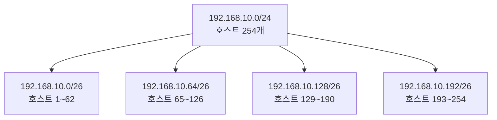
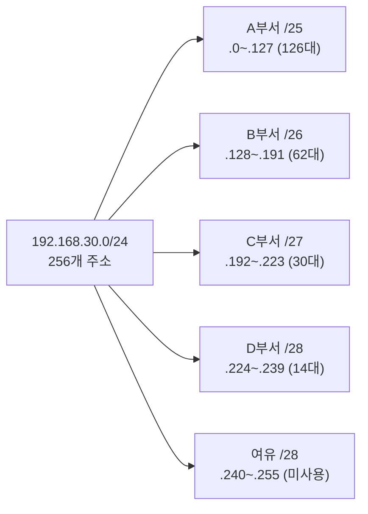

<Callout type="info">
  **이번 문서의 목표:** 클래스 C 네트워크를 여러 서브넷으로 나누고, `/26`·`/27`·`/28` 같은 접두사에서 네트워크 주소·브로드캐스트 주소·호스트 수를 비트 단위로 직접 계산하며, VLSM으로 크기가 다른 서브넷을 설계하고, 임의의 IP가 속한 서브넷을 판별할 수 있게 된다.
</Callout>

## 왜 서브네팅이 필요한가

12편에서 IPv4 주소가 32비트이고, 그중 네트워크 부분과 호스트 부분을 서브넷 마스크(subnet mask)로 구분한다는 것을 확인했습니다. 그런데 회사가 클래스 C 주소 하나(호스트 254개 수용)를 통째로 받았다고 해봅시다. 실제로는 영업팀 20대, 개발팀 10대, 서버실 5대처럼 부서마다 필요한 대수가 다릅니다. 하나의 네트워크를 그대로 쓰면 모든 부서가 같은 브로드캐스트 영역(broadcast domain, 브로드캐스트 신호가 도달하는 범위)을 공유해 불필요한 트래픽을 서로 주고받고, 부서 간 격리도 되지 않습니다.

**서브네팅**(subnetting)은 큰 네트워크 하나를 비트 단위로 쪼개 여러 개의 작은 네트워크(서브넷, subnet)로 나누는 작업입니다. 원리는 호스트 부분의 비트 일부를 "빌려와서" 네트워크 부분을 늘리는 것뿐입니다. 이 편은 독학사 컴퓨터네트워크에서 계산 문제가 가장 많이 나오는 영역이므로, 예제마다 이진수 비트 하나하나를 직접 펼쳐서 계산합니다.

## 1. 호스트 수 = 2의 n제곱 − 2, 왜 이렇게 계산하는가

서브넷 마스크에서 `1`로 표시된 비트는 네트워크 부분, `0`으로 표시된 비트는 호스트 부분입니다. 호스트 부분의 비트 수를 n이라고 하면, 그 서브넷 안에서 표현 가능한 주소의 개수는 2의 n제곱 개입니다. 예를 들어 호스트 부분이 6비트면 2의 6제곱 = 64개의 주소가 나옵니다.

> **쉽게 말하면:** 호스트 비트가 n개면 그 서브넷 안에 만들 수 있는 전체 주소는 2의 n제곱 개지만, 그중 맨 앞과 맨 뒤 2개는 회사 대표 주소용으로 예약되어 있어 실제 사람에게는 나눠줄 수 없습니다.

이 2의 n제곱 개 주소 중 실제로 호스트에 할당할 수 있는 개수가 왜 2개 줄어드는지는 두 가지 예약 주소 때문입니다.

- **네트워크 주소**(network address): 호스트 부분이 전부 `0`인 주소입니다. 이 주소는 특정 컴퓨터를 가리키는 것이 아니라 "이 서브넷 자체"를 대표하는 이름표로 예약되어 있어, 라우팅 테이블에서 목적지 네트워크를 표시할 때 사용합니다.
- **브로드캐스트 주소**(broadcast address): 호스트 부분이 전부 `1`인 주소입니다. 이 주소로 보낸 패킷은 그 서브넷 안의 모든 호스트에게 전달되므로, 특정 한 호스트의 주소로 쓸 수 없습니다.

따라서 실제 호스트에게 나눠줄 수 있는 주소 수는 다음과 같이 계산합니다.

$$
\text{호스트 수} = 2^n - 2
$$

- $n$: 호스트 부분에 남은 비트 수(32에서 서브넷 접두사 길이를 뺀 값)
- $2^n$: 이 서브넷이 표현할 수 있는 전체 주소 개수
- $-2$: 맨 앞(네트워크 주소)과 맨 뒤(브로드캐스트 주소) 2개를 실제 호스트에 배정할 수 없어 제외

**자주 틀리는 점:** "호스트 수는 2의 n제곱이다"라고 답하는 실수가 잦습니다. 네트워크 주소와 브로드캐스트 주소는 특정 컴퓨터가 아니라 서브넷 전체를 가리키는 예약된 이름이므로, 실제 배정 가능한 호스트 수를 물으면 반드시 2를 뺀 값을 답해야 합니다.

## 2. 예제 1 — 클래스 C 네트워크를 4개로 균등 분할

192.168.10.0/24 네트워크를 동일한 크기의 서브넷 4개로 나눠 보겠습니다.

**1단계 — 몇 비트를 빌려야 하는지 정한다.** 서브넷을 4개 만들려면 2의 몇 제곱이 4가 되는지를 구합니다. 2의 2제곱 = 4이므로, 호스트 부분에서 **2비트**를 네트워크 부분으로 빌려와야 합니다.

**2단계 — 새로운 접두사 길이를 정한다.** 원래 `/24`였으므로 24 + 2 = **`/26`**이 됩니다.

**3단계 — 서브넷 마스크를 비트로 확인한다.**

```
기존 /24 마스크: 11111111.11111111.11111111.00000000  (= 255.255.255.0)
새로운 /26 마스크: 11111111.11111111.11111111.11000000  (= 255.255.255.192)
                                              ^^--- 호스트에서 빌려온 2비트
```

마지막 옥텟(octet, 8비트 단위)의 앞 2비트가 `1`로 바뀌어 네트워크 부분에 편입되었습니다. 이 2비트를 10진수로 계산하면 128 + 64 = 192이므로 마스크는 255.255.255.192가 됩니다.

**4단계 — 서브넷마다 블록 크기를 구한다.** 네트워크 부분이 아닌 나머지 호스트 비트는 8 − 2 = 6비트이므로, 서브넷 하나의 전체 주소 개수는 2의 6제곱 = 64개입니다. 즉 마지막 옥텟이 0, 64, 128, 192로 64씩 증가하며 다음 서브넷 경계가 됩니다.

**5단계 — 4개 서브넷을 표로 정리한다.**

| 서브넷 | 마지막 옥텟(2비트+6비트) | 네트워크 주소 | 브로드캐스트 주소 | 호스트 범위 | 호스트 수 |
|---|---|---|---|---|---|
| 1번 | 00000000–00111111 | 192.168.10.0 | 192.168.10.63 | 192.168.10.1–192.168.10.62 | 62 |
| 2번 | 01000000–01111111 | 192.168.10.64 | 192.168.10.127 | 192.168.10.65–192.168.10.126 | 62 |
| 3번 | 10000000–10111111 | 192.168.10.128 | 192.168.10.191 | 192.168.10.129–192.168.10.190 | 62 |
| 4번 | 11000000–11111111 | 192.168.10.192 | 192.168.10.255 | 192.168.10.193–192.168.10.254 | 62 |

호스트 수는 앞서 세운 공식대로 $2^6 - 2 = 62$개입니다. 원래 클래스 C 하나가 254개 호스트를 수용했다면, 4등분한 뒤에는 서브넷마다 62개씩(4 × 62 = 248개, 나머지 8개는 각 서브넷의 네트워크·브로드캐스트 주소로 소모)만 수용한다는 점도 확인해 둡니다.



## 3. 예제 2 — `/26`, `/27`, `/28` 비교: 빌리는 비트 수가 늘어나면 무슨 일이 생기는가

같은 192.168.20.0/24 네트워크를 서로 다른 접두사로 나눠 비교해 보겠습니다. 빌리는 비트 수가 1씩 늘어날 때마다 서브넷 개수는 2배로 늘고, 서브넷당 호스트 수는 절반으로 줄어드는 관계를 직접 확인합니다.

| 접두사 | 빌린 비트 수 | 마스크(마지막 옥텟) | 서브넷 개수 | 블록 크기 | 호스트 부분 비트 | 서브넷당 호스트 수 |
|---|---|---|---|---|---|---|
| `/26` | 2비트 | `11000000` = 192 | $2^2 = 4$개 | 64 | 6비트 | $2^6-2=62$ |
| `/27` | 3비트 | `11100000` = 224 | $2^3 = 8$개 | 32 | 5비트 | $2^5-2=30$ |
| `/28` | 4비트 | `11110000` = 240 | $2^4 = 16$개 | 16 | 4비트 | $2^4-2=14$ |

`/27`의 첫 두 서브넷을 비트까지 직접 계산해 보면 다음과 같습니다.

```
/27 마스크: 11111111.11111111.11111111.11100000 (= 255.255.255.224)
블록 크기 = 2^(8-3) = 32

1번 서브넷 마지막 옥텟: 00000000 ~ 00011111  → 192.168.20.0/27, 브로드캐스트 192.168.20.31
2번 서브넷 마지막 옥텟: 00100000 ~ 00111111  → 192.168.20.32/27, 브로드캐스트 192.168.20.63
```

`/28`의 첫 두 서브넷도 같은 방식으로 확인합니다.

```
/28 마스크: 11111111.11111111.11111111.11110000 (= 255.255.255.240)
블록 크기 = 2^(8-4) = 16

1번 서브넷 마지막 옥텟: 00000000 ~ 00001111  → 192.168.20.0/28, 브로드캐스트 192.168.20.15
2번 서브넷 마지막 옥텟: 00010000 ~ 00011111  → 192.168.20.16/28, 브로드캐스트 192.168.20.31
```

> **쉽게 말하면:** 접두사 숫자가 1씩 커질 때마다 "쪼개는 칼질"이 한 번 더 들어가서 조각(서브넷)은 2배로 늘고, 조각 하나의 크기(호스트 수)는 절반으로 줄어듭니다.

**자주 틀리는 점:** `/24`보다 `/26`, `/27`, `/28`처럼 숫자가 커질수록 네트워크가 "더 커진다"고 착각하기 쉽습니다. 접두사 숫자는 네트워크 부분의 비트 수이므로, 숫자가 커질수록 호스트 부분은 줄어들어 서브넷 하나의 크기는 오히려 **작아집니다**. 반대로 서브넷의 **개수**는 늘어난다는 점을 구분해야 합니다.

## 4. 예제 3 — VLSM으로 크기가 다른 서브넷 설계하기

지금까지는 서브넷을 똑같은 크기로만 나눴습니다. 그런데 실제로는 부서마다 필요한 호스트 수가 다릅니다. **VLSM**(Variable Length Subnet Mask, 가변 길이 서브넷 마스크)은 하나의 네트워크 안에서 서브넷마다 서로 다른 길이의 마스크를 적용해, 필요한 만큼만 주소를 나눠주고 낭비를 줄이는 방법입니다.

> **쉽게 말하면:** 모두에게 똑같은 크기의 상자를 나눠주는 대신, 필요한 양만큼 상자 크기를 다르게 맞춰주는 방식입니다.

192.168.30.0/24 네트워크로 4개 부서에 각각 필요한 호스트 수만큼 서브넷을 설계해 보겠습니다.

**1단계 — 요구 호스트 수를 큰 것부터 정렬한다.** A부서 100대, B부서 50대, C부서 20대, D부서 10대입니다. **VLSM은 반드시 요구량이 큰 순서부터 배정**해야 남는 공간을 낭비 없이 활용할 수 있습니다.

**2단계 — 각 요구량에 맞는 최소 접두사를 구한다.** 공식 $2^n - 2 \geq \text{요구 호스트 수}$를 만족하는 가장 작은 $n$을 찾습니다.

| 부서 | 요구 호스트 수 | $2^n-2 \geq$ 요구량을 만족하는 n | 호스트 수 | 접두사 |
|---|---|---|---|---|
| A | 100 | $2^7-2=126$ (n=7) | 126 | /25 |
| B | 50 | $2^6-2=62$ (n=6) | 62 | /26 |
| C | 20 | $2^5-2=30$ (n=5) | 30 | /27 |
| D | 10 | $2^4-2=14$ (n=4) | 14 | /28 |

A부서는 100대가 필요한데 $n=6$이면 $2^6-2=62$로 부족하므로 한 단계 위인 $n=7$을 씁니다. 이렇게 "부족하면 한 칸 위로" 올리는 것이 VLSM 계산의 핵심 규칙입니다.

**3단계 — 큰 서브넷부터 순서대로 주소를 배정한다.**

```
전체:  192.168.30.0/24  (0 ~ 255, 256개 주소)

A(/25, 128개 블록): 192.168.30.0    ~ 192.168.30.127
                    네트워크 .0, 브로드캐스트 .127, 호스트 .1~.126 (126개)

B(/26, 64개 블록):  192.168.30.128  ~ 192.168.30.191
                    네트워크 .128, 브로드캐스트 .191, 호스트 .129~.190 (62개)

C(/27, 32개 블록):  192.168.30.192  ~ 192.168.30.223
                    네트워크 .192, 브로드캐스트 .223, 호스트 .193~.222 (30개)

D(/28, 16개 블록):  192.168.30.224  ~ 192.168.30.239
                    네트워크 .224, 브로드캐스트 .239, 호스트 .225~.238 (14개)

남는 공간(/28, 16개):  192.168.30.240 ~ 192.168.30.255  (미사용, 추후 확장용)
```

각 구간의 시작 주소는 바로 앞 서브넷의 끝(브로드캐스트) 다음 주소이며, 블록 크기(128, 64, 32, 16)만큼 건너뛰며 이어 붙인 것입니다. 마지막에 16개 주소(240–255)가 남았는데, 이는 향후 새 부서가 생길 때를 대비한 여유 공간으로 남겨둘 수 있습니다.



**자주 틀리는 점:** VLSM 문제에서 요구량이 작은 부서부터 배정하면, 중간에 남은 공간이 다음 부서가 필요로 하는 연속된 블록 크기와 맞지 않아 주소가 낭비되거나 재배치가 필요해집니다. 반드시 **큰 요구량부터** 순서대로 배정해야 한다는 규칙을 기억해야 합니다.

## 5. 예제 4 — 주어진 IP에서 네트워크 주소·브로드캐스트 주소 구하기

이번에는 반대 방향 문제입니다. IP 주소 172.16.77.135/21이 주어졌을 때, 이 호스트가 속한 서브넷의 네트워크 주소와 브로드캐스트 주소를 구해 보겠습니다.

**1단계 — 접두사가 몇 번째 옥텟까지 걸치는지 확인한다.** `/21`은 앞의 21비트가 네트워크 부분입니다. 첫째 옥텟(8비트) + 둘째 옥텟(8비트) = 16비트이고, 21 − 16 = 5비트가 셋째 옥텟에서 네트워크 부분으로 쓰입니다. 즉 셋째 옥텟의 앞 5비트까지가 네트워크, 나머지 3비트와 넷째 옥텟 전체(3 + 8 = 11비트)가 호스트 부분입니다.

**2단계 — 셋째 옥텟을 이진수로 바꾼다.** 77을 이진수로 바꾸면 다음과 같습니다.

```
77 = 64 + 8 + 4 + 1 = 01001101
```

**3단계 — 마스크와 AND 연산으로 네트워크 주소를 구한다.** `/21` 마스크의 셋째 옥텟은 앞 5비트가 `1`이므로 `11111000`(십진수 248)입니다.

```
77의 이진수:        01001101
셋째 옥텟 마스크:    11111000
AND 연산 결과:       01001000  = 64 + 8 = 72
```

앞 5비트(`01001`)는 그대로 유지되고, 뒤 3비트(`101`)가 마스크의 `0`과 AND 연산되어 전부 `000`으로 지워집니다. 그 결과 셋째 옥텟은 72가 되고, 넷째 옥텟은 호스트 부분이므로 전부 `0`이 되어 **네트워크 주소는 172.16.72.0**입니다.

**4단계 — 호스트 부분을 전부 1로 바꿔 브로드캐스트 주소를 구한다.** 셋째 옥텟의 호스트 비트(뒤 3비트)를 전부 `1`로, 넷째 옥텟(전부 호스트 비트) 8비트를 전부 `1`로 바꿉니다.

```
네트워크 주소 셋째 옥텟:  01001000  (= 72)
호스트 비트를 1로:        01001111  (= 64 + 8 + 4 + 2 + 1 = 79)
```

넷째 옥텟은 `11111111` = 255이므로, **브로드캐스트 주소는 172.16.79.255**입니다.

**5단계 — 호스트 범위와 호스트 수를 정리한다.** 호스트 부분 비트 수는 $32 - 21 = 11$비트이므로 호스트 수는 다음과 같습니다.

$$
2^{11} - 2 = 2048 - 2 = 2046
$$

호스트로 실제 배정 가능한 범위는 네트워크 주소 다음부터 브로드캐스트 주소 바로 앞까지인 **172.16.72.1 – 172.16.79.254**이며, 이 범위 안에 172.16.77.135도 포함되어 있음을 확인할 수 있습니다(77은 72–79 구간에 들어갑니다).

| 항목 | 값 |
|---|---|
| 주어진 IP | 172.16.77.135/21 |
| 서브넷 마스크 | 255.255.248.0 |
| 네트워크 주소 | 172.16.72.0 |
| 브로드캐스트 주소 | 172.16.79.255 |
| 호스트 범위 | 172.16.72.1 – 172.16.79.254 |
| 호스트 수 | 2046 |

**자주 틀리는 점:** 옥텟 경계를 넘어가는 접두사(`/21`처럼 8의 배수가 아닌 경우)에서, 셋째 옥텟 전체를 기준으로 계산하지 않고 8비트 단위로만 생각해 네트워크 주소를 172.16.0.0이나 172.16.77.0처럼 잘못 구하는 실수가 흔합니다. 반드시 접두사가 걸치는 옥텟 안에서 정확히 몇 비트가 네트워크 부분인지 확인하고, 그 옥텟만 AND 연산해야 합니다.

## 핵심 정리

- 호스트 수 계산 공식은 $2^n - 2$이며, $n$은 호스트 부분 비트 수, $-2$는 네트워크 주소(호스트 전부 `0`)와 브로드캐스트 주소(호스트 전부 `1`)를 실제 호스트에 배정할 수 없기 때문이다.
- 호스트 비트를 1개 더 빌릴 때마다 서브넷 개수는 2배로 늘고, 서브넷당 호스트 수는 절반으로 줄어든다(`/26`→`/27`→`/28`).
- VLSM은 요구 호스트 수가 **큰 서브넷부터** 순서대로 배정해야 주소 공간을 낭비 없이 나눌 수 있다.
- 옥텟 경계를 넘는 접두사(예: `/21`)는 해당 옥텟을 이진수로 바꿔 마스크와 직접 AND 연산해야 네트워크 주소를 정확히 구할 수 있다.
- 네트워크 주소는 호스트 부분을 전부 `0`으로, 브로드캐스트 주소는 호스트 부분을 전부 `1`로 바꾼 값이다.

## 마무리 복습

<Quiz
  questionNumber={1}
  question="서브넷의 호스트 부분 비트 수가 5비트일 때, 실제로 호스트에 배정 가능한 주소 개수는?"
  options={['32개', '31개', '30개', '16개']}
  correctAnswer={3}
  explanation="호스트 수는 2의 n제곱 빼기 2이다. n이 5이므로 2의 5제곱은 32이고, 네트워크 주소와 브로드캐스트 주소 2개를 제외하면 32 빼기 2는 30개다."
  optionExplanations={['2를 빼지 않아 전체 주소 개수만 계산한 값이다.', '1만 뺀 값으로 브로드캐스트 주소만 제외하고 네트워크 주소를 빼지 않은 착각이다.', '2의 5제곱에서 네트워크·브로드캐스트 주소 2개를 뺀 정확한 값이다.', '호스트 비트 수를 4비트로 잘못 계산한 경우에 나오는 값이다.']}
/>

<Quiz
  questionNumber={2}
  question="192.168.5.0/24 네트워크를 8개의 동일한 서브넷으로 나누려면 몇 비트를 빌려야 하며, 새로운 접두사는 무엇인가?"
  options={['2비트를 빌려 /26이 된다', '3비트를 빌려 /27이 된다', '4비트를 빌려 /28이 된다', '1비트를 빌려 /25가 된다']}
  correctAnswer={2}
  explanation="서브넷 8개를 만들려면 2의 세제곱이 8이 되어야 하므로 3비트를 빌려야 한다. 원래 24였던 접두사에 3을 더하면 27이 되어 /27이 된다."
  optionExplanations={['2비트를 빌리면 2의 제곱인 4개의 서브넷만 만들어져 개수가 부족하다.', '2의 세제곱이 8이므로 3비트를 빌리는 것이 정확하다.', '4비트를 빌리면 2의 네제곱인 16개의 서브넷이 만들어져 요구보다 많아진다.', '1비트를 빌리면 2개의 서브넷만 만들어져 개수가 크게 부족하다.']}
/>

<Quiz
  questionNumber={3}
  question="10.0.4.200/27 주소가 속한 서브넷의 네트워크 주소와 브로드캐스트 주소로 옳은 것은?"
  options={['네트워크 10.0.4.192, 브로드캐스트 10.0.4.223', '네트워크 10.0.4.128, 브로드캐스트 10.0.4.191', '네트워크 10.0.4.192, 브로드캐스트 10.0.4.255', '네트워크 10.0.4.160, 브로드캐스트 10.0.4.191']}
  correctAnswer={1}
  explanation="/27은 블록 크기가 32이므로 마지막 옥텟은 0, 32, 64, 96, 128, 160, 192, 224 단위로 끊긴다. 200은 192에서 223 구간에 속하므로 네트워크 주소는 10.0.4.192, 브로드캐스트 주소는 10.0.4.223이다."
  optionExplanations={['200이 속한 192부터 223까지 구간의 시작과 끝을 정확히 계산한 값이다.', '160에서 191 구간에 대한 계산으로, 200이 속한 구간보다 한 블록 앞선 값이다.', '네트워크 주소는 맞지만 브로드캐스트 주소를 다음 블록 경계 직전인 255로 잘못 계산한 값이다.', '128에서 159 구간에 대한 계산으로 200이 속한 구간과 두 블록 차이가 난다.']}
/>

<Quiz
  questionNumber={4}
  question="VLSM으로 서브넷을 설계할 때 반드시 지켜야 할 배정 순서로 옳은 것은?"
  options={['요구 호스트 수가 작은 서브넷부터 배정한다', '요구 호스트 수가 큰 서브넷부터 배정한다', '알파벳 순서대로 배정하면 순서는 상관없다', '네트워크 주소가 낮은 순서대로 임의로 배정한다']}
  correctAnswer={2}
  explanation="VLSM은 요구 호스트 수가 큰 서브넷부터 순서대로 배정해야 연속된 주소 공간을 낭비 없이 나눌 수 있다. 작은 것부터 배정하면 중간에 남는 공간이 다음 큰 요구량과 맞지 않아 주소가 낭비된다."
  optionExplanations={['작은 것부터 배정하면 남는 공간이 흩어져 큰 요구량을 위한 연속 블록을 만들기 어렵다.', '큰 요구량부터 배정해야 남는 공간을 순서대로 활용할 수 있다는 VLSM의 핵심 규칙과 일치한다.', '요구 호스트 수 크기와 무관하게 배정하면 주소 공간이 비효율적으로 쓰인다.', '요구 호스트 수 크기를 고려하지 않으면 VLSM의 목적인 주소 절약 효과를 얻을 수 없다.']}
/>

<Quiz
  questionNumber={5}
  question="어떤 서브넷의 서브넷 마스크가 255.255.255.240일 때, 이 서브넷 하나가 수용 가능한 실제 호스트 수는?"
  options={['16개', '15개', '14개', '8개']}
  correctAnswer={3}
  explanation="255.255.255.240은 이진수로 11110000이므로 호스트 비트는 4비트다. 2의 4제곱은 16이고, 네트워크·브로드캐스트 주소 2개를 빼면 14개다."
  optionExplanations={['네트워크 주소와 브로드캐스트 주소를 빼지 않은 전체 주소 개수다.', '1개만 뺀 값으로 두 예약 주소 중 하나만 제외한 착각이다.', '2의 4제곱에서 예약된 2개 주소를 정확히 뺀 값이다.', '호스트 비트를 3비트로 잘못 계산했을 때 나오는 값이다.']}
/>

<Quiz
  questionNumber={6}
  question="172.16.77.135/21 주소의 네트워크 주소를 구하는 과정에서, 셋째 옥텟 77을 이진수로 바꾼 값과 /21 마스크의 셋째 옥텟 값으로 옳은 것은?"
  options={['77은 01001101, 마스크는 11111000이다', '77은 01001101, 마스크는 11110000이다', '77은 01001100, 마스크는 11111000이다', '77은 01001101, 마스크는 11111100이다']}
  correctAnswer={1}
  explanation="/21은 16비트를 넘어 셋째 옥텟에서 5비트를 추가로 사용하므로 마스크는 앞 5비트가 1인 11111000(십진수 248)이다. 77을 이진수로 바꾸면 64+8+4+1로 01001101이다."
  optionExplanations={['77의 이진수 변환과 21비트 접두사에서 셋째 옥텟에 할당되는 5비트 마스크를 정확히 계산한 값이다.', '마스크를 4비트(11110000)로 계산한 값으로, 이는 /20에 해당하는 마스크다.', '77의 이진수 변환에서 마지막 비트를 0으로 잘못 계산한 값이다.', '마스크를 6비트(11111100)로 계산한 값으로, 이는 /22에 해당하는 마스크다.']}
/>

<Quiz
  questionNumber={7}
  question="192.168.30.0/24 네트워크에서 VLSM으로 A부서(100대), B부서(50대)를 이 순서로 배정할 때, B부서에 배정되는 서브넷의 네트워크 주소는?"
  options={['192.168.30.64', '192.168.30.100', '192.168.30.128', '192.168.30.126']}
  correctAnswer={3}
  explanation="A부서는 100대를 수용하기 위해 /25(128개 블록, 192.168.30.0~192.168.30.127)를 배정받는다. 그다음 남은 공간에서 B부서(50대, /26, 64개 블록)는 192.168.30.128부터 시작한다."
  optionExplanations={['이는 /26 블록 크기의 경계이지만 A부서가 이미 0부터 127까지를 차지했으므로 이 위치는 A부서 영역 안에 있다.', '요구 대수인 100에서 그대로 시작 주소를 만든 잘못된 계산이다.', 'A부서가 차지한 0부터 127 구간 바로 다음 주소로, B부서가 시작하는 정확한 네트워크 주소다.', 'A부서 서브넷의 브로드캐스트 주소이며 B부서의 시작 주소가 아니다.']}
/>

<Quiz
  questionNumber={8}
  question="다음 중 서브네팅과 호스트 수 계산에 대한 설명으로 옳지 않은 것은?"
  options={['네트워크 주소는 호스트 부분 비트가 모두 0인 주소다', '브로드캐스트 주소는 호스트 부분 비트가 모두 1인 주소다', '접두사 길이가 커질수록 서브넷 하나가 수용하는 호스트 수는 늘어난다', '호스트 부분 비트 수가 n일 때 배정 가능한 실제 호스트 수는 2의 n제곱 빼기 2다']}
  correctAnswer={3}
  explanation="접두사 길이가 커질수록 네트워크 부분 비트가 늘어나 호스트 부분 비트는 오히려 줄어들므로, 서브넷 하나가 수용하는 호스트 수는 줄어든다. 이 설명이 반대로 되어 있어 옳지 않다."
  optionExplanations={['네트워크 주소의 정의와 정확히 일치하는 설명이다.', '브로드캐스트 주소의 정의와 정확히 일치하는 설명이다.', '접두사가 커지면 호스트 비트가 줄어 호스트 수는 감소하므로 이 설명이 정답으로 골라야 할 틀린 진술이다.', '2의 n제곱 빼기 2 공식과 정확히 일치하는 설명이다.']}
/>

## 참고 자료

- [IETF RFC 791 - Internet Protocol](https://www.rfc-editor.org/rfc/rfc791)
- [국가평생교육진흥원 독학학위제 - 과목별 평가영역](https://bdes.nile.or.kr/nile/study/nStudy2_1.do)
