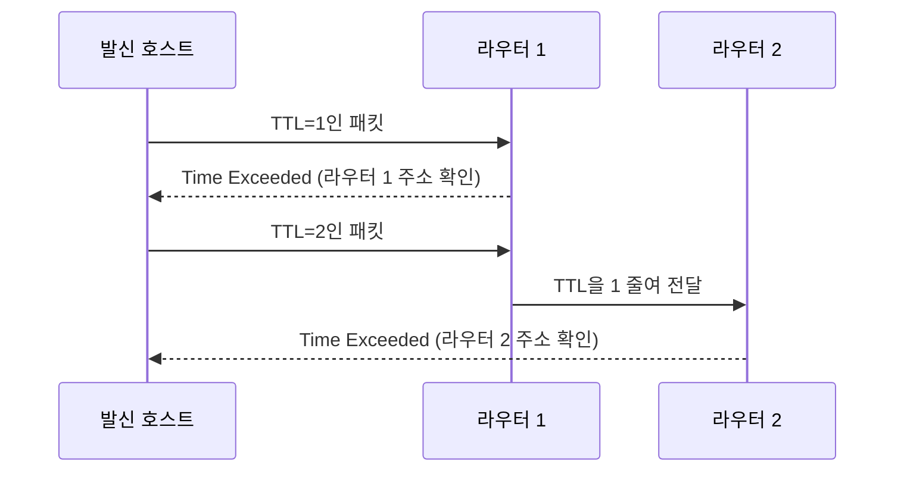

<Callout type="info">
  **이번 문서의 목표:** ICMP가 IP와 함께 동작하며 어떤 상황을 알리는지 설명하고, 라우팅 테이블을 직접 읽어 최장 프리픽스 일치(longest prefix match)로 다음 홉을 고를 수 있으며, 정적 라우팅과 동적 라우팅의 장단점을 비교할 수 있게 된다.
</Callout>

## 왜 IP만으로는 부족한가

09편~13편에서 IPv4 주소로 목적지를 지정하고 서브넷을 나누는 방법을 배웠습니다. 그런데 IP 프로토콜 자체는 "이 패킷을 어디로 보내라"는 정보만 담을 뿐, 가는 길에 문제가 생겼을 때 알려주는 기능이 없습니다. 예를 들어 목적지 네트워크가 아예 존재하지 않거나, 패킷이 라우터를 너무 많이 거쳐 계속 떠돌고 있다면 누군가는 이 사실을 보낸 쪽에 알려줘야 합니다. 또한 패킷이 목적지까지 가려면 중간에 여러 라우터가 "다음에는 어디로 넘길지"를 매번 판단해야 하는데, 이 판단 기준이 되는 표가 바로 라우팅 테이블(routing table)입니다. 이번 편은 이 두 가지, 즉 **오류·상태를 보고하는 ICMP**와 **경로를 정하는 라우팅**의 기본 원리를 다룹니다.

## 1. ICMP — 인터넷의 오류 보고·진단 프로토콜

**ICMP**(Internet Control Message Protocol, 인터넷 제어 메시지 프로토콜)는 IP 패킷 전달 과정에서 발생하는 오류나 상태를 보고하기 위해 만들어진 프로토콜입니다. TCP나 UDP처럼 응용 데이터를 실어 나르는 것이 목적이 아니라, **네트워크 계층 자체의 상태를 알리는 관리용 메시지**를 주고받는 데 씁니다.

> **쉽게 말하면:** ICMP는 택배가 배송 중 사고가 났을 때(주소 없음, 배송 시간 초과 등) 발송인에게 돌아가는 반송 메시지 같은 역할을 합니다.

ICMP는 IP 계층과 같은 네트워크 계층에서 동작하지만, 실제로는 IP 패킷 안에 담겨 전달됩니다. 즉 ICMP 메시지도 IP 헤더를 씌운 뒤 전송되며, "IP 위에 얹혀서 IP를 돕는 보조 프로토콜"이라고 이해하면 됩니다.

대표적인 ICMP 메시지 종류는 다음과 같습니다.

| 메시지 종류 | 상황 | 의미 |
|---|---|---|
| Echo Request / Echo Reply | `ping` 명령 | 상대 호스트가 살아있는지, 왕복 시간(RTT, Round Trip Time)은 얼마인지 확인 |
| Destination Unreachable | 목적지 도달 불가 | 목적지 네트워크나 호스트, 포트를 찾을 수 없을 때 발신자에게 통보 |
| Time Exceeded | TTL(Time To Live, 생존 시간) 소진 | 패킷이 라우터를 거칠 때마다 TTL이 1씩 줄고, TTL이 0이 되면 그 라우터가 패킷을 버리고 발신자에게 통보 |
| Redirect | 더 나은 경로 존재 | 라우터가 "이 목적지는 나보다 더 가까운 다른 라우터로 보내는 게 낫다"고 발신 호스트에게 알림 |

**Echo Request/Echo Reply**를 이용하는 대표적인 도구가 `ping`입니다. 한 호스트가 상대방에게 Echo Request를 보내고 Echo Reply를 받으면, 그 경로가 살아있고 왕복하는 데 걸린 시간을 알 수 있습니다.

**Time Exceeded** 메시지는 `traceroute`(또는 윈도우의 `tracert`)라는 진단 도구의 원리이기도 합니다. 이 도구는 TTL을 1부터 시작해 하나씩 늘려가며 같은 목적지로 패킷을 반복해서 보냅니다. TTL이 1인 패킷은 첫 번째 라우터에서 TTL이 0이 되어 버려지고 그 라우터가 Time Exceeded 메시지를 돌려보내므로, 그 라우터의 주소를 알 수 있습니다. TTL을 2, 3, 4로 늘려가면 두 번째, 세 번째, 네 번째 라우터의 주소를 차례로 알아낼 수 있어, 목적지까지 거쳐 가는 경로 전체를 추적할 수 있습니다.

**자주 틀리는 점:** ICMP를 TCP나 UDP처럼 응용 데이터를 전달하는 전송 계층 프로토콜로 착각하는 경우가 많습니다. ICMP는 포트 번호도 쓰지 않으며, **오류·상태를 보고하는 네트워크 계층의 보조 프로토콜**이라는 점을 기억해야 합니다. 또한 "TTL이 0이 되면 그 패킷은 목적지까지 무사히 도착한다"는 오답도 자주 나오는데, TTL이 0이 되면 목적지에 도착하기 전에 그 라우터가 패킷을 **폐기**하고 Time Exceeded를 돌려보냅니다.

## 2. 라우팅 테이블의 구조 읽는 법

**라우팅 테이블**(routing table)은 라우터가 "이 목적지로 가려면 다음에 어디로 넘겨야 하는지"를 기록해 둔 표입니다. 라우터는 패킷이 들어올 때마다 목적지 IP 주소를 이 표와 비교해 다음 홉(hop)을 결정합니다.

라우팅 테이블의 각 항목(라우트, route)은 보통 다음 정보를 담습니다.

| 필드 | 의미 |
|---|---|
| 목적지 네트워크 | 이 경로가 담당하는 네트워크 주소(예: 192.168.10.0/24) |
| 다음 홉(next hop) | 이 목적지로 가려면 넘겨야 할 다음 라우터의 IP 주소 |
| 인터페이스 | 패킷을 내보낼 라우터의 물리적 또는 논리적 포트 |
| 메트릭(metric) | 이 경로의 비용(홉 수, 대역폭 등으로 계산되는 우선순위 지표) — 값이 작을수록 더 선호되는 경로 |

라우터에 다음과 같은 라우팅 테이블이 있다고 가정하고, 목적지 IP 192.168.10.135로 가는 패킷이 도착했다고 해봅시다.

| 목적지 네트워크 | 다음 홉 | 인터페이스 | 메트릭 |
|---|---|---|---|
| 0.0.0.0/0 (기본 경로) | 203.0.113.1 | eth0 | 1 |
| 192.168.10.0/24 | 10.0.0.2 | eth1 | 1 |
| 192.168.10.128/25 | 10.0.0.3 | eth2 | 1 |

목적지 192.168.10.135는 192.168.10.0/24 범위에도 속하고, 192.168.10.128/25 범위에도 속합니다(13편에서 다룬 방식으로 확인하면, 135는 128–255 구간이므로 128/25 범위에 들어갑니다). 이렇게 여러 경로가 동시에 들어맞을 때 라우터는 **최장 프리픽스 일치**(longest prefix match) 규칙을 적용해, **가장 구체적인**(접두사 길이가 가장 긴) 경로를 선택합니다. 여기서는 `/25`가 `/24`보다 더 구체적이므로 192.168.10.128/25 경로, 즉 다음 홉 10.0.0.3으로 패킷을 넘깁니다. 만약 어느 경로에도 해당하지 않는 목적지라면, 모든 주소와 일치하는 **기본 경로**(default route, 0.0.0.0/0)로 보냅니다.

> **쉽게 말하면:** 라우팅 테이블은 내비게이션의 경로 목록과 같습니다. 여러 갈래길이 목적지를 포함해도, 가장 정확하게 목적지를 가리키는 가장 좁은 길(가장 긴 접두사)을 우선 선택합니다.

**자주 틀리는 점:** 여러 경로가 동시에 일치할 때 메트릭이 더 작은 경로를 무조건 우선한다고 착각하기 쉽습니다. 실제로는 **먼저 최장 프리픽스 일치로 후보를 좁히고**, 그래도 접두사 길이가 같은 경로가 여럿이면 그때 메트릭을 비교해 더 낮은 쪽을 선택합니다. 접두사 길이 비교가 메트릭 비교보다 우선한다는 순서를 기억해야 합니다.

## 3. 홉과 경로 선택

**홉**(hop)은 패킷이 출발지에서 목적지까지 가는 동안 거치는 라우터 하나하나를 세는 단위입니다. "3홉 거리"라는 말은 라우터를 3번 거쳐야 도착한다는 뜻입니다. 라우터는 패킷을 받을 때마다 IP 헤더의 TTL 값을 1씩 감소시키는데, 이는 홉을 하나 지날 때마다 TTL도 하나씩 줄어드는 것과 같습니다. TTL이 이렇게 존재하는 이유는, 만약 라우팅 설정 오류로 패킷이 같은 라우터들 사이를 영원히 맴도는 **라우팅 루프**(routing loop)가 발생해도 TTL이 0이 되는 순간 그 패킷이 폐기되어 네트워크 자원을 무한히 낭비하지 않도록 하기 위해서입니다.

경로를 선택할 때 홉 수는 가장 단순한 비용 지표로 쓰입니다. "홉 수가 적은 경로가 더 좋은 경로"라는 생각은 직관적이지만, 홉 수만으로 경로를 정하면 문제가 생길 수 있습니다. 예를 들어 홉 수가 2인 저속 회선 경로와 홉 수가 3인 고속 회선 경로가 있다면, 홉 수만 보면 2홉 경로가 유리해 보이지만 실제 전송 속도는 3홉 경로가 더 빠를 수 있습니다. 이 때문에 15편에서 다룰 라우팅 프로토콜들은 홉 수 외에도 대역폭, 지연 등 다양한 지표를 메트릭에 반영합니다.

## 4. 정적 라우팅과 동적 라우팅

라우팅 테이블을 만드는 방식은 크게 두 가지로 나뉩니다.

- **정적 라우팅**(static routing): 관리자가 라우팅 테이블의 각 경로를 직접 하나하나 입력하는 방식입니다.
- **동적 라우팅**(dynamic routing): 라우터들이 서로 라우팅 프로토콜(RIP, OSPF 등)로 정보를 주고받아 라우팅 테이블을 자동으로 계산·갱신하는 방식입니다.

> **쉽게 말하면:** 정적 라우팅은 손으로 그린 지도이고, 동적 라우팅은 실시간 교통 정보를 반영해 스스로 갱신되는 내비게이션입니다.

| 구분 | 정적 라우팅 | 동적 라우팅 |
|---|---|---|
| 설정 방식 | 관리자가 직접 입력 | 라우터끼리 프로토콜로 자동 교환 |
| 네트워크 변화 대응 | 회선 장애·구조 변경 시 관리자가 수동으로 수정해야 함 | 변화를 감지해 자동으로 경로를 다시 계산(수렴, convergence) |
| 자원 소모 | 별도의 프로토콜 통신이 없어 CPU·대역폭 소모가 적음 | 주기적 정보 교환에 따른 CPU·대역폭 소모가 있음 |
| 적합한 규모 | 소규모, 경로가 거의 바뀌지 않는 네트워크 | 대규모, 경로 변화가 잦은 네트워크 |
| 보안 관점 | 의도한 경로만 존재해 예측 가능성이 높음 | 프로토콜 취약점을 이용한 경로 조작 위험이 상대적으로 존재 |

**자주 틀리는 점:** "동적 라우팅은 항상 정적 라우팅보다 우수하다"는 식의 단정은 틀린 설명으로 자주 나옵니다. 소규모 네트워크나 보안이 중요한 특정 구간에서는 오히려 예측 가능하고 자원 소모가 없는 정적 라우팅이 더 적합할 수 있습니다. 시험에서는 "어떤 상황에 어떤 방식이 적합한가"를 묻는 문제가 많으므로, 규모와 변화 빈도라는 기준으로 구분해서 기억해야 합니다.

## 핵심 정리

- ICMP는 응용 데이터를 나르지 않고, `ping`(Echo Request/Reply)과 `traceroute`(Time Exceeded)처럼 오류·상태를 보고하는 IP의 보조 프로토콜이다.
- TTL은 홉을 지날 때마다 1씩 감소하며, 0이 되면 패킷이 폐기되고 라우팅 루프로 인한 자원 낭비를 막아준다.
- 라우팅 테이블에서 여러 경로가 목적지와 일치하면, 접두사 길이가 가장 긴 최장 프리픽스 일치 경로를 우선 선택하고, 그다음에 메트릭을 비교한다.
- 정적 라우팅은 관리자가 직접 입력하는 방식으로 소규모·저변화 네트워크에, 동적 라우팅은 라우터 간 자동 교환 방식으로 대규모·고변화 네트워크에 적합하다.

## 마무리 복습

<Quiz
  questionNumber={1}
  question="ICMP 프로토콜에 대한 설명으로 가장 적절한 것은?"
  options={['TCP처럼 포트 번호를 이용해 응용 데이터를 전달하는 전송 계층 프로토콜이다', 'IP 패킷 전달 과정에서 발생하는 오류나 상태를 보고하는 네트워크 계층의 보조 프로토콜이다', '라우터 간 라우팅 테이블 정보를 주고받는 라우팅 프로토콜이다', '도메인 이름을 IP 주소로 변환하는 응용 계층 프로토콜이다']}
  correctAnswer={2}
  explanation="ICMP는 IP와 함께 동작하며 목적지 도달 불가, TTL 소진 등 오류·상태를 보고하는 네트워크 계층의 보조 프로토콜이다."
  optionExplanations={['ICMP는 포트 번호를 사용하지 않으며 응용 데이터 전달이 목적이 아니다.', 'ICMP가 오류·상태 보고를 담당하는 네트워크 계층 보조 프로토콜이라는 설명과 일치한다.', '라우팅 정보를 교환하는 것은 RIP, OSPF 같은 라우팅 프로토콜의 역할이다.', '도메인 이름 변환은 DNS의 역할이며 ICMP와 관련이 없다.']}
/>

<Quiz
  questionNumber={2}
  question="traceroute(tracert) 도구가 경로상의 각 라우터 주소를 알아내는 원리로 가장 적절한 것은?"
  options={['목적지 호스트에 직접 접속해 경로 정보를 요청한다', 'TTL 값을 1부터 순서대로 늘려가며 각 라우터가 보내는 Time Exceeded 메시지를 수집한다', '모든 라우터에게 동시에 Echo Request를 브로드캐스트한다', '라우팅 테이블을 원격으로 조회하는 별도의 인증된 프로토콜을 사용한다']}
  correctAnswer={2}
  explanation="traceroute는 TTL을 1씩 늘려가며 패킷을 보내고, TTL이 소진된 라우터가 되돌려주는 ICMP Time Exceeded 메시지의 발신 주소를 모아 경로를 추적한다."
  optionExplanations={['목적지 호스트에 직접 경로 정보를 요청하는 방식이 아니다.', 'TTL을 순차적으로 늘려가며 Time Exceeded 메시지를 수집하는 원리와 정확히 일치한다.', '브로드캐스트 방식이 아니라 TTL을 하나씩 조절하며 순차적으로 확인하는 방식이다.', '라우팅 테이블을 직접 조회하는 프로토콜이 아니라 ICMP 메시지를 활용하는 간접적인 방식이다.']}
/>

<Quiz
  questionNumber={3}
  question="라우터의 라우팅 테이블에 192.168.20.0/24와 192.168.20.192/26 두 경로가 모두 있고, 목적지 IP가 192.168.20.200일 때 선택되는 경로는?"
  options={['항상 메트릭이 더 작은 경로가 선택된다', '192.168.20.0/24 경로가 선택된다', '192.168.20.192/26 경로가 선택된다', '두 경로 모두 선택되어 패킷이 복제된다']}
  correctAnswer={3}
  explanation="192.168.20.200은 두 경로 모두에 속하지만, 최장 프리픽스 일치 규칙에 따라 접두사 길이가 더 긴(더 구체적인) /26 경로가 우선 선택된다."
  optionExplanations={['최장 프리픽스 일치가 메트릭 비교보다 먼저 적용되므로 이 설명은 순서가 틀렸다.', '/24는 /26보다 접두사 길이가 짧아 덜 구체적인 경로이므로 우선순위가 낮다.', '접두사 길이가 더 긴 /26 경로가 더 구체적이므로 최장 프리픽스 일치 규칙에 따라 선택된다.', '라우팅에서 패킷은 하나의 경로로만 전달되며 복제되지 않는다.']}
/>

<Quiz
  questionNumber={4}
  question="IP 패킷의 TTL(Time To Live)에 대한 설명으로 옳지 않은 것은?"
  options={['패킷이 라우터를 거칠 때마다 값이 1씩 감소한다', '값이 0이 되면 해당 라우터가 패킷을 폐기하고 ICMP Time Exceeded를 보낸다', '라우팅 루프가 발생해도 패킷이 네트워크 자원을 무한히 소모하지 않도록 막아준다', 'TTL 값은 전송 계층에서 세그먼트의 순서를 보장하기 위한 필드다']}
  correctAnswer={4}
  explanation="TTL은 IP 헤더에 있는 필드로 패킷이 얼마나 더 라우터를 거칠 수 있는지를 나타내며, 전송 계층의 순서 보장과는 관련이 없다. 순서 보장은 TCP의 순서 번호가 담당한다."
  optionExplanations={['TTL은 홉을 지날 때마다 1씩 감소한다는 정확한 설명이다.', 'TTL이 0이 되면 패킷이 폐기되고 Time Exceeded 메시지가 발신자에게 전달된다는 정확한 설명이다.', 'TTL이 라우팅 루프로 인한 자원 낭비를 방지한다는 정확한 설명이다.', 'TTL은 네트워크 계층의 필드로 순서 보장과 무관하므로 이 설명이 옳지 않은 진술이다.']}
/>

<Quiz
  questionNumber={5}
  question="정적 라우팅과 동적 라우팅의 비교로 가장 적절한 것은?"
  options={['정적 라우팅은 네트워크 변화를 자동으로 감지해 경로를 다시 계산한다', '동적 라우팅은 관리자가 모든 경로를 직접 입력해야 한다', '정적 라우팅은 소규모이고 경로 변화가 적은 네트워크에 적합하다', '동적 라우팅은 항상 정적 라우팅보다 자원 소모가 적다']}
  correctAnswer={3}
  explanation="정적 라우팅은 별도의 프로토콜 교환 없이 관리자가 설정한 대로만 동작하므로, 규모가 작고 경로가 거의 바뀌지 않는 네트워크에 적합하다."
  optionExplanations={['자동으로 경로를 다시 계산하는 것은 동적 라우팅의 특징이다.', '관리자가 직접 모든 경로를 입력하는 것은 정적 라우팅의 특징이다.', '설정이 단순하고 자원 소모가 없는 정적 라우팅이 소규모·저변화 네트워크에 적합하다는 설명과 일치한다.', '동적 라우팅은 주기적인 정보 교환으로 인해 오히려 정적 라우팅보다 자원 소모가 많다.']}
/>

<Quiz
  questionNumber={6}
  question="라우팅 테이블의 필드 중 다음 홉(next hop)이 의미하는 것은?"
  options={['패킷이 최종적으로 도착해야 하는 목적지 호스트의 IP 주소', '이 경로로 패킷을 보낼 때 넘겨야 할 다음 라우터의 IP 주소', '이 경로의 우선순위를 나타내는 숫자 값', '이 경로가 발견된 시각을 기록한 값']}
  correctAnswer={2}
  explanation="다음 홉은 목적지까지 가는 여러 라우터 중, 현재 라우터가 패킷을 넘겨야 할 바로 다음 라우터의 IP 주소를 의미한다."
  optionExplanations={['최종 목적지 주소는 패킷의 목적지 IP 필드에 담기며, 다음 홉과는 다른 개념이다.', '패킷을 다음으로 넘길 라우터의 주소라는 다음 홉의 정의와 정확히 일치한다.', '경로의 우선순위를 나타내는 값은 메트릭이다.', '경로 발견 시각을 기록하는 필드는 일반적인 라우팅 테이블 항목에 포함되지 않는다.']}
/>

## 참고 자료

- [IETF RFC 791 - Internet Protocol](https://www.rfc-editor.org/rfc/rfc791)
- [국가평생교육진흥원 독학학위제 - 과목별 평가영역](https://bdes.nile.or.kr/nile/study/nStudy2_1.do)
